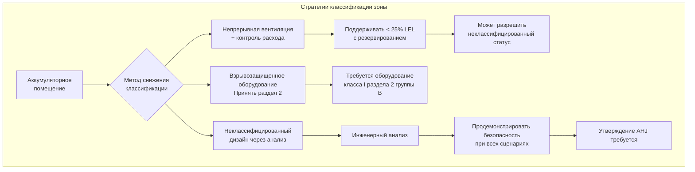
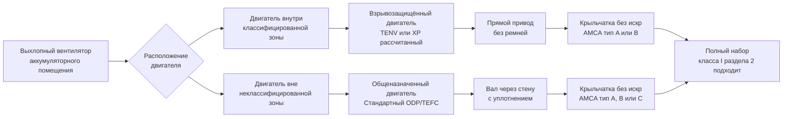
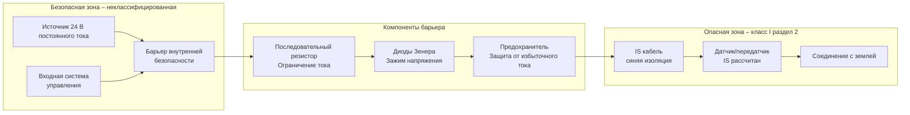
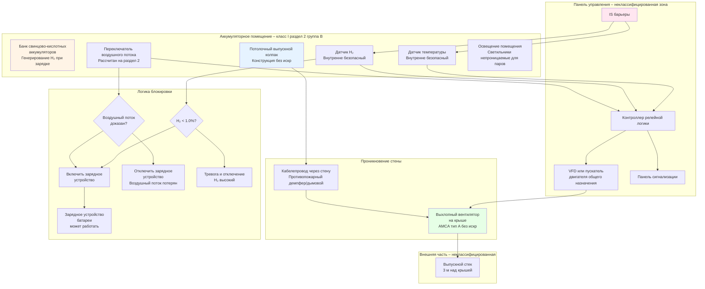

Аккумуляторные помещения со свинцово-кислотными аккумуляторами, выделяющими водород, требуют взрывозащищенного или подходящего оборудования, рассчитанного на опасные зоны класса I раздела 2 группы B согласно статье 500 NEC. При отказе системы вентиляции или ненормальных условиях концентрация водорода может достичь нижнего предела взрываемости (LEL) 4,0% по объему, создавая риск возгорания от электрических дуг, механических искр или горячих поверхностей. Правильный выбор оборудования, методы установки и классификация территории определяют, могут ли электрические источники зажигания вызвать взрывы водорода в воздухе. Этот анализ рассматривает методологию классификации опасных зон, требования к взрывозащищенному оборудованию, принципы конструкции без искр и альтернативные варианты проектирования, которые обеспечивают безопасность без полного соответствия требованиям оборудования.

## Основы классификации опасных зон

Статья 500 NEC устанавливает систематическую схему классификации зон на основе вероятности и продолжительности наличия горючего газа. Понимание этой методологии классификации является необходимым условием для определения соответствующих рейтингов оборудования.

**Трёхаксиальная система классификации:**

1. **Класс** – тип опасного материала
2. **Раздел** – вероятность и продолжительность опасной концентрации
3. **Группа** – характеристики воспламенения конкретного газа

**Зоны класса I:**

Класс I обозначает зоны, в которых присутствуют или могут присутствовать горючие газы или пары в количествах, достаточных для образования взрывоопасных или воспламеняемых смесей. Аккумуляторные помещения с выделением водорода относятся исключительно к классу I.

Фундаментальный критерий воспламенения требует одновременного наличия:
- Топлива (водорода) при концентрации между LEL и UEL
- Окислителя (атмосферного кислорода при примерно 21%)
- Источника зажигания с энергией, превышающей минимальную энергию зажигания

**Определение раздела:**

Классификация раздела зависит от временной вероятности взрывоопасной атмосферы:

| Раздел | Вероятность | Типичные условия | Применение в аккумуляторном помещении |
|--------|-------------|-------------------|---------------------------------------|
| Раздел 1 | Непрерывное или периодическое нормальное функционирование | Выход процесса, открытые сосуды, распылительные установки | Неприменимо – водород только при отказе вентиляции |
| Раздел 2 | Только ненормальные условия | Отказ вентиляции, неисправность оборудования, разрыв контейнера | Аккумуляторные помещения с непрерывной вентиляцией |

Аккумуляторные помещения с надлежащей непрерывной системой вентиляции соответствуют разделу 2, потому что взрывоопасные концентрации водорода возникают только при ненормальных условиях (отказ системы вентиляции).

**Классификация группы по свойствам газа:**

Группа B включает водород и газы с аналогичными опасными характеристиками:

| Группа | Репрезентативный газ | MESG (мм) | Соотношение MIC | Самовоспламенение (°C) |
|--------|---------------------|-----------|-----------------|----------------------|
| A | Ацетилен | <0,45 | <0,45 | 305 |
| B | Водород | 0,29 | 0,40 | 500–571 |
| C | Этилен | 0,65 | 0,60 | 425 |
| D | Метан | 1,14 | 0,80 | 537 |

MESG (максимальный экспериментальный безопасный зазор) представляет максимальный зазор между параллельными металлическими поверхностями, через который пламя не распространяется. Исключительно малый MESG водорода (0,29 мм) означает, что пламя распространяется через меньшие отверстия, чем для других горючих газов, требуя более плотных допусков корпуса для взрывозащищенного оборудования.

**Соотношение MIC (минимальный ток зажигания):**

Отношение минимального тока, требуемого для зажигания тестового газа, к метану. Соотношение MIC водорода 0,40 указывает, что он требует только 40% энергии, необходимой для зажигания метана, что демонстрирует его исключительную чувствительность к зажиганию.

## Протяженность опасной зоны класса I раздела 2

Физические границы опасной зоны определяют, где рассчитанное оборудование является обязательным, а где приемлемо общеназначенное оборудование.

**Вертикальная протяженность:**

NEC 500.5(B)(2) и инженерная практика устанавливают:

- **Внутри аккумуляторного помещения**: весь объем помещения от пола до потолка
- **Смежные пространства**: распространяется до глухих барьеров (стены, полы, потолки)
- **Проемы**: опасная классификация распространяется через проемы, если они не находятся в состоянии непрерывного давления

Физическая основа классификации всего помещения вытекает из исключительной плавучести водорода. При выпуске водород быстро поднимается и рассеивается во всем верхнем объеме помещения в течение секунд. Даже выпуск на уровне пола достигает концентрации потолка за:

$$t_{\text{rise}} = \frac{H}{u_b}$$

Где:
- $H$ = высота помещения (м)
- $u_b$ = скорость выталкивающего подъема (м/с)

Для водорода в воздухе с отношением плотности $\rho_{\text{H}_2}/\rho_{\text{воздух}} = 0,0696$:

$$u_b \approx \sqrt{2 g H \left(\frac{\rho_{\text{воздух}} - \rho_{\text{H}_2}}{\rho_{\text{воздух}}}\right)} \approx \sqrt{2 \times 9,81 \times H \times 0,93}$$

Для помещения высотой 3 м:

$$u_b \approx \sqrt{2 \times 9,81 \times 3 \times 0,93} = 7,4 \text{ м/с}$$

$$t_{\text{rise}} = \frac{3}{7,4} = 0,4 \text{ сек}$$

Это быстрое перемешивание оправдывает классификацию всего помещения, а не локализованные зоны.

**Горизонтальная протяженность:**

- **Внутренняя часть аккумуляторного помещения**: вся площадь пола внутри стен
- **Порог дверного проема**: распространяется на 0,9–1,5 м за открытыми дверями (по мнению некоторых органов власти)
- **Впуск вентиляции**: приемлемо общеназначенное оборудование, если впуск забирает воздух из неклассифицированной зоны
- **Выпуск выхлопа**: минимум 3 м от точки выпуска до границы неклассифицированной зоны

**Альтернативные варианты проектирования для уменьшения классифицированной зоны:**

## Требования к выбору взрывозащищенного оборудования

Оборудование, установленное в пределах опасных зон класса I раздела 2, должно соответствовать специфическим требованиям конструкции и производительности, чтобы предотвратить зажигание окружающей взрывоопасной атмосферы.

**Требования оборудования NEC статья 501 раздел 2:**

Оборудование должно соответствовать одному из следующих условий:
1. Указано и отмечено для зон класса I раздела 1 (превышает требования раздела 2)
2. Указано и отмечено для зон класса I раздела 2
3. Неизлучающее оборудование согласно NEC 500.7(G)
4. Общеназначенное оборудование, доказанно не производящее дуги, искры или горячие поверхности

**Характеристики взрывозащищенного оборудования класса I раздела 2 группы B:**

| Компонент | Требование раздела 2 | Физическая основа |
|-----------|----------------------|-------------------|
| Двигатели | Полностью закрытые или взрывозащищенные | Предотвращение излучения искр, содержание внутренних дуг |
| Переключатели/контакторы | Закрытые для предотвращения воздействия искр | Энергия дуги >> MIE водорода (0,017 мДж) |
| Распределительные коробки | Резьбовые жёсткие входы кабелепровода | Предотвращение распространения пламени через кабелепровод |
| Осветительные приборы | Непроницаемые для паров, закрытые, уплотнённые | Предотвращение воспламенения горячей поверхностью (соответствие T-коду) |
| Розетки | Конструкция с защитой от доступа, закрытые | Исключение дуг подключения вилки в атмосфере |
| Органы управления | Внутренняя безопасность или рассчитанные на раздел 2 | Ограничение энергии цепи ниже порога зажигания |

**Классификация температуры (T-код):**

Температуры поверхностей оборудования должны оставаться ниже температуры самовоспламенения водорода (500–571°C в зависимости от источника). NEC таблица 500.8(C) назначает T-коды:

| T-код | Максимальная температура поверхности | Подходит для водорода? |
|-------|---------------------------------------|----------------------|
| T1 | 450°C | ДА – ниже 500°C AIT |
| T2 | 300°C | ДА – значительный запас |
| T3 | 200°C | ДА – консервативно |
| T4 | 135°C | ДА – очень консервативно |
| T5 | 100°C | ДА – типичное промышленное оборудование |
| T6 | 85°C | ДА – электронное оборудование |

Водород требует минимального рейтинга T1 (предел 450°C). Большинство промышленного оборудования достигает рейтинга T3 или лучше, обеспечивая адекватный запас безопасности.

**Сравнительная таблица: требования оборудования по разделам:**

| Тип оборудования | Раздел 1 (нормальные условия) | Раздел 2 (только ненормальные) | Общеназначенное (неопасная зона) |
|-----------------|-------------------------------|--------------------------------|----------------------------------|
| Двигатель выхлопного вентилятора | Взрывозащищенный корпус, группа B | Полностью закрытый без вентиляции (TENV) или взрывозащищенный | Защита от капель (ODP) приемлема |
| Пускатель двигателя | Взрывозащищённый или продуваемый корпус | Общеназначенный в запечатанном корпусе NEMA 4 | NEMA 1 открытый корпус |
| Светильники | Взрывозащищённые с защитой | Непроницаемые для паров с закрытыми лампами | Стандартные промышленные светильники |
| Фитинги кабелепровода | Взрывозащищённые уплотнения требуются | Резьбовой жёсткий/IMC с уплотнениями на границах | Стандартные фитинги, EMT приемлем |
| Датчики температуры | Внутренне безопасный барьер | Подходящий для раздела 2 или IS | Стандартный цикл 4–20 мА |
| Панель управления | Продуваемая/под давлением NEMA 4X | NEMA 4 с запечатанными входами | NEMA 1 стандартный |

Значительная разница в стоимости и сложности между оборудованием раздела 1 и раздела 2 мотивирует тщательный анализ классификации и проектирование надёжности системы вентиляции.

## Принципы конструкции вентилятора без искр

Выхлопные вентиляторы представляют наиболее рискованное механическое оборудование, поскольку вращающиеся крыльчатки могут создавать источники зажигания посредством ударов лопаток, электростатического разряда или трения в подшипниках. Конструкция без искр исключает эти опасности.

**Стандарты конструкции, устойчивой к искрам AMCA:**

Ассоциация управления воздухом и контроля (AMCA) публикация 99-0401-86 определяет требования конструкции для вентиляторов, работающих с потенциально горючими газами:

**Тип A – конструкция без искр:**

Конструкция вентилятора, где как крыльчатка, так и корпус изготовлены из неферромагнитных материалов (алюминий, латунь, бронза), или крыльчатка неферромагнитная и между крыльчаткой и корпусом имеется минимальный зазор 0,16 см (манометр 18).

Физическая основа: искры возникают при ударе ферромагнитных металлов с достаточной энергией для превышения температуры воспламенения частиц металла:

$$E_{\text{spark}} = \frac{1}{2} m v^2$$

Где:
- $m$ = масса ударяемой частицы
- $v$ = относительная скорость при ударе

Для алюминиевой крыльчатки, ударяющей алюминиевый корпус:
- Ферромагнитный металл отсутствует для генерирования железных искр
- Алюминиевые искры имеют более низкую температуру (~660°C точка плавления против 1538°C для железа)
- Энергия обычно ниже MIE водорода

**Тип B – конструкция без искр:**

Ферромагнитная крыльчатка и ферромагнитный корпус с неферромагнитным (алюминий, латунь) кольцом или полосой на крыльчатке, которая контактирует с корпусом при трении.

Жертвенное неферромагнитное кольцо протирания гарантирует, что любой контакт происходит между не похожими мягкими металлами, предотвращая генерирование искр.

**Тип C – конструкция без искр:**

Ферромагнитная или неферромагнитная крыльчатка и корпус с минимальным зазором 0,32 см между вращающимися и неподвижными частями во всем диапазоне рабочих температур.

Достаточный зазор предотвращает контакт даже при:
- Тепловом расширении при повышенных температурах
- Прогибе вала под максимальной нагрузкой
- Износе подшипников в течение срока службы оборудования

**Выбор вентилятора для выпуска аккумуляторного помещения:**

**Исключение статического электричества:**

Вращающийся пластиковый кабелепровод или материалы крыльчатки без проводимости накапливают статический заряд через триболектрические эффекты. Накопление заряда может достичь напряжения, достаточного для электростатического разряда:

$$V = \frac{Q}{C}$$

Где:
- $V$ = напряжение (В)
- $Q$ = накопленный заряд (Кл)
- $C$ = ёмкость (Ф)

Методы смягчения:
- **Материалы крыльчатки с проводимостью**: алюминий, покрытая сталь
- **Заземление**: непрерывный электрический путь от корпуса вентилятора через кабелепровод к земле
- **Перемычки соединения**: мост через гибкие соединения, демпферы, переходы
- **Контроль влажности**: поддерживайте > 40% относительной влажности для снижения накопления статического заряда

**Рассмотрения приводов с ремнями:**

Вентиляторы с приводом от ремня вводят дополнительные источники зажигания:
- **Трение ремня**: генерирует тепло на интерфейсе шкива/ремня
- **Проскальзывание ремня**: может производить температуры, превышающие 200°C
- **Генерирование статического заряда**: резиновый ремень, движущийся над шкивом, накапливает заряд

Вентиляторы с прямым приводом исключают эти опасности. Если привод с ремнем неизбежен:
- Используйте проводящие ремни (с пропиткой углеродом)
- Свяжите шкивы и подшипники с землей
- Разместите компоненты привода вне классифицированной зоны, если возможно
- Установите детекторы проскальзывания ремня

## Схемы управления с внутренней безопасностью

Проектирование с внутренней безопасностью (IS) ограничивает энергию электрической цепи уровнями, неспособными воспламенить смесь водорода и воздуха даже в условиях отказа. Такой подход разрешает использование стандартных датчиков и проводки внутри опасных зон без взрывозащищённых корпусов.

**Фундаментальный принцип внутренней безопасности:**

Энергия, накопленная в электрических цепях, должна оставаться ниже MIE водорода при всех условиях, включая:
- Короткое замыкание
- Разомкнутую цепь
- Замыкание на землю
- Отказ компонента

MIE водорода = 0,017 мДж устанавливает теоретический максимум накопленной энергии.

**Накопление емкостной энергии:**

Энергия, накопленная в ёмкости:

$$E_C = \frac{1}{2} C V^2$$

Для схем внутренней безопасности (класс I раздел 2 группа B):

$$E_C < 0,017 \text{ мДж}$$

$$\frac{1}{2} C V^2 < 0,017 \times 10^{-3} \text{ Дж}$$

Для схемы 24 В постоянного тока:

$$C < \frac{2 \times 0,017 \times 10^{-3}}{(24)^2} = 5,9 \times 10^{-8} \text{ Ф} = 59 \text{ нФ}$$

Общая ёмкость цепи (датчик + кабель + барьер) должна оставаться ниже примерно 60 нФ.

**Накопление индуктивной энергии:**

Энергия, накопленная в индуктивности:

$$E_L = \frac{1}{2} L I^2$$

Для схем внутренней безопасности:

$$L < \frac{2 \times 0,017 \times 10^{-3}}{I^2}$$

Для тока цикла 100 мА:

$$L < \frac{2 \times 0,017 \times 10^{-3}}{(0,1)^2} = 3,4 \text{ мГн}$$

**Проектирование барьера внутренней безопасности:**

Барьеры диода Зенера ограничивают напряжение и ток в условиях отказа:

**Выбор параметров барьера:**

Для цикла датчика водорода (класс I раздел 2 группа B):
- Максимальное напряжение: 28 В постоянного тока (зажим диода Зенера)
- Максимальный ток: 100 мА (последовательный резистор)
- Максимальная мощность: 2,8 Вт (хорошо ниже порога зажигания)
- Лимит ёмкости кабеля: 0,06 мкФ
- Лимит индуктивности кабеля: 3 мГн

**Требования установки:**

NEC статья 504 требует:
- Проводка IS с синей цветовой кодировкой (отличается от не-IS цепей)
- Разделение от не-IS цепей (минимум 5 см или заземлённый барьер)
- Выделенные трассы кабелепровода IS (нет смешивания с напряжением сети)
- Барьеры, установленные в неклассифицированной зоне
- Заземление датчика в одной точке (предотвращение земельных петель)

## Расчёты разбавления LEL для выбора оборудования

Определение необходимых расходов вентиляции для поддержания концентрации водорода ниже 25% LEL (1,0% по объему) устанавливает, является ли классификация раздела 2 надлежащей, или достижимо неклассифицированное проектирование.

**Максимально допустимая концентрация водорода:**

Стандарты безопасности указывают пределы максимальной концентрации водорода:

| Стандарт | Максимальная концентрация | Основа | Процент LEL |
|----------|--------------------------|--------|------------|
| NFPA 1 | 1,0% по объему | Общая безопасность | 25% от 4,0% LEL |
| IEEE 484 | 1,0% по объему | Консервативное проектирование | 25% от LEL |
| IBC раздел 414 | 2,0% по объему (с контролем) | Повышенный лимит с непрерывным контролем | 50% от LEL |
| Граница классификации | 1,0% по объему | Порог классификации раздела 2 | 25% от LEL |

Поддержание концентрации ниже 1,0% посредством непрерывной вентиляции поддерживает классификацию раздела 2, потому что взрывоопасные концентрации (>4,0%) возникают только при отказе вентиляции (ненормальное условие).

**Выведение уравнения разбавления:**

Баланс масс для хорошо перемешанного разбавления водорода:

$$V \frac{dC}{dt} = Q_{\text{H}_2} - Q_v C$$

Где:
- $V$ = объём помещения (м³)
- $C$ = концентрация водорода (доля)
- $Q_{\text{H}_2}$ = скорость генерирования водорода (м³/мин)
- $Q_v$ = скорость вентиляции (м³/ч)

При установившемся состоянии ($dC/dt = 0$):

$$C_{\text{ss}} = \frac{Q_{\text{H}_2}}{Q_v}$$

Переформатирование для необходимой вентиляции:

$$Q_v = \frac{Q_{\text{H}_2}}{C_{\text{max}}}$$

Применение коэффициента безопасности $F_s$ (типично минимум 4,0):

$$Q_v = \frac{Q_{\text{H}_2} \times F_s}{C_{\text{max}}}$$

Преобразование в процентное основание:

$$Q_v = \frac{Q_{\text{H}_2} \times 100 \times F_s}{C_{\text{max,\%}}}$$

**Пример расчёта проектирования:**

Параметры системы аккумулятора:
- Строка аккумулятора: 120 элементов (240 В номинальный постоянный ток)
- Тип аккумулятора: свинцово-кислотный с залитым электролитом
- Ток уравнивания: 300 А
- Коэффициент ёмкости $C = 0,00042$ (свинцово-кислотный залитый)
- Коэффициент уравнивания $F_{\text{eq}} = 1,5$

Скорость генерирования водорода:

$$Q_{\text{H}_2} = \frac{N \times I \times C \times F_{\text{eq}}}{1 \times 10^6} = \frac{120 \times 300 \times 0,00042 \times 1,5}{1 \times 10^6}$$

$$Q_{\text{H}_2} = \frac{22,68}{10^6} = 0,00002268 \text{ м}^3/\text{мин}$$

Необходимая скорость разбавления вентиляции (цель 25% LEL, $C_{\text{max}} = 1,0\%$, коэффициент безопасности $F_s = 4,0$):

$$Q_v = \frac{0,00002268 \times 100 \times 4,0}{1,0} = 0,00907 \text{ м}^3/\text{мин}$$

**Сравнение предписывающего минимума NFPA 1:**

Размеры помещения: 4,6 м × 6,1 м = 28 м²

$$Q_{\text{NFPA}} = 0,47 \text{ м}^3/\text{мин на м}^2 \times 28 = 13,2 \text{ м}^3/\text{мин}$$

Скорость вентиляции проектирования:

$$Q_{\text{design}} = \max(0,00907, 13,2) \times 1,25 = 16,5 \text{ м}^3/\text{мин}$$

Предписывающий минимум NFPA преобладает (как типично для небольших и средних аккумуляторных помещений).

**Анализ сценария отказа вентиляции:**

При непрерывной вентиляции 16,5 м³/мин, поддерживающей концентрацию в установившемся состоянии:

$$C_{\text{operating}} = \frac{0,00002268}{16,5} = 1,4 \times 10^{-6} = 0,00014\%$$

При отказе вентиляции ($Q_v = 0$), концентрация повышается:

$$C(t) = \frac{Q_{\text{H}_2}}{V} \times t$$

Объём помещения: $V = 4,6 \times 6,1 \times 3 = 84,4$ м³

Время достижения 1,0% (порог классификации раздела 2):

$$t_{1.0\%} = \frac{C_{\text{max}} \times V}{Q_{\text{H}_2}} = \frac{0,01 \times 84,4}{0,00002268} = 37,190 \text{ мин} = 25,8 \text{ дней}$$

Время достижения 4,0% LEL (воспламеняемая концентрация):

$$t_{\text{LEL}} = \frac{0,04 \times 84,4}{0,00002268} = 148,761 \text{ мин} = 103 \text{ дня}$$

Исключительно долгое время до LEL демонстрирует, что взрывоопасные концентрации возникают только при продолжительном отказе вентиляции (ненормальное условие), поддерживающем классификацию раздела 2, а не раздела 1.

**Преходящий анализ с блокировкой:**

Если блокировка зарядного устройства отключает зарядку при потере воздушного потока, генерирование водорода прекращается:

$$Q_{\text{H}_2} = 0 \text{ (зарядное устройство выключено)}$$

Максимальная концентрация остаётся при рабочем значении (по сути нуль), исключая опасность полностью. Это демонстрирует, что надёжный мониторинг вентиляции с блокировкой зарядного устройства может потенциально поддерживать неклассифицированное проектирование.

## Архитектура взрывозащищённой системы вентиляции

Проектирование полной системы интегрирует компоненты взрывозащиты в комплексную архитектуру безопасности.

**Технические характеристики компонентов:**

1. **Узел выхлопного вентилятора:**
   - Центробежный с обратно направленной лопастью, компоновка AMCA 1 (вентилятор, установленный на валу двигателя)
   - Крыльчатка из алюминия, корпус из алюминия (AMCA тип A без искр)
   - Двигатель: TEFC (полностью закрытый с охлаждением вентилятором), класс I раздел 2 группа B рассчитан
   - Прямой привод (без ремней), подшипники с постоянной смазкой
   - Производительность: 9,3 м³/мин при 37 Па статического давления
   - Двигатель: 0,2 кВт, 1725 об/мин, 230/460 В трёхфазный

2. **Выхлопной кабелепровод:**
   - Материал: оцинкованная сталь, сварная конструкция
   - Заземление: непрерывная электрическая связь с заземлением здания
   - Трассировка: минимизируйте горизонтальные участки, поддерживайте непрерывный подъём к выпуску
   - Переходы: концентрические редукторы (избегайте резких изменений площади)
   - Опоры: неискрящие пластиковые или резиновые прокладки зажимов

3. **Датчик водорода:**
   - Технология: электрохимический элемент (диапазон 0–4%)
   - Точность: ±0,1% абсолютное
   - Расположение: в пределах 30 см от потолка, центральное в помещении
   - Питание: 24 В постоянного тока через барьер внутренней безопасности
   - Выход: 4–20 мА (4 мА = 0%, 20 мА = 4%)
   - Уставки тревоги: 1,0% (тревога), 2,0% (отключение)

4. **Переключатель воздушного потока:**
   - Тип: переключатель перепада давления, контролирующий статическое давление кабелепровода
   - Уставка: 25 Па (регулируемая)
   - Контакты: SPDT рассчитан для класса I раздела 2
   - Задержка по времени: регулируемая 0–60 сек (предотвращение ложных срабатываний)

5. **Последовательность управления:**
   - Запуск вентилятора → задержка 30 сек → воздушный поток доказан → включить зарядное устройство
   - Воздушный поток потерян → немедленное отключение зарядного устройства + локальная тревога
   - H₂ > 1,0% → тревога (зарядное устройство продолжает работу, если оператор согласен)
   - H₂ > 2,0% → отключение зарядного устройства + эвакуационная тревога

## Альтернативные варианты проектирования: неклассифицированный статус

Некоторые юрисдикции разрешают аккумуляторным помещениям получать статус неклассифицированного (неопасного), если инженерный анализ демонстрирует, что концентрация водорода остаётся ниже 25% LEL при всех возможных сценариях отказа.

**Критерии неклассифицированного статуса:**

1. **Резервная вентиляция:** конфигурация вентилятора N+1 с автоматическим переводом
2. **Непрерывный мониторинг:** датчики водорода с подтверждённой надёжностью
3. **Автоматическое отключение зарядного устройства:** немедленная блокировка при потере воздушного потока или обнаружении H₂
4. **Административный контроль:** документированные процедуры обслуживания, калибровки, тестирования
5. **Утверждение органом власти:** AHJ должно принять анализ и оценку риска

**Анализ видов отказов и последствий (FMEA):**

| Вид отказа | Вероятность | Обнаружение | Смягчение | Остаточный риск |
|-----------|-----------|-----------|----------|-----------------|
| Отказ одного вентилятора | средняя | Переключатель расхода, второй вентилятор автозапуск | Резервный вентилятор поддерживает вентиляцию | низкий – нет накопления H₂ |
| Отключение электроэнергии | низкая | ИБП питает критические системы | Вентилятор и мониторинг на резервной батарее | низкий – зарядное устройство также теряет питание |
| Отказ датчика H₂ | низкая | Калибровка каждые 90 дней, двойные датчики | Резервные датчики, логика голосования | низкий – деградированный режим тревоги |
| Отказ переключателя расхода | низкая | Ежемесячный функциональный тест | Ручная проверка, проверка калибровки | средний – требует админ управления |
| Множественные одновременные отказы | очень низкая | Комплексный мониторинг | Административная эвакуация при двух отказах | низкий – вероятность × последствия |

**Экономический анализ:**

| Вариант проектирования | Стоимость оборудования | Стоимость установки | Операционная стоимость | Общая стоимость 20 лет LCC |
|----------------------|----------------------|-------------------|----------------------|------------------------|
| Оборудование класса I раздела 2 | 10 500–17 500 € | 5 600–8 400 € | Стандартное обслуживание | 19 600–29 400 € |
| Неклассифицированная с резервированием | 17 500–24 500 € | 8 400–12 600 € | Улучшенное обслуживание + калибровка | 31 500–45 500 € |
| Раздел 1 (сверх консервативный) | 35 000–52 500 € | 14 000–21 000 € | Специализированное обслуживание | 59 500–87 500 € |

Классификация раздела 2 представляет соответствующий кодексу, экономически эффективный подход для стандартных приложений аккумуляторных помещений. Неклассифицированное проектирование подходит для критических объектов, оправдывающих дополнительные капитальные и операционные инвестиции. Оборудование раздела 1 не требуется, учитывая, что водород появляется только при ненормальных условиях.

## Справочная информация по кодексам и соответствию

**NFPA 70 (Национальный электротехнический кодекс):**

- **Статья 480**: накопительные аккумуляторы – общие требования к установке аккумулятора, вентиляции, классификации территории
- **Статья 500.5(B)**: зоны класса I раздела 2 – определяет территории, где воспламеняемые концентрации существуют при ненормальных условиях
- **Статья 501.10**: методы проводки класса I раздела 2 – требуется герметичный кабелепровод, взрывозащищённые фитинги
- **Статья 501.125**: двигатели и генераторы в разделе 2 – конструкция TENV или взрывозащищённая
- **Статья 504**: системы внутренней безопасности – ограничение энергии для цепей в опасных зонах
- **Таблица 500.8(C)**: максимальная температура поверхности в зависимости от T-кода – T1 (450°C) минимум для водорода

**NFPA 1 (пожарный кодекс):**

- **Раздел 52.1.9**: системы аккумуляторов – предписывающий минимум вентиляции 0,47 м³/мин на м²
- **Раздел 52.1.9.3**: расположение выпуска выхлопа – 3 м от впусков, линий собственности

**IEEE 484:**

- **Раздел 5.8.3**: расчёты вентиляции – методология скорости генерирования водорода
- **Раздел 5.8.4**: коэффициенты безопасности – минимум 4,0× коэффициент безопасности для расчётов разбавления

## Проверка установки и ввода в эксплуатацию

Комплексное тестирование проверяет функциональность взрывозащищённой системы перед эксплуатацией аккумуляторного помещения.

**Предварительные чек-листы:**

- [ ] Все входы кабелепровода герметизированы согласно NEC 501.15
- [ ] Резьбовой жёсткий (RMC) или промежуточный (IMC) кабелепровод использован во всех классифицированных зонах
- [ ] Таблички оборудования подтверждают рейтинги класса I раздела 2 группы B
- [ ] Конструкция вентилятора без искр сертифицирована согласно AMCA 99-0401-86
- [ ] Непрерывность заземления проверена от вентилятора через кабелепровод к заземлению здания (<1 Ω сопротивление)
- [ ] Барьеры внутренней безопасности установлены в неклассифицированной зоне
- [ ] Проводка IS закодирована синим и отделена от не-IS цепей
- [ ] Датчик водорода откалиброван с помощью сертифицированного калибровочного газа 2,0%
- [ ] Уставка перепада давления переключателя воздушного потока проверена
- [ ] Направление вращения двигателя правильное для выпуска

**Тесты функциональной производительности:**

1. **Проверка воздушного потока:**
   - Измеьте выпускной расход, используя питотажный траверс или откалиброванный капот
   - Подтвердите ≥ проектный CFM при всех условиях эксплуатации
   - Задокументируйте статическое давление на входе вентилятора

2. **Последовательность блокировки:**
   - Смоделируйте потерю воздушного потока (закройте заслонку или остановите вентилятор)
   - Подтвердите немедленное отключение зарядного устройства
   - Подтвердите активацию тревоги
   - Протестируйте функциональность ручного сброса

3. **Обнаружение водорода:**
   - Подайте к датчику калибровочный газ 2,0%
   - Подтвердите тревогу на уставке 1,0% (через выход 4–20 мА)
   - Подтвердите отключение на уставке 2,0%
   - Подтвердите ответ панели управления

4. **Проверка резервирования (если применимо):**
   - Смоделируйте отказ первичного вентилятора
   - Подтвердите автоматический запуск вторичного вентилятора
   - Измерьте задержку времени до восстановления воздушного потока
   - Подтвердите отсутствие прерывания зарядного устройства во время переключения

**Пакет документации:**

- Данные отправки оборудования с сертификатами класса I раздела 2 группы B
- Рабочие чертежи, показывающие границы опасной зоны
- Однолинейная электрическая схема с логикой блокировки
- Результаты тестирования при вводе в эксплуатацию с измеренными значениями
- Руководства по эксплуатации и техническому обслуживанию для взрывозащищённого оборудования
- Свидетельства о калибровке датчиков и приборов

Системы взрывозащищённой вентиляции аккумуляторных помещений предотвращают катастрофические взрывы водорода посредством надлежащей классификации оборудования, конструкции механических компонентов без искр, схем управления с внутренней безопасностью и комплексной логики блокировки. Консервативное применение стандартов NEC для опасных зон, в сочетании с надёжной непрерывной вентиляцией и мониторингом, поддерживает концентрацию водорода надёжно ниже пределов взрываемости на протяжении всего срока службы аккумулятора.
