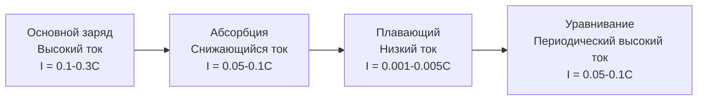
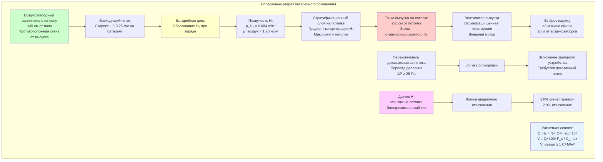

Выделение водорода при заряде батареи представляет основную опасность, требующую инженерно спроектированной вентиляции в стационарных установках батарей. Электрохимическое разложение воды на водород и кислород происходит, когда напряжение заряда превышает пороговое значение газообразования свинцово-кислотных элементов. Количественное определение скоростей образования водорода требует понимания фундаментальной электрохимии, соотношений токов заряда, температурных эффектов и специфических характеристик батареи. IEEE 1635 и IEEE 484 предоставляют стандартизированные методологии расчета, учитывающие тип батареи, режим заряда и эксплуатационные факторы для определения расчетных скоростей эволюции водорода.

## Электрохимический механизм образования водорода

При заряде батареи электрическая энергия преобразуется в химическую энергию через электрохимические реакции на границе электрод-электролит. Выше критического напряжения возникают паразитные реакции электролиза воды наряду с требуемыми реакциями заряда.

**Основная реакция заряда (свинцово-кислотная батарея):**

На отрицательной пластине при заряде:

$$\text{PbSO}_4 + 2\text{H}^+ + 2e^- \rightarrow \text{Pb} + \text{H}_2\text{SO}_4$$

На положительной пластине при заряде:

$$\text{PbSO}_4 + 2\text{H}_2\text{O} \rightarrow \text{PbO}_2 + \text{H}_2\text{SO}_4 + 2\text{H}^+ + 2e^-$$

**Реакция паразитного электролиза:**

Когда напряжение элемента превышает напряжение газообразования, происходит электролиз воды:

На отрицательной пластине:

$$2\text{H}^+ + 2e^- \rightarrow \text{H}_2 \uparrow$$

На положительной пластине:

$$2\text{H}_2\text{O} \rightarrow \text{O}_2 \uparrow + 4\text{H}^+ + 4e^-$$

Стехиометрия дает 2 моля H₂ на каждый моль O₂, создавая объемное соотношение газов 2:1.

**Физика порога напряжения газообразования:**

Термодинамический потенциал разложения воды при стандартных условиях:

$$E^0 = 1.229 \text{ В при 25°C}$$

Для свинцово-кислотного элемента (2.0 В номинально) напряжение газообразования появляется около 2.30-2.40 В на элемент вследствие:

1. **Требования к перенапряжению:** Активационное перенапряжение ($\eta_{\text{act}}$) и концентрационное перенапряжение ($\eta_{\text{conc}}$) должны быть преодолены до того, как эволюция газа происходит с измеримыми скоростями.

2. **Температурная зависимость:** Уравнение Нернста описывает соотношение напряжение-температура:

$$E = E^0 - \frac{RT}{nF} \ln Q$$

Где:
- $E$ = Потенциал элемента (В)
- $E^0$ = Стандартный потенциал (В)
- $R$ = Газовая постоянная (8.314 Дж/моль·К)
- $T$ = Абсолютная температура (К)
- $n$ = Число передаваемых электронов
- $F$ = Постоянная Фарадея (96 485 Кл/моль)
- $Q$ = Коэффициент реакции

Напряжение газообразования уменьшается приблизительно на 3-5 мВ на °C при повышении температуры. При повышенных температурах батареи (35-40°C) газообразование начинается при более низких напряжениях.

**Сравнение режимов заряда:**

| Режим заряда | Напряжение на элемент | Поведение газообразования | Образование водорода |
|-------------|----------------------|-------------------------|----------------------|
| Плавающий заряд | 2.25-2.30 В | Минимальное или отсутствует | <1% от скорости уравнивания |
| Повторный заряд (основной) | 2.35-2.50 В | Умеренное в конце заряда | 10-30% от скорости уравнивания |
| Уравнивание | 2.50-2.65 В | Непрерывное интенсивное газообразование | Расчетная основа (100%) |
| Быстрый заряд | 2.40-2.60 В | Значительное во всем процессе | 50-100% от скорости уравнивания |

Заряд с уравниванием представляет наихудшее условие для образования водорода и устанавливает расчетную основу для вентиляционных расчетов.

## Применение закона Фарадея к образованию водорода

Законы электролиза Фарадея обеспечивают теоретическую основу для расчета эволюции водорода из тока заряда.

**Первый закон:** Масса вещества, образующегося на электроде, пропорциональна количеству пропущенного электричества (заряду).

**Второй закон:** Масса различных веществ, образующихся при пропускании одного и того же количества электричества, пропорциональна их эквивалентным массам.

**Теоретический расчет объема водорода:**

$$V_{\text{H}_2} = \frac{I \cdot t}{n \cdot F} \cdot V_m \cdot N_{\text{cells}}$$

Где:
- $V_{\text{H}_2}$ = Объем водорода при СТУ (л)
- $I$ = Ток на элемент (А)
- $t$ = Время (с)
- $n$ = Электроны на молекулу H₂ (n = 2)
- $F$ = Постоянная Фарадея (96 485 Кл/моль)
- $V_m$ = Молярный объем при СТУ (22.414 л/моль)
- $N_{\text{cells}}$ = Число элементов

**Скорость образования водорода (объемная):**

Принимая производную по времени:

$$\dot{V}_{\text{H}_2} = \frac{I \cdot V_m \cdot N_{\text{cells}}}{n \cdot F}$$

Подставляя константы:

$$\dot{V}_{\text{H}_2} = \frac{I \cdot 22.414 \cdot N_{\text{cells}}}{2 \cdot 96 485} = 1.162 \times 10^{-4} \cdot I \cdot N_{\text{cells}} \text{ л/с}$$

Преобразование в м³/ч:

$$\dot{V}_{\text{H}_2} = 4.183 \times 10^{-4} \cdot I \cdot N_{\text{cells}} \text{ м}^3/\text{ч}$$

**Практический коэффициент эффективности:**

Не весь ток заряда производит водород. Коэффициент эффективности тока ($\epsilon$) учитывает:
- Ток, используемый для фактического заряда батареи (желаемый)
- Ток, потребляемый выделением водорода/кислорода (нежелаемый)
- Потери тока через саморазряд и побочные реакции

При плавающем заряде: $\epsilon_{\text{gassing}} \approx 1$-5%
При уравнивании: $\epsilon_{\text{gassing}} \approx 15$-30%

Скорость образования водорода с коэффициентом эффективности:

$$\dot{V}_{\text{H}_2,actual} = \epsilon_{\text{gassing}} \cdot 4.183 \times 10^{-4} \cdot I \cdot N_{\text{cells}}$$

## Методы расчета IEEE 1635 и IEEE 484

Стандарты IEEE предоставляют эмпирически полученные уравнения, которые учитывают измеренное поведение батареи, а не чисто теоретические расчеты.

**Эмпирическое уравнение IEEE 484:**

$$Q_{\text{H}_2} = \frac{N \cdot I \cdot C \cdot F_{\text{eq}}}{1 \times 10^6}$$

Где:
- $Q_{\text{H}_2}$ = Скорость образования водорода (м³/ч)
- $N$ = Число элементов
- $I$ = Ток заряда на элемент (А)
- $C$ = Коэффициент емкости (безразмерный)
- $F_{\text{eq}}$ = Коэффициент уравнивания (обычно 1.5)

**IEEE 1635 (для VRLA батарей):**

IEEE 1635 предоставляет специальные рекомендации для герметичных свинцово-кислотных батарей (VRLA), которые используют внутреннюю рекомбинацию газа:

$$Q_{\text{H}_2,VRLA} = \frac{N \cdot I \cdot K_{\text{VRLA}}}{1 \times 10^6}$$

Где $K_{\text{VRLA}}$ — коэффициент, специфичный для VRLA, учитывающий эффективность рекомбинации.

**Получение коэффициента емкости:**

Коэффициент емкости $C$ соотносится с коэффициентом эффективности тока и включает эмпирические поправки:

$$C = f_{\text{battery}} \cdot f_{\text{temp}} \cdot f_{\text{age}}$$

Где:
- $f_{\text{battery}}$ = Коэффициент типа батареи
- $f_{\text{temp}}$ = Температурная поправка
- $f_{\text{age}}$ = Коэффициент старения (газообразование увеличивается с возрастом батареи)

## Образование водорода различными типами батарей

Различные химические состава батарей проявляют характерные особенности эволюции водорода на основе их электрохимической конструкции и принципов работы.

### Залитые свинцово-кислотные батареи

Залитые (вентилируемые) свинцово-кислотные батареи имеют прямой контакт жидкого электролита с пластинами и позволяют свободный выпуск газа.

**Характеристики:**
- Наивысшая скорость образования водорода среди свинцово-кислотных типов
- Непрерывная потеря воды требует периодического долива
- Прямой путь газа от электродов к вентиляционным заглушкам
- Отсутствует механизм внутренней рекомбинации

**Коэффициент емкости:** $C = 0.00042$ (IEEE 484)

**Типичные скорости газообразования:**

При 25°C с зарядом уравнивания (2.6 В на элемент, 10% скорости C₁₀):

Для батареи 1000 Ач (ток уравнивания 100 А):

$$Q = \frac{60 \times 100 \times 0.00042 \times 1.5}{10^6} = 3.78 \times 10^{-3} \text{ м}^3/\text{ч}$$

$$Q = 0.227 \text{ м}^3/\text{час}$$

### VRLA батареи (тип AGM)

Батареи Absorbed Glass Mat (AGM) иммобилизируют электролит в сепараторах из стеклопластика и используют цикл рекомбинации кислорода.

**Цикл рекомбинации кислорода:**

На положительной пластине при перезаряде:
$$2\text{H}_2\text{O} \rightarrow \text{O}_2 + 4\text{H}^+ + 4e^-$$

Кислород мигрирует через обедненный электролит к отрицательной пластине:
$$\text{O}_2 + 2\text{Pb} + 2\text{H}_2\text{SO}_4 \rightarrow 2\text{PbSO}_4 + 2\text{H}_2\text{O}$$

Эта рекомбинация преобразует выделившийся кислород обратно в воду, предотвращая выпуск газа при нормальных условиях.

**Эффективность рекомбинации:** Обычно 95-99% при нормальной работе

**Внешнее образование водорода:** Только неутилизированный водород (1-5%) выводится снаружи

**Коэффициент емкости:** $C = 0.0005$ (немного выше теоретического из-за неполной рекомбинации)

**Риск теплового разгона:** Отказ рекомбинации может вызвать тепловой разгон с массивным образованием газа. Вентиляция должна обрабатывать как нормальные, так и аварийные сценарии.

### VRLA батареи (тип гель)

Гелевые батареи используют электролит, гелифицированный диоксидом кремния, обеспечивающий еще лучшую эффективность рекомбинации, чем AGM.

**Характеристики:**
- Электролит гелифицирован дымовым кремнеземом (SiO₂)
- Транспорт кислорода через микроскопические трещины в геле
- Очень низкая потеря воды
- Наиболее низкая скорость газообразования среди свинцово-кислотных типов

**Коэффициент емкости:** $C = 0.0003$

**Температурная чувствительность:** Гелевые батареи более чувствительны к температуре. Повышенные температуры могут повредить структуру геля и увеличить газообразование.

### Чистые свинцовые батареи

Технология чистого свинца с тонкими пластинами использует свинец чистотой 99.99% (в отличие от свинца с кальцием или сурьмой) с чрезвычайно тонкими пластинами.

**Преимущества:**
- Минимальная коррозия сетки
- Более низкое плавающее напряжение (2.23-2.27 В на элемент)
- Снижение газообразования при плавающем заряде
- Более длительный срок службы

**Коэффициент емкости:** $C = 0.0002$ (наиболее низкий среди свинцово-кислотных химических составов)

### Литий-ионные батареи

Литий-ионные батареи принципиально отличаются от свинцово-кислотных в своем принципе работы и характеристиках образования газа.

**Нормальная работа:** Нулевое образование водорода. Процесс интеркаляции лития не производит газ:

$$\text{LiC}_6 \leftrightarrow \text{Li}^+ + e^- + \text{C}_6$$

**Аномальные условия (тепловой разгон):**

Разложение электролита при повышенных температурах выделяет:
- Карбонаты и органические растворители (горючие пары)
- CO, CO₂ (удушающие газы)
- HF (токсичный газ из разложения соли LiPF₆)
- Минимальное образование водорода (не главная задача)

**Подход к вентиляции:** Событийный, а не непрерывный. Обнаружение-активируемая высокообъемная продувка в сравнении с непрерывным разбавлением для свинцово-кислотных батарей.

## Влияние скорости заряда на образование водорода

Скорость образования водорода проявляет почти линейную зависимость от тока заряда, но распределение тока варьируется по стадиям заряда.

**Профиль тока заряда (заряд с постоянным напряжением):**

**Приемка тока и газообразование:**

| Состояние заряда | Приемка тока | Ток газообразования | Примечания |
|-----------------|--------------|-------------------|-----------|
| 0-70% SOC | Почти 100% | <5% от всего | Минимальное газообразование |
| 70-90% SOC | 80-90% | 10-20% от всего | Умеренное газообразование начинается |
| 90-100% SOC | 50-70% | 30-50% от всего | Значительное газообразование |
| 100% SOC (уравнивание) | <30% | >70% от всего | Максимальная скорость газообразования |

**Соотношение скорости образования водорода:**

$$Q_{\text{H}_2} = k \cdot I \cdot (1 - \text{SOC})^{-\alpha}$$

Где:
- $k$ = Константа, специфичная для батареи
- $I$ = Ток заряда
- SOC = Состояние заряда (0 к 1)
- $\alpha$ = Эмпирический показатель степени (обычно 1.5-2.5)

Эта зависимость демонстрирует экспоненциальное увеличение газообразования по мере того, как батарея приближается к полному заряду.

**Проектные значения:**

Заряд с уравниванием при 100% SOC обеспечивает расчетную основу для скорости образования водорода, даже при том, что он происходит периодически (ежемесячно или ежеквартально). Системы непрерывной вентиляции, спроектированные для скорости уравнивания, безопасно обрабатывают все другие режимы заряда.

## Температурные эффекты на эволюцию водорода

Температура батареи глубоко влияет на образование водорода через множество физических механизмов.

**Термодинамический эффект:**

Изменение свободной энергии Гиббса для электролиза воды:

$$\Delta G = \Delta H - T\Delta S$$

По мере повышения температуры потенциал равновесия снижается (уравнение Нернста):

$$\frac{dE}{dT} = \frac{\Delta S}{nF}$$

Для электролиза воды: $\frac{dE}{dT} \approx -0.85 \text{ мВ/К}$

**Кинетический эффект:**

Скорость реакции следует отношению Аррениуса:

$$k(T) = A \exp\left(-\frac{E_a}{RT}\right)$$

Принимая производную:

$$\frac{dk}{dT} = \frac{E_a}{RT^2} \cdot k$$

Для типичных энергий активации ($E_a = 40$-60 кДж/моль) скорость реакции приблизительно удваивается для каждого повышения температуры на 10°C (правило Q₁₀).

**Комбинированная температурная поправка:**

Стандарты IEEE рекомендуют коэффициент температурной поправки:

$$F_T = 1 + \beta(T - T_{\text{ref}})$$

Где:
- $T$ = Рабочая температура (°C)
- $T_{\text{ref}}$ = Референтная температура (25°C)
- $\beta$ = Температурный коэффициент (0.010-0.015 на °C)

**Скорректированное образование водорода:**

$$Q_{\text{H}_2,T} = Q_{\text{H}_2,25} \times F_T = Q_{\text{H}_2,25} \times [1 + \beta(T-25)]$$

**Практический пример:**

Батарейное помещение при 35°C с $\beta = 0.012$:

$$F_T = 1 + 0.012(35-25) = 1.12$$

Образование водорода увеличивается на 12% в сравнении с референтной точкой 25°C.

**Выбор расчетной температуры:**

| Климат/Применение | Расчетная температура | Обоснование |
|-------------------|----------------------|------------|
| Кондиционируемое телекоммуникационное помещение | 25-30°C | Контролируемая окружающая среда |
| Некондиционируемое здание | 30-35°C | Вариации внешней температуры |
| Наружный кожух (жаркий климат) | 40-50°C | Прямое солнечное излучение |
| Наружный кожух (холодный климат) | 25-30°C | Подогрев батареи поддерживает минимальную температуру |

Консервативный расчет использует максимально предполагаемую температуру батареи в течение срока службы.

## Примеры расчета скорости образования водорода

### Пример 1: Залитая батарейная цепь

**Параметры системы:**
- Батарея: 60-элементная залитая свинцово-кислотная (125 VDC номинально)
- Емкость: 1200 Ач при 8-часовой норме
- Ток заряда уравнивания: 120 А (0.1C норма)
- Коэффициент типа батареи: $C = 0.00042$
- Коэффициент уравнивания: $F_{\text{eq}} = 1.5$
- Рабочая температура: 30°C ($\beta = 0.012$)

**Шаг 1: Расчет базового образования водорода (25°C):**

$$Q_{25} = \frac{N \cdot I \cdot C \cdot F_{\text{eq}}}{10^6} = \frac{60 \times 120 \times 0.00042 \times 1.5}{10^6}$$

$$Q_{25} = \frac{4.536}{10^6} = 4.536 \times 10^{-6} \text{ м}^3/\text{ч}$$

Преобразование в м³/ч:

$$Q_{25} = 4.536 \times 10^{-6} \times 1 = 4.536 \times 10^{-6} \text{ м}^3/\text{ч}$$

**Шаг 2: Применение температурной поправки:**

$$F_T = 1 + 0.012(30-25) = 1.06$$

$$Q_{30} = 4.536 \times 10^{-6} \times 1.06 = 4.808 \times 10^{-6} \text{ м}^3/\text{ч}$$

**Шаг 3: Расчет требуемой вентиляции (уравнение разбавления):**

$$V_{\text{req}} = \frac{Q_{\text{H}_2} \times 100 \times F_s}{C_{\text{max}}}$$

Где:
- $F_s = 4.0$ (коэффициент безопасности IEEE 484)
- $C_{\text{max}} = 1.0\%$ (25% от 4% НПВ)

$$V_{\text{req}} = \frac{4.808 \times 10^{-6} \times 100 \times 4.0}{1.0} = 1.923 \times 10^{-4} \text{ м}^3/\text{ч}$$

Преобразование в CFM (1 CFM = 1.699 м³/ч):

$$V_{\text{req}} = \frac{1.923 \times 10^{-4}}{1.699} = 1.132 \times 10^{-4} \text{ CFM}$$

**Шаг 4: Сравнение с минимумом NFPA 1 (1 CFM/м²):**

Площадь батарейного помещения: 13.9 м²

$$V_{\text{NFPA}} = 1.0 \times 13.9 = 13.9 \text{ CFM (0.0082 м}^3\text{/ч)}$$

**Расчетный расход вентиляции:**

$$V_{\text{design}} = \max(0.000192, 13.9) \times 1.25 = 13.9 \times 1.25 = 17.4 \text{ CFM}$$

Округление до стандартного размера вентилятора: **18 CFM (0.0106 м³/ч)**

### Пример 2: Несколько VRLA батарейных цепей

**Параметры системы:**
- Конфигурация: Четыре параллельные цепи VRLA (AGM)
- Элементы на цепь: 120 элементов (240 VDC номинально)
- Ток уравнивания на цепь: 80 А
- Коэффициент типа батареи: $C = 0.0005$ (VRLA AGM)
- Коэффициент уравнивания: $F_{\text{eq}} = 1.5$
- Рабочая температура: 25°C (поправка не требуется)

**Образование водорода на цепь:**

$$Q_{\text{string}} = \frac{120 \times 80 \times 0.0005 \times 1.5}{10^6} = 7.2 \times 10^{-6} \text{ м}^3/\text{ч}$$

**Общее образование водорода (4 цепи):**

$$Q_{\text{total}} = 4 \times 7.2 \times 10^{-6} = 2.88 \times 10^{-5} \text{ м}^3/\text{ч}$$

**Требуемая вентиляция:**

$$V_{\text{req}} = \frac{2.88 \times 10^{-5} \times 100 \times 4.0}{1.0} = 1.152 \times 10^{-3} \text{ м}^3/\text{ч}$$

Преобразование в CFM:

$$V_{\text{req}} = \frac{1.152 \times 10^{-3}}{1.699} = 6.780 \times 10^{-4} \text{ CFM}$$

**Минимум NFPA 1 (площадь помещения = 27.9 м²):**

$$V_{\text{NFPA}} = 27.9 \text{ CFM (0.0165 м}^3\text{/ч)}$$

**Расчетный расход: 27.9 × 1.25 = 34.9 CFM (0.0206 м³/ч)** (минимум NFPA управляет)

## Таблица сравнения: образование водорода по типам батарей и скорости заряда

| Тип батареи | Плавающий заряд (2.27 В на элемент) | Основной заряд (2.4 В на элемент) | Уравнивание (2.6 В на элемент) | Коэффициент емкости | Относительное газообразование |
|-------------|----------------------------------------|--------------------------------------|-------------------------------------|-----------------|-------------------------------|
| Залитая свинцово-кислотная | 0.029-0.059 м³/ч на 1000 Ач | 0.118-0.295 м³/ч на 1000 Ач | 0.472-0.708 м³/ч на 1000 Ач | 0.00042 | 100% (базовая) |
| Залитая свинец-кальций | 0.018-0.047 м³/ч на 1000 Ач | 0.088-0.236 м³/ч на 1000 Ач | 0.354-0.590 м³/ч на 1000 Ач | 0.00038 | 90% |
| Залитая свинец-сурьма | 0.047-0.088 м³/ч на 1000 Ач | 0.177-0.413 м³/ч на 1000 Ач | 0.590-0.885 м³/ч на 1000 Ач | 0.00048 | 115% |
| VRLA AGM | 0.0006-0.003 м³/ч на 1000 Ач | 0.059-0.177 м³/ч на 1000 Ач | 0.236-0.472 м³/ч на 1000 Ач | 0.0005 | 70% (внешнее) |
| VRLA гель | <0.0006 м³/ч на 1000 Ач | 0.029-0.118 м³/ч на 1000 Ач | 0.177-0.354 м³/ч на 1000 Ач | 0.0003 | 50% (внешнее) |
| Чистый свинец тонкопластинчатый | <0.0006 м³/ч на 1000 Ач | 0.024-0.088 м³/ч на 1000 Ач | 0.118-0.295 м³/ч на 1000 Ач | 0.0002 | 40% |
| Литий-ионная (норма) | 0 м³/ч | 0 м³/ч | 0 м³/ч (уравнивание не применяется) | N/A | 0% |
| Литий-ионная (тепловой разгон) | N/A | N/A | Требуется событийная продувка | N/A | N/A |

*Примечание: Значения предполагают ток заряда 100 А и 25°C. Фактические скорости масштабируются линейно с током и увеличиваются примерно на 1.2% на °C выше 25°C.*

## Система вентиляции разбавления водорода

Следующая диаграмма иллюстрирует полную систему вентиляции разбавления водорода, показывающую пути образования газа, стратификации и разбавления воздуха:

## Системы мониторинга и обнаружения выделения газа

Непрерывный мониторинг водорода обеспечивает вторичную защиту, проверяя, что вентиляция разбавления поддерживает безопасные концентрации.

**Технологии датчиков:**

| Технология | Принцип | Диапазон | Точность | Время отклика | Срок службы | Стоимость |
|-----------|---------|---------|----------|---------------|-----------|----------|
| Электрохимический | Окисление на электроде | 0-4% H₂ | ±0.1% | 15-30 с | 2-3 года | $$ |
| Каталитический шарик | Тепло горения | 0-100% НПВ | ±5% НПВ | 10-20 с | 3-5 лет | $ |
| Теплопроводность | Разность передачи тепла | 0-100% H₂ | ±2% | 5-10 с | 5-10 лет | $$$ |
| Оксид металла | Изменение поверхностного сопротивления | 0-1000 ppm | ±10% | 30-60 с | 2-5 лет | $ |

**Оптимальный выбор датчика для батарейных помещений:**

Электрохимические датчики обеспечивают лучший баланс точности, диапазона и стоимости для контроля безопасности при концентрациях ниже НПВ (0-4%).

**Критерии размещения датчика:**

Требования к размещению на основе физики плавучести водорода:
- **Высота:** В пределах 30 см от потолка (наиболее высокая зона концентрации)
- **Горизонтальное положение:** Как минимум один датчик на 37 м² площади пола
- **Несколько датчиков:** Для помещений >46 м², расместить датчики в каждом углу и центре
- **Избегать мертвых зон:** Не позади балок, в углах с плохой циркуляцией или в прямом потоке выпуска

**Установки точек срабатывания:**

$$C_{\text{alarm}} = 0.25 \times \text{НПВ} = 0.25 \times 4.0\% = 1.0\%$$

Это обеспечивает запас безопасности 4:1 ниже взрывоопасного предела.

$$C_{\text{shutdown}} = 0.50 \times \text{НПВ} = 0.50 \times 4.0\% = 2.0\%$$

Немедленное отключение зарядного устройства и эвакуация при данной концентрации.

**Требования к калибровке:**

- Частота: Ежеквартально (каждые 3 месяца)
- Метод: Проверочный газ (сертифицированные 2.0% H₂ в воздухе)
- Приемка: Показание датчика в пределах ±10% от концентрации проверочного газа
- Документация: Сертификат калибровки с датой, технологом, результатами

## Применяемые стандарты и рекомендации

**IEEE 1635-2018:** Рекомендуемая практика для вентиляции и теплового управления аккумуляторами для стационарных применений
- Раздел 6: Вентиляция для разбавления водорода
- Методы расчета для различных типов батарей
- Температурные влияния на скорости образования
- Требования систем мониторинга и управления

**IEEE 484-2019:** Рекомендуемая практика для установки конструкции и установки вентилируемых свинцово-кислотных батарей для стационарных применений
- Классический справочник для вентиляции залитых батарей
- Эмпирические уравнения образования водорода
- Коэффициенты безопасности и расчетные запасы

**IEC 62485-2:** Требования безопасности для вторичных батарей и батарейных установок – Часть 2: Стационарные батареи
- Международный стандарт для конструкции батарейного помещения
- Методология расчета вентиляции
- Требования обнаружения газа

**UL 1778:** Стандарт для оборудования источника бесперебойного питания
- Требования к батарейным отсекам в системах ИБП
- Спецификации вентиляции и мониторинга

**NFPA 1, Строительный пожарный кодекс:**
- Раздел 52.1.9: Предписывающий минимум вентиляции (1 CFM/м²)
- Применяется ко всем стационарным батарейным установкам

**Стандарты зарядки батарей:**

**IEEE 1187:** Рекомендуемая практика для установки конструкции и установки герметичных свинцово-кислотных батарей для стационарных применений
- VRLA-специфичные рекомендации по заряду
- Спецификации напряжения плавающего и уравнивающего зарядов
- Требования температурной компенсации

**IEC 61427:** Вторичные батареи для хранения возобновляемой энергии – Общие требования и методы испытаний
- Профили заряда для систем возобновляемой энергии
- Протоколы испытаний на циклический срок службы

Конструкция вентиляции батарейного помещения должна учитывать фундаментальную электрохимию образования водорода при заряде батареи. Свинцово-кислотные батареи производят водород через электролиз воды, когда напряжение заряда превышает пороговое значение газообразования, с скоростями образования, зависящими от типа батареи, тока заряда и температуры. IEEE 1635 и IEEE 484 предоставляют стандартизированные методологии расчета, включающие эмпирически полученные коэффициенты, специфичные для батареи. Консервативная конструкция применяет коэффициенты безопасности к рассчитанным скоростям образования водорода и сравнивает результаты с предписывающими минимумами кодекса, выбирая большее значение. Непрерывная вентиляция разбавления с выпуском на уровне потолка, проверенными блокировками потока воздуха и системами обнаружения водорода обеспечивают, что концентрации остаются безопасно ниже 4% взрывоопасного предела в течение всего срока службы батареи.
