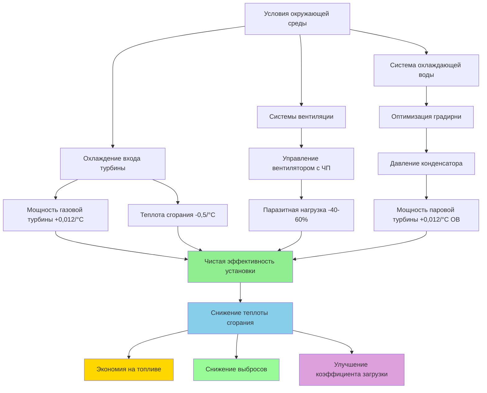

Электростанции комбинированного цикла достигают тепловой эффективности 55–62% путем интеграции газотурбинных (цикл Брайтона) и паротурбинных (цикл Ранкина) систем через генераторы паров теплоемкости (HRSG). Системы HVAC напрямую влияют на эту эффективность через кондиционирование воздуха на входе турбины, потребление паразитной мощности и управление теплом оборудования, генерирующего тепло. Понимание термодинамических связей между условиями окружающей среды, вмешательствами HVAC и производительностью цикла позволяет количественно оптимизировать эффективность.

## Основы эффективности комбинированного цикла

Общая эффективность комбинированного цикла представляет отношение чистой электрической мощности к энергии топлива:

$$\eta_{CC} = \frac{W_{GT} + W_{ST} - W_{aux}}{Q_{fuel}}$$

Где:
- $W_{GT}$ = Валовая мощность газовой турбины (кВ)
- $W_{ST}$ = Валовая мощность паровой турбины (кВ)
- $W_{aux}$ = Потребление вспомогательной мощности, включая HVAC (кВ)
- $Q_{fuel}$ = Входная энергия топлива на основе низшей теплоты сгорания (кВ)

Это расширяется до эффективности компонентов:

$$\eta_{CC} = \eta_{GT} + \eta_{ST}(1 - \eta_{GT}) - \frac{W_{aux}}{Q_{fuel}}$$

Члены эффективности паровой турбины $(1 - \eta_{GT})$ отражают, что цикл Ранкина работает на отходящем тепле цикла Брайтона. Современные комбинированные циклы достигают:

- Эффективность газовой турбины: $\eta_{GT}$ = 38–42%
- Вклад эффективности паровой турбины: 18–22%
- Штраф вспомогательной нагрузки: 1,5–3%
- **Чистая эффективность комбинированного цикла: 55–62%**

## Теплота сгорания и влияние HVAC

Теплота сгорания определяет расход топлива на единицу электрической мощности:

$$HR = \frac{14,330}{{\eta_{CC}}} \text{ кДж/кВч}$$

При эффективности 60% теплота сгорания составляет 23,883 кДж/кВч. Каждое снижение эффективности на 1% увеличивает теплоту сгорания примерно на 398 кДж/кВч, что трансформируется в значительные затраты на топливо за годовой период эксплуатации. Электростанция мощностью 500 МВт, работающая с коэффициентом загрузки 85% и потребляющая дополнительно 174 кДж/кВч, представляет годовую стоимость в размере 3,7 млн долларов при цене газа $4/ГДж.

Системы HVAC влияют на теплоту сгорания тремя механизмами:

**1. Модификация температуры на входе турбины**
**2. Потребление электроэнергии паразитной нагрузкой**
**3. Производительность конденсатора посредством управления температурой окружающей среды**

## Термодинамика охлаждения входа турбины

Выходная мощность газовой турбины следует соотношению:

$$W_{GT} = \dot{m}_{air} \cdot c_p \cdot (T_{firing} - T_{exhaust})$$

Где массовый расход воздуха $\dot{m}_{air}$ изменяется обратно пропорционально плотности воздуха на входе:

$$\dot{m}_{air} = \rho_{inlet} \cdot V_{compressor}$$

Плотность воздуха уменьшается с температурой в соответствии с законом идеального газа:

$$\rho = \frac{P}{R \cdot T_{inlet}}$$

Объединяя эти соотношения, выходная мощность газовой турбины увеличивается примерно на **0,5–0,7% на 0,56°C снижения** температуры на входе компрессора, при этом теплота сгорания улучшается на **0,2–0,3% на 0,56°C** из-за увеличения степени повышения давления цикла.

Для газовой турбины мощностью 250 МВт (условия ISO), работающей при температуре окружающей среды 35°C:

- Охлаждение входящего воздуха до 13°C (снижение на 22°C) увеличивает выходную мощность: 250 МВ × 22°C × 0,012/°C = **66 МВт прироста**
- Улучшение теплоты сгорания: 0,5%/°C × 22°C = **11% снижение теплоты сгорания**

### Эффективность испарительного охлаждения

Охлаждение испарительной средой достигает снижения температуры, ограниченного депрессией мокрого термометра:

$$\Delta T_{max} = T_{db} - T_{wb}$$

Фактическое снижение температуры зависит от эффективности средства:

$$\Delta T_{actual} = \epsilon_{media} \cdot (T_{db} - T_{wb})$$

Где $\epsilon_{media}$ варьируется от 0,85–0,95 для жестких медийных систем. При 35°C сухого термометра и 18°C мокрого термометра:

$$\Delta T_{actual} = 0,90 \times (35 - 18) = 15,3°C$$

Увеличение мощности: 250 МВ × 15,3°C × 0,012/°C = **45,9 МВт**

Паразитная мощность испарительного охлаждения (насосы, вентиляторы) обычно потребляет 0,3–0,5% полученной мощности, что дает **чистый прирост 45–46 МВт**.

### Производительность механического охлаждения

Охлаждение входа на основе чиллера достигает снижения температуры независимо от температуры мокрого термометра:

$$COP_{chiller} = \frac{Q_{cooling}}{W_{compressor}}$$

Типичные центробежные чиллеры достигают COP 5,0–6,5 при условиях подачи 7°C. Для снижения температуры на 22°C при расходе входящего воздуха 454,000 кг/ч:

$$Q_{cooling} = \dot{m} \cdot c_p \cdot \Delta T = 454,000 \times 1000 \times 22 = 9,988,000 \text{ кДж/ч}$$

Требуемая мощность чиллера при COP = 5,5:

$$W_{chiller} = \frac{9,988,000}{3600 \times 5,5} = 505 \text{ кВ}$$

Чистый прирост выходной мощности: 60,000 кВ − 505 кВ = **59,495 кВ (99,2% чистый прирост)**

Экономика механического охлаждения зависит от цены электроэнергии и доходов рынка мощности. Охлаждение входа в пиковый период при цене $150/МВч с заводской эксплуатацией чиллера в непиковый период $50/МВч дает маржу $100/МВч, оправдывающую установку.

## Сравнение факторов эффективности

| Параметр | Испарительное охлаждение | Механическое охлаждение | Тепловое хранилище | Без охлаждения входа |
|-----------|--------------------------|-------------------------|-------------------|----------------------|
| **Снижение температуры** | 8–15°C (зависит от климата) | 17–25°C (постоянное) | 14–22°C (ограниченная продолжительность) | 0°C |
| **Прирост мощности (250 МВт база)** | 24–46 МВт | 50–76 МВт | 42–67 МВт | 0 МВт |
| **Паразитное потребление** | 0,2–0,4 МВт | 9–13 МВт | 2–4 МВт (зарядка) | 0 МВт |
| **Влияние на чистую эффективность** | +8,8–16,2% | +14,8–22,4% | +15,2–22,4% | Базовый уровень |
| **Потребление воды** | 2,3–3,4 м³/ч | 0,6–0,9 м³/ч | 0,4–0,8 м³/ч | 0 м³/ч |
| **Капитальные затраты ($/кВ)** | $80–120 | $400–600 | $500–800 | $0 |
| **Оптимальное применение** | Засушливые климаты | Высокостоимостные пиковые периоды | Рынки мощности | Дефицит воды |

## Оптимизация паразитной нагрузки

Потребление вспомогательной мощности снижает чистую выходную мощность установки. Системы HVAC составляют 15–25% от общей вспомогательной нагрузки на объектах комбинированного цикла. Основные HVAC-связанные паразитные нагрузки включают:

**Вентиляция корпуса газовой турбины:** 200–400 кВ (вентиляторы)
**Вентиляция области HRSG:** 150–300 кВ (вентиляторы)
**Вентиляция залов паровой турбины:** 100–250 кВ (вентиляторы)
**Охлаждение диспетчерской и электрического оборудования:** 300–600 кВ (чиллеры, вентиляторы)
**Перепад давления в системе фильтрации входящего воздуха:** 100–200 кВ (увеличенная работа компрессора)

Частотные приводы снижают потребление энергии вентилятором на 40–60% при работе с частичной нагрузкой в соответствии с законами подобия вентиляторов:

$$P_{fan} = P_{design} \times \left(\frac{CFM_{actual}}{CFM_{design}}\right)^3$$

Снижение расхода воздуха до 70% проектного снижает мощность до 34% проектной: $(0,70)^3 = 0,343$

Для системы вентиляции мощностью 300 кВ, работающей при расходе 70% в течение 6,000 часов в год:

$$Energy_{saved} = 300 \text{ кВ} \times (1 - 0,343) \times 6,000 \text{ ч} = 1,182,600 \text{ кВч/год}$$

При средней стоимости электроэнергии $40/МВч: **$47,304 годовой экономии**

## Производительность конденсатора и условия окружающей среды

Противодавление паровой турбины непосредственно влияет на эффективность цикла Ранкина в соответствии с пределом Карно:

$$\eta_{Carnot} = 1 - \frac{T_{condenser}}{T_{boiler}}$$

Давление конденсации изменяется с температурой охлаждающей воды. Каждое повышение температуры конденсатора на 0,56°C увеличивает давление в выхлопе турбины примерно на 0,03 см рт.ст., снижая выходную мощность на 0,5–0,7%.

Системы HVAC, влияющие на производительность конденсатора:

**Оптимизация градирни:** Вентиляторы с частотным приводом модулируют на минимальный подход по мокрому термометру (обычно 4–6°C), снижая паразитную мощность вентилятора при поддержании вакуума конденсатора.

**Конструкция водозаборного сооружения:** Вентиляция предотвращает солнечный нагрев воды, поддерживая проектную температуру. Каждое повышение температуры поступающей воды на 2,8°C снижает выходную мощность паровой турбины на 2,5–3,5%.

## Стратегии оптимизации эффективности HVAC

**Интегрированный подход оптимизации:**

1. **Охлаждение входа в пиковые периоды:** Развертывание механического охлаждения или теплового хранилища, когда предельная стоимость электроэнергии превышает стоимость увеличенного расхода топлива плюс стоимость паразитного потребления.

2. **Вентиляция по требованию:** Датчики CO₂ и температурный мониторинг модулируют скорость вентиляции в соответствии с фактическими тепловыми нагрузками, а не проектным максимумом, снижая годовое потребление энергии вентилятором на 25–35%.

3. **Экономайзеры свободного охлаждения:** Охлаждение диспетчерской и электрического оборудования использует наружный воздух, когда температура окружающей среды ниже 13–16°C, исключая эксплуатацию чиллера в течение 40–60% годовых часов в климате умеренной зоны.

4. **Интеграция рекуперации тепла:** Продувка HRSG и отходящий воздух турбинного зала подогревают воздух горения или служебную воду, восстанавливая 600–1,400 ГДж/ч.

5. **Оптимизация фильтрации:** Самоочищающиеся системы фильтров поддерживают перепад давления на входе ниже 10 см вод.ст. в сравнении с 15–20 см вод.ст. для обычных фильтров, снижая работу компрессора эквивалентно приросту выходной мощности на 0,8–1,2%.

## Стандарты и спецификации производительности

**ASME PTC 22** (Код испытаний производительности газовой турбины) устанавливает стандартные условия отсчета:

- Температура на входе: 15°C
- Барометрическое давление: 101,325 кПа
- Относительная влажность: 60%

Коррекции производительности для нестандартных условий:

$$W_{corrected} = W_{measured} \times \sqrt{\frac{T_{std}}{T_{actual}}} \times \frac{P_{actual}}{P_{std}}$$

**ISO 2314** (Приемочные испытания газовых турбин) требует точность измерения температуры входа ±0,28°C, что напрямую влияет на требования калибровки приборов системы HVAC.

**NFPA 850** устанавливает скорости вентиляции и требования экстренной продувки, влияющие на размеры системы HVAC и последовательности управления.

**ASHRAE 169** классификация климатических зон информирует выбор технологии охлаждения входа на основе годовых распределений температуры мокрого термометра и экономического анализа часов охлаждения.

## Пример расчета эффективности

Установка комбинированного цикла мощностью 500 МВт (ISO) с оценкой охлаждения входа:

**Базовый случай (35°C окружающей среды, без охлаждения):**
- Мощность газовой турбины: 330 МВт (снижена с 345 МВт ISO)
- Мощность паровой турбины: 165 МВт
- Вспомогательная нагрузка: 7,5 МВт
- Чистая выходная мощность: 487,5 МВт
- Теплота сгорания: 26,150 кДж/кВч
- Эффективность: 54,6%

**С испарительным охлаждением до 21°C:**
- Мощность газовой турбины: 345 МВ × [1 + (14°C × 0,012)] = 394 МВт
- Мощность паровой турбины: 165 МВт (минимальное изменение)
- Вспомогательная нагрузка: 7,8 МВт (включая насосы охлаждения)
- Чистая выходная мощность: 551,2 МВт
- Улучшение теплоты сгорания: 14°C × 0,5%/°C = 7%
- Новая теплота сгорания: 24,420 кДж/кВч
- Эффективность: 58,5%

**Годовое экономическое воздействие (коэффициент загрузки 85%):**
- Дополнительное годовое производство: 496,000 МВч
- Экономия топлива при $4/ГДж: 7,8 млн долларов
- Стоимость воды при $2/м³: 0,4 млн долларов
- **Чистая годовая выгода: 7,4 млн долларов**

Оптимизация системы HVAC на электростанциях комбинированного цикла доставляет измеримые улучшения эффективности посредством первоначальных принципов термодинамики, трансформируя управление условиями окружающей среды в снижение теплоты сгорания, увеличение выходной мощности и улучшение экономики установки.
