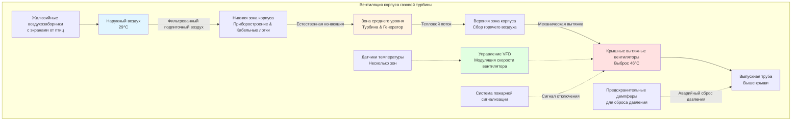

Производительность газовой турбины проявляет экстремальную чувствительность к температуре воздуха на входе, делая системы HVAC активами, непосредственно генерирующими доход, а не вспомогательным оборудованием. Каждый градус снижения температуры на входе приводит к измеримому увеличению выходной мощности и термического КПД. Система вентиляции корпуса одновременно защищает приборостроение, управляет тепловыми нагрузками и обеспечивает соответствие качества воздуха горения строгим спецификациям производителя турбины.

## Термодинамическое основание охлаждения на входе

Выходная мощность газовой турбины зависит фундаментально от массового расхода компрессора и степени сжатия. Плотность воздуха на входе уменьшается с температурой согласно закону идеального газа, непосредственно уменьшая массовый расход через компрессор при постоянном объемном расходе:

$$\rho = \frac{P}{RT}$$

Где:
- $\rho$ = Плотность воздуха (кг/м³)
- $P$ = Абсолютное давление (кПа)
- $R$ = Газовая постоянная для воздуха (287 Дж/кг·К)
- $T$ = Абсолютная температура (К)

Работа компрессора возрастает с температурой на входе, поскольку большая кинетическая энергия молекул требует дополнительной энергии сжатия:

$$W_c = \dot{m} c_p (T_2 - T_1) = \dot{m} c_p T_1 \left[\left(\frac{P_2}{P_1}\right)^{\frac{\gamma-1}{\gamma}} - 1\right]$$

Где:
- $W_c$ = Работа компрессора (кДж/ч)
- $\dot{m}$ = Массовый расход (кг/ч)
- $c_p$ = Удельная теплоёмкость при постоянном давлении (1,005 кДж/кг·К)
- $T_1$ = Температура на входе компрессора (К)
- $T_2$ = Температура на выходе компрессора (К)
- $\gamma$ = Отношение удельных теплоёмкостей (1,4 для воздуха)

Деградация выходной мощности следует эмпирически из данных полевых испытаний:

$$\frac{\Delta P}{P_{\text{ISO}}} \approx -0.006 \times (T_{\text{inlet}} - 15)$$

Где мощность уменьшается на 0,6% на градус Цельсия выше условий ISO (15°C, 101,325 кПа, 60% ОВ). Турбина мощностью 170 МВт, работающая при 35°C окружающего воздуха, теряет приблизительно 21,6 МВт по сравнению с номинальной мощностью ISO.

Расход топлива на единицу мощности (эффективность топливопотребления) также деградирует с температурой:

$$\frac{\Delta HR}{HR_{\text{ISO}}} \approx 0.002 \times (T_{\text{inlet}} - 15)$$

Представляя штраф 0,2% эффективности на градус выше условий ISO. Комбинированные эффекты создают значительный экономический стимул для охлаждения на входе в периоды высоких температур.

## Технологии охлаждения на входе

### Испарительные системы охлаждения

Испарительные панели или системы туманообразования охлаждают воздух посредством испарения воды, приближаясь к пределу мокрого термометра. Процесс охлаждения следует психрометрическим принципам, где явное тепло преобразуется в скрытое тепло:

$$Q_{\text{evap}} = \dot{m}_{\text{water}} h_{fg}$$

Где:
- $Q_{\text{evap}}$ = Мощность охлаждения (кДж/ч)
- $\dot{m}_{\text{water}}$ = Массовый расход испаряемой воды (кг/ч)
- $h_{fg}$ = Скрытая теплота испарения (≈2450 кДж/кг при 27°C)

Эффективность панели определяет приближение к мокрому термометру:

$$\eta_{\text{media}} = \frac{T_{\text{db,in}} - T_{\text{db,out}}}{T_{\text{db,in}} - T_{\text{wb,in}}}$$

Где:
- $\eta_{\text{media}}$ = Эффективность панели (обычно 85-95%)
- $T_{\text{db,in}}$ = Температура сухого термометра на входе (°C)
- $T_{\text{db,out}}$ = Температура сухого термометра на выходе (°C)
- $T_{\text{wb,in}}$ = Температура мокрого термометра на входе (°C)

Испарительное охлаждение оптимально работает в засушливых климатах с большой разницей между сухим и мокрым термометром. Финикс, Аризона, с 40°C сухим термометром и 18°C мокрым термометром достигает снижения температуры на 19-21°C. Хьюстон, Техас, с 35°C сухим термометром и 28°C мокрым термометром достигает только 6-7°C снижения.

**Соображения при проектировании:**

- Толщина панели 15-30 см для 85-95% эффективности
- Требования качества воды: <100 мг/л растворённых твёрдых веществ для предотвращения отложений
- Отделители брызг ограничивают унос воды до <0,001% от расхода воздуха
- Контроль продувки поддерживает коэффициент концентрации 3-5:1
- Обход в зимний период предотвращает обледенение и чрезмерное увлажнение

### Охлаждение на входе (механическое охлаждение)

Механические холодильные установки охлаждают воздух на входе ниже температуры мокрого термометра, эффективно работая независимо от влажности окружающего воздуха. Мощность холодильной установки уравновешивает увеличение мощности относительно паразитного потребления:

$$\text{Чистое увеличение мощности} = P_{\text{augmentation}} - P_{\text{chiller}}$$

Типичный коэффициент производительности холодильной установки (COP) составляет 4,0-5,5 для приложений кондиционирования воздуха:

$$\text{COP} = \frac{Q_{\text{cooling}}}{W_{\text{compressor}}}$$

Потребление мощности холодильной установки обычно составляет 3-5% прироста мощности турбины, давая чистую выгоду. Для 15 МВт увеличения мощности из-за охлаждения на входе на 17°C:

- Нагрузка холодильной установки: 15 000 кВт × 3,6 = 54 000 кДж/ч
- Потребление мощности холодильной установки (COP = 5,0): 54 000 ÷ 5,0 ÷ 3,6 = 3,0 МВт
- Чистый прирост: 15,0 - 3,0 = 12,0 МВт

Экономическая жизнеспособность зависит от дифференциала цены электроэнергии между пиковыми и внепиковыми периодами. Системы оптимально работают в периоды максимального спроса, когда стоимость мощности превышает стоимость топлива.

**Конфигурации холодильных установок:**

- Прямые испарительные (DX) секции: Хладагент непосредственно испаряется в ребристых трубках воздуховода
- Системы с охлаждённой водой: Центральная холодильная установка обслуживает охлаждающие секции через гидронную распределительную систему
- Тепловое аккумулирование: Ледяное аккумулирование, заряженное в периоды низкого спроса, обеспечивает охлаждение в пиковые периоды без непрерывной работы холодильной установки

### Сравнение технологий охлаждения на входе

| Технология | Снижение температуры | Климатическая пригодность | Паразитная мощность | Потребление воды | Капитальные затраты |
|------------|---------------------|---------------------------|-------------------|-------------------|-------------------|
| Испарительная панель | 8-14°C | Засушливый (<30% ОВ) | 0,1-0,2% | 8-15 л/мин на МВт | $150-300/кВт |
| Высокодавление туманообразование | 11-17°C | Засушливый до умеренный | 0,2-0,3% | 11-19 л/мин на МВт | $225-450/кВт |
| Механическое охлаждение | 14-22°C | Все климаты | 3-5% | 2-4 л/мин на МВт | $750-1200/кВт |
| Абсорбционное охлаждение | 11-19°C | Все климаты | 0,5-1% | 4-8 л/мин на МВт | $900-1500/кВт |
| Тепловое аккумулирование (лёд) | 17-25°C | Все климаты | 2-3% (среднее) | 2-4 л/мин на МВт | $1200-1800/кВт |

Капитальные затраты представляют дополнительную стоимость на кВт пикового прироста мощности. Потребление воды варьируется в зависимости от условий окружающей среды и охлаждающей нагрузки.

## Фильтрация воздуха горения

Газовые турбины всасывают 180-270 кг воздуха в секунду в крупных промышленных установках. Взвешенные в воздухе твёрдые частицы вызывают эрозию лопаток компрессора, загрязнение и деградацию производительности. Системы фильтрации должны достигать качества воздуха ISO 8573-1 класс 4 при минимизации перепада давления:

**Пределы концентрации твёрдых частиц (ISO 8573-1 класс 4):**
- Частицы 0,1-0,5 мкм: ≤20 мг/м³
- Частицы 0,5-1,0 мкм: ≤8 мг/м³
- Частицы 1,0-5,0 мкм: ≤6 мг/м³

Многоступенчатая фильтрация достигает требуемой чистоты:

**Предварительный фильтр (этап 1):** Удаляет частицы >10 мкм с эффективностью 80-90%. Жалюзийные воздухозаборники предотвращают попадание дождя и снега. Типичный перепад давления 50-100 Па в чистом состоянии, 200-300 Па в грязном состоянии.

**Основной фильтр (этап 2):** Мешочные или картриджные фильтры захватывают частицы 1-10 мкм с эффективностью 95-99%. Перепад давления 100-200 Па в чистом состоянии, 500-750 Па при достижении порога замены.

**Финальный фильтр (этап 3):** Высокоэффективные фильтры удаляют субмикронные частицы >0,3 мкм с эффективностью 99%+. Перепад давления 75-150 Па в чистом состоянии, 375-625 Па в грязном состоянии.

**Системы импульсной очистки:** Автоматизированные обратные импульсы сжатого воздуха удаляют накопленную пыль с картриджных фильтров, расширяя интервалы обслуживания и снижая перепад давления. Циклы очистки активируются при установке дифференциального давления (обычно 1,0-1,5 кПа общей системы).

Перепад давления системы фильтрации влияет на производительность турбины. Каждый кПа перепада давления уменьшает выходную мощность приблизительно на 0,25-0,40%. Чистая конструкция фильтра нацелена на общий перепад 2,5-3,75 кПа, с заменой, инициируемой при 1,0-1,5 кПа.

## Вентиляция корпуса газовой турбины

Вентиляция корпуса удаляет тепло, генерируемое вспомогательными устройствами турбины, поддерживает безопасные условия окружающей среды для приборостроения и персонала, и обеспечивает поступление воздуха горения в конфигурациях без изолированного входа.

### Источники тепловой нагрузки

**Радиация корпуса турбины:** Несмотря на внешнюю изоляцию (10-15 см минеральной ваты), корпуса турбин работают при температуре поверхности 200-315°C, излучая 1-3% выходной мощности турбины в корпус.

**Потери генератора:** Воздухоохлаждаемые генераторы отводят потери обмоток, потери сердечника и потери трения в окружающий воздух. Эффективность генератора 98-99% означает появление 1-2% выходной мощности в виде тепла. Для генератора 170 МВт при эффективности 98,5%: 170 МВт × 0,015 × 3600 с / ч = 9,18 ГДж/ч.

**Вспомогательное оборудование:** Охладители масла смазки (обычно с водяным охлаждением), гидравлические системы, редукторы и пусковые двигатели вносят дополнительное тепло.

**Изоляция корпуса:** Недостаточная изоляция корпуса увеличивает прирост излучаемого тепла. Хорошо изолированные корпусы ограничивают тепловую нагрузку до 2-3% выходной мощности турбины; плохо изолированные корпусы достигают 5-7%.

Расчёт общей тепловой нагрузки корпуса для турбины 170 МВт:

$$Q_{\text{enclosure}} = 170,000 \text{ кВт} \times 0.03 \times 3600 = 18,36 \text{ ГДж/ч}$$

Эквивалентно 5,1 МВт охлаждающей мощности, требующей значительного вентиляционного расхода воздуха.

### Стратегия проектирования вентиляции

Корпус работает при слабом отрицательном давлении (-25-50 Па) относительно атмосферы, предотвращая утечку горячего выхлопного газа при допуске контролируемого поступления наружного воздуха. Механические вытяжные вентиляторы поддерживают перепад давления:

$$Q_{\text{vent}} = \frac{Q_{\text{heat}}}{1.25 \times \Delta T}$$

Где:
- $Q_{\text{vent}}$ = Вентиляционный расход воздуха (м³/ч)
- $Q_{\text{heat}}$ = Тепловая нагрузка (кДж/ч)
- $\Delta T$ = Повышение температуры (°C)
- 1,25 = Константа (1,2 кДж/кг·°C × 1,2 кг/м³)

Для 18,36 ГДж/ч с повышением на 17°C (29°C наружного воздуха, 46°C корпуса):

$$Q_{\text{vent}} = \frac{18,360,000}{1.25 \times 17} = 865,000 \text{ м³/ч}$$

Типичные размеры корпуса (24 м × 18 м × 12 м = 5185 м³) требуют:

$$\text{ACH} = \frac{865,000}{5185} = 167 \text{ воздухообменов в час}$$

Высокие коэффициенты воздухообмена отражают концентрированные тепловые нагрузки в компактных корпусах.

### Конфигурация системы вентиляции

**Введение подпиточного воздуха:** Низкоуровневые настенные жалюзи с гравитационными клапанами обратной тяги впускают наружный воздух. Жалюзи оборудованы:
- Защита от погодных условий предотвращает попадание дождя
- Экраны от птиц и грызунов (сетка 12,7 мм)
- Грубые фильтры удаляют крупный мусор
- Акустическое ослабление ограничивает выход шума

**Размещение вытяжного вентилятора:** Крышные центробежные или осевые вытяжные вентиляторы извлекают горячий воздух из верхней зоны корпуса. Критерии выбора вентилятора:
- Конструкция, предназначенная для высоких температур (класс В или F изоляции, рассчитанная на 130-155°C)
- Конструкция, устойчивая к искрам (тип A или B, устойчивый к искрам AMCA)
- Преобразователи частоты с регулируемой скоростью, модулирующие производительность с температурой
- Избыточные вентиляторы, обеспечивающие минимальную вентиляцию при техническом обслуживании

**Стратегия управления:** Несколько датчиков температуры по всему корпусу предоставляют входные данные основному контроллеру. Управляемые VFD вентиляторы модулируют скорость, поддерживая максимальную температуру корпуса 49-60°C в зависимости от спецификаций оборудования. Летние условия требуют максимальной скорости вентилятора; зимние условия снижают до минимальной вентиляции, предотвращая расслоение.

**Интеграция пожарной защиты:** Системы пожарной сигнализации взаимодействуют с вентиляцией, отключая вытяжные вентиляторы и закрывая демпферы для предотвращения распространения пожара. Системы газового или чистого газового пожаротушения (где разрешено) требуют герметичности корпуса, поддерживаемой закрытием демпферов.

## Акустические соображения

Газовые турбины генерируют 95-110 дБА на расстоянии 0,9 м от корпуса. Конструкция корпуса обеспечивает ослабление 25-40 дБ, предотвращая воздействие на окружающую среду. Проходы HVAC нарушают акустическую производительность, требуя обработки:

**Входные жалюзи:** Акустически облицованные узлы жалюзи с внутренними перегородками и абсорбирующим материалом ослабляют на 15-25 дБ в диапазоне речевых частот (500-2000 Гц).

**Выпускные трубы:** Рассеивающие глушители, установленные в выпускном воздуховоде, обеспечивают вставочное затухание 20-30 дБ. Длина глушителя 1,5-3,0 м в зависимости от требуемого ослабления.

**Воздуховоды:** Звукоглушители с монтажом на воздуховоде, облицованные стекловолокном или минеральной ватой, снижают передачу шума прорыва.

Акустическая обработка увеличивает перепад давления системы, требуя резерва производительности вентилятора. Бюджет 250-500 Па для входного глушения, 500-1000 Па для выходного глушения.

## Стандарты и справочные материалы по проектированию

**ISO 2314 (Испытания приёмки газовых турбин):** Устанавливает условия испытания производительности, требующие измерения температуры воздуха на входе с точностью ±0,3°C. Системы кондиционирования на входе должны поддерживать стабильное, равномерное распределение температуры в периоды испытаний.

**ASME PTC 22 (Код испытания производительности газовой турбины):** Определяет коэффициенты коррекции, преобразующие полевую производительность в условия ISO. Требует документирования температуры, давления и влажности на входе и состава топлива.

**NFPA 850 (Производство электроэнергии):** Раздел 9.2 определяет требования вентиляции корпуса газовой турбины, включая минимальные коэффициенты воздухообмена, классификацию опасных зон и интеграцию системы пожарной защиты.

**ISO 8573-1 (Чистота сжатого воздуха):** Устанавливает классы загрязнения твёрдыми частицами, влагой и маслом для систем сжатого воздуха. Пределы твёрдых частиц класса 4 применяются к фильтрации воздуха на входе турбины.

**Спецификации производителя:** Требования OEM имеют приоритет над общими стандартами. GE, Siemens, Mitsubishi и другие производители опубликовывают спецификации качества воздуха на входе, максимальные температуры корпуса и критерии вентиляции в документации требований к объекту.

Кондиционирование воздуха на входе газовой турбины и вентиляция корпуса представляют сложную термодинамическую оптимизацию, где инженерия HVAC непосредственно влияет на выходную мощность в мегаваттах и операционный доход. Надлежащее проектирование системы максимизирует производство электроэнергии при защите многомиллионных активов турбины.
