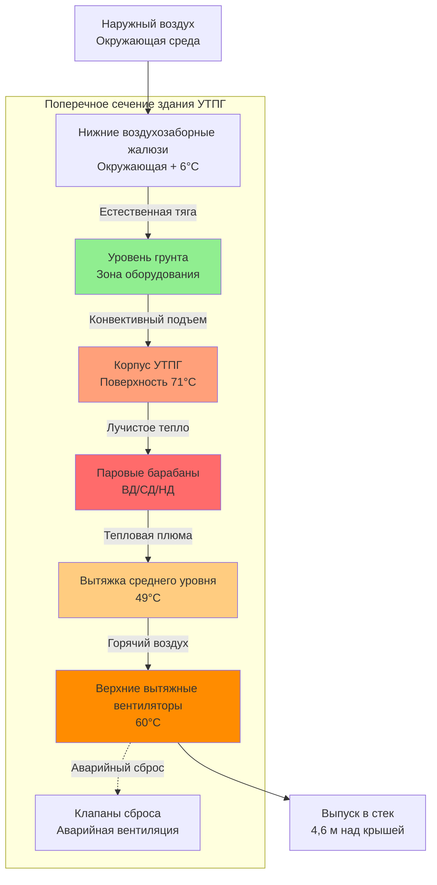

Парогенераторы с теплоутилизацией работают с температурами выхлопных газов в диапазоне от 540 до 590°C на входе до 95-150°C на дымовой трубе, создавая экстремальные тепловые среды, требующие инженерных решений по вентиляции. Корпусы УТПГ испытывают тепловые нагрузки из нескольких источников: лучистое излучение от корпусов с высокой температурой, конвективный теплообмен от паропроводов, работающих при 200-565°C, и скрытое тепло, выделяемое при утечках пара из барабанных соединений и сальниковых узлов. Инженерная задача HVAC заключается в управлении плотностью тепла, превышающей 850-1400 кДж/ч·м², при одновременном поддержании безопасных рабочих температур и предотвращении конденсации во время переходных режимов.

## Анализ тепловой нагрузки

Тепловые нагрузки корпуса УТПГ вытекают из трех основных механизмов, каждый требующий отдельного подхода к расчетам.

**Лучистый теплообмен** от поверхностей корпуса УТПГ доминирует в тепловой нагрузке. Температура поверхности корпуса обычно находится в диапазоне от 60 до 82°C в зависимости от толщины изоляции и условий окружающей среды. Плотность лучистого потока тепла следует соотношению Стефана–Больцмана:

$$q_{rad} = \epsilon \sigma A (T_s^4 - T_\infty^4)$$

где:
- $\epsilon$ = коэффициент излучательности поверхности (0,85–0,95 для окисленной стали, 0,25–0,35 для алюминиевого кожуха)
- $\sigma$ = постоянная Стефана–Больцмана (0,1714×10⁻⁸ кДж/ч·м²·К⁴)
- $A$ = площадь поверхности корпуса (м²)
- $T_s$ = температура поверхности (K)
- $T_\infty$ = температура окружающей среды (K)

Для типичных размеров УТПГ (высота 18 м, ширина 7,6 м, длина 24 м) со средней температурой корпуса 71°C и воздухом в корпусе 38°C:

$$q_{rad} = 0,90 \times 0,1714 \times 10^{-8} \times 1{,}300 \times (344^4 - 311^4) = 5{,}200{,}000 \text{ кДж/ч}$$

**Конвективный теплообмен** от паропроводов вносит значительную нагрузку, особенно в секциях барабана и пароперегревателя. Конвективная составляющая рассчитывается как:

$$q_{conv} = h \cdot A \cdot (T_{pipe} - T_{air})$$

где коэффициент конвекции $h$ для свободной конвекции от горизонтальных труб находится в диапазоне 6,8–10,2 кДж/ч·м²·°C в зависимости от диаметра трубы и разности температур.

Для электростанции комбинированного цикла мощностью 500 МВ типичный запас паропроводов УТПГ включает:
- Пар высокого давления (1800 фунтов на кв. дюйм, 565°C): 240 м труб 355–405 мм
- Пар среднего давления (450 фунтов на кв. дюйм, 345°C): 365 м труб 450–510 мм
- Пар низкого давления (50 фунтов на кв. дюйм, 150°C): 450 м труб 610–710 мм

Общая конвективная нагрузка паропроводов обычно добавляет 1 120 000–1 960 000 кДж/ч в зависимости от эффективности изоляции.

**Скрытое тепло утечки пара** представляет переменную составляющую. Небольшая утечка пара при высоком давлении выделяет примерно 1 850 кДж/кг скрытого тепла. Скорость утечки 23 кг/ч (типичная для изношенных сальников) вносит вклад около 112 000 кДж/ч при одновременном создании локализованной влажности, требующей разбавляющей вентиляции.

Общая тепловая нагрузка корпуса УТПГ складывается как:

$$Q_{total} = Q_{rad} + Q_{conv} + Q_{steam} + Q_{equipment}$$

где $Q_{equipment}$ включает питательные насосы, циркуляционные насосы и панели управления, обычно вносящие вклад 420 000–700 000 кДж/ч.

## Проектирование системы вентиляции

Вентиляция УТПГ применяет многоуровневый стратифицированный выброс воздуха для эффективного управления термальными градиентами. Горячий воздух накапливается на верхних уровнях рядом с паровыми барабанами, а более холодный воздух подпитки поступает на уровне грунта, создавая естественный конвективный поток.

**Естественная вентиляция** обеспечивает базовое охлаждение через стратегически расположенные жалюзи и вентиляционные отверстия. Движущая разность давлений от тепловой плавучести рассчитывается как:

$$\Delta P = 3,43 h \left(\frac{1}{T_{out}} - \frac{1}{T_{in}}\right)$$

где $h$ = вертикальное расстояние между входом и выходом (м) и температуры в абсолютной шкале (K).

Для здания УТПГ с высотой стека 15 м, наружной температурой 35°C (308 K) и температурой верхнего уровня 60°C (333 K):

$$\Delta P = 3,43 \times 15 \times \left(\frac{1}{308} - \frac{1}{333}\right) = 0,235 \text{ Па}$$

Это давление управляет потоком воздуха через вентиляционный тракт со скоростью потока, определяемой:

$$Q = C \cdot A \sqrt{\frac{2 \Delta P}{\rho}}$$

где $C$ = коэффициент расхода (0,60–0,65 для жалюзи), $A$ = свободная площадь, $\rho$ = плотность воздуха.

**Механическая вентиляция** дополняет естественный поток при высоких температурах окружающей среды или слабом ветре, когда естественной тяги недостаточно.

## Требования вентиляции по зонам

Корпусы УТПГ содержат отдельные тепловые зоны, требующие адаптированных стратегий вентиляции:

| Зона | Предельная температура | Плотность тепла | Скорость вентиляции | Стратегия |
|------|----------------------|-----------------|---------------------|-----------|
| Верхний уровень парового барабана | 60°C | 1000–1450 кДж/ч·м² | 15–20 вох/ч | Механический выброс, нижняя подача |
| Средний уровень пароперегревателя | 54°C | 775–1050 кДж/ч·м² | 12–16 вох/ч | Комбинированная естественная/механическая |
| Нижняя секция испарителя | 49°C | 550–825 кДж/ч·м² | 10–14 вох/ч | Естественная вентиляция предпочтительна |
| Экономайзер/зона питания | 43°C | 330–550 кДж/ч·м² | 8–12 вох/ч | Естественная вентиляция |
| Помещение бака продувки | 49°C | 940–1220 кДж/ч·м² | 12–18 вох/ч | Выделенный механический выброс |
| Платформа деаэратора | 54°C | 660–1000 кДж/ч·м² | 10–15 вох/ч | Смягчение утечки пара |

Скорости воздухообмена вытекают из уравнения чувствительного тепла:

$$ACH = \frac{Q}{V \cdot \rho \cdot c_p \cdot \Delta T} \times 60$$

где:
- $Q$ = тепловая нагрузка зоны (кДж/ч)
- $V$ = объем зоны (м³)
- $\rho$ = плотность воздуха (1,20 кг/м³ на уровне моря)
- $c_p$ = удельная теплоемкость (1,005 кДж/кг·°C)
- $\Delta T$ = повышение температуры от подачи к выходу (°C)

## Контроль влажности

Утечки пара привносят влагу, требующую активного управления. Скорость разбавляющей вентиляции для контроля влажности рассчитывается независимо от тепловых требований:

$$Q_{humid} = \frac{m_{leak} \cdot (W_{leak} - W_{max})}{W_{supply} - W_{max}}$$

где:
- $m_{leak}$ = массовый расход утечки пара (кг/ч)
- $W_{leak}$ = коэффициент влажности в точке утечки (кг H₂O/кг сухого воздуха)
- $W_{max}$ = максимально приемлемый коэффициент влажности (обычно 0,020 кг/кг для 60% ОВ при 38°C)
- $W_{supply}$ = коэффициент влажности подаваемого воздуха (кг/кг)

Для утечки пара 23 кг/ч от барабана среднего давления 450 фунтов на кв. дюйм:
- Утечка полностью испаряется в воздух зоны: $W_{leak}$ приближается к насыщению
- Максимальное условие зоны: 38°C, 60% ОВ соответствует $W_{max}$ = 0,020 кг/кг
- Наружный подаваемый воздух при 35°C, 50% ОВ: $W_{supply}$ = 0,0169 кг/кг

$$Q_{humid} = \frac{23 \times (1,0 - 0,020)}{0,0169 - 0,020} = -7{,}200 \text{ м³/ч}$$

Отрицательный результат указывает, что подаваемый воздух имеет более высокую влажность, чем целевая, требуя осушения или условий более сухого климата. На практике вентиляция УТПГ во влажных климатах работает непрерывно с расчетными скоростями, допуская повышенные уровни влажности (65–70%) в неэлектрических зонах при защите электрического оборудования локальным кондиционированием воздуха.

## Интеграция с противопожарной защитой

NFPA 850 требует, чтобы системы вентиляции УТПГ взаимодействовали с обнаружением пожара и подавлением. Ключевые требования включают:

**Обнаружение дыма** активирует реакцию системы вентиляции:
- Нормальная работа: Механические вентиляторы продолжают работу для удаления дыма
- Высокая плотность дыма: Вентиляторы отключаются, чтобы предотвратить распространение пламени через воздуховоды
- После подавления: Вентиляторы перезапускаются для эвакуации дыма

**Отверстия естественной вентиляции** должны оставаться функциональными при отказе питания, требуя гравитационных или противовесных клапанов вместо моторизованных типов.

**Интеграция датчика водорода** для водородоохлаждаемых генераторов, расположенных в соседних зданиях турбин, требует блокировки вентиляции, предотвращающей миграцию водорода в зоны УТПГ.

## Выбор оборудования

**Вытяжные вентиляторы** для приложений УТПГ работают в длительной среде с температурой окружающей среды 49–60°C с периодическими скачками до 71°C при нештатных условиях. Конструкция вентилятора требует:
- Изоляция электродвигателя класса B или F (155–180°C рейтинг)
- Высокотемпературные подшипники с синтетическими смазками
- Искробезопасная конструкция (тип A AMCA) для зон с потенциалом горючих газов
- Сейсмическая квалификация согласно ASCE 7 для критических сооружений

**Воздухозаборные жалюзи** для обеспечения естественной вентиляции требуют:
- Коэффициент свободной площади ≥ 0,70 для минимизации потерь напора
- Коррозионностойкую конструкцию (алюминий или нержавеющая сталь) для прибрежных районов
- Защита от насекомых (максимальный размер ячейки 6 мм) без значительного снижения свободной площади
- Штормоустойчивый дизайн для зон ветра 240 км/ч согласно ASCE 7

**Клапаны сброса** для аварийной вентиляции активируются через:
- Плавкие звенья (74°C рейтинг) для перепада давления, вызванного пожаром
- Пневматические приводы при высокой температуре тревоги (регулируемые 52–63°C)
- Возможность ручного управления для испытаний и обслуживания

## Влияние дополнительного сжигания топлива

УТПГ, оснащенные форсажными горелками, испытывают повышенные температуры выхлопных газов (870–980°C на выходе горелки), увеличивающие лучистое излучение тепла от корпуса УТПГ. Работа дополнительного сжигания топлива обычно увеличивает тепловую нагрузку корпуса на 25–35%, требуя пропорционального увеличения пропускной способности вентиляции.

Датчики температуры, контролирующие температуру воздуха верхнего уровня, модулируют механические вытяжные вентиляторы для поддержания уставки во время переходов сжигания топлива. Частотные преобразователи позволяют модулировать пропускную способность вентилятора с 40–100%, согласуя скорость вентиляции с фактической тепловой нагрузкой вместо непрерывной работы при расчетном максимуме.

## Справочные стандарты

**NFPA 850** (Генерирование электроэнергии) раздел 8.4 устанавливает требования вентиляции, включая минимальные скорости воздухообмена, интеграцию обнаружения дыма и положения аварийной вентиляции.

**ASME PTC 4.4** (Парогенераторы с теплоутилизацией газовых турбин) определяет протоколы испытаний тепловой производительности, включая измерение условий окружающей среды, влияющих на верификацию системы HVAC.

**Справочник приложений ASHRAE, глава 28** (Электростанции) предоставляет методы оценки тепловой нагрузки и руководство по проектированию вентиляции, специфичные для установок УТПГ.

**OSHA 29 CFR 1910.146** (Ограниченные пространства, требующие разрешения) применяется к внутреннему доступу в УТПГ, требующему проверки качества вентиляционного воздуха перед входом.

Вентиляция здания УТПГ представляет критическую инфраструктуру теплового управления, где точное инженерное проектирование непосредственно влияет на безопасность обслуживания, надежность оборудования и операционную гибкость во всех режимах нагрузки электростанции.
