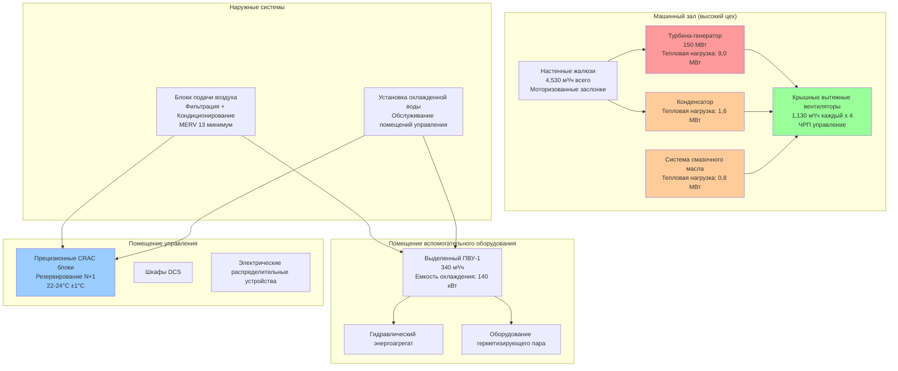

Здания паровых турбин на электростанциях комбинированного цикла создают уникальные проблемы HVAC, вызванные высокими радиационными и конвективными тепловыми нагрузками, повышенной влажностью от утечек пара и критическим вспомогательным оборудованием, требующим контроля микроклимата. Агрегат турбина-генератор обычно занимает высокий цех с плотностью тепловых нагрузок от 3-8% мощности турбины по техническому паспорту, в то время как прилегающие электрические и управляющие помещения требуют жестких допусков по температуре и влажности.

## Анализ тепловых нагрузок

Тепловая нагрузка здания с паровой турбиной состоит из нескольких отдельных компонентов, требующих индивидуального расчета для точного определения размеров системы HVAC.

**Радиация и конвекция турбина-генератора:**

Основной источник тепла исходит от корпуса турбины и поверхностей паропровода. Теплопередача следует соотношению радиации и конвекции:

$$Q_{turbine} = A \cdot \varepsilon \cdot \sigma \cdot (T_s^4 - T_\infty^4) + h_c \cdot A \cdot (T_s - T_\infty)$$

Где:
- $Q_{turbine}$ = общая скорость теплопередачи (кДж/ч)
- $A$ = внешняя площадь поверхности турбины и трубопроводов (м²)
- $\varepsilon$ = коэффициент излучения поверхности (0,85-0,95 для окисленной стали)
- $\sigma$ = постоянная Стефана-Больцмана (0,2044×10⁻⁸ кДж/ч·м²·К⁴)
- $T_s$ = температура поверхности (K)
- $T_\infty$ = температура окружающего воздуха (K)
- $h_c$ = коэффициент конвекции (5,7-14,3 кДж/ч·м²·K в зависимости от скорости воздуха)

Для предварительного проектирования отвод тепла турбина-генератором составляет приблизительно 5-7% выходной мощности турбины при стандартной теплоизоляции:

$$Q_{design} = 0,05 \text{ до } 0,07 \times P_{turbine}$$

Паровая турбина мощностью 150 МВт таким образом вносит вклад приблизительно:

$$Q_{design} = 0,06 \times 150 \text{ МВт} = 9,0 \text{ МВт} = 32,4 \text{ ГДж/ч}$$

**Тепловой прирост конденсатора:**

Поверхностные конденсаторы отводят 50-60% общего теплового ввода цикла. Хотя большая часть передается в циркуляционную воду, корпус конденсатора излучает тепло в окружающее пространство. Типичные температуры корпуса конденсатора варьируются от 38-49°C, внося 0,5-1,0% отводимого тепла в нагрузку здания.

**Вспомогательное оборудование:**

Охладители смазочного масла, гидравлические энергоагрегаты, конденсаторы герметизирующего пара и экзаустеры пара уплотнений добавляют локализованные источники тепла. Эти нагрузки оборудования обычно составляют 1-2% выходной мощности турбины.

**Нагрузки ограждающей конструкции здания:**

Солнечная радиация, передача через стены и крышу, и инфильтрация завершают профиль нагрузки. В жарком климате нагрузки ограждающей конструкции могут равняться 20-30% нагрузок внутреннего оборудования.

## Стратегии вентиляции машинного зала

Машинный зал требует проектирования системы вентиляции, уравновешивающей эффективность отвода тепла с капитальными затратами и энергопотреблением при эксплуатации. Фундаментальное уравнение отвода тепла вентиляцией:

$$Q_{vent} = \dot{m} \cdot c_p \cdot \Delta T = \rho \cdot \dot{V} \cdot c_p \cdot (T_{exhaust} - T_{supply})$$

Где:
- $Q_{vent}$ = скорость отвода тепла (кДж/ч)
- $\dot{m}$ = массовый расход (кг/ч)
- $c_p$ = удельная теплоемкость воздуха (1,005 кДж/кг·K)
- $\rho$ = плотность воздуха при условиях подачи (кг/м³)
- $\dot{V}$ = объемный расход (м³/ч)
- $T_{exhaust}$ = температура вытяжного воздуха (°C)
- $T_{supply}$ = температура подаваемого воздуха (°C)

Кратность воздухообмена связывает объемный расход и объем здания:

$$ACH = \frac{\dot{V}}{V_{building}} \times 3600$$

Для машинного зала объемом 14,150 м³ с требуемой кратностью 10 воздухообменов в час:

$$\dot{V} = \frac{10 \times 14,150}{3600} \approx 39,3 \text{ м³/ч} \text{ (или } 1,389 \text{ CFM)}$$

Если подаваемый воздух поступает при 29°C и вытяжной воздух выходит при 35°C, емкость отвода тепла:

$$Q_{vent} = 39,300 \text{ м³/ч} \times 1,2 \text{ кг/м³} \times 1,005 \text{ кДж/кг·K} \times (35-29) = 283,400 \text{ кДж/ч}$$

### Сравнение систем вентиляции

| Стратегия вентиляции | Капитальные затраты | Эксплуатационные затраты | Эффективность отвода тепла | Применимость |
|---------------------|--------------|----------------|---------------------------|---------------|
| Естественная вентиляция (крышные монокры + настенные жалюзи) | Низкие (800-1600 руб./м³/ч) | Нулевые | 60-70% (зависит от ветра/температуры) | Умеренный климат, низкая влажность |
| Вспомогательная естественная (вытяжные вентиляторы + настенные жалюзи) | Средние (1600-2400 руб./м³/ч) | Низкие (только мощность вентилятора) | 75-85% | Большинство климатов, влажность < 70% |
| Механическая подача/вытяжка (вентиляторы на обоих концах) | Высокие (3200-4800 руб./м³/ч) | Средние (мощность двух вентиляторов) | 85-95% | Высокая влажность, экстремальный климат |
| Испарительное охлаждение + механическая вентиляция | Высокие (4000-5600 руб./м³/ч) | Средние-высокие (вода + мощность) | 90-95% | Засушливый климат (RH < 40%) |
| Прямое расширительное охлаждение | Очень высокие (6400-9600 руб./м³/ч) | Высокие (мощность компрессора) | 95-98% | Только критические зоны управления |

Естественная вентиляция использует эффект тяги и перепады давления ветра. Разность давлений, создаваемая эффектом тяги:

$$\Delta P_{stack} = C \cdot h \cdot \left(\frac{1}{T_{outside}} - \frac{1}{T_{inside}}\right)$$

Где:
- $\Delta P_{stack}$ = имеющееся давление (Па)
- $C$ = 353,4 (постоянная для стандартного воздуха)
- $h$ = высота между входом и выходом (м)
- $T$ = абсолютная температура (K)

Для машинного зала высотой 18,3 м с внутренней температурой 35°C и внешней температурой 24°C:

$$\Delta P_{stack} = 353,4 \times 18,3 \times \left(\frac{1}{297} - \frac{1}{308}\right) = 2,27 \text{ Па}$$

Этот скромный перепад давления ограничивает эффективность естественной вентиляции, обычно требуя механической поддержки для надежной работы.

## Архитектура системы HVAC

## Требования к проектированию отдельных зон

**Машинный зал (высокий цех):**

Условия проектирования поддерживают температуру помещения ниже 35°C во время максимальной летней работы и выше 10°C зимой для предотвращения конденсации на поверхностях оборудования. Скорость вентиляции 6-10 воздухообменов в час обычно достаточна, вытяжные вентиляторы расположены на пике крыши для захвата тепловой струи. Подаваемый воздух поступает через низкие настенные жалюзи, обеспечивая движение воздуха от пола к потолку.

Температурная стратификация в высоких цехах следует:

$$\frac{dT}{dz} \approx \frac{Q_{total}}{A_{floor} \cdot h \cdot \rho \cdot c_p \cdot \dot{V}}$$

Градиенты стратификации 0,17-0,45°C на вертикальный метр являются обычными, требуя измерений температуры вытяжного воздуха при фактическом расположении вентилятора, а не на уровне занятости.

**Конденсаторная зона:**

Конденсаторная камера требует усиленной вентиляции из-за сосредоточенных тепловых нагрузок и возможности утечек пара. Проектирование обеспечивает 12-15 воздухообменов в час с выделенной вытяжной емкостью независимо от основных систем машинного зала. Контроль влажности поддерживает OB ниже 60% для предотвращения коррозии конструкционной стали и электрического оборудования.

Мониторинг точки росы предотвращает конденсацию:

$$T_{dewpoint} = T - \frac{100 - RH}{5}$$

Для температуры помещения 29°C при 60% RH:

$$T_{dewpoint} = 29 - \frac{100 - 60}{5} = 25°C$$

Все поверхности должны оставаться выше 25°C для предотвращения конденсации, влияя на требования теплоизоляции для трубопровода охлажденной воды и холодных поверхностей.

**Корпус генератора и возбудителя:**

Воздушнооохлаждаемые генераторы требуют объемов воздуха вентиляции на основе:

$$\dot{V}_{generator} = \frac{Q_{generator}}{\rho \cdot c_p \cdot \Delta T_{allowable}}$$

Типичные потери генератора варьируются 0,5-0,8% номинальной мощности. Для генератора 160 МВА при 0,6% потерь:

$$Q_{generator} = 0,006 \times 160 \text{ МВА} \times 3,6 \text{ кДж/кВА} = 3,46 \text{ МВт}$$

Позволяя повышение температуры 11°C:

$$\dot{V}_{generator} = \frac{3,46 \times 10^6 \text{ кДж/ч}}{1,2 \text{ кг/м³} \times 1,005 \text{ кДж/кг·K} \times 11} = 2,603 \text{ м³/ч}$$

Водородоохлаждаемые генераторы вместо этого используют замкнутую циркуляцию водорода с внешними теплообменниками, снижая требования вентиляции только до потерь ограждающей конструкции.

**Системы смазочного масла и гидравлики:**

Резервуары смазочного масла обычно поддерживают температуру масла 43-54°C через охлаждение замкнутого цикла с пластинчатыми теплообменниками. Отвод тепла в циркуляционную воду удаляет потери подшипников и работу насоса. Вентиляция помещения обеспечивает 8-12 воздухообменов в час для безопасного разбавления при выбросе масляного тумана, с обнаружением паров масла, интерблокированным с аварийными вытяжными вентиляторами.

Требования противопожарной защиты согласно NFPA 850 предусматривают автоматическое пожаротушение (обычно водяное распыление или газовые средства) с дымоулавливанием и возможностью продувки аварийной вентиляции.

**Помещения управления и электрического оборудования:**

Системы HVAC высокой точности поддерживают 22-24°C ±1°C с относительной влажностью 40-50% ±5%. Тепловые нагрузки происходят главным образом от шкафов DCS, преобразователей частоты и распределительных устройств. Проектирование обеспечивает 0,25-0,35 м³/ч на квадратный метр площади пола с минимальными требованиями наружного воздуха ASHRAE 62.1.

Резервирование следует конфигурации N+1 минимум, с двумя независимыми CRAC блоками каждый размером на полную нагрузку. Автоматическое переключение происходит при отказе устройства или плановом обслуживании. Подача охлажденной воды из центральной установки включает резервные холодильные машины, обеспечивающие непрерывную работу.

## Фильтрация и качество воздуха

Здания паровых турбин требуют сбалансированной фильтрации, защищающей оборудование при минимизации падения давления и энергопотребления вентилятора. Вентиляция машинного зала обычно использует фильтры MERV 8-11 на подаваемом воздухе, удаляя крупную взвешенную пыль при разумном падении давления (0,75-2,0 см вод.ст. в чистом состоянии).

Помещения управления требуют фильтрации MERV 13-14, защищающей электронное оборудование от накопления тонких частиц. Мониторинг падения давления фильтра сигнализирует замену при 3,7-5,0 см вод.ст., предотвращая чрезмерное энергопотребление вентилятора.

Прибрежные установки добавляют специальные соображения для воздуха с солью. Защита от коррозии требует усиленной фильтрации (MERV 13 минимум на всем подаваемом воздухе) и периодических циклов промывки внутреннего оборудования.

## Системы аварийной защиты и безопасности

Здания паровых турбин объединяют системы обнаружения и пожаротушения с блокировками HVAC согласно NFPA 850. При обнаружении пожара последовательность управления:

1. Отключение нормальных вентиляторов вентиляции
2. Закрытие противопожарных/дымовых заслонок в рассчитанных преградах
3. Активация аварийной вытяжки (если применимо)
4. Поддержание подпорного давления помещения управления
5. Продолжение прецизионного охлаждения для мониторинга оборудования при остановке

Обнаружение утечки водорода (для водородоохлаждаемых генераторов) активирует аварийную вентиляцию, обеспечивающую минимум 4 полных воздухообмена в течение 7,5 минут, разбавляя концентрацию водорода ниже 25% нижнего предела взрываемости (1% по объему).

## Стандарты и справочные материалы

**NFPA 850** - Стандарт противопожарной защиты электростанций устанавливает требования противопожарной защиты здания турбины, вентиляции при пожаре и требования безопасности водорода.

**Справочник приложений ASHRAE, Глава 27** - Электростанции содержит методическое руководство по вентиляции здания турбины, охлаждению оборудования и требованиям HVAC вспомогательных систем.

**IEEE 666** - Руководство по проектированию систем электроснабжения для генерирующих станций определяет условия окружающей среды для электрического оборудования, включая требования по температуре, влажности и чистоте.

**ASME PTC 6** - Код испытания производительности паровых турбин определяет условия испытаний и поправки, влияющие на контроль окружающей среды здания во время проверки производительности.

Проектирование HVAC здания паровой турбины требует интеграции высокообъемной вентиляции для отвода тепла с контролем микроклимата высокой точности для критических вспомогательных систем. Надлежащий термический анализ и выбор системы напрямую влияют на надежность станции, долговечность оборудования и эффективность при эксплуатации.
