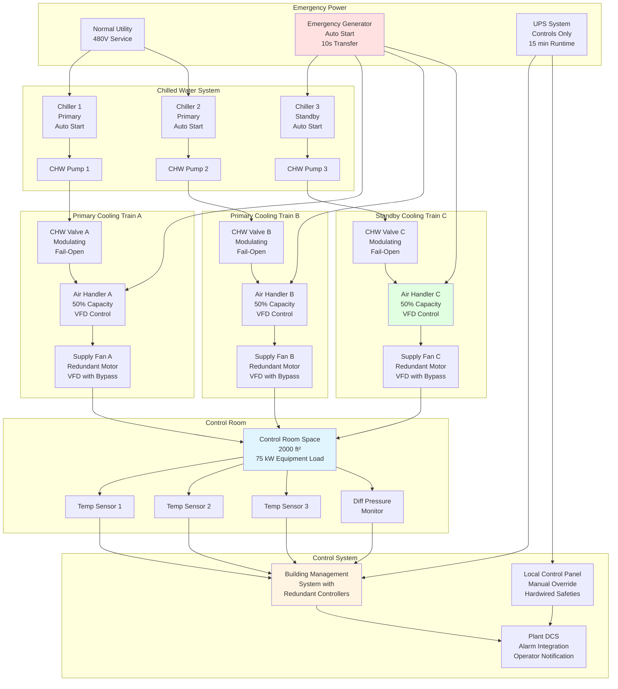

Помещения управления электростанций работают непрерывно без перерывов в течение месяцев или лет между плановыми остановками. Надежность системы HVAC напрямую влияет на доступность установки—превышение температуры в помещении управления заставляет эвакуировать операторов и остановить электростанцию в течение минут. Инженерная задача сосредоточена на исключении единых точек отказа при сохранении точного управления окружающей средой во всех условиях работы, отказах оборудования и сценариях обслуживания.

## Характеристики непрерывной охлаждающей нагрузки

Тепловые нагрузки в помещениях управления проявляют минимальные изменения в течение 24-часовых циклов и сезонных изменений. В отличие от коммерческих зданий с профилями нагрузок, зависящими от загруженности, помещения управления поддерживают стационарные условия:

**Электронное оборудование**: Системы распределенного управления, программируемые логические контроллеры, сетевые коммутаторы, рабочие станции операторов и оборудование мониторинга работают непрерывно при постоянном энергопотреблении. Это создает не зависящую от времени явную тепловую нагрузку:

$$Q_{\text{equip}} = \sum_{i=1}^{n} P_i \times 3.413 \text{ кДж/ч на Вт}$$

где $P_i$ представляет фактическое энергопотребление каждого устройства. Современные цифровые системы управления генерируют 807-1614 Вт/м² по сравнению с унаследованными аналоговыми системами на уровне 323-538 Вт/м².

**Нагрузки от присутствия людей**: Тепловые нагрузки от персонала варьируются в зависимости от расписания смен, но составляют незначительную часть общей нагрузки. Для помещения управления площадью 186 м² с 4 операторами:

$$Q_{\text{occupants}} = N \times 0.292 \text{ кДж/с} = 4 \times 0.292 = 1.168 \text{ кДж/с явной}$$

Это представляет менее 5% типовой общей охлаждающей нагрузки 14.6-29.3 кДж/с.

**Нагрузки от ограждающих конструкций**: Помещения управления расположены во внутренних частях зданий, что минимизирует солнечные и передаточные нагрузки. При наличии наружного воздействия конструкция с высокими характеристиками ограждения ограничивает проводимость:

$$Q_{\text{wall}} = U \times A \times \Delta T$$

Для стены с RSI 3.52 (U = 0.284 Вт/м²·К), площадью наружного ограждения 18.6 м², разностью температур 11.1 К:

$$Q_{\text{wall}} = 0.284 \times 18.6 \times 11.1 = 58.8 \text{ Вт}$$

**Общая явная нагрузка**: Доминируется тепловыделением оборудования, создавая практически постоянный спрос на охлаждение:

$$Q_{\text{total}} = Q_{\text{equip}} + Q_{\text{occupants}} + Q_{\text{envelope}} + Q_{\text{lighting}} + Q_{\text{infiltration}}$$

Для типового помещения управления: базовая нагрузка 21.9 кДж/с с изменением ±5% в течение 24-часового периода.

## Критерии проектирования непрерывной работы

### Нулевая переносимость времени простоя

Системы HVAC помещений управления не могут переносить запланированные или незапланированные остановки. Расчеты повышения температуры демонстрируют критичность по времени:

**Тепловой отклик на отказ охлаждения**: Скорость накопления тепла зависит от плотности охлаждающей нагрузки и тепловой массы помещения:

$$\frac{dT}{dt} = \frac{Q_{\text{load}}}{m \times c_p}$$

Для помещения управления объемом 56.6 м³ (потолок высотой 3 м), масса воздуха: $m = 65.8$ кг

При охлаждающей нагрузке 21.9 кДж/с и удельной теплоемкости $c_p = 1005$ Дж/кг·К:

$$\frac{dT}{dt} = \frac{21.9}{65.8 \times 1.005} = 0.333 \text{ К/мин} = 19.8 \text{ К/ч}$$

Этот упрощенный расчет (не учитывающий тепловую массу оборудования, мебели и конструкции) демонстрирует потенциал быстрого повышения температуры. Наблюдаемые фактические скорости повышения 5.6-11.1 К/ч при отказе охлаждения демонстрируют немедленную угрозу оборудованию и операциям.

**Допустимый диапазон температуры**: Спецификации электронного оборудования обычно допускают работу при 10-35°C, но оптимальная надежность требует 21-24°C. Многие объекты устанавливают сигнал тревоги высокой температуры при 26-27°C и автоматическую остановку электростанции при 29-32°C, обеспечивая окно ответа в 30-90 минут перед принудительной остановкой.

### Требования надежности

Критические системы HVAC объектов достигают надежности через резервирование, качество компонентов и систематическое обслуживание:

**Среднее время между отказами (MTBF)**: Коммерческое оборудование HVAC демонстрирует MTBF 20000-40000 часов (2.3-4.6 года) в зависимости от качества компонентов и условий работы. Для помещения управления, требующего 99.9% доступности в течение 8760 часов ежегодно:

$$\text{Допустимое время простоя} = 8760 \times 0.001 = 8.76 \text{ ч/год}$$

Одна установка оборудования с MTBF 30000 часов и средним временем ремонта (MTTR) 4 часа обеспечивает:

$$\text{Доступность} = \frac{\text{MTBF}}{\text{MTBF} + \text{MTTR}} = \frac{30000}{30004} = 0.9999 = 99.99\%$$

Однако это предполагает немедленное обнаружение отказа, наличие запасных частей и квалифицированных технических специалистов на месте—нереально для большинства объектов.

**Влияние резервирования на надежность**: Конфигурация N+1 с тремя установками мощностью 50% каждая обеспечивает продолжение работы при одном отказе. Доступность системы увеличивается резко:

$$A_{\text{system}} = 1 - (1 - A_{\text{unit}})^{n-k}$$

где $n$ = общее количество установок, $k$ = минимальное количество установок, требуемых для работы.

Для трех установок, двух требуемых, каждая с доступностью 0.999:

$$A_{\text{system}} = 1 - (1 - 0.999)^{3-2} = 1 - (0.001)^1 = 0.999$$

Этот расчет упрощает, не учитывая общие отказы, но демонстрирует эффективность резервирования.

## Сравнение конфигураций резервирования

| Конфигурация | Установлено установок | Мощность установки | Общая мощность | Работоспособна после одного отказа | Возможность обслуживания | Относительная начальная стоимость | Эффективность работы | Переносимость отказов |
|---|---|---|---|---|---|---|---|---|
| **N (без резервирования)** | 2 | 50% каждая | 100% | 50% | Нет без остановки | 1.0× | Отличная при полной нагрузке | Нет |
| **N+1 (базовая)** | 3 | 50% каждая | 150% | 100% | Одна установка | 1.5× | Хорошая (2 из 3 работают) | Одиночный отказ |
| **N+1 (консервативная)** | 3 | 60% каждая | 180% | 120% | Одна установка | 1.8× | Хорошая (2 из 3 работают) | Одиночный отказ + запас |
| **N+2** | 4 | 50% каждая | 200% | 100% | Две установки | 2.0× | Удовлетворительная (2 из 4 работают) | Два одновременных отказа |
| **2N (полное резервирование)** | 4 | 50% каждая | 200% | 100% | Одна полная система | 2.0× | Удовлетворительная (одна система неиспользуемая) | Отказ полной системы |
| **2N+1** | 5 | 50% каждая | 250% | 100% | Одна полная система + одна установка | 2.5× | Удовлетворительная (несколько установок неиспользуемые) | Любой отказ двух установок |

**Руководство по выбору конфигурации**:

- **N+1 базовая**: Коммерческие объекты, целевая доступность 99.5-99.9%, ограниченный бюджет
- **N+1 консервативная**: Промышленные объекты, электростанции, целевая доступность 99.9%, избыточность обеспечивает возможность роста нагрузки
- **N+2**: Критические промышленные объекты, инфраструктурные объекты, требующие гибкости обслуживания
- **2N**: Ядерные объекты, оборонные установки, критические приложения, требующие полного резервирования системы
- **2N+1**: Наивысшие требования надежности, объекты, где стоимость простоя превышает премию стоимости системы

## Архитектура системы для непрерывной работы

## Профилактическое обслуживание без простоя

Архитектура резервной системы позволяет проводить обслуживание компонентов без влияния на условия окружающей среды:

### Плановые окна обслуживания

**Обслуживание ротационного оборудования**: Воздухообработчики, насосы и холодильники требуют квартального или годового обслуживания, включающего замену фильтров, проверку ремней, смазку подшипников и проверку производительности. Резервирование N+1 позволяет изолировать отдельные установки:

1. Проверить статус резервной установки
2. Перевести охлаждающую нагрузку на работающие установки
3. Изолировать установку, требующую обслуживания (закрыть клапаны, отключить электричество)
4. Провести работы по обслуживанию
5. Функциональная проверка перед возвращением в работу
6. Восстановить к автоматической работе

**Инвентарь критических запасных частей**: Запасные части на месте для компонентов с длительным временем поставки или критических компонентов позволяют быстрый ремонт:

- Платы управления и приводы (время поставки 4-8 недель)
- Двигатели вентиляторов и приводы (время поставки 2-4 недель)
- Клапаны холодной воды и приводы (время поставки 1-2 недели)
- Датчики температуры и влажности (немедленная замена)
- Воздушные фильтры (непрерывный инвентарь, потребление ежеквартально)

### Стратегии прогностического обслуживания

**Вибрационный мониторинг**: Мониторинг состояния подшипников ротационного оборудования обнаруживает деградацию до отказа. Повышенные тренды вибрации инициируют замену компонентов во время планового окна обслуживания, а не аварийного ремонта.

**Мониторинг производительности**: Непрерывный мониторинг температуры подающего воздуха, положения клапана холодной воды, потребления мощности вентилятора и перепада давления выявляет деградацию:

- Загрязненные охлаждающие катушки требуют более высокого расхода холодной воды (положение клапана) для же охлаждающей способности
- Грязные фильтры повышают потребление мощности вентилятором и снижают расход воздуха
- Потеря хладагента снижает охлаждающую способность и повышает время работы компрессора

**Тепловизионная съемка**: Ежегодные обследования инфракрасной термографией идентифицируют деградацию электрических соединений, перегрев подшипников и неисправность клапанов перед катастрофическим отказом.

## Стандарты и требования для критических объектов

**Стандарт ASHRAE 90.1**: Требования энергоэффективности предусматривают исключения для критических систем, включающих помещения управления. Исключения признают, что приоритеты надежности и непрерывной работы превосходят оптимизацию энергии для критически важных приложений.

**NFPA 75 - Стандарт для защиты оборудования информационных технологий**: Устанавливает требования к окружающей среде:

- Температура: 18-27°C рекомендуемая, 15-32°C допустимая
- Относительная влажность: 40-55% рекомендуемая, 20-80% допустимая
- Скорость изменения: максимум 2.8 К/ч
- Точка росы: 5.5-15°C рекомендуемая

Помещения управления электростанций обычно превосходят эти руководящие принципы, поддерживая более узкий диапазон 22-24°C.

**IEEE 323 - Квалификация оборудования класса 1E для атомных электростанций**: Ядерные объекты требуют квалификации оборудования для температуры, влажности, радиации и сейсмических условий. Оборудование HVAC помещения управления должно поддерживать функциональность после проектных базовых событий.

**Стандарты уровней Uptime Institute**: Классификации центров данных обеспечивают каркас, применимый к помещениям управления:

- **Уровень III**: Одновременно обслуживаемая (N+1 минимум), доступность 99.982%
- **Уровень IV**: Отказоустойчивая (2N или 2(N+1)), доступность 99.995%

Большинство помещений управления электростанций соответствуют или превосходят критерии уровня III; ядерные объекты приближаются к уровню IV.

## Анализ режимов отказа и снижение рисков

**Отказы отдельных компонентов**:

- **Отказ воздухообработчика**: Оставшиеся установки автоматически увеличивают мощность для поддержания уставки температуры
- **Отказ клапана холодной воды**: Установка работает при сниженной мощности; BMS увеличивает выход оставшейся установки
- **Отказ двигателя вентилятора**: Резервная установка активируется; сигнализация техническому обслуживанию для планирования ремонта
- **Отказ датчика температуры**: Логика управления переключается на резервный датчик; сигнализация для замены

**Каскадные отказы**:

- **Отказ станции холодильников**: Выделенный холодильник помещения управления или временное охлаждение (портативные установки) поддерживает работу при длительном отказе холодильника
- **Прерывание подачи электроэнергии**: Аварийный генератор обеспечивает оборудование HVAC в течение 10-30 секунд; UPS поддерживает работу системы управления во время передачи
- **Множественные одновременные отказы**: Резервирование 2N предотвращает влияние на окружающую среду; системы N+1 могут требовать временного портативного охлаждения или контролируемой остановки

**Общие отказы**: Единственные события, влияющие на множество компонентов, требуют дополнительных защитных мер:

- **Отказ системы управления**: Местные независимые термостаты переопределяют BMS, поддерживая базовое управление температурой
- **Загрязнение холодной воды**: Резервные холодильники на отдельных контурах предотвращают полную потерю охлаждения
- **Активация пожаротушения**: Воздухообработчики автоматически отключаются при тушении, перезапускаются после очистки агента

## Операционные аспекты для непрерывной доступности

**Стратегия балансировки нагрузки**: Работа множественных меньших установок при частичной мощности вместо минимального количества при полной мощности обеспечивает:

- Повышенная эффективность благодаря разгрузке компрессора
- Снижение тепловых циклов и износа компонентов
- Более быстрый ответ на изменения нагрузки
- Более низкие уровни акустического шума

**Сезонная регулировка**: Системы, спроектированные для пиковых летних условий, работают при частичной нагрузке во время умеренной погоды. Управление VFD снижает потребление энергии вентилятором пропорционально снижению нагрузки. Сброс температуры холодной воды (повышение температуры подачи при низких нагрузках) улучшает эффективность холодильника.

**Тестирование проверки производительности**: Квартальные функциональные тесты проверяют:

- Автоматическое переключение на резервное оборудование при отказе основного
- Функциональность сигнализации и уведомление оператора
- Автоматическая передача аварийного электропитания и работа
- Переход системы управления на резервные контроллеры
- Точность управления температурой и влажностью

**Требования к документации**: Процедуры работы, расписания обслуживания, спецификации оборудования и последовательности управления документированы для персонала операций и обслуживания. Ежегодный пересмотр обеспечивает точность по мере изменения оборудования или условий работы.

---

**Успешная разработка 24/7 систем HVAC помещений управления требует систематического исключения режимов отказа через резервирование, выбор компонентов высокого качества, комплексный мониторинг и дисциплинированное обслуживание. Инвестиция в инфраструктуру надежности предотвращает намного более дорогие последствия потери управления окружающей средой: остановку установки, повреждение оборудования и риски безопасности персонала.**
