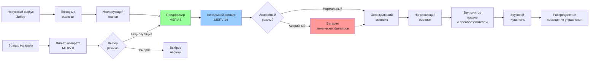

Системы фильтрации воздуха в помещениях управления АЭС защищают критически важное электронное оборудование и персонал от загрязнения воздуха взвешенными частицами, обеспечивая надежную работу измерительных приборов и безопасность операторов в нормальных и аварийных условиях. Стратегия фильтрации должна уравновешивать высокую эффективность удаления с перепадом давления в системе, энергопотреблением и интервалами замены фильтров при обеспечении возможности непрерывной работы.

## Основная физика фильтрации воздуха

Фильтрация воздуха осуществляется через четыре основных механизма улавливания частиц, каждый из которых доминирует в определенных диапазонах размеров частиц.

### Механизмы улавливания частиц

**Инерционное воздействие** доминирует для частиц >1 мкм, когда импульс частицы вызывает отклонение от линий потока на поверхностях волокон. Эффективность увеличивается с размером частицы и скоростью воздуха.

**Перехват** происходит, когда частицы, следующие линиям потока, проходят на расстоянии одного радиуса от поверхностей волокон. Критично для частиц размером 0,3–1,0 мкм.

**Диффузия** управляет захватом частиц <0,3 мкм, где броуновское движение вызывает случайные траектории частиц, увеличивая вероятность контакта с волокнами. Эффективность растет с уменьшением размера частицы.

**Электростатическое притяжение** улучшает захват, когда волокна или частицы несут электрический заряд, повышая эффективность во всех диапазонах размеров в электростатически заряженных материалах.

**Наиболее проникающий размер частиц (MPPS)** составляет приблизительно 0,3 мкм, где ни инерционный, ни диффузионный механизмы не доминируют, представляя точку минимальной эффективности механических фильтров.

## Эффективность удаления взвешенных частиц

Количественная оценка производительности фильтра использует соотношения проникновения и эффективности.

### Одноступенчатая эффективность

Доля частиц, удаленных при одном проходе через фильтр:

$$\eta = \frac{C_{upstream} - C_{downstream}}{C_{upstream}} = 1 - P$$

где:
- $\eta$ = одноступенчатая эффективность (безразмерная, 0–1)
- $C_{upstream}$ = концентрация частиц на входе в фильтр (частицы/объем)
- $C_{downstream}$ = концентрация частиц на выходе из фильтра (частицы/объем)
- $P$ = доля проникновения (безразмерная, 0–1)

### Выражение эффективности по Аррениусу

Для проникновения через фильтровальный материал толщиной $L$:

$$P = e^{-\alpha L}$$

где:
- $\alpha$ = коэффициент фильтрации (1/длина)
- $L$ = толщина материала (длина)

Это экспоненциальное соотношение демонстрирует, что удвоение толщины материала не удваивает эффективность, а обеспечивает убывающую отдачу.

### Эффективность многоступенчатой системы

Помещения управления используют последовательные ступени фильтрации. Для $n$ фильтров последовательно:

$$\eta_{total} = 1 - \prod_{i=1}^{n}(1 - \eta_i) = 1 - \prod_{i=1}^{n}P_i$$

Для двухступенчатой фильтрации с предфильтром MERV 8 ($\eta_1 = 0,70$) и финальным фильтром MERV 14 ($\eta_2 = 0,85$):

$$\eta_{total} = 1 - (1-0,70)(1-0,85) = 1 - (0,30)(0,15) = 0,955$$

Система достигает эффективности 95,5%, хотя ни одна ступень не превышает 85% отдельно.

### Дробная эффективность

Фильтры демонстрируют эффективность, зависящую от размера. ASHRAE 52.2 измеряет эффективность в трех диапазонах размеров частиц:

$$\eta_{composite} = \frac{\sum_{i=1}^{3}(E_i \times \Delta C_i)}{\sum_{i=1}^{3}\Delta C_i}$$

где:
- $E_i$ = эффективность в диапазоне размеров $i$
- $\Delta C_i$ = количество частиц в диапазоне размеров $i$

## Стандарт испытаний ASHRAE 52.2

Стандарт ASHRAE 52.2 обеспечивает стандартизированную методологию оценки производительности фильтра, заменяя устаревшие методы пятна пыли и улавливания.

### Процедура испытания

**Генерация частиц:** Полидисперсный аэрозоль хлорида калия с контролируемым распределением размеров (0,3–10 мкм).

**Точки измерения:** Концентрации перед фильтром и после фильтра измеряют одновременно оптическими счетчиками частиц.

**Диапазоны размеров частиц:**
- Диапазон 1: 0,30–1,0 мкм
- Диапазон 2: 1,0–3,0 мкм
- Диапазон 3: 3,0–10,0 мкм

**Протокол нагружения:** Загрузка синтетической пыли с контролируемыми интервалами с измерением эффективности в начальном состоянии и на протяжении цикла нагружения пыли до конечного перепада давления.

**Минимальное значение эффективности отчета (MERV):** Рейтинг от 1 до 16 на основе наихудшего (минимального) значения эффективности в трех диапазонах размеров.

### Корреляция рейтинга MERV

| MERV | Диапазон 1 (0,3–1 мкм) | Диапазон 2 (1–3 мкм) | Диапазон 3 (3–10 мкм) | Типовое применение |
|------|------------------------|----------------------|------------------------|---------------------|
| 8    | <20%                   | 20–35%               | 70–75%                | Предфильтрация |
| 11   | 20–35%                 | 65–80%               | 80–90%                | Высокопроизводительный коммерческий |
| 13   | 50–65%                 | 85–90%               | 90–95%                | Больницы, помещения управления |
| 14   | 75–85%                 | 90–95%               | 95–98%                | Высокоэффективные помещения управления |
| 16   | >95%                   | >95%                 | >95%                  | Производительность близка к HEPA |

Помещения управления обычно указывают MERV 13–14 для финальных ступеней фильтрации.

## Архитектура фильтрации помещений управления

## Выбор фильтров для промышленных сред

Помещения управления АЭС сталкиваются с уникальными задачами загрязнения воздуха, требующими выбора фильтров для конкретных применений.

### Сравнение материалов фильтров

| Тип фильтра | Диапазон эффективности | Начальный ΔP | Удержание пыли | Устойчивость к влаге | Фактор стоимости | Пригодность для помещений управления |
|-------------|------------------------|-----------------------|-----------------|-------------------|--------------------|--------------------------------------|
| Гофрированный синтетический | MERV 8–13 | 7,6–20,3 Па | Средняя | Хорошая | 1,0× | Отличный для пред/финального |
| Расширенная поверхность | MERV 11–14 | 10,2–22,9 Па | Высокая | Отличная | 1,5× | Идеален для финального |
| Жесткая коробка | MERV 13–15 | 12,7–30,5 Па | Очень высокая | Отличная | 2,0× | Ядерные/критические объекты |
| Мини-гофра | MERV 14–15 | 15,2–25,4 Па | Средне-высокая | Хорошая | 1,8× | Компактные установки |
| HEPA | 99,97% @ 0,3 мкм | 25,4–50,8 Па | Низко-средняя | Удовлетворительная | 4,0× | Ядерные, аварийный режим |
| Активированный уголь | N/A | 5,1–12,7 Па | N/A (химический) | Плохая | 3,0× | Аварийный токсичный газ |
| Электростатический | MERV 8–12 | 2,5–7,6 Па | Средняя | Плохая | 1,2× | Не рекомендуется (влажность) |

**Примечание:** Перепады давления указаны при номинальном расходе воздуха для чистых фильтров. Рабочее давление увеличивается с накоплением пыли.

### Критерии выбора

**Тип частиц:** Угольные ТЭС сталкиваются с золой (>1 мкм), газовые турбины – с частицами сгорания (<1 мкм), ядерные станции требуют возможности HEPA.

**Среда с влажностью:** Прибрежное расположение или экспозиция дрейфу градирни требуют синтетических материалов с устойчивостью к влаге. Целлюлозные материалы выходят из строя при намокании.

**Температурные экстремумы:** Фильтры наружного воздуха могут подвергаться температурам от -40°C до +49°C. Материал должен сохранять структурную целостность и эффективность во всем диапазоне температур.

**Частота нагружения пыльюю** Среды с высоким загрязнением требуют фильтров с расширенной поверхностью (20–30 см в глубину) для достижения приемлемого срока службы.

**Бюджет перепада давления:** Системные вентиляторы должны преодолевать перепад давления на фильтре. Более высокая эффективность обычно коррелирует с более высоким перепадом давления и энергопотреблением.

## Анализ перепада давления

Перепад давления на фильтре увеличивается с дневной скоростью лица и накоплением пыли, потребляя энергию вентилятора и снижая расход воздуха.

### Перепад давления чистого фильтра

Начальный перепад давления на чистом материале:

$$\Delta P_{clean} = K \times \frac{\rho V^2}{2g_c}$$

где:
- $\Delta P_{clean}$ = перепад давления (Па)
- $K$ = коэффициент сопротивления (безразмерный, зависит от материала)
- $\rho$ = плотность воздуха (кг/м³)
- $V$ = скорость лица (м/с)
- $g_c$ = гравитационная константа (9,81 м/с²)

Типовая скорость лица: 1,5–2,5 м/с для фильтров с расширенной поверхностью.

### Перепад давления нагруженного фильтра

По мере накопления пыли перепад давления увеличивается:

$$\Delta P_{loaded} = \Delta P_{clean} + K_d \times m_{dust}$$

где:
- $K_d$ = коэффициент нагружения пылью (Па на г/м²)
- $m_{dust}$ = масса пыли на единицу площади фильтра (г/м²)

Фильтры требуют замены при перепаде давления, увеличивающемся в 2–3 раза от чистого значения или при достижении установленного производителем максимума (обычно 38–51 Па для финальных фильтров).

## Рассмотрения при проектировании системы

### Пределы скорости лица

Чрезмерная скорость лица снижает эффективность и срок службы:

| Тип фильтра | Максимальная скорость лица | Типовая скорость проектирования |
|-------------|---------------------------|--------------------------------|
| Предфильтр (MERV 8) | 3,05 м/с | 2,0–2,5 м/с |
| Финальный фильтр (MERV 13–14) | 2,54 м/с | 1,5–2,0 м/с |
| HEPA фильтр | 1,52 м/с | 1,27 м/с |
| Активированный уголь | 2,03 м/с | 1,0–1,5 м/с |

Занижение размера площади фильтра для снижения начальной стоимости увеличивает скорость лица, перепад давления и эксплуатационные расходы при одновременном сокращении срока службы фильтра.

### Размер батареи фильтров

Требуемая площадь фильтра:

$$A_{filter} = \frac{Q}{V_{face} \times 60}$$

где:
- $A_{filter}$ = площадь лица фильтра (м²)
- $Q$ = расход воздуха (м³/ч)
- $V_{face}$ = скорость лица (м/с)

Для помещения управления с расходом 4,72 м³/с (16 992 м³/ч) и финальным фильтром MERV 14 при скорости 1,78 м/с:

$$A_{filter} = \frac{16992}{1,78 \times 3600} = 2,65 \text{ м}^2$$

Стандартные фильтры размером 0,61×0,61×0,30 м обеспечивают 0,37 м², требуя минимум 8 фильтров. Проектирование обычно включает 10–12 фильтров для операционного запаса.

### Мониторинг дифференциального давления

Каждая ступень фильтрации требует непрерывного измерения перепада давления:

**Магнелические манометры:** Аналоговое отображение в воздухообрабатывающем устройстве для локального мониторинга. Диапазон 0–51 Па типичен для финальных фильтров.

**Датчики дифференциального давления:** Электронный сигнал для BMS с целью отслеживания, срабатывания тревоги и прогнозного планирования обслуживания. Стандартный выход 0–10 В постоянного тока или 4–20 мА.

**Установки точек срабатывания тревоги:**
- Предфильтр: 20,3–25,4 Па (требуется замена)
- Финальный фильтр: 38–51 Па (требуется замена)
- Общая система: На основе кривой вентилятора и порога деградации расхода

### Оценка срока службы

Частота замены фильтра зависит от загрузки загрязнением:

$$t_{service} = \frac{(\Delta P_{final} - \Delta P_{initial}) \times A_{filter}}{K_d \times Q \times C_{average}}$$

где:
- $t_{service}$ = срок службы (часы)
- $C_{average}$ = средняя концентрация частиц (масса/объем)
- Остальные члены определены ранее

Типовый срок службы:
- Предфильтры: 3–6 месяцев
- Финальные фильтры: 12–24 месяца
- HEPA фильтры: 3–5 лет (только аварийный режим)
- Угольные фильтры: 2–4 года (зависит от химического воздействия)

Фактический срок службы варьируется с местным качеством воздуха. Городские/промышленные объекты могут видеть 50% сокращение по сравнению с сельскими местоположениями.

## Фильтрация в аварийном режиме

При токсичном выбросе газа, пожаре или других внешних опасностях помещения управления переходят в режим рециркуляции с улучшенной фильтрацией.

### Химическая фильтрация

Адсорбция активированным углем удаляет газообразные загрязнители:

$$q_e = k_f \times C^{1/n}$$

где:
- $q_e$ = емкость равновесного погружения (масса адсорбата/масса углерода)
- $k_f$ = коэффициент емкости Фрейндлиха (зависит от пары адсорбент-адсорбат)
- $C$ = концентрация газа (масса/объем)
- $n$ = параметр интенсивности Фрейндлиха (типично 1,5–4)

Угольные слои обычно обеспечивают глубину 10–15 см с временем контакта 0,5–2 секунды. Испытание на прорыв требуется для конкретных загрязнителей.

### HEPA фильтрация

Ядерные объекты требуют HEPA фильтрации (99,97% эффективности @ 0,3 мкм) для защиты от радиоактивного загрязнения частиц при проектных аварийных сценариях.

Конструкция фильтра: Непрерывно гофрированный материал, корпус из алюминия или нержавеющей стали, прокладки из неопрена или силикона. Испытано согласно MIL-STD-282 или эквиваленту.

Бюджет перепада давления при проектировании системы должен учитывать перепад давления HEPA (минимум 25,4 Па чистого) при одновременном обеспечении требуемого расхода воздуха в аварийных условиях.

## Техническое обслуживание и испытания

**Визуальный осмотр:** Ежемесячный осмотр на предмет повреждения материала, целостности уплотнения прокладки, деформации корпуса.

**Испытания на месте:** Ежегодное испытание HEPA фильтра с использованием аэрозоля ПАО или ДОП с последующим сканированием для выявления утечек.

**Протокол замены фильтра:**
1. Переход системы на резервное устройство (операция N+1)
2. Закрытие изолирующего клапана
3. Сброс давления батареи фильтров
4. Замена отдельных фильтров (от грязных к чистым)
5. Осмотр прокладки и очистка
6. Проверка перепада давления
7. Возврат в эксплуатацию с постепенной передачей нагрузки

**Документирование:** Журналы замены фильтров включают дату, перепады давления (до/после), типы/количество фильтров, трудозатраты и метод утилизации (особенно для загрязненных фильтров).

Надлежащее проектирование и техническое обслуживание системы фильтрации обеспечивает надежность оборудования в помещениях управления и безопасность персонала во время нормальной работы и аварийных сценариев, образуя критический элемент доступности АЭС и нормативного соответствия.
