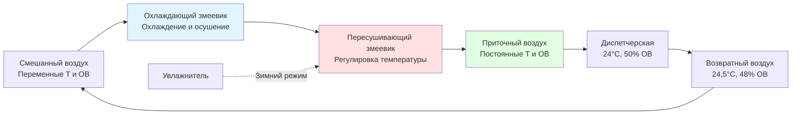
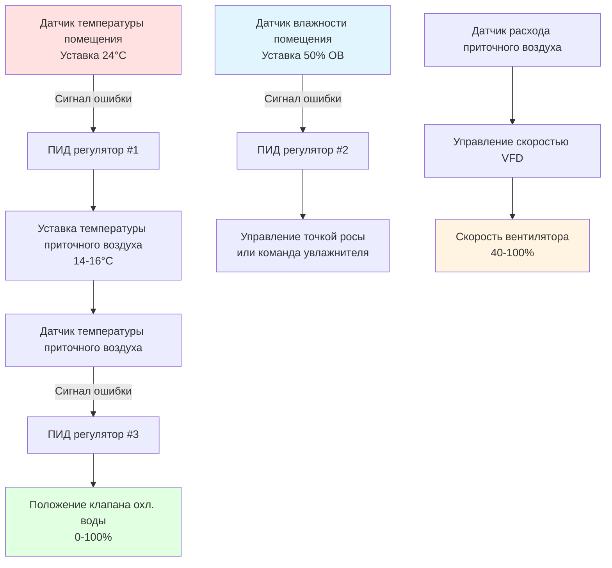

Прецизионное управление микроклиматом в диспетчерских электростанций требует стабильности температуры и влажности на порядок выше, чем обычные системы кондиционирования. Электронное оборудование управления требует допуска по температуре ±1,1°C и допуска по относительной влажности ±5% для обеспечения надежной работы, в то время как операторы требуют комфортных условий во время непрерывных смен продолжительностью 12 часов. Одновременное удовлетворение требований защиты оборудования и стандартов комфорта человека определяет сложные стратегии управления, основанные на физике теплопередачи и психрометрических принципах.

## Физика управления температурой

### Основы теплопередачи

Отвод тепла электронного оборудования следует принципам конвективной теплопередачи, где емкость охлаждения чувствительного тепла должна непрерывно соответствовать мгновенным скоростям генерации тепла для поддержания стабильной температуры.

Фундаментальное уравнение теплового баланса, управляющее тепловой стабильностью диспетчерской:

$$Q_{cooling} = Q_{equipment} + Q_{envelope} + Q_{occupants} + Q_{ventilation}$$

где каждый член представляет мгновенный поток тепла в кДж/ч или ватах.

**Тепловые нагрузки оборудования** составляют преобладающую часть общих требований охлаждения, обычно составляя 70-85% от общего прироста тепла. Современные системы распределенного управления (DCS) генерируют тепло посредством:

- Рассеивание мощности процессора: $P = V \times I \times (1 - \eta)$, где неэффективность появляется как тепловая энергия
- Потери блока питания: 15-25% выходной мощности постоянного тока преобразуются в тепло
- Подсветка дисплея и электроника
- Трение и потери электроэнергии механического диска

Типовой корпус DCS, вмещающий процессоры, блоки питания, модули ввода-вывода и сетевое оборудование, генерирует непрерывную тепловую нагрузку 3 000-5 000 Вт. Диспетчерские с 20-30 корпусами оборудования производят 60 000-150 000 Вт (17-43 кВт) только от электроники.

**Прирост тепла через ограждающие конструкции** через стены, крыши и окна следует закону Фурье теплопроводности:

$$Q_{cond} = U \times A \times \Delta T$$

где:
- $U$ = общий коэффициент теплопередачи (Вт/м²·К)
- $A$ = площадь поверхности (м²)
- $\Delta T$ = разность температур по конструкции (К)

Диспетчерские обычно занимают внутренние помещения здания, минимизирующие воздействие ограждающих конструкций. При наличии наружных стен, высокопроизводительные конструкции (U ≤ 0,3 Вт/м²·К) ограничивают кондуктивные приросты менее 5% от общей нагрузки охлаждения.

**Чувствительное тепло от людей** варьируется в зависимости от уровня активности и температуры окружающей среды. Сидящие операторы в окружающей среде 24°C генерируют примерно 260 Вт чувствительного тепла через метаболические процессы.

**Вентиляционная нагрузка** результируется из введения наружного воздуха для pressurization и качества воздуха в помещении:

$$Q_{vent} = 1.08 \times CFM \times \Delta T \text{ (в BTU/hr, используя CFM)}$$

или в метрических единицах:

$$Q_{vent} = 0.33 \times V_{воздуха} \times \Delta T$$

где $V_{воздуха}$ в м³/ч и результат в кВт.

При расчетных условиях (35°C наружного воздуха, 24°C внутреннего, 1 700 м³/ч наружного воздуха), вентиляционная чувствительная нагрузка равна 6,3 кВт.

### Тепловая масса и стабильность температуры

Стабильность температуры—критическая цель проектирования—зависит от тепловой массы системы и характеристик отклика контура управления.

Скорость изменения температуры при дисбалансе емкости охлаждения и генерации тепла следует:

$$\frac{dT}{dt} = \frac{Q_{net}}{m \times c_p}$$

где:
- $Q_{net}$ = чистый прирост или потеря тепла (кВт)
- $m$ = тепловая масса (кг)
- $c_p$ = удельная теплоемкость (кДж/кг·К)

Тепловая масса диспетчерской включает:

| Компонент | Вклад массы (кг) | Удельная теплоемкость |
|-----------|----------------|----------------------|
| Объем воздуха (280 м³) | 340 | 1,0 кДж/кг·К |
| Оборудование (30 корпусов) | 6 800 | 0,50 кДж/кг·К |
| Конструкция приподнятого пола | 3 600 | 0,84 кДж/кг·К |
| Бетонная плита | 20 400 | 0,92 кДж/кг·К |
| **Итого** | **31 140** | **0,79 кДж/кг·К (ср.)** |

Тепловая емкость: $C_{thermal} = 31,140 \text{ кг} \times 0,79 = 24,600$ кДж/К

При полном отказе охлаждения с непрерывной генерацией тепла 587 кВт:

$$\frac{dT}{dt} = \frac{587}{24,600/3600} = 85,8 \text{ К/ч} = 8,5 \text{ °C/ч}$$

Этот расчет показывает, что диспетчерские достигают неприемлемых температур (>29°C предел оборудования) за 40-50 минут полной потери охлаждения, подчеркивая требования резервирования.

## Психрометрия управления влажностью

### Влажностный баланс и скрытые нагрузки

Управление влажностью поддерживает относительную влажность в диапазоне 40-55%, защищая электронные компоненты от электростатического разряда (низкая влажность) и конденсации (высокая влажность), при этом обеспечивая комфорт операторов.

Уравнение влажностного баланса:

$$W_{removal} = W_{ventilation} + W_{occupants} + W_{infiltration} - W_{humidification}$$

где потоки влаги выражаются как кг H₂O/ч или г/ч.

**Скрытое тепло от людей** варьируется в зависимости от активности и температуры. Сидящие операторы при 24°C генерируют примерно 210 Вт скрытого тепла, соответствующего:

$$W_{occupant} = \frac{210 \text{ Вт}}{2 450 \text{ кДж/кг}} = 0,086 \text{ кг/ч}$$

На 8 операторов: 0,69 кг/ч добавления влаги.

**Вентиляционная влага** зависит от влажности наружного воздуха. При летних расчетных условиях (35°C сухой термометр, 26°C влажный термометр, W = 0,0166 кг/кг), введение 1 700 м³/ч наружного воздуха в помещение 24°C, 50% ОВ (W = 0,0094 кг/кг) добавляет:

$$W_{vent} = 1700/3600 \times 1.2 \times (0,0166 - 0,0094) = 0,033 \text{ кг/с} = 0,12 \text{ кг/ч}$$

Это представляет непрерывное поступление влаги, требующее постоянного осушения.

**Инфильтрационная влага** остается минимальной благодаря положительному давлению в помещении, предотвращающему неконтролируемый просос воздуха в кондиционируемое пространство.

### Психрометрические процессы для прецизионного управления

Достижение независимого управления температурой и влажностью требует развязанных чувствительных и скрытых процессов кондиционирования.

**Охлаждение и осушение** происходит при контакте воздуха с поверхностью охлажденного змеевика ниже температуры точки росы. Влага конденсируется из потока воздуха, в то время как чувствительное охлаждение снижает температуру сухого термометра.

Оставляемое условие змеевика следует точке россы аппарата (ADP), обычно 11-13°C. Смешанный воздух, входящий при 24°C, 50% ОВ (точка росы 13°C), требует ADP змеевика ниже 13°C для эффективного осушения.

Коэффициент чувствительного тепла змеевика (SHR):

$$SHR = \frac{Q_{sensible}}{Q_{total}} = \frac{Q_{sensible}}{Q_{sensible} + Q_{latent}}$$

Нагрузки диспетчерской с высоким тепловыделением оборудования и минимальной генерацией влаги показывают SHR = 0,85-0,95, требуя относительно теплой работы змеевика, избегая чрезмерного осушения.

**Пересушивание** восстанавливает температуру приточного воздуха после глубокого охлаждения при осушении. В приложениях с низкой скрытой нагрузкой минимальное переохлаждение происходит, исключая требование пересушивания большинство часов работы.

В зимний период с холодным, сухим наружным воздухом **увлажнение** предотвращает падение влажности помещения ниже минимума 40% ОВ. Паровые увлажнители обеспечивают прецизионное управление без введения риска биологического загрязнения от испарительных систем.

### Стратегия управления отношением влажности

Поддержание постоянного отношения влажности (абсолютное содержание влаги) упрощает управление и улучшает стабильность по сравнению с управлением относительной влажностью.

При расчетной температуре 24°C, 50% ОВ соответствует отношению влажности W = 0,0094 кг H₂O/кг сухого воздуха.

Отношение влажности приточного воздуха должно равняться отношению влажности помещения в установившемся режиме:

$$W_{supply} = W_{space} = 0,0094 \text{ кг/кг}$$

При известной чувствительной нагрузке охлаждения и требуемом перепаде температур от приточного воздуха к помещению (обычно 8-11°C), температура приточного воздуха становится:

$$T_{supply} = T_{space} - \frac{Q_{sensible}}{V_{воздуха} \times 0.33}$$

Для 587 кВт чувствительной нагрузки и 1 700 м³/ч потока воздуха:

$$T_{supply} = 24 - \frac{587}{1700 \times 0.33/3600} = 24 - 9,2 = 14,8°C$$

Приточный воздух при 14,8°C и W = 0,0094 кг/кг соответствует примерно 80% ОВ—достижимо без штрафа за энергию пересушивания.

## Распределение тепловых нагрузок оборудования

### Пространственная концентрация нагрузки

В отличие от обычных зданий с относительно равномерным распределением тепла, диспетчерские показывают экстремальную пространственную концентрацию нагрузки вокруг корпусов оборудования.

**Тепловой поток на уровне корпуса** достигает 5 000-10 000 Вт/м² площади пола непосредственно под оборудованием стоек, в то время как незанятые зоны генерируют минимальное тепло. Такая концентрация определяет проектирование распределения.

| Тип зоны | Площадь (м²) | Тепловой поток (Вт/м²) | Общая нагрузка (кВт) |
|----------|------------|----------------------|-------------------|
| Корпусы DCS | 28 | 8 600 | 240 |
| Рабочие станции операторов | 37 | 1 600 | 60 |
| Зона совещаний | 18 | 200 | 4 |
| Циркуляция | 56 | 50 | 3 |
| **Итого** | **139** | **2 200 (средн.)** | **307** |

### Временные вариации нагрузки

Тепловые нагрузки диспетчерской демонстрируют высокую стабильность по сравнению с коммерческими зданиями с переменной занятостью и графиками освещения.

**Оборудование работает непрерывно** при потреблении электроэнергии в установившемся режиме. Современные функции управления питанием (дросселирование процессора, затемнение дисплея) производят <10% вариации между пиковой и минимальной нагрузкой.

**Нагрузки от людей варьируются** со сменами, совещаниями и оперативными непредвиденными обстоятельствами. Проектирование на максимальную занятость (12-16 человек) обеспечивает адекватную емкость во время аварийных событий, требующих дополнительных операторов.

**Сезонный колебание ограждающей конструкции** остается минимальным для внутренних помещений. Наружные стены диспетчерской испытывают летний пиковый солнечный прирост и зимнюю кондуктивную потерю, но конструкция высокопроизводительного ограждения ограничивает сезонную вариацию до <15% от общей нагрузки.

Профиль нагрузки 24-часового периода демонстрирует замечательную стабильность:

```mermaid
gantt
    title Профиль тепловой нагрузки диспетчерской (24-часовой период)
    dateFormat HH:mm
    axisFormat %H:%M

    section Нагрузка (кВт)
    Оборудование (постоянно) :active, eq, 00:00, 24h
    Базовые операторы (8 чел.) :active, occ1, 00:00, 24h
    Дополнительные операторы (4 чел.) :crit, occ2, 08:00, 8h
    Дополнительные операторы (4 чел.) :crit, occ3, 16:00, 8h
```

Непрерывная базовая нагрузка (оборудование + минимальная занятость) = 265 кВт
Пиковая нагрузка (полная занятость) = 280 кВт
Вариация нагрузки: **5,7%**—практически постоянна с точки зрения размеров HVAC.

## Интеграция систем управления

### Архитектура многоконтурного управления

Прецизионное управление микроклиматом требует каскадных контуров управления, обращающихся к:

1. **Первичный контур**: управление температурой помещения
2. **Вторичный контур**: управление влажностью помещения
3. **Третичные контуры**: температура приточного воздуха, положение клапана охлажденной воды, скорость вентилятора

**Пропорционально-интегрально-дифференциальное (ПИД) управление** обеспечивает стабильное, прецизионное регулирование. Для управления температурой помещения:

$$u(t) = K_p \times e(t) + K_i \int_0^t e(\tau)d\tau + K_d \frac{de(t)}{dt}$$

где:
- $u(t)$ = выход регулятора (коррекция уставки температуры приточного воздуха)
- $e(t)$ = сигнал ошибки (измеренная температура - уставка)
- $K_p$ = коэффициент пропорционального усиления
- $K_i$ = коэффициент интегрального усиления
- $K_d$ = коэффициент дифференциального усиления

Типовые параметры настройки для управления температурой диспетчерской:
- $K_p$ = 1,7 (1,7°C изменения температуры приточного воздуха на 1°C ошибки температуры помещения)
- $K_i$ = 0,5 в минуту (исключает установившееся смещение)
- $K_d$ = 0,1 минут (демпфирует колебания)

### Размещение датчиков и усреднение

Точность измерения температуры и влажности непосредственно влияет на прецизионность управления.

**Усреднение многих датчиков** исключает локальные аномалии и обеспечивает представительные условия помещения. Установите 4-6 датчиков температуры по всей диспетчерской на уровне оборудования (1,2-1,8 м над полом), избегая:
- Прямого попадания приточного воздуха
- Поверхностей теплопроизводящего оборудования
- Холодных поверхностей наружных стен
- Решеток возвратного воздуха

Алгоритм управления усредняет показания:

$$T_{space} = \frac{1}{n}\sum_{i=1}^n T_i$$

Этот подход усреднения снижает влияние отказа отдельного датчика и улучшает пространственное представление.

**Датчики влажности** требуют обслуживания калибровки каждые 6-12 месяцев. Емкостные датчики ОВ дрейфуют на ±3% ежегодно. Разместите три датчика с автоматизированным оповещением об отклонении, определяющим дрейф калибровки или отказ датчика.

### Зона мертвого хода и диапазон модуляции

**Зона мертвого хода управления** предотвращает чрезмерную активность управления и цикличность оборудования. Установите зону мертвого хода температуры помещения ±0,3°C около уставки 24°C:
- Охлаждение включается при 24,3°C
- Нагревание включается при 23,7°C (если установлено)

**Диапазон модуляции** определяет величину ошибки, производящей полный выход регулятора. Для управления клапаном охлажденной воды с уставкой температуры приточного воздуха 16°C:
- Клапан полностью открыт (максимальное охлаждение) при 17°C приточного воздуха
- Клапан полностью закрыт при 15°C приточного воздуха
- Диапазон модуляции: 2°C

Узкие диапазоны модуляции повышают прецизионность управления, но могут вызвать нестабильность. Широкие диапазоны улучшают стабильность за счет прецизионности. Диапазон 2°C балансирует конкурирующие цели.

## Интеграция комфорта оператора

### Физика теплового комфорта человека

Тепловой комфорт человека зависит от шести параметров: температуры воздуха, лучистой температуры, влажности, скорости воздуха, интенсивности метаболизма и теплоизолирующих свойств одежды.

Модель **предсказываемого среднего голоса (PMV)** количественно определяет тепловое ощущение:

$$PMV = f(M, W, T_a, T_r, RH, v_{air}, I_{clo})$$

Для операторов диспетчерской:
- Интенсивность метаболизма (M) = 1,2 met (сидячая офисная работа)
- Теплоизоляция одежды ($I_{clo}$) = 0,7 clo (casual бизнес)
- Скорость воздуха ($v_{air}$) = 0,15-0,25 м/с (низкая, но ощущаемая)

При температуре воздуха 24°C, средней лучистой температуре 24°C, 50% ОВ и скорости воздуха 0,2 м/с, PMV = 0 (нейтральное тепловое ощущение). Это условие удовлетворяет критериям теплового комфорта стандарта ASHRAE Standard 55 для >90% приемлемости занятых.

**Асимметрия лучистой температуры** возникает, когда корпусы оборудования генерируют лучистое тепло (температуры поверхности 29-35°C), в то время как операторы сидят 1-1,5 м отдалеке. Лучистая теплопередача следует закону Стефана-Больцмана:

$$Q_{rad} = \sigma \times \epsilon \times A \times (T_{hot}^4 - T_{cold}^4)$$

Лицевая панель корпуса 1,8 м × 1,8 м при 32°C (305 К) излучает в сторону оператора при 24°C (297 К):

$$Q_{rad} = 5,67 \times 10^{-8} \times 0,85 \times 3,24 \times (305^4 - 297^4) = 1,5 \text{ кВт}$$

Этот лучистый обмен нагревает операторов на стороне оборудования, в то время как охлаждает операторов на противоположной стороне, создавая локальный дискомфорт несмотря на приемлемую среднюю температуру воздуха.

**Локализованное распределение воздуха** с использованием регулируемых диффузоров рядом с рабочими станциями операторов позволяет индивидуальную регулировку скорости (0,1-0,3 м/с), компенсируя лучистую асимметрию и личные предпочтения.

### Скорость воздуха и турбулентность

Скорость приточного воздуха влияет на комфорт занятых через вариацию коэффициента конвективной теплопередачи.

Коэффициент конвективной теплопередачи для человеческого тела в движущемся воздухе:

$$h_c = 2.38 \times v_{air}^{0.5}$$

где $h_c$ имеет единицы Вт/м²·К и $v_{air}$ в м/с.

| Скорость воздуха (м/с) | $h_c$ (Вт/м²·К) | Ощущаемое охлаждение |
|----------------------|-----------------|-------------------|
| 0,10 | 7,5 | Неподвижный воздух, возможная духота |
| 0,20 | 10,6 | Комфортное движение воздуха |
| 0,30 | 13,0 | Заметное движение воздуха |
| 0,50 | 16,8 | Сильное движение воздуха, сквозняки |

Целевая скорость 0,15-0,25 м/с на рабочих станциях операторов обеспечивает комфортное конвективное охлаждение без ощущения сквозняка.

**Интенсивность турбулентности** влияет на ощущаемое движение воздуха и риск сквозняка. Интенсивность турбулентности (Tu) представляет величину колебаний скорости:

$$Tu = \frac{\sigma_v}{\bar{v}} \times 100\%$$

где $\sigma_v$ — стандартное отклонение скорости и $\bar{v}$ — средняя скорость.

ASHRAE Standard 55 рекомендует Tu < 40% в занятых зонах. Низкотурбулентные диффузоры и адекватное расстояние перемешивания (>2,4 м от приточного выхода до занятой зоны) достигают приемлемых уровней турбулентности.

## Ограничения скорости изменения температуры

### Предотвращение теплового удара

Электронные компоненты испытывают тепловой стресс при быстрых изменениях температуры. Температурные циклы вызывают:
- Усталость припоя через дифференциальное тепловое расширение
- Коробление печатной платы и расслаивание
- Вариацию контактного сопротивления разъема
- Сокращение срока электролитических конденсаторов

Отраслевые стандарты ограничивают скорость изменения температуры до **<2,8°C/ч** при нормальной работе и **<5,6°C/ч** при аварийных условиях.

Ограничение скорости изменения определяет характеристики отклика управления HVAC во время:
- Сезонного переключения (охлаждение на нагрев)
- Переходов технического обслуживания оборудования
- Скачков нагрузки (активизация основного оборудования)
- Колебаний наружной температуры

**Ограничение скорости изменения уставки в системе управления** предотвращает агрессивные изменения уставок:

$$\frac{dT_{setpoint}}{dt} \leq 1,7 \text{ °C/ч}$$

Если температура диспетчерской 26°C и цель 24°C, регулятор снижает уставку при 1,7°C/ч, достигая целевого значения за 60 минут вместо агрессивной немедленной коррекции.

### Отклик на скачок нагрузки

Когда основное оборудование активируется (например, добавление корпуса DCS мощностью 50 кВт), температура помещения начинает расти, если емкость охлаждения не увеличивается пропорционально.

Постоянная времени замкнутого контура управления:

$$\tau = \frac{C_{thermal}}{UA + V_{воздуха} \times 0.33}$$

Для диспетчерской с $C_{thermal}$ = 24,600 кДж/К и емкостью охлаждения, эквивалентной UA + члену потока воздуха = 45 кВт/К:

$$\tau = \frac{24,600/3,600}{45} = 0,15 \text{ ч} = 9 \text{ минут}$$

После скачка нагрузки 50 кВт температура помещения повышается, следуя реакции первого порядка:

$$T(t) = T_{initial} + \Delta T_{final}(1 - e^{-t/\tau})$$

При адекватной емкости управления, $\Delta T_{final}$ остается в пределах ±0,6°C, достигая 63% изменения за 9 минут и 95% за 45 минут—хорошо в пределах приемлемых критериев тепловой стабильности.

## Проверка производительности и пусконаладка

Производительность системы прецизионного управления требует функционального тестирования, демонстрирующего:

**Тест стабильности температуры**: Непрерывно контролируйте температуру помещения в течение 72 часов при установившихся условиях. Проверьте, что температура остается в пределах ±0,8°C уставки со скоростью изменения <1,7°C/ч.

**Тест стабильности влажности**: Непрерывно контролируйте относительную влажность помещения в течение 72 часов. Проверьте, что ОВ остается в пределах ±7% уставки (43-57% для уставки 50% ОВ).

**Отклик на скачок нагрузки**: Имитируйте увеличение нагрузки на 25% и измерьте время восстановления температуры и величину перерегулирования.

**Имитация отказа датчика**: Отключите отдельные датчики температуры и проверьте, что управление поддерживает стабильность, используя оставшиеся датчики.

**Отклик на отказ оборудования**: Имитируйте отказ охлаждающего агрегата и проверьте автоматическое переключение на резервное оборудование с перерегулированием температуры <1,1°C.

Успешная пусконаладка подтверждает возможность прецизионного управления перед размещением критических электронных систем в эксплуатацию, предотвращая дорогостоящие простои от экскурсов микроклимата.

## Стандарты и ссылки

**Справочник ASHRAE—Приложения HVAC**, Глава 28: HVAC системы электростанций, включая требования окружающей среды диспетчерской и руководство по проектированию.

**Стандарт ASHRAE 55**: Условия теплоизоляции для жилья людей, устанавливающий критерии комфорта для занятых помещений, включая диспетчерские.

**ISA-S71.04**: Условия окружающей среды для систем измерения и управления технологическими процессами, определяющие пределы температуры и влажности для промышленного электронного оборудования (10-35°C, 10-90% ОВ рабочий диапазон).

**NFPA 75**: Стандарт защиты от пожара оборудования информационных технологий, рекомендующий 18-27°C и 40-55% ОВ для защиты оборудования обработки данных.

**IEEE 323**: Квалификация оборудования класса 1E для атомных электростанций, включая требования испытаний технической квалификации окружающей среды.

**Telcordia GR-63-CORE**: Требования системы сетевого оборудования-здания (NEBS), устанавливающие критерии окружающей среды для оборудования телекоммуникаций, применимые к системам управления (−15-40°C работа, 5-85% ОВ).

Прецизионное управление микроклиматом интегрирует физику теплопередачи, психрометрические процессы и теорию управления для обеспечения стабильности окружающей среды, требуемой критическими системами управления электростанций, при одновременном поддержании комфорта операторов на протяжении непрерывной работы.
