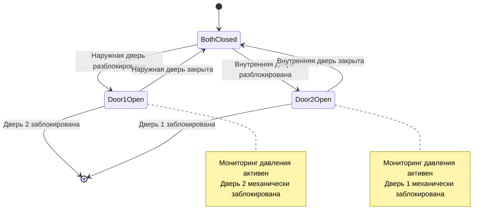

Наддув помещения формирует основной механизм защиты помещений управления АЭС от внешних атмосферных угроз, включая дым, токсичные газы, загрязнение частицами и радионуклиды. Система наддува должна поддерживать точное дифференциальное давление на проникновениях ограждающей конструкции здания при одновременном обеспечении работы дверей, перемещения персонала и сценариев аварийной изоляции.

## Физика дифференциального давления

Разность давления между помещением управления и смежными помещениями создает исходящий поток воздуха через отверстия ограждения, предотвращая инфильтрацию загрязненного воздуха. Зависимость между дифференциальным давлением и потоком воздуха через отверстия следует уравнению потока через отверстие:

$$Q = C_d A \sqrt{\frac{2 \Delta P}{\rho}}$$

Где:
- $Q$ = объемный расход воздуха через отверстие (CFM)
- $C_d$ = коэффициент расхода (0,6–0,65 для типичных отверстий в зданиях)
- $A$ = эффективная площадь утечки (м²)
- $\Delta P$ = дифференциальное давление (Па)
- $\rho$ = плотность воздуха (1,2 кг/м³ при стандартных условиях)

Эта зависимость квадратного корня демонстрирует, что удвоение дифференциального давления увеличивает защитный поток воздуха только на 41%, подчеркивая важность герметичности ограждения над чрезмерным наддувом.

## Целевые дифференциальные давления

Помещения управления АЭС поддерживают стратифицированные каскады давления относительно окружающих помещений.

| Смежное помещение | Дифференциальное давление | Направление потока воздуха |
|---|---|---|
| Наружный воздух | 25–38 Па | Выход через ограждение |
| Машинные отделения | 12–19 Па | Выход через двери |
| Офисные помещения | 7–12 Па | Выход через двери |
| Коридоры | 5–7 Па | Выход через двери |

Помещения управления ядерных объектов согласно IEEE 323 поддерживают 31–62 Па относительно наружного воздуха с точками срабатывания сигнализации при 25 Па минимум. Эти повышенные дифференциалы обеспечивают дополнительную защиту во время сценариев проектной базовой аварии.

## Проектирование системы подпиточного воздуха

### Требования по расходу воздуха

Система подпиточного воздуха должна компенсировать утечку через ограждение при поддержании проектного дифференциального давления:

$$Q_{makeup} = Q_{leakage} + Q_{exhaust} + Q_{infiltration}$$

Для расчетов наддува помещения управления:

$$Q_{leakage} = K_{env} \times A_{env} \times (\Delta P)^{0.65}$$

Где:
- $Q_{leakage}$ = расход воздуха утечки через ограждение (CFM)
- $K_{env}$ = коэффициент утечки ограждения (обычно 0,1–0,3 для плотной конструкции)
- $A_{env}$ = общая площадь ограждения (м²)
- $\Delta P$ = целевое дифференциальное давление (Па)

Показатель степени 0,65 представляет эмпирический переход между турбулентным и ламинарным потоком через трещины и проникновения в здание.

### Конфигурация фильтровальной установки

Трехступенчатая фильтрация (предфильтр, финальный фильтр, химический фильтр) работает непрерывно в нормальном режиме. HEPA фильтры активируются только при аварийной изоляции для минимизации потерь давления и энергопотребления вентилятора в нормальном режиме. Ядерные объекты поддерживают непрерывную фильтрацию HEPA согласно требованиям ASME AG-1.

## Стратегии управления давлением

### Метод модулирующего управления

Управление независимое от давления поддерживает постоянное дифференциальное давление несмотря на изменяющуюся утечку через ограждение:

$$Q_{supply} = Q_{base} + K_p (P_{setpoint} - P_{measured}) + K_i \int (P_{setpoint} - P_{measured}) dt$$

Контроллер пропорционально-интегральный (ПИ) модулирует скорость вентилятора подачи через ЧРП для поддержания уставки давления. Типичные параметры управления:
- Коэффициент пропорциональности $K_p$: 200–400 CFM/Па
- Коэффициент интегрирования $K_i$: 50–100 CFM/(Па · мин)
- Полоса мертвой зоны управления: ±2,5 Па

### Конфигурация датчиков давления

Несколько датчиков дифференциального давления обеспечивают резервное измерение и пространственное усреднение:

1. **Основной датчик:** помещение управления к наружному воздуху (вход системы управления зданием)
2. **Вторичный датчик:** помещение управления к коридору (резервное управление)
3. **Местный индикатор:** настенный манометр (справочная информация оператора)
4. **Датчик сигнализации:** вход независимой системы безопасности (критическая сигнализация)

Расположение датчиков избегает застойных зон воздуха, зон открывания дверей и влияния подачи/возврата воздуха. Трубопроводы минимизируют конденсацию жидкости через наклонную прокладку и гидравлические затворы.

## Работа дверей и проектирование шлюзов

### Потери давления при открытии одной двери

Открытие двери временно соединяет помещение управления со смежным помещением, вызывая снижение давления. Скорость снижения давления зависит от площади двери и длительности открывания:

$$\frac{dP}{dt} = -\frac{Q_{loss}}{V_{room}} \times \frac{\rho R T}{P_{initial}}$$

Для двери размером 2,1 м × 0,9 м полностью открытой на 5 секунд типичное время восстановления давления достигает 15–30 секунд после закрытия двери в зависимости от мощности подпиточного воздуха.

### Конфигурация шлюза

Входы с интенсивным движением используют давленческие шлюзы поддерживающие промежуточные зоны давления:

**Трехзонный каскад давления:**
- Помещение управления: +25 Па (относительно наружного воздуха)
- Шлюз: +12 Па (относительно наружного воздуха)
- Коридор: 0 Па (нейтральное давление)

Объем подачи воздуха в шлюз должен компенсировать утечку через обе двери при поддержании промежуточного давления. Типичные размеры шлюза: 1,8–2,4 м в глубину × ширина двери с выделенным диффузором подачи и без возврата/выпуска.

## Системы блокировки дверей

### Управление последовательным доступом

Блокировки дверей предотвращают одновременное открытие дверей шлюза, поддерживая барьер загрязнения:

### Реализация оборудования

**Система магнитных замков:**
- Электромагнитные замки (усилие удержания 5,3–6,7 кН) на обеих дверях
- Карта доступа или биометрический доступ разблокирует одну дверь
- Позиционные переключатели двери подтверждают закрытое состояние
- Логика управления предотвращает разблокировку второй двери до закрытия первой
- Кнопка аварийного выхода разблокирует обе двери (переопределение пожарной сигнализации)

**Механическая блокировка:**
- Засов, выдвигающийся из рамы двери 1, блокирует работу двери 2
- Засов двери 2 взаимно блокирует дверь 1
- Не требуется электроэнергия (отказобезопасная работа)
- Ручное переопределение ключом доступно только изнутри

## Режим аварийной изоляции

### Обнаружение токсичных газов

Мониторы наружного воздуха инициируют аварийную изоляцию при превышении пороговых значений:

| Загрязнитель | Порог обнаружения | Действие |
|---|---|---|
| Монооксид углерода | 35 ppm (8-часовое TWA) | Закрыть клапан наружного воздуха |
| Хлор | 0,5 ppm (15-минутное STEL) | Режим аварийной изоляции |
| Аммиак | 25 ppm (15-минутное STEL) | Режим аварийной изоляции |
| Дым (оптический) | 5%/ft затемнения | Режим аварийной изоляции |

При аварийной изоляции:
1. Клапан наружного воздуха закрывается (<5 секунд исполнения)
2. Система переключается на 100% рециркуляцию
3. Активируется фильтрация HEPA/химическая
4. Давление поддерживается сжатым воздухом (каскад баллонов)
5. Таймер пригодности помещения запускается (емкость 12–72 часа)

### Поддержание давления без подпиточного воздуха

При аварийной изоляции поддержание давления требует альтернативного источника воздуха:

$$V_{bottle} = \frac{Q_{leakage} \times t_{hab} \times P_{atm}}{P_{bottle} - P_{atm}}$$

Для утечки 710 CFM (400 л/мин), пригодности 24 часа и баллонов с давлением 16,5 МПа:
$$V_{bottle} = \frac{710 \times 1440 \times 101}{16500 - 101} = 6,2 \text{ м}^3 = \text{двадцать баллонов по } 0,31 \text{ м}^3$$

Ядерные объекты используют специальные системы дыхательного воздуха или продувку инертным газом для расширенной пригодности без подпиточного воздуха.

## Требования по герметичности ограждения

Ограждение помещения управления нацелено на <1,0 CFM/м² (м³/ч·м²) при тестовом давлении 25 Па. Критические места герметизации:

- Проникновения кабелей/кондуитов: Интумесцентная замазка или модульные системы герметизации
- Проникновения трубопроводов: Механические системы компрессионной герметизации Link Seal
- Коробки дверей: Непрерывная прокладка с компрессионным порогом
- Коробки окон: Сварные или структурно остекленные (движущиеся окна запрещены)
- Стыки стена–пол–потолок: Герметизированы с внутренней стороны эластомерным герметиком
- Воздуховоды HVAC: Клапаны, рассчитанные на давление в месте проникновения через ограждение

Испытание воздуходувкой при сдаче проверяет производительность ограждения до передачи системы.

## Проверка производительности и испытания

### Протокол приемочных испытаний

1. **Тест статического давления:** Проверка проектного дифференциала при всех закрытых дверях и моделировании нормальной заполняемости
2. **Тест работы дверей:** Подтверждение восстановления давления в течение 30 секунд после закрытия двери
3. **Тест аварийной изоляции:** Проверка времени закрытия клапана и перехода в режим рециркуляции
4. **Тест пригодности помещения:** Документирование длительности поддержания давления в режиме изоляции
5. **Проверка блокировки:** Тест последовательной работы дверей и функции блокировки

### Непрерывный мониторинг

Система управления зданием отслеживает тренды:
- Дифференциальное давление (интервалы 5 минут, сигнализация если <20 Па дольше 15 минут)
- Скорость вентилятора подачи (индикатор деградации ограждения при возрастающем тренде)
- Частота открывания дверей (корреляция с колебаниями давления)
- Положение клапана наружного воздуха (проверка режима изоляции)

Ежегодные проверочные испытания подтверждают постоянную целостность ограждения и производительность системы наддува в соответствии с исходными спецификациями проектирования.

Правильно спроектированные и обслуживаемые системы наддува обеспечивают надежное исключение загрязнения, гарантируя пригодность помещения управления во время нормальной эксплуатации и аварийных сценариев, критически важных для обеспечения непрерывной работы АЭС.
