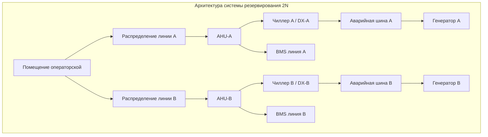
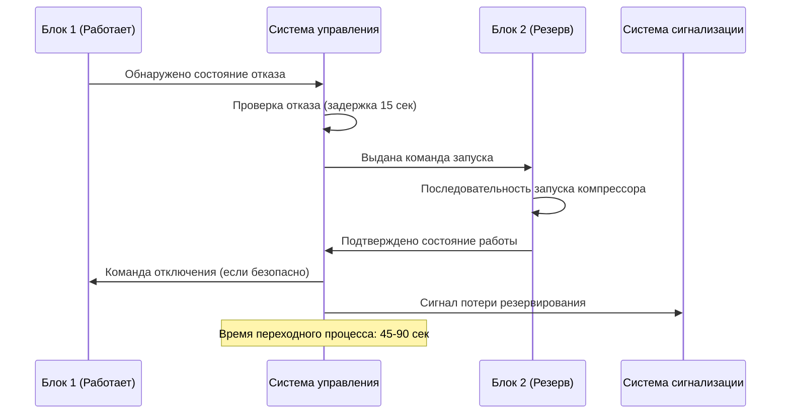

Системы HVAC операторских электростанций требуют абсолютной непрерывности обслуживания. Отказ оборудования, приводящий к превышению температурных диапазонов, может вызвать неправильную работу приборов, повреждение данных или принудительное отключение генерирующих активов. Архитектуры резервирования обеспечивают непрерывное управление окружающей средой через стратегическое дублирование оборудования, механизмы автоматического переключения и интеграцию резервного питания.

## Типы конфигураций резервирования

### Архитектура резервирования N+1

Резервирование N+1 обеспечивает минимально требуемую мощность охлаждения (N) плюс одно дополнительное резервное устройство (+1). Для операторских это обычно проявляется как три независимых блока охлаждения, из которых два работают непрерывно, а один остается в горячем резерве.

**Распределение нагрузки для операторской с холодопроизводительностью 176 кВ:**

| Конфигурация | Мощность блока | Рабочие блоки | Резервные блоки | Установленная мощность |
|---------------|---------------|--------------|-----------------|----------------------|
| N+1 (50% блоков) | 88 кВ каждый | 2 блока | 1 блок | 264 кВ |
| N+1 (100% блоков) | 176 кВ каждый | 1 блок | 1 блок | 352 кВ |
| 2N | 176 кВ каждый | 2 блока | 0 блоков | 352 кВ |

Вариант с 50%-й мощностью работает обоими основными блоками непрерывно, распределяя нагрузку. Эта конфигурация обеспечивает:

- Расширенный срок службы оборудования за счет снижения переключений
- Сбалансированное время работы всего оборудования
- Более низкие требования к мощности отдельных блоков
- Постепенную деградацию при отказе одного блока (остается 50% мощности)

**Расчет надежности для N+1 с блоками 50% мощности:**

Система отказывает только при одновременной недоступности двух блоков. Используя экспоненциальную надежность:

$$R_{system}(t) = 1 - [1 - R_{unit}(t)]^2 \cdot [1 + 2R_{unit}(t)]$$

Для блоков с MTBF = 20 000 часов и время миссии один месяц (720 часов):

$$R_{unit}(720) = e^{-720/20000} = 0,9648$$

$$R_{system}(720) = 1 - [1 - 0,9648]^2 \cdot [1 + 2(0,9648)] = 0,99987$$

Доступность системы превышает 99,98% в месяц, что представляет менее 9 минут потенциального простоя.

### Архитектура резервирования 2N

Резервирование 2N обеспечивает две полные независимые системы (2 × N), каждая способная обработать полную проектную нагрузку. Эта конфигурация стандартна для операторских ядерных электростанций и объектов с высокими последствиями.

**Ключевые характеристики 2N:**

- Физическое разделение между резервными линиями (отдельные механические помещения)
- Независимые линии электропередачи от разных аварийных шин
- Отдельные системы охлажденной воды или схемы прямого расширения
- Изолированные воздуховоды и системы распределения воздуха
- Резервные системы управления с ручным переключением

**Расчет надежности 2N:**

Система отказывает только при одновременном отказе обеих линий (при условии независимости):

$$R_{2N}(t) = 1 - [1 - R_{train}(t)]^2$$

Для надежности линии 0,98 в течение периода миссии:

$$R_{2N}(t) = 1 - [1 - 0,98]^2 = 0,9996$$

Это представляет 99,96% доступность по сравнению с 98% для систем с одной линией.

## Системы автоматического переключения

### Механизмы обнаружения отказов

Автоматическое переключение требует быстрого и надежного обнаружения отказов по нескольким параметрам:

**Критические точки мониторинга:**

| Параметр | Нормальный диапазон | Триггер переключения | Время реакции |
|-----------|-------------------|-------------------|----------------|
| Температура приточного воздуха | 22-23 °C | >24 °C в течение 2 мин | <60 сек |
| Температура выходного воздуха | 13-14 °C | >18 °C в течение 1 мин | <30 сек |
| Статус вентилятора | Работает | Остановлен | Немедленно |
| Статус компрессора | Работает | Остановлен >30 сек | <30 сек |
| Давление хладагента | Норма | Сигнал низко/высоко | <45 сек |
| Расход охлажденной воды | Проектный расход | <50% проектного | <30 сек |

**Логика последовательности автоматического переключения:**

### Стратегии плавного переключения

Поддержание стабильности окружающей среды при переключении предотвращает тепловой удар по электронике:

**Расчет тепловой инертности:**

Тепловая масса операторской обеспечивает буферизацию при смене блока. Для типичной операторской:

$$C_{thermal} = m \cdot c_p = \rho \cdot V \cdot c_p$$

Где:
- $\rho$ = плотность воздуха = 1,2 кг/м³
- $V$ = объем помещения = 850 м³
- $c_p$ = удельная теплоемкость = 1,005 кДж/кг·°C

$$C_{thermal} = 1,2 \times 850 \times 1,005 = 1026 \text{ кДж/°C}$$

При генерации тепла 35 кВ:

$$\frac{dT}{dt} = \frac{Q}{C_{thermal}} = \frac{126000 \text{ кДж/ч}}{1026 \text{ кДж/°C}} = 122,8 \text{ °C/ч} = 2,0 \text{ °C/мин}$$

Это позволяет примерно 30-45 секунд для переключения перед заметным повышением температуры при условии включения тепловой массы оборудования и строительной конструкции.

**Улучшенные методы переключения:**

1. **Перекрывающаяся работа:** Резервный блок запускается перед остановкой основного, обеспечивая непрерывное охлаждение
2. **Модулированное отключение:** Основной блок снижает производительность по мере достижения резервным полной мощности
3. **Предварительное охлаждение:** Резервный блок работает на низкой мощности, готов к немедленному переходу на полную нагрузку
4. **Чередование ведущего-ведомого:** Блоки чередуются еженедельно, поддерживая резервное оборудование в рабочем состоянии

## Интеграция резервного питания

### Координация аварийного генератора

Нагрузки HVAC операторской подключаются к системам аварийного питания с определенными приоритетами запуска:

**Типовая последовательность нагрузки:**

| Приоритет | Оборудование | Задержка запуска | Подключенная нагрузка |
|-----------|-----------|-----------------|-----------------|
| 1 | Вентилятор приточный (VFD на 50%) | 0 сек | 3,7 кВ |
| 2 | Насосы охлажденной воды | 5 сек | 2,2 кВ |
| 3 | Компрессор 1 (или чиллер) | 10 сек | 18,6 кВ |
| 4 | Вентилятор приточный (VFD на 100%) | 15 сек | 7,5 кВ |
| 5 | Компрессор 2 (если двухконтурная) | 30 сек | 18,6 кВ |

Последовательный запуск предотвращает перегрузку генератора во время восстановления напряжения.

**Расчет размера генератора:**

Общая нагрузка HVAC плюс коэффициент безопасности:

$$P_{generator} = \frac{P_{HVAC} + P_{other}}{\eta_{gen} \cdot PF} \times 1,25$$

Для 50,6 кВ HVAC + 37,3 кВ освещение/управление:

$$P_{generator} = \frac{50,6 + 37,3}{0,92 \times 0,85} \times 1,25 = 142 \text{ кВ}$$

Генератор 150 кВ обеспечивает адекватную мощность с запасом для пускового тока двигателя и будущих нагрузок.

### Интеграция UPS для систем управления

Системы управления HVAC требуют бесперебойного питания при переключении генератора (8-10 секунд):

**Компоненты с резервным питанием от UPS:**
- Контроллеры системы управления зданием
- Платы управления частотно-регулируемых приводов (VFD)
- Исполнительные механизмы и двигатели заслонок
- Датчики и передатчики
- Панели сигнализации и аннуляторы

Типовая нагрузка управления: 1,5-3,7 кВ, требующая минимум 15-минутной емкости UPS.

## Расчеты надежности и прогнозы

### Среднее время между отказами (MTBF)

MTBF системы определяется из надежности компонентов с использованием анализа последовательных-параллельных схем:

**Типовые значения MTBF компонентов:**

| Компонент | MTBF (часы) | Годовой коэффициент отказов |
|-----------|------------|------|
| Компрессор | 50 000 | 0,175 |
| Электродвигатель вентилятора | 100 000 | 0,088 |
| Управляющий клапан | 80 000 | 0,110 |
| VFD | 75 000 | 0,117 |
| Контроллер | 150 000 | 0,058 |

Для последовательно соединенных компонентов (все должны функционировать):

$$\frac{1}{MTBF_{series}} = \sum_{i=1}^{n} \frac{1}{MTBF_i}$$

MTBF отдельного блока охлаждения:

$$\frac{1}{MTBF_{unit}} = \frac{1}{50000} + \frac{1}{100000} + \frac{1}{80000} + \frac{1}{75000} = 0,0000571$$

$$MTBF_{unit} = 17 500 \text{ часов (2,0 года)}$$

Для параллельного резервирования N+1:

$$MTBF_{N+1} = \frac{MTBF_{unit}^2}{2} = \frac{17500^2}{2} = 153 \text{ млн часов}$$

Это теоретическое значение демонстрирует значительное улучшение надежности за счет резервирования.

### Анализ доступности

Доступность учитывает как коэффициент отказов, так и время восстановления:

$$A = \frac{MTBF}{MTBF + MTTR}$$

С MTTR = 8 часов для аварийного ремонта:

Одиночный блок: $A_{unit} = \frac{17500}{17500 + 8} = 0,9995$ (99,95%)

Система N+1 с одним отказом на 2 года при немедленном переключении:

$$A_{N+1} = \frac{17500}{17500 + 0,5} = 0,99997$$

Годовой простой сокращается с 4,4 часов до 15 минут через резервирование.

## Режимы отказа резервирования

### Общие причинные отказы

Резервные системы остаются уязвимы к отказам, воздействующим на все оборудование одновременно:

**Общие угрозы:**
- Потеря питания объекта (отказ генератора)
- Отказ растения охлажденной воды (для водяного охлаждения)
- Отказ сети системы управления
- Прерывание подачи конденсационной воды
- Загрязнение хладагента, воздействующее на все контуры
- Экстремальная наружная температура, превышающая пределы оборудования

**Стратегии защиты:**
- Различные методы охлаждения (сплит-системы + охлажденная вода)
- Независимые сети управления (жесткостной резерв)
- Хранилище аварийной охлажденной воды на объекте
- Географическое разделение оборудования
- Различные хладагенты в резервных системах

## Соображения при техническом обслуживании

Резервирование обеспечивает техническое обслуживание без воздействия на окружающую среду:

**Протокол планового обслуживания:**
1. Передача нагрузки на резервное оборудование
2. Проверка стабильной работы в течение 30 минут
3. Изоляция блока, требующего обслуживания
4. Выполнение обслуживания с достаточным временем
5. Функциональное тестирование перед возвращением в эксплуатацию
6. Восстановление резервирования и проверка автоматического переключения

Годовое обслуживание включает тестирование переключения при контролируемых условиях для проверки автоматической работы и подтверждения соответствия времени переключения требованиям.

## Лучшие практики проектирования

**Физическое разделение:** Размещайте резервные блоки в отдельных противопожарных зонах с рейтинговыми барьерами

**Независимые коммуникации:** Отдельные электрические панели, контуры хладагента и трубопроводные системы

**Проверка мощности:** Годовое тестирование производительности подтверждает способность каждого блока обработать полную проектную нагрузку

**Документация:** Ведите чертежи как построенные, последовательности управления и логику переключения для операторов

**Подготовка операторов:** Обеспечивайте обучение персонала в течение 24/7 смены, понимание работы резервирования и процедур ручного переключения

Правильно спроектированные системы резервного HVAC достигают пятизначной доступности (99,999%) для операторских электростанций, обеспечивая непрерывное управление окружающей средой, поддерживающее критические генерирующие активы на протяжении жизненных циклов оборудования и непредвиденных отказов.
