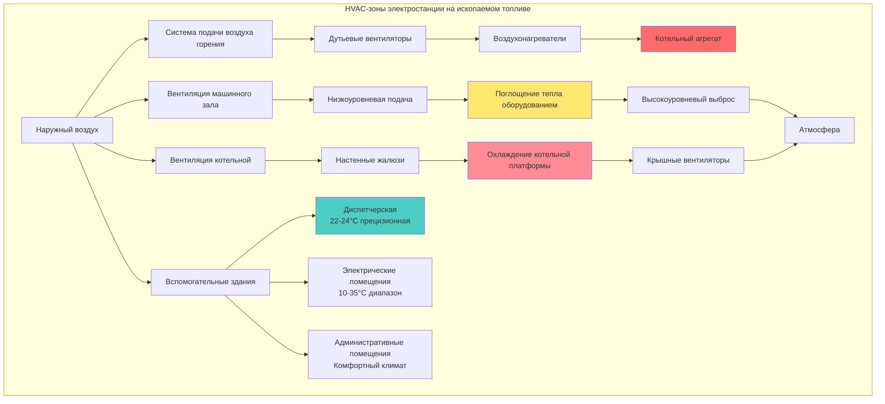

Электростанции на ископаемом топливе вырабатывают электроэнергию через циклы сгорания с термодинамическими преобразованиями, создавая экстремальные вызовы HVAC из-за огромных требований по отводу тепла, обработке воздуха горения, коррозионных атмосфер и потребностей защиты оборудования. Системы HVAC на таких объектах напрямую влияют на эффективность генерации, долговечность оборудования и безопасность персонала во множестве операционных зон с различными требованиями к окружающей среде.

## Термодинамическая основа тепловых нагрузок

Электростанции на ископаемом топливе преобразуют химическую энергию в электрическую через цикл Ренкина для паровых электростанций или комбинированные циклы Брэйтона-Ренкина. Фундаментальный энергетический баланс управляет всеми расчетами тепловых нагрузок HVAC.

### Энергетический баланс по первому закону термодинамики

Тепло от горения топлива распределяется между полезным электрическим выходом и отведённым теплом:

$$Q_{fuel} = W_{electrical} + Q_{rejected} + Q_{stack}$$

Где:
- $Q_{fuel}$ = Тепловой ввод от топлива (кДж/ч)
- $W_{electrical}$ = Электрическая мощность на выходе (кДж/ч, 1 кВт = 3,6 МДж/ч)
- $Q_{rejected}$ = Тепло, отведённое в охлаждающую воду конденсатора (кДж/ч)
- $Q_{stack}$ = Тепловые потери в дымовых газах (кДж/ч)

Типичная тепловая эффективность ископаемых электростанций:
- Докритические угольные: 33-37%
- Сверхкритические угольные: 38-42%
- Газотурбинные установки с комбинированным циклом: 55-60%
- Простой цикл газовых турбин: 30-35%

Для угольной электростанции мощностью 500 МВт с КПД 38%:

$$Q_{fuel} = \frac{500 \text{ МВт} \times 3600 \text{ кДж/ч на МВт}}{0,38} = 4,74 \times 10^9 \text{ кДж/ч}$$

$$Q_{rejected} = Q_{fuel} \times (1 - \eta - \eta_{stack}) = 4,74 \times 10^9 \times 0,50 = 2,37 \times 10^9 \text{ кДж/ч}$$

Это отведённое тепло создаёт тепловую среду, требующую вентиляции и охлаждения.

### Тепловое излучение оборудования

Несмотря на изоляцию, высокотемпературное оборудование излучает тепло в машинный зал согласно закону Стефана-Больцмана:

$$q_{rad} = \epsilon \sigma A (T_{surface}^4 - T_{ambient}^4)$$

Где:
- $\epsilon$ = Степень черноты (0,05-0,10 для изолированных поверхностей)
- $\sigma$ = Константа Стефана-Больцмана (5,67 × 10⁻⁸ Вт/м²·К⁴)
- $A$ = Площадь поверхности (м²)
- $T$ = Абсолютная температура (К)

Труба паропровода диаметром 61 см при температуре поверхности 65°C (изолирована от 316°C пара) длиной 30 м в машинном зале при 27°C:

$$A = \pi D L = \pi \times 0,61 \times 30 = 57,5 \text{ м}^2$$

$$q_{rad} = 0,08 \times 5,67 \times 10^{-8} \times 57,5 \times [(338)^4 - (300)^4] = 40,2 \text{ кВт}$$

Теплопроводность через изоляцию добавляет дополнительный теплопередачу следуя:

$$q_{cond} = \frac{2\pi k L (T_{steam} - T_{surface})}{\ln(r_o/r_i)}$$

## Классификация HVAC-зон

Электростанции на ископаемом топливе разделяются на различные экологические зоны, каждая с уникальными требованиями HVAC:

## Требования HVAC по типам электростанций

| Параметр | На угле | Газотурбинная установка с комбинированным циклом | На мазуте | Простой цикл газовой турбины |
|-----------|---------|---------------------------------------------|----------|---------------------------|
| **Тепловая эффективность** | 33-42% | 55-60% | 35-40% | 30-35% |
| **Тепловая нагрузка машинного зала** | 175-245 кВт/МВт | 87-140 кВт/МВт | 157-227 кВт/МВт | 70-105 кВт/МВт |
| **Воздух горения на МВт** | 57-76 м³/ч/кВт | 38-48 м³/ч/кВт | 52-71 м³/ч/кВт | 71-95 м³/ч/кВт |
| **Температура котельной** | 43-49°C | Н/П (HRSG снаружи) | 41-46°C | Н/П |
| **HVAC топливного хозяйства** | Обширная (контроль пыли углерода) | Минимальная (трубопроводный газ) | Умеренная (вентиляция резервуаров) | Минимальная |
| **Оборудование выбросов** | SCR, фильтр-рукав, FGD требующие HVAC | SCR требующий охлаждения | Электрофильтр требующий вентиляции | Минимальный SCR |
| **Качество подаваемого воздуха** | Тяжёлая фильтрация (пыль углей) | Стандартная фильтрация | Стандартная фильтрация | Высокоэффективная (вход в турбину) |
| **Типичный размер блока** | 300-800 МВт | 400-1200 МВт | 50-400 МВт | 50-300 МВт |

## Проектирование системы подачи воздуха горения

Воздух горения представляет наибольший объёмный расход на электростанции, обусловленный стехиометрическими требованиями горения.

### Требования к стехиометрическому воздуху

Полное горение требует теоретического воздуха на основе состава топлива:

$$A_{stoich} = \frac{11,5 C + 34,5(H - O/8) + 4,3 S}{100}$$

Где C, H, O, S - массовые доли углерода, водорода, кислорода и серы в топливе.

Для типичного битуминозного угля (75% C, 5% H, 10% O, 1% S):

$$A_{stoich} = \frac{11,5(75) + 34,5(5 - 10/8) + 4,3(1)}{100} = 10,0 \text{ кг воздуха/кг топлива}$$

Фактическое горение использует 15-20% избыточного воздуха для обеспечения полного сгорания:

$$A_{actual} = A_{stoich} \times (1 + EA)$$

Где EA = доля избыточного воздуха (0,15-0,20 для угля, 0,05-0,10 для газа).

### Расчёт объёмного расхода

Преобразование массового расхода в объёмный, учитывая плотность воздуха:

$$Q_{м^3/ч} = \frac{\dot{m}_{air} \times 3600}{{\rho}_{air}}$$

Где:
- $\dot{m}_{air}$ = Массовый расход воздуха (кг/с)
- $\rho_{air}$ = Плотность воздуха при условиях на входе (кг/м³)

Стандартная плотность воздуха при 21°C, уровень моря: 1,2 кг/м³

Для угольной электростанции 500 МВт, сжигающей 91 т угля/ч с 18% избыточным воздухом:

$$\dot{m}_{air} = \frac{91 \times 1000}{3600} \times 10,0 \times 1,18 = 298 \text{ кг/с}$$

$$Q_{м^3/ч} = \frac{298 \times 3600}{1,2} = 893 \times 10^3 \text{ м}^3/ч$$

При фактических условиях на входе (35°C летний расчётный случай), плотность уменьшается:

$$\rho_{35C} = 1,2 \times \frac{294}{308} = 1,145 \text{ кг/м}^3$$

$$Q_{м^3/ч,actual} = 893 \times 10^3 \times \frac{1,2}{1,145} = 937 \times 10^3 \text{ м}^3/ч (551 \times 10^3 \text{ CFM})$$

### Проектирование дутьевого вентилятора

Дутьевые вентиляторы преодолевают перепад давления через:
- Воздухонагреватель: 1,0-2,0 кПа
- Воздухопроводы и заслонки: 0,5-1,0 кПа
- Ветродув и горелки: 1,5-2,5 кПа
- Общее статическое давление: 3,0-5,5 кПа

Требуемая мощность вентилятора:

$$kW = \frac{Q \times \Delta P}{3600 \times \eta_{fan}}$$

Где:
- Q = Расход воздуха (м³/ч)
- ΔP = Общее статическое давление (кПа)
- $\eta_{fan}$ = КПД вентилятора (0,80-0,85 для крупных центробежных вентиляторов)

Для 469 тыс. м³/ч при 4,5 кПа, КПД 82%:

$$kW = \frac{469 \times 10^3 \times 4,5}{3600 \times 0,82} = 71 500 \text{ кВт}$$

Обычно разделяется между 4-6 параллельными вентиляторами с регулируемыми электроприводами.

## Расчёты тепловых нагрузок вентиляции машинного зала

Тепловые нагрузки машинного зала происходят из потерь оборудования и излучённого тепла. Баланс явного тепла определяет расход вентиляционного воздуха:

$$Q_{vent} = \frac{q_{total}}{1,2 \times \Delta T}$$

Где:
- $Q_{vent}$ = Расход вентиляционного воздуха (м³/ч)
- $q_{total}$ = Общая тепловая нагрузка (кВт)
- ΔT = Повышение температуры (К)
- 1,2 = Константа для воздуха при стандартных условиях (1,2 кг/м³ × 1000 Дж/кг·К ÷ 3600 с/ч)

### Компоненты тепловой нагрузки

**Потери генератора**: КПД электрического генератора обычно 98,5-99,0%, потери проявляются как тепло:

$$q_{gen} = P_{output} \times \frac{1-\eta_{gen}}{\eta_{gen}} \times 3,6 \text{ МДж/кВт}$$

Для генератора 500 МВт при КПД 98,7%:

$$q_{gen} = 500 \times 10^3 \times \frac{0,013}{0,987} \times 3,6 = 23,6 \text{ МВт}$$

**Излучение корпуса турбины**: Несмотря на изоляцию, корпусы турбины излучают примерно 1-2% энтальпийного расхода пара как тепло в машинный зал.

**Вспомогательное оборудование**: Охладители смазки, системы уплотняющего пара, питательные насосы и трубопроводы добавляют 10-20% от общей нагрузки машинного зала.

### Естественная и механическая вентиляция

**Движущее давление эффекта стека**: Разница температур между внутренним и наружным воздухом создаёт подъёмную силу:

$$\Delta P_{stack} = 3,45 \times H \times \left(\frac{1}{T_{outdoor}} - \frac{1}{T_{indoor}}\right)$$

Где:
- ΔP = Доступное давление (Па)
- H = Высота от входа к выходу (м)
- T = Абсолютная температура (К)

Для машинного зала высотой 24 м, наружный воздух 29°C, внутренний 40°C:

$$\Delta P_{stack} = 3,45 \times 24 \times \left(\frac{1}{302} - \frac{1}{313}\right) = 0,88 \text{ Па}$$

Это скромное давление приводит в движение значительный расход воздуха через большие проёмы. Естественная вентиляция обеспечивает 60-80% требуемого расходов воздуха, с механической вентиляцией, дополняющей в условиях штиля или экстремальных температур.

## Контроль окружающей среды в котельной

Котельные в угольных и мазутных электростанциях испытывают экстремальные температуры от излучения печи, высокотемпературного трубопровода и вспомогательного оборудования. В отличие от машинного зала, где оборудование устанавливает максимальные температурные пределы, проектирование котельной уравновешивает требования доступа персонала против величины тепловой нагрузки.

### Критерии проектирования

**Летняя эксплуатация**: Ограничить температуру котельной максимум 46-49°C на занятых платформах и проходах. Более высокие температуры допускаются в незанятых зонах рядом со стенками печи.

**Зимняя эксплуатация**: Поддерживать 16-21°C минимум, защищая оборудование и обеспечивая доступ для обслуживания.

**Скорость воздуха**: Поддерживать 1-2 м/с скорость воздуха на занятых платформах, предотвращая тепловой стресс от излучательных нагрузок.

### Стратегия вентиляции

**Перекрёстная вентиляция**: Настенные жалюзи с одной стороны подают приточный воздух, выхлопные жалюзи или механические крышные вентиляторы на противоположной стороне создают перекрёстный поток.

**Вертикальная вентиляция**: Низкоуровневое введение воздуха с высокоуровневым выхлопом, использующее эффект дымохода. Особенно эффективно в многоэтажных котельных конструкциях, где вертикальные расстояния создают сильную плавучесть.

**Точечное охлаждение**: Передвижные или стационарные кондиционерные установки обеспечивают охлаждение в специфических рабочих локациях при продолжительных работах по обслуживанию.

## HVAC электрических и вспомогательных зданий

Вспомогательные здания требуют обычной системы HVAC с изменениями для окружения электростанции.

### Помещения коммутационного оборудования и модульных распределительных щитов

Электрооборудование генерирует тепло пропорционально потерям:

**Тепловыделение трансформатора**:
$$q_{transformer} = kVA_{rating} \times (1-\eta) \times 3,6$$

Типичный КПД трансформатора: 98,5-99,5%

**Тепловыделение коммутационного оборудования и модульных распределительных щитов**: 2-5% от номинальной мощности как тепло, примерно 150-500 Вт/м² площади пола для высокоплотных установок.

Температурные пределы: 4-40°C по стандартам NEMA, с рекомендацией 10-35°C для оптимального ресурса оборудования.

### Интеграция диспетчерского здания

Диспетчерские здания часто совместимы со структурой машинного зала, требуя избыточного давления и изоляции, предотвращающей миграцию пыли и загрязнения из промышленных зон в помещения прецизионного контроля.

**Каскад давлений**: Административные помещения (+5 Па) → Диспетчерская (+13 Па) → Помещение кабельных каналов (+8 Па)

## Рассмотрение HVAC оборудования выбросов

Современные электростанции включают обширное оборудование контроля выбросов, требующее выделенного HVAC:

**Селективное каталитическое восстановление (SCR)**: Катализатор работает при 315-400°C. Вентиляция корпуса во время остановок и системы предварительного подогрева для холодного запуска.

**Фильтр-рукав/электрофильтр**: Контроль температуры предотвращает конденсацию точки росы кислоты (обычно 120-175°C дымовых газов). Изоляция и теплопроводящие кабели на бункерах.

**Десульфуризация дымовых газов (FGD)**: Помещения мокрого скруббера требуют коррозионно-стойкой вентиляции, обрабатывающей влагу и кислую атмосферу. Выбор материалов критичен (FRP, нержавеющая сталь).

## Отраслевые стандарты и ссылки

**Справочник ASHRAE - Приложения HVAC, Глава 28**: Авторитетное руководство по проектированию систем HVAC электростанций, расчётам нагрузок и выбору оборудования, специфичные для объектов генерации.

**NFPA 850**: Стандарт защиты от пожара на электростанциях, включая требования HVAC для предотвращения пожаров и контроля дыма.

**IEEE 666**: Руководство по проектированию систем электроснабжения для электростанций, охватывающее HVAC для помещений электрооборудования.

**ASME PTC 4**: Код испытаний производительности обогреваемых котельных агрегатов, устанавливает процедуры измерения воздуха горения и тестирования эффективности.

**API 580/581**: Стандарты инспекции на основе рисков, применимые к оборудованию под давлением электростанций, информирующие проектирование HVAC для доступа оборудования и контроля окружающей среды.

**Технические отчёты EPRI**: Электрический научно-исследовательский институт энергии публикует обширные исследования по оптимизации электростанций, включая улучшения эффективности систем HVAC и передовые методы.

**Руководства производителей оборудования**: Производители турбин (GE, Siemens, Mitsubishi, Doosan) указывают пределы температуры окружающей среды, требования вентиляции и параметры проектирования HVAC для специфических генерирующих установок.
