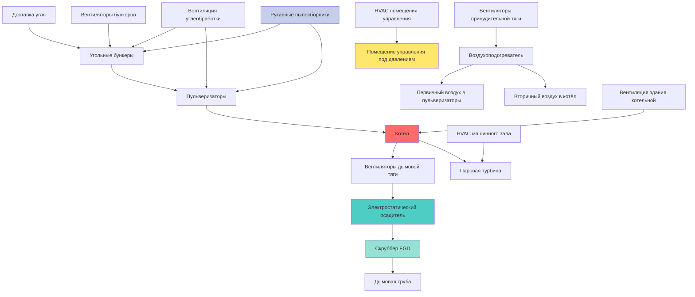

## Обзор

Угольные электростанции представляют уникальные проблемы HVAC из-за взрывоопасного характера угольной пыли, массивных требований к воздуху горения, высоких тепловых нагрузок и строгих норм качества воздуха. Системы HVAC должны поддерживать концентрацию угольной пыли ниже нижнего предела взрываемости (НПВ), обеспечивать надлежащую вентиляцию разбавлением и подавать миллионы кубических метров в час воздуха горения при сохранении безопасной рабочей среды во всем объекте.

## Контроль и вентиляция угольной пыли

Взрывоопасность угольной пыли зависит от размера частиц, содержания влаги и летучих веществ. Минимальная взрывоопасная концентрация (МВК) для битуминозной угольной пыли обычно варьируется от 40–60 г/м³, с энергией воспламенения всего 10–40 мДж. NFPA 850 требует поддерживать концентрацию угольной пыли значительно ниже этих пороговых значений посредством непрерывной вентиляции разбавлением.

### Расчеты вентиляции угольной пыли

Требуемая скорость вентиляции для контроля угольной пыли следует расчету баланса массы с первых принципов:

$$Q = \frac{\dot{m}_{\text{dust}}}{C_{\text{safe}} - C_{\text{ambient}}}$$

Где:
- $Q$ = требуемая скорость вентиляции (м³/с)
- $\dot{m}_{\text{dust}}$ = скорость образования угольной пыли (кг/с)
- $C_{\text{safe}}$ = безопасная концентрация пыли, обычно 10% от НПВ (кг/м³)
- $C_{\text{ambient}}$ = концентрация пыли в окружающей среде (кг/м³)

Для операций углеобработки с известными скоростями передачи:

$$Q_{\text{handling}} = K \cdot \dot{m}_{\text{coal}} \cdot \left(\frac{1}{C_{\text{target}}}\right)$$

Где:
- $K$ = коэффициент образования пыли (обычно 0,001–0,005 для закрытых конвейеров)
- $\dot{m}_{\text{coal}}$ = скорость передачи угля (кг/с)
- $C_{\text{target}}$ = целевая концентрация пыли (кг/м³)

Скорость захвата в точках образования пыли:

$$V_{\text{capture}} = \frac{1}{60} \left(100 + 100\sqrt{S}\right)$$

Где:
- $V_{\text{capture}}$ = скорость захвата (м/с)
- $S$ = площадь отверстия воздухоприемника (м²)

## Требования к вентиляции участков углеобработки

| **Участок** | **Скорость вентиляции** | **Кратность воздухообменов в час** | **Критерии проектирования** | **Специальные требования** |
|----------|---------------------|---------------------|---------------------|-------------------------|
| Угольные бункеры | 4–6 крат/ч | 4–6 | Пыль < 10 мг/м³ | Взрывозащищённое оборудование |
| Помещение пульверизатора | 12–20 крат/ч | 12–20 | Пыль < 5 мг/м³ | Высокая скорость воздуха (>1 м/с) |
| Галереи конвейеров | 8–12 крат/ч | 8–12 | Пыль < 15 мг/м³ | Непрерывный мониторинг |
| Здание дробилки | 15–20 крат/ч | 15–20 | Пыль < 8 мг/м³ | Местные воздухоприемники |
| Точки передачи | 60–90 м³/мин на точку | н/д | Скорость захвата 1,5–2,5 м/с | Фильтрация в рукавных фильтрах |
| Силосы хранения угля | 2–4 крат/ч | 2–4 | Пыль < 20 мг/м³ | Клапаны сброса давления |

## Системы воздуха горения

Требование воздуха горения для угольных котлов вытекает из стехиометрических уравнений горения. Для битуминозного угля с типичным составом (C: 75%, H: 5%, O: 8%, S: 3%, влага: 9%):

$$A_{\text{theoretical}} = 11.5C + 34.5\left(H - \frac{O}{8}\right) + 4.3S$$

Где $A_{\text{theoretical}}$ – теоретический воздух в кг воздуха/кг угля.

Фактический воздух горения с избыточным воздухом:

$$Q_{\text{combustion}} = \dot{m}_{\text{coal}} \cdot A_{\text{theoretical}} \cdot (1 + EA) \cdot \frac{\rho_{\text{air}}}{3600}$$

Где:
- $EA$ = доля избыточного воздуха (обычно 0,15–0,25)
- $\rho_{\text{air}}$ = плотность воздуха (кг/м³) на условиях входа

Для угольной электростанции мощностью 500 МВт, сжигающей 200 т/ч угля, требования к воздуху горения превышают 2 000 000 м³/ч.

## Архитектура системы HVAC угольной электростанции

## Системы вентиляторов принудительной и дымовой тяги

Вентиляторы принудительной тяги (ВПТ) подают воздух горения, тогда как вентиляторы дымовой тяги (ВДТ) поддерживают отрицательное давление в котле и выпускают дымовые газы.

**Расчёт размера вентилятора ВПТ:**

$$P_{\text{FD}} = \Delta P_{\text{ductwork}} + \Delta P_{\text{air preheater}} + \Delta P_{\text{burners}}$$

Типичное давление вентилятора ВПТ: 3–5 кПа

**Расчёт размера вентилятора ВДТ:**

$$P_{\text{ID}} = \Delta P_{\text{boiler}} + \Delta P_{\text{ESP}} + \Delta P_{\text{FGD}} + \Delta P_{\text{ductwork}} + \Delta P_{\text{stack}}$$

Типичное давление вентилятора ВДТ: 5–8 кПа для современных установок с системами очистки выбросов.

Требования к мощности вентилятора:

$$P_{\text{fan}} = \frac{Q \cdot \Delta P}{\eta_{\text{fan}} \cdot \eta_{\text{motor}}}$$

Где значения эффективности обычно составляют $\eta_{\text{fan}}$ = 0,85–0,90 и $\eta_{\text{motor}}$ = 0,94–0,96 для больших двигателей.

## Вентиляция пульверизатора

Пульверизаторы требуют нагретого первичного воздуха при температуре 300–350°C для сушки угля и доставки пылеугольного топлива к горелкам. Соотношение воздуха к углю в пульверизаторах:

$$R_{\text{air/coal}} = 1,8 \text{ до } 2,2 \text{ кг воздуха/кг угля}$$

Количество первичного воздуха:

$$Q_{\text{primary}} = \dot{m}_{\text{coal}} \cdot R_{\text{air/coal}} \cdot \frac{T_{\text{primary}}}{T_{\text{ambient}}}$$

Взрывозащита пульверизатора требует:
- Мониторинг концентрации кислорода (срабатывание при 16–17% O₂)
- Мониторинг температуры (срабатывание при 70–80°C выше нормы)
- Возможность инертизации (CO₂ или N₂)
- Сброс взрыва в безопасные зоны

## Вентиляция здания котельной

Здание котельной требует значительной вентиляции для удаления лучистого тепла и поддержания безопасных рабочих температур. Тепловое воздействие от поверхностей котла:

$$Q_{\text{radiant}} = \epsilon \cdot \sigma \cdot A_{\text{surface}} \cdot (T_{\text{surface}}^4 - T_{\text{ambient}}^4)$$

Где:
- $\epsilon$ = коэффициент излучения (0,7–0,9 для изолированных поверхностей)
- $\sigma$ = постоянная Стефана–Больцмана (5,67×10⁻⁸ Вт/м²·K⁴)
- $A_{\text{surface}}$ = площадь наружной поверхности котла (м²)

Требуемая вентиляция для удаления тепла:

$$Q_{\text{boiler house}} = \frac{Q_{\text{radiant}}}{\rho \cdot c_p \cdot \Delta T}$$

Типичная вентиляция здания котельной: 15–25 крат/ч при комбинированной естественной и механической вентиляции.

## Требования соответствия NFPA 850

NFPA 850 (Стандарт защиты от пожара на электрогенерирующих предприятиях) требует:

1. **Контроль угольной пыли**: Поддерживать накопления ниже глубины 0,8 мм
2. **Мониторинг вентиляции**: Непрерывная проверка расхода воздуха в зонах, подверженных пыли
3. **Взрывозащита**: Системы сброса взрыва, подавления или изоляции
4. **Контроль источников воспламенения**: Исключить источники >450°C в зонах угольной пыли
5. **Аварийная вентиляция**: Резервное питание для критических систем вентиляции
6. **Мониторинг качества воздуха**: Обнаружение CO, O₂ и горючих газов

## Системы обработки дымовых газов

**Вентиляция электростатического осадителя (ЭСО):**

ЭСО работают при температуре 150–180°C и требуют минимальную внешнюю вентиляцию, но нуждаются в вентиляции корпуса для доступа при техническом обслуживании (4–6 крат/ч).

**Вентиляция системы десульфуризации дымовых газов (FGD):**

Мокрые системы FGD создают высокую влажность окружающей среды, требующую:
- Принудительная вентиляция: 8–12 крат/ч
- Материалы, устойчивые к коррозии
- Устранение тумана
- Контроль температуры для предотвращения конденсации

## Соображения безопасности и охраны окружающей среды

**Иерархия предотвращения взрывов:**
1. Исключить источники воспламенения (предпочтительно)
2. Предотвращать взрывоопасные атмосферы посредством вентиляции
3. Защищать от распространения взрыва
4. Предоставить системы подавления взрывов

**Тепловой комфорт в зонах высокой температуры:**

Эффективная температура для оценки теплового стресса:

$$ET = T_{\text{db}} - 0.4(T_{\text{db}} - T_{\text{wb}})$$

Где $T_{\text{db}}$ = температура сухого термометра и $T_{\text{wb}}$ = температура смоченного термометра. Целевое значение ET < 30°C для непрерывной работы.

Системы HVAC угольных электростанций представляют интеграцию промышленной вентиляции, подачи воздуха горения, контроля пыли и обеспечения соответствия экологическим требованиям в скоординированные системы, которые гарантируют безопасное, эффективное и надёжное производство электроэнергии при соответствии строгим нормативным требованиям в области безопасности работников и качества воздуха.
