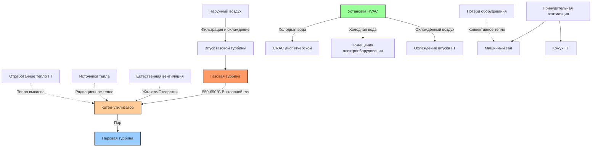

## Основы проектирования HVAC комбинированного цикла

Электростанции комбинированного цикла объединяют газовые турбины (ГТ), котлы-утилизаторы тепла (КУТ) и паровые турбины (ПТ) для достижения тепловой эффективности 55-60%. Каждая зона представляет уникальные проблемы HVAC, обусловленные скоростью генерации тепла, требованиями к качеству воздуха и операционными ограничениями. Проектирование HVAC должно решать задачи кондиционирования воздуха впуска турбины, охлаждения оборудования, комфорта персонала и отвода тепла при минимизации паразитной мощности.

## Кондиционирование воздуха впуска газовой турбины

Производительность газовой турбины критически зависит от условий воздуха на входе. Мощность и эффективность изменяются обратно пропорционально температуре входящего воздуха согласно:

$$P_{GT} = P_{ref} \left(1 - \alpha \frac{T_{inlet} - T_{ref}}{T_{ref}}\right)$$

где $P_{GT}$ — мощность на валу турбины, $P_{ref}$ — эталонная мощность при $T_{ref}$ (обычно 15°C), и $\alpha$ колеблется от 0,5 до 0,7 в зависимости от конструкции турбины.

Системы охлаждения впуска увеличивают мощность при высоких температурах окружающей среды:

$$\Delta P = \dot{m}_{air} c_p (T_{ambient} - T_{cooled}) \times \frac{\eta_{thermal}}{\eta_{compression}}$$

Типичные технологии охлаждения впуска включают испарительное охлаждение (понижение температуры на 3-5°C от мокрого термометра), охлаждение впуска (механическое охлаждение до 7-13°C) и гибридные системы. Нагрузка охлаждения для типичной газовой турбины мощностью 250 МВт с охлаждением впуска составляет:

$$Q_{cooling} = \dot{m}_{air} c_p \Delta T = 600 \, \text{кг/с} \times 1,006 \, \text{кДж/кг·К} \times (35 - 10) \, \text{°C} = 15090 \, \text{кВт}$$

Фильтрация удаляет частицы (>99% эффективности для частиц >10 мкм) для предотвращения засорения компрессора и эрозии. Перепад давления на фильтрах должен оставаться ниже 100-150 Па, чтобы избежать чрезмерных штрафов по производительности.

## HVAC зоны котла-утилизатора тепла

Котёл-утилизатор работает при температурах выхлопного газа от 550-650°C на входе до 90-110°C на выходе в дымоход. Радиационный тепловой поток с поверхности оболочки определяет требования к вентиляции:

$$q_{rad} = \epsilon \sigma A (T_s^4 - T_{amb}^4)$$

где $\epsilon$ — коэффициент излучательности поверхности (0,85-0,95 для изолированной стали), $\sigma = 5,67 \times 10^{-8} \, \text{Вт/м}^2\text{·K}^4$, и $T_s$ — температура поверхности (обычно 50-70°C при надлежащей изоляции).

Скорости вентиляционного потока для закрытых зданий с КУТ следуют:

$$\dot{V} = \frac{Q_{total}}{c_p \rho (T_{exit} - T_{inlet})}$$

Для ограничения повышения температуры в здании на 5-8°C выше окружающей среды типичные скорости вентиляции составляют 15-25 воздухообменов в час. Естественная вентиляция через жалюзи и вентиляционные отверстия на крыше может обеспечить этот поток при $\Delta T$ > 5°C, генерируя движение воздуха за счёт плавучести:

$$\dot{V}_{natural} = C_d A \sqrt{2g H \frac{\Delta T}{T_{avg}}}$$

где $C_d$ — коэффициент выпуска (0,6-0,65), $A$ — эффективная площадь вентиляционного отверстия, $H$ — разница высот, и $\Delta T$ — разница температур между воздухом в помещении и снаружи.

## Вентиляция машинного зала паровой турбины

Машинный зал паровой турбины содержит паровую турбину-генератор, конденсатор, подогреватели питательной воды и вспомогательное оборудование. Отвод тепла от этих компонентов составляет 0,5-1,5% от теплового ввода установки. Для комбинированного цикла мощностью 400 МВт с тепловым вводом 800 МВт:

$$Q_{hall} = 0,01 \times 800 \, \text{МВт} = 8 \, \text{МВт} = 8000 \, \text{кВт}$$

Эта тепловая нагрузка включает:
- Излучение оболочки турбины: 40-50%
- Потери подогревателя питательной воды и трубопроводов: 25-35%
- Потери генератора: 15-20%
- Вспомогательное оборудование: 5-10%

Системы вентиляции должны поддерживать температуру в помещении ниже 40°C при летней работе и обеспечивать положительное давление 50-80 Па для предотвращения проникновения пыли и влаги. Распределение приточного воздуха использует высокоскоростные струи на уровне крыши с нисходящими потоками для создания эффектов омывания воздуха над оборудованием.

## HVAC диспетчерской и электрооборудования

Диспетчерские требуют прецизионного кондиционирования воздуха для поддержания 22-24°C ±2°C и 45-55% относительной влажности для надежности приборов и комфорта операторов. Расчёт общей тепловой нагрузки включает:

$$Q_{total} = Q_{equipment} + Q_{lights} + Q_{envelope} + Q_{occupants} + Q_{ventilation}$$

Тепловые нагрузки от оборудования достигают 100-200 Вт/м² для современных распределённых систем управления (DCS). Резервные блоки HVAC с автоматической переадресацией обеспечивают надежность. Специализированные блоки кондиционирования воздуха компьютерных помещений (CRAC) обслуживают помещения электрооборудования и аккумуляторные комнаты.

Помещения электрооборудования с распределительными устройствами, центрами управления двигателями и преобразователями частоты генерируют тепловые нагрузки 50-150 Вт/м². Вентиляция поддерживает температуры ниже 40°C, продлевая срок службы оборудования и предотвращая ложные отключения.

## Сравнение HVAC зон комбинированного цикла

| Зона | Скорость вентиляции | Расчётная температура | Плотность тепла | Основная задача |
|------|-----------------|-------------------|--------------|-----------------|
| Кожух ГТ | 50-100 ACH | <45°C | 15-25 кВт/м² | Обнаружение горючих газов, защита от пожара |
| Здание КУТ | 15-25 ACH | Окружающая +5-8°C | 8-12 кВт/м² | Контроль радиационного тепла, удаление влаги |
| Машинный зал ПТ | 10-15 ACH | <40°C | 3-6 кВт/м² | Комфорт персонала, охлаждение оборудования |
| Здание диспетчерской | 8-12 ACH | 22-24°C | 0,1-0,2 кВт/м² | Прецизионный контроль температуры/влажности |
| Кожух генератора | 20-40 ACH | <45°C | 20-30 кВт/м² | Поддержка системы охлаждения на водороде |

## Архитектура системы

## Энергетический баланс и оптимизация паразитной нагрузки

Паразитная нагрузка системы HVAC непосредственно снижает чистую мощность на выходе установки. Для установок комбинированного цикла HVAC обычно потребляет 0,3-0,8% от валовой мощности. Стратегии оптимизации включают:

**Свободное охлаждение**: Использование наружного воздуха при наличии благоприятной температуры (весна/осень/зима) исключает работу холодильной машины:

$$Q_{free} = \dot{m}_{air} c_p (T_{indoor} - T_{outdoor})$$

Доступно при $T_{outdoor} < T_{indoor} - 2\text{°C}$.

**Приводы с переменной скоростью**: Мощность вентилятора зависит от куба скорости, поэтому 80% потока снижает мощность до 51% от расчётной:

$$P_{fan} = \frac{\dot{V} \Delta P}{\eta_{fan}} \propto \dot{V}^3$$

**Утилизация отработанного тепла**: Извлечение низкопотенциального тепла из системы охлаждения рубашки двигателя или охлаждения масла для зимнего отопления уменьшает потребление топлива котла или электрические нагрузки отопления.

## Стандарты проектирования и справочные материалы

Проектирование HVAC комбинированного цикла следует:

- **NFPA 850**: Рекомендуемая практика защиты от пожара для электрогенерирующих установок
- **ASHRAE Applications Handbook**: Глава 27, Электростанции
- **ISO 2314**: Газовые турбины — Приёмо-сдаточные испытания
- **ASME PTC 22**: Код испытания производительности газовых турбин
- **IEEE 666**: Проектирование вспомогательных систем для генерирующих станций

Специфичные для конкретной площадки соображения включают крайние значения температуры окружающей среды (влияющие на производительность ГТ), относительную влажность (влияющую на потенциал испарительного охлаждения) и концентрации пыли/соли (определяющие требования к фильтрации). Установки в прибрежной зоне требуют устойчивых к коррозии материалов и повышенной фильтрации для воздуха с морской солью. Площадки в пустыне нуждаются в надёжной фильтрации (>99,5% эффективности) и испарительном охлаждении, где имеется вода.

## Эксплуатационные соображения

Работа системы HVAC интегрируется со стратегией диспетчеризации установки. В периоды пикового спроса при высоких температурах окружающей среды охлаждение впуска максимизирует выход ГТ несмотря на повышенную паразитную нагрузку. В периоды спада спроса системы HVAC могут работать в сокращённом режиме для минимизации потребления вспомогательной мощности.

Графики замены фильтров уравновешивают штрафы по перепаду давления в сравнении с затратами на техническое обслуживание. Мониторинг дифференциального давления инициирует замену фильтров при $\Delta P$ выше 125-150 Па. Автоматизированные системы мониторинга состояния фильтров оптимизируют интервалы замены и предотвращают вынужденные остановки из-за чрезмерного перепада давления.

## Компоненты

- Газотурбинная установка комбинированного цикла (CCGT)
- Котёл-утилизатор тепла (КУТ)
- Многоступенчатый котёл-утилизатор
- Эффективность 55-60 процентов
