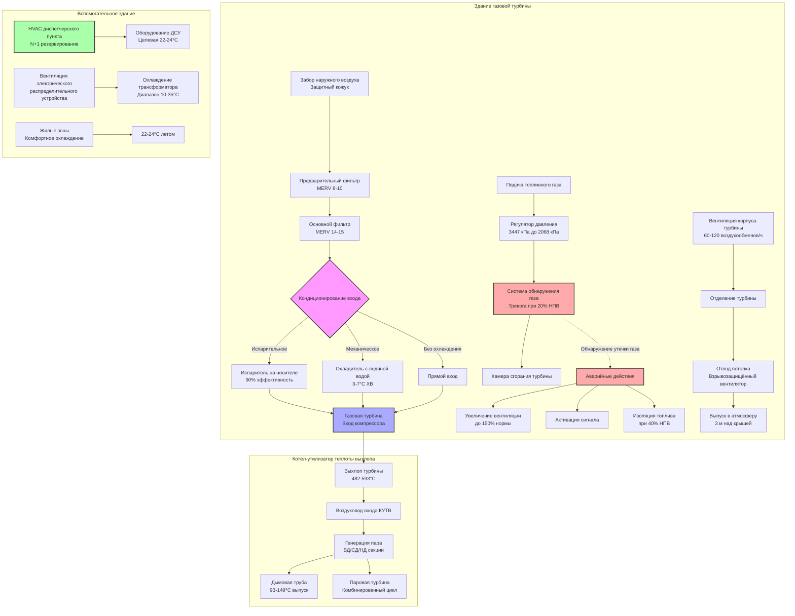

## Основы систем HVAC электростанций на природном газе

Электростанции, работающие на природном газе, используют турбины внутреннего сгорания (газовые турбины) как первичные приводы в конфигурации простого цикла для пиковых нагрузок или в конфигурации комбинированного цикла для базовой генерации. Эти объекты создают особые проблемы HVAC, обусловленные опасностью взрывов газа, требованиями к воздуху для горения, превышающими 1 млн CFM (1699 м³/ч) на установку, и чувствительностью характеристик турбины к условиям входящего воздуха.

Основные проблемы HVAC на газовых электростанциях существенно отличаются от угольных или атомных объектов. Качество и температура входящего воздуха газовой турбины непосредственно определяют выходную мощность и тепловой расход. Увеличение температуры входящего воздуха на 0,56°C (1°F) снижает выходную мощность на 0,5-0,7% и одновременно увеличивает тепловой расход (расход топлива на кВтч) на 0,3-0,5%. Для газовой турбины мощностью 250 МВт каждый градус представляет потерю мощности в 1,25-1,75 МВт, что стоит 1,25-1,75 млн долл. в год в виде избежанных затрат на мощность.

Вентиляция взрывоопасных зон предотвращает накопление метана от фланцев труб, сальников клапанов, вентиляции регуляторов давления и потенциальных утечек. Природный газ (главным образом метан, CH₄) имеет нижний предел взрываемости (НПВ) 5,0% по объёму в воздухе. NFPA 37 (Стандарт по установке и использованию стационарных двигателей внутреннего сгорания и газовых турбин) требует вентиляции, поддерживающей концентрацию газа ниже 25% НПВ (1,25% по объёму) в помещениях с персоналом и ниже 100% НПВ (5,0%) в непроходимых корпусах с непрерывным обнаружением газа.

## Системы подачи воздуха для горения газовых турбин

### Термодинамическая основа эффектов температуры воздуха

Выходная мощность газовой турбины происходит из цикла Брайтона, с выходной мощностью, пропорциональной расходу массы воздуха через турбину. Секция компрессора потребляет 50-60% мощности вала турбины, сжимая входящий воздух от атмосферного давления (101,3 кПа) до 15-30 атмосфер.

Работа компрессора следует:

$$W_c = \dot{m} \cdot c_p \cdot (T_2 - T_1) = \dot{m} \cdot c_p \cdot T_1 \left[\left(\frac{P_2}{P_1}\right)^{\frac{\gamma-1}{\gamma}} - 1\right]$$

Где:
- $W_c$ = работа компрессора (кВ)
- $\dot{m}$ = массовый расход воздуха (кг/с)
- $c_p$ = удельная теплоёмкость при постоянном давлении (1,005 кДж/кг·К для воздуха)
- $T_1$ = температура входа (К)
- $T_2$ = температура выхода (К)
- $P_1$, $P_2$ = давления входа и выхода (кПа)
- $\gamma$ = коэффициент адиабаты (1,4 для воздуха)

Поскольку $\dot{m} = \frac{\rho \cdot Q}{1}$ и плотность воздуха снижается с температурой согласно $\rho = \frac{P}{R \cdot T}$, более высокая температура входа снижает массовый расход при фиксированном объёмном расходе, уменьшая как чистую выходную мощность, так и термический КПД.

Чистая мощность турбины:

$$P_{net} = P_{turbine} - P_{compressor} = \eta_{mech} \cdot (\dot{m} \cdot c_p \cdot T_3 - W_c)$$

Где $T_3$ — температура входа в турбину (1200-1500°C для современных турбин).

### Системы фильтрации входящего воздуха

Газовые турбины нулевой допуск к проникновению частиц. Эрозия лопаток компрессора при концентрации частиц 10 ppm снижает эффективность на 1-2% за 1000 часов работы. Многоступенчатая фильтрация удаляет частицы, минимизируя перепад давления, который потребляет мощность и снижает выход.

**Проектирование фильтровальной установки**:
- Защитный кожух или входной жалюзи: Предотвращает захват дождя/снега
- Предварительный фильтр: MERV 8-10, удаляет частицы >10 мкм
- Основной фильтр: MERV 14-15, удаляет 95% частиц >1 мкм
- Финальный фильтр: MERV 16 или HEPA, удаляет 99,97% частиц >0,3 мкм
- Полный перепад давления: 10-20 см в.ст. чистый, 25-35 см в.ст. грязный

Перепад давления через фильтрацию прямо снижает доступное отношение давления в компрессоре. Каждый сантиметр водяного столба потери давления снижает выход примерно на 0,25-0,4%. Интервалы обслуживания фильтров уравновешивают штраф перепада давления против затрат на замену фильтра.

### Испарительное охлаждение входящего воздуха

Испарительное охлаждение использует скрытую теплоту испарения воды (2454 кДж/кг при 15,6°C) для охлаждения входящего воздуха, приближаясь к температуре влажного термометра. Этот процесс следует психрометрическим соотношениям, где потенциал охлаждения равен разности температур сухого и влажного термометров.

**Испарители типа "носитель"**: Вода течёт по жёсткому целлюлозному носителю, в то время как воздух проходит через увлажняемую поверхность. Одновременно происходят перенос тепла и массы:

$$q = h_{fg} \cdot \dot{m}_w = \dot{m}_a \cdot c_p \cdot (T_{db,in} - T_{db,out})$$

Где:
- $q$ = ёмкость охлаждения (кДж/ч)
- $h_{fg}$ = скрытая теплота испарения (2454 кДж/кг)
- $\dot{m}_w$ = скорость испарения воды (кг/ч)
- $\dot{m}_a$ = массовый расход воздуха (кг/ч)
- $T_{db,in}$, $T_{db,out}$ = температуры сухого термометра (°C)

Эффективность варьируется от 85-95% для систем с носителем:

$$\epsilon = \frac{T_{db,in} - T_{db,out}}{T_{db,in} - T_{wb,in}}$$

Для условий 35°C сухого термометра и 18°C влажного термометра при эффективности 90%:
$$T_{db,out} = 35 - 0,90(35-18) = 19,7°C$$

Это снижение температуры на 15,3°C увеличивает выходную мощность турбины на 13,5-18,9% в сравнении с охлаждением без охлаждения.

**Системы туманообразования**: Высокопроизводительные насосы (69-207 бар) распыляют деионизированную воду в капли размером 10-20 мкм, впрыскиваемые в воздуховод входа. Полное испарение происходит в течение 3-4,6 м, приближаясь к 100%-й эффективности насыщения. Переброс (капли, не испарившиеся) вызывает эрозию лопаток компрессора, требуя точного управления и высокого качества водоподготовки (проводимость <1 мкСм/см, общее количество растворённых твёрдых веществ <1 ppm).

### Механическое охлаждение входящего воздуха

Охлаждение на основе холодильной машины достигает температур ниже влажного термометра, эффективно во влажном климате, где испарительное охлаждение обеспечивает минимальное преимущество. Парокомпрессионные или абсорбционные охладители производят охлаждённую воду при 3-7°C, циркулирующую через оребрённые теплообменники.

Требуемая ёмкость охлаждения:

$$q_{cooling} = 1.2 \cdot Q \cdot \Delta T = 1.2 \cdot Q \cdot (T_{ambient} - T_{target})$$

Для входа турбины 500 000 CFM (849 м³/ч) охлаждаемого с 35°C до 10°C:
$$q_{cooling} = 1.2 \times 849,000 \times (35-10) = 25,470,000 \text{ кДж/ч} = 7,075 \text{ кВ}$$

Паразитное потребление мощности холодильной установкой (0,6-0,8 кВ/кВ охлаждения) и вентиляторов/насосов градирни снижает увеличение чистого выхода. Экономический анализ сравнивает увеличенный доход от генерации против эксплуатационных затрат. Охлаждение входа обычно работает в периоды пикового спроса (5-8 часов в день), когда оптовые цены электроэнергии оправдывают эксплуатационные затраты.

## Вентиляция взрывоопасных зон и обнаружение газа

### Свойства природного газа и классификация опасности

Метан (основной компонент природного газа) проявляет:
- Молекулярный вес: 16,04 г/моль (легче воздуха: 28,97 г/моль)
- Плотность при СТУ: 0,019 кг/м³ (воздух: 0,034 кг/м³)
- Плавучесть: Поднимается и накапливается в верхних точках, карманах потолка
- Нижний предел взрываемости (НПВ): 5,0% по объёму
- Верхний предел взрываемости (ВПВ): 15,0% по объёму
- Температура самовоспламенения: 540°C
- Минимальная энергия зажигания: 0,29 мДж

Области подачи топлива природного газа, содержащие оборудование, которое может выпустить газ при нормальной работе, представляют класс I, категория 2 или зона 2 по NFPA 70 (NEC) статья 500. Области с непрерывным или частым выпуском газа классифицируются как класс I, категория 1 или зона 1.

### Требования вентиляции NFPA 37

NFPA 37 раздел 6.3 устанавливает минимальную вентиляцию для корпусов газовых турбин и комнат оборудования топливного газа:

**Скорость механической вентиляции**:

$$Q_{vent} = \frac{Q_{gas,max} \cdot 10,000}{C_{max} \cdot \epsilon}$$

Где:
- $Q_{vent}$ = требуемая скорость вентиляции (CFM)
- $Q_{gas,max}$ = максимальная потенциальная скорость выпуска газа (CFM)
- $C_{max}$ = максимально допустимая концентрация газа (обычно 1,25% = 25% НПВ)
- $\epsilon$ = коэффициент эффективности смешивания (0,5-0,7 для типичных конфигураций)
- 10,000 = коэффициент преобразования

Для комнаты оборудования топливного газа с максимальной потенциальной скоростью утечки 0,28 м³/ч:
$$Q_{vent} = \frac{0.28 \times 10,000}{1.25 \times 0.6} = 3,733 \text{ м³/ч}$$

Фактические установки обычно обеспечивают 1-2 воздухообмена в минуту для закрытых зданий газовых турбин, или 60-120 воздухообменов в час.

**Непрерывное обнаружение газа**: NFPA 37 требует обнаружения газа с срабатыванием сигналов тревоги при 20% НПВ (1,0% метана) и инициированием аварийной вентиляции или отсечки топлива при 40% НПВ (2,0% метана). Детекторы размещаются в:
- Уровне потолка (точки накопления метана)
- Местах оборудования топливного газа
- Замкнутых пространствах и потенциальных мёртвых зонах
- Интервал: максимум 6 м радиуса охвата на один детектор

### Проектирование вентиляции взрывоопасной зоны

| **Параметр проектирования** | **Помещение оборудования с персоналом** | **Непроходимый корпус** | **Наружная установка** |
|---|---|---|---|
| **Целевая концентрация** | <1,25% (25% НПВ) | <5,0% (100% НПВ) | Н/П - естественная дисперсия |
| **Воздухообмены в час** | 60-120 (1-2/мин) | 30-60 (0,5-1/мин) | Н/П |
| **Режим вентиляции** | Непрерывная механическая | Непрерывная или по требованию | Естественная вентиляция |
| **Распределение воздуха** | Подача у пола, отвод потолка | Несколько выходов выше | Жалюзи, вентиляционные отверстия крыши |
| **Контроль источника зажигания** | Класс I, кат. 2 электрооборудование | Класс I, кат. 1 или 2 | Общего назначения |
| **Обнаружение газа** | Требуется, тревога при 20% НПВ | Требуется, отсечка при 40% НПВ | Рекомендуется |
| **Аварийная вентиляция** | 150% нормального расхода при срабатывании | 200% нормального расхода при срабатывании | Н/П |

**Эффективность смешивания**: Надлежащее распределение воздуха предотвращает застойные зоны, где газ накапливается несмотря на адекватную общую вентиляцию. Введение подаваемого воздуха у уровня пола создаёт восходящий поток, уносящий выпущенный газ к отводу потолка. Вычислительное моделирование гидродинамики (CFD) проверяет дисперсию газа для сложных геометрий.

**Проектирование системы отвода**:
- Вентиляторы отвода: Искробезопасная конструкция, взрывозащищённые электромоторы
- Воздуховоды: Без карманов или низких точек, задерживающих газ
- Место выпуска: 3 м над крышей, 7,6 м от воздухозаборников
- Обратные клапаны: Предотвращают обратный поток при остановке вентилятора
- Аварийное питание: Вентиляторы отвода на резервном генераторе

## Конфигурация системы HVAC электростанции на природном газе

## Требования к воздуху для горения

Газовые турбины потребляют воздух при стехиометрических соотношениях, значительно превышающих требования для отопления. Полное сгорание метана:

$$\text{CH}_4 + 2\text{O}_2 + 7.52\text{N}_2 \rightarrow \text{CO}_2 + 2\text{H}_2\text{O} + 7.52\text{N}_2$$

Стехиометрическое соотношение воздух-топливо: 17,2:1 по массе. Газовые турбины работают при 50-60:1 (обеднённое сгорание), снижая образование NOₓ и обеспечивая охлаждение турбины.

Для простого цикла газовой турбины мощностью 250 МВт при тепловом расходе 29,1 кДж/кВтч:
- Расход топлива: $\frac{250,000 \times 29,100}{37,300 \text{ кДж/м}^3} = 194,5$ м³/ч природного газа
- Воздух для горения: $194,5 \times 50 \times \frac{28,97}{16,04} = 35,2$ м³/ч при СТУ
- Фактический входящий воздух (35°C): $35,200 \times \frac{292}{288} = 35,700$ CFM

Полный расход воздуха входа турбины превышает 424 м³/ч (250 000 CFM), при этом воздух для горения представляет 25% полного расхода.

## Проектирование HVAC корпуса турбины

Пиковые установки простого цикла часто используют наружные установки с защитными кожухами. Базовые установки комбинированного цикла обычно занимают частично или полностью закрытые здания, требующие механической вентиляции.

**Источники теплового исходящего потока**:
- Радиация корпуса турбины: 0,10-0,17 кВ на кВ установленной мощности
- Потери генератора: 0,5-1,0% выхода (1,25-2,5 МВ для установки 250 МВ)
- Вспомогательное оборудование: Система смазки, гидравлические насосы, системы охлаждения
- Солнечная нагрузка: Значительная для металлических зданий

Полная тепловая нагрузка для здания газовой турбины 250 МВ: 11,7-17,6 МВт.

Скорость вентиляции из уравнения явного тепла:

$$Q = \frac{q}{1.2 \times \Delta T} = \frac{12,500 \text{ кВ}}{1.2 \times 11,1} = 932,000 \text{ м}^3/\text{ч}$$

Для корпуса 30,5 м × 45,7 м × 18,3 м (25 500 м³), это представляет 37 воздухообменов в час, отвечая минимальному требованию NFPA 37 для вентиляции взрывоопасной зоны.

**Компоненты системы вентиляции**:
- Подающий воздух: Настенные жалюзи нижнего уровня с моторизованными заслонками, фильтрованный (MERV 8)
- Отвод: Осевые вентиляторы, установленные на крыше (28-42 м³/ч каждый)
- Зимний обогрев: Паровые или горячеводяные теплообменники, поддерживающие 10°C минимум
- Управление: Модуляция скорости вентилятора по температуре, поэтапные заслонки подачи
- Блокировка обнаружения газа: Переопределение на максимальную вентиляцию при срабатывании тревоги

## Диспетчерский пункт и вспомогательные помещения

Диспетчерские пункты, комнаты электрического оборудования и офисы в составе газовых электростанций требуют обычного HVAC, независимого от производственных зон. Проектирование диспетчерского пункта следует принципам, изложенным в главном разделе HVAC электростанций, с резервированием N+1, точным управлением температурой (22-24°C ± 1,1°C) и непрерывной работой.

Комнаты электрического распределительного устройства, содержащие оборудование 13,8 кВ или 115-500 кВ, требуют управления температурой, предотвращающего конденсацию и управляющего потерями трансформатора. Вентиляция поддерживает 10-35°C с нижним пределом, предотвращающим конденсацию влаги на холодных поверхностях при остановке установки.

## Стандарты и нормативные требования

**NFPA 37 (2021)**: Установка и использование стационарных двигателей внутреннего сгорания и газовых турбин устанавливает:
- Раздел 6.3: Требования вентиляции для корпусов турбин
- Раздел 7.2: Трубопровод топливного газа и безопасность
- Раздел 8.1: Системы обнаружения газа и сигнализации
- Приложение C: Методология расчёта вентиляции

**NFPA 70 (NEC)**: Статья 500 определяет классификацию взрывоопасных мест для областей, содержащих оборудование топливного газа, определяя требования электрических систем, влияющие на электромоторы вентиляторов HVAC и элементы управления.

**NFPA 850**: Рекомендуемая практика защиты от пожара для электрогенерирующих объектов обращается к защите от дыма в системах вентиляции, включая вентиляцию очистки дыма.

**API RP 500/505**: Классификация мест для электрических установок в объектах нефтяной промышленности обеспечивает руководство для газовых турбинных установок, обрабатывающих природный газ, устанавливая классификации категорий/зон.

**ISO 2314**: Приёмные испытания газовых турбин определяет стандартные условия входа и коэффициенты коррекции для испытания эффективности, информирующие проектирование системы охлаждения входа.

**Справочник приложений ASHRAE, глава 28**: Электростанции обеспечивает руководство по проектированию газовых турбинных объектов, включая фильтрацию воздуха для горения, системы охлаждения входа и требования к HVAC диспетчерского пункта.

**OSHA 29 CFR 1910.110**: Хранение и обращение со сжиженными углеводородными газами (применимо к системам резервного топлива СПГ) устанавливает требования безопасности, влияющие на проектирование HVAC для зон хранения топлива.

Производители турбин (GE, Siemens, Mitsubishi Heavy Industries) публикуют руководства по установке, определяющие максимальную температуру входящего воздуха, допустимый перепад давления фильтрации, скорости вентиляции корпуса и требования к HVAC диспетчерского пункта как условия договора, влияющие на гарантию и гарантированные характеристики.
