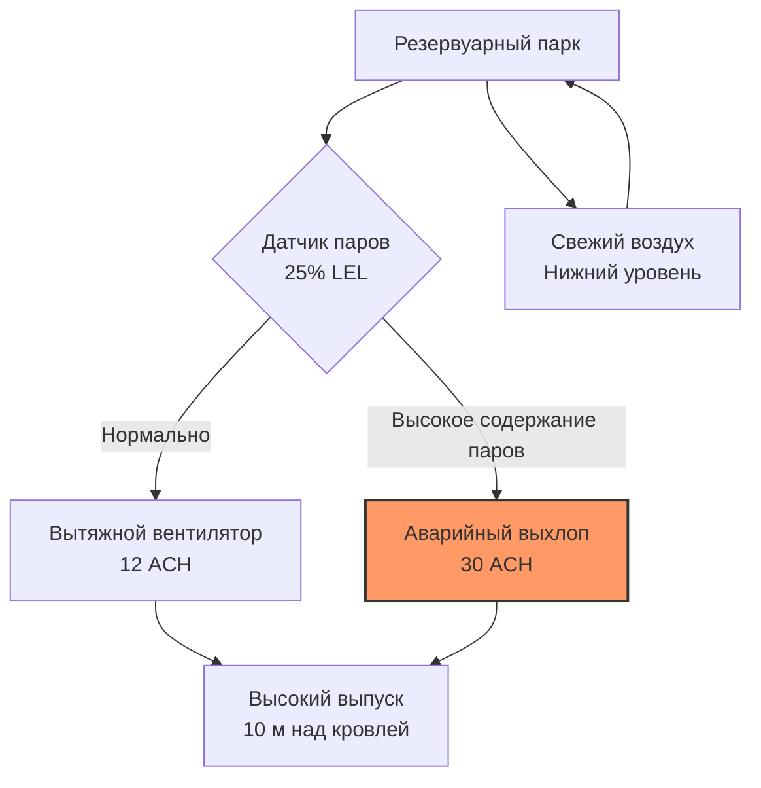

## Обзор

ТЭС с мазутным топливом представляют уникальные проблемы HVAC, связанные с контролем вязкости топлива, сдерживанием паров, подачей воздуха для сгорания и инфраструктурой контроля выбросов. Системы на тяжелом мазуте (HFO) требуют температур 90–120°C для надлежащего распыления, тогда как летучие легкие масла требуют взрывозащищенной вентиляции. Процесс сгорания генерирует диоксид серы (SO₂), оксиды азота (NOₓ) и твердые частицы, требующие обширных систем экологического контроля с выделенной инфраструктурой HVAC.

## Требования к воздуху для сгорания

### Расчет стехиометрического воздуха

Для полного сгорания мазута теоретическое требование воздуха зависит от состава топлива:

$$A_{theo} = \frac{11.5C + 34.5\left(H - \frac{O}{8}\right) + 4.3S}{100}$$

Где:
- $A_{theo}$ = теоретический воздух (кг/кг топлива)
- $C$, $H$, $O$, $S$ = массовые доли углерода, водорода, кислорода и серы

Фактические требования к воздуху для сгорания включают избыток воздуха для обеспечения полного сгорания:

$$A_{actual} = A_{theo}(1 + EA)$$

Где $EA$ = коэффициент избытка воздуха (обычно 0,15–0,25 для котлов с мазутным топливом).

Для типичного тяжелого мазута (C: 85%, H: 11%, O: 1%, S: 3%) теоретическое требование воздуха составляет приблизительно 14,3 кг воздуха/кг топлива. При 20% избыточного воздуха фактическое требование становится 17,2 кг/кг топлива.

### Проектирование системы подачи воздуха для сгорания

Вентиляторы воздуха для сгорания должны преодолеть:
- Перепад давления фильтра: 200–400 Па
- Перепад давления воздухоподогревателя: 800–1200 Па
- Сопротивление ветрозащитного ящика и горелки: 1000–2000 Па
- Давление в топке (отрицательное): -50 до -200 Па

Общее требование к статическому давлению: 2000–3800 Па, с вентиляторами принудительной тяги, обычно рассчитанными на 100–150 кПа для надлежащего запаса прочности.

## Системы обработки и нагрева топливного масла

### Контроль температуры тяжелого мазута

Вязкость тяжелого мазута должна быть снижена до 15–20 сСт на кончике горелки для надлежащего распыления. Отношение между температурой и вязкостью подчиняется:

$$\log(\log(\nu + 0.8)) = A - B\log(T)$$

Где:
- $\nu$ = кинематическая вязкость (сСт)
- $T$ = абсолютная температура (К)
- $A$, $B$ = константы, характерные для топлива

| Тип масла | Темп. хранения | Темп. перекачки | Темп. распыления | Типичная вязкость при 50°C |
|-----------|-----------------|-----------------|------------------|---------------------------|
| Легкое топливное масло (LFO) | Окружающая | Окружающая | 40–60°C | 5–10 сСт |
| Тяжелое топливное масло (HFO) 180 | 40–50°C | 60–80°C | 90–110°C | 180 сСт |
| Тяжелое топливное масло (HFO) 380 | 50–70°C | 80–100°C | 110–130°C | 380 сСт |

### Расчет нагрузки нагрева топливного масла

Теплота, необходимая для повышения температуры мазута:

$$Q = \dot{m} c_p (T_2 - T_1)$$

Где:
- $Q$ = мощность нагрева (кВт)
- $\dot{m}$ = расход топлива (кг/с)
- $c_p$ = удельная теплоемкость (1,8–2,1 кДж/кг·К для мазута)
- $T_1$, $T_2$ = начальная и конечная температуры (°C)

Для ТЭС мощностью 500 МВт, потребляющей 40 кг/с HFO 380, при нагреве от 60°C хранения до 120°C распыления:

$$Q = 40 \times 2.0 \times (120 - 60) = 4800 \text{ кВт}$$

Дополнительная мощность в размере 25–30% учитывает потери тепла и требования при пуске, что приводит к общей мощности системы нагрева приблизительно 6000 кВт.

## Вентиляция резервуарного парка

### Вентиляция газового пространства

Резервуары для хранения мазута генерируют пары углеводородов, требующие вентиляции для предотвращения взрывоопасных атмосфер. Скорость эволюции паров растет экспоненциально с температурой:

$$\dot{V}_{vapor} = K \cdot A \cdot P_{vapor}$$

Где:
- $\dot{V}_{vapor}$ = скорость генерации паров (м³/ч)
- $K$ = коэффициент массопередачи
- $A$ = площадь поверхности жидкости (м²)
- $P_{vapor}$ = давление пара при температуре хранения

### Критерии проектирования вентиляции

Здания резервуарного парка требуют:
- Минимум 12 воздухообменов в час (ACH) при непрерывной вентиляции
- Аварийная вентиляция: 30 ACH при обнаружении паров
- Взрывозащищенное электрооборудование (класс I, отделение 2)
- Мониторинг нижнего предела взрываемости (LEL) с сигнализацией при 25% LEL
- Контроль температуры: 15–30°C для минимизации генерации паров

Скорость выхлопа должна превышать 15 м/с для обеспечения надлежащей диспергирования. Точки выхлопа должны располагаться не менее чем в 10 метрах над самой высокой соседней конструкцией и на минимальном расстоянии 15 метров по горизонтали от воздухозаборов.

## Инфраструктура HVAC системы контроля выбросов

### Система очистки дымовых газов от серы (FGD)

Системы удаления SO₂ требуют контролируемых условий температуры и влажности:

| Параметр | Мокрый абсорбер | Сухой абсорбер |
|----------|-----------------|-----------------|
| Темп. входящего газа | 120–180°C | 120–180°C |
| Темп. в абсорбере | 50–60°C | 65–80°C |
| Темп. выходящего газа | 50–60°C (насыщенный) | 70–90°C |
| Расход охлаждающей воды | 100–150 м³/ч на МВт | Не требуется |
| Эффективность удаления SO₂ | 95–98% | 90–95% |

Процесс мокрого абсорбирования включает распылительное охлаждение и химическую абсорбцию:

$$\text{SO}_2 + \text{CaCO}_3 + \frac{1}{2}\text{H}_2\text{O} \rightarrow \text{CaSO}_3 \cdot \frac{1}{2}\text{H}_2\text{O} + \text{CO}_2$$

Удаление тепла из дымовых газов в абсорбере:

$$Q_{cool} = \dot{m}_{gas}[c_{p,gas}(T_{in} - T_{out}) + h_{fg}\Delta\omega]$$

Где:
- $\dot{m}_{gas}$ = массовый расход дымовых газов (кг/с)
- $c_{p,gas}$ = удельная теплоемкость дымовых газов (1,05 кДж/кг·К)
- $T_{in}$, $T_{out}$ = температура входа и выхода (°C)
- $h_{fg}$ = теплота парообразования (2440 кДж/кг)
- $\Delta\omega$ = увеличение коэффициента влажности (кг воды/кг сухого газа)

### Система селективного каталитического восстановления (SCR)

Восстановление NOₓ требует точного контроля температуры в катализаторной кровати:

- Оптимальная температура катализатора: 300–400°C
- Температура впрыска аммиака: 280–320°C
- Время пребывания газа: 0,3–0,5 секунды
- Равномерность температуры: ±15°C по сечению катализатора

Температура ниже 280°C вызывает проскок аммиака и образование сульфатов. Выше 420°C происходит спекание катализатора, снижая эффективность.

### HVAC электростатического осадителя (ESP)

Эффективность удаления твердых частиц зависит от поддержания оптимальных условий дымовых газов:

$$\eta = 1 - e^{-\frac{\omega A}{Q}}$$

Где:
- $\eta$ = эффективность сбора
- $\omega$ = скорость миграции частиц (см/с)
- $A$ = площадь пластин сбора (м²)
- $Q$ = расход газа (м³/с)

Здания ESP требуют:
- Контроль температуры окружающей среды: 15–35°C для электрооборудования
- Обогрев приемных воронок: 150–180°C для предотвращения мостообразования золы
- Изоляция: минимальное значение R 3,5 м²·К/Вт для снижения потерь тепла
- Охлаждение вибромотора: принудительная вентиляция для поддержания <60°C

## Сравнение с другими ТЭС на ископаемых топливах

| Параметр | Мазутная | Угольная | Газовая комбинированного цикла |
|----------|----------|----------|--------------------------------|
| HVAC хранения топлива | Обогреваемые резервуары, контроль паров | Подавление пыли, защита от пожара | Минимальный (доставка по трубопроводу) |
| Темп. воздуха для сгорания | 300–350°C | 250–300°C | 400–500°C (газовая турбина) |
| Требуемый избыток воздуха | 15–25% | 20–30% | 15–20% (газовая турбина) |
| Выбросы SO₂ | 1000–3000 мг/Нм³ (без FGD) | 500–2000 мг/Нм³ (без FGD) | <5 мг/Нм³ |
| Требуется система FGD | Да (высокосернистые масла) | Да (большинство углей) | Нет |
| Выбросы твердых частиц | 50–150 мг/Нм³ (без ESP) | 200–500 мг/Нм³ (без ESP) | <5 мг/Нм³ |
| Переразогрев дымовых газов | Требуется (мокрая FGD) | Требуется (мокрая FGD) | Не применимо |
| Энергия HVAC % выхода | 1,5–2,0% | 2,0–2,5% | 0,8–1,2% |

Мазутные ТЭС имеют меньшую нагрузку твердых частиц, чем угольные, но выше содержание серы, чем газовые. Это приводит к меньшим системам ESP, но большим системам FGD по сравнению с угольными ТЭС. Газовые ТЭС полностью исключают большинство инфраструктуры HVAC контроля выбросов.

## Вентиляция вспомогательных зданий

### Здание котельной

Здание котельной содержит камеру сгорания, оборудование подготовки топлива и системы управления:

- Нормальная вентиляция: 6–8 ACH
- Теплоприход от оборудования: 0,5–1,0% номинальной мощности котла
- Летний дизайн: поддерживать <40°C в рабочих зонах
- Зимний дизайн: минимум 15°C в занятых помещениях
- Избыточное давление: +25 Па относительно наружного воздуха для минимизации инфильтрации

### Помещение насоса топливного масла

Отдельная вентиляция предотвращает накопление паров:

- Непрерывная вентиляция: минимум 15 ACH
- Взрывозащищенное оборудование (класс I, отделение 1)
- Выхлоп с нижнего уровня (пары углеводородов тяжелее воздуха)
- Аварийная вентиляция: 30 ACH при обнаружении утечки
- Рециркуляция не допускается
- Выпуск в безопасное место, минимум 15 м от воздухозаборов

## Стандарты проектирования и литература

Соответствующие стандарты ASHRAE и отрасли:

- ASHRAE 90.1: Energy Standard for Buildings Except Low-Rise Residential Buildings
- NFPA 30: Flammable and Combustible Liquids Code (проектирование резервуарного парка)
- NFPA 37: Standard for the Installation and Use of Stationary Combustion Engines and Gas Turbines
- API 650: Welded Tanks for Oil Storage (термические соображения)
- EPA 40 CFR Part 60: Standards of Performance for New Stationary Sources (требования к выбросам)

ТЭС с мазутным топливом требуют сложных систем HVAC, обеспечивающих управление вязкостью топлива, смягчение опасности взрывов и обширную инфраструктуру контроля выбросов. Физика сгорания, теплопередачи и массопередачи управляют размерением и параметрами эксплуатации системы, требуя тщательной инженерной интеграции с общей конструкцией ТЭС.
