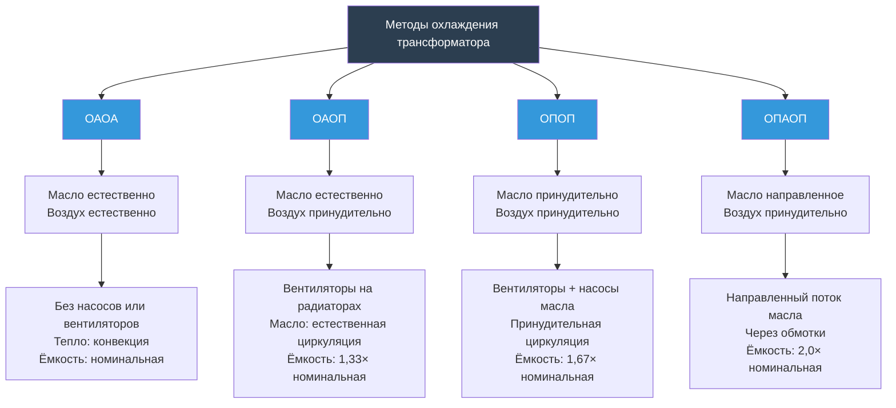
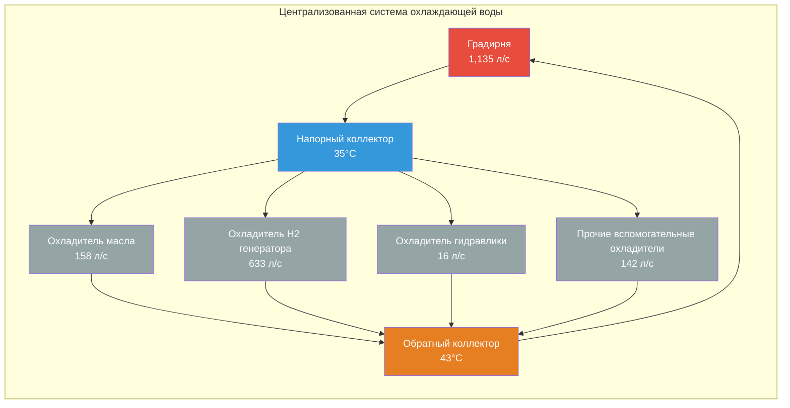

# Охлаждение оборудования в машинных залах турбин

Охлаждение вспомогательного оборудования на объектах генерирования электроэнергии управляет отводом тепла от подшипников турбин, систем смазки, генераторов, трансформаторов и гидравлических систем, которые работают непрерывно при повышенных температурах. В отличие от общей вентиляции машинного зала турбины, которая решает задачи кондиционирования помещения, системы охлаждения оборудования обеспечивают выделение тепла непосредственно от конкретных машин для поддержания температур эксплуатации в пределах, установленных производителем — обычно температура масла подшипников ниже 71°C, обмотки статора генератора ниже 155°C (изоляция класса F) и гидравлическая жидкость ниже 60°C. Охлаждение оборудования использует замкнутые циклы жидкостного охлаждения, принудительные воздушные теплообменники и прямое водяное охлаждение в зависимости от плотности теплового потока, требований к температуре и критичности оборудования.

## Системы охлаждения масла смазки

### Расчет теплонагрузки охладителя масла

Системы масла смазки турбогенератора отводят тепло трения от радиальных и упорных подшипников через принудительную циркуляцию. Теплогенерация в гидродинамических подшипниках следует теории гидродинамической смазки:

**Мощность трения подшипников:**

$$P_{friction} = \mu \times \omega \times \frac{A \times V^2}{h}$$

Где:
- $\mu$ = динамическая вязкость масла (Па·с)
- $\omega$ = угловая скорость вала (рад/с)
- $A$ = площадь поверхности подшипника (м²)
- $V$ = скорость поверхности (м/с)
- $h$ = толщина масляной пленки (м)

**Упрощённое теплогенерирование подшипника:**

Для предварительного проектирования теплогенерация подшипника приблизительно равна:

$$Q_{bearing} = 0.001 \times HP_{shaft} \times 2545 \times 1.055$$

Где $HP_{shaft}$ — мощность на валу, передаваемая через подшипник.

**Общая теплонагрузка системы масла смазки:**

$$Q_{oil,total} = \sum Q_{bearings} + Q_{pump} + Q_{coupling}$$

Типовые компоненты:
- Радиальные подшипники: 8-12 подшипников × 7,3-21,9 кВт каждый
- Упорный подшипник: 43,9-87,8 кВт (несёт осевую нагрузку)
- Масляные насосы (механические потери): 14,6-29,3 кВт
- Муфты редукторов/редукторы: 29,3-73,2 кВт

**Общая системная нагрузка для агрегата мощностью 500 МВт:** 234-439 кВт

### Расчет размера охладителя масла

**Требуемая площадь теплопередачи:**

Охладители масла используют трубчатые или пластинчато-рамные теплообменники. Требуемая площадь поверхности определяется по формуле:

$$Q = U \times A \times \Delta T_{lm}$$

Где:
- $Q$ = тепловая нагрузка (кВт)
- $U$ = общий коэффициент теплопередачи (кВт/(м²·°C))
- $A$ = площадь поверхности теплопередачи (м²)
- $\Delta T_{lm}$ = логарифмическая средняя разность температур (°C)

**Логарифмическая средняя разность температур (LMTD):**

$$\Delta T_{lm} = \frac{(T_{oil,in} - T_{water,out}) - (T_{oil,out} - T_{water,in})}{\ln\left(\frac{T_{oil,in} - T_{water,out}}{T_{oil,out} - T_{water,in}}\right)}$$

**Пример расчёта:**

Для охладителя масла смазки с параметрами:
- Расход масла: 31,5 л/с (масло турбинное ISO VG 32)
- Температура входа масла: 60°C
- Температура выхода масла: 48,9°C
- Температура входа охлаждающей воды: 29,4°C
- Температура выхода охлаждающей воды: 43,3°C

Тепловая нагрузка:

$$Q = \dot{m}_{oil} \times c_{p,oil} \times \Delta T_{oil}$$

$$Q = 31,5 \times \frac{3,600}{1,000} \times 1.0 \times 0.48 \times (60-48.9) = 701,67 \text{ кВт}$$

Расчёт LMTD:

$$\Delta T_1 = 60 - 43.3 = 16.7°C$$
$$\Delta T_2 = 48.9 - 29.4 = 19.5°C$$

$$\Delta T_{lm} = \frac{16.7 - 19.5}{\ln(16.7/19.5)} = \frac{-2.8}{-0.1542} = 18.2°C$$

Для трубчатого охладителя масла с $U = 0.85$ кВт/(м²·°C):

$$A = \frac{Q}{U \times \Delta T_{lm}} = \frac{701.67}{0.85 \times 18.2} = 45.7 \text{ м}^2$$

### Требования к охлаждающей воде

**Расчёт расхода охлаждающей воды:**

$$\dot{m}_{water} = \frac{Q}{c_{p,water} \times \rho_{water} \times \Delta T_{water}}$$

Для приведённого выше примера:

$$\dot{m}_{water} = \frac{701.67}{1.0 \times 1.0 \times (43.3-29.4)} = 49,7 \text{ л/с}$$

**Типовые параметры охлаждающей воды:**

| Параметр | Диапазон | Примечания |
|----------|----------|-----------|
| Температура подачи | 24-35°C | Зависит от градирни/реки |
| Температура возврата | 38-46°C | Подъём на 8-14°C типичен |
| Скорость потока | 0,9-2,1 м/с | Предотвращает зарастание, ограничивает эрозию |
| Падение давления | 69-172 кПа | Комбинированное на стороне кожуха и трубок |
| Коэффициент загрязнения | 0.00176-0.00528 | Зависит от качества воды |
| Материал | Медь-никель 90-10, нерж. сталь 316 | Коррозионная стойкость |

## Системы охлаждения генератора

### Сравнение методов охлаждения генератора

Крупные генераторы требуют значительного охлаждения из-за потерь I²R в обмотках статора, роторных обмотках и потерь в сердечнике. Выбор метода охлаждения зависит от размера генератора и требований к эффективности.

| Метод охлаждения | Диапазон мощности | Хладагент | Коэффициент теплопередачи | Ёмкость охлаждения | Применение |
|----------------|-------------------|-----------|------------------------|-------------------|-----------|
| Воздушное охлаждение (открытое) | <7,5 МВт | Воздух | 28-85 Вт/(м²·K) | Низкая | Небольшие промышленные генераторы |
| Воздушное охлаждение (замкнутое) | 7,5-37 МВт | Воздух (внутренний контур) | 57-113 Вт/(м²·K) | Умеренная | Средние промышленные/коммунальные |
| Охлаждение водородом | 37-368 МВт | Водород (414-517 кПа) | 227-454 Вт/(м²·K) | Высокая | Крупные коммунальные турбогенераторы |
| Охлаждение водой статора | 220-1100 МВт | Деионизированная вода | 1,7-3,4 кВт/(м²·K) | Очень высокая | Крупнейшие коммунальные генераторы |
| Гибридное (H₂ + H₂O) | >588 МВт | H₂ для ротора, H₂O для статора | Комбинированное | Наивысшая | Ультракрупная ёмкость |

### Теплонагрузки генератора, охлаждаемого водородом

**Потери генератора, требующие охлаждения:**

Общие потери равны входной мощности минус выходная мощность:

$$Q_{gen,losses} = \frac{P_{output}}{\eta} - P_{output} = P_{output} \times \left(\frac{1-\eta}{\eta}\right)$$

Для генератора мощностью 500 МВт при КПД 98,5%:

$$Q_{gen,losses} = 500,000 \times \left(\frac{1-0.985}{0.985}\right) = 7,614 \text{ кВт} = 7,614 \text{ кВт}$$

**Распределение потерь:**

- Потери меди статора (I²R): 40-45% → 3,046 кВт
- Потери меди ротора: 15-20% → 1,370 кВт
- Потери в сердечнике (гистерезис, вихревые токи): 25-30% → 2,058 кВт
- Трение и вентиляция: 5-10% → 571 кВт
- Прочие потери нагрузки: 5-10% → 571 кВт

**Отвод тепла контуром охлаждения водородом:**

$$Q_{H_2} = \dot{m}_{H_2} \times c_{p,H_2} \times \Delta T_{H_2}$$

Свойства водорода при 414 кПа, 37,8°C:
- $c_{p,H_2} = 14.3$ кДж/(кг·K) (существенно выше чем воздух 1.0 кДж/(кг·K))
- $\rho_{H_2} = 0.456$ кг/м³ при 414 кПа

Для подъёма температуры водорода на 13,9°C (26,7°C на входе, 40,6°C на выходе):

$$\dot{m}_{H_2} = \frac{Q_{H_2}}{c_{p,H_2} \times \Delta T_{H_2}} = \frac{5,850}{14.3 \times 13.9} = 29.3 \text{ кг/с}$$

### Конструкция охладителя водорода

**Воздушные теплообменники водород-воздух:**

Охладители водород-воздух, установленные на раме генератора:

$$Q = U \times A \times \Delta T_{lm}$$

Типовые значения:
- $U = 0.14-0.26$ кВт/(м²·K) (газо-газовый теплообменник)
- $\Delta T_{lm} = 19-28°C$ (водород к окружающему воздуху)
- Требуемая площадь: $A = 1,400-2,300$ м² для генератора мощностью 500 МВт

**Водоохлаждаемые теплообменники водород-вода:**

Более компактная конструкция с использованием водоохлаждаемых теплообменников водород-вода:

- $U = 0.45-0.85$ кВт/(м²·K) (водород-вода)
- $\Delta T_{lm} = 14-22°C$
- Требуемая площадь: $A = 465-860$ м² для генератора мощностью 500 МВт

**Расход охлаждающей воды для генератора:**

$$\dot{m}_{water} = \frac{Q_{H_2}}{c_{p,water} \times \rho_{water} \times \Delta T_{water}}$$

Для 5 850 кВт с подъёмом температуры 8,3°C:

$$\dot{m}_{water} = \frac{5,850}{1.0 \times 1.0 \times 8.3} = 704 \text{ л/с}$$

Типовая установка: 2-4 насоса (50% резервирование), 176-278 л/с каждый.

## Системы охлаждения подшипников воздухом

### Контроль температуры подшипников

Радиальные и упорные подшипники требуют контроля температуры окружающего воздуха для обеспечения надлежащей вязкости масляной пленки и предотвращения проблем с тепловым расширением.

**Критические пределы температуры подшипников:**

| Компонент | Максимальная температура | Последствие превышения |
|-----------|------------------------|----------------------|
| Масло подшипника (слив) | 71°C | Разрушение вязкости, окисление |
| Металл подшипника (баббит) | 121°C | Плавление баббита, отказ подшипника |
| Корпус подшипника (внешний) | 82°C | Закоксовывание масла, деградация уплотнений |
| Окружающий воздух (зона подшипника) | 43°C | Снижение ёмкости охлаждения |

**Требование на расход охлаждающего воздуха для подшипников:**

Теплота, рассеиваемая от корпуса подшипника в окружающий воздух:

$$Q_{bearing,air} = h \times A_{housing} \times (T_{housing} - T_{air})$$

Где:
- $h$ = коэффициент конвекции (11-34 Вт/(м²·K) для естественной конвекции, 45-113 для принудительной)
- $A_{housing}$ = площадь внешней поверхности корпуса подшипника (м²)
- $T_{housing}$ = температура поверхности корпуса (°C)
- $T_{air}$ = температура окружающего воздуха (°C)

**Расчёт требуемого расхода воздуха с принудительным охлаждением:**

Для поддержания 43°C максимум окружающего воздуха:

$$Q_{air} = 1.2 \times CFM \times (м³/ч) \times \Delta T$$

Для корпуса подшипника, рассеивающего 14,6 кВт с подъёмом температуры на 13,9°C:

$$CFM = \frac{Q_{air}}{1.2 \times 1.699 \times \Delta T} = \frac{14.6 \times 1000}{1.2 \times 1.699 \times 13.9} = 514 \text{ CFM (м³/ч)} \text{ на подшипник}$$

**Распределение охлаждающего воздуха для подшипников:**

- Температура подачи: 21-27°C (кондиционированный воздух)
- Скорость подачи: 2,0-2,4 м/с в основании подшипника
- Размер воздуховода: 30-46 см в диаметре на подшипник
- Выход: естественная конвекция в машинный зал или управляемый выброс

## Системы охлаждения трансформаторов

Силовые трансформаторы, преобразующие напряжение генератора (13,8-24 кВ) в напряжение передачи (115-765 кВ), отводят значительное тепло от потерь в сердечнике и обмотках.

### Расчёты потерь трансформатора

**Потери холостого хода (потери в сердечнике):**

Потери намагничивания от гистерезиса и вихревых токов в сердечнике трансформатора:

$$P_{core} = k_{h} \times f \times B_{max}^{1.6} + k_{e} \times f^2 \times B_{max}^2 \times t^2$$

Обычно 0,1-0,2% номинальной мощности трансформатора в виде тепла.

**Потери нагрузки (потери меди):**

Потери I²R в первичной и вторичной обмотках:

$$P_{copper} = I^2 \times R = \left(\frac{S}{V}\right)^2 \times R$$

Обычно 0,4-0,6% номинальной мощности трансформатора при полной нагрузке.

**Общее тепловыделение трансформатора:**

Для повышающего трансформатора 600 МВА генератора:
- Потери в сердечнике: 600 МВА × 0,0015 = 0,9 МВт = 0,9 МВт
- Потери меди (полная нагрузка): 600 × 0,005 = 3,0 МВт = 3,0 МВт
- **Всего: 3,9 МВт = 3,9 МВт**

### Методы охлаждения трансформатора

**Сравнение методов охлаждения:**

| Метод | Циркуляция масла | Охлаждение воздухом | Отвод тепла | Типовой размер | Потребление энергии |
|-------|-----------------|-------------------|------------|----------------|-------------------|
| ОАОА | Естественная конвекция | Естественная конвекция | Номинальная ёмкость | <37 МВА | Нет |
| ОАОП | Естественная конвекция | Принудительные вентиляторы | 1,33× номинальная | 37-147 МВА | 15-37 кВт вентиляторы |
| ОПОП | Принудительные насосы | Принудительные вентиляторы | 1,67× номинальная | 147-368 МВА | 37-110 кВт всего |
| ОПАОП | Насосы направленного потока | Принудительные вентиляторы | 2,0× номинальная | >368 МВА | 110-220 кВт всего |
| ОПАОВОП | Насосы направленного потока | Водоохлаждаемые | 2,5× номинальная | >736 МВА | Энергия на перекачку |

**Расчет размера масляного насоса для ОПОП/ОПАОП:**

$$л/с_{oil} = \frac{Q_{transformer}}{c_{p,oil} \times \rho_{oil} \times \Delta T_{oil} \times 60}$$

Для 3,9 МВт с подъёмом температуры масла на 11,1°C:

Свойства трансформаторного масла при 65,6°C:
- $c_{p,oil} = 2.01$ кДж/(кг·K)
- $\rho_{oil} = 0.87$ кг/л

$$л/с_{oil} = \frac{3,900}{2.01 \times 0.87 \times 11.1 \times 60} = 33.4 \text{ л/с}$$

Типовая установка: 2-4 насоса (50% резервирование), 16,7-17,5 л/с каждый.

## Охлаждение гидравлического масла

Системы управления турбинами и аварийных систем ввода используют высокого давления гидравлическое масло (6,9-10,3 МПа), требующее выделенного охлаждения.

### Тепловая нагрузка гидравлической системы

**Источники теплогенерации:**

Падение давления через управляющие клапаны и потери дросселирования:

$$Q_{hydraulic} = \Delta P \times Q_{flow} \times \frac{1}{600}$$

Где:
- $\Delta P$ = падение давления (кПа)
- $Q_{flow}$ = расход (л/с)
- Коэффициент переводит в кВт

**Пример расчёта:**

Система ЭГУ (электро-гидравлическое управление) с параметрами:
- Рабочее давление: 10,3 МПа
- Расход через управляющие клапаны: 3,15 л/с
- Падение давления: 8,3 МПа (дросселирование до низкого давления)

$$Q_{hydraulic} = 8,300 \times 3.15 \times \frac{1}{600} = 43.6 \text{ кВт}$$

Дополнительно, неэффективность насоса добавляет тепло:

$$Q_{pump} = \frac{HP_{pump} \times 0.746}{\eta_{pump}} - HP_{pump} \times 0.746$$

Для гидравлического насоса мощностью 37 кВт при КПД 85%:

$$Q_{pump} = \frac{37}{0.85} - 37 = 6.5 \text{ кВт}$$

**Общая нагрузка охлаждения гидравлики:** 43,6 + 6,5 = 50,1 кВт

### Расчет размера охладителя гидравлического масла

Пластинчато-рамные теплообменники предпочтительны для компактной установки:

$$A = \frac{Q}{U \times \Delta T_{lm}}$$

Типовые значения для охладителя гидравлического масла:
- $U = 0.68-1.02$ кВт/(м²·K) (пластинчатый теплообменник)
- Гидравлическое масло: 54,4°C на входе, 43,3°C на выходе
- Охлаждающая вода: 29,4°C на входе, 37,8°C на выходе
- $\Delta T_{lm} = 12.6°C$ (рассчитано по предыдущему методу)

$$A = \frac{50.1}{0.85 \times 12.6} = 4.7 \text{ м}^2$$

Небольшой пластинчатый теплообменник с 20-30 пластинами обеспечивает достаточную площадь поверхности.

## Интеграция системы охлаждения оборудования

### Централизованное и распределённое охлаждение

**Преимущества централизованной системы:**

- Единая градирня и циркуляционные насосы
- Сниженная стоимость капитала для крупных объектов
- Упрощённое обслуживание (единая система обработки охлаждающей воды)
- Эффективный отвод тепла при переменных нагрузках

**Параметры проектирования системы:**

| Компонент | Спецификация | Примечания |
|-----------|-------------|-----------|
| Ёмкость градирни | 880-1,465 кВт охлаждения | Для электростанции мощностью 500 МВт |
| Температура подачи воды | 29-35°C | Зависит от окружающей среды |
| Температура возврата воды | 40-46°C | Подъём на 8-14°C |
| Циркуляционные насосы | 1,135-1,892 л/с | 2×100% резервирование |
| Напор насоса | 24-37 м | Потери в трубах + ΔP теплообменника |
| Обработка воды | Химическая/фильтрация | Предотвращение зарастания, коррозии |
| Резервное охлаждение | Дизельные насосы аварийного охлаждения | Потеря нормального питания |

### Требования к охлаждению в чрезвычайных ситуациях

Критическое оборудование требует охлаждения при аварийном отключении и запуске.

**Работа с механизмом поворота:**

После срабатывания защиты турбины механизм поворота вращает вал на 3-5 об/мин для предотвращения термического изгиба во время охлаждения ротора в течение 8-24 часов.

**Охлаждение подшипников при работе механизма поворота:**

$$Q_{bearing,TG} = 0.15 \times Q_{bearing,normal}$$

Сниженная нагрузка из-за низкой скорости, но охлаждение должно продолжаться до охлаждения вала до <93°C.

**Источники аварийного охлаждающего водоснабжения:**

- Дизельные насосы охлаждающей воды: 100% ёмкость
- Резервное питание от системы пожаротушения: временное водоснабжение
- Ёмкость водяного бассейна аварийной градирни: 8-24 часа испарения и пополнения
- Сейсмостойкие трубопроводы и оборудование: обеспечивают работу после землетрясения

## Стандарты проектирования и спецификации

**Отраслевые стандарты для охлаждения оборудования:**

- **ISO 3977**: Газовые турбины — закупки
  - Требования к системам вспомогательного охлаждения
  - Протоколы испытаний производительности
- **API 614**: Системы смазки, уплотнения валов и управления маслом и вспомогательные устройства
  - Спецификации охладителя масла смазки
  - Требования к расходу и температуре масла
- **IEEE C50.13**: Стандарт для синхронных генераторов с цилиндрическим ротором 50 Гц и 60 Гц
  - Требования к охлаждению генератора по размеру
  - Спецификации чистоты и давления водорода
  - Пределы электропроводности охлаждающей воды статора
- **IEEE C57.12.00**: Стандарт для трансформаторов, погруженных в жидкость, распределительных, силовых и регулирующих
  - Обозначения класса охлаждения трансформаторов
  - Пределы подъёма температуры
  - Спецификации оборудования охлаждения
- **NEMA SM 24**: Паровые турбины для привода механизмов
  - Пределы температуры подшипников
  - Требования системы смазки
- **Стандарты HEI**: Институт теплообмена
  - Конструкция трубчатого теплообменника
  - Коэффициенты загрязнения для различных служб
- **ASME PTC 19.5**: Измерение потока
  - Измерение расхода охлаждающей воды для испытаний производительности

**Типовые критерии проектирования:**

| Оборудование | Макс рабочая температура | Охлаждающий носитель | Диапазон расхода | Резервирование |
|-----------|----------------------|------------------|-----------------|--------------|
| Подшипники турбины | 71°C слив масла | Охлаждающая вода | 95-190 л/с | N+1 охладители |
| Генератор (H₂) | 155°C статор (класс F) | Водоохлаждаемый H₂ | 633-950 л/с | N+1 охладители |
| Генератор (воздух) | 130°C статор (класс F) | Прямой воздух | 480-794 CFM (м³/ч) | Резервные вентиляторы |
| Трансформатор | 65,6°C верхнее масло | ОАОА/ОАОП/ОПОП | Н/П или принудительно | N+1 вентиляторы/насосы |
| Гидравлическая система | 54,4°C резервуар | Охлаждающая вода | 13-32 л/с | Двойные охладители |

Системы охлаждения оборудования образуют критическую инфраструктуру управления тепловыми режимами, обеспечивая непрерывную и надёжную работу вспомогательных узлов турбогенератора посредством точного контроля температур в узких диапазонах эксплуатации через инженерные теплообменники, выделенные охлаждающие контуры и резервирование ёмкости охлаждения для предотвращения катастрофических отказов от перегрева при нормальной работе и чрезвычайных ситуациях.
