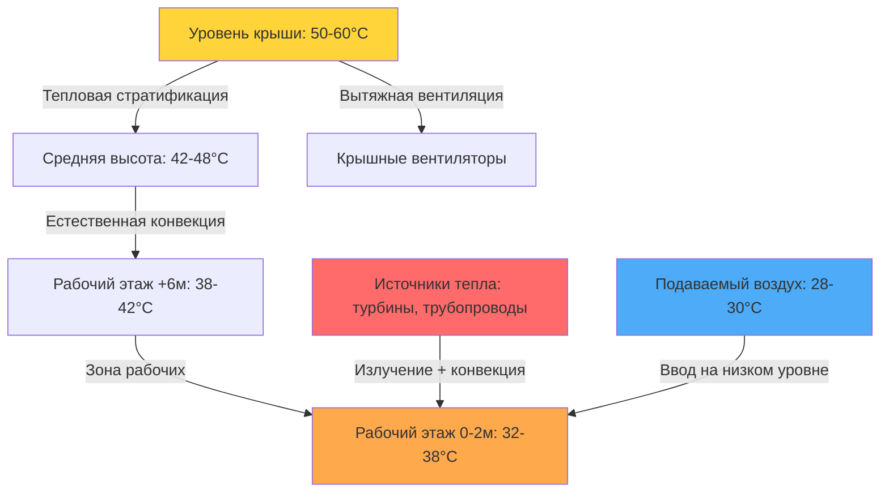
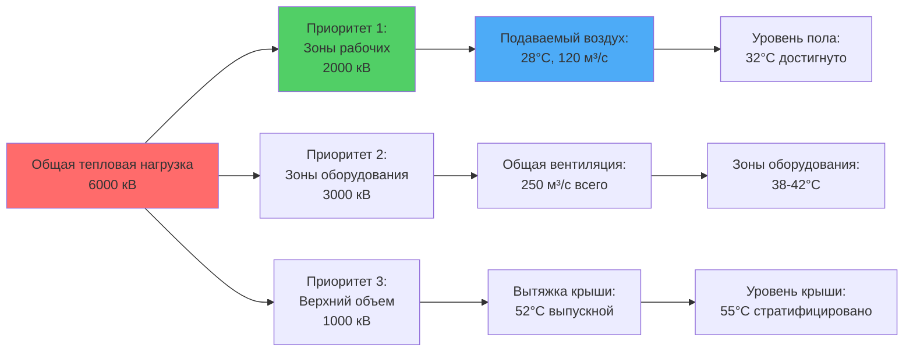

Машинные залы турбин представляют одно из самых сложных приложений промышленной вентиляции из-за экстремальных тепловых нагрузок от высокотемпературного оборудования, огромного объема зданий и двойного требования поддержания надежности оборудования при обеспечении приемлемого комфорта рабочих. Тепловые нагрузки варьируются от 200 до 500 Вт/м² площади пола, при этом отдельные турбогенераторные агрегаты излучают 1-3% своей номинальной мощности в виде тепла в окружающее пространство.

## Характеристика тепловой нагрузки

Основные источники тепла в машинных залах — корпуса турбин, паровые трубопроводы, подогреватели питательной воды, генераторы и вспомогательное оборудование. Передача тепла от этих источников происходит тремя механизмами: излучением, конвекцией и теплопроводностью.

### Излучение тепла корпусом турбины и паровыми трубопроводами

Для изолированных корпусов турбин и высокопроизводительных паровых трубопроводов, работающих при 540-565°C, температура поверхности после изоляции обычно составляет 50-60°C. Потеря тепла на единицу площади следует:

$$q'' = \varepsilon \sigma (T_s^4 - T_\infty^4) + h_c(T_s - T_\infty)$$

Где:
- $q''$ = тепловой поток (Вт/м²)
- $\varepsilon$ = коэффициент излучательности поверхности (0,85-0,95 для окисленного металла или изоляции)
- $\sigma$ = постоянная Стефана-Больцмана (5,67×10⁻⁸ Вт/м²·K⁴)
- $T_s$ = температура поверхности (K)
- $T_\infty$ = температура окружающего воздуха (K)
- $h_c$ = коэффициент конвективной теплопередачи (5-10 Вт/м²·K для естественной конвекции)

Для типичной изолированной поверхности при 55°C в среде с температурой 35°C:

$$q'' = 0,9 \times 5,67 \times 10^{-8}(328^4 - 308^4) + 7,5(55-35) = 120 + 150 = 270 \text{ Вт/м}^2$$

Крупные турбогенераторные агрегаты могут иметь 500-800 м² открытой площади поверхности, что дает общие тепловые нагрузки 135-215 кВт на единицу.

## Расчеты необходимого вентиляционного расхода

Требуемый вентиляционный расход для удаления тепла следует фундаментальному уравнению явного тепла:

$$\dot{Q}_s = \dot{m} c_p \Delta T = \rho \dot{V} c_p (T_{exhaust} - T_{supply})$$

Решение для объемного расхода:

$$\dot{V} = \frac{\dot{Q}_s}{\rho c_p (T_{exhaust} - T_{supply})}$$

Для стандартных свойств воздуха ($\rho$ = 1,2 кг/м³, $c_p$ = 1005 Дж/кг·K) и упрощенная форма:

$$\dot{V} \text{ (м}^3\text{/с)} = \frac{\dot{Q}_s \text{ (кВ)}}{1,2 \times (T_{exhaust} - T_{supply})}$$

**Критические параметры проектирования:**

| Параметр | Типичный диапазон | Соображение при проектировании |
|----------|-------------------|-------------------------------|
| Общая тепловая нагрузка | 2-8 МВ | Варьируется в зависимости от мощности станции (100-1000 МВ) |
| Температура подаваемого воздуха | 25-30°C | Ограничена условиями наружного воздуха |
| Температура вытяжного воздуха | 45-55°C | Баланс между расходом воздуха и стратификацией |
| Кратность воздухообмена | 6-15 ACH | Выше для меньших залов, ниже для больших объемов |
| Повышение температуры | 15-25 K | Больший ΔT снижает расход воздуха, но усиливает стратификацию |

Для машинного зала с общей тепловой нагрузкой 6 МВ и повышением температуры 20 K:

$$\dot{V} = \frac{6000}{1,2 \times 20} = 250 \text{ м}^3\text{/с или } 900{,}000 \text{ м}^3\text{/ч}$$

## Тепловая стратификация и градиенты температуры

Машинные залы турбин проявляют сильную тепловую стратификацию из-за их высоты (20-40 м) и концентрированных источников тепла на этаже работы. Градиент температуры в естественно стратифицированных пространствах следует:

$$\frac{dT}{dz} = \frac{q'''}{k_{eff} \cdot A}$$

Где $k_{eff}$ представляет эффективную теплопроводность воздуха, включая конвективные эффекты. Измеренные градиенты варьируются от 1,5-3,0 K/м.

### Стратегии контроля стратификации

| Стратегия | Градиент температуры | Комфорт рабочих | Энергетическая эффективность |
|-----------|---------------------|-----------------|------------------------------|
| Только естественная вентиляция | 2,5-3,0 K/м | Плохой (38-40°C на полу) | Отличная |
| Подача на низком уровне + вытяжка на крыше | 1,5-2,0 K/м | Приемлемый (32-36°C на полу) | Очень хорошая |
| Вентиляторы дестратификации + вентиляция | 0,8-1,2 K/м | Хороший (30-34°C на полу) | Хорошая |
| Локальное охлаждение на рабочих местах | Переменная | Отличный (26-28°C локально) | Средняя |

## Зоны комфорта рабочих и зоны оборудования

Машинный зал должен быть разделен на отдельные тепловые зоны на основе режимов занятости и требований оборудования.

**Классификация зон:**

1. **Зоны постоянного пребывания** (диспетчерские, офисы): 22-26°C, 30-60% ОВ согласно ASHRAE Standard 55
2. **Зоны периодической работы** (проходы рабочего этажа): 28-32°C приемлемо для легкой работы согласно ISO 7243
3. **Зоны только оборудования** (основания турбин, кабельные галереи): 35-45°C приемлемо, без требований комфорта
4. **Критическое оборудование** (генераторы, электрические распределительные устройства): максимум 40-45°C согласно техническим характеристикам производителя

## Рассмотрение летних пиковых нагрузок

Летние условия создают максимальное напряжение на системы вентиляции машинного зала из-за повышенных температур наружного воздуха и увеличенного спроса на генерирование энергии.

**Коэффициенты усиления пиковой нагрузки:**

$$\dot{Q}_{summer} = \dot{Q}_{base} \times (1 + f_{generation} + f_{ambient} + f_{solar})$$

Где:
- $f_{generation}$ = 0,05-0,15 (повышенный выход во время пикового спроса)
- $f_{ambient}$ = 0,10-0,20 (сниженная передача тепла оборудованием при более высокой температуре окружающей среды)
- $f_{solar}$ = 0,05-0,10 (солнечное поступление через крышу и стены)

Общее увеличение летней нагрузки: 20-45% выше базовой конструкции.

**Подход при летнем проектировании:**

Доступное повышение температуры снижается с увеличением температуры наружного воздуха:

$$\Delta T_{available} = T_{max,allowable} - T_{outdoor}$$

Для температуры наружного воздуха 35°C при проектировании и максимальной температуры выпуска 50°C, $\Delta T_{available}$ = 15 K в сравнении с 20-25 K в умеренных условиях. Это требует:

$$\dot{V}_{summer} = \dot{V}_{design} \times \frac{\dot{Q}_{summer}}{\dot{Q}_{design}} \times \frac{\Delta T_{design}}{\Delta T_{summer}}$$

Это может увеличить требования по расходу воздуха на 60-80% во время летних пиковых условий, что требует систем вентиляторов переменной скорости или многоступенчатой вентиляционной емкости.

**Стратегии смягчения летних нагрузок:**

1. **Испарительное охлаждение** подаваемого воздуха: снижает температуру подачи на 5-8 K в сухом климате
2. **Использование тепловой массы**: ночная вентиляция удаляет накопленное тепло из бетонных конструкций
3. **Планирование нагрузок**: работы по техническому обслуживанию планируются на более холодные периоды
4. **Дополнительное локальное охлаждение**: портативные испарительные охладители для рабочих зон во время пиковых периодов

Физический анализ проектирования систем удаления тепла из машинных залов турбин требует тщательного анализа механизмов передачи тепла, вызванных плавучестью потоков и взаимодействия между механической вентиляцией и естественными режимами стратификации. Успешные конструкции приоритизируют безопасность рабочих через тепловой комфорт при одновременном обеспечении надежности оборудования в экстремальных летних условиях.
