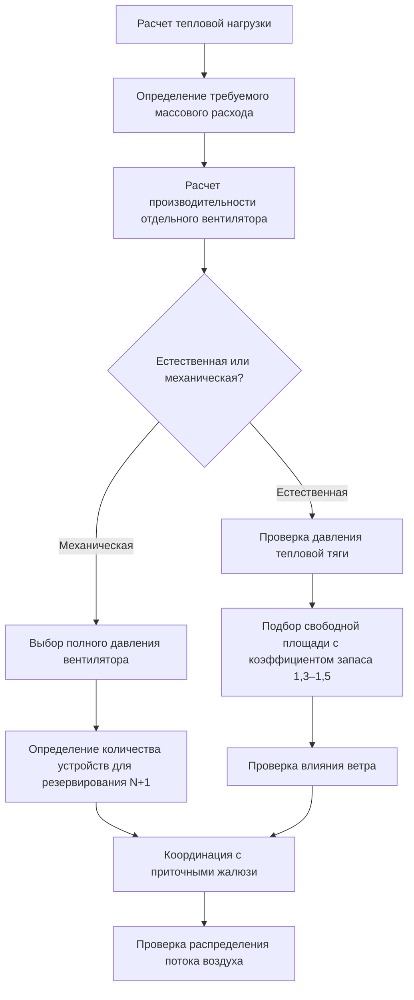

## Физика удаления тепла через кровельные устройства

Кровельные вентиляторы обеспечивают критические граничные условия в верхней части системы вентиляции машинного зала, удаляя значительные тепловые нагрузки, накапливающиеся на высоких отметках из-за температурной стратификации. Выбор между гравитационными (естественными) и механическими (принудительными) вентиляторами принципиально зависит от баланса между доступными силами плавучести и требуемыми объемными расходами воздуха.

## Основы тепловой тяги

Движущая сила для естественной вентиляции в высоких машинных залах турбин возникает из-за разницы плотности горячего внутреннего и более холодного наружного воздуха. Доступный перепад давления соответствует гидростатическому соотношению:

$$\Delta P = \rho_o g H - \rho_i g H = g H (\rho_o - \rho_i)$$

Где:
- $\Delta P$ = доступное статическое давление (Па)
- $g$ = ускорение свободного падения (9,81 м/с²)
- $H$ = вертикальное расстояние от приточного устройства до вытяжки (м)
- $\rho_o$ = плотность наружного воздуха (кг/м³)
- $\rho_i$ = плотность внутреннего воздуха на уровне вытяжки (кг/м³)

Выражая плотность как функцию температуры с использованием уравнения идеального газа ($\rho = P/(R T)$):

$$\Delta P = \frac{P g H}{R} \left(\frac{1}{T_o} - \frac{1}{T_i}\right)$$

Для типичных машинных залов с $H$ = 40–60 м и перепадом температур 10–20°C доступные давления составляют 40–120 Па, достаточного для преодоления сопротивления системы при надлежащем проектировании.

## Проектирование гравитационного кровельного вентилятора

Естественные вентиляторы работают без механического привода, полагаясь исключительно на силы плавучести. Ключевые факторы производительности включают:

**Аэродинамическая эффективность**
- Роторные вентиляторы с ветровым приводом: коэффициент расхода $C_d$ = 0,50–0,65
- Стационарные конструкции козырьков: $C_d$ = 0,40–0,55
- Открытые щипцовые вентиляторы: $C_d$ = 0,35–0,50

Достижимый расход через гравитационный вентилятор соответствует:

$$Q = C_d A \sqrt{\frac{2 \Delta P}{\rho}}$$

Где $A$ — свободная площадь отверстия вентилятора. Для машинного зала высотой 60 м с перепадом температур 15°C и вентиляторами с $C_d$ = 0,55 и общей площадью 50 м²:

$$\Delta P \approx 80 \text{ Па}, \quad Q = 0,55 \times 50 \times \sqrt{\frac{2 \times 80}{1,2}} \approx 3180 \text{ м}^3/\text{с}$$

### Влияние ветра на естественную вентиляцию

Ветер оказывает как благоприятное, так и неблагоприятное влияние на производительность гравитационного вентилятора:

| Условия ветра | Влияние на вентилятор | Вклад давления |
|---|---|---|
| Подветренная сторона (положительное давление) | Противодействует вытяжке, если на крыше | −0,5 до −0,8 × $\rho v^2/2$ |
| Наветренная сторона (отрицательное давление) | Способствует вытяжке | +0,3 до +0,6 × $\rho v^2/2$ |
| Ротация вентилятора, вызванная ветром | Повышает коэффициент расхода | +10% до +25% к базовому $C_d$ |

Коэффициент давления ветра: $P_{wind} = C_p \frac{\rho v^2}{2}$

Для надежного проектирования естественной вентиляции влияние подветренного давления должно быть учтено. Располагайте вентиляторы на наветренных участках кровли или на коньке, где преобладают разрежения.

## Системы механической вытяжки с крыши

Механические кровельные вентиляторы используют осевые или центробежные вентиляторы для достижения точного контроля вытяжного расхода, независимо от тепловых условий. Критические параметры проектирования:

**Критерии выбора вентилятора**
- Полное статическое давление: 100–250 Па (включая сопротивление системы)
- Объемный расход: рассчитан на 8–15 воздухообменов в час в верхней зоне
- Класс двигателя: TEFC, изоляция класса F минимум для высоких температур окружающего воздуха
- Материалы: устойчивые к коррозии для наружного применения

**Методика подбора**

Общая тепловая нагрузка, которая должна быть удалена:

$$Q_{total} = Q_{turbine} + Q_{generator} + Q_{solar} + Q_{lighting}$$

Требуемый массовый расход:

$$\dot{m} = \frac{Q_{total}}{c_p \Delta T_{allowable}}$$

Для машинного зала с тепловой нагрузкой 8 МВт и допустимым повышением температуры 12°C:

$$\dot{m} = \frac{8 \times 10^6}{1005 \times 12} = 663 \text{ кг/с} = 553 \text{ м}^3/\text{с}$$

Это требует нескольких вентиляционных устройств для резервирования и ступенчатого управления.

## Координация приточных жалюзи

Перепад давления через приточные жалюзи напрямую снижает доступную движущую силу для естественной вентиляции или увеличивает потребление энергии вентилятором. Принципы проектирования:

**Соотношение перепада давления**

$$\Delta P_{louver} = K \frac{\rho v^2}{2}$$

Где $K$ = коэффициент потерь (типично 1,5–3,0 для защитных жалюзи). Для поддержания эффективной естественной вентиляции:

$$\Delta P_{louver} < 0,3 \times \Delta P_{stack}$$

Это ограничение ограничивает скорость на входе до 2–3 м/с для естественных систем.

**Балансировка воздушного потока**

Приточная площадь должна быть равна или превышать вытяжную площадь с учетом относительных коэффициентов:

$$A_{intake} \geq A_{exhaust} \times \frac{C_{d,exhaust}}{C_{d,intake}} \times 1,15$$

Коэффициент 1,15 обеспечивает небольшое разрежение для предотвращения утечки воздуха через непредусмотренные отверстия.

## Сравнение: гравитационные и механические вентиляторы

| Параметр | Гравитационные вентиляторы | Механические вентиляторы |
|---|---|---|
| Потребление энергии | Нулевое | 15–30 кВт на единицу (типично) |
| Надежность | Отсутствуют механические отказы | Возможны отказы подшипников и двигателя |
| Контроль потока | Изменяется в зависимости от температуры | Точное управление с VFD |
| Начальная стоимость | 200–400 USD/м² горловины | 15 000–40 000 USD за единицу |
| Обслуживание | Минимальное (только проверка) | Требуется годовое обслуживание подшипников |
| Зимняя работа | Может требоваться использование демпферов | Легко модулируется |
| Ответ на изменения нагрузки | Медленный (тепловая инерция) | Быстрый (< 60 секунд) |

## Требования к резервированию для непрерывной работы

Объекты генерации электроэнергии требуют бесперебойной вентиляции для предотвращения повреждения оборудования из-за повышенных температур. NFPA 850 и технические условия производителей турбин обычно требуют:

**Стратегия проектирования резервирования**
- Минимум конфигурация N+1 для механических систем (все единицы на 60–70% мощности)
- N+2 для критических установок или экстремальных климатических условий
- Резервный источник питания для 100% вентиляционной мощности
- Резервные системы управления с автоматическим переключением

**Резервирование естественной вентиляции**

Гравитационные системы достигают врожденного резервирования через распределенную площадь — частичная блокировка отдельных устройств не исключает поток. Однако моторизованные заслонки (при использовании) требуют:
- Отказоустойчивые исполнительные механизмы с резервной батареей
- Ручное переключение
- Двойные источники питания для систем управления

## Гибридные системы

Современные машинные залы турбин все чаще используют гибридные подходы, объединяющие гравитационные вентиляторы для базовой нагрузки с механическими устройствами для пиковых условий:

**Логика работы**
1. Лето/высокая нагрузка: все механические устройства работают, гравитационные вентиляторы открыты
2. Умеренные условия: механические устройства модулируются, гравитационные обеспечивают частичный расход
3. Прохладная окружающая среда: только гравитационные с отключенными механическими устройствами, приточные заслонки модулируются

Этот подход минимизирует потребление энергии при сохранении надежности, обычно снижая годовую энергию вентилятора на 40–60% по сравнению с полностью механизированными системами.

## Проверка производительности

Стандарт ASHRAE 111 содержит протоколы тестирования для проверки производительности вентилятора. Ключевые измерения:

- Объемный расход: траверс трубкой Пито или сеткой анемометров на горловине
- Температурная стратификация: вертикальный профиль температуры в нескольких точках
- Статическое давление: дифференциальное давление между внутренним (на потолке) и наружным
- Балансировка приток-вытяжка: тестирование разбавления трассировочного газа

Критерии приемки: измеренный расход ≥ 90% проектного значения, максимальная температура на уровне оборудования в соответствии со спецификацией (типично 40–45°C).

## Литература

- ASHRAE Handbook—HVAC Applications, Chapter 28: Power Plants
- NFPA 850: Recommended Practice for Fire Protection for Electric Generating Plants
- AMCA Publication 500: Laboratory Methods of Testing Dampers for Rating
- ISO 5167: Measurement of Fluid Flow by Means of Pressure Differential Devices
