Коробление бумаги представляет один из наиболее стойких дефектов качества в типографских операциях, возникающий в результате дифференциальной влажности, вызывающей асимметричные изменения размеров через толщину бумаги. Коробление нарушает механизмы подачи, снижает точность совмещения и создает трудности при обработке. Понимание механики коробления на основе фундаментального гигроскопического поведения волокна целлюлозы позволяет разработать эффективные стратегии предотвращения на основе HVAC.

## Механика формирования коробления

Коробление бумаги происходит из-за дифференциального расширения или сжатия между поверхностями бумаги, создающего градиенты внутреннего напряжения, которые изгибают лист. Волокна целлюлозы проявляют выраженное гигроскопическое поведение — они поглощают влагу из воздуха с высокой влажностью и выделяют влагу в среду с низкой влажностью.

### Физика набухания волокна

Изменение размеров волокна целлюлозы следует предсказуемым зависимостям от содержания влаги. Когда волокна поглощают молекулы воды, водородные связи между цепями целлюлозы нарушаются и заменяются связями целлюлоза-вода. Это молекулярное внедрение вызывает расширение волокна, в основном в поперечном направлении (поперек волокна).

Набухание волокна подчиняется:

$$
\frac{\Delta L}{L_0} = \alpha \cdot \Delta MC
$$

Где:
- $\Delta L/L_0$ = дробное изменение размера
- $\alpha$ = коэффициент гигроскопического расширения (0,15–0,25 для поперечного направления, 0,015–0,025 для направления волокна)
- $\Delta MC$ = изменение содержания влаги (%)

Увеличение содержания влаги на 2% производит приблизительно 0,3–0,5% расширение в поперечном направлении, но только 0,03–0,05% расширение в направлении волокна — соотношение анизотропии 10:1.

### Градиенты влажности по толщине

Интенсивность коробления зависит от дифференциала содержания влаги между поверхностями бумаги. Когда одна поверхность подвергается воздействию более высокой относительной влажности, чем противоположная поверхность, влага диффундирует через толщину бумаги, следуя второму закону Фика:

$$
\frac{\partial C}{\partial t} = D \frac{\partial^2 C}{\partial z^2}
$$

Где:
- $C$ = концентрация влаги (г/м³)
- $t$ = время (с)
- $D$ = коэффициент диффузии влаги (м²/с)
- $z$ = положение по толщине (м)

Коэффициенты диффузии бумаги варьируются от 1×10⁻¹⁰ до 5×10⁻¹⁰ м²/с в зависимости от основного веса и покрытия. Лист толщиной 0,127 мм требует 20–60 минут для достижения равновесия влаги, в то время как лист толщиной 0,305 мм требует 120–240 минут.

### Расчет радиуса коробления

Радиус кривизны, полученный в результате дифференциала влажности, можно приблизительно оценить как:

$$
R = \frac{h}{6 \alpha \Delta MC_{diff}}
$$

Где:
- $R$ = радиус кривизны (мм)
- $h$ = толщина бумаги (мм)
- $\alpha$ = коэффициент гигроскопического расширения
- $\Delta MC_{diff}$ = дифференциал содержания влаги между поверхностями (%)

Лист толщиной 0,127 мм с 1% дифференциалом влажности между поверхностями производит радиус коробления приблизительно 30–50 мм — серьезное коробление, видимое как выраженное искривление листа.

```mermaid
graph TB
    subgraph "Процесс формирования коробления"
        A[Однородный лист бумаги<br/>Равновесное содержание влаги] --> B{Воздействие влажности<br/>Дифференциал}
        B --> C[Верхняя поверхность: Высокая ОВ<br/>Поглощение влаги]
        B --> D[Нижняя поверхность: Низкая ОВ<br/>Десорбция влаги]
        C --> E[Расширение верхней поверхности<br/>Набухание волокна]
        D --> F[Сжатие нижней поверхности<br/>Усадка волокна]
        E --> G[Развитие внутреннего напряжения<br/>Асимметричная деформация]
        F --> G
        G --> H[Изгиб листа<br/>Коробление в сторону сухой поверхности]
    end

    subgraph "Диффузия влаги по толщине"
        I[Поверхность 1: Высокая ОВ] -->|Поглощение| J[Градиент влаги<br/>По толщине бумаги]
        J -->|Диффузия| K[Поверхность 2: Низкая ОВ]
        J --> L[Зависящее от времени<br/>Уравнивание]
    end

    subgraph "Стратегия предотвращения коробления"
        M[Однородная среда<br/>±2% контроль ОВ] --> N[Исключить дифференциал<br/>ОВ поверхностей]
        N --> O[Однородное содержание влаги<br/>По толщине]
        O --> P[Нулевое коробление<br/>Плоскостность листа сохранена]
    end

    style H fill:#ff9999
    style P fill:#99ff99
```

## Классификация типов коробления

Различные условия окружающей среды и методы обработки материала создают различные картины коробления, каждая из которых требует специфических подходов к управлению.

### Сравнение типов коробления

| Тип коробления | Механизм | Временная шкала | Серьезность | Обратимость | Основной метод управления |
|---|---|---|---|---|---|
| **Коробление от влажности** | Разница ОВ поверхностей создает градиент расширения | 15–60 минут | Умеренная до тяжелой | Полностью обратимо | Однородная ОВ во всем помещении |
| **Коробление кромок** | Открытые кромки листа уравниваются быстрее, чем центр | 30–120 минут | Умеренная | Частично обратимо | Защита кромок, быстрое использование после распаковки |
| **Коробление с покрытием** | Покрытая поверхность имеет другой гигроскопический отклик | 20–90 минут | Легкая до умеренной | Частично обратимо | Двусторонняя влажностная обработка |
| **Коробление гистерезиса** | Различие траектории поглощения/десорбции | Часы до дней | Легкая | Необратимо | Предотвращение циклирования ОВ |
| **Производственное коробление** | Встроенное напряжение из производства | Постоянное | Легкая | Необратимо | Выбор бумаги, надлежащая кондиционирование |
| **Тепловое коробление** | Тепловой дифференциал вызывает миграцию влаги | 10–45 минут | Легкая до умеренной | Обратимо при охлаждении | Однородное распределение температуры |

### Коробление от влажности

Наиболее распространенный тип коробления в типографских операциях результирует из воздействия на поверхности бумаги различных условий относительной влажности. Это происходит когда:

- Верхняя часть стопки подвергается воздействию другой ОВ, чем нижняя (вертикальные градиенты влажности)
- Одна сторона находится в контакте с кондиционированным пространством, а другая — с некондиционированной зоной
- Печатный процесс добавляет влагу на одну поверхность (травильный раствор в литографии)
- Нагретые валики или сушилки создают тепловые дифференциалы

Бумага коробится в сторону более сухой поверхности, потому что более влажная поверхность расширяется больше, создавая выпуклую кривизну на стороне с высокой влажностью.

**Величина дифференциала влажности:**

$$
\Delta MC = k (RH_1 - RH_2)
$$

Где:
- $k$ = коэффициент чувствительности к влаге (обычно 0,10–0,15% MC на % ОВ)
- $RH_1, RH_2$ = относительная влажность на поверхностях 1 и 2 (%)

Разница 10% ОВ между поверхностями производит приблизительно 1,0–1,5% дифференциал содержания влаги, создавая заметное коробление в листах тоньше 0,254 мм.

### Коробление кромок

Кромки листа уравниваются с условиями окружающей среды намного быстрее, чем внутренние области, из-за более высокого отношения площади поверхности к объему. Когда бумага распаковывается, кромки поглощают или выделяют влагу в течение минут, в то время как центр листа требует часов для уравнивания.

Серьезность коробления кромок возрастает с:
- Более высоким отклонением ОВ окружающей среды от равновесной ОВ бумаги
- Более тонкой бумагой (быстрое уравнивание кромок)
- Более длительным временем воздействия между распаковкой и использованием
- Большей разницей между условиями хранения и использования

**Время уравнивания кромок:**

$$
t_{edge} \approx \frac{w^2}{4D}
$$

Где:
- $t_{edge}$ = время для достижения 63% уравнивания (с)
- $w$ = размер ширины кромки (м)
- $D$ = коэффициент диффузии влаги (м²/с)

Ширина кромки 25 мм уравнивается приблизительно за 20–40 минут, в то время как центр листа может требовать 4–8 часов.

### Коробление с покрытием

Мелованная бумага проявляет различный отклик на влагу между мелованной и немелованной сторонами. Глинистые или полимерные покрытия снижают скорость проникновения влаги и изменяют коэффициент гигроскопического расширения. Это создает асимметричный отклик даже при однородном воздействии окружающей среды.

Односторонняя мелованная бумага внутренне коробится в сторону покрытия при воздействии высокой влажности (покрытие ограничивает расширение волокна) и в сторону немелованной стороны при воздействии низкой влажности (покрытие предотвращает потерю влаги).

## Стратегии предотвращения коробления

Эффективный контроль коробления требует исключения дифференциалов влажности, которые вызывают формирование коробления. Проектирование систем HVAC и методы эксплуатации обеспечивают основной контроль.

### Однородность окружающей среды

Поддержание однородной относительной влажности во всех областях хранения, кондиционирования и печати бумаги исключает движущую силу коробления от влажности.

**Критические требования однородности:**

**Пространственная однородность:** максимальное изменение ОВ в пределах ±2% между любыми двумя местоположениями в зоне обработки бумаги. Это требует:
- Надлежащего перемешивания воздуха для исключения стратификации
- Нескольких точек увлажнения/осушения для больших помещений
- Исключения несиловой фильтрации воздуха с некондиционированным воздухом
- Температурной однородности для предотвращения вариации ОВ при постоянной абсолютной влажности

**Вертикальная однородность:** градиент ОВ от пола до потолка не должен превышать 3–5% ОВ. Естественная плавучесть создает теплый сухой воздух у потолка и прохладный влажный воздух у пола. Стопки бумаги подвергаются различным условиям ОВ на вершине и внизу, вызывая коробление даже в «кондиционированных» помещениях с плохим перемешиванием.

**Временная однородность:** вариация ОВ на протяжении циклов день/ночь должна оставаться в пределах ±3% ОВ. Стратегии сокращения электроэнергии в ночное время, которые экономят энергию путем допущения более широких колебаний температуры/ОВ, создают коробление в хранящейся бумаге, которое сохраняется при последующей печати.

### Протоколы обработки бумаги

Методы эксплуатации минимизируют воздействие дифференциала влажности:

**Минимизация времени без упаковки:** бумага должна оставаться упакованной до непосредственно перед использованием. Каждый час распакованного воздействия позволяет 2–5% изменению влажности кромок в типичных типографских условиях.

**Двусторонняя обработка:** когда требуется кондиционирование, убедитесь, что обе поверхности бумаги подвергаются воздействию идентичной ОВ. Это требует:
- Расстояния между стопками для циркуляции воздуха (минимум 0,3 м)
- Периодического поворота стопок для уравнивания воздействия
- Избежания размещения у стен или других барьеров, предотвращающих поток воздуха

**Быстрый переход от печатного станка к использованию:** минимизируйте время между кондиционированием бумаги и подачей на печатный станок. Каждый час задержки позволяет 0,1–0,3% изменению содержания влаги, если условия окружающей среды отличаются.

**Частичное покрытие поддона:** когда частичные поддоны остаются в течение ночи, накройте открытые листы полиэтиленовой пленкой для предотвращения обмена влагой с поверхностью. Открытые листы разрабатывают 0,5–1,5% дифференциал влажности поверхности в течение 8–12 часов.

### Контроль влажности на стороне печатного станка

Поддержание стабильных условий в помещении печатного станка предотвращает развитие коробления при печати:

**Целевые условия:** 50% ОВ ±3%, 22°C ±1°C представляют промышленный стандарт. Это обеспечивает:
- Стабильные размеры бумаги при многопроходной печати
- Приемлемые характеристики сушки чернил
- Комфортные условия для операторов
- Разумное потребление энергии при увлажнении

**Локальный контроль влажности:** большие помещения печатного станка выигрывают от зонального управления, позволяющего ±2% ОВ рядом с активными печатными станками при сохранении ±5% ОВ в зонах хранения. Это фокусирует более жесткий контроль там, где коробление имеет непосредственное влияние.

**Управление травильным раствором:** литографическая печать наносит водный травильный раствор на поверхность бумаги, создавая дифференциал влажности. Контроль требует:
- Минимального нанесения травильного раствора, соответствующего качеству печати
- Быстрой сушки между цветными станциями
- Контроля температуры травильного раствора (10–16°C)
- Регулировки ОВ для компенсации добавления влаги

### Выбор материалов

Чувствительность коробления существенно варьируется между типами бумаги:

**Мелованная и немелованная:** мелованная бумага проявляет 30–50% меньше коробления, чем немелованные сорта, из-за ограничения покрытием набухания волокна. Указывайте мелованную бумагу для применений, чувствительных к коробству.

**Ориентация волокна:** бумага, изготовленная со случайной ориентацией волокна (низкая выраженность волокна), показывает более однородный отклик размера и сниженную склонность к коробству в сравнении с высоко ориентированными листами.

**Основной вес:** более тяжелая бумага (более высокая толщина) развивает меньше коробления для эквивалентного дифференциала влажности, потому что толщина $h$ появляется в знаменателе уравнения радиуса коробления. Радиус коробления увеличивается пропорционально толщине.

**Влагостойкость:** бумага, изготовленная с обработками размера, которые снижают поглощение влаги, показывает низкую чувствительность коробления. Коэффициент гигроскопического расширения уменьшается на 20–40% при надлежащей внутренней размерной обработке.

## Требования плоскостности листа

Различные процессы печати и применения конечного использования накладывают различные допуски плоскостности, которые определяют приемлемые пределы коробления.

### Измерение плоскостности

Количественное определение плоскостности листа использует измерение высоты коробления:

**Высота коробления:** поместите лист на ровную поверхность и измерьте максимальное вертикальное отклонение от плоскости на углах или кромках листа. Приемлемая высота коробления зависит от применения:

| Применение | Максимальная высота коробления | Эквивалентный радиус коробления | Требуемый контроль ОВ |
|---|---|---|---|
| Подача листовой офсетной печати | 6 мм | >500 мм | ±5% ОВ |
| Высокачественная коммерческая печать | 3 мм | >1000 мм | ±3% ОВ |
| Подача лазерного принтера | 2,5 мм | >1200 мм | ±3% ОВ |
| Фотографическая печать | 1,5 мм | >2000 мм | ±2% ОВ |
| Ламинирование упаковки | 2 мм | >1500 мм | ±3% ОВ |

**Классификация серьезности коробления:**

- **Легкое коробление:** высота коробления <3 мм. Приемлемо для большинства коммерческой печати. Развивается из 0,3–0,5% дифференциала влажности.
- **Умеренное коробление:** высота коробления 3–6 мм. Вызывает затруднения подачи. Результирует из 0,5–1,0% дифференциала влажности.
- **Серьезное коробление:** высота коробления >6 мм. Предотвращает автоматическую подачу. Требует >1,0% дифференциала влажности.

### Восстановление плоскостности

Обратимость коробления зависит от механизма:

**Коробление от влажности:** полностью обратимо. Воздействие на скорченные листы однородных условий позволяет перераспределение влаги и релаксацию напряжения. Время восстановления равно 2–3 раза времени развития коробления.

**Коробление гистерезиса:** частично обратимо. Бумага проявляет различный отклик размера во время поглощения влаги в сравнении с десорбцией из-за изменений микроструктуры целлюлозы. Остаточное коробление 20–40% первоначальной величины сохраняется после циклирования влажности.

**Механическое выравнивание:** прессование скорченных листов плоскими при равновесной влажности может снизить коробление на 50–70%, но остаточное напряжение остается, если не достигнута влажностная однородность.

## Проектирование системы HVAC для предотвращения коробления

Конфигурация системы HVAC непосредственно воздействует на способность управления коробством через однородность распределения влажности и скорость реагирования.

### Проектирование распределения воздуха

Однородная доставка влажности требует тщательного распределения воздуха:

**Эффективность перемешивания:** рассчитайте эффективность воздухообмена (ACE) для проверки перемешивания:

$$
ACE = \frac{C_{supply} - C_{exhaust}}{C_{supply} - C_{occupied}}
$$

Где:
- $C$ представляет отношение влажности в указанном местоположении
- Целевое ACE >0,9 для отличного перемешивания
- ACE <0,7 указывает на плохое перемешивание с риском стратификации

**Выбор диффузора:** низкоскоростные потолочные диффузоры с высокими коэффициентами индукции обеспечивают превосходное перемешивание. Целевая скорость выброса <150 м/мин с дальностью, достигающей 75% расстояния до противоположной стены или ближайшего препятствия.

**Размещение возвратного воздуха:** позиционируйте возвраты для создания циркуляционных картин, которые охватывают все пространство. Избегайте коротких путей между подачей и возвратом, которые оставляют мертвые зоны.

### Интеграция системы увлажнения

Метод доставки увлажнения влияет на однородность:

**Распределенное увлажнение:** несколько точек увлажнения во всем пространстве обеспечивают более быстрый отклик и лучшую однородность, чем единичный центральный увлажнитель. Используйте один увлажнитель на 460–925 м² площади пола.

**Увлажнение в канале против увлажнения в помещении:** увлажнение в канале (в воздухообработчике или приточном воздуховоде) обеспечивает лучшее распределение, но более медленный отклик. Увлажнение в помещении предлагает быстрый локальный контроль, но риск неоднородного распределения.

**Требование расстояния всасывания:** водяной пар от увлажнителей требует 3–4,5 м расстояния потока воздуха для полного испарения и перемешивания с воздушным потоком. Более короткие расстояния рискуют конденсацией и локальным чрезмерным увлажнением.

### Стратегия управления

Точность управления влажностью определяет эффективность предотвращения коробления:

**Размещение датчика:** установите датчики влажности в репрезентативных местоположениях, избегая:
- Прямого солнечного воздействия, создающего ошибку измерения
- Рядом с увлажнителями, где локальная влажность превышает среднее значение помещения
- Мертвых зон с плохой циркуляцией воздуха

**Алгоритм управления:** пропорционально-интегрально-производное (PID) управление обеспечивает превосходную производительность по сравнению с простым включением-выключением. Надлежащо настроенное PID поддерживает ±2% ОВ при изменениях нагрузки.

**Контроль точки росы против контроля ОВ:** контроль точки росы измеряет абсолютное содержание влаги независимо от колебаний температуры. Это предотвращает колебания ОВ при колебаниях температуры ±1–2°C во время нормальной эксплуатации.

### Мониторинг и проверка

Проверьте производительность системы HVAC посредством комплексного мониторинга:

**Развертывание датчиков в нескольких местах:** установите датчики на несколько высот и местоположений для картирования распределения влажности. Минимум один датчик на 2800 м² площади пола плюс вертикальный массив для обнаружения стратификации.

**Регистрация данных:** непрерывная запись температуры и влажности с интервалами 5–15 минут выявляет картины, невидимые при мгновенных показаниях. Определите ежедневные циклы, проблемы восстановления при сокращении, и отказы оборудования.

**Проверка содержания влаги в бумаге:** прямое измерение содержания влаги в бумаге с использованием откалиброванных влагомеров обеспечивает подтверждение истинности, что управление HVAC достигает предполагаемого кондиционирования бумаги.

## Устранение проблем коробления

Систематическая диагностика определяет коренные причины коробления:

**Шаг 1: Проверьте однородность окружающей среды**
- Измерьте ОВ в нескольких местоположениях и высотах
- Определите градиенты, превышающие ±3% ОВ
- Проверьте источники инфильтрации (загрузочные двери, смежные некондиционированные пространства)

**Шаг 2: Оцените временную стабильность**
- Просмотрите зарегистрированные данные за вариации ОВ в течение предыдущих 48–72 часов
- Определите периоды сокращения или циклирование оборудования
- Оцените влияние условий на улице

**Шаг 3: Изучите обработку бумаги**
- Определите время между распаковкой и использованием
- Проверьте адекватность времени кондиционирования
- Проверьте условия зоны хранения по сравнению с условиями помещения печатного станка

**Шаг 4: Измерьте содержание влаги в бумаге**
- Измерьте содержание влаги в скорченных листах
- Сравните с целевым равновесным содержанием влаги
- Определите дифференциалы поверхность-поверхность или кромка-центр

**Шаг 5: Оцените свойства материала**
- Просмотрите спецификации бумаги на устойчивость к коробству
- Рассмотрите эффекты ориентации волокна
- Оцените влияние покрытия

Этот систематический подход изолирует контролируемые факторы окружающей среды от ограничений материала или процесса, позволяя целенаправленные корректирующие действия.

Контроль коробления посредством точного управления влажностью представляет существенную производительность системы HVAC в типографских операциях. Понимание механики деформации волокна, движимой влагой, и внедрение однородного управления окружающей средой исключает коробление как источник дефекта качества при поддержке постоянной совмещения печати и эффективности обработки.
