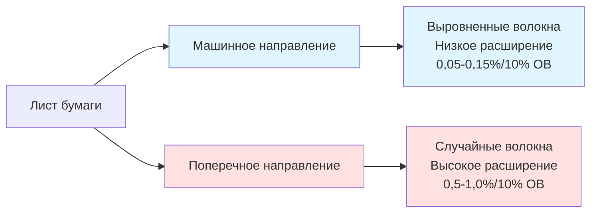
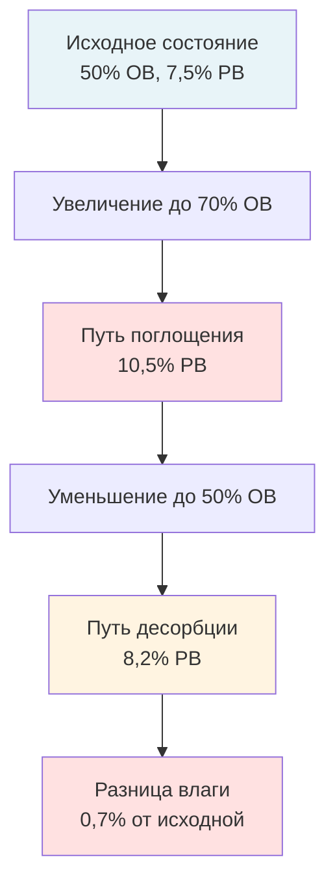

Стабильность размеров бумаги представляет собой основное требование для точности совмещения многокрасочной печати. Гигроскопичность целлюлозных волокон вызывает предсказуемые изменения размеров при колебаниях влажности окружающей среды, что прямо влияет на качество печати в приложениях с высокой точностью. Понимание физики влажность-размер позволяет правильно спроектировать систему контроля окружающей среды для поддержания жестких допусков, необходимых для современных печатных процессов.

## Гигроскопическое поведение бумаги

Бумага состоит из целлюлозных волокон, которые проявляют гигроскопическое поведение—способность поглощать или выделять влагу в ответ на изменения влажности окружающего воздуха. Этот молекулярный обмен влагой приводит к макроскопическим изменениям размеров.

### Молекулярные механизмы

Поглощение влаги целлюлозными волокнами происходит посредством трёх механизмов:

**Мономолекулярная адсорбция:** Молекулы воды образуют водородные связи с гидроксильными группами на поверхности целлюлозы при низкой ОВ (<20%). Способствует содержанию влаги 2-3% с минимальным изменением размеров.

**Многомолекулярная адсорбция:** Дополнительные слои воды накапливаются на исходном мономолекулярном слое при умеренной ОВ (20-60%). Диаметр волокна увеличивается, так как молекулы воды разделяют цепи целлюлозы. Производит содержание влаги 4-8% с заметным изменением размеров.

**Капиллярная конденсация:** Вода заполняет микроскопические пустоты между волокнами при высокой ОВ (>60%). Генерирует содержание влаги 8-12% с максимальным набуханием.

Изотерма сорбции описывает это соотношение:

$$EMC = A + B \cdot \ln(1 - ОВ/100)$$

Где:
- $EMC$ = равновесная влажность (%)
- $A, B$ = эмпирические константы для типа бумаги
- $ОВ$ = относительная влажность (%)

Типичная мелованная офсетная бумага: $A = 18,2$, $B = -4,8$

### Эффекты ориентации волокон

Производство бумаги создаёт предпочтительное выравнивание волокон в машинном направлении (МД), производя анизотропное поведение размеров. Поперечное машинное направление (ПМД) содержит более случайно ориентированные волокна, которые более резко реагируют на изменения влажности.

Соотношение расширения между ПМД и МД обычно варьируется от 6:1 до 10:1 в зависимости от формирования бумаги и календирования.

## Коэффициент гигрорасширения

Коэффициент гигрорасширения количественно определяет изменение размеров на единицу изменения ОВ, аналогично коэффициентам теплового расширения.

### Определение и измерение

Коэффициент гигрорасширения $\alpha_H$ связывает изменение размеров с изменением влажности:

$$\frac{\Delta L}{L_0} = \alpha_H \cdot \Delta ОВ$$

Где:
- $\Delta L$ = изменение размеров (см)
- $L_0$ = исходный размер (см)
- $\alpha_H$ = коэффициент гигрорасширения (%/% ОВ)
- $\Delta ОВ$ = изменение относительной влажности (%)

Стандартное измерение следует TAPPI T 464 при контролируемой температуре (23°C ± 1°C).

### Типичные значения коэффициентов

Коэффициенты гигрорасширения значительно варьируются в зависимости от сорта бумаги и ориентации волокон:

| Сорт бумаги | Поперечное направление $\alpha_{H,ПМД}$ | Машинное направление $\alpha_{H,МД}$ | Соотношение ПМД/МД |
|-------------|--------------------------------|----------------------------------|-------------|
| Мелованная офсетная | 0,08-0,12 %/% ОВ | 0,010-0,015 %/% ОВ | 8:1 |
| Немелованная офсетная | 0,10-0,15 %/% ОВ | 0,012-0,020 %/% ОВ | 7,5:1 |
| Газетная бумага | 0,12-0,18 %/% ОВ | 0,015-0,025 %/% ОВ | 7:1 |
| Мелованная этикеточная | 0,06-0,09 %/% ОВ | 0,008-0,012 %/% ОВ | 8,5:1 |
| Картон | 0,15-0,25 %/% ОВ | 0,020-0,035 %/% ОВ | 7:1 |

Большая масса покрытия снижает гигрорасширение, ограничивая проникновение влаги в структуру бумаги.

### Зависимость от температуры

Коэффициенты гигрорасширения увеличиваются с температурой из-за повышенной молекулярной подвижности:

$$\alpha_H(T) = \alpha_{H,реф} \cdot [1 + \beta(T - T_{реф})]$$

Где:
- $\alpha_{H,реф}$ = коэффициент при эталонной температуре
- $\beta$ = коэффициент температурной коррекции (обычно 0,015-0,025 /°C)
- $T$ = рабочая температура (°C)
- $T_{реф}$ = эталонная температура (23°C)

Повышение температуры на 5°C повышает коэффициент гигрорасширения примерно на 15-25%, компенсируя влажность-индуцированные изменения размеров.

## Расчёты изменения размеров

Точный прогноз изменения размеров позволяет анализировать допуски для печатных процессов с жёстким совмещением.

### Одноосное расширение

Для листа бумаги с размером $L_0$, подверженного изменению ОВ $\Delta ОВ$:

$$L_{итог} = L_0 \cdot (1 + \alpha_H \cdot \Delta ОВ)$$

$$\Delta L = L_0 \cdot \alpha_H \cdot \Delta ОВ$$

**Пример расчёта:**
- Ширина листа (ПМД): $L_0 = 610$ мм
- Изменение ОВ: $\Delta ОВ = 15\%$ (от 50% до 65% ОВ)
- Коэффициент гигрорасширения: $\alpha_{H,ПМД} = 0,10\%/\%$ ОВ

$$\Delta L = 610 \times 0,001 \times 15 = 9,15 \text{ мм}$$

Это расширение на 9,15 мм намного превышает типичные допуски совмещения ±0,13-±0,25 мм.

### Двунаправленный анализ

Полный анализ размеров требует компонентов как ПМД, так и МД:

$$\Delta L_{ПМД} = L_{ПМД,0} \cdot \alpha_{H,ПМД} \cdot \Delta ОВ$$

$$\Delta L_{МД} = L_{МД,0} \cdot \alpha_{H,МД} \cdot \Delta ОВ$$

Изменение диагонального размера для прямоугольных листов:

$$\Delta L_{диаг} = \sqrt{(\Delta L_{ПМД})^2 + (\Delta L_{МД})^2}$$

### Зависящее от времени выравнивание влажности

Изменение размеров следует кинетике диффузии влаги. Второй закон Фика описывает перенос влаги через толщину бумаги:

$$\frac{\partial M}{\partial t} = D \frac{\partial^2 M}{\partial x^2}$$

Где:
- $M$ = локальное содержание влаги
- $D$ = коэффициент диффузии влаги (обычно $1 \times 10^{-6}$ до $5 \times 10^{-6}$ м²/ч для бумаги)
- $x$ = координата толщины
- $t$ = время

Характерное время выравнивания:

$$\tau = \frac{h^2}{4D}$$

Где $h$ = толщина бумаги (м)

Для мелованной бумаги толщиной 0,1 мм (0,0001 м) с $D = 2 \times 10^{-6}$ м²/ч:

$$\tau = \frac{(0,0001)^2}{4 \times 2 \times 10^{-6}} = 0,0125 \text{ часов} = 45 \text{ секунд}$$

Поверхностные слои выравниваются в течение минут, но полное выравнивание через всю толщину требует часов, создавая временные градиенты влажности, которые вызывают коробление.

## Соотношение содержания влаги и ОВ

Равновесная влажность бумаги (РВ) следует сигмовидному соотношению с относительной влажностью, описываемому сорбционными изотермами.

### Модели сорбционных изотерм

Модель Guggenheim-Anderson-de Boer (GAB) обеспечивает точное прогнозирование РВ:

$$РВ = \frac{M_0 \cdot C \cdot K \cdot (ОВ/100)}{[1 - K \cdot (ОВ/100)][1 + (C-1) \cdot K \cdot (ОВ/100)]}$$

Где:
- $M_0$ = содержание влаги в мономолекулярном слое (обычно 4-6%)
- $C$ = константа энергии сорбции (5-15)
- $K$ = константа многослойности (0,7-0,95)

Упрощённое линейное приближение для рабочего диапазона (30-70% ОВ):

$$РВ \approx 0,10 \cdot ОВ + 2,5$$

### Практические значения РВ

Равновесная влажность для типичных печатных бумаг:

| Относительная влажность | РВ (Мелованная бумага) | РВ (Немелованная бумага) | Состояние размеров |
|-------------------|-------------------|---------------------|-------------------|
| 20% ОВ | 4,0% | 4,8% | Сжата |
| 30% ОВ | 5,5% | 6,2% | Слегка сжата |
| 40% ОВ | 6,5% | 7,4% | Номинальная |
| 50% ОВ | 7,5% | 8,5% | Эталонная |
| 60% ОВ | 9,0% | 10,0% | Слегка расширена |
| 70% ОВ | 10,5% | 11,8% | Расширена |
| 80% ОВ | 12,5% | 14,0% | Сильно расширена |

Стандартные условия эталона (23°C, 50% ОВ) устанавливают базовые размеры для целей спецификации согласно ANSI/NPES HR 3.1.

### Эффекты гистерезиса

Бумага проявляет гистерезис сорбции—различное содержание влаги при поглощении в сравнении с десорбцией при идентичной ОВ. Это происходит из-за структурной перестройки цепей целлюлозы при циклировании влажности.

Величина гистерезиса варьируется от 0,5-1,5% содержания влаги, производя остаточное изменение размеров 0,05-0,15%. Этот эффект требует стабильных условий окружающей среды вместо циклических изменений.

## Требования к жёстким допускам

Современные многокрасочные печатные процессы требуют точности совмещения, которая требует соответственно жёсткого контроля окружающей среды.

### Бюджет ошибок совмещения

Полная ошибка совмещения вытекает из нескольких источников:

$$\epsilon_{итог} = \sqrt{\epsilon_{бумага}^2 + \epsilon_{пресс}^2 + \epsilon_{совмещ}^2 + \epsilon_{натяж}^2}$$

Где:
- $\epsilon_{бумага}$ = вариация размеров бумаги
- $\epsilon_{пресс}$ = допуск механики пресса
- $\epsilon_{совмещ}$ = ошибка совмещения пластина/вал
- $\epsilon_{натяж}$ = эффекты натяжения ленты/листа

Вариация размеров бумаги обычно составляет 40-60% общего бюджета ошибок совмещения.

### Допуски для конкретных процессов

Различные печатные процессы требуют специфической стабильности размеров:

| Печатный процесс | Допуск совмещения | Допустимое изменение бумаги | Требуемый контроль ОВ |
|------------------|----------------------|----------------------|---------------------|
| Точная офсетная печать листов | ±0,13 мм | <0,020% | ±2% ОВ |
| Коммерческая офсетная печать листов | ±0,25 мм | <0,040% | ±3% ОВ |
| Heatset веб-офсет | ±0,38 мм | <0,060% | ±5% ОВ |
| Издательская глубокая печать | ±0,20 мм | <0,035% | ±3% ОВ |
| Упаковочная флексография | ±0,51 мм | <0,080% | ±5% ОВ |
| Защитная печать | ±0,08 мм | <0,012% | ±1% ОВ |

### Расчёт допуска ОВ из требований совмещения

Для заданного допуска совмещения $\epsilon_{доп}$ и размера листа $L$:

$$\alpha_H \cdot \Delta ОВ_{макс} \leq \frac{\epsilon_{доп}}{L}$$

$$\Delta ОВ_{макс} \leq \frac{\epsilon_{доп}}{L \cdot \alpha_H}$$

**Пример для точной печати шириной 610 мм:**
- Допуск совмещения: $\epsilon_{доп} = ±0,13$ мм
- Ширина листа: $L = 610$ мм
- Коэффициент гигрорасширения: $\alpha_H = 0,10\%/\%$ ОВ = 0,001/% ОВ

$$\Delta ОВ_{макс} \leq \frac{0,13}{610 \times 0,001} = 2,1\% \text{ ОВ}$$

Этот анализ показывает требование контроля ±2% ОВ только для стабильности размеров, уменьшаясь до ±1,5% ОВ при комбинировании с другими источниками ошибок.

## Стратегии кондиционирования окружающей среды

Поддержание стабильности размеров требует комплексного контроля окружающей среды по всей цепочке обработки бумаги.

### Предпечатное кондиционирование

Бумага требует кондиционирования в течение 24-72 часов для достижения влажностного равновесия с условиями печатного цеха:

**Протокол кондиционирования от склада к прессу:**
1. Проверить условия доставки бумаги (обычно 35-45% ОВ зимой, 60-70% ОВ летом)
2. Рассчитать требуемое время кондиционирования: $t = 2\tau \cdot \ln(10)$ для 90% выравнивания
3. Открыть края бумаги путём удаления внешней упаковки за 24+ часа до использования
4. Поддерживать пространство кондиционирования при параметре печатного цеха ±1°C, ±2% ОВ
5. Мониторить влажность бумаги портативным измерителем (целевое ±0,5% от РВ печатного цеха)

**Время кондиционирования по толщине бумаги:**
- Бумага 0,08 мм: минимум 24 часа
- Бумага 0,10-0,15 мм: 36-48 часов
- Картон 0,18-0,25 мм: 48-72 часа
- Картон >0,25 мм: 72+ часа

### Контроль в печатном цехе

Рабочая стабильность размеров требует непрерывного обслуживания окружающей среды:

**Установочные точки для точной печати:**
- Температура: 22-23°C ±0,8°C
- Относительная влажность: 50% ±2% ОВ
- Точка росы: 11-13°C ±0,8°C (предпочтительный метод контроля)
- Скорость воздуха в местах хранения бумаги: <0,25 м/с

**Требования к пространственной однородности:**
- Горизонтальная вариация ОВ: <3% ОВ по полу цеха
- Вертикальный градиент ОВ: <2% ОВ с пола до высоты 3 м
- Температурная стратификация: <1°C от пола до потолка

### Мониторинг в реальном времени

Непрерывный мониторинг позволяет активный контроль размеров:

**Размещение датчиков:**
- 1 датчик температуры/влажности на 280-465 м² площади цеха
- Дополнительные датчики в местах хранения бумаги
- Эталонный датчик в комнате кондиционирования
- Наружный датчик для компенсации системой

**Параметры мониторинга:**
- Логирование данных с интервалом 5-15 минут
- Оповещение при отклонении ±2% ОВ от установочной точки
- Отслеживание максимального суточного размаха ОВ (<5% для точной работы)
- Расчёт точки росы для абсолютного отслеживания влаги

**Корректирующие действия:**
- ОВ ниже установочной точки: Увеличить выход увлажнения
- ОВ выше установочной точки: Увеличить охлаждение/осушение или снизить увлажнение
- Чрезмерный размах ОВ: Проверить производительность и настройку системы HVAC
- Пространственная неоднородность: Оценить распределение воздуха и отрегулировать диффузоры

## Проверка стабильности размеров

Периодическая проверка подтверждает эффективность контроля окружающей среды в поддержании стабильности размеров.

### Тестирование размеров бумаги

Прямое измерение ответа размеров бумаги:

**Протокол тестирования:**
1. Кондиционировать тестовые листы при 50% ОВ, 23°C в течение 24 часов
2. Отметить точные точки измерения с помощью регистрационных меток
3. Измерить размеры координатной измерительной системой (точность ±0,03 мм)
4. Подвергнуть циклированию ОВ процесса (±10% ОВ)
5. Переизмерить размеры при выравнивании
6. Рассчитать коэффициент гигрорасширения из данных

**Критерии приёма:**
- Измеренный $\alpha_H$ в пределах ±15% значения спецификации
- Соотношение расширения ПМД/МД в ожидаемом диапазоне (6:1 до 10:1)
- Максимальное изменение размеров <50% допуска совмещения

### Проверка производительности окружающей среды

Проверка системы HVAC по поддержанию стабильности размеров:

**Тесты проверки:**
- 7-дневное непрерывное логирование ОВ во время производства
- Максимальное отклонение от установочной точки: <±2% ОВ для точной работы
- Максимальный суточный размах ОВ: <5% ОВ
- Время восстановления после сбоя: <2 часов до ±1% ОВ
- Пространственная съёмка: вариация ОВ <3% ОВ по площади цеха

**Сезонная проверка:**
- Зимнее тестирование при пиковой нагрузке отопления (январь-февраль)
- Летнее тестирование при пиковой нагрузке охлаждения (июль-август)
- Выборочные проверки переходных сезонов (апрель, октябрь)

Проверка стабильности размеров обеспечивает количественное подтверждение адекватности контроля окружающей среды для требований качества печати.

## Справочные материалы и стандарты

Отраслевые стандарты, устанавливающие требования к стабильности размеров:

**ANSI/NPES HR 3.1-2010:** Стандартные условия печати—23°C ±1°C, 50% ОВ ±5% ОВ для размерного эталона.

**ISO 12634-1:** Графические технологии—Определение стабильности размеров печатных бумаг и картонов в различных условиях кондиционирования и испытания.

**TAPPI T 402:** Стандартные условия кондиционирования и испытания для бумаги, картона и гофрированного картона—23°C ±1°C (73,4°F), 50% ±2% ОВ.

**TAPPI T 464:** Коэффициент влажностного расширения бумаги и картона—методика испытания для измерения гигрорасширения.

**GRACoL (General Requirements for Applications in Commercial Offset Lithography):** Спецификации, включающие контроль окружающей среды для стабильности размеров в коммерческой печати.

Эти стандарты обеспечивают унифицированные критерии стабильности размеров по всем печатным операциям, позволяющие достичь согласованное качество посредством надлежащего проектирования и эксплуатации систем контроля окружающей среды.
