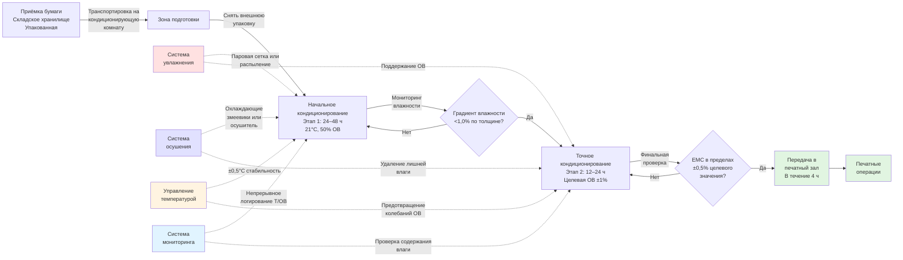

Кондиционирование бумаги устанавливает влаговое равновесие между бумажным материалом и печатной средой перед началом печати. Этот процесс устраняет изменения размеров во время печати, которые нарушают точность приводки, предотвращает образование волнистости и обеспечивает стабильный перенос краски. Надлежащее кондиционирование требует поддержания контролируемых температуры и влажности в течение достаточного времени для достижения равномерного распределения влаги по толщине бумаги.

## Физика влагового равновесия

Бумага достигает равновесного содержания влаги, когда парциальное давление пара на поверхности бумаги равно парциальному давлению водяного пара в окружающем воздухе. Это равновесное состояние следует термодинамическим принципам фазового равновесия.

### Соотношение изотермы сорбции

Содержание влаги в состоянии равновесия (EMC) бумаги связано с относительной влажностью через изотерму сорбции. Для целлюлозной бумаги модифицированное уравнение Хендерсона описывает это соотношение:

$$\text{EMC} = \left[\frac{-\ln(1 - \phi)}{A \cdot T}\right]^{1/B}$$

где:
- EMC = содержание влаги в состоянии равновесия (в долях, на основе сухого вещества)
- $\phi$ = относительная влажность (в долях)
- $T$ = абсолютная температура (К)
- $A$ = константа материала (1,8 × 10⁻⁵ К⁻¹ для печатной бумаги)
- $B$ = константа материала (2,0 для большинства печатной бумаги)

Для практических печатных приложений упрощённое эмпирическое соотношение обеспечивает достаточную точность:

$$\text{EMC} = \frac{K \cdot \phi}{1 - K \cdot \phi}$$

где $K$ — гигроскопический коэффициент (0,08–0,12 для мелованной бумаги, 0,12–0,16 для немелованной бумаги).

При стандартных условиях печати (21°C, 50% ОВ):
- Мелованная офсетная бумага: 5,5–6,5% содержание влаги
- Немелованная офсетная бумага: 6,5–7,5% содержание влаги
- Газетная бумага: 7,5–8,5% содержание влаги

### Кинетика диффузии влаги

Транспорт влаги через толщину бумаги следует второму закону диффузии Фика:

$$\frac{\partial M}{\partial t} = D \frac{\partial^2 M}{\partial x^2}$$

где:
- $M$ = локальное содержание влаги (%)
- $t$ = время (часы)
- $D$ = коэффициент диффузии влаги (см²/ч)
- $x$ = расстояние по толщине (см)

Для листа бумаги толщиной $h$, подвергнутого скачкообразному изменению влажности окружающей среды, время достижения 95% равновесия составляет:

$$t_{95} = \frac{0,95 h^2}{\pi^2 D}$$

Типичные значения коэффициента диффузии влаги:
- Мелованная бумага: $D$ = 0,0008–0,0015 см²/ч
- Немелованная бумага: $D$ = 0,0020–0,0040 см²/ч

Лист мелованной бумаги толщиной 0,15 мм требует примерно 12–24 часов для достижения 95% равновесия. Более тяжёлые сорта пропорционально увеличивают время кондиционирования в зависимости от квадрата отношения толщин.

## Методы и оборудование для кондиционирования

Различные подходы к кондиционированию подходят для различных масштабов производства и требований к качеству. Выбор метода зависит от производительности, доступного пространства и технических допусков точности приводки.

### Сравнение методов кондиционирования

| Метод | Контроль температуры | Контроль влажности | Время кондиционирования | Капитальные затраты | Подходящие применения |
|-------|----------------------|-------------------|------------------------|----------------------|----------------------|
| **Отдельная кондиционирующая комната** | ±0,5°C | ±2% ОВ | 48–72 ч | Высокие ($$$) | Высокое качество многокрасочной печати, жёсткие требования к приводке |
| **Встроенная кондиционирующая камера** | ±1°C | ±3% ОВ | 24–48 ч | Средние ($$) | Коммерческая печать, умеренный объём |
| **Складское кондиционирование** | ±1,5°C | ±5% ОВ | 72–96 ч | Низкие ($) | Длинные тиражи, мягкие допуски |
| **Ускоренный кондиционирующий шкаф** | ±0,3°C | ±1% ОВ | 12–24 ч | Очень высокие ($$$$) | Срочное переконди­циони­рование, критичные работы |
| **Увлажнение рядом с прессом** | Окружающая | ±4% ОВ | Постоянное | Низкие ($) | Рулонный офсет, непрерывная подача |

### Спецификации оборудования для кондиционирования

**Отдельная кондиционирующая комната:**
- Площадь пола: 0,015–0,025 м² на килограмм суточной производительности по бумаге
- Высота потолка: минимум 3,5–4,8 м для штабелирования поддонов
- Мощность HVAC: 1 кВт охлаждения на 28–37 м² площади пола
- Мощность увлажнения: 2,3–3,6 кг/ч на 4700 CFM (8000 м³/ч) вентиляции
- Воздухообмены: 15–25 в час для равномерного распределения
- Изоляция: R-3,3 (RSI) минимум для стен, R-5,3 (RSI) для потолка для поддержания стабильности

**Встроенная кондиционирующая камера:**
- Замкнутый туннель с контролируемой атмосферой
- Время пребывания: 30–90 минут при повышенной влажности (65–75% ОВ)
- Подвод тепла: 47–93 кДж/кг бумаги для ускоренного выравнивания
- Зона выравнивания на выходе: 10–15 минут при целевых условиях
- Мониторинг размеров: лазерные микрометры для обратной связи в реальном времени

**Ускоренный кондиционирующий шкаф:**
- Герметичная камера (3,4–6,9 кПа) для более быстрой диффузии
- Точная генерация влажности через распыление или пар
- Принудительная циркуляция воздуха: 152–305 м/мин через поверхности бумаги
- Контроль температуры: ±0,3°C через модулирующее охлаждение/нагревание
- Мощность партии: типично 227–907 кг

## Проектирование кондиционирующей комнаты

Эффективное проектирование кондиционирующей комнаты создаёт равномерные условия окружающей среды во всём занимаемом объёме при минимизации операционных затрат.

### Спецификации контроля окружающей среды

**Контроль температуры:**
- Уставка: 21–23°C (промышленный стандарт согласно TAPPI T402)
- Допуск: ±0,5°C для точной работы, ±1°C для коммерческой работы
- Вертикальный градиент: <0,5°C от пола до потолка
- Метод управления: модулирующее охлаждение с перегревом для независимого управления T/ОВ

**Контроль относительной влажности:**
- Уставка: 48–52% ОВ (предотвращает как волнистость, так и хрупкость)
- Допуск: ±2% ОВ для точной работы, ±3% ОВ для коммерческой работы
- Пространственная однородность: максимум ±3% ОВ вариации в пределах помещения
- Время отклика: <30 минут для коррекции отклонения 5% ОВ

**Распределение воздуха:**
- Скорость над бумагой: 0,15–0,25 м/с (предотвращает высыхание поверхности)
- Воздухообмены в час: 15–25 (обеспечивает равномерное перемешивание)
- Тип диффузора: перфорированные потолочные панели или низкоскоростное вытеснение
- Возвратный воздух: расположение на полу или низкой стене для управления тепловой стратификацией

### Рабочий процесс кондиционирующей камеры

Процесс кондиционирования следует систематической последовательности для обеспечения полного выравнивания влаги:

### Расположение поддонов и поток воздуха

Надлежащее размещение поддонов в кондиционирующей комнате обеспечивает равномерное воздействие воздуха на все поверхности бумаги:

**Расстояние между поддонами:**
- Минимум 45 см между поддонами для циркуляции воздуха
- 90 см от стен для предотвращения краевых эффектов
- 60 см от точек подачи увлажнения
- Чередующееся расположение для предотвращения теневых зон воздуха

**Конфигурация штабеля:**
- Максимальная высота штабеля: 1,8–2,4 м для проникновения воздуха
- График ротации: ежедневное переположение поддонов для равномерного воздействия
- Открытые края: ориентация штабелей с максимально открытым поперечным направлением зерна
- Удаление упаковки: прогрессивное разворачивание на основе прогресса выравнивания

**Схема циркуляции воздуха:**
- Верхние диффузоры подачи с ламинарным потоком вниз
- Возвратные отверстия на уровне пола по периметру помещения
- Потолочные вентиляторы (опционально) для мягкого перемешивания без высоких локальных скоростей
- Дефлекторы для направления потока воздуха вокруг препятствий и оборудования

## Отношения качества бумаги и качества печати

Надлежащее кондиционирование непосредственно влияет на несколько параметров качества печати благодаря контролю содержания влаги.

### Размерная стабильность и приводка

Изменение размеров бумаги с содержанием влаги следует коэффициенту гигроскопического расширения:

$$\Delta L = L_0 \cdot \alpha_h \cdot \Delta M$$

где:
- $\Delta L$ = изменение размера
- $L_0$ = исходный размер
- $\alpha_h$ = коэффициент гигроскопического расширения
  - Поперечное направление зерна: 0,012–0,018 на % изменения влаги
  - Направление зерна: 0,002–0,003 на % изменения влаги
- $\Delta M$ = изменение содержания влаги (%)

Для размера 61 см в поперечном направлении зерна с $\alpha_h$ = 0,015:

| Изменение содержания влаги | Изменение размера | Влияние на приводку |
|----------------------------|-------------------|---------------------|
| ±0,5% | ±0,23 мм | Приемлемо для большинства коммерческих работ |
| ±1,0% | ±0,46 мм | Маргинально для 4-красочной печати |
| ±2,0% | ±0,91 мм | Неприемлемо для многокрасочной печати |
| ±3,0% | ±1,37 мм | Серьёзный отказ приводки |

Высокое качество 6-красочной печати, требующей допуска приводки ±0,25 мм, ограничивает допустимое изменение влаги до ±0,6%, требуя управления ±2% ОВ в кондиционировании и печатном залах.

### Предотвращение волнистости через кондиционирование

Волнистость результирует из разницы содержания влаги между поверхностями бумаги. Радиус волнистости связан с градиентом влажности:

$$\frac{1}{R} = \frac{6 \alpha_h \Delta M}{h}$$

где:
- $R$ = радиус волнистости
- $h$ = толщина бумаги
- $\Delta M$ = разница влажности между поверхностями

Лист толщиной 0,15 мм с разницей влаги 2% (верхняя vs. нижняя поверхность) создаёт радиус волнистости 0,4 м — достаточно серьёзный, чтобы вызвать проблемы с подачей и ошибки приводки.

**Кондиционирование предотвращает волнистость благодаря:**
- Выравниванию содержания влаги по всей толщине
- Удалению градиентов влажности, унаследованных от производства или хранения
- Стабилизации бумаги в той же среде, что и печатные операции
- Позволению гистерезисным эффектам выравняться перед загрузкой пресса

### Свойства поверхности и восприятие краски

Содержание влаги в бумаге влияет на взаимодействие краски с бумагой посредством:

**Изменения поверхностного pH:** содержание влаги влияет на поверхностный pH через растворение проклеивающих агентов и наполнителей. Оптимальное содержание влаги поддерживает pH 5,5–7,5 для стабильного закрепления краски.

**Поверхностная энергия:** гигроскопическое набухание изменяет шероховатость и смачиваемость поверхности. Надлежащо кондиционированная бумага показывает контактные углы 75–95° для офсетной краски, поддерживая правильное формирование точки.

**Скорость впитывания краски:** содержание влаги управляет состоянием набухания волокна, влияя на капиллярную структуру и проникновение краски. Над-сухая бумага (<4% влаги) вызывает чрезмерное растискивание через быстрое впитывание. Над-влажная бумага (>9% влаги) предотвращает надлежащее закрепление краски, вызывая отмарывание.

**Накопление статического заряда:** содержание влаги ниже 5% повышает поверхностное сопротивление выше 10¹² Ом, позволяя накопление статического заряда, которое вызывает проблемы подачи и дефекты передачи краски. Надлежащее кондиционирование поддерживает поверхностное сопротивление 10⁹–10¹¹ Ом через адсорбированные плёнки влаги.

## Методы проверки кондиционирования

Несколько технологий проверяют завершение кондиционирования перед выпуском на печать:

### Измерение содержания влаги

**Резистивные измерители:**
- Принцип: электрическое сопротивление коррелирует с содержанием влаги
- Диапазон: 4–15% содержание влаги
- Точность: ±0,5% содержание влаги
- Глубина измерения: 0,5–1,0 мм от поверхности
- Применение: быстрая полевая проверка

**Ёмкостные измерители:**
- Принцип: диэлектрическая постоянная изменяется с влажностью
- Диапазон: 2–20% содержание влаги
- Точность: ±0,3% содержание влаги
- Глубина измерения: по полной толщине (без контакта)
- Применение: системы непрерывного мониторинга

**Гравиметрическая проверка:**
- Принцип: прямое измерение веса до/после сушки в печи
- Стандарт: TAPPI T412 (103°C в течение 3 часов)
- Точность: ±0,1% содержание влаги
- Применение: лабораторный эталонный метод

### Тестирование размерной стабильности

**Измерение гигроширокометричности:**
Тестируйте ответную реакцию размера образца на управляемый цикл влажности:
1. Стабилизируйте образец при 50% ОВ, 23°C в течение 24 часов
2. Подвергните 35% ОВ в течение 6 часов, измерьте размер
3. Подвергните 65% ОВ в течение 6 часов, измерьте размер
4. Рассчитайте изменение размера на % ОВ: должно быть <0,15%

**Оценка волнистости:**
Поместите образец 20×20 см на плоскую поверхность в стандартные условия. Измерьте максимальное вертикальное отклонение углов от поверхности:
- Отлично: <5 мм отклонение
- Приемлемо: 5–13 мм отклонение
- Плохо: >13 мм отклонение (требует переконди­циони­рования)

### Документирование мониторинга окружающей среды

Ведите непрерывные записи, демонстрирующие соответствие условиям кондиционирования:
- Температура: интервалы логирования 15 минут
- Относительная влажность: интервалы логирования 15 минут
- Точка росы: рассчитано из T и ОВ для проверки абсолютной влажности
- Продолжительность кондиционирования: метки даты/времени для каждого поддона
- Картирование расположения: какая зона датчика соответствует каждому положению поддона

Документирование обеспечивает отслеживаемость контроля качества и позволяет оптимизацию процесса через статистический анализ эффективности кондиционирования в сравнении с результатами качества печати.

## Сезонные проблемы кондиционирования

Внешние климатические вариации налагают различные требования к кондиционированию в течение года.

### Зимние операции

**Проблема:** низкая внешняя влажность требует максимальной мощности увлажнения.

Внешний воздух при −18°C и 50% ОВ содержит 0,00018 кг влаги/кг сухого воздуха. Нагревание до 21°C без увлажнения создаёт 4% ОВ — намного ниже требований для бумаги.

**Требуемая мощность увлажнения:**

$$\dot{m}_w = \frac{60 Q (\omega_{\text{target}} - \omega_{\text{outdoor}})}{v_{\text{specific}}}$$

где:
- $\dot{m}_w$ = скорость добавления влаги (кг/ч)
- $Q$ = скорость потока внешнего воздуха (CFM)
- $\omega$ = коэффициент влажности (кг/кг сухого воздуха)
- $v_{\text{specific}}$ = удельный объём (м³/кг)

Для вентиляции 4700 CFM (8000 м³/ч) внешнего воздуха:
- Целевые условия: 21°C, 50% ОВ ($\omega$ = 0,0078)
- Внешние условия: −18°C, 50% ОВ ($\omega$ = 0,00018)
- Требуемая мощность: 25 кг/ч добавления влаги

**Зимние стратегии:**
- Максимизируйте рециркуляцию воздуха (сократите внешний воздух до минимума, требуемого кодексом)
- Предварительно нагрейте внешний воздух перед увлажнением для лучшего впитывания
- Используйте паровые сеточные увлажнители для надёжной мощности
- Увеличьте время кондиционирования на 25–50% для бумаги, поступающей из холодного хранилища

### Летние операции

**Проблема:** высокая внешняя влажность требует осушения для поддержания управления.

Внешний воздух при 32°C и 70% ОВ содержит 0,0196 кг влаги/кг сухого воздуха. Охлаждение до 21°C создаёт 82% ОВ — выше допусков хранения бумаги.

**Требуемое осушение:**
- Подход с охлаждающим змеевиком: охладить до точки росы 10–13°C (удаляет 0,0090 кг/кг)
- Перегрев до 21°C: достигает целевого значения 50% ОВ
- Штраф на энергию: ~30% увеличение потребления энергии охлаждением

**Летние стратегии:**
- Используйте экономайзер при благоприятных внешних условиях (<16°C, <60% ОВ)
- Рассмотрите осушение осушителем для снижения потребления энергии
- Сократите внешний воздух во время пиков влажности
- Контролируйте конденсацию на холодных водопроводах в кондиционирующих помещениях

## Промышленные стандарты и передовая практика

**TAPPI T402:** Стандартная кондиционирующая и тестирующая атмосфера для бумаги, картона, целлюлозных листов для ручного отлива и связанных продуктов
- Кондиционирующая атмосфера: 23°C ± 1°C, 50% ОВ ± 2%
- Время кондиционирования: минимум 24 часа, пока последовательные взвешивания не будут отличаться менее чем на 0,25%

**ISO 187:** Бумага, картон и целлюлоза — стандартная атмосфера для кондиционирования и тестирования
- Стандартная атмосфера: 23°C ± 1°C, 50% ОВ ± 2%
- Альтернативная атмосфера: 23°C ± 1°C, 65% ОВ ± 2% (тропические условия)

**ANSI/NPES HR 3.1:** Графическая технология — условия печати
- Рекомендует 23°C ± 2°C, 50% ОВ ± 5% для общей печати
- Более жёсткие допуски (±1°C, ±2% ОВ) для высокого качества многокрасочной работы

**Руководящие принципы печатной комнаты GATF:**
- Поддерживайте одинаковые условия в складе, кондиционировании и печатных зонах
- Передавайте кондиционированную бумагу на пресс в течение 4 часов после завершения кондиционирования
- Переконди­циони­руйте бумагу, если она подвергалась внеспецификационным условиям в течение >8 часов

Эти стандарты обеспечивают согласованные базовые требования между различными объектами, позволяя управление качеством и согласованность между поставщиком и клиентом относительно процедур обращения с материалами.
