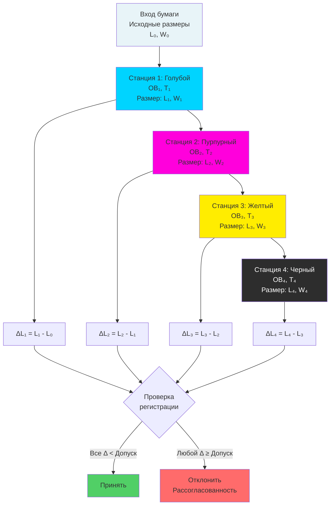

Точность регистрации представляет наиболее сложное требование в многоцветных печатных операциях. Каждый последующий оттиск краски должен совмещаться точно с предыдущими цветами для получения четких, ясных изображений без видимой рассогласованности. Изменение размеров бумаги из-за колебаний влажности является основным источником ошибки регистрации, требующим жесткого контроля окружающей среды для достижения современных стандартов качества печати.

## Физика многоцветной регистрации

Процессы многоцветной печати наносят последовательные слои чернил, которые должны совмещаться в пределах допусков 0,076–0,508 мм в зависимости от процесса и требований качества. Нестабильность размеров бумаги между оттисками цветов создает рассогласованность, видимую как цветная окантовка, размытые края или неполное покрытие.

### Механика ошибки регистрации

Ошибка регистрации накапливается из множественных независимых источников в соответствии с комбинацией квадратного корня из суммы квадратов:

$$\epsilon_{total} = \sqrt{\epsilon_{paper}^2 + \epsilon_{press}^2 + \epsilon_{plate}^2 + \epsilon_{tension}^2}$$

Где:
- $\epsilon_{total}$ = общая ошибка регистрации (мм)
- $\epsilon_{paper}$ = колебание размеров бумаги (мм)
- $\epsilon_{press}$ = допуск механического пресса (мм)
- $\epsilon_{plate}$ = ошибка позиционирования пластины (мм)
- $\epsilon_{tension}$ = эффекты натяжения полотна/листа (мм)

Колебание размеров бумаги от изменений влажности обычно вносит 50–70% от общего бюджета ошибки регистрации в объектах без управления окружающей средой.

### Последовательность совмещения цвет-в-цвет

Печать основными цветами наносит четыре последовательных оттиска (голубой, пурпурный, желтый, черный), которые должны совмещаться точно. Для четырехцветного процесса:

**Первый цвет (голубой):** Устанавливает исходное состояние размеров
**Второй цвет (пурпурный):** Должен совмещаться с голубым в пределах допуска
**Третий цвет (желтый):** Должен совмещаться с обоими предыдущими цветами
**Четвертый цвет (черный):** Должен совмещаться со всеми тремя предыдущими цветами

Изменение окружающей среды между печатными станциями вызывает прогрессивное изменение размеров, при этом максимальная рассогласованность возникает между первым и последним цветными оттисками.

### Изменение размеров бумаги между станциями

Изменение размеров между любыми двумя печатными станциями следует механике гигроширины:

$$\Delta L_{i \to j} = L_0 \cdot \alpha_H \cdot (ОВ_j - ОВ_i)$$

Где:
- $\Delta L_{i \to j}$ = изменение размеров от станции $i$ к станции $j$ (мм)
- $L_0$ = исходный размер листа (мм)
- $\alpha_H$ = коэффициент гигроширины (%/% ОВ)
- $ОВ_j - ОВ_i$ = разница относительной влажности между станциями (%)

Для листа шириной 610 мм (поперечное направление волокна) с типичной мелованной офсетной бумагой ($\alpha_H = 0,10\%/\%$ ОВ):

**Случай 1: колебание ОВ 3% между станциями**

$$\Delta L = 610,0 \times 0,001 \times 3 = 1,83 \text{ мм}$$

Это превышает допуск коммерческой регистрации ±0,25 мм в 7 раз.

**Случай 2: колебание ОВ 1% между станциями**

$$\Delta L = 610,0 \times 0,001 \times 1 = 0,61 \text{ мм}$$

По-прежнему превышает допуск прецизионной регистрации ±0,13 мм в 5 раз.

**Случай 3: колебание ОВ 0,5% (жесткий контроль)**

$$\Delta L = 610,0 \times 0,001 \times 0,5 = 0,31 \text{ мм}$$

Приближается к приемлемому диапазону для коммерческой работы, но маргинально для прецизионных приложений.

## Стандарты допусков регистрации

Различные печатные процессы и уровни качества требуют определенной точности регистрации, напрямую определяя требуемую точность контроля окружающей среды.

### Требования регистрации для конкретных процессов

| Печатный процесс | Допуск регистрации | Вклад бумаги | Максимальное колебание ОВ* | Типичный контроль ОВ |
|------------------|----------------------|-------------------|---------------------|-------------------|
| Печать безопасности | ±0,076 мм | ±0,051 мм | ±0,8% ОВ | ±1% ОВ |
| Прецизионный листовой офсет | ±0,127 мм | ±0,076 мм | ±1,2% ОВ | ±2% ОВ |
| Репродукция произведений искусства | ±0,152 мм | ±0,102 мм | ±1,7% ОВ | ±2% ОВ |
| Премиум коммерческая печать | ±0,203 мм | ±0,127 мм | ±2,1% ОВ | ±3% ОВ |
| Стандартный коммерческий офсет | ±0,254 мм | ±0,152 мм | ±2,5% ОВ | ±3% ОВ |
| Ротационная печать | ±0,203 мм | ±0,127 мм | ±2,1% ОВ | ±3% ОВ |
| Офсет с горячей сушкой | ±0,381 мм | ±0,254 мм | ±4,2% ОВ | ±5% ОВ |
| Гибкография для упаковки | ±0,508 мм | ±0,305 мм | ±5,0% ОВ | ±5% ОВ |

*Рассчитано для листа шириной 610 мм, $\alpha_H = 0,10\%/\%$ ОВ, с предположением, что бумага вносит 60% от общего бюджета ошибки.

### Методология расчета допусков

Для заданного требования допуска регистрации $\epsilon_{allow}$ допустимое изменение размеров бумаги обычно составляет 50–60% от общего допуска:

$$\epsilon_{paper,max} = 0,5 \text{ до } 0,6 \times \epsilon_{allow}$$

Преобразование в максимальное колебание ОВ для размера $L$:

$$\Delta ОВ_{max} = \frac{\epsilon_{paper,max}}{L \cdot \alpha_H}$$

**Пример: Прецизионная офсетная печать, лист 610 мм**
- Допуск регистрации: $\epsilon_{allow} = ±0,127$ мм
- Распределение на бумагу: $\epsilon_{paper,max} = 0,6 \times 0,127 = 0,076$ мм
- Гигроширина: $\alpha_H = 0,10\%/\%$ ОВ = 0,001/% ОВ
- Ширина листа: $L = 610$ мм

$$\Delta ОВ_{max} = \frac{0,076}{610 \times 0,001} = 1,25\% \text{ ОВ}$$

Этот анализ устанавливает максимальное колебание ОВ ±1,25%, обычно задаваемое как контроль ОВ ±2% с коэффициентом безопасности.

## Ошибки регистрации, вызванные влажностью

Изменение размеров бумаги из-за колебаний влажности окружающей среды проявляются в виде определенных паттернов ошибки регистрации, узнаваемых во время производства.

### Распространенные паттерны ошибок регистрации

| Паттерн ошибки | Визуальное проявление | Основная причина | Типичный размер | Связь с влажностью |
|---------------|------------------|---------------|-------------------|---------------------|
| Равномерная рассогласованность | Все края смещены одинаково | Общее изменение размеров | 0,254–2,54 мм | Линейная зависимость от ОВ |
| Расширение поперек волокна | Рассогласованность перпендикулярно волокну | Расширение CD гигроширины | 5–10× ошибки MD | $\propto \alpha_{H,CD} \cdot \Delta ОВ$ |
| Смещение вдоль волокна | Рассогласованность параллельно волокну | Расширение MD гигроширины | 0,5–1,5× ошибка CD | $\propto \alpha_{H,MD} \cdot \Delta ОВ$ |
| Прогрессивный дрейф | Увеличивающаяся ошибка по ходу работы | Постепенное изменение ОВ | 0,127–1,27 мм | Зависит от времени поглощения влаги |
| Диагональное искажение | Оба оси рассогласованы | Неравномерное поле ОВ | Векторная сумма CD/MD | Пространственный градиент ОВ |
| Изменение края к центру | Периметр плотный, центр свободный | Градиент влаги | 0,51–2,03 мм | Дифференциал ОВ через толщину |
| Раскрытие веером | Края расширяются больше, чем центр | Экспозиция передней кромки | 0,254–1,52 мм | Скорость воздуха на краю листа |

### Математическое описание раскрытия веером

Раскрытие веером происходит, когда края листа поглощают влагу быстрее, чем центр, создавая неравномерное расширение:

$$\Delta L(x) = L_0 \cdot \alpha_H \cdot \Delta ОВ(x)$$

Где $\Delta ОВ(x)$ варьируется по положению $x$ от центра листа:

$$\Delta ОВ(x) = \Delta ОВ_{edge} \cdot e^{-x/\lambda}$$

$\lambda$ = глубина проникновения (обычно 51–102 мм от кромки)

Для листа шириной 610 мм с ОВ на краю на 5% выше, чем в центре:

**Расширение на краю (x = 0):**
$$\Delta L_{edge} = 610,0 \times 0,001 \times 5 = 3,05 \text{ мм}$$

**На расстоянии 102 мм от края:**
$$\Delta ОВ(102) = 5 \times e^{-102/76} = 1,34\% \text{ ОВ}$$
$$\Delta L(102) = 610,0 \times 0,001 \times 1,34 = 0,82 \text{ мм}$$

Это создает дифференциальное расширение 2,23 мм, вызывающее серьезное искажение регистрации.

### Временной дрейф регистрации с зависимостью от времени

Ошибка регистрации изменяется во время производственных циклов из-за прогрессивного поглощения влаги:

$$\epsilon(t) = \epsilon_{final} \cdot [1 - e^{-t/\tau}]$$

Где:
- $\epsilon(t)$ = ошибка регистрации в момент времени $t$
- $\epsilon_{final}$ = ошибка регистрации при равновесии
- $\tau$ = постоянная времени (обычно 15–45 минут для воздействия на лист)

Для цикла печати 10 000 листов при 10 000 листов/час с финальной ошибкой ±0,254 мм:

**В 15 минут (2500 листов):**
$$\epsilon(15) = 0,254 \times [1 - e^{-15/30}] = 0,099 \text{ мм}$$

**В 30 минут (5000 листов):**
$$\epsilon(30) = 0,254 \times [1 - e^{-30/30}] = 0,160 \text{ мм}$$

**В 60 минут (10 000 листов):**
$$\epsilon(60) = 0,254 \times [1 - e^{-60/30}] = 0,218 \text{ мм}$$

Этот прогрессивный дрейф вызывает приемлемую регистрацию первых листов, в то время как последующие листы превышают допуск, что приводит к потере выхода 50–70% без стабильности окружающей среды.

## Требования жесткого контроля окружающей среды

Достижение прецизионной регистрации требует комплексного контроля окружающей среды на всем предприятии печати, от хранения бумаги до финальной доставки.

### Спецификации окружающей среды в области пресса

Печать с жесткими допусками требует условий окружающей среды более строгих, чем стандартное комфортное HVAC:

**Контроль температуры:**
- Уставка: 22–23°C (работа безопасности/прецизионная), 21–24°C (коммерческая)
- Допуск: ±0,8°C (прецизионная), ±1,1°C (коммерческая)
- Максимальная скорость изменения: 1,1°C/час
- Пространственная однородность: ±1,1°C по площади пресса

**Контроль относительной влажности:**
- Уставка: 50% ОВ (стандарт ANSI/NPES HR 3.1)
- Допуск: ±2% ОВ (прецизионная), ±3% ОВ (коммерческая), ±5% ОВ (стандартная)
- Максимальная скорость изменения: 3% ОВ/час
- Пространственная однородность: ±3% ОВ по площади пресса

**Контроль точки росы (предпочтительный метод):**
- Уставка: 11–13°C точка росы (эквивалент 50% ОВ при 23°C)
- Допуск: ±0,8°C точка росы
- Преимущество: Абсолютное измерение влаги независимо от колебаний температуры

### Вызовы контроля окружающей среды многопроходного пресса

Многоцветные прессы с разделенными печатными станциями создают уникальные вызовы контроля окружающей среды. Каждая станция работает в немного отличающихся тепловых условиях из-за:

**Источники тепла:**
- Электрические двигатели: 740–3700 Вт на станцию
- Трение подшипников: 150–590 Вт на станцию
- Лампы сушки чернил (УФ/ИК): 3700–14 800 Вт на станцию
- Системы промывки пластины: эффект испарительного охлаждения

**Локальные градиенты окружающей среды:**

Повышение температуры от станции к станции:
$$\Delta T_{station} = \frac{Q_{heat}}{\.{m} \cdot c_p}$$

Где:
- $Q_{heat}$ = генерация тепла на станцию (кДж/ч)
- $\.{m}$ = массовый расход воздуха (кг/ч)
- $c_p$ = удельная теплоемкость воздуха (1,006 кДж/кг·°C)

Для типичного 6-цветного пресса с общей генерацией тепла 10 000 Вт и вентиляцией 8500 CFM (14,4 м³/мин):

$$Q_{heat} = 10 000 \times 3,6 = 36 000 \text{ кДж/ч}$$

$$\.{m} = 14,4 \times 60 \times 1,2 = 1037 \text{ кг/ч}$$

$$\Delta T = \frac{36 000}{1037 \times 1,006} = 34,6°C$$

Это повышение температуры на 34,6°C, если оно не охлаждается, снижает ОВ примерно на 12% в абсолютном выражении при постоянном содержании влаги, вызывая серьезное изменение размеров между первой и последней печатной станциями.

### Конструкция системы управления для стабильности регистрации

Эффективный контроль окружающей среды для точности регистрации требует:

**Зональное кондиционирование:**
- Отдельные зоны HVAC для каждой печатной станции или секции пресса
- Индивидуальный контроль температуры на зону (±0,6°C)
- Скоординированный контроль влажности между зонами (максимум ±2% ОВ)

**Распределение воздуха с высокой скоростью:**
- 6–12 воздухообменов в час вентиляция площади пресса
- Потолочные диффузоры подачи расположены между прессами
- Низкоскоростной (<1 м/с) выпуск во избежание нарушения бумаги
- Вытяжные грили на уровне пола для захвата стратифицированного тепла

**Прецизионное увлажнение:**
- Паровые решетки или системы распыления увлажнения
- Датчики управления точкой росы (±0,3°C точность)
- Время отклика <5 минут от отклонения уставки к коррекции
- Производительность: 0,45–0,9 кг влаги/час на 8500 CFM наружного воздуха

**Емкость осушения:**
- Выделенное осушение летом
- Системы на адсорбентах для экстремальных условий влажности (>70% ОВ наружу)
- Переохлаждение и перегрев для обычного кондиционирования воздуха

**Мониторинг и сигнализация:**
- Датчики температуры/ОВ на каждой печатной станции (±0,3°C, ±2% ОВ точность)
- Регистрация данных с интервалом 5 минут
- Автоматические сигналы при отклонении ±2% ОВ от уставки
- Анализ тенденций для выявления постепенного дрейфа до возникновения проблем регистрации

### Протокол кондиционирования бумаги для регистрации

Предварительное кондиционирование бумаги представляет первый критический этап контроля регистрации:

**Требования комнаты кондиционирования:**
- Точное соответствие условиям в области пресса (22–23°C, 50% ОВ ±2%)
- Время кондиционирования: 24–72 часа в зависимости от толщины бумаги
- Циркуляция воздуха: равномерная, низкоскоростная (<0,25 м/с) во избежание локального высыхания
- Интервал между стопками: 30–46 см для доступа воздуха

**Проверка кондиционирования:**
- Измерение влажностью бумаги EMC (целевое: равновесие с прессом ±0,5%)
- Тепловое уравновешивание (температура бумаги в пределах 1,1°C от температуры помещения)
- Проверка размерной стабильности на тестовых листах (измерить до/после экспозиции 24 часа)

**Транспортировка и подготовка:**
- Минимизировать время между комнатой кондиционирования и прессом (<2 часов идеально)
- Накрывать кондиционированную бумагу при пересечении неконтролируемых пространств
- Расставить бумагу у пресса за 2–4 часа до загрузки для уравновешивания с локальными условиями

### Сезонные вызовы контроля

Зимний и летний сезоны создают противоположные вызовы контроля окружающей среды:

**Зима (сезон отопления):**
- Наружный воздух при -18°C, 50% ОВ содержит 0,00008 кг H₂O на кг сухого воздуха
- Нагретый до 23°C без увлажнения: 3–4% ОВ
- Требуемое увлажнение: 0,7–1,1 кг H₂O/час на 8500 CFM наружного воздуха
- Вызов: Поддержание однородной ОВ при высокой скорости увлажнения

**Лето (сезон охлаждения):**
- Наружный воздух при 32°C, 70% ОВ содержит 0,0185 кг H₂O на кг сухого воздуха
- Охлажденный до 23°C без осушения: 80–85% ОВ
- Требуемое осушение: 0,45–0,68 кг H₂O/час на 8500 CFM наружного воздуха
- Вызов: Предотвращение перебора ОВ при охлаждении

**Оптимальная конструкция системы:**
- Охлаждающие спирали увеличенного размера для удаления скрытого тепла (SHR = 0,60–0,70)
- Возможность перегрева для поддержания температуры при осушении
- Емкость увлажнения 150% от расчетного требования зимой
- Управление смешиванием наружного/возвратного воздуха для минимизации энергии увлажнения/осушения

## Измерение и проверка регистрации

Количественное измерение регистрации позволяет корреляцию с условиями окружающей среды, поддерживающую непрерывное совершенствование эффективности контроля окружающей среды.

### Методики измерения регистрации

**Визуальный осмотр:**
- Увеличение через лупу (10–20×) при осмотре меток регистрации
- Приемлемо для допусков ±0,254 мм или больше
- Подвергается вариабельности интерпретации оператора

**Механическое измерение:**
- Измерение микрометром меток регистрации относительно краев ссылки
- Точность: ±0,025 мм
- Отнимает много времени для мониторинга производства

**Оптическое измерение:**
- Автоматизированные системы камер, измеряющие положения меток регистрации
- Точность: ±0,013 мм
- Обратная связь в реальном времени во время производства
- Интеграция с системами управления прессом для автоматической компенсации

**Денситометрический анализ:**
- Измеряет плотность печати для обнаружения рассогласованности
- Чувствительность: обнаруживает рассогласованность 0,076 мм в основных цветах
- Бесконтактное измерение, подходящее для влажной краски

### Корреляция регистрации с окружающей средой

Установление количественной корреляции между условиями окружающей среды и ошибкой регистрации:

**Сбор данных:**
- Непрерывная регистрация ОВ и температуры на каждой печатной станции
- Измерения регистрации каждые 100–500 листов
- Запись временных меток для анализа корреляции

**Анализ корреляции:**

$$\epsilon_{registration} = A + B \cdot \Delta ОВ + C \cdot \Delta T + D \cdot \frac{d(ОВ)}{dt}$$

Где:
- $A$ = ошибка механической регистрации базовой линии
- $B$ = коэффициент чувствительности влажности
- $C$ = коэффициент чувствительности температуры
- $D$ = коэффициент чувствительности скорости изменения
- $\Delta ОВ$ = отклонение от уставки ОВ
- $\Delta T$ = отклонение от уставки температуры

Типичные значения коэффициентов для коммерческого офсета 610 мм:
- $B = 1,02$ мм/% ОВ
- $C = 0,127$ мм/°C
- $D = 0,254$ мм/(% ОВ/час)

**Пример прогноза:**
Текущие условия: ОВ = 53% (уставка 50%), T = 23°C (уставка 23°C), dОВ/dt = 2%/час

$$\epsilon = 0,076 + (1,02 \times 3) + (0,127 \times 0) + (0,254 \times 2)$$
$$\epsilon = 0,076 + 3,06 + 0 + 0,508 = 3,64 \text{ мм}$$

Этот прогноз указывает, что регистрация превысит допуск, требуя коррекции окружающей среды перед продолжением.

### Управление процессом с использованием данных окружающей среды

Мониторинг окружающей среды позволяет проактивное управление регистрацией:

**Статистическое управление процессом (SPC):**
- Контрольные карты, отслеживающие отклонение ОВ от уставки
- Предельные значения управления: ±2% ОВ (предупреждение), ±3% ОВ (действие)
- Индекс способности: $C_p \geq 1,33$ для приемлемого контроля окружающей среды

**Предсказательная коррекция:**
- Компенсация позиционирования пластины на основе предсказанного изменения размеров бумаги
- Рассчитать компенсацию: $\Delta_{comp} = L \cdot \alpha_H \cdot \Delta ОВ$
- Применить компенсацию через элементы управления регистром пресса перед возникновением рассогласованности

**Обратная связь управления окружающей средой:**
- Затянуть допуск уставки ОВ при планировании критических работ
- Увеличить частоту мониторинга при сложных условиях окружающей среды
- Предварительно подготовить систему HVAC к жесткому управлению за 4–8 часов перед прецизионной работой

## Отраслевые стандарты и лучшие практики

**ANSI/NPES HR 3.1-2010:** Стандартные условия печати — 23°C ±1,1°C, 50% ОВ ±5% ОВ. Устанавливает общий справочник для спецификаций размеров и допусков.

**ISO 12647 (Стандарт процесса офсета):** Определяет условия окружающей среды для управления процессом, включая требования к температуре и влажности для согласованной цветопередачи и регистрации.

**GRACoL (Общие требования для приложений коммерческой офсетной литографии):** Спецификации коммерческой печати, включая рекомендации контроля окружающей среды для точности регистрации.

**Управление процессом G7:** Методология для достижения визуального соответствия цветов посредством управления процессом, включая требования стабильности окружающей среды, поддерживающие точность регистрации.

Соответствие этим стандартам обеспечивает согласованную производительность регистрации и предоставляет базовую спецификацию для программ обеспечения качества. Контроль окружающей среды представляет основное требование, позволяющее механическим возможностям пресса достичь своей предназначенной точности регистрации.
