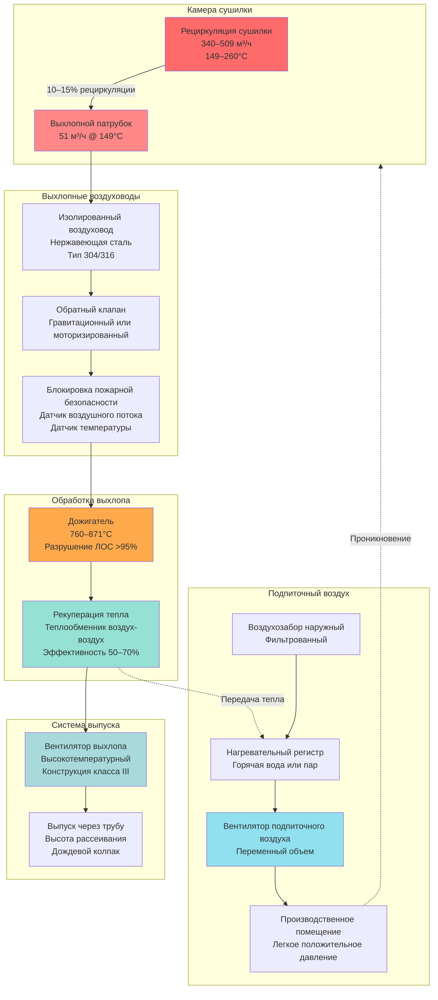

Проектирование выхлопной системы для типографских сушилок требует точного расчета объемных расходов воздуха для обеспечения безопасной эксплуатации при предотвращении чрезмерных потерь энергии. Основная проблема заключается в удалении паров растворителя и продуктов сгорания при концентрациях ниже пределов воспламеняемости при сохранении тепловой эффективности путем минимизации неконтролируемого проникновения воздуха. Три основных принципа определяют требования к выхлопу: разбавление паров растворителя ниже 25% от нижнего предела взрывоопасности (ТВЭ), удаление тепловой энергии для предотвращения перегрева, а также уравновешивание давления для обеспечения надлежащей работы сушилки без влияния на вентиляцию здания.

## Расчеты объема выхлопа

Требуемая скорость выхлопного потока вытекает из баланса масс испарения растворителя и требований безопасного разбавления. Для сушилок с нагревом концентрация паров растворителя должна оставаться ниже безопасного порога работы.

### Метод разбавления растворителя

Основной расчет устанавливает объем выхлопа на основе массового потока растворителя и допустимой концентрации:

$$Q_{exhaust} = \frac{\dot{m}_{solvent} \times 22.4}{MW_{solvent} \times C_{max}}$$

Где:
- $Q_{exhaust}$ = расход выхлопного воздуха (м³/ч при стандартных условиях)
- $\dot{m}_{solvent}$ = скорость испарения растворителя (кг/ч)
- $22.4$ = коэффициент пересчета (м³·кг/кмоль при 20°C)
- $MW_{solvent}$ = молекулярная масса растворителя (кг/кмоль)
- $C_{max}$ = максимально допустимая концентрация (обычно 0.0025 для 25% ТВЭ)

Для минерального масла (МВ ≈ 145 кг/кмоль, ТВЭ = 0.8–1.0% по объему), испаряющегося со скоростью 54 кг/ч:

$$Q_{exhaust} = \frac{54 \times 22.4}{145 \times 0.0025} = 3,316 \text{ м³/ч}$$

Это представляет теоретический минимум. Практические системы применяют коэффициент безопасности 1.5–2.0, что дает 4,974–6,632 м³/ч для данного расходования растворителя.

### Метод, основанный на рециркуляции

Альтернативный подход рассчитывает выхлоп как процент от расхода рециркуляции сушилки:

$$Q_{exhaust} = Q_{recirc} \times f_{exhaust}$$

Где:
- $Q_{recirc}$ = объем рециркулирующего воздуха в сушилке (обычно 272–509 м³/ч)
- $f_{exhaust}$ = доля выхлопа (0.10–0.15 для сушилок с нагревом)

Для сушилки, работающей при рециркуляции 408 м³/ч с 12% выхлопом:

$$Q_{exhaust} = 408 \times 0.12 = 49 \text{ м³/ч}$$

Этот метод обеспечивает непрерывную очистку атмосферы сушилки независимо от кратковременных изменений расходования растворителя.

### Объем с поправкой на температуру

Расчеты выхлопа при стандартных условиях должны быть скорректированы с учетом фактической температуры эксплуатации:

$$Q_{actual} = Q_{standard} \times \frac{T_{actual}}{T_{standard}}$$

Где температуры указаны в абсолютных единицах (К = °C + 273.15).

При температуре выхлопа 149°C:

$$Q_{actual} = 49 \times \frac{422}{293} = 71 \text{ м³/ч}$$

Расширенный объем при повышенной температуре пропорционально увеличивает скорость в воздуховодах и мощность вентилятора.

## Требования к подпиточному воздуху

Удаление выхлопа создает отрицательное давление, которое должно быть скомпенсировано кондиционированным подпиточным воздухом для предотвращения:

- Проникновения через оболочку здания, вызывающего неконтролируемое увлажнение воздуха
- Обратного потока продуктов сгорания сушилки
- Дестабилизации натяжения полотна из-за колебаний давления
- Чрезмерных нагрузок на отопление/охлаждение от некондиционированного проникновения

### Баланс объема подпиточного воздуха

Количество подпиточного воздуха равно общему выхлопу плюс допуск на контролируемое проникновение:

$$Q_{makeup} = Q_{exhaust} + Q_{infiltration} - Q_{process}$$

Где:
- $Q_{makeup}$ = требуемый объем подпиточного воздуха (м³/ч)
- $Q_{exhaust}$ = общий механический выхлоп из сушилок и вытяжных зонтов (м³/ч)
- $Q_{infiltration}$ = расчетный расход проникновения (обычно 0.05–0.10 объемов здания/ч)
- $Q_{process}$ = воздух, потребляемый при сгорании или поглощаемый продуктом (м³/ч)

Для типографии площадью 5,662 м² с выхлопом из сушилок 170 м³/ч и 0.08 объемов здания/ч проникновения:

$$Q_{makeup} = 170 + \left(\frac{18,872 \times 0.08}{60}\right) - 0 = 252 \text{ м³/ч}$$

### Тепловая нагрузка подпиточного воздуха

Тепловая энергия, необходимая для кондиционирования подпиточного воздуха от наружной температуры к температуре подачи:

$$Q_{heating} = Q_{makeup} \times 1.2 \times (T_{supply} - T_{outdoor})$$

Где $Q_{heating}$ в кВт и температуры в °C.

При зимней эксплуатации с подпиточным воздухом, нагреваемым от -18°C до 21°C:

$$Q_{heating} = 252 \times 1.2 \times (21 - (-18)) = 11.2 \text{ кВт}$$

Это представляет значительные эксплуатационные затраты, что делает экономически привлекательным использование рекуперации тепла из выхлопа сушилки.

## Конфигурация выхлопной системы по типам сушилок

Различные технологии сушки требуют отличительных подходов к выхлопу в зависимости от температуры, типа загрязнений и безопасности процесса:

| Тип сушилки | Объем выхлопа | Температура | Основные загрязнители | Соображения безопасности |
|-----------|---------------|-------------|---------------------|----------------------|
| Ротационный офсет с нагревом | 10–15% от рециркуляции (41–75 м³/ч на сушилку) | 121–177°C | Пары минерального масла, продукты сгорания | Поддержание <25% ТВЭ; требуется дожигатель |
| УФ-отверждение (ртуть) | 17–51 м³/ч на лампу | 66–93°C | Озон, следовые количества паров акрилата | Фильтры разрушения озона; изоляция под положительным давлением |
| УФ-отверждение (светодиод) | 7–20 м³/ч на лампу | 38–54°C | Минимальный озон, только охлаждение | Сниженный выхлоп; приоритет охлаждения лампы |
| Электронный луч | 10–27 м³/ч на единицу | 32–43°C | Вентиляция радиационной защиты | Блокировки безопасности при радиации |
| Инфракрасные сушилки | 8–12% от рециркуляции (27–51 м³/ч) | 93–149°C | Водяной пар, незначительные ЛОС | Низкая вероятность ТВЭ; удаление влаги |
| Сушилки горячего воздуха | 15–20% от рециркуляции (51–102 м³/ч) | 82–121°C | Водяной пар, побочные продукты окисления | Контроль влажности; предотвращение конденсации |

### Критерии выбора конфигурации

Сушилки с нагревом, работающие с типографскими маслами на основе углеводородов, требуют наибольших объемов выхлопа из-за ограничений по безопасности ТВЭ. Концентрация растворителя определяет проектирование больше, чем потребности в удалении тепла.

УФ-системы приоритизируют эффективность охлаждения над удалением паров. Системы ртутных ламп создают значительное количество озона (O₃), требующее каталитического разрушения или фильтрации активированным углем перед выпуском. УФ-системы со светодиодами снижают выхлоп на 60–70% благодаря меньшему тепловыделению.

## Пожарная безопасность и предотвращение взрывов

Системы выхлопа сушилок работают с легковоспламеняющимися парами при повышенных температурах, требуя нескольких уровней защиты согласно NFPA 86.

### Мониторинг нижнего предела взрывоопасности

Непрерывный мониторинг концентрации растворителя предотвращает приближение к условиям воспламенения:

$$\text{Безопасный предел работы} = 0.25 \times \text{ТВЭ}$$

Для минерального масла с ТВЭ 0.9% по объему, максимальная рабочая концентрация составляет 0.225% (2,250 млн⁻¹). Большинство систем ориентированы на максимум 1,500–1,800 млн⁻¹ с сигналом тревоги при 2,000 млн⁻¹ и автоматическим отключением при 2,250 млн⁻¹.

### Проверка минимального потока выхлопа

Датчики доказательства воздушного потока подтверждают работу вентилятора выхлопа перед зажиганием горелки сушилки. Последовательность блокировки:

1. Вентилятор выхлопа активирован и инициирован цикл очистки (минимум 4–5 смен воздуха)
2. Датчик воздушного потока закрывает контакт, подтверждая минимум 80% расчетного потока
3. Таймер очистки завершается (обычно 60–120 секунд)
4. Разрешено зажигание горелки

Потеря потока выхлопа во время эксплуатации вызывает немедленное отключение топлива и сигнал тревоги.

### Пределы температуры

Мониторинг температуры выхлопа предотвращает самовоспламенение паров растворителя:

| Тип растворителя | Температура самовоспламенения | Макс. температура выхлопа | Запас безопасности |
|-------------|------------------------|---------------------|---------------|
| Минеральное масло | 246–288°C | 177°C | 69–111°C |
| Толуол | 480°C | 204°C | 276°C |
| Этилацетат | 427°C | 191°C | 236°C |
| Вода (ИК сушилки) | Н/П | 121°C | Контроль конденсации |

Термостаты верхнего предела прерывают работу горелки при 191–204°C в зависимости от типа растворителя.

### Вентиляция на случай взрыва

Камеры сушилок, превышающие 14.2 м³ или работающие с концентрациями >25% ТВЭ, требуют клапана сброса давления согласно NFPA 68:

$$A_{vent} = \frac{V_{chamber}}{C_{vent}}$$

Где:
- $A_{vent}$ = площадь клапана (м²)
- $V_{chamber}$ = объем камеры сушилки (м³)
- $C_{vent}$ = константа клапана (0.14–0.23 м² на м³ для конструкций низкой прочности)

Для камеры сушилки объемом 28.3 м³ с облегченной конструкцией:

$$A_{vent} = \frac{28.3}{0.14} = 202 \text{ м}^2$$

Панели сброса давления выпускаются в безопасные наружные места, обычно на крыше с направлением вверх под углом 45°.

## Проектирование выхлопной системы

Физическая выхлопная система должна транспортировать высокотемпературный, потенциально загрязненный воздух без конденсации и распространения огня.

### Выбор материала воздуховода

Материалы выхлопного воздуховода должны выдерживать температуру и устойчивы к коррозии от конденсата растворителя:

- **Нержавеющая сталь 304/316**: Предпочтительна для всех выхлопов сушилок с нагревом; устойчива к коррозии от кислотного конденсата
- **Алюминизированная сталь тип 2**: Экономична для участков с более низкой температурой (<93°C)
- **Оцинкованная сталь**: Допустима только для выхлопа УФ-сушилок и после дожигателей
- **Изоляция**: Минимум 5 см из стекловолокна или минеральной ваты для поддержания температуры выше точки росы

### Скорость и размеры воздуховода

Скорость выхлопного воздуховода уравновешивает потери давления против предотвращения конденсации:

$$V_{duct} = \frac{Q \times 60}{A_{duct}}$$

Где:
- $V_{duct}$ = скорость в воздуховоде (м/с)
- $Q$ = объемный расход (м³/ч)
- $A_{duct}$ = площадь поперечного сечения воздуховода (м²)

Целевые скорости:
- Основные выхлопные воздуховоды: 10–15 м/с (предотвращает осаждение, сохраняет турбулентность)
- Вертикальные стояки: 13–18 м/с (преодолевает силы плавучести)
- Финальный выпуск: 8–10 м/с (снижает шум, мощность вентилятора)

### Выбор вентилятора и конструкция

Высокотемпературные выхлопные вентиляторы требуют специальной конструкции:

- **Тип рабочего колеса**: Загнутые назад или аэродинамические для эффективности; радиальные лопасти для частиц
- **Рейтинг температуры**: Минимум 177°C непрерывно, 204°C в течение 2 часов при аварийной ситуации
- **Охлаждение подшипников**: Внешние подшипники на опоре с охлаждением на окружающий воздух или водяными рубашками
- **Расположение двигателя**: За пределами потока воздуха с приводом ремнем или валом через изолированный корпус подшипника
- **Материалы**: Колесо и корпус из нержавеющей стали для устойчивости к коррозии

Требования к статическому давлению обычно составляют 100–200 Па в зависимости от длины воздуховода, оборудования рекуперации тепла и устройств обработки.

## Воздушный баланс и контроль давления

Взаимодействие между выхлопом сушилки и давлением в здании требует тщательной координации.

### Стратегия каскада давления

Оптимальные соотношения давлений:

1. **Камера сушилки**: –2.5 до –7.5 Па относительно производственного помещения (предотвращает выход паров)
2. **Производственное помещение**: +1 до +2.5 Па относительно наружного воздуха (предотвращает проникновение)
3. **Камера подпиточного воздуха**: +5 до +10 Па (обеспечивает распределение)

### Контроль переменного объема

Современные системы модулируют подпиточный воздух для сохранения давления в помещении:

$$Q_{makeup,var} = Q_{exhaust,total} + \Delta Q_{control}$$

Где $\Delta Q_{control}$ корректируется на основе обратной связи датчика давления в помещении, обычно ±10–15% от расчетного потока.

Контроллер давления в здании поддерживает уставку через:
- ЧРП-управление вентилятором подпиточного воздуха
- Модулирующие заслонки на распределении подпиточного воздуха
- Байпасный клапан для сброса избыточного давления

## Требования обработки выхлопа

Экологические нормативы требуют контроля ЛОС для типографских операций с нагревом.

### Термическое окисление

Высокоэффективное разрушение ЛОС путем горения:

**Эффективность разрушения** = $\frac{C_{in} - C_{out}}{C_{in}} \times 100\%$

Рекуперативные дожигатели (RTO) достигают >98% разрушения при:
- Температура работы: 760–871°C
- Время пребывания: 0.5–1.0 секунды
- Регенерация керамической насадки: 90–97% возврат тепла

**Требование дополнительного топлива**:

$$Q_{fuel} = Q_{exhaust} \times \rho \times c_p \times (T_{oxidation} - T_{exhaust}) - \dot{m}_{VOC} \times HHV$$

Где теплотворная способность ЛОС (ТВС) компенсирует потребление топлива. При концентрации на входе >5% ТВЭ системы часто достигают автогенной эксплуатации (нулевое дополнительное топливо).

### Альтернативные методы обработки

| Технология | Эффективность разрушения/удаления | Эксплуатационная стоимость | Капитальная стоимость | Применение |
|-----------|-------------------------------|----------------|--------------|-------------|
| Дожигатель (прямой) | 95–99% | Высокая (топливо) | Низкая | Высокая концентрация ЛОС |
| Рекуперативный дожигатель | 97–99% | Низкая (топливо) | Высокая | Среднемерная ЛОС, непрерывная работа |
| Каталитический окислитель | 90–98% | Средняя | Средняя | Низкотемпературная работа |
| Адсорбция углем | 85–95% удаления | Средняя (регенерация) | Средняя–высокая | Прерывистая работа, возврат ЛОС |
| Ротор-концентратор + RTO | 95–99% | Низкая (концентрирует разбавленный поток) | Очень высокая | Большой объем, низкая концентрация |

## Соответствие кодексам и стандартам

Проектирование выхлопной системы должно соответствовать нескольким нормативно-правовым базам:

### NFPA 86: Печи и дожигатели

Ключевые требования:
- Классификация сушилки как класса А (обработка легковоспламеняющихся паров)
- Минимум 4 смены воздуха перед зажиганием
- Блокировки воздушного потока, предотвращающие работу ниже 80% расчетного потока
- Управление термостатом верхнего предела
- Возможности аварийного отключения

### IMC Глава 5: Системы выхлопа

- Минимум 2.5 м/с скорость в воздуховоде для выхлопа, содержащего пары
- Конструкция воздуховода согласно SMACNA с герметичными соединениями
- Люки для доступа каждые 6 м для инспекции
- Зазоры от горючих конструкций: минимум 45 см или изолированы для ограничения температуры поверхности до 90°F выше окружающей

### NFPA 91: Системы выхлопа паров

- Электрическая классификация согласно NEC статья 500 для класса I, отделение 2 в пределах 1.5 м от выхлопных отверстий
- Конструкция вентилятора, устойчивая к искрам (алюминий, бронза, нержавеющая сталь)
- Заземление и соединение всех воздуховодов для предотвращения накопления статического электричества
- Вентиляция сброса давления, где требуется

### Нормативы EPA

Стандарты максимально достижимых технологий управления (MACT) для типографских операций обычно требуют:
- 90–95% эффективность улавливания ЛОС
- 95% эффективность разрушения/удаления устройством управления
- Непрерывный мониторинг потока выхлопа и температуры
- Ведение документации использования растворителя и выбросов

## Контрольный список проектирования и интеграции

Успешная реализация выхлопной системы требует координации между несколькими дисциплинами:

**Требования процесса**:
- Размер выхлопного патрубка сушилки по спецификации производителя и температура
- Тип растворителя, объем использования и давление паров
- График производства и изменения нагрузок

**Координация конструкции**:
- Поддержка выпускной трубы и боковая нагрузка ветром
- Нагрузки оборудования (вентиляторы, дожигатели) на кровельную конструкцию
- Сейсмические связи согласно ASCE 7

**Электрические системы**:
- Мощность электродвигателя вентилятора и проводка управления
- Интеграция блокировок с управлением печатного оборудования
- Цепи аварийного отключения
- Методы проводки в опасных местах

**Противопожарная защита**:
- Координация спринклеров вокруг высокотемпературных воздуховодов
- Дроссельные клапаны с плавким звеном, если требуется
- Интеграция с сигнализацией пожара

**Управление энергией**:
- Размер оборудования рекуперации тепла и интеграция
- Блокировки экономайзера во время работы сушилки
- Стратегия предварительного нагрева подпиточного воздуха

Выхлопная система представляет критический компонент безопасности, который должен работать непрерывно во время печатных прогонов. Резервирование через двойные вентиляторы или резервное электроснабжение при аварии обеспечивает непрерывность производства, защищая персонал и оборудование от опасности пожара и взрыва.
