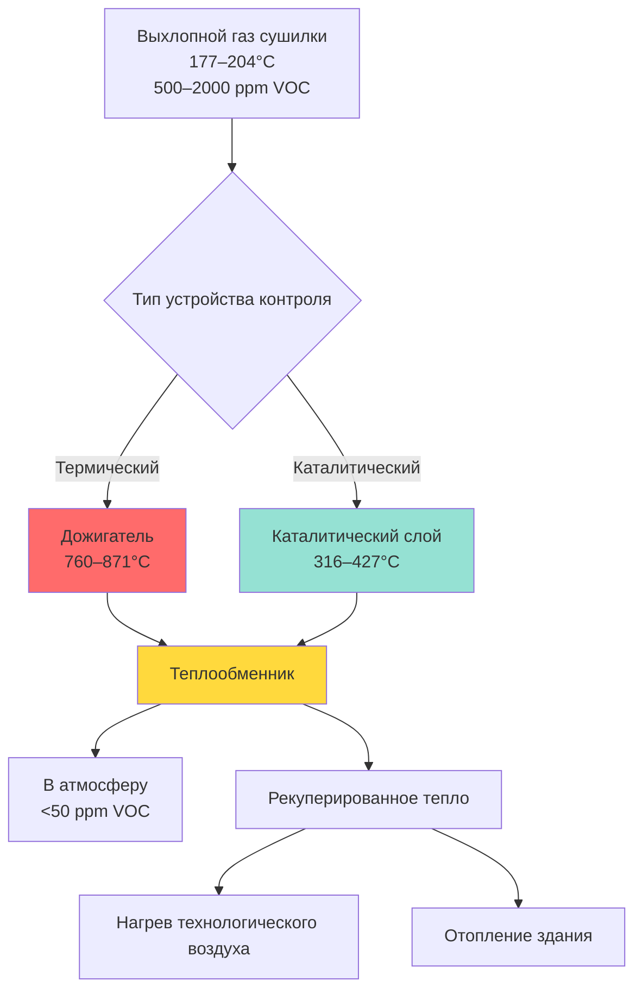

Сушилки с тепловой установкой представляют собой критически важное оборудование для теплообработки в операциях веб-печати офсетом, где происходит быстрое испарение растворителя и отверждение краски при повышенных температурах. Эти системы должны обеспечивать точное управление температурой, эффективное управление летучими органическими соединениями (VOC) и рекуперацию энергии для поддержания качества продукции при соблюдении экологических норм.

## Физика процесса сушки

Высыхание краски в сушилке с тепловой установкой включает два одновременных механизма: испарение растворителя и окислительную полимеризацию. Печатный холст поступает в сушилку при окружающей температуре и быстро нагревается до температуры от 177°C до 204°C.

Скорость теплопередачи к холсту подчиняется формуле:

$$Q = h \cdot A \cdot (T_{air} - T_{web})$$

Где $Q$ — скорость теплопередачи (кДж/ч), $h$ — коэффициент конвективной теплопередачи (кДж/ч·м²·°C), $A$ — поверхность холста (м²), а $T_{air}$ и $T_{web}$ — температуры воздуха и холста соответственно.

Коэффициент конвекции обычно составляет от 57 до 142 кДж/ч·м²·°C в зависимости от скорости воздуха и уровня турбулентности. Более высокие скорости увеличивают $h$, но также увеличивают энергопотребление вентилятора.

## Конфигурация зон сушилки

Сушилки с тепловой установкой имеют несколько температурных зон для управления профилем сушки. Начальная зона предварительно нагревает холст для предотвращения теплового шока и складок бумаги. Первичные зоны сушки работают при пиковых температурах, где происходит максимальное испарение растворителя.

| Зона | Диапазон температуры | Функция | Время пребывания |
|------|------------------|----------|----------------|
| Предварительный нагрев | 93-121°C | Постепенный нагрев | 0,5–1,0 сек |
| Первичная сушка | 177–204°C | Пиковое испарение | 1,5–2,5 сек |
| Вторичная сушка | 149–177°C | Полное отверждение | 1,0–1,5 сек |
| Охлаждение | 27–38°C | Стабилизация холста | 2,0–3,0 сек |

Время пребывания в каждой зоне зависит от скорости холста и длины сушилки. Типичные скорости холста колеблются от 4 до 7,6 м/с для коммерческих полиграфических операций.

## Кинетика испарения растворителя

Скорость испарения нефтяных растворителей в красках для сушилок с тепловой установкой подчиняется кинетике первого порядка:

$$\frac{dm}{dt} = -k \cdot m$$

Где $m$ — оставшаяся масса растворителя, а $k$ — константа скорости, которая экспоненциально возрастает с температурой в соответствии с уравнением Аррениуса:

$$k = A \cdot e^{-E_a/(R \cdot T)}$$

Энергия активации $E_a$ для типичных растворителей в сушилках с тепловой установкой находится в диапазоне от 47 до 71 кДж/моль. Эта температурная зависимость объясняет, почему контроль температуры сушилки в пределах ±3°C необходим для обеспечения стабильных характеристик сушки.

При 190°C примерно 95% растворителей испаряются в течение 2 секунд времени пребывания. Скрытая теплота парообразования для нефтяных дистиллятов составляет в среднем 326 кДж/кг, что представляет значительную часть общего требования по энергии.

## Контроль эмиссии летучих органических соединений

Выхлопной газ с содержанием растворителя из сушилок с тепловой установкой содержит летучие органические соединения (VOC), которые перед атмосферным выбросом требуют термического или каталитического окисления. Типичные концентрации в выхлопном газе составляют от 500 до 2000 ppm (в эквиваленте пропана).

### Системы дожигателя

Термические дожигатели сжигают летучие органические соединения при температурах от 760°C до 871°C с временем пребывания от 0,5 до 0,75 секунд. Эффективность горения определяется формулой:

$$\eta_{combustion} = \frac{VOC_{in} - VOC_{out}}{VOC_{in}} \times 100\%$$

Правильно спроектированные дожигатели достигают эффективности разрушения 95–99%. Потребление топлива зависит от температуры выхлопного газа, поступающего в дожигатель, и концентрации летучих органических соединений, которые обеспечивают дополнительную теплотворную способность.

### Каталитические окислители

Каталитические системы используют катализаторы из драгоценных металлов (платина или палладий) для снижения температуры окисления до 316–427°C. Более низкая температура снижает потребление топлива, но требует тщательного управления для предотвращения отравления катализатора кремниевыми соединениями или тяжелыми металлами в составах чернил.

## Стратегии рекуперации энергии

Системы сушилок с тепловой установкой потребляют от 16 до 42 ГДж на 1000 тиражей, что делает рекуперацию энергии экономически привлекательной. Высокотемпературный выхлопной газ окислителей содержит значительное количество восстанавливаемой энергии.

**Распространенные методы рекуперации:**

- **Воздух-воздух теплообменники**: предварительный нагрев поступающего воздуха горения или воздуха снабжения сушилки, рекуперируя 40–60% энергии выхлопного газа
- **Рекуперативные горелки**: интеграция теплообмена в узел горелки для достижения эффективности теплопередачи 70–80%
- **Интеграция процесса**: использование восстанавливаемого тепла для отопления здания, снижая энергопотребление объекта на 20–30%

Рекуперированное тепло $Q_{recovered}$ можно рассчитать по формуле:

$$Q_{recovered} = \dot{m} \cdot c_p \cdot (T_{exhaust} - T_{final}) \cdot \eta_{HX}$$

Где $\dot{m}$ — массовый расход выхлопного газа, $c_p$ — удельная теплоемкость (1,006 кДж/кг·°C для воздуха), а $\eta_{HX}$ — эффективность теплообменника (обычно 0,50–0,70).

## Охлаждение охлаждающим валиком

После выхода из сушилки температура холста достигает 149–177°C и требует быстрого охлаждения для предотвращения смазывания на последующем оборудовании. Охлаждающие валики используют циркулирующую охлажденную воду (7–13°C) для снижения температуры холста до 27–38°C.

Нагрузка охлаждения охлаждающих валиков включает:

1. Удаление явного тепла из бумажной основы
2. Завершение окисления краски (экзотермическая реакция добавляет 5–10% к нагрузке охлаждения)
3. Конденсация остаточного растворителя

Общая мощность охлаждения обычно составляет от 176 до 704 кВт в зависимости от ширины пресса и скорости. Скорость удаления тепла должна соответствовать выходу сушилки для поддержания стабильной температуры холста и предотвращения конденсации влаги.

## Соображения по проектированию

**Справочник ASHRAE - HVAC приложения** предоставляет руководство по промышленным процессам сушки, подчеркивая важность:

- Поддержания нижнего предела взрываемости (LEL) 25% или менее в выхлопном газе сушилки для безопасности
- Обеспечения адекватного подпиточного воздуха для замены выбрасываемых объемов (обычно 3,8–5,7 м³/с на сушилку)
- Управления давлением в здании для предотвращения миграции летучих органических соединений в занятые помещения
- Расчета воздуховодов на скорость 12,7–17,8 м/с для минимизации перепада давления при предотвращении конденсации растворителя

Системы обнаружения и подавления пожара должны быть интегрированы с элементами управления сушилкой для немедленного отключения подачи тепла и продувки объема сушилки свежим воздухом в случае возгорания.

## Оптимизация производительности

Оптимизация производительности сушилки с тепловой установкой требует балансировки нескольких переменных:

- **Равномерность температуры**: поддержание ±6°C по ширине холста для предотвращения дифференциальной сушки
- **Распределение скорости воздуха**: 7,6–12,7 м/с на поверхности холста для равномерной теплопередачи
- **Контроль выхлопного газа**: согласование нагрузки растворителя с мощностью окислителя для стабильного горения
- **Рекуперация энергии**: максимизация тепловой рекуперации без компромисса управления температурой технологического процесса

Современные системы используют контроль температуры для конкретной зоны, переменные частотные приводы на циркуляционных вентиляторах и мониторинг летучих органических соединений в реальном времени для оптимизации энергопотребления при соблюдении нормативных требований и качества продукции.
