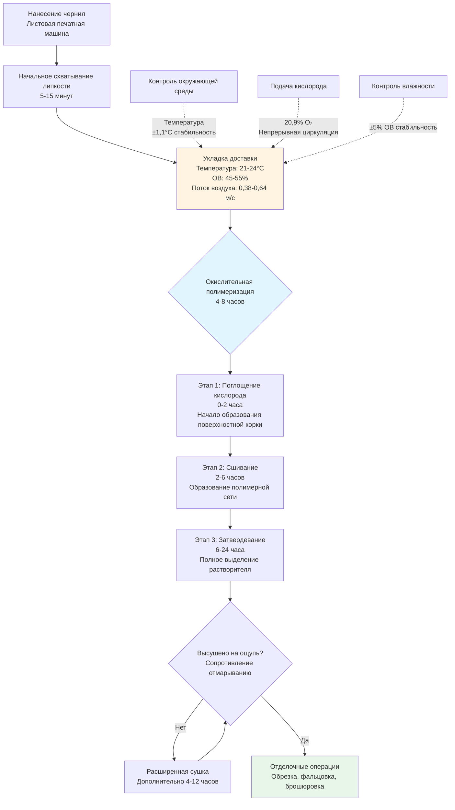

Окислительная сушка представляет принципиально иной механизм отверждения чернил, отличный от процессов горячей сушки или УФ-полимеризации. Вместо полагания на испарение растворителя или фотополимеризацию, окислительная сушка происходит через автоокислительную полимеризацию, при которой атмосферный кислород химически реагирует с ненасыщенными жирными кислотами в связующем чернил, образуя сшитые полимерные сети. Этот процесс доминирует в операциях офсетной литографии на листовых машинах, высокой печати и трафаретной печати. Система HVAC должна устанавливать экологические условия, которые оптимизируют кинетику реакции, предотвращая преждевременное формирование поверхностной корки, проблемы с удержанием липкости и загрязнение отмарыванием.

## Химия автоокислительной полимеризации

Окислительная сушка протекает через свободнорадикальные цепные реакции, инициированные атмосферным кислородом. Связующее чернил обычно содержит льняное масло, масло тунга или синтетические алкидные смолы — все они имеют углерод-углеродные двойные связи, чувствительные к атаке кислородом.

### Механизм реакции

Последовательность полимеризации следует трем этапам:

1. **Инициирование**: Кислород отнимает водород от аллильных позиций, смежных с двойными связями, образуя гидропероксидные радикалы
2. **Распространение**: Свободные радикалы атакуют соседние молекулы, создавая пероксидные сшивки
3. **Завершение**: Рекомбинация радикалов образует стабильные полимерные сети

Общее уравнение скорости для автоокислительной полимеризации:

$$r_{ox} = k_0 \cdot [\text{RH}] \cdot [O_2]^{0.5} \cdot e^{-E_a/(RT)}$$

Где:
- $r_{ox}$ = скорость окисления (моль/л·с)
- $k_0$ = предэкспоненциальный множитель (зависит от материала)
- $[\text{RH}]$ = концентрация окисляемого субстрата
- $[O_2]$ = парциальное давление кислорода
- $E_a$ = энергия активации (обычно 60-80 кДж/моль для сушащих масел)
- $R$ = универсальная газовая постоянная (8,314 Дж/моль·К)
- $T$ = абсолютная температура (К)

### Зависимость от температуры

Соотношение Аррениуса управляет чувствительностью к температуре. Для типичных алкидных чернил с $E_a = 70$ кДж/моль относительное увеличение скорости:

$$\frac{r_{T_2}}{r_{T_1}} = e^{\frac{E_a}{R}\left(\frac{1}{T_1} - \frac{1}{T_2}\right)}$$

Преобразуя в практические условия с температурами в Цельсиях:

$$\frac{r_{T_2}}{r_{T_1}} \approx 2^{\frac{(T_2 - T_1)}{10°C}}$$

Это приблизительное соотношение дает удвоение скорости окисления на каждые 10°C повышения температуры, или эквивалентно, увеличение скорости на 10-12 процентов на каждые 5,5°C в типичном диапазоне эксплуатации 18-29°C.

## Требования к контролю окружающей среды

Скорости окислительной сушки реагируют на температуру, влажность, доступность кислорода и скорость воздуха. Система HVAC должна уравновешивать эти факторы для достижения оптимального отверждения без ущерба качеству печати.

### Контроль температуры

| Диапазон температуры | Влияние на сушку | Рабочие соображения |
|-------------------|--------------------|-----------------------------|
| 18-21°C | Базовая скорость | Медленная сушка, расширенное время доставки |
| 21-24°C | 1,1-1,25× базовой | Стандартный диапазон эксплуатации |
| 24-27°C | 1,3-1,5× базовой | Ускоренная сушка, оптимально для плотных слоев |
| 27-29°C | 1,6-2,0× базовой | Риск образования корки, проблемы с липкостью |
| >29°C | >2,0× базовой | Преждевременное отверждение поверхности, проблемы с улавливанием |

Оптимальный температурный диапазон 21-24°C уравновешивает разумные времена сушки (4-8 часов до высушивания на ощупь) против рисков для качества печати. Более высокие температуры ускоряют поверхностное окисление быстрее, чем массовое отверждение, создавая твердые корки над липкими внутренними слоями, которые вызывают захватывание и проблемы с отмарыванием во время складирования и обработки.

### Влияние влажности

Относительная влажность влияет на окислительную сушку через несколько механизмов:

**Конкурентная адсорбция**: Водяной пар конкурирует с кислородом за поверхностные участки на частицах пигмента и волокнах подложки, снижая эффективную концентрацию кислорода на границах раздела реакции.

**Гигроскопические помехи**: Бумажные подложки поглощают влагу, расширяя волокна и потенциально нарушая недавно образованные связи чернил-подложка во время критической начальной фазы отверждения.

**Активность металлических сушителей**: Кобальт, марганец и циркониевые сушители (катализаторы) показывают сниженную активность при повышенной влажности из-за гидратации координационных узлов металла.

| Относительная влажность | Коэффициент времени сушки | Проблемы качества |
|-------------------|-----------------------|----------------|
| 30-40% | 0,9-1,0× базовой | Приемлемо, риск накопления статического электричества |
| 40-50% | 1,0× базовой | Оптимальный диапазон |
| 50-60% | 1,05-1,15× базовой | Немного медленнее, хорошее качество |
| 60-70% | 1,2-1,4× базовой | Расширенная сушка, расширение полотна |
| >70% | >1,5× базовой | Значительно замедленное отверждение |

Целевая влажность 45-55% ОВ обеспечивает оптимальные условия, одновременно поддерживая размерную стабильность бумаги и минимизируя накопление статического электричества.

## Транспорт кислорода и циркуляция воздуха

Окислительная сушка ограничена кислородом на поверхности чернил. По мере того как полимеризация потребляет доступный кислород, скорость реакции зависит от диффузионного и конвективного переноса свежего кислорода к границе раздела.

### Анализ массопередачи

Поток кислорода к поверхности чернил следует закону Фика:

$$J_{O_2} = h_m \cdot (C_{O_2,\infty} - C_{O_2,s})$$

Где:
- $J_{O_2}$ = массовый поток кислорода (моль/м²·с)
- $h_m$ = коэффициент массопередачи (м/с)
- $C_{O_2,\infty}$ = концентрация кислорода в основном потоке (≈8,9 моль/м³ при НУ)
- $C_{O_2,s}$ = концентрация кислорода на поверхности (≈0 для быстрой реакции)

Коэффициент массопередачи соотносится со скоростью воздуха через корреляцию числа Шервуда:

$$Sh = \frac{h_m \cdot L}{D_{O_2}} = 0,664 \cdot Re^{0,5} \cdot Sc^{0,33}$$

Для вынужденной конвекции над плоскими листами, где $Re = \frac{\rho \cdot v \cdot L}{\mu}$ (число Рейнольдса) и $Sc = \frac{\mu}{\rho \cdot D_{O_2}}$ (число Шмидта ≈0,83 для кислорода в воздухе).

Это дает практический результат, что удвоение скорости воздуха увеличивает кислородный транспорт примерно на 40 процентов ($\sqrt{2} \approx 1,41$).

### Требования по скорости воздуха

| Скорость воздуха | Кислородный транспорт | Применение |
|--------------|-----------------|-------------|
| <0,13 м/с | Недостаточно | Стационарные условия, медленное отверждение |
| 0,13-0,25 м/с | 0,7-0,85× оптимальной | Минимальная циркуляция |
| 0,25-0,51 м/с | 0,85-1,0× оптимальной | Стандартная доставка |
| 0,51-0,76 м/с | 1,0-1,15× оптимальной | Оптимальный диапазон для плотных слоев чернил |
| 0,76-1,02 м/с | 1,15-1,25× оптимальной | Максимальная практическая скорость |
| >1,02 м/с | 1,25× оптимальной | Убывающий эффект, проблемы с пылью |

Чрезмерные скорости воздуха выше 1,02 м/с обеспечивают минимальный дополнительный кислородный транспорт, увеличивая при этом осаждение пыли на влажные чернила и создавая трудности при обработке. Типичные укладчики доставки работают с циркуляцией поперечного потока 0,38-0,64 м/с.

## Переменные составления чернил

Различные химические составы чернил проявляют кардинально различные характеристики окислительной сушки, требующие скорректированных экологических условий.

### Сравнение связующих чернил

| Тип чернил | Основное связующее | Время сушки (21°C, 50% ОВ) | Чувствительность к температуре | Оптимальные условия |
|----------|-----------------|----------------------------|-------------------------|---------------------|
| Стандартный процесс | Льняное/алкидное смешение | 6-10 часов | Умеренная (1,2×/5,5°C) | 21-24°C, 45-55% ОВ |
| Быстросохнущие | Модифицированный алкид | 3-6 часов | Высокая (1,4×/5,5°C) | 21-24°C, 40-50% ОВ |
| Высокоглянцевые | Фенольная смола | 8-12 часов | Низкая (1,1×/5,5°C) | 22-26°C, 45-50% ОВ |
| УФ/окислительный гибрид | Акрилат/алкид | 4-8 часов | Умеренная (1,3×/5,5°C) | 21-24°C, 40-50% ОВ |
| Металлические | База лака | 10-16 часов | Низкая (1,1×/5,5°C) | 22-27°C, 40-50% ОВ |

Быстросохнущие чернила используют низкой вязкости связующие, которые быстро впитываются в волокна бумаги, оставляя богатые смолой поверхностные слои, которые окисляются быстрее. Напротив, высокоглянцевые формулировки требуют расширенного времени отверждения для развития полной твердости и свойств сопротивления.

### Влияние концентрации сушителей

Металлические сушители катализируют окисление путем координации с гидропероксидными промежуточными продуктами. Типичные концентрации:

- **Кобальтовые сушители**: 0,02-0,10% (первичный поверхностный сушитель)
- **Марганцевые сушители**: 0,05-0,20% (сквозной катализатор отверждения)
- **Цирконниевые сушители**: 0,10-0,30% (вспомогательный сушитель твердости)

Чрезмерные концентрации сушителей ускоряют образование корки, но компрометируют целостность конечной пленки, в то время как недостаточные уровни сушителя расширяют времена отверждения сверх практических требований производства. Температура окружающей среды прямо влияет на оптимальный баланс сушителей — более высокие температуры требуют сниженных уровней кобальта для предотвращения преждевременного отверждения поверхности.

## Процесс окислительной сушки

## Рассмотрения проектирования системы HVAC

Области доставки и отделки требуют выделенного контроля окружающей среды для поддержания условий окислительной сушки.

### Требования по вентиляции

Рассчитайте минимальный расход воздуха на основе объема пространства и количества смен воздуха:

$$\text{CFM} = \frac{V \cdot \text{ACH}}{60}$$

Где:
- $V$ = объем пространства (м³)
- ACH = смены воздуха в час (0,5-1,5 для областей окислительной сушки)

Для площади доставки 930 м² с потолками высотой 4,9 м (4 560 м³), 1,0 ACH требует:

$$\text{м}^3/\text{ч} = 4\,560 \times 1,0 = 4\,560 \text{ м}^3/\text{ч}$$

Это обеспечивает массовую циркуляцию воздуха; локальные вентиляторы поперечного потока дополняют это с направленными скоростями 0,38-0,64 м/с через укладанные листы.

### Стратегия контроля температуры

Поддерживайте температуру области доставки в пределах ±1,1°C от уставки. Учитывая изменение скорости на 10-12 процентов на каждые 5,5°C, колебание ±1,1°C создает изменение скорости сушки ±2-2,4 процента — приемлемое для допусков производства.

Охлаждающие нагрузки состоят из:

- Тепловой выброс печатной машины: 53-158 кДж/ч на л.с. печатного цилиндра
- Освещение: 10,8-16,1 Вт/м² для LED-систем
- Чувствительная нагрузка на рабочих: 264 кДж/ч на человека
- Усиления в оболочке: Рассчитано согласно ASHRAE Fundamentals

Тепловые нагрузки во время зимней эксплуатации должны преодолевать инфильтрацию и потери в оболочке, сохраняя при этом точные уставки. Модулирующее газовое или горячее водяное отопление с PI-управлением обеспечивает адекватный отклик.

### Оборудование для контроля влажности

Поддерживайте 45-55% ОВ через:

**Увлажнение** (зима): Паровая решетка или ультразвуковые распылители добавляют влагу с контролируемой скоростью:

$$\dot{m}_w = \frac{\text{м}^3/\text{ч} \cdot \rho_{воздуха} \cdot (W_2 - W_1)}{60}$$

Где $W$ = коэффициент влажности (кг воды/кг сухого воздуха).

**Осушение** (лето): Охлаждающие змеевики с подогревом или осушители на основе адсорбента удаляют избыток влаги. Переохлаждение ниже точки росы с последующим чувствительным подогревом обеспечивает независимый контроль температуры и влажности.

### Распределение воздуха

Вентиляция низкоскоростным вытеснением хорошо подходит для областей доставки:

- Подача воздуха при 18-20°C из напольных диффузоров
- Восходящий конвективный поток от теплых укладок листов (22-24°C)
- Вытяжка на уровне потолка удаляет тепло и незначительные ЛОС
- Минимизирует сквозняки через укладанные листы, обеспечивая циркуляцию кислорода

Кроме того, верхние низкоскоростные диффузоры (6,4-10,2 м/с конечная скорость) с широким диапазоном распределяют кондиционированный воздух равномерно без создания чрезмерных поверхностных скоростей.

## Мониторинг и контроль

Непрерывный мониторинг обеспечивает экологическую стабильность:

- **Датчики температуры**: Точность ±0,3°C, расположены на высоте доставки печатной машины (0,9-1,5 м над полом)
- **Передатчики ОВ**: Точность ±2% ОВ, калибруются ежеквартально по стандартам NIST
- **Станции измерения потока воздуха**: Проверяйте минимальные скорости циркуляции, тревога при отказе вентилятора
- **Отслеживание времени сушки**: Образцы листов из производственных прогонов, измерение липкости в интервалах

Автоматические управления последовательностью отопления, охлаждения, увлажнения и осушения для поддержания уставок, минимизируя энергопотребление и циклирование оборудования.

## Рассмотрения обеспечения качества

Недостаточный контроль окружающей среды проявляется как дефекты качества печати:

- **Отмарывание**: Неполное отверждение позволяет чернилам переходить с листа на лист в укладанных стопках
- **Блокировка**: Листы постоянно слипаются из-за чрезмерного удержания липкости
- **Мелование**: Поверхностное окисление без адгезии подложки вызывает меловой вид
- **Кристаллизация**: Расширенное отверждение при низкой температуре создает хрупкие пленки, склонные к трещинам
- **Просвечивание**: Чрезмерная пенетрация низкой вязкости связующих при повышенной температуре

Регулярное измерение сушки чернил с использованием значений липкости IGT или Inkometer при 2, 4, 6 и 8-часовых интервалах проверяет эффективность контроля окружающей среды. Целевое снижение липкости до 20-30 процентов от начальных влажных значений в течение 6 часов указывает на надлежащее прохождение окисления.

## Стандарты и ссылки

Рекомендации полиграфической промышленности по окружающей среде происходят из:

- **GATF/PIA**: Спецификации Графического технического фонда для листовых сред
- **FOGRA**: Стандарты европейской ассоциации исследований печати
- **NAPIM**: Руководство по формулировкам Национальной ассоциации производителей полиграфических чернил
- **Справочник применений ASHRAE**: Глава по полиграфическим предприятиям

Хотя ни один код не предписывает конкретные условия окислительной сушки, требования качества процесса управляют практическим проектированием HVAC в направлении целевого диапазона 21-24°C, 45-55% ОВ с адекватной циркуляцией.

---

Системы HVAC для окислительной сушки подчеркивают прецизионный контроль окружающей среды над активным вводом энергии сушки. Механизм автоокислительной полимеризации предсказуемо реагирует на температуру, влажность и доступность кислорода через хорошо установленную химическую кинетику. Успешное проектирование системы поддерживает стабильные условия на протяжении многочасового цикла отверждения, одновременно интегрируя с более широкими требованиями полиграфического предприятия к кондиционированию бумаги, контролю статического электричества и комфорту рабочих.
