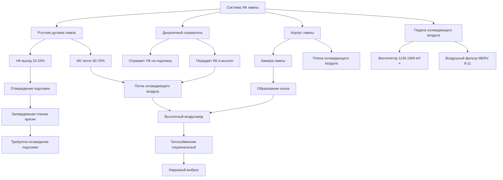

Системы ультрафиолетового отверждения полимеризуют печатные краски посредством фотохимической реакции, а не термического испарения, устраняя выбросы растворителей при одновременном введении значительных проблем охлаждения от преобразования радиационной энергии. УФ лампы преобразуют 60-70% электрического входа в инфракрасное тепло вместо полезного УФ излучения, создавая тепловые нагрузки 200-400 Вт на линейный сантиметр ширины полотна. Конструкция HVAC должна удалять это тепло из камер ламп, предотвращать повышение температуры подложки, которое ухудшает качество печати, выводить озон, образованный длинами волн ниже 240 нм, и поддерживать температуру работы лампы в диапазоне 315-480°C для оптимального УФ выхода. Ртутные дуговые и светодиодные системы представляют радикально различные тепловые профили, требующие различных стратегий охлаждения.

## Основы фотохимического отверждения

### Механизм УФ полимеризации

УФ краски содержат фотоинициаторы, которые поглощают ультрафиолетовое излучение и разлагаются на свободные радикалы, инициируя полимеризацию мономеров и олигомеров в твердые полимерные пленки. Процесс требует специфических УФ длин волн и плотностей энергии:

**УФ регионы длин волн:**

| Регион | Длина волны | Энергия | Применение |
|--------|------------|---------|-----------|
| УФ-A | 315-400 нм | 3,1-3,9 эВ | Стандартное отверждение краски |
| УФ-B | 280-315 нм | 3,9-4,4 эВ | Специализированные покрытия |
| УФ-C | 200-280 нм | 4,4-6,2 эВ | Антимикробное (нежелательное) |
| УФ-V | 395-445 нм | 2,8-3,1 эВ | Светодиодные УФ системы |

**Взаимосвязь преобразования энергии:**

$$E_{photon} = \frac{h \times c}{\lambda}$$

Где:
- $E_{photon}$ = Энергия фотона (Дж)
- $h$ = Постоянная Планка (6,626 × 10⁻³⁴ Дж·с)
- $c$ = Скорость света (3 × 10⁸ м/с)
- $\lambda$ = Длина волны (м)

Для 365 нм (пиковый выход ртутной лампы):

$$E_{photon} = \frac{6,626 \times 10^{-34} \times 3 \times 10^8}{365 \times 10^{-9}} = 5,45 \times 10^{-19} \text{ Дж} = 3,40 \text{ эВ}$$

Эта энергия управляет расщеплением фотоинициатора и инициирует полимеризацию без необходимости нагревания подложки.

### Требования энергии отверждения

**Расчет УФ дозы:**

$$D_{UV} = I \times t$$

Где:
- $D_{UV}$ = УФ доза (мДж/см²)
- $I$ = УФ интенсивность (мВт/см²)
- $t$ = Время воздействия (с)

**Время воздействия при скорости полотна:**

$$t = \frac{L_{lamp}}{v_{web}}$$

Где:
- $L_{lamp}$ = Эффективная длина лампы (ширина зоны воздействия, см)
- $v_{web}$ = Скорость полотна (см/с)

**Требуемая интенсивность:**

$$I = \frac{D_{UV} \times v_{web}}{L_{lamp}}$$

**Типичные требования отверждения:**

| Система краски | Требуемая доза | Длина лампы | Скорость полотна | Требуемая интенсивность |
|---|---|---|---|---|
| Прозрачное покрытие | 300-500 мДж/см² | 10 см | 100 м/мин | 50-83 мВт/см² |
| Белая краска | 600-1000 мДж/см² | 10 см | 100 м/мин | 100-167 мВт/см² |
| Краска с тяжелыми пигментами | 800-1500 мДж/см² | 10 см | 100 м/мин | 133-250 мВт/см² |
| Адгезивы | 400-800 мДж/см² | 10 см | 50 м/мин | 33-67 мВт/см² |

Более высокие скорости полотна или более толстые слои краски требуют пропорционально более высокой УФ интенсивности, увеличивая потребление электроэнергии и вызванное ею выделение тепла.

## Системы ртутных дуговых ламп

### Характеристики работы лампы

Лампы среднего давления с ртутной дугой работают при внутренних давлениях 2-10 атмосфер, производя интенсивное УФ излучение от возбуждения ртутного пара. Температура дуги достигает 5000-6000 К, создавая широкополосный выход с характерными линиями излучения ртути.

**Распределение спектрального выхода:**

- УФ излучение (200-400 нм): 15-25% электрического входа
- Видимый свет (400-700 нм): 10-15% электрического входа
- Инфракрасное тепло (> 700 нм): 60-70% электрического входа
- Конвективные/проводящие потери: 5-10% электрического входа

Это распределение энергии определяет фундаментальную проблему охлаждения: удаление 60-70% мощности лампы в виде отходящего тепла.

**Электрические и тепловые характеристики:**

| Параметр | Ртутная дуговая лампа | Примечания |
|----------|--------|----------|
| Плотность мощности | 200-400 Вт/см | Основание ширины полотна |
| Температура дуги | 5000-6000 К | Внутренняя плазма |
| Температура колбы | 315-480°C | Внешняя поверхность |
| Эффективность УФ преобразования | 15-25% | Полезный выход |
| Инфракрасный выход | 60-70% | Отходящее тепло |
| Срок службы лампы | 1000-2000 часов | Кривая деградации |
| Время прогрева | 3-5 минут | Тепловая стабилизация |

**Расчет теплового груза:**

Для полотна шириной 152 см с мощностью лампы 300 Вт/см:

$$Q_{total} = 152 \text{ см} \times 300 \text{ Вт/см} = 45,600 \text{ Вт} = 45,6 \text{ кВ}$$

$$Q_{heat} = 45,6 \text{ кВ} \times 0,65 = 29,6 \text{ кВ} = 101,230 \text{ кДж/ч}$$

Это представляет радиационное и конвективное тепло, которое должно быть удалено системой охлаждения.

### Требования охлаждения лампы

**Системы воздушного охлаждения:**

Ртутные лампы требуют принудительного воздушного охлаждения для поддержания температуры колбы в диапазоне работы 315-480°C:

**Расчет расхода охлаждающего воздуха:**

$$Q_{air} = \frac{Q_{heat}}{1.08 \times \Delta T}$$

Где:
- $Q_{air}$ = Расход охлаждающего воздуха (м³/ч)
- $Q_{heat}$ = Тепловая нагрузка (кДж/ч)
- $\Delta T$ = Повышение температуры (°C)

Для системы лампы 45,6 кВ (101,230 кДж/ч) с подводящим воздухом 27°C и выхлопом 121°C:

$$Q_{air} = \frac{101,230}{1.08 \times (121-27)} = \frac{101,230}{101.52} = 997 \text{ м³/ч}$$

**Практическая конструкция:** Используйте 1,135-1,530 м³/ч для компенсации:
- Неравномерного распределения тепла
- Требований охлаждения отражателя
- Запаса на пределы температуры лампы

**Методы подачи охлаждающего воздуха:**

1. **Поперечный поток:** Воздух течет перпендикулярно оси лампы
   - Распределение: Равномерно по длине лампы
   - Скорость: 60-120 м/мин на поверхности лампы
   - Воздуховодная система: Плена с несколькими выходами

2. **Осевой поток:** Воздух течет параллельно оси лампы
   - Распределение: Ввод в конец с продольным потоком
   - Скорость: 150-240 м/мин в кольцевом зазоре
   - Воздуховодная система: Проще, конструкция с одиночным входом

3. **Охлаждение ударом:** Высокоскоростные струи направлены на лампу
   - Распределение: Несколько форсунок по длине лампы
   - Скорость: 300-600 м/мин ударной скорости
   - Воздуховодная система: Коллектор с точными форсунками

**Системы водяного охлаждения:**

Лампы высокой мощности (> 400 Вт/см) могут использовать водяное охлаждение отражателя:

$$Q_{water} = \frac{Q_{heat}}{2,092 \times \Delta T}$$

Для нагрузки 45,6 кВ с повышением температуры воды 11°C:

$$Q_{water} = \frac{101,230}{2,092 \times 11} = 4,38 \text{ л/мин}$$

Вода циркулирует через каналы в корпусе отражателя, удаляя тепло до того, как оно достигнет подложки.

### Конструкция отражателя и корпуса

**Управление теплом отражателя:**

Дихроичные или холодные зеркала отражают УФ при одновременной передаче инфракрасного излучения:

- УФ отражательная способность: 85-95% (200-400 нм)
- ИК пропускание: 70-85% (> 700 нм)
- Отклонение тепла: 50-60% инфракрасного излучения лампы проходит через отражатель
- Охлаждение: Принудительное воздушное или водяное охлаждение предотвращает искажение отражателя

**Рассмотрения конструкции корпуса:**

Корпус должен изолировать камеру лампы от окружающей среды печатного станка при одновременном пропускании УФ через кварцевые окна и выпуске нагретого охлаждающего воздуха.

## Светодиодные УФ системы отверждения

### Преимущества технологии светодиодов

Светоизлучающие диоды УФ системы излучают излучение с узкой полосой пропускания на определенных длинах волн (365, 385, 395, 405 нм), согласованных со спектрами поглощения фотоинициаторов. Фундаментальное различие: светодиоды преобразуют 25-40% электрического входа в УФ свет в сравнении с 15-25% для ртутных ламп.

**Характеристики светодиодных УФ:**

| Параметр | Светодиод УФ | Ртутная лампа | Улучшение |
|----------|---|---|---|
| УФ эффективность | 25-40% | 15-25% | 1,3-2× выше |
| Генерация тепла | 60-75% | 70-85% | 15-25% меньше |
| Плотность мощности | 5-20 Вт/см² | 80-150 Вт/см | 50-70% снижение |
| Мгновенное включение/выключение | < 1 сек | 3-5 мин | Без прогрева |
| Срок службы | 20000-40000 ч | 1000-2000 ч | 15-25× больше |
| Требование охлаждения | Только воздух | Воздух или вода | Более простая система |

**Сравнение тепловых нагрузок:**

Для полотна шириной 152 см, достигающего эквивалентной энергии отверждения:

**Ртутная лампа:**
- Мощность: 152 см × 300 Вт/см = 45,6 кВ
- Тепло: 45,6 кВ × 0,65 = 29,6 кВ

**Светодиод УФ:**
- Мощность: 152 см × 2,54 см × 10 Вт/см² = 38,6 кВ
- Тепло: 38,6 кВ × 0,65 = 25,1 кВ

Светодиодные системы снижают выделение тепла на 15-20% при обеспечении эквивалентного отверждения при сравнимом общем потреблении мощности.

### Конструкция охлаждения светодиода

**Достаточность воздушного охлаждения:**

Светодиодные матрицы работают при температуре кристалла 80-120°C (176-248°F), значительно ниже температур ртутной лампы:

**Расход охлаждающего воздуха для светодиодной системы:**

Для светодиодной системы 38,6 кВ (131,700 кДж/ч теплоты) с подводящим воздухом 24°C и выхлопом 66°C:

$$Q_{air} = \frac{131,700}{1.08 \times (66-24)} = \frac{131,700}{45.36} = 2,904 \text{ м³/ч}$$

**Проектное распределение:** 3,050-3,800 м³/ч обеспечивает адекватный запас охлаждения.

**Архитектура охлаждения:**

1. **Ребристые теплоотводы:** Алюминиевые экструзии увеличивают площадь поверхности
   - Плотность ребер: 30-47 ребер на 10 см
   - Тепловое сопротивление: 0,2-0,5 °C/Вт
   - Материал: Алюминиевый сплав 6063

2. **Принудительная конвекция:** Вентиляторы подают воздух через каналы теплоотвода
   - Скорость: 90-180 м/мин
   - Статическое давление: 0,05-0,12 см вод. ст.
   - Тип вентилятора: Осевой или центробежный

3. **Контроль температуры:** Термисторы или ДТС в переходе светодиода
   - Установка: 100°C типичная
   - Аварийное отключение: 130°C максимум
   - Управление: PWM затемнение для снижения тепла на низких скоростях

**Преимущества управления теплом:**

- Более низкая температура выхлопа снижает нагрузку охлаждения здания
- Исключает инфраструктуру водяного охлаждения и обслуживание
- Снижает риск пожара от горячих поверхностей
- Позволяет модульное расширение матрицы без крупных модификаций HVAC

## Управление температурой подложки

### Поглощение радиационного тепла

Несмотря на охлаждение лампы, инфракрасное излучение, передаваемое через отражатели, нагревает подложку:

**Повышение температуры подложки:**

$$\Delta T_{substrate} = \frac{q_{rad} \times t_{exposure}}{\rho \times c_p \times h}$$

Где:
- $q_{rad}$ = Падающий радиационный поток (Вт/м²)
- $t_{exposure}$ = Время воздействия (с)
- $\rho$ = Плотность подложки (кг/м³)
- $c_p$ = Удельная теплоемкость (Дж/кг·К)
- $h$ = Толщина подложки (м)

**Пример для бумажной подложки:**

- Радиационный поток: 47,400 Вт/м² (типично под ртутной лампой)
- Время воздействия: 0,2 с (100 м/мин скорость полотна, 10 см длина лампы)
- Плотность бумаги: 700 кг/м³
- Удельная теплоемкость: 1400 Дж/кг·К
- Толщина: 0,0001 м (100 микм, 100 г/м² бумага)

$$\Delta T_{substrate} = \frac{47,400 \times 0,2}{700 \times 1,400 \times 0,0001} = \frac{9,480}{98} = 96,7 \text{ К} = 96,7°C$$

Это повышение температуры может вызвать:
- Изменения размеров бумаги (скручивание, волнистость)
- Повреждение чувствительных к теплу подложек (пластмассы, пленки)
- Дефекты потока краски от избыточной температуры
- Проблемы обработки из-за горячих полотен

### Охлаждающие валики и станции охлаждения

**Охлаждение после отверждения:**

Охлаждающие валики удаляют тепло сразу после УФ воздействия:

**Требуемая охлаждающая способность:**

$$Q_{cool} = \dot{m}_{web} \times c_p \times \Delta T$$

Для полотна 100 м/мин, ширина 1,5 м, 100 г/м² бумаги, снижение температуры 30°C:

$$\dot{m}_{web} = 100 \text{ м/мин} \times 1,5 \text{ м} \times 0,1 \text{ кг/м}^2 = 15 \text{ кг/мин} = 0,25 \text{ кг/с}$$

$$Q_{cool} = 0,25 \times 1,400 \times 30 = 10,500 \text{ Вт} = 3,0 \text{ тонны охлаждения}$$

**Конструкция охлаждающего валика:**

- Диаметр валика: 20-41 см (больший = больше контактного времени)
- Поверхность: Хромированная сталь (теплопроводность, износостойкость)
- Хладагент: Охлажденная вода 7-13°C или раствор гликоля
- Расход: 1,3-3,8 л/мин на валик
- Угол контакта: 90-180° обхват (регулируемый с помощью направляющих валиков)

**Теплопроводность валика:**

$$U_{roll} = \frac{1}{\frac{1}{h_{water}} + \frac{t_{wall}}{k_{steel}} + \frac{1}{h_{contact}}}$$

Где:
- $h_{water}$ = Коэффициент внутренней конвекции (500-1500 Вт/м²·К)
- $t_{wall}$ = Толщина стенки валика (5-10 мм)
- $k_{steel}$ = Теплопроводность стали (45 Вт/м·К)
- $h_{contact}$ = Коэффициент контакта с подложкой (50-200 Вт/м²·К)

Сопротивление контакта доминирует в тепловом пути, ограничивая эффективность теплопередачи до 60-80% от теоретического максимума.

### Воздушные ножи и конвективное охлаждение

**Охлаждение ударом воздуха:**

Высокоскоростные воздушные ножи могут дополнять или заменять охлаждающие валики:

**Конвективная теплопередача:**

$$Q_{conv} = h \times A \times \Delta T$$

$$h = 0.0128 \times \frac{k}{D} \times Re^{0.8} \times Pr^{0.33}$$

Для воздушного ножа при скорости 76 м/мин (25 м/с), зазор 0,25 мм:

- Число Рейнольдса: Re = 40000 (турбулентное)
- Коэффициент конвекции: h = 150-250 Вт/м²·К
- Эффективность охлаждения: Ниже, чем охлаждающие валики, но проще, нет водяной системы

**Применение:**

Воздушные ножи работают лучше всего для тонких пленок и низкого повышения температуры (< 20°C), в то время как охлаждающие валики обрабатывают тяжелые подложки и высокие тепловые нагрузки.

## Образование озона и контроль

### УФ-образованный озон

Ультрафиолетовое излучение ниже 240 нм длины волны диссоциирует молекулы кислорода, производя озон:

$$O_2 + h\nu_{<240nm} \rightarrow 2O^*$$

$$O^* + O_2 + M \rightarrow O_3 + M$$

Где M представляет партнера с третьим телом (N₂ или O₂).

**Скорость производства озона:**

$$\dot{m}_{O_3} = \Phi \times I_{<240nm} \times A \times \eta$$

Где:
- $\Phi$ = Квантовый выход (0,2-0,5 O₃ на фотон)
- $I_{<240nm}$ = Интенсивность УФ-C (Вт/м²)
- $A$ = Облучаемая площадь объема воздуха (м²)
- $\eta$ = Эффективность преобразования (зависит от времени пребывания, влажности)

**Ртутные лампы:** Производят значительный выход УФ-C, создавая 50-200 ppm O₃ в камере лампы

**Светодиодные лампы:** Излучают пренебрежимый УФ-C (> 365 нм), производя < 1 ppm O₃

### Пределы здоровья и безопасности

**Нормативные стандарты:**

| Регулирование | Предел | Время усреднения | Применение |
|---|---|---|---|
| OSHA PEL | 0,10 ppm | 8-час TWA | Воздействие на рабочем месте |
| NIOSH REL | 0,10 ppm | 8-час TWA | Рекомендуемый предел |
| ACGIH TLV | 0,05 ppm | 8-час TWA | Тяжелая работа |
| EPA NAAQS | 0,07 ppm | 8-час | Качество атмосферного воздуха |

**Симптомы воздействия озона:**

- 0,1-0,3 ppm: Обнаружение запаха, раздражение глаз
- 0,3-0,5 ppm: Раздражение горла, кашель
- 0,5-1,0 ppm: Дискомфорт в груди, затруднение дыхания
- > 1,0 ppm: Тяжелые симптомы дыхания, отек легких

### Системы выхлопа озона

**Выхлоп из камеры лампы:**

Прямой выхлоп УФ охлаждающего воздуха предотвращает миграцию озона в область печатного станка:

**Требование потока выхлопа:**

Для 1,135 м³/ч охлаждающего воздуха лампы, производящего 100 ppm O₃:

$$C_{diluted} = \frac{C_{source} \times Q_{source}}{Q_{source} + Q_{dilution}}$$

Для достижения 0,05 ppm в области печатного станка (при утечке 10% или 114 м³/ч):

$$0,05 = \frac{100 \times 114}{114 + Q_{dilution}}$$

$$Q_{dilution} = \frac{100 \times 114}{0,05} - 114 = 227,886 \text{ м³/ч}$$

**Практическое решение:** Полностью предотвратить утечку через герметичные корпусы ламп с отдельными выхлопными воздуховодами.

**Конструкция выхлопной системы:**

1. **Положительный выхлоп:** Поддерживайте камеру лампы при -0,01-0,02 см вод. ст. относительно области печатного станка
2. **Материалы воздуховода:** Нержавеющая сталь или покрытая сталь (озон деградирует органические материалы)
3. **Место выброса:** Минимум 3 м над кровлей, вдали от воздушных заборов
4. **Контроль:** Стационарные датчики O₃ в области печатного станка (сигнал тревоги при 0,05 ppm)

**Уничтожение озона:**

Каталитическое или термальное уничтожение преобразует O₃ в O₂:

- **Каталитическое:** Катализатор диоксида марганца при комнатной температуре, 95-99% уничтожения
- **Термальное:** Нагревание до 200-315°C, полное уничтожение
- **Угольная фильтрация:** Активированный уголь адсорбирует O₃, требует периодической замены

## Сравнение типов УФ ламп

### Производительность и требования охлаждения

| Параметр | Ртутная дуга | Металлогалогенная | Светодиод УФ | Микроволновый УФ |
|----------|---|---|---|---|
| **Электрические** |
| Плотность мощности | 200-400 Вт/см | 150-300 Вт/см | 5-20 Вт/см² | 100-200 Вт/см |
| УФ эффективность | 15-25% | 18-28% | 25-40% | 20-30% |
| Спектр | Широкий, мультипиковый | Широкий, настраиваемый | Узкий, монохроматический | Широкий, линии ртути |
| **Тепловые** |
| Выход тепла | 60-70% | 60-65% | 60-65% | 55-65% |
| Температура колбы | 315-480°C | 260-427°C | 79-121°C | 204-371°C |
| Метод охлаждения | Воздух или вода | Воздух или вода | Только воздух | Воздух |
| Охлаждающий м³/ч на кВ | 1,5-2,1 | 1,2-1,8 | 3,0-4,2 | 1,8-2,4 |
| **Эксплуатационные** |
| Время прогрева | 3-5 мин | 2-4 мин | Мгновенно | 1-2 мин |
| Срок службы | 1000-2000 ч | 2000-4000 ч | 20000-40000 ч | 5000-10000 ч |
| Мгновенный перезапуск | Нет | Нет | Да | Ограничено |
| Возможность затемнения | Нет | Ограничено | Да (0-100%) | Нет |
| **Озон** |
| Выход УФ-C | Значительный | Умеренный | Пренебрежимый | Значительный |
| Образование O₃ | 50-200 ppm | 20-100 ppm | < 1 ppm | 30-150 ppm |
| Требуется выхлоп | Да, отдельный | Да, отдельный | Минимальный | Да, отдельный |
| **Воздействие на HVAC** |
| Тепловая нагрузка на 152 см полотна | 29,6 кВ | 26,0 кВ | 25,1 кВ | 22,7 кВ |
| Охлаждающий воздухопровод | 1,330-1,700 м³/ч | 1,065-1,330 м³/ч | 2,270-3,050 м³/ч | 1,140-1,520 м³/ч |
| Температура выхлопа | 121-177°C | 93-149°C | 54-82°C | 82-138°C |
| Водяное охлаждение | Опциональное | Опциональное | Не требуется | Не требуется |
| Воздействие здания AC | Высокое | Умеренное | Умеренное-Низкое | Умеренное |

**Критерии выбора:**

- **Ртутная дуга:** Наивысшая плотность мощности, наименьшая стоимость капитала, зарекомендованная технология
- **Металлогалогенная:** Улучшенное управление спектром, более длительный срок службы, умеренная стоимость
- **Светодиод УФ:** Самая низкая операционная стоимость, самый длительный срок службы, мгновенное управление, наивысшая стоимость капитала
- **Микроволновый:** Нет электродов (более длительный срок службы), равномерный выход, умеренная стоимость

## Интеграция системы и управление

### Координация HVAC здания

**Распределение тепловой нагрузки:**

УФ системы отверждения способствуют требованиям охлаждения здания:

$$Q_{building} = Q_{lamps} + Q_{substrate} + Q_{press} + Q_{ambient}$$

Для типичного 6-цветного печатного станка с УФ покрытием:
- Тепло ламп: 45,6 кВ × 6 единиц = 273,6 кВ
- Охлаждение подложки: 3 т × 6 = 18 т охлаждения
- Приводы печатного станка: 22,4 кВ
- Окружающие нагрузки: 50 т охлаждения

Всего охлаждение: 18 т + 78,5 т + 50 т = 146,5 т охлаждения

**Стратегия вентиляции:**

- Выхлоп камеры лампы: 6,350 м³/ч (отдельный наружный выброс)
- Вентиляция области печатного станка: 0,5 ACH (система общего здания)
- Подпиточный воздух: Нагревается/охлаждается до 21°C, 50% RH (компенсация выхлопа)

**Сезонные соображения:**

- **Зима:** Тепло выхлопа ламп тратится впустую, требуется нагревание подпиточного воздуха
- **Лето:** Выхлоп ламп добавляется к отклонению тепла здания, полная работа AC
- **Рекуперация тепла:** Воздухо-воздушный теплообменник может предварительно нагревать подпиточный воздух (50-70% эффективность)

### Контроль температуры и интенсивности

**Контроль температуры лампы:**

Поддерживайте температуру колбы в оптимальном диапазоне для УФ выхода:

$$I_{UV} = I_{max} \times f(T_{bulb})$$

Где выход достигает максимума при конструкционной температуре (типично 400°C для ртутных ламп).

**Стратегия управления:**

1. **Датчики температуры:** Термопары или ИК датчики на поверхности лампы
2. **Скорость вентилятора охлаждения:** Модуляция VFD на основе обратной связи по температуре
3. **Модуляция мощности:** Снижение мощности лампы при недостаточном охлаждении (только светодиоды)
4. **Условия аварии:** Отключение при высокой температуре при 507°C (ртуть) или 149°C (светодиод)

**Измерение интенсивности:**

УФ радиометры измеряют фактическую доставленную энергию отверждения:

- **Расположение:** На плоскости подложки, между проходами лампы
- **Измерение:** Интенсивность мВт/см² и доза мДж/см²
- **Обратная связь:** Отрегулируйте скорость полотна или мощность лампы для поддержания целевого отверждения
- **Калибровка:** Ежемесячная проверка в сравнении со стандартом ссылки

### Возможности рекуперации энергии

**Использование тепла выхлопа:**

Выхлоп УФ ламп при 93-177°C предлагает потенциал рекуперации:

**Эффективность теплообменника:**

$$\varepsilon = \frac{Q_{actual}}{Q_{max}} = \frac{T_{makeup,out} - T_{makeup,in}}{T_{exhaust,in} - T_{makeup,in}}$$

Для пластинчатого теплообменника с 2,550 м³/ч выхлопом при 149°C, подпиточный воздух при 4°C:

**Теоретический максимум:**
$$Q_{max} = 2,550 \times 1.2 \times (149-4) = 445,200 \text{ кДж/ч}$$

**Фактическая рекуперация при 60% эффективности:**
$$Q_{recovered} = 445,200 \times 0.60 = 267,120 \text{ кДж/ч} = 74,2 \text{ кВ}$$

**Годовая экономия энергии (6000 операционных часов, 20 руб./ГДж газа):**
$$\text{Экономия} = \frac{267,120 \times 6,000}{10^9} \times 20 = \text{32,054 руб./год}$$

**Анализ окупаемости:**

- Стоимость теплообменника: 315,000-525,000 руб. установленного
- Годовая экономия: 32,000 руб.
- Простая окупаемость: 10-16 лет

**Рассмотрения внедрения:**

- Озон в потоке выхлопа деградирует материалы обычного теплообменника
- Каталитическое разрушение O₃ перед теплообменником продлевает срок его жизни
- Светодиодные системы с более низкой температурой выхлопа снижают потенциал рекуперации
- Интеграция с системой отопления здания требуется для полного использования

## Лучшие практики проектирования

**Контрольный список конструкции HVAC УФ системы:**

1. **Адекватность охлаждения лампы**
   - Рассчитайте тепловую нагрузку по спецификациям производителя
   - Размер охлаждающего воздухопровода для повышения температуры 17-28°C
   - Предусмотрите управление VFD для модуляции скорости вентилятора
   - Установите контроль температуры и отключение по высокому пределу

2. **Управление температурой подложки**
   - Оцените радиационный нагрев из выхода лампы ИК
   - Спроектируйте охлаждающую способность валика для наихудшей тепловой нагрузки
   - Рассмотрите дополнение воздушного ножа для чувствительных подложек
   - Контролируйте температуру полотна после отверждения

3. **Управление озоном**
   - Герметизируйте корпусы ламп с прокладками и блокировками
   - Выхлопите охлаждающий воздух лампы непосредственно на открытый воздух
   - Установите стационарные датчики O₃ в области печатного станка
   - Используйте нержавеющую сталь или покрытые воздуховоды
   - Предусмотрите подпиточный воздух для замены выхлопа

4. **Энергетическая эффективность**
   - Оцените светодиоды УФ для новых установок (70% снижение энергии)
   - Спроектируйте рекуперацию тепла для выхлопа ртутной лампы
   - Интегрируйте с автоматизацией здания для оптимизированного управления
   - Рассмотрите модульные матрицы ламп для соответствия производственному спросу

5. **Системы безопасности**
   - Заблокируйте УФ лампы с работой печатного станка
   - Предусмотрите системы затворов для блокировки УФ при остановке полотна
   - Установите датчики УФ воздействия в областях оператора
   - Аварийное отключение доступно со всех станций

**Доступ на обслуживание:**

- Замена лампы: Ежемесячно до ежеквартально (ртуть) или многолетие (светодиод)
- Очистка отражателя: Еженедельно до ежемесячно (поддерживает 90%+ отражательную способность)
- Фильтры системы охлаждения: Ежемесячная проверка, ежеквартальная замена
- Датчики озона: Ежегодная калибровка, замена каждые 2 года

**Будущие тренды:**

- Принятие светодиодов УФ ускоряется (50% новых установок к 2025)
- Светодиодные матрицы более высокой мощности, обеспечивающие более высокие скорости полотна
- Улучшенное управление теплом, снижающее требования охлаждения
- Интеграция контроля отверждения УФ с управлением качеством печатного станка
- Системы светодиодов с водяным охлаждением для приложений с ультравысокой мощностью

Переход от ртутной к светодиодной технологии УФ кардинально изменяет требования HVAC, снижая пиковые температуры с 480°C до 121°C и устраняя проблемы озона при одновременном предоставлении мгновенного управления включением/выключением, которое минимизирует потерю тепла во время остановок производства. Проектирование как для текущих ртутных систем, так и для будущих светодиодных модификаций требует гибких воздуховодов, избыточной охлаждающей способности и модульных выхлопных решений, которые адаптируют любую технологию без основной реконструкции.
