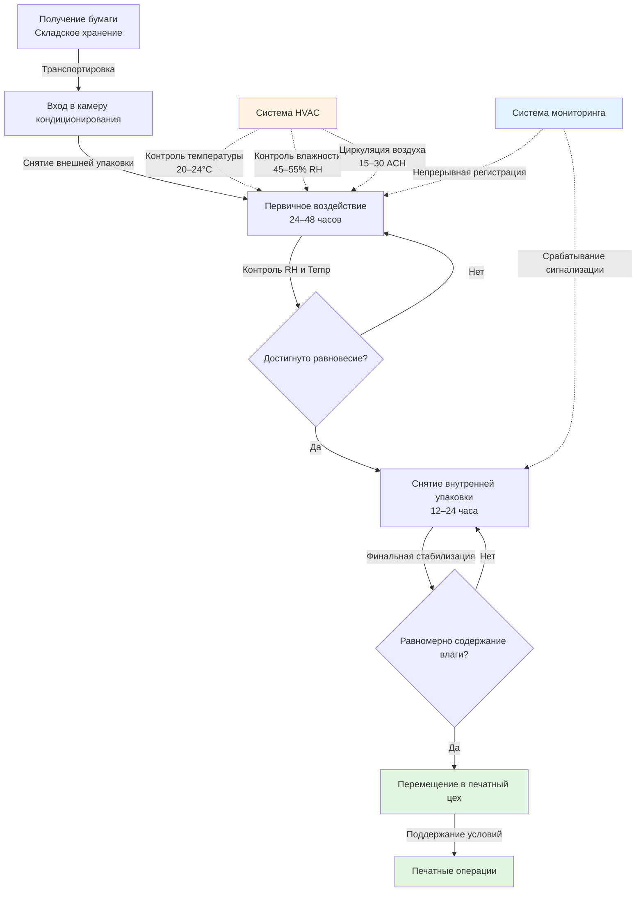

## Гигроскопическое поведение бумаги

Бумага является гигроскопичным материалом, который непрерывно обменивается влагой с окружающим воздухом до достижения равновесия. Этот обмен влагой напрямую влияет на размерную стабильность, точность совмещения красок и поверхностные свойства.

Равновесное содержание влаги (EMC) в бумаге подчиняется адсорбционно-десорбционной зависимости, управляемой условиями окружающей среды. В состоянии равновесия скорость поглощения влаги равна скорости десорбции:

$$\frac{dM}{dt} = 0$$

где $M$ — содержание влаги в бумаге (% по массе).

Содержание влаги в равновесии связано с относительной влажностью через сорбционный изотерм, аппроксимируемый уравнением Хендерсона:

$$\text{RH} = 100 \left[1 - e^{-k_1 T (M)^{k_2}}\right]$$

где:
- RH = относительная влажность (%)
- $T$ = абсолютная температура (K)
- $M$ = равновесное содержание влаги (доля единицы)
- $k_1$, $k_2$ = константы, специфичные для материала

Для типичных печатных бумаг содержание влаги изменяется в зависимости от относительной влажности согласно:

$$M = \frac{18 \cdot K \cdot \text{RH}}{(100 - \text{RH}) + K \cdot \text{RH}}$$

где $K$ — гигроскопический коэффициент бумаги (обычно 0,8–1,2 для печатных бумаг).

## Процесс кондиционирования бумаги

Бумага должна акклиматизироваться к условиям печатного цеха в течение 24–72 часов перед использованием, чтобы предотвратить изменения размеров во время печати. Процесс кондиционирования следует определенной последовательности:

## Требования к размерной стабильности

Размеры бумаги изменяются в зависимости от содержания влаги согласно коэффициенту гигроскопического расширения:

$$\Delta L = L_0 \cdot \alpha_h \cdot \Delta M$$

где:
- $\Delta L$ = изменение размеров (мм)
- $L_0$ = исходный размер (мм)
- $\alpha_h$ = коэффициент гигроскопического расширения (0,01–0,015 на 1% изменения влаги)
- $\Delta M$ = изменение содержания влаги (%)

Для многокрасочной печати, требующей совмещения в пределах ±0,1 мм, допустимое изменение содержания влаги составляет:

$$\Delta M_{\text{max}} = \frac{\Delta L_{\text{tol}}}{L \cdot \alpha_h} = \frac{0,1}{L \cdot 0,012}$$

Для рулона шириной 1000 мм это ограничивает изменение влаги величиной ±0,8%, требуя строгого контроля влажности (±3% RH).

## Требования к кондиционированию по типу бумаги

Различные сорта бумаги требуют специфических условий окружающей среды для оптимальной размерной стабильности и качества печати:

| Тип бумаги | Целевая RH (%) | Допуск RH (±%) | Целевая температура (°C) | Время кондиционирования (часы) | Целевое содержание влаги (%) |
|------------|----------------|----------------|--------------------------|--------------------------------|------------------------------|
| Офсетная мелованная | 50–55 | 2–3 | 21–24 | 48–72 | 5,5–6,5 |
| Офсетная немелованная | 45–50 | 3–4 | 20–23 | 36–48 | 6,0–7,0 |
| Газетная бумага | 45–50 | 4–5 | 20–22 | 24–36 | 7,0–8,0 |
| Мелованная книжная | 48–52 | 2 | 21–23 | 48–72 | 5,0–6,0 |
| Этикеточная бумага | 50–55 | 2 | 22–24 | 48–96 | 5,5–6,5 |
| Писчая/Бумага для документов | 45–50 | 3 | 20–23 | 24–48 | 5,5–6,5 |
| Гофрокартон | 50–60 | 5 | 21–27 | 24–48 | 8,0–10,0 |

## Соображения по проектированию системы HVAC

### Контроль температуры

Поддерживайте стабильную температуру в пределах ±1,1°C для предотвращения колебаний относительной влажности. Зависимость между изменением температуры и отклонением RH при постоянной абсолютной влажности:

$$\frac{\Delta \text{RH}}{\text{RH}} \approx -\frac{\Delta T}{T} \cdot \left(5 - \frac{T_{\text{dp}}}{T}\right)$$

где $T_{\text{dp}}$ — температура точки росы.

Падение температуры на 2,8°C при 21,1°C и относительной влажности 50% приводит к увеличению относительной влажности примерно на 10%, что может вызвать поглощение бумагой избыточной влаги.

### Контроль влажности

Активные системы увлажнения и осушения поддерживают целевую относительную влажность. Требуемая скорость добавления влаги:

$$\dot{m}_w = \frac{\rho \cdot Q \cdot (\omega_{\text{set}} - \omega_{\text{in}})}{60}$$

где:
- $\dot{m}_w$ = скорость добавления влаги (кг/ч)
- $\rho$ = плотность воздуха (кг/м³)
- $Q$ = расход воздуха (м³/ч)
- $\omega$ = влагосодержание (кг влаги/кг сухого воздуха)

### Распределение воздуха

Равномерное распределение воздуха предотвращает возникновение локальных градиентов влажности. Скорость воздуха над стопками бумаги не должна превышать 0,25 м/с (15-30 воздухообменов в час), чтобы избежать поверхностного высыхания при обеспечении достаточного перемешивания.

## Отраслевые стандарты

**GATF (Graphic Arts Technical Foundation)** рекомендует температуру 20-22,2°C и относительную влажность 45-55% для большинства печатных операций.

**TAPPI T402** устанавливает стандартные условия кондиционирования при температуре 22,8°C ± 1,1°C и относительной влажности 50% ± 2% для испытаний бумаги.

**ISO 187** определяет условия кондиционирования при температуре 23°C ± 1°C и относительной влажности 50% ± 2% как международную стандартную атмосферу для испытаний бумаги.

## Мониторинг и управление

Реализуйте непрерывный мониторинг с датчиками, распределенными по всему помещению кондиционирования (минимум один датчик на 186 м²). Интервалы регистрации данных не должны превышать 15 минут для фиксации переходных процессов, влияющих на качество бумаги.

Критические пороги сигнализации обычно устанавливаются на уровне:
- Высокая относительная влажность: +5% выше уставленного значения
- Низкая относительная влажность: -5% ниже уставленного значения
- Высокая температура: +1,7°C выше уставленного значения
- Низкая температура: -1,7°C ниже уставленного значения

Эти пороги обеспечивают баланс между эксплуатационной гибкостью и требованиями к качеству бумаги, предотвращая условия, вызывающие размерную нестабильность, и избегая ложных срабатываний сигнализации.
