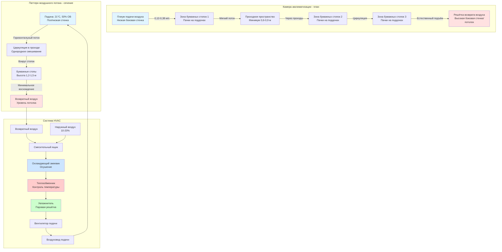

# Акклиматизация бумаги для печатного производства

Акклиматизация бумаги — это контролируемый процесс приведения запасов бумаги в состояние влагового равновесия с окружающей средой печатного цеха перед печатью. Этот критически важный этап предотвращает размерные изменения во время печати, которые могут привести к ошибкам приводки, разрывам полотна и дефектам качества. Процесс управляется физикой диффузии, при этом время уравновешивания колеблется от 24 часов для лёгких листов до 72+ часов для тяжёлого картона, в зависимости от толщины стопы, проницаемости и условий окружающей среды.

## Основы диффузии

### Механизм переноса влаги

Движение влаги через бумагу подчиняется второму закону диффузии Фика:

$$\frac{\partial C}{\partial t} = D \frac{\partial^2 C}{\partial x^2}$$

Где:
- $C$ = Концентрация влаги (кг воды/кг сухого волокна)
- $t$ = Время (часы)
- $D$ = Коэффициент диффузии (см²/ч)
- $x$ = Расстояние через толщину бумаги (см)

**Физическая интерпретация:** Градиенты концентрации влаги движут молекулы воды из областей высокой концентрации в области низкой концентрации через пористую волокнистую сеть. Коэффициент диффузии $D$ зависит от пористости бумаги, структуры волокна и температуры.

**Типичные коэффициенты диффузии:**

| Тип бумаги | Пористость | D (см²/ч) | Относительная скорость |
|------------|-----------|-----------|----------------------|
| Газетная бумага | Высокая (60-70%) | 0,024-0,040 | Быстрая |
| Немелованный офсет | Средняя (50-60%) | 0,013-0,024 | Умеренная |
| Мелованный глянец | Низкая (30-40%) | 0,005-0,013 | Медленная |
| Картон | Низкая (25-35%) | 0,003-0,008 | Очень медленная |

**Критическое наблюдение:** Слои мелования значительно снижают скорость диффузии, герметизируя поверхность волокна и уменьшая проницаемость. Двусторонне мелованные материалы требуют акклиматизации в 2-3 раза дольше, чем немелованные бумаги аналогичной массы.

### Влияние температуры на диффузию

Коэффициент диффузии экспоненциально возрастает с температурой (соотношение Аррениуса):

$$D(T) = D_0 \times e^{-E_a/(RT)}$$

Где:
- $D_0$ = Предэкспоненциальный множитель (см²/ч)
- $E_a$ = Энергия активации (кДж/моль)
- $R$ = Газовая постоянная (8,314 Дж/моль·К)
- $T$ = Абсолютная температура (К)

**Практическое влияние:**

Увеличение температуры хранения с 18°C до 24°C:
- Отношение температур: (24+273)/(18+273) = 1,019
- Увеличение скорости диффузии: ~15-20%
- Снижение времени акклиматизации: 12-16 часов → 10-14 часов

**Рекомендация по проектированию:** Поддерживайте температуру в камерах акклиматизации на уровне 21-24°C для ускорения уравновешивания, при этом избегайте тепловых повреждений и избыточного потребления энергии выше 27°C.

## Расчёты времени акклиматизации

### Упрощённый метод оценки

Для стопок бумаги, в которых влага должна диффундировать через несколько листов, характерное время акклиматизации рассчитывается как:

$$t_{acclim} = \frac{L^2}{4D}$$

Где:
- $t_{acclim}$ = Время достижения 95% равновесия (часы)
- $L$ = Половина толщины стопы (см)
- $D$ = Коэффициент диффузии (см²/ч)

**Пример расчёта:**

Поддон мелованной офсетной бумаги:
- Высота стопы: 91 см
- Половина толщины: $L = 45,7$ см
- Коэффициент диффузии: $D = 0,010$ см²/ч

$$t_{acclim} = \frac{(45,7)^2}{4 \times 0,010} = \frac{2089}{0,040} = 52225 \text{ часов} = 2176 \text{ дней}$$

**Критическое понимание:** Этот расчёт показывает, почему полная акклиматизация поддона нецелесообразна. Упаковочная пленка должна быть удалена, а стопы разобраны для обеспечения диффузии с краёв со всех сторон.

### Оптимизация конфигурации стопы

**Акклиматизация на уровне пачек (рекомендуемый подход):**

Отдельные пачки (500 листов) уложены с воздушными зазорами:
- Толщина пачки: ~5 см
- Половина толщины: $L = 2,5$ см
- Коэффициент диффузии: $D = 0,010$ см²/ч

$$t_{acclim} = \frac{(2,5)^2}{4 \times 0,010} = \frac{6,25}{0,040} = 156 \text{ часов} \approx 44 \text{ часа}$$

**Стандартная практика:** Предусмотрите 48-72 часа для акклиматизации на уровне пачки для обеспечения полного уравновешивания через центр стопы.

### Детальное время акклиматизации по массе бумаги

Следующая таблица содержит время акклиматизации для стопок бумаги, сконфигурированных как отдельные пачки с воздушными зазорами 2,5-5 см для диффузии с краёв:

| Масса основы | Тип бумаги | Толщина пачки | D (см²/ч) | 95% уравновешивание | Рекомендуемое |
|--------------|-----------|---------------|-----------|-------------------|--------------|
| 75 г/м² текст | Немелованная бумага | 3,8 см | 0,019 | 24 часа | 30 часов |
| 185 г/м² текст | Немелованный офсет | 5,1 см | 0,016 | 34 часа | 40 часов |
| 220 г/м² текст | Мелованный глянец | 5,6 см | 0,010 | 56 часов | 65 часов |
| 295 г/м² текст | Мелованный глянец | 7,1 см | 0,010 | 90 часов | 96 часов |
| 370 г/м² обложка | Мелованная обложка | 4,6 см | 0,008 | 70 часов | 78 часов |
| 360 г/м² картон | Картон SBS | 3,0 см | 0,006 | 82 часа | 90 часов |

**Конструктивные соображения:**
- Времена предполагают разворачивание пачек или упаковку в перфорированную тару
- Сплошная полиэтиленовая упаковка блокирует передачу влаги (удаляйте за 24+ часа до использования)
- Циркуляция воздуха вокруг стопок снижает сопротивление пограничного слоя
- Более высокая влажность окружающей среды слегка ускоряет уравновешивание (влага на поверхности увеличивает диффузию)

## Проектирование камеры акклиматизации

### Спецификации контроля окружающей среды

**Целевые условия (согласно TAPPI T402):**

| Параметр | Спецификация | Допуск | Способ контроля |
|----------|-------------|--------|-----------------|
| Температура | 23°C ± 1°C | ±1°C | Прецизионная система HVAC |
| Относительная влажность | 50% ± 2% ОВ | ±2% ОВ | Увлажнение/осушение |
| Скорость воздуха | 0,12-0,38 м/с | Мягкая циркуляция | Низкоскоростное распределение |
| Однородность (пространственная) | ±1°C, ±1% ОВ | В пределах помещения | Несколько точек подачи |

**Стандартное кондиционирование TAPPI:** 23°C и 50% ОВ представляет "стандартную атмосферу" для тестирования и контроля качества. Многие коммерческие объекты используют 21-24°C и 45-55% ОВ как приемлемый диапазон работы.

**Критические требования проектирования:**
- Стабильность температуры предотвращает циклирование, которое вызывает поступление/удаление влаги из бумаги
- Точность ОВ обеспечивает согласованное содержание влаги в равновесии (ОСВ)
- Низкая скорость воздуха предотвращает высыхание поверхности, которое создаёт градиенты влаги
- Пространственная однородность исключает вариации между различными местами хранения

### Компоновка помещения и стратегия воздушного потока

**Подход к проектированию:**

1. **Распределение подачи воздуха:** Решётки на низкой боковой стенке или диффузоры на полу подают кондиционированный воздух горизонтально по помещению со скоростью 0,12-0,38 м/с
2. **Расположение стопок:** Поддоны расположены рядами с проходами 0,6-0,9 м между ними для проникновения воздушного потока
3. **Место возврата воздуха:** Решётка на высокой боковой стенке или потолок захватывает воздух после циркуляции через зону хранения
4. **Воздухообмены:** 4-8 кратных обменов обеспечивает адекватное смешивание без чрезмерной скорости

### Лучшие практики конфигурации хранения

**Укладка на поддоны:**
- Удалите сплошную полиэтиленовую упаковку (блокирует передачу влаги)
- Разделите пачки прокладками 2,5-5 см (деревянные полосы, пластиковая сетка)
- Поддерживайте зазор 15-30 см между рядами поддонов (доступ для воздушного потока)
- Ограничьте высоту стопы 1,2-1,5 м (устойчивость и воздушный поток)

**Вместимость помещения:**
- Предусмотрите 2,3-2,8 м² площади пола на поддон (включая проходы)
- Типичное помещение: 186 м² хранит 60-80 поддонов
- Скорость производства определяет требуемую вместимость (3-7 дней запасов)

**Управление FIFO:**
- Пометьте поддоны датой поступления и временем начала акклиматизации
- Используйте самые старые запасы в первую очередь (принцип первый поступил — первый отпустил)
- Минимум 48 часов акклиматизации перед передачей на печатный станок
- Электронная система отслеживания предотвращает преждевременное использование

## Стандарты кондиционирования TAPPI

### Стандартное кондиционирование TAPPI T402

**Назначение:** Установить однородное содержание влаги для процедур тестирования и контроля качества.

**Стандартная атмосфера:**
- Температура: 23°C ± 1°C
- Относительная влажность: 50% ± 2% ОВ
- Время уравновешивания: Минимум 24 часа или до расхождения последовательных взвешиваний через 1 час менее 0,25%

**Кондиционирование тестовых образцов:**

Для лабораторного тестирования (прочность на разрыв, сопротивление разрыву, размерная стабильность):
1. Поместите образцы в камеру кондиционирования при стандартной атмосфере
2. Обеспечьте беспрепятственную циркуляцию воздуха вокруг образцов
3. Контролируйте изменение веса до достижения равновесия (изменение <0,1% в час)
4. Типичное уравновешивание: 4-24 часа в зависимости от толщины образца

**Содержание влаги в равновесии (ОСВ) при 23°C, 50% ОВ:**

| Тип бумаги | ОСВ (%) | Основание |
|-----------|---------|----------|
| Газетная бумага | 7,5-8,5% | % влаги/сухой вес |
| Немелованный офсет | 6,5-7,5% | % влаги/сухой вес |
| Мелованный глянец | 5,0-6,0% | % влаги/сухой вес |
| Картон | 6,0-7,0% | % влаги/сухой вес |

**Применение контроля качества:** Поддерживайте бумагу при ОСВ, соответствующем условиям печатного цеха, предотвращает размерные изменения во время печати.

### Измерение содержания влаги TAPPI T410

**Метод высушивания в печи (стандартный эталон):**

1. Взвесьте кондиционированный образец с точностью до 0,001 г
2. Высушите в печи с принудительной циркуляцией воздуха при 105°C ± 2°C в течение минимум 4 часов
3. Охладите в эксикаторе до комнатной температуры
4. Взвесьте высушенный в печи образец
5. Рассчитайте содержание влаги:

$$MC = \frac{W_{wet} - W_{dry}}{W_{dry}} \times 100\%$$

**Полевой метод проверки (анализатор влаги с галогеновым нагревом):**

Быстрое измерение (3-5 минут) с использованием:
- Прецизионные весы (разрешение 0,001 г)
- Элемент нагрева галогеном (обычно 150°C)
- Мониторинг веса в реальном времени
- Автоматическое отключение при стабилизации веса

**Критерии приёмки:**
- Бумага печатного цеха: ОВ в пределах ±1% от целевого ОСВ
- Пример: целевая 50% ОВ (ОСВ = 7,0%) → приемлемый диапазон 6,5-7,5%
- Материал вне спецификации требует дополнительного времени акклиматизации

## Устранение неполадок акклиматизации

### Неадекватное время уравновешивания

**Симптом:** Бумага показывает размерное изменение во время печати, несмотря на период акклиматизации.

**Коренные причины:**
- Недостаточно времени для диффузии через центр стопы
- Полиэтиленовая упаковка не удалена (блокирует передачу влаги)
- Конфигурация стопы слишком плотная (отсутствуют воздушные зазоры между пачками)

**Диагностический тест:**

Измерьте содержание влаги наружных и внутренних листов в пачке:
- Приемлемо: < 0,5% разница ОВ
- Проблема: > 1,0% разница ОВ указывает на неполное уравновешивание

**Исправление:**
- Продлите период акклиматизации на 24-48 часов
- Разберите крупные стопы на меньшие единицы с воздушными зазорами
- Убедитесь в удалении упаковки и адекватной циркуляции воздуха

### Вариация окружающей среды

**Симптом:** Содержание влаги в бумаге варьируется между различными местами хранения в камере акклиматизации.

**Коренные причины:**
- Температурная стратификация (тёплый потолок, холодный пол)
- Вариация ОВ (неадекватное смешивание, локальное увлажнение)
- Мёртвые зоны (недостаточная циркуляция воздуха)

**Протокол измерения:**

Проведите обследование условий помещения в нескольких местах:
- 9-точечная сетка (рисунок 3×3 на уровне поддона)
- Измерьте T и ОВ в каждой точке
- Приемлемая вариация: ±1°C, ±2% ОВ
- Проблемная вариация: >±1°C, >±3% ОВ

**Исправление:**
- Увеличьте циркуляцию воздуха (выше производительность вентилятора или потолочные вентиляторы)
- Добавьте диффузоры подачи для исключения мёртвых зон
- Переместите решётки возврата для улучшения воздушных потоков
- Установите распределительный коллектор увлажнителя (несколько точек впрыска)

### Несоответствие печатного цеха

**Симптом:** Бумага, уравновешенная к условиям камеры акклиматизации, изменяет размеры при передаче на печатный цех.

**Коренная причина:** Условия в камере акклиматизации отличаются от условий печатного цеха.

**Пример сценария:**
- Камера акклиматизации: 23°C, 50% ОВ (ОСВ = 7,0%)
- Печатный цех: 21°C, 55% ОВ (ОСВ = 7,5%)
- Размерное изменение: 0,3-0,5% расширение после передачи

**Решение:**

Согласуйте условия камеры акклиматизации с условиями печатного цеха:
1. Проведите обследование фактических условий T и ОВ печатного цеха во время производственного цикла
2. Рассчитайте средневзвешенные условия по времени
3. Установите камеру акклиматизации в соответствие со средними условиями печатного цеха (±1°C, ±1% ОВ)
4. Проверьте измерениями содержания влаги перед печатью

**Альтернативный подход:** Проведите кондиционирование к условиям печатного цеха с буфером ±1% ОВ для учёта суточных колебаний без превышения допусков приводки.

## Интеграция системы с операциями печати

### Планирование рабочего процесса

**Рассмотрения при планировании производства:**

Минимальное прошедшее время от поступления до печати:
- Поступление и проверка бумаги: 4 часа
- Разборка поддона и подготовка к акклиматизации: 2 часа
- Период акклиматизации: 48-72 часа (зависит от типа бумаги)
- Передача на печатный цех и подготовка станка: 2-4 часа
- **Общее время ожидания: 60-80 часов (2,5-3,5 дня)**

**Управление запасами:** Поддерживайте 5-7 дней акклиматизированных запасов для непрерывного производства без спешных работ с неуравновешенной бумагой.

### Протокол проверки качества

**Предпечатный контрольный список:**

1. **Визуальная проверка:**
   - Отсутствие видимой влаги (конденсация, влажность)
   - Отсутствие волнистости или вогнутости краёв (индикаторы градиента влаги)
   - Согласованный внешний вид во всех пачках

2. **Проверка содержания влаги:**
   - Отберите образцы из 3-5 пачек из разных мест на поддоне
   - Измерьте ОВ с использованием анализатора влаги с галогеновым нагревом или методом печи
   - Приёмка: все образцы в пределах ±0,5% целевого ОСВ

3. **Тест размерной стабильности (критические работы):**
   - Кондиционируйте тестовый лист к атмосфере печатного цеха (минимум 4 часа)
   - Измерьте размеры с прецизионной линейкой (разрешение 0,025 см)
   - Передайте на изменённую среду ОВ (+10% ОВ)
   - Переизмерьте через 1 час воздействия
   - Приемлемое изменение: < 0,025 см на 1,0 м длины

**Документирование:** Запишите время начала/конца акклиматизации, условия окружающей среды, измерения содержания влаги и подпись одобрения перед передачей запасов в производство.

---

*Акклиматизация бумаги — это ограниченный диффузией процесс, требующий 48-72 часов для влагораспределения через стопы толщины пачки при контролируемых условиях температуры и влажности, соответствующих окружающей среде печатного цеха. Время акклиматизации пропорционально квадрату толщины стопы и обратно пропорционально коэффициенту диффузии. Надлежащая конфигурация хранения и управление окружающей среде критически важны для поддержания размерной стабильности во время высококачественных печатных операций.*
