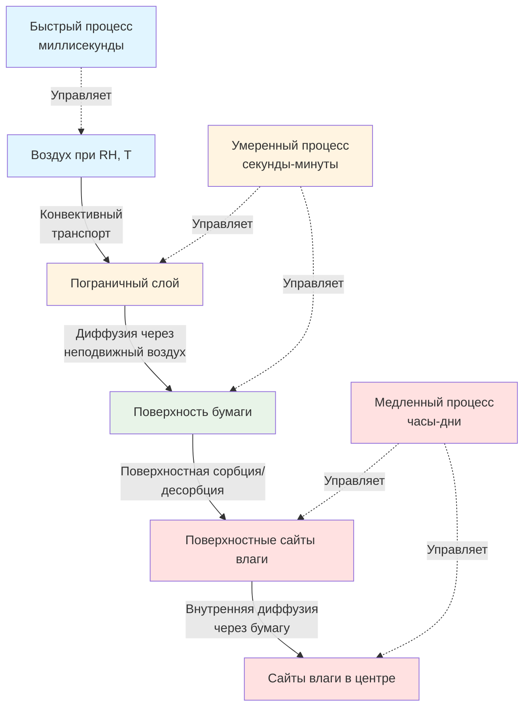

Влажностное равновесие между бумагой и окружающим воздухом определяет стабильность размеров, электрические свойства и качество печати в операциях коммерческой печати. Понимание термодинамики равновесной влажности (EMC) и кинетики диффузии позволяет разработать точную систему управления окружающей средой для систем кондиционирования бумаги. Этот физический подход гарантирует, что бумага достигает стабильного содержания влаги перед входом в печатный станок, предотвращая ошибки совмещения, коробление и проблемы с статическим электричеством.

## Основы гигроскопического равновесия

Бумага ведёт себя как гигроскопический материал—постоянно обмениваясь влагой с окружающим воздухом до установления термодинамического равновесия между давлением паров в воздухе и давлением паров в структуре бумаги.

### Равновесие давления паров

Влажностное равновесие наступает, когда парциальное давление водяного пара в воздухе равно давлению паров на поверхности бумаги:

$$p_{air} = p_{surface}$$

При равновесии:

$$p_{air} = RH \cdot p_{sat}(T)$$

$$p_{surface} = a_w \cdot p_{sat}(T)$$

Где:
- $p_{air}$ = парциальное давление водяного пара в воздухе (кПа)
- $p_{surface}$ = давление паров на поверхности бумаги (кПа)
- $RH$ = относительная влажность (десятичное число, 0-1)
- $a_w$ = активность воды в бумаге (десятичное число, 0-1)
- $p_{sat}(T)$ = давление насыщенного пара при температуре $T$ (кПа)

Таким образом, при равновесии: $a_w = RH$

Эта фундаментальная зависимость связывает относительную влажность воздуха с содержанием влаги в бумаге через изотерму сорбции.

### Сайты связывания влаги в волокнах целлюлозы

Молекулярная структура целлюлозы предоставляет три различных механизма связывания влаги:

**Первичные гидроксильные сайты:** Гидроксильные группы (-OH) в молекулах целлюлозы образуют водородные связи с отдельными молекулами воды. Эти сайты заполняются первыми при низкой относительной влажности (0-20%), создавая плотно связанный мономолекулярный слой воды. Энергия связывания: 42-50 кДж/моль.

**Вторичные гидроксильные сайты:** Дополнительные гидроксильные группы становятся доступными, когда начальные молекулы воды незначительно разделяют цепи целлюлозы. Заполняются при умеренной относительной влажности (20-50%). Энергия связывания: 25-33 кДж/моль.

**Капиллярные пространства:** Микроскопические пустоты между волокнами и слоями стенок ячеек волокон заполняются путём капиллярной конденсации при высокой относительной влажности (50-95%). Вода существует в жидком состоянии в этих пространствах. Энергия связывания приближается к теплоте испарения: 44 кДж/моль при 23°C.

Распределение по этим трём категориям определяет форму изотермы сорбции и отклик при гигрорасширении.

### Активность воды и EMC

Активность воды $a_w$ количественно определяет доступность влаги в структуре бумаги:

$$a_w = \frac{p_{surface}}{p_{sat}(T)}$$

При равновесии активность воды равна относительной влажности:

$$a_w = RH$$

Эта зависимость позволяет рассчитать равновесную влажность из относительной влажности, используя эмпирически определённые изотермы сорбции, специфичные для каждого сорта бумаги.

## Модели изотерм сорбции

Изотермы сорбции математически описывают зависимость между равновесным содержанием влаги и относительной влажностью при постоянной температуре. Существует несколько моделей с различной точностью и сложностью.

### Модель Guggenheim-Anderson-de Boer (GAB)

Уравнение GAB обеспечивает наиболее точное предсказание EMC по всему диапазону относительной влажности (0-95%):

$$EMC = \frac{M_0 \cdot C \cdot K \cdot a_w}{(1 - K \cdot a_w)[1 + (C - 1) \cdot K \cdot a_w]}$$

Где:
- $EMC$ = равновесная влажность (% на сухой основе)
- $M_0$ = влажность мономолекулярного слоя (%)
- $C$ = константа Guggenheim, связанная с энергией сорбции мономолекулярного слоя
- $K$ = коэффициент, связанный со свойствами многослойной сорбции
- $a_w$ = активность воды = $RH/100$ (десятичное число)

**Типичные значения параметров для печатных бумаг:**

| Тип бумаги | $M_0$ (%) | $C$ | $K$ | Диапазон относительной влажности |
|------------|-----------|-----|-----|----------------------------------|
| Мелованная офсетная | 4,2-4,8 | 8-12 | 0,80-0,88 | 10-90% RH |
| Немелованная офсетная | 5,0-6,0 | 6-10 | 0,82-0,92 | 10-90% RH |
| Мелованная этикеточная | 3,8-4,5 | 10-15 | 0,78-0,85 | 10-90% RH |
| Газетная | 5,5-6,5 | 5-8 | 0,85-0,94 | 10-90% RH |

Влажность мономолекулярного слоя $M_0$ представляет уровень влажности, при котором полный единственный слой молекул воды покрывает все доступные гидроксильные сайты целлюлозы—обычно происходит при 20-25% относительной влажности.

### Уравнение Henderson

Уравнение Henderson предлагает более простую двухпараметрическую аппроксимацию с хорошей точностью в рабочем диапазоне (30-70% RH):

$$EMC = \left[-\frac{\ln(1 - RH/100)}{A}\right]^{1/B}$$

Где $A$ и $B$ — эмпирические константы.

Для типичной мелованной офсетной бумаги: $A = 0,00085$, $B = 1,45$

Эта модель особенно полезна для расчётов систем управления HVAC, где имеет значение вычислительная простота.

### Линейная аппроксимация

В узком рабочем диапазоне, типичном для печатных предприятий (45-55% RH), линейная аппроксимация обеспечивает адекватную точность:

$$EMC \approx m \cdot RH + b$$

Для мелованной бумаги при 23°C:
- $m = 0,095$ до 0,105 (%/% RH)
- $b = 2,8$ до 3,2 (%)

**Пример расчёта:**
При 50% RH: $EMC = 0,10 \times 50 + 3,0 = 8,0\%$

Эта упрощённая зависимость позволяет быстро оценить изменения содержания влаги вследствие колебаний относительной влажности.

### Влияние температуры на сорбцию

Температура существенно влияет на изотерму сорбции через термодинамические и кинетические механизмы. Более высокая температура снижает EMC при постоянной относительной влажности из-за повышенной молекулярной энергии, преодолевающей водородные связи.

Модифицированное уравнение GAB учитывает зависимость от температуры:

$$M_0(T) = M_{0,ref} \cdot \exp\left[\frac{\Delta H_m}{R}\left(\frac{1}{T} - \frac{1}{T_{ref}}\right)\right]$$

$$C(T) = C_{ref} \cdot \exp\left[\frac{\Delta H_C}{R}\left(\frac{1}{T} - \frac{1}{T_{ref}}\right)\right]$$

Где:
- $\Delta H_m$ = энтальпия сорбции мономолекулярного слоя (обычно 8400-12600 кДж/кмоль)
- $\Delta H_C$ = дифференциальная энтальпия (обычно 6300-10500 кДж/кмоль)
- $R$ = универсальная газовая постоянная (8,314 Дж/моль·K)
- $T$ = абсолютная температура (K)
- $T_{ref}$ = эталонная температура (обычно 296 K = 23°C)

Практическое воздействие: повышение температуры на 5,6°C снижает EMC примерно на 0,3-0,5% при 50% RH.

## Равновесная влажность при рабочих условиях

Печатные предприятия обычно работают в узком диапазоне окружающих условий. Понимание значений EMC в этом диапазоне позволяет осуществлять точное управление влажностью.

### Таблица EMC для типичных условий печати

Равновесная влажность для стандартной мелованной офсетной бумаги (параметры GAB: $M_0 = 4,5\%$, $C = 10$, $K = 0,84$):

| RH (%) | EMC при 21°C (%) | EMC при 23°C (%) | EMC при 24°C (%) | $\Delta EMC/°C$ (%/°C) |
|--------|-----------------|-----------------|-----------------|----------------------|
| 35 | 6,2 | 6,0 | 5,8 | -0,07 |
| 40 | 6,8 | 6,6 | 6,4 | -0,07 |
| 45 | 7,4 | 7,2 | 7,0 | -0,07 |
| 50 | 8,1 | 7,9 | 7,6 | -0,09 |
| 55 | 8,9 | 8,6 | 8,3 | -0,11 |
| 60 | 9,7 | 9,4 | 9,1 | -0,11 |
| 65 | 10,7 | 10,3 | 10,0 | -0,13 |
| 70 | 11,8 | 11,4 | 11,0 | -0,14 |

Стандартные эталонные условия по TAPPI T 402: 23°C, 50% RH → EMC = 7,9%

### Анализ чувствительности

Скорость изменения EMC с относительной влажностью определяет требуемую точность управления окружающей средой:

$$\frac{dEMC}{dRH} = \frac{M_0 \cdot C \cdot K \cdot [1 + (C-1)K]}{[1 - K \cdot a_w]^2 \cdot [1 + (C-1) \cdot K \cdot a_w]^2}$$

При рабочих условиях (50% RH, 23°C) для мелованной офсетной бумаги:

$$\frac{dEMC}{dRH} \approx 0,12 \text{ %влажности на %RH}$$

Это указывает на:
- Изменение на 1% RH → изменение содержания влаги на 0,12%
- Колебание на 5% RH → изменение содержания влаги на 0,60%
- Отклонение на 10% RH → изменение содержания влаги на 1,2%

Так как коэффициент гигрорасширения в поперечном направлении бумаги обычно составляет 0,08-0,12%/% влаги, колебание на 5% RH производит приблизительно 0,05-0,07% изменение размеров—часто превышающее жёсткие допуски совмещения.

## Кинетика диффузии влаги

Достижение равновесия требует времени для диффузии влаги через толщину бумаги. Понимание кинетики диффузии позволяет правильно рассчитать время кондиционирования.

### Второй закон Фика для переходной диффузии

Транспорт влаги через бумагу следует второму закону Фика:

$$\frac{\partial M}{\partial t} = D \frac{\partial^2 M}{\partial z^2}$$

Где:
- $M$ = локальное содержание влаги (%, функция координаты $z$ и времени $t$)
- $D$ = коэффициент диффузии влаги (м²/ч или см²/с)
- $z$ = координата толщины (м или см)
- $t$ = время (ч или с)

Для бумаги, подвергнутой внезапному изменению относительной влажности, решение для среднего содержания влаги в зависимости от времени:

$$\frac{M(t) - M_0}{M_{eq} - M_0} = 1 - \frac{8}{\pi^2} \sum_{n=0}^{\infty} \frac{1}{(2n+1)^2} \exp\left[-\frac{(2n+1)^2 \pi^2 D t}{h^2}\right]$$

Где:
- $M(t)$ = среднее содержание влаги в момент времени $t$ (%)
- $M_0$ = начальное содержание влаги (%)
- $M_{eq}$ = равновесная влажность (%)
- $h$ = толщина бумаги (м или см)

Для практических расчётов преобладает первый член:

$$\frac{M(t) - M_0}{M_{eq} - M_0} \approx 1 - \frac{8}{\pi^2} \exp\left[-\frac{\pi^2 D t}{h^2}\right]$$

### Значения коэффициента диффузии влаги

Коэффициент диффузии влаги варьируется в зависимости от сорта бумаги, содержания влаги и температуры:

| Тип бумаги | Коэффициент диффузии $D$ при 50% RH (см²/с) | Коэффициент диффузии $D$ при 50% RH (м²/ч) |
|------------|---------------------------------------------|------------------------------------------|
| Мелованная офсетная (лёгкая) | $2,5 \times 10^{-7}$ до $4,0 \times 10^{-7}$ | $9,0 \times 10^{-4}$ до $1,44 \times 10^{-3}$ |
| Мелованная офсетная (тяжёлая) | $1,5 \times 10^{-7}$ до $2,5 \times 10^{-7}$ | $5,4 \times 10^{-4}$ до $9,0 \times 10^{-4}$ |
| Немелованная офсетная | $3,5 \times 10^{-7}$ до $5,5 \times 10^{-7}$ | $1,26 \times 10^{-3}$ до $1,98 \times 10^{-3}$ |
| Газетная | $4,5 \times 10^{-7}$ до $7,0 \times 10^{-7}$ | $1,62 \times 10^{-3}$ до $2,52 \times 10^{-3}$ |
| Мелованный картон | $0,8 \times 10^{-7}$ до $1,5 \times 10^{-7}$ | $2,88 \times 10^{-4}$ до $5,4 \times 10^{-4}$ |

Коэффициент диффузии увеличивается с содержанием влаги (более высокая относительная влажность) и температурой. Меловка снижает коэффициент диффузии, создавая барьерный слой.

### Постоянная времени равновесия

Характеристическое время для равновесия влаги:

$$\tau = \frac{h^2}{\pi^2 D}$$

При времени $t = \tau$ содержание влаги достигает приблизительно 92% значения равновесия.

**Пример расчёта для бумаги толщиной 0,1 мм:**
- Толщина: $h = 0,1$ мм = $0,00033$ м = $0,01$ см
- Коэффициент диффузии: $D = 2,5 \times 10^{-7}$ см²/с = $9,0 \times 10^{-4}$ м²/ч

$$\tau = \frac{(0,01)^2}{\pi^2 \times 2,5 \times 10^{-7}} = 0,00422 \text{ сек} = 4,2 \text{ мс}$$

Это чрезвычайно короткое время постоянной применяется только к диффузии через толщину для тонкой бумаги. Ограничивающим фактором при практическом кондиционировании является фактически диффузия от края к центру в рулонах и стопках.

### Время кондиционирования рулонов и стопок

Бумага, поставляемая рулонами или стопками, требует диффузии влаги от открытых краёв к центру. Этот боковой путь диффузии, измеряемый в сантиметрах, а не в тысячных долях дюйма, определяет время кондиционирования.

Для рулона диаметром $D_{roll}$, подвергнутого воздействию окружающей относительной влажности:

$$\tau_{roll} = \frac{D_{roll}^2}{4\pi^2 D}$$

**Пример для рулона диаметром 100 см:**
- Диаметр рулона: $D_{roll} = 100$ см
- Эффективный коэффициент диффузии: $D = 2,5 \times 10^{-7}$ см²/с = $9,0 \times 10^{-4}$ см²/ч

$$\tau_{roll} = \frac{(100)^2}{4\pi^2 \times 9,0 \times 10^{-4}} = \frac{10000}{0,0355} = 282,000 \text{ ч}$$

Это нереалистичное значение демонстрирует, что целые рулоны не могут достичь равновесия исключительно через диффузию. Успешное кондиционирование требует:

1. **Удаления наружной упаковки** для открытия краёв бумаги
2. **Разделения листов** в стопках для увеличения площади поверхности
3. **Продлённого времени кондиционирования** для равновесия центрального материала

Практическое время кондиционирования для неупакованных рулонов: 48-120 часов в зависимости от диаметра рулона и разницы относительной влажности.

## Влажностный обмен между бумагой и воздухом

Понимание физических процессов, управляющих влажностным обменом, позволяет оптимизировать конструкцию и эксплуатацию комнаты кондиционирования.

### Сетевая модель массопередачи сопротивлений

Общее сопротивление влажностному равновесию состоит из трёх компонентов, соединённых последовательно:

$$\frac{1}{k_{overall}} = \frac{1}{k_{convection}} + \frac{1}{k_{surface}} + \frac{1}{k_{diffusion}}$$

Где:
- $k_{convection}$ = коэффициент конвективной массопередачи (м/ч)
- $k_{surface}$ = коэффициент скорости поверхностной сорбции (м/ч)
- $k_{diffusion}$ = коэффициент внутренней диффузии (м/ч)

Для типичных условий в комнате кондиционирования (скорость воздуха 25-50 см/с):
- Сопротивление конвекции: 5-10% от общего
- Сопротивление поверхностной сорбции: 10-20% от общего
- Сопротивление внутренней диффузии: 70-85% от общего

Этот анализ подтверждает, что внутренняя диффузия ограничивает общую скорость равновесия, обосновывая внимание на минимизацию пути диффузии через надлежащую обработку бумаги.

### Расчёт потока влаги

Скорость передачи влаги из воздуха на поверхность бумаги:

$$\dot{m} = h_m \cdot A \cdot \rho_{air} \cdot (W_{air} - W_{surface})$$

Где:
- $\dot{m}$ = скорость передачи влаги (кг/ч)
- $h_m$ = коэффициент массопередачи (м/ч)
- $A$ = открытая площадь поверхности (м²)
- $\rho_{air}$ = плотность воздуха (кг/м³)
- $W_{air}$ = коэффициент влажности воздуха (кг воды/кг сухого воздуха)
- $W_{surface}$ = коэффициент влажности поверхностного равновесия (кг воды/кг сухого воздуха)

Коэффициент массопередачи связывается с коэффициентом конвективной теплопередачи через отношение Lewis:

$$h_m = \frac{h_c}{\rho_{air} \cdot c_{p,air} \cdot Le^{2/3}}$$

Где $Le$ = число Lewis $\approx 1,0$ для водяного пара в воздухе.

Для свободной конвекции вокруг стопок бумаги: $h_m \approx 9-15$ м/ч
Для вынужденной конвекции (скорость воздуха 50 см/с): $h_m \approx 45-75$ м/ч

Это демонстрирует преимущество мягкой циркуляции воздуха в комнатах кондиционирования—увеличение скорости воздуха от застойной до 50 см/с снижает сопротивление поверхностной массопередачи в 5-8 раз.

## Стратегии управления HVAC для равновесия

Поддержание бумаги при равновесной влажности требует точного управления окружающей средой во всех складских и кондиционирующих помещениях.

### Управление точкой росы в сравнении с управлением относительной влажностью

Существуют две фундаментальные стратегии управления:

**Управление относительной влажностью:** Поддерживает постоянное значение установки относительной влажности независимо от колебаний температуры. Так как EMC зависит от относительной влажности, этот подход теоретически поддерживает постоянное содержание влаги в бумаге.

**Вызов:** Относительная влажность варьируется с температурой даже при постоянной абсолютной влажности. Колебание температуры на 1,1°C при 50% RH производит приблизительно ±3,5% изменение относительной влажности, вызывая изменение EMC на 0,4%.

**Управление точкой росы:** Поддерживает постоянное абсолютное содержание влаги (точка росы) в воздухе. В сочетании с точным управлением температурой это производит стабильную относительную влажность.

**Преимущество:** Системы, управляемые точкой росы, реагируют на фактическое содержание влаги, а не на симптом относительной влажности, обеспечивая превосходную стабильность при температурных переходных процессах.

Для операций высокоточной печати, требующих управления ±2% RH, управление точкой росы предлагает значительные преимущества:
- Управление температурой: ±0,8°C в сочетании с управлением точкой росы: ±0,03°C производит колебание ±1,5% RH
- Управление температурой: ±0,8°C с управлением относительной влажностью производит колебание ±3,0% RH при температурных переходных процессах

### Параметры проектирования комнаты кондиционирования

Оптимальные параметры окружающей среды в комнате кондиционирования:

| Параметр | Установка | Допуск | Метод управления |
|----------|-----------|--------|------------------|
| Температура | 22-24°C | ±0,8°C | Прямое расширение или охлаждение охлаждающей жидкостью с перегревом |
| Относительная влажность | 50% RH | ±2% RH | Управление точкой росы с паровой или испарительной увлажняющей |
| Точка росы | 11-12°C | ±0,6°C | Предпочтительный параметр управления |
| Скорость воздуха | 25-50 см/с | Мягкая циркуляция | Вытеснительная вентиляция с низкой скоростью |
| Воздухообмены | 4-6 ACH | Минимум | На основе объёма и влажностной нагрузки |

### Сезонные операционные вызовы

Поддержание условий равновесия в течение года требует решения сезонных колебаний:

**Зимняя эксплуатация (наружная температура -18 до -1°C, 20-40% RH):**
- Вызов: Нагревание входящего вентиляционного воздуха от -1°C/40% RH до 23°C производит 8% RH, требуя массивного увлажнения
- Стратегия: Минимизация наружного воздуха до кодового минимума (обычно 0,85-1,7 м³/ч·м²), максимизация рециркуляции
- Нагрузка увлажнения: $\dot{m}_{humid} = \rho \cdot Q \cdot (W_{setpoint} - W_{outdoor})$ может достигать 23-68 кг/ч на 930 м² площади

**Летняя эксплуатация (наружная температура 29-35°C, 60-80% RH):**
- Вызов: Осушение требуется для поддержания установки 50% RH
- Стратегия: Охлаждение ниже точки росы, затем перегрев для поддержания установки температуры
- Нагрузка осушения: может достигать 34-91 кг/ч на 930 м² площади в влажных климатах

**Переходные сезоны:**
- Вызов: Быстрые колебания наружных условий требуют быстрого ответа системы
- Стратегия: Алгоритмы предиктивного управления, предвосхищающие изменения наружных условий

### Мониторинг и проверка

Подтверждение того, что бумага достигает равновесия, требует систематического контроля:

**Мониторинг со стороны воздуха:**
- Датчики температуры/относительной влажности: точность ±0,6°C, ±2% RH, калибруются полугодично
- Датчики точки росы: точность точки росы ±0,6°C для прямого управления влажностью
- Размещение: 1 датчик на 280-465 м², расположенный на высоте хранения бумаги (0,9-1,5 м высоты)

**Мониторинг со стороны бумаги:**
- Портативные влагомеры: ёмкостные или резистивные, точность ±0,3%
- Частота измерения: ежедневно для входящей бумаги, выборочные проверки кондиционированной бумаги
- Цель: содержание влаги в бумаге в пределах ±0,5% расчётного EMC по окружающей относительной влажности

**Проверка равновесия:**
Бумага достигает равновесия, когда изменение содержания влаги <0,1% в течение 12-часового периода.

## Практические протоколы кондиционирования

Систематические протоколы кондиционирования гарантируют, что бумага достигает влажностного равновесия перед печатью.

### Оценка входящей бумаги

При доставке:

1. **Измерить условия доставки:** Записать температуру и относительную влажность интерьера грузовика, если возможно
2. **Задокументировать состояние упаковки:** Отметить влагозащитные барьеры, целостность упаковки, воздействие погодных условий
3. **Измерить начальную влажность бумаги:** Отобрать образцы листов от наружной, средней и центра рулона/поддона
4. **Рассчитать дифференциал влаги:** Сравнить измеренную влажность с целевым EMC при условиях печатного цеха

**Критерии решения:**
- Дифференциал влаги <0,5%: минимум 24-часовое кондиционирование
- Дифференциал влаги 0,5-1,0%: 48-часовое кондиционирование
- Дифференциал влаги >1,0%: 72-часовое кондиционирование или отклонение, если чрезмерно

### Протокол разворачивания и воздействия

Максимизируйте открытую площадь поверхности при сохранении чистоты:

**Для рулонов:**
1. Удалите влагозащитный барьер за 48+ часов до использования
2. Удалите наружные 2-3 слоя, если видимо отличается состояние от центра
3. Расположите рулоны вертикально на конце для открытия максимальной окружной площади
4. Поддерживайте расстояние 15-30 см между рулонами для циркуляции воздуха

**Для поддонов:**
1. Удалите термоусадочную упаковку и влагозащитные барьеры за 48+ часов до использования
2. Разделите верхние 20-30% стопки с распорками (каждые 15-30 см) для проникновения воздуха
3. Переверните запасы FIFO (первый на входе, первый на выходе) для гарантии адекватного времени кондиционирования

### Интеграция времени-температуры-влажности

Эффективность кондиционирования зависит от времени воздействия при надлежащих условиях. Индекс времени-температуры-влажности количественно определяет накопленное кондиционирование:

$$CTI = \int_0^t \left(1 - \left|\frac{RH_{actual} - RH_{target}}{RH_{target}}\right|\right) \cdot \left(1 - \left|\frac{T_{actual} - T_{target}}{T_{target}}\right|\right) dt$$

Где $CTI$ = индекс времени кондиционирования (часы).

Эффективное кондиционирование достигнуто, когда $CTI$ превышает минимальный порог (обычно 36-72 часа при целевых условиях).

Этот подход учитывает периоды, когда комната кондиционирования отклоняется от установки, требуя продлённого времени кондиционирования для компенсации.

## Устранение неполадок проблем равновесия

Распространённые проблемы влажностного равновесия и корректирующие действия:

**Проблема: Содержание влаги в бумаге варьируется ±0,5-1,0% несмотря на стабильную относительную влажность в комнате кондиционирования**

*Основная причина:* Неполное равновесие вследствие недостаточного времени кондиционирования или inadequate воздушной циркуляции

*Исправление:*
- Продлить время кондиционирования на 24-48 часов
- Увеличить скорость циркуляции воздуха до 50 см/с
- Улучшить разделение листов/рулонов для снижения пути диффузии

**Проблема: Кондиционированная бумага быстро набирает/теряет влагу при перемещении в печатный цех**

*Основная причина:* Значительный дифференциал относительной влажности между комнатой кондиционирования и полом печатного цеха

*Исправление:*
- Проверить, что относительная влажность пола печатного цеха соответствует установке кондиционирования в пределах ±1,5% RH
- Определить и герметизировать пути инфильтрации наружного воздуха на полу печатного цеха
- Сбалансировать систему HVAC для достижения однородных условий

**Проблема: Сезонные колебания производительности бумаги несмотря на постоянное кондиционирование**

*Основная причина:* Гистерезис сорбции—бумага, кондиционированная из высокой влажности (лето), сохраняет различные свойства, чем бумага, кондиционированная из низкой влажности (зима), даже при идентичной финальной относительной влажности

*Исправление:*
- Стандартизировать условия хранения поставщика в течение года
- Реализовать входящий контроль осмотра, отклоняющий бумагу за пределами спецификации ±1,0% влаги
- Рассмотреть протокол предварительного кондиционирования: осушить до 40% RH, затем увлажнить до 50% RH для сброса гистерезиса независимо от входящего состояния

Основы влажностного равновесия предоставляют физическую базу для поддержания стабильности размеров и качества печати через управление окружающей средой. Надлежащее применение термодинамики сорбции, кинетики диффузии и систематических протоколов кондиционирования гарантирует, что бумага входит в печатный станок при оптимальном содержании влаги для безпроблемной работы.
