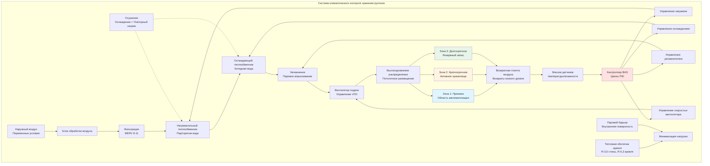

Помещения хранения рулонов бумаги требуют точного контроля окружающей среды, чтобы бумага достигла теплового и влажностного равновесия перед печатными операциями. Условия хранения напрямую влияют на стабильность размеров бумаги, содержание влаги и качество печати через процессы теплопередачи и массопередачи между рулоном и окружающим воздухом.

## Физика теплового выравнивания

Рулоны бумаги, доставленные из наружных условий или различных сред хранения, должны выравняться к условиям печатного цеха перед использованием. Время, необходимое для выравнивания температуры, зависит от геометрии рулона, тепловых свойств бумаги и конвективного теплообмена на поверхности рулона.

### Время выравнивания температуры

Характеристическое время выравнивания рулона бумаги к тепловому равновесию следует принципам нестационарной теплопроводности. Для цилиндрического рулона число Фурье определяет скорость выравнивания:

$$\text{Fo} = \frac{\alpha t}{r^2}$$

Где:
- α = коэффициент температуропроводности бумаги (м²/с)
- t = время (с)
- r = радиус рулона (м)

Температура в центре рулона как функция времени может быть приблизительно определена, используя первый член бесконечного ряда решений для радиальной теплопроводности в цилиндре:

$$\frac{T(0,t) - T_\infty}{T_i - T_\infty} = A_1 e^{-\lambda_1^2 \text{Fo}}$$

Для практических приложений хранения время достижения 95% выравнивания (когда температура сердцевины находится в пределах 5% от окружающей):

$$t_{95} = \frac{3.0 \cdot r^2}{\alpha}$$

Для типичной газетной бумаги с α ≈ 1,5 × 10⁻⁷ м²/с и диаметром рулона 0,6 м:

$$t_{95} = \frac{3.0 \times (0.3)^2}{1.5 \times 10^{-7}} = 1.8 \times 10^6 \text{ с} \approx 21 \text{ день}$$

Это демонстрирует, почему достаточное время хранения перед печатью критично для стабильности размеров.

## Выравнивание влажности

Бумага гигроскопична и обменивается влагой с окружающим воздухом до достижения равновесного содержания влаги (EMC). Отношение между относительной влажностью и EMC следует изотермам сорбции, специфичным для каждого сорта бумаги. Скорость массопередачи определяется следующим уравнением:

$$\frac{dm}{dt} = h_m A \rho_\text{воздуха} (w_\text{поверхность} - w_\infty)$$

Где:
- h_m = коэффициент массопередачи (м/с)
- A = площадь поверхности (м²)
- ρ_воздуха = плотность воздуха (кг/м³)
- w = влагосодержание (кг воды/кг сухого воздуха)

Выравнивание влажности обычно происходит быстрее, чем тепловое выравнивание из-за более высокой диффузии влаги на поверхностях бумаги. Однако градиенты влажности в толстых рулонах могут сохраняться в течение недель.

## Требования к окружающей среде хранилища

Помещение хранения должно поддерживать условия, соответствующие целевой среде печатного цеха, чтобы предотвратить циклирование влажности и изменение размеров во время выравнивания.

### Стандартные условия хранения по сортам бумаги

| Сорт бумаги | Температура | Относительная влажность | Целевая EMC | Критические факторы |
|-------------|-------------|-------------------|------------|------------------|
| Газетная бумага | 21-24°C | 45-55% | 5-7% | Минимизация коробления, скручивания |
| Мелованная журнальная | 22-25°C | 40-50% | 4-6% | Предотвращение дефектов покрытия |
| Тонкая писчая | 20-22°C | 50-60% | 6-8% | Стабильность размеров |
| Этикеточная бумага | 21-24°C | 40-50% | 4-6% | Производительность адгезива |
| Легкая мелованная | 22-25°C | 45-55% | 5-7% | Контроль скручивания |
| Немелованная офсетная | 20-24°C | 45-60% | 5-8% | Равномерность влажности |
| Специальные сорта | 21-24°C | 35-65% | Варьируется | По спецификации производителя |

Допуски по температуре: ±1°C
Допуски по влажности: ±5% отн. влажность

## Проектирование HVAC для помещения хранения

## Критерии проектирования системы HVAC

**Распределение воздуха**
- Смещение температуры подаваемого воздуха: максимум 5,5°C выше или ниже заданной температуры помещения
- Кратность воздухообмена: 2-4 ACH типично для хорошего перемешивания
- Скорость подаваемого воздуха на поверхности рулона: менее 0,5 м/с для предотвращения высыхания поверхности
- Размещение диффузоров: подача высокого уровня с возвратом низкого уровня для контроля расслоения

**Стратегия контроля влажности**
- Осушение: охлаждение ниже точки росы с повторным нагревом для поддержания температуры
- Увлажнение: впрыскивание чистого пара для точного контроля и предотвращения загрязнения
- Диапазон управления: максимум ±2% отн. влажность для предотвращения колебаний
- Размещение датчиков: несколько местоположений на уровне рулона, в стороне от прямого воздушного потока

**Контроль температуры**
- Нагрев: модулирующие теплообменники горячей воды или пара с управлением по поверхности и обходом
- Охлаждение: теплообменники холодной воды с мощностью для осушения
- Учет тепловой массы: большой запас бумаги обеспечивает значительную тепловую емкость
- Время восстановления: система должна обрабатывать колебание 11°C в течение 4-6 часов для быстрого восстановления

## Лучшие практики хранения

**Процедуры обращения с рулонами**
- Минимум 48 часов акклиматизации для рулонов из зон с различной температурой
- Хранение рулонов торцевой стороной для обеспечения радиальной передачи тепла/влаги со всех поверхностей
- Соблюдение расстояния 0,3-0,45 м между рулонами для циркуляции воздуха
- Использование ротации инвентаря "первый вошел - первый вышел" (FIFO) для обеспечения достаточного времени кондиционирования
- Защита рулонов полиэтиленовой оберткой до 24 часов перед использованием
- Контроль температуры сердцевины с помощью инфракрасной термометрии перед передачей в производство

**Мониторинг окружающей среды**
- Датчики температуры: точность ±0,3°C, ежегодная калибровка
- Датчики влажности: точность ±2% отн. влажность, полугодовая калибровка
- Регистрация данных: интервалы 15 минут минимум для анализа тенденций
- Точки срабатывания сигнала тревоги: ±1,7°C и ±7% отн. влажность от заданного значения

**Стратегии зонирования**
- Зона приемки/акклиматизации: переходные условия для новых поставок
- Активное хранилище: кондиционируется точно в соответствии с печатным цехом
- Долгосрочное хранилище: может работать с более широкими допусками для энергоэффективности
- Отдельные зоны для специальных бумаг с различными требованиями

## Оптимизация энергии

Помещения хранения бумаги представляют значительное потребление энергии HVAC из-за непрерывных требований к кондиционированию и больших объемов. Стратегии оптимизации энергии включают:

- Улучшения тепловой оболочки: минимизация инфильтрации и теплопередачи
- Рекуперация тепла: сенсорная и скрытая рекуперация тепла из выходящего воздуха
- Работа экономайзера: свободное охлаждение при подходящих наружных условиях
- Ночное снижение: ограниченное применение из-за времени восстановления и опасений циклирования влажности
- Вентиляция по требованию: снижение наружного воздуха в периоды низкой занятости
- Светодиодное освещение с уменьшенным выделением тепла по сравнению с газоразрядными приборами высокой интенсивности

Тепловая масса хранимых бумажных рулонов снижает температурные колебания, позволяя некоторое HVAC циклирование без чрезмерного уноса окружающей среды. Однако контроль влажности должен оставаться непрерывным для предотвращения миграции влаги.

## Проверка производительности системы

Пусконаладка HVAC систем помещений хранения с следующей проверкой:

- Обследование однородности температуры: менее 1,7°C вариации по всему помещению
- Однородность влажности: менее 5% отн. влажность вариации в местоположениях рулонов
- Измерение скорости воздуха: подтверждение распределения низкой скорости на поверхностях рулонов
- Настройка контура управления: проверка стабильного управления без колебаний или чрезмерного циклирования
- Калибровка датчиков: проверка точности относительно эталонных стандартов
- Тестирование последовательности операций: подтверждение надлежащего наращивания и интеграции

Надлежащее кондиционирование помещения хранения предотвращает дорогостоящие потери бумаги, остановки печатного цеха и дефекты качества печати, обеспечивая поступление бумаги на печатный пресс в равновесии с условиями производственной среды.
