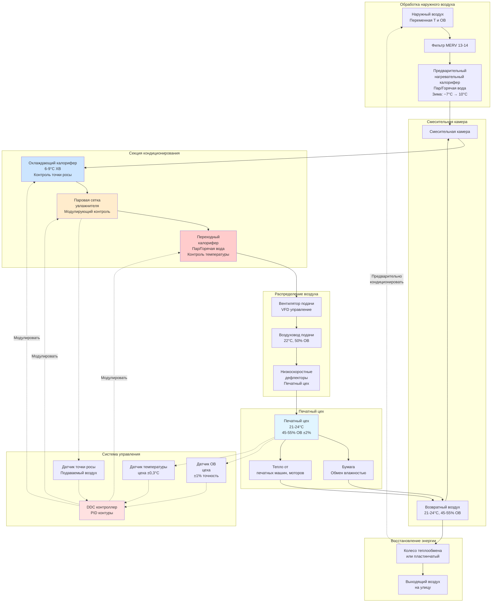

Стабильность размеров бумаги при листовой литографической печати напрямую зависит от прецизионного контроля влажности. Волокна бумаги представляют собой гигроскопические целлюлозные структуры, которые поглощают или выделяют влагу для достижения равновесия с окружающей относительной влажностью. Этот обмен влагой вызывает изменения размеров в направлении поперек волокон на величину от 0,3% до 0,8% на 10% изменения ОВ, что легко превышает допуски регистрации ±0,25 мм до ±0,50 мм, требуемые для многокрасочной печати на типовых листах размером 635 × 965 мм.

## Физика влажности бумаги

### Гигроскопическое поведение целлюлозы

Бумага состоит из целлюлозных волокон, содержащих гидроксильные (-OH) группы вдоль полимерных цепей. Эти полярные группы образуют водородные связи с молекулами воды, позволяя бумаге поглощать влагу из влажного воздуха или выделять влагу в сухой воздух до достижения равновесного содержания влаги (РСВ).

Равновесное содержание влаги следует соотношению изотермы сорбции, которое описывает нелинейную корреляцию между относительной влажностью и содержанием влаги в бумаге:

$$РСВ = \frac{1800}{M_w} \times \frac{C \times \phi}{(1 - K \times \phi)(1 + (C-1) \times K \times \phi)}$$

Где:
- $РСВ$ = Равновесное содержание влаги (% в пересчёте на сухое вещество)
- $M_w$ = Молярная масса воды (18 г/моль)
- $\phi$ = Относительная влажность (десятичное число, 0-1)
- $C$, $K$ = Материальные константы для конкретного типа бумаги
- Типовой диапазон РСВ: 5-9% при 40-60% ОВ

Распределение влаги внутри волокон бумаги происходит через три механизма:

1. **Поверхностная адсорбция**: Молекулы воды образуют монослойное покрытие на поверхности волокон при низкой ОВ (< 30%)
2. **Многослойная адсорбция**: Дополнительные слои воды накапливаются при средней ОВ (30-70%)
3. **Капиллярная конденсация**: Жидкая вода заполняет поры волокон при высокой ОВ (> 70%)

### Механика набухания волокон

Молекулы воды проникают в клеточные стенки целлюлозных волокон, внедряясь между цепями целлюлозы и раздвигая их. Это молекулярное разделение проявляется как макроскопическое набухание волокна.

Диаметр волокна увеличивается примерно на 30% при переходе от абсолютно сухого до насыщенного состояния, тогда как длина волокна изменяется менее чем на 1%. Это анизотропное поведение набухания создаёт направленные изменения размеров листов бумаги:

**Направление поперек волокон**: Волокна ориентированы перпендикулярно направлению измерения. Набухание диаметра накапливается на множестве волокон, создавая большие изменения размеров (0,015-0,025% на 1% изменения ОВ).

**Машинное направление**: Волокна ориентированы параллельно направлению измерения. Изменения длины минимальны, что приводит к меньшим изменениям размеров (0,004-0,008% на 1% изменения ОВ).

Процесс набухания частично обратим, проявляя гистерезис, при котором размеры бумаги отличаются незначительно между путями адсорбции (увеличение влажности) и десорбции (уменьшение влажности).

## Расчёты изменения размеров

### Коэффициент гигроэкспансии

Изменение размеров бумаги при варьировании влажности следует линейному соотношению в нормальном рабочем диапазоне 35-65% ОВ:

$$\Delta L = L_0 \times \alpha_{hx} \times \Delta ОВ$$

Где:
- $\Delta L$ = Изменение размеров (мм)
- $L_0$ = Исходный размер при опорной влажности (мм)
- $\alpha_{hx}$ = Коэффициент гигроэкспансии (% на %ОВ)
- $\Delta ОВ$ = Изменение относительной влажности (%ОВ)

Коэффициент гигроэкспансии зависит от состава бумаги, покрытия и ориентации волокон. Преобразование в десятичную форму:

$$\alpha_{hx} = \frac{\text{Коэффициент гигроэкспансии (%/%ОВ)}}{100}$$

**Пример расчёта**:

Для размера 711 мм (поперек волокон) на мелованной офсетной бумаге с $\alpha_{hx}$ = 0,018% на %ОВ, при увеличении ОВ на 5%:

$$\Delta L = 711 \times 0,00018 \times 5 = 0,64 \text{ мм}$$

Это расширение на 0,64 мм превышает типовые допуски регистрации, что демонстрирует критическую важность прецизионного контроля влажности.

### Анализ допусков регистрации

Четырёхкрасочная печать требует совмещения каждого цветоделения (голубой, пурпурный, жёлтый, чёрный) в пределах установленных допусков. Коммерческие стандарты качества обычно указывают максимальное смещение регистрации ±0,25 мм, тогда как премиум-класс требует ±0,125 мм.

Для размера листа $L_0$ с допуском регистрации $T_{reg}$, максимальное допустимое изменение размеров составляет:

$$\Delta L_{max} = T_{reg}$$

Соответствующее максимальное колебание ОВ становится:

$$\Delta ОВ_{max} = \frac{\Delta L_{max}}{L_0 \times \alpha_{hx}}$$

**Практический пример**:

Размер листа: 1016 мм (направление поперек волокон)
Допуск регистрации: ±0,25 мм
Тип бумаги: Немелованная офсетная, $\alpha_{hx}$ = 0,020% на %ОВ = 0,0002 на %ОВ

$$\Delta ОВ_{max} = \frac{0,25}{1016 \times 0,0002} = \frac{0,25}{0,203} = 1,23\% \text{ОВ}$$

Этот расчёт показывает, что сохранение регистрации в пределах ±0,25 мм требует контроля влажности в пределах ±1,23% ОВ на немелованной бумаге. Более жёсткие допуски или большие размеры листов требуют ещё более строгого контроля влажности.

### Взаимодействие температуры и влажности

Размеры бумаги также изменяются с температурой из-за теплового расширения, хотя этот эффект обычно меньше, чем гигроскопическое расширение:

$$\Delta L_{total} = L_0 \times (\alpha_{hx} \times \Delta ОВ + \alpha_T \times \Delta T)$$

Где:
- $\alpha_T$ = Коэффициент теплового расширения (обычно 0,000006 на °C для бумаги)
- $\Delta T$ = Изменение температуры (°C)

Коэффициент теплового расширения бумаги (0,000006 на °C) примерно в 5-10 раз меньше, чем коэффициент гигроэкспансии (0,0003-0,0005 на %ОВ), что делает контроль влажности доминирующей проблемой для стабильности размеров.

Однако температура влияет на относительную влажность, которую испытывает бумага. Сохранение постоянной абсолютной влажности (точки росы) при колебании температуры вызывает изменения ОВ согласно:

$$\frac{d(ОВ)}{dT} \approx -\frac{ОВ}{17} \text{ на °C}$$

При 21°C и 50% ОВ повышение температуры на 1,7°C снижает ОВ примерно на 5%, вызывая значительные изменения размеров. Это взаимодействие требует скоординированного контроля температуры и влажности.

## Сравнение типов бумаги

Различные сорта бумаги показывают разную чувствительность к изменениям влажности в зависимости от состава волокон, степени проработки, покрытий и добавок.

| Тип бумаги | Поперёк волокон α (%/%ОВ) | Машинное направление α (%/%ОВ) | Коэффициент размеров | РСВ при 50% ОВ |
|------------|------------------------|------------------------------|-------------------|----------------|
| Газетная | 0,022-0,028 | 0,006-0,009 | 3,5:1 | 7,5-8,5% |
| Немелованная офсетная | 0,018-0,024 | 0,005-0,008 | 3,5:1 | 6,5-7,5% |
| Мелованная офсетная (#1-#3) | 0,014-0,020 | 0,004-0,006 | 3,8:1 | 5,5-6,5% |
| Мелованная глянцевая (#5) | 0,010-0,016 | 0,003-0,005 | 4,0:1 | 5,0-6,0% |
| Синтетическая бумага | 0,002-0,006 | 0,001-0,003 | 2,5:1 | 0,5-1,5% |
| Этикеточная (немелованная) | 0,016-0,022 | 0,004-0,007 | 4,0:1 | 6,0-7,0% |
| Картон | 0,012-0,018 | 0,003-0,006 | 4,5:1 | 5,5-6,5% |
| Крафт-бумага | 0,020-0,026 | 0,005-0,008 | 4,2:1 | 7,0-8,0% |

**Ключевые наблюдения**:

1. **Покрытие снижает гигроэкспансию**: Глинистые и полимерные покрытия ограничивают набухание волокон, снижая чувствительность размеров. Интенсивно мелованная глянцевая бумага показывает на 30-40% более низкие коэффициенты расширения, чем немелованные сорта.

2. **Газетная бумага наиболее чувствительна**: Высокое содержание механической целлюлозы и минимальная проработка создают пористую структуру с максимальным гигроскопическим ответом. Газетная бумага показывает на 50-80% более высокое изменение размеров, чем мелованная бумага.

3. **Синтетические бумаги стабильны**: Синтетические бумаги на основе полипропилена и полиэстера не содержат гигроскопических волокон и показывают минимальное изменение размеров при варьировании влажности. Эти материалы предпочтительны для приложений, требующих экстремальной стабильности размеров.

4. **Поперёк волокон доминирует**: Все целлюлозные бумаги показывают в 3-4 раза большее изменение размеров в направлении поперек волокон по сравнению с машинным направлением, подчёркивая важность ориентации волокон при раскладке листа.

## Оптимальные диапазоны ОВ

### Стандартные рекомендации

Отраслевые стандарты указывают диапазоны относительной влажности для листовой печати на основе обширных исследований, коррелирующих условия окружающей среды с метриками качества печати:

**Стандартная атмосфера TAPPI T402 и ISO 187**:
- Температура: 23°C ± 1°C
- Относительная влажность: 50% ± 2% ОВ

**Рекомендации GATF (Graphic Arts Technical Foundation)**:
- Печатный цех: 21-24°C, 45-55% ОВ
- Хранилище бумаги: 21-24°C, 45-55% ОВ
- Максимальное изменение во время печати: ±2% ОВ

**Рекомендации Printing Industries of America**:
- Коммерческая печать: 50% ОВ ± 3% ОВ
- Высокое качество цвета: 50% ОВ ± 2% ОВ
- Премиум/упаковка: 50% ОВ ± 1% ОВ

Диапазон 45-55% ОВ представляет оптимальный баланс среди нескольких факторов:

1. **Стабильность размеров**: Влажность в середине диапазона минимизирует изменение размеров в обе стороны
2. **Контроль статического электричества**: Поверхностная проводимость выше 45% ОВ рассеивает статические заряды в течение секунд
3. **Обработка бумаги**: Листы ни слишком сухие (хрупкие, статика), ни слишком влажные (липкие, волнистые)
4. **Согласованность РСВ**: Большинство бумаги поступает с влажностью 5-7%, соответствующей 45-55% ОВ
5. **Энергоэффективность**: Уставка в середине диапазона снижает нагрузки на увлажнение (зима) и осушение (лето)

### Стратегии сезонной регулировки

Некоторые предприятия регулируют уставку ОВ по сезонам, чтобы снизить потребление энергии, сохраняя адекватную стабильность размеров:

**Зимняя эксплуатация** (наружные условия < −10°C, < 40% ОВ):
- Уставка: 45-48% ОВ
- Обоснование: Снизить нагрузку на увлажнение, бумага стабильна на нижнем конце диапазона
- Внимание: Контролировать статическое электричество, ниже 45% ОВ может потребоваться ионизация

**Летняя эксплуатация** (наружные условия > 27°C, > 60% ОВ):
- Уставка: 52-55% ОВ
- Обоснование: Снизить энергию на осушение/охлаждение, бумага стабильна на верхнем конце диапазона
- Внимание: Следить за волнистыми краями, коробиванием мелованных сортов выше 55% ОВ

**Переходные периоды** (весна/осень):
- Уставка: 50% ОВ
- Экономайзер максимизирует свободное охлаждение/осушение

Этот подход может снизить потребление энергии HVAC на 15-25% по сравнению с работой год-круглый при 50% ОВ, при условии, что бумажный инвентарь постепенно кондиционируется, а печатная команда понимает сезонное варьирование.

### Требования более жёсткого контроля

Некоторые печатные приложения требуют контроля ОВ более жёсткого, чем стандартный допуск ±2-3%:

**Защитная печать** (денежные знаки, документы):
- Спецификация: 50% ОВ ± 1% ОВ
- Обоснование: Допуски регистрации ±0,075-0,125 мм, микропечать деталей

**Фармацевтическая упаковка**:
- Спецификация: 48% ОВ ± 1,5% ОВ
- Обоснование: Требования нормативной документации, регистрация сериализации

**Премиум коммерческая** (годовые отчёты, художественные воспроизведения):
- Спецификация: 50% ОВ ± 1,5% ОВ
- Обоснование: Ожидания качества клиента, большие размеры листа (1016 × 1524 мм)

**Голографические подложки**:
- Спецификация: 45% ОВ ± 2% ОВ (более низкая уставка)
- Обоснование: Металлизированные плёнки менее стойки к влаге, риск расслоения

Достижение контроля ±1% ОВ требует:
- Выделенных систем прецизионного HVAC с датчиками точки росы
- Модулирующих паровых увлажнителей с быстрым откликом
- Охлаждения для осушения с жёстким контролем точки росы выходящего воздуха
- Минимальной инфильтрации наружного воздуха (шлюзы, положительное давление)
- Непрерывного мониторинга и тренда температуры, ОВ, точки росы

## Проектирование системы контроля влажности

Система прецизионного контроля влажности для сред листовой печати интегрирует компоненты увлажнения, осушения и управления для сохранения узких допусков, требуемых для стабильности размеров.

### Система увлажнения

**Паровые сеточные увлажнители** обеспечивают модулирующую производительность и скорость отклика, необходимые для прецизионного управления:

**Параметры проектирования**:
- Давление пара: 100-350 кПа (пониженное от подачи здания)
- Конфигурация сетки: Множественные точки впрыска через ширину воздуховода
- Управляющий клапан: Характеристика равнопроцентная, коэффициент перекрытия 50:1
- Расстояние абсорбции: Минимум 3-4,5 м перед выходом подаваемого воздуха
- Дренаж конденсата: Наклонённые дренажные участки предотвращают накопление воды

**Расчёт производительности**:

Требуемая скорость увлажнения для системы со 100% наружным воздухом, 9448 л/мин (м³/ч), зимний расчёт −12°C на улице до 22°C/50% ОВ:

Из психрометрического анализа:
- Наружные условия: −12°C, насыщенные = 0,00036 кг H₂O/кг сухого воздуха
- Целевые условия: 22°C, 50% ОВ = 0,0082 кг H₂O/кг сухого воздуха
- Требуемое добавление влаги: 0,00784 кг/кг

$$\dot{m}_{steam} = Q_{air} \times \rho_{air} \times \Delta W = 9448 \times 1,2 \times 0,00784 = 89 \text{ кг/ч}$$

С коэффициентом безопасности 20%: требуется производительность по пару 107 кг/ч.

**Альтернативные технологии**:

**Увлажнители с испаряющейся средой**: Более низкая стоимость эксплуатации (используется вода объекта вместо пара), но требуют:
- Расширенное расстояние абсорбции (4,5-7,5 м минимум)
- Регулярную замену среды (ежегодно) для предотвращения биологического роста
- Очистку воды для предотвращения минеральных отложений
- Более медленный отклик по сравнению с паровым впрыском

**Ультразвуковые/распыляющие увлажнители**: Очень тонкие капли для быстрого испарения, но чувствительны к качеству воды (требуется деминерализованная вода) и высокое обслуживание.

### Система осушения

**Осушение охлаждающим калорифером** с переходным нагревом обеспечивает экономически эффективное удаление влаги для большинства климатических зон:

**Подход проектирования**:

1. **Охлаждение ниже точки росы**: Охлаждающий калорифер (6-9°C подаваемой воды) снижает температуру воздуха ниже целевой точки росы, конденсируя избыточную влагу
2. **Контроль точки росы выходящего воздуха**: Модулирование клапана охлаждающей воды для поддержания точки росы выходящего воздуха 9-11°C
3. **Переходный нагрев до уставки**: Паровой или горячеводяной переходный калорифер повышает температуру подаваемого воздуха до 22°C без добавления влаги

**Расчёт летнего проектирования**:

100% наружный воздух, 9448 л/мин, 29°C/65% ОВ наружные до 22°C/50% ОВ подачи:

Из психрометрической диаграммы:
- Наружные условия: 29°C, 65% ОВ = 18°C точка росы, 0,0165 кг/кг соотношение влажности
- Целевая подача: 22°C, 50% ОВ = 12°C точка росы, 0,0082 кг/кг соотношение влажности
- Выходящий охлаждающий калорифер: 12°C точка росы = 13°C сухой термометр (насыщенный)

**Нагрузка чувствительного охлаждения**:
$$Q_{sensible} = 1,2 \times Q_{м3/ч} \times \Delta T = 1,2 \times 9448 \times (29-13) = 181{,}161 \text{ кДж/ч}$$

**Нагрузка скрытого охлаждения**:
$$Q_{latent} = 0,84 \times Q_{м3/ч} \times \Delta W \times 2500 = 0,84 \times 9448 \times 0,0083 \times 2500 = 165{,}294 \text{ кДж/ч}$$

**Полное охлаждение**: 346 МДж/ч = 96 кВт холодоснабжения

**Нагрузка переходного нагрева**:
$$Q_{reheat} = 1,2 \times 9448 \times (22-13) = 102{,}158 \text{ кДж/ч}$$

Одновременное охлаждение и переходный нагрев представляют энергетический штраф, присущий осушению. Восстановление тепла от конденсата охлаждающего калорифера или вентиляционные системы с рекуперацией энергии могут компенсировать этот штраф.

**Осушение с адсорбентом**:

Для приложений, требующих < 40% ОВ или более энергоэффективной работы во влажных климатических зонах:

- Ротационное адсорбционное колесо (силикагель, пропитанный средой)
- Поток обрабатываемого воздуха: Проходит через колесо, влага адсорбируется, сухой воздух в цех
- Поток регенерации: Нагретый воздух (82-121°C) удаляет влагу из колеса
- Источник энергии: Газовая горелка, пар или тепло-отходы сушильных устройств печати

Адсорбционные системы устраняют штраф охлаждения-переходного нагрева, но требуют тепловой энергии для регенерации.

### Стратегия управления

**Двухконтурное PID управление** обеспечивает независимую регуляцию температуры и влажности:

**Контур управления температурой**:
- Датчик: Датчик температуры (RTD), ±0,3°C точность
- Уставка: 22°C (регулируемая 21-24°C)
- Диапазон дросселирования: ±0,6°C
- Выход: Модулирует клапан переходного нагрева (нагрев) или охлаждающий клапан (охлаждение)
- График сброса: Сброс температуры подаваемого воздуха на основе нагрузки цеха

**Контур управления влажностью**:
- Датчик: Ёмкостный датчик ОВ, ±1-2% ОВ точность, температурно-скомпенсированный
- Уставка: 50% ОВ (регулируемая 45-55% ОВ)
- Диапазон дросселирования: ±2% ОВ
- Выход: Модулирует клапан парового увлажнителя (увлажнение) или охлаждающий клапан через уставку точки росы (осушение)
- Логика дискриминации: Предотвращает одновременное увлажнение и осушение

**Улучшение управления на основе точки росы**:

Добавление датчика точки росы в потоке подаваемого воздуха обеспечивает измерение абсолютной влажности независимо от колебания температуры:

- Уставка точки росы, рассчитанная на основе температуры цеха и уставки ОВ
- Пример: 22°C, 50% ОВ соответствует точке росы 12°C
- Охлаждающий калорифер модулирует для поддержания точки росы выходящего воздуха 9-11°C
- Паровой увлажнитель добавляет влагу, если точка росы падает ниже 11°C

Этот подход предотвращает колебание температуры-влажности, которое может вызвать колебания в системах управления только ОВ.

### Размещение датчиков и калибровка

Точный контроль влажности зависит от надлежащего выбора датчиков, расположения и обслуживания:

**Датчики цеха**:
- Расположение: Репрезентативно для условий палубы печатной машины (1,2-1,5 м над полом)
- Избегать: Прямой поток воздуха из дефлекторов, близость к дверям/окнам, источники тепла
- Количество: Множественные датчики, усреднённые в больших цехах (> 465 м²)
- Тип: Тонкопленочный ёмкостной датчик, ±1-2% ОВ точность, диапазон 5-95% ОВ

**Датчики подаваемого воздуха**:
- Расположение: Ниже по потоку от окончательного кондиционирования (после увлажнителя)
- Защита: Аспирационный экран предотвращает ошибки излучения
- Тип: Датчик точки росы (охлаждаемое зеркало или ёмкостной), точность ±1°C точка росы

**График калибровки**:
- Квартальная проверка по сравнению с сертифицированным эталоном (солевые растворы или передающий стандарт)
- Ежегодная заводская повторная калибровка для критических приложений
- Дрейф обычно < 2% ОВ в год для датчиков хорошего качества

**Обслуживание**:
- Ежемесячный осмотр скопления пыли (влияет на время отклика)
- Замена фильтра в корпусе датчика (если имеется)
- Проверка проводных соединений (коррозия от воздействия влажности)

## Практическая реализация

Успешный контроль влажности в сред листовой печати требует интеграции проектирования системы HVAC, оперативных процедур и практик обработки бумаги.

**Ввод системы в эксплуатацию**:
- 72-часовой тест стабильности при условиях уставки перед выпуском в производство
- Проверить контроль ±2% ОВ при моделировании изменения нагрузки
- Тренд температуры, ОВ, точки росы при 5-минутных интервалах
- Тест времени восстановления после инфильтрационных событий двери (< 30 минут)

**Протокол кондиционирования бумаги**:
- Получить бумагу как минимум за 48-72 часов до даты печати
- Развернуть поддоны и разделить на меньшие партии для более быстрого уравновешивания
- Расположить бумагу в печатном цехе или контролируемом хранилище при условиях производства
- Допустить минимум 24-48 часов кондиционирования перед печатью

**Оперативный мониторинг**:
- Отобразить реальное время температуры и ОВ на станциях операторов печати
- Протоколировать почасовые значения для документации контроля качества
- Оповещать супервизора печати, если условия превышают ±3% ОВ от уставки
- Коррелировать экскурсии окружающей среды с дефектами регистрации в данных производства

**Устранение неполадок общих проблем**:

**Ошибки регистрации несмотря на стабильную окружающую среду**: Проверить направление волокна бумаги, убедиться, что бумага была надлежащим образом кондиционирована, осмотреть допуски механизма печатной машины.

**Колебание управления влажностью**: Отрегулировать параметры настройки PID, проверить калибровку датчика, проверить наличие одновременных команд нагрева/охлаждения.

**Статическое электричество несмотря на 45-55% ОВ**: Проверить ионизирующие полосы, убедиться в равномерном распределении влажности, проверить наличие локальных сухих зон рядом с инфильтрацией наружного воздуха.

Физика взаимодействия бумаги-влаги устанавливает фундаментальные пределы на стабильность размеров, которые не могут быть преодолены через регулировку печатной машины в одиночку. Прецизионный контроль влажности в пределах ±1-2% ОВ представляет наиболее эффективную стратегию сохранения допусков регистрации в требовательных приложениях листовой литографической печати.
