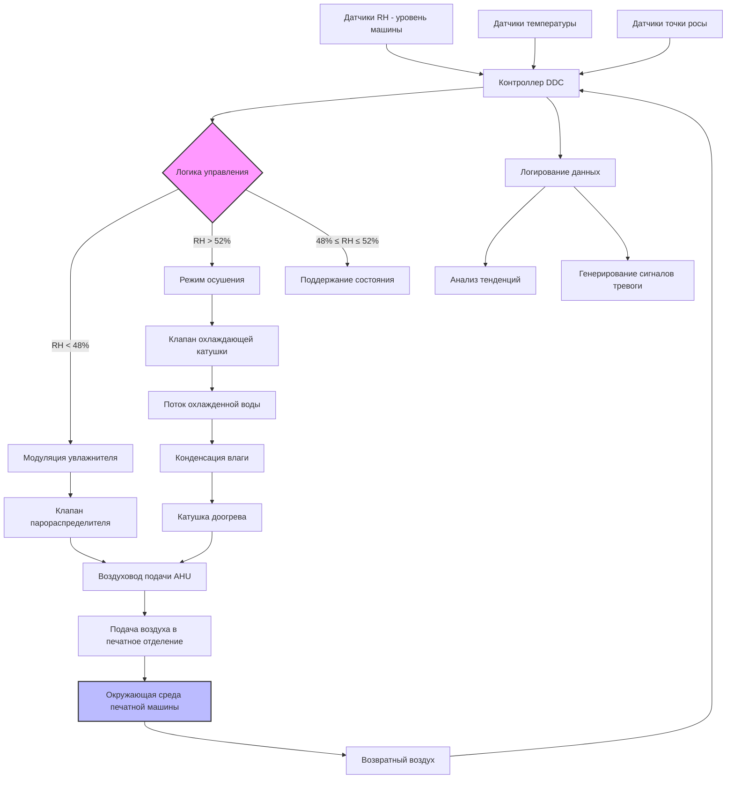

Спецификация 45-55% относительной влажности для окружающей среды листовой печатной машины представляет оптимальную полосу управления для уравновешивания стабильности размеров бумаги, рассеивания статического электричества и операционного комфорта. Этот диапазон минимизирует гигроширающие размерные изменения в целлюлозных субстратах, сохраняя при этом адекватную поверхностную проводимость для предотвращения накопления электростатического заряда. Отклонения вне этого диапазона дают измеримые дефекты качества, при превышении ниже 40% RH вызывают ошибки подачи, связанные со статикой, и усадку бумаги, а условия выше 60% RH вызывают поглощение влаги, расширение листа, волнистые края и смещение регистрации, превышающее допустимые допуски.

## Физическая основа стандарта 45-55% RH

### Гигроширящие характеристики бумаги

Волокна бумаги проявляют гигроскопическое поведение посредством водородных связей между атмосферными молекулами воды и гидроксильными группами целлюлозы в стенках ячеек волокна. Содержание влаги при равновесии (EMC) бумаги коррелирует непосредственно с окружающей относительной влажностью в соответствии с соотношением изотермы сорбции.

**Соотношение размерного изменения:**

$$\Delta L = L_0 \cdot \alpha_{hygro} \cdot \Delta RH$$

Где:
- $\Delta L$ = Размерное изменение (см)
- $L_0$ = Исходный размер (см)
- $\alpha_{hygro}$ = Коэффициент гигроширения (%/% RH)
- $\Delta RH$ = Изменение относительной влажности (% RH)

**Типичные коэффициенты гигроширения:**

| Тип бумаги | Поперечное направление α | Машинное направление α | Коэффициент анизотропии |
|------------|--------------------------|------------------------|-------------------------|
| Глянцевая мелованная 120 г/м² | 0.015-0.018%/% RH | 0.004-0.005%/% RH | 3.6:1 |
| Немелованная офсетная 105 г/м² | 0.018-0.022%/% RH | 0.005-0.007%/% RH | 3.4:1 |
| Матовая мелованная 150 г/м² | 0.013-0.016%/% RH | 0.003-0.005%/% RH | 3.8:1 |
| Премиум текстовая 120 г/м² | 0.016-0.020%/% RH | 0.005-0.006%/% RH | 3.3:1 |

Поперечное направление проявляет размерное изменение в 3-4 раза большее, чем машинное направление, из-за предпочтительного выравнивания волокна при производстве бумаги. Это анизотропное поведение требует тщательного рассмотрения направления зерна бумаги относительно критических размеров изображения.

### Анализ допуска регистрации

Четырехцветная литографическая печать требует точности регистрации ±0.25 мм до ±0.51 мм в зависимости от сложности изображения и требований качества. Вызванные окружающей средой размерные изменения легко превышают эти допуски в неконтролируемых условиях.

**Расчет допуска регистрации для листа 635 × 965 мм:**

Максимально допустимое размерное изменение:
$$\Delta L_{max} = \pm 0.38 \text{ мм (типичная спецификация)}$$

Соответствующая доля размерной вариации:
$$\frac{\Delta L_{max}}{L_0} = \frac{0.38}{635} = 0.0006 = 0.06\%$$

Для мелованного картона с $\alpha_{hygro} = 0.017\%$ на % RH:
$$\Delta RH_{allowable} = \frac{0.06\%}{0.017\%} = 3.5\% \text{ RH}$$

**Вывод:** Максимальное изменение RH во время многоцветного прогона машины должно оставаться в пределах ±3% RH для поддержания приемлемой регистрации. Работа премиум-качества, требующая допуска ±0.25 мм, ограничивает допустимое изменение RH до ±2% RH или более жестких требований.

Спецификация 45-55% RH обеспечивает:
- Полоса контроля 10% RH в целом
- ±5% RH от средней точки (50% RH)
- Адекватный запас для отклика системы управления
- Совмещение с малыми утечками и сезонными нагрузками

### Равновесие содержания влаги

Содержание влаги в бумаге при 50% RH и 21°C обычно варьируется от 6-8% по массе. Это равновесие совпадает с общими условиями производства и хранения бумаги, минимизируя размерное изменение при поступлении бумаги в окружающую среду машины.

**Соотношение изотермы сорбции (упрощенная эмпирическая модель):**

$$EMC = \frac{a \cdot b \cdot RH}{(1 - b \cdot RH)(1 - b \cdot RH + a \cdot b \cdot RH)}$$

Где типичные коэффициенты для немелованной бумаги дают:
- 20% RH → 4.5% содержание влаги
- 50% RH → 7.0% содержание влаги
- 80% RH → 14.5% содержание влаги

Полоса 45-55% RH поддерживает вариацию содержания влаги в пределах ±0.7 процентных пункта, соответствующей стабильности размеров ±0.12% для типичного немелованного офсетного картона.

## Механизм управления статическим электричеством

### Соотношение поверхностного сопротивления и влажности

Поверхностное сопротивление бумаги уменьшается экспоненциально с увеличением относительной влажности в соответствии с эмпирическим соотношением:

$$\rho_{surface}(RH) = \rho_0 \cdot e^{-k \cdot RH/100}$$

Где:
- $\rho_{surface}$ = Поверхностное сопротивление (Ом/квадрат)
- $\rho_0$ = Сопротивление при 0% RH (обычно 10¹⁵ Ом/кв)
- $k$ = Коэффициент материала (7-9 для бумаги)
- $RH$ = Относительная влажность (%)

**Измеренные значения поверхностного сопротивления:**

| Относительная влажность | Поверхностное сопротивление | Постоянная времени затухания заряда |
|--------------------------|---------------------------|--------------------------------------|
| 25% RH | 3 × 10¹² Ом/кв | 90-120 секунд |
| 40% RH | 8 × 10¹⁰ Ом/кв | 15-25 секунд |
| 50% RH | 2 × 10¹⁰ Ом/кв | 3-8 секунд |
| 60% RH | 6 × 10⁹ Ом/кв | < 2 секунд |
| 75% RH | 4 × 10⁸ Ом/кв | < 0.5 секунд |

При 50% RH поверхностное сопротивление бумаги уменьшается примерно на три порядка по сравнению с условиями 25% RH. Это снижение обеспечивает адекватное рассеивание заряда для предотвращения ошибок подачи, связанных со статикой, притяжения пыли и опасности поражения оператора.

### Критический порог статики

Проблемы, связанные со статикой в листовых операциях, проявляются при следующих пороговых значениях напряжения:

**Воздействие напряжения статики:**

| Поверхностное напряжение | Наблюдаемый эффект | Влияние на производство |
|--------------------------|-------------------|------------------------|
| 2-3 кВ | Прилипание листов/проблемы разделения | Неисправности подачи начинают проявляться |
| 3-5 кВ | Притяжение частиц пыли | Дефекты качества печати |
| 5-8 кВ | Восприятие оператором удара | Проблема безопасности, снижение производительности |
| 8-12 кВ | Серьезное нарушение подачи | Требуется остановка производства |

Поддержание 45-55% RH предотвращает накопление напряжения выше 3 кВ в нормальных условиях эксплуатации машины (скорости < 15 000 листов/час). Высокоскоростные машины или синтетические субстраты могут требовать дополнительных систем ионизации даже в пределах указанного диапазона RH.

### Проводимость влажностной пленки

Адсорбированный слой влаги на волокнах бумаги при 50% RH создает непрерывный проводящий путь для рассеивания заряда. Этот физиадсорбированный слой воды составляет примерно 2-4 молекулярных слоя, достаточно толстый для обеспечения поверхностной проводимости без вызывания поглощения объемной влаги, которое вызовет размерную нестабильность.

Влажностная пленка рассеивает электростатические заряды посредством ионной проводимости, с постоянной времени затухания заряда, обратно пропорциональной поверхностной проводимости:

$$\tau_{decay} = \rho_{surface} \cdot \varepsilon_0 \cdot \varepsilon_r$$

Где:
- $\tau_{decay}$ = Постоянная времени затухания заряда (секунды)
- $\varepsilon_0$ = Диэлектрическая проницаемость вакуума (8.85 × 10⁻¹² Ф/м)
- $\varepsilon_r$ = Относительная диэлектрическая проницаемость бумаги (2.5-3.5)

При 50% RH с поверхностным сопротивлением 2 × 10¹⁰ Ом/кв постоянная времени затухания заряда составляет примерно 5 секунд, достаточно для непрерывного рассеивания заряда во время эксплуатации машины.

## Проектирование системы управления RH

### Спецификация полосы управления

**Рабочая уставка:** 50% RH (средняя точка диапазона 45-55%)

**Допуск управления во время производства:**
- Нормальная операция: ±2% RH (48-52% RH)
- Допустимое отклонение: ±3% RH (47-53% RH)
- Максимальное отклонение: ±5% RH (пределы полосы 45-55% RH)

**Алгоритм управления:**

$$RH_{control} = RH_{setpoint} \pm \Delta RH_{tolerance}$$

Где действие управления инициируется, когда измеренный RH отклоняется за пределы полосы допуска:

```
IF RH_measured < (RH_setpoint - ΔRH_tolerance) THEN
    Activate humidification
ELSE IF RH_measured > (RH_setpoint + ΔRH_tolerance) THEN
    Activate dehumidification
ELSE
    Maintain current state (deadband)
END IF
```

### Архитектура системы управления



### Размещение датчиков и точность

**Спецификации датчиков RH:**
- Точность: ±2% RH в диапазоне 40-60% RH
- Время отклика: < 60 секунд до 90% ступенчатого изменения
- Интервал калибровки: 6-12 месяцев
- Технология: Тонкопленочный емкостной или конденсационный датчик точки росы

**Места установки:**
- Основное управление: уровень печатной машины, 0.9-1.2 м над полом
- Проверка: несколько зон в больших печатных отделениях (1 на 465 м²)
- Возвратный воздух: установка в воздуховод для мониторинга системы
- Подаваемый воздух: послеувлажнение для проверки инжекции

Избегайте размещения датчика:
- Прямое солнечное излучение
- Зоны с высокой скоростью воздуха (> 2 м/с)
- Рядом с внешними дверями или зонами погрузки
- Рядом с оборудованием, генерирующим тепло

### Калибровка контурного управления

**Параметры пропорционально-интегрального управления:**

Контур увлажнения:
$$u_{humid}(t) = K_p \cdot e(t) + K_i \int e(t) dt$$

Где:
- $u_{humid}$ = Положение клапана увлажнителя (0-100%)
- $e(t)$ = Сигнал ошибки = $RH_{setpoint} - RH_{measured}$
- $K_p$ = Коэффициент усиления пропорциональности (обычно 3-5)
- $K_i$ = Постоянная интегрального времени (обычно 120-180 секунд)

**Задачи калибровки:**
- Минимизировать перерегулирование (< 1% RH)
- Время установления < 15 минут для возмущения 5% RH
- Исключить установившуюся ошибку посредством интегрального действия
- Предотвратить колебание клапана через адекватную полосу нечувствительности (±0.5% RH)

Осушение обычно проявляет более медленный отклик из-за теплоемкости охлаждающих катушек и элементов доогрева. Используйте более длинные постоянные интегрального времени (300-600 секунд) для предотвращения колебания.

## Сравнение оборудования увлажнения

### Критерии выбора оборудования

| Тип оборудования | Диапазон емкости | Время отклика | Точность управления | Капитальные затраты | Рабочие затраты | Техническое обслуживание |
|-----------------|------------------|----------------|-------------------|-------------------|-----------------|-------------------------|
| **Паровая решетка** | 25-2500 кг/ч | Быстро (30-90 сек) | Отличная (±1% RH) | Средние | Средние-Высокие | Низкие |
| **Пар-в-пар** | 5-250 кг/ч | Быстро (20-60 сек) | Отличная (±1% RH) | Средние-Высокие | Средние-Высокие | Низкие |
| **Электродный бойлер** | 2.5-100 кг/ч | Средние (60-120 сек) | Хорошая (±1.5% RH) | Средние | Высокие (электро) | Средние |
| **Испарительные носители** | 10-1000 кг/ч | Медленно (120-300 сек) | Справедливая (±2% RH) | Низкие-Средние | Низкие | Высокие |
| **Ультразвуковой распылитель** | 2.5-250 кг/ч | Средние (60-180 сек) | Хорошая (±1.5% RH) | Высокие | Средние | Средние-Высокие |
| **Распылитель сжатым воздухом** | 5-500 кг/ч | Быстро (30-90 сек) | Хорошая (±1.5% RH) | Средние-Высокие | Средние | Средние |

### Системы паровой решетки (рекомендуется)

Увлажнители паровой решетки вводят низконапорный пар (35-105 кПа) непосредственно в воздуховод подачи воздухообработчика через распределенный коллектор с несколькими точками впрыска.

**Характеристики производительности:**
- Расстояние поглощения: 1.2-1.8 м на кг/ч емкости
- Коэффициент изменения: 20:1 с модулирующим управляющим клапаном
- Требование качества пара: > 97% сухой пар
- Интервал трубки диспергирования: 30-45 см по центру

**Расчет размера:**

Требуемая емкость пара для увлажнения подаваемого воздуха:
$$\dot{m}_{steam} = \frac{Q_{OA} \cdot \rho_{air} \cdot (W_{supply} - W_{OA})}{60}$$

Где:
- $\dot{m}_{steam}$ = Расход пара (кг/ч)
- $Q_{OA}$ = Расход наружного воздуха (м³/ч)
- $\rho_{air}$ = Плотность воздуха (1.2 кг/м³ стандартная)
- $W_{supply}$ = Коэффициент влажности подаваемого воздуха (кг водяного пара/кг сухого воздуха)
- $W_{OA}$ = Коэффициент влажности наружного воздуха (кг водяного пара/кг сухого воздуха)

**Пример проектирования:**

Печатное отделение площадью 4645 м² при 6 ACH:
- Расход воздуха: 4645 м² × 3.6 м потолок / 60 мин × 6 ACH = 1700 м³/ч
- Доля наружного воздуха: 20% = 340 м³/ч
- Зимний расчет: -12°C, 70% RH наружный ($W_{OA}$ = 0.0010 кг/кг)
- Подача: 21°C, 50% RH ($W_{supply}$ = 0.0078 кг/кг)

$$\dot{m}_{steam} = \frac{340 \times 1.2 \times (0.0078 - 0.0010)}{60} = 0.0455 \text{ кг/мин} = 2.73 \text{ кг/ч}$$

Добавьте 25% запас прочности: 2.73 × 1.25 = 3.41 кг/ч → **Выберите увлажнитель паровой решетки емкостью 5 кг/ч**

### Системы испарительных носителей

Увлажнители с влажными носителями пропускают воздух через насыщенные водой целлюлозные или синтетические носители, добавляя влагу посредством испарительного охлаждения.

**Преимущества:**
- Отсутствие видимого паровыделения
- Самоограничивающееся (не может переувлажнить)
- Более низкие рабочие затраты (использует воду объекта)
- Простое обслуживание (замена носителя)

**Недостатки:**
- Медленное время отклика (большая теплоемкость)
- Эффект испарительного охлаждения (понижение температуры на 1-2°C)
- Потенциал биологического роста (требует обработки воды)
- Ограниченная возможность изменения (обычно 3:1)

**Применение:** Подходит для базовой загрузки увлажнения в системах рециркуляции с низкой динамической вариацией нагрузки. Не рекомендуется для основного управления в высокоточных приложениях, требующих быстрого отклика.

### Электродные паровые генераторы

Электродные котлы генерируют пар, пропуская электрический ток через обогащенную минералами воду между погруженными электродами.

**Характеристики:**
- Автономная генерация пара (не требуется центральный котел)
- Модулирующее управление емкостью (коэффициент изменения 8:1)
- Высокие рабочие затраты на электроэнергию
- Требует контроля электропроводности воды (200-1500 мкСм/см)

**Применение:** Объекты без систем центрального пара или где распределение пара непрактично. Рабочие затраты обычно в 2-3 раза выше, чем системы паровой решетки из-за эффективности электрического сопротивления нагрева.

## Подходы к осушению

### Осушение на основе охлаждения

Воздух проходит над охлаждающей катушкой с охлажденной водой (температура подачи 6-9°C) для конденсации влаги, затем переогревается до уставки температуры подачи.

**Последовательность процесса:**
1. Охлаждение наружного или смешанного воздуха до точки росы 10-12°C
2. Конденсация избыточной влаги на поверхности катушки
3. Переогрев до температуры подачи 20-22°C
4. Доставка в пространство при 45-55% RH

**Расчет энергетического штрафа:**

Летняя нагрузка осушения (32°C, 70% RH наружный → 21°C, 50% RH подача):

Чувствительное охлаждение:
$$Q_{sensible} = \dot{m}_{air} \cdot c_p \cdot (T_{OA} - T_{coil\\_leaving})$$

Скрытое охлаждение (осушение):
$$Q_{latent} = \dot{m}_{air} \cdot (W_{OA} - W_{supply}) \cdot h_{fg}$$

Требование переогрева:
$$Q_{reheat} = \dot{m}_{air} \cdot c_p \cdot (T_{supply} - T_{coil\\_leaving})$$

Для наружного воздуха объемом 340 м³/ч (тот же пример, что и увлажнение):
- Наружный: 32°C, 70% RH ($W_{OA}$ = 0.0193 кг/кг)
- Выход катушки: 12°C, 95% RH ($W$ = 0.0078 кг/кг)
- Подача: 21°C, 50% RH ($W$ = 0.0078 кг/кг)

Нагрузка охлаждения: 340 м³/ч × 1.2 кг/м³ × [(1.006 кДж/кг·K × 20 K) + (0.0115 кг/кг × 2501 кДж/кг)]
= 58.3 кВ = 50.3 тепловых кВт

Нагрузка переогрева: 340 м³/ч × 1.2 кг/м³ × 1.006 кДж/кг·K × 9 K / 3600
= 1.029 кВ = 3.51 МВт

**Эффективность системы:** Осушение на основе охлаждения с переогревом проявляет коэффициент производительности (COP) 1.5-2.5, учитывая одновременное потребление энергии охлаждения и нагрева.

### Осушение с использованием осушителя

Вращающиеся колеса с адсорбентом адсорбируют влагу из потока технологического воздуха, регенерируя материал адсорбента с использованием нагретого воздуха (82-121°C) в отдельном секторе регенерации.

**Преимущества:**
- Независимое управление температурой и влажностью
- Возможность глубокого осушения (< 40% RH достижимо)
- Не требуется дренаж конденсата
- Эффективно при низких температурах наружного воздуха

**Недостатки:**
- Высокое энергопотребление на регенерацию
- Добавление чувствительного тепла в технологический воздух (требует охлаждения)
- Более высокие капитальные затраты, чем системы охлаждения
- Периодическая замена колеса (8-12 лет)

**Применение:** Объекты, требующие контроля RH ниже 40% RH или в климатах, где осушение на основе охлаждения неэффективно (низкие температуры наружного воздуха с высокой RH).

## Стратегии сезонной эксплуатации

### Режим зимнего увлажнения

**Условия проектирования:** -12°C наружный, 30% RH → 21°C, 50% RH внутренний

Последовательность управления:
1. Предварительный нагрев наружного воздуха до 13-16°C (предотвращение обледенения катушки)
2. Смешивание с возвратным воздухом для достижения 16-18°C
3. Впрыск пара для достижения 50% RH при смешанной температуре воздуха
4. Окончательный нагрев до температуры подачи 21°C
5. Доставка в пространство, поддержание 48-52% RH уставки

**Критические соображения:**
- Предотвращение конденсации в воздуховоде (поддерживайте температуру поверхности воздуховода > температуре точки росы)
- Обеспечение адекватного расстояния поглощения перед выходом (минимум 1.2-1.8 м)
- Мониторинг точки росы подаваемого воздуха (должна быть на уровне точки росы пространства ±1°C)

### Режим летнего осушения

**Условия проектирования:** 32°C наружный, 70% RH → 21°C, 50% RH внутренний

Последовательность управления:
1. Предварительное охлаждение наружного воздуха до 10-12°C (ниже желаемой точки росы)
2. Конденсация избыточной влаги на охлаждающей катушке
3. Переогрев до температуры подачи 20-21°C
4. Доставка в пространство при контролируемой RH

**Стратегии оптимизации:**
- Использование режима экономайзера при позволяющих условиях наружного воздуха (точка росы наружного воздуха < 12°C)
- Внедрение сброса точки росы на основе скрытой нагрузки пространства
- Минимизация энергии переогрева посредством оптимизации температуры подачи

### Переходный период между сезонами

Весенние и осенние условия создают сложности с частыми переходами режимов между увлажнением и осушением.

**Логика управления:**

```
IF Outdoor_Dewpoint < (Space_Dewpoint - 2.8°C) THEN
    Humidification mode enabled
    Dehumidification mode disabled
ELSE IF Outdoor_Dewpoint > (Space_Dewpoint + 1.7°C) THEN
    Dehumidification mode enabled
    Humidification mode disabled
ELSE
    Monitor space RH, activate appropriate mode as needed
    Implement wide deadband (±3% RH) to prevent short-cycling
END IF
```

Обеспечьте достаточную полосу нечувствительности между переходами режимов для предотвращения циклирования оборудования и потерь энергии от одновременного нагрева/охлаждения или увлажнения/осушения.

## Проверка эксплуатации и ввод в эксплуатацию

### Приемочное тестирование

**Тест стабильности управления:**
1. Установите уставку 50% RH с допуском ±2% RH
2. Непрерывный мониторинг RH в течение 8-часового периода производства
3. Запишите максимальное отклонение, время установления после возмущений
4. Проверьте, что RH остается в пределах 48-52% RH для > 95% времени

**Тест отклика:**
1. Введите ступенчатое изменение 10% RH в уставку
2. Измерьте время достижения 90% новой уставки
3. Проверьте перерегулирование < 2% RH
4. Подтвердите стабильное управление в пределах ±1% RH новой уставки

**Пространственная однородность:**
1. Измерьте RH в 6-10 местах по всему печатному отделению
2. Проверьте максимальную вариацию < 3% RH между местоположениями
3. Определите стратификацию или мертвые зоны, требующие регулировки потока воздуха

### Мониторинг текущей производительности

**Ключевые показатели производительности:**

| Параметр | Целевой | Допустимый диапазон | Требуемое действие |
|----------|---------|-------------------|-----------------|
| Средний RH | 50% | 48-52% | Пересмотр точности уставки |
| Стандартное отклонение RH | < 1.5% | < 2.5% | Калибровка контуров управления, если превышено |
| Время в пределах ±2% полосы | > 95% | > 90% | Исследование, если < 90% |
| Дрейф датчика | < 1% в год | < 2% в год | Калибровка/замена датчиков |

**Анализ тенденций:**
- Граф RH, температура, точка росы за 24-часовые периоды
- Определение циклических закономерностей, указывающих на проблемы управления
- Корреляция условий наружного воздуха с производительностью системы
- Отслеживание сезонных нагрузок увлажнения/осушения

**Профилактическое обслуживание:**
- Полугодовая калибровка датчиков RH
- Ежеквартальная чистка труб распределения пара
- Ежемесячный мониторинг испарительных носителей (если применимо)
- Ежемесячная проверка работы управляющего клапана
- Ежегодное тестирование датчиков точки росы на эталонном приборе

## Экономическое и качественное воздействие

### Преимущества качества регистрации

Поддержание 45-55% RH снижает вариацию размеров бумаги на 60-80% по сравнению с неконтролируемыми окружающей средой (типичное колебание 30-70% RH).

**Снижение отходов:**
- Отходы неправильной регистрации: 2-5% производства → < 0.5% при плотном контроле RH
- Ошибки подачи, связанные со статикой: 1-3% отходов → < 0.2% при RH > 45%
- Время кондиционирования бумаги: Сокращено на 30-50% при совпадении печатного отделения с условиями хранения

Для коммерческой типографии, производящей продукцию стоимостью $5M в год:
- Типичный уровень отходов: 4% = $200 000/год
- Отходы в контролируемой окружающей среде: 0.7% = $35 000/год
- Годовая экономия: $165 000/год

### Анализ потребления энергии

**Типичное годовое использование энергии (печатное отделение 4645 м², 1700 м³/ч):**

| Сезон | Увлажнение | Осушение | Нагрев | Охлаждение | Итого |
|-------|-----------|----------|--------|-----------|-------|
| Зима (дек-фев) | 18 000 кВт·ч | 0 кВт·ч | 145 000 кВт·ч | 22 000 кВт·ч | 185 000 кВт·ч |
| Весна (март-май) | 8 000 кВт·ч | 5 000 кВт·ч | 65 000 кВт·ч | 45 000 кВт·ч | 123 000 кВт·ч |
| Лето (июнь-авг) | 0 кВт·ч | 12 000 кВт·ч | 5 000 кВт·ч | 95 000 кВт·ч | 112 000 кВт·ч |
| Осень (сен-ноя) | 6 000 кВт·ч | 7 000 кВт·ч | 55 000 кВт·ч | 50 000 кВт·ч | 118 000 кВт·ч |
| **Итого в год** | **32 000 кВт·ч** | **24 000 кВт·ч** | **270 000 кВт·ч** | **212 000 кВт·ч** | **538 000 кВт·ч** |

При средней смешанной ставке $0.12/кВт·ч: **$64 560/год рабочих затрат**

Управление влажностью (увлажнение + осушение) представляет примерно 10% от общего потребления энергии HVAC, обоснованного снижением отходов и преимуществами улучшения качества.

---

*Спецификация 45-55% RH для окружающей среды листовой печатной машины обеспечивает оптимальный баланс между контролем стабильности размеров, рассеиванием статического электричества и эффективностью энергии системы, установленный десятилетиями опыта отрасли и количественно определенный посредством механики гигроширения, соотношений поверхностного сопротивления и анализа допусков регистрации, которые демонстрируют критическую важность точного контроля влажности в достижении последовательного качества литографической печати.*
