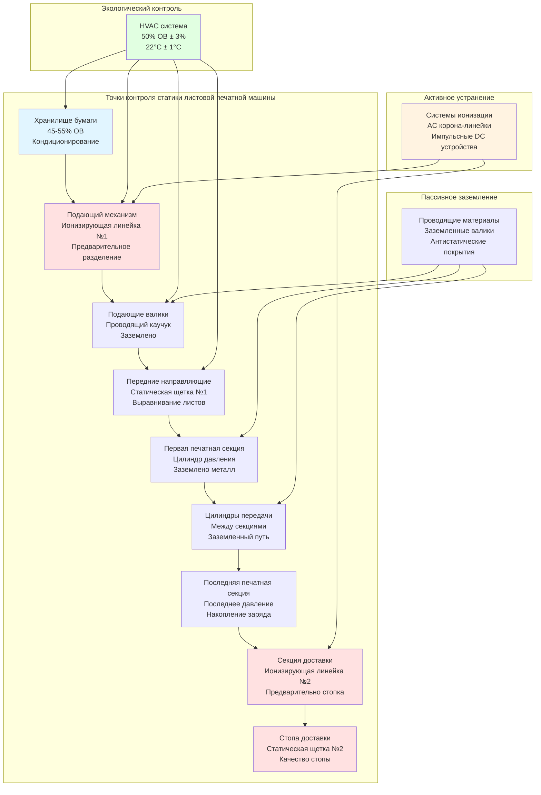

Генерация статического электричества в листовых печатных машинах нарушает производство через ошибки подачи, дефекты приводки, притяжение пыли, удары операторов и в экстремальных случаях создает риск пожара в окружении с растворителями. Понимание физики генерации заряда, накопления и рассеивания позволяет применять эффективные экологические и аппаратурные стратегии управления, которые поддерживают поверхностные напряжения ниже порога 3-5 кВ, где начинаются операционные проблемы.

## Генерация трибоэлектрического заряда

### Основы контактной электризации

Бумага, движущаяся через подающие механизмы листов, цилиндры переноса и системы доставки, генерирует статический заряд посредством трибоэлектрического эффекта. Когда разнородные материалы контактируют и разделяются, электроны переносятся между поверхностями на основе их положения в трибоэлектрическом ряду. Бумага обычно теряет электроны металлическим компонентам машины и резиновым валикам, приобретая положительный поверхностный заряд.

Плотность заряда, накопленная во время событий контакта-разделения, подчиняется:

$$\sigma = \frac{Q}{A} = \epsilon_0 \epsilon_r E_s$$

Где:
- $\sigma$ = Плотность поверхностного заряда (Кл/м²)
- $Q$ = Общий накопленный заряд (Кл)
- $A$ = Площадь контакта (м²)
- $\epsilon_0$ = Абсолютная диэлектрическая проницаемость (8,85×10⁻¹² Ф/м)
- $\epsilon_r$ = Относительная диэлектрическая проницаемость бумаги (2,5-4,0)
- $E_s$ = Напряженность поверхностного электрического поля (В/м)

**Физическое толкование:** каждое событие контакта-разделения переносит характеристическую плотность заряда, зависящую от различий работы выхода материалов. Бумага против стальных валиков генерирует 10-100 нКл/м² за контакт при сухих условиях.

### Развитие поверхностного напряжения

Накопленный заряд создает поверхностный потенциал, который увеличивается при продолжающемся трении:

$$V_{surface} = \frac{Q}{C} = \frac{\sigma \cdot t}{\epsilon_0 \epsilon_r}$$

Где:
- $V_{surface}$ = Поверхностный потенциал (В)
- $t$ = Толщина бумаги (м)
- $C$ = Емкость на единицу площади (Ф/м²)

**Для типичной офсетной бумаги:**
- Толщина: 0,1 мм = 1×10⁻⁴ м
- Относительная диэлектрическая проницаемость: 3,0
- Плотность заряда после множественных контактов: 50 нКл/м²

$$V_{surface} = \frac{50 \times 10^{-9} \times 1 \times 10^{-4}}{8,85 \times 10^{-12} \times 3,0} = 188 \text{ В}$$

Множественные циклы контакта в высокоскоростных механизмах подачи быстро повышают напряжение до проблематических уровней (3-15 кВ) в течение секунд.

### Скорость генерации заряда

Скорость накопления заряда коррелирует со скоростью машины и частотой контактов:

$$\frac{dQ}{dt} = n_c \cdot A_c \cdot \sigma_c \cdot f_{sep}$$

Где:
- $\frac{dQ}{dt}$ = Скорость накопления заряда (Кл/с)
- $n_c$ = Количество точек контакта
- $A_c$ = Площадь контакта на точку (м²)
- $\sigma_c$ = Плотность заряда за контакт (Кл/м²)
- $f_{sep}$ = Частота разделения (контактов/с)

**Пример подающего механизма листов:**
- Скорость машины: 10 000 листов/час = 2,78 листа/с
- Точки контакта: 12 (подающие валики, направляющие, захватывающие устройства)
- Площадь контакта: 0,01 м² на точку
- Заряд за контакт: 30 нКл/м²

$$\frac{dQ}{dt} = 12 \times 0,01 \times 30 \times 10^{-9} \times 2,78 = 1,0 \times 10^{-8} \text{ Кл/с}$$

Накопление заряда на лист: $Q_{sheet} = 3,6 \times 10^{-9}$ Кл = 3,6 нКл

Это кумулятивное заряжение производит поверхностные напряжения 5-10 кВ на отдельных листах на выходе из секции доставки.

## Зависящее от влажности рассеивание заряда

### Механизм поверхностной проводимости

Молекулы воды, адсорбированные на волокнах бумаги, создают проводящий поверхностный слой, обеспечивающий рассеивание заряда посредством ионной проводимости. Удельное поверхностное сопротивление экспоненциально уменьшается с увеличением относительной влажности:

$$\rho_s(RH) = \rho_{s,0} \cdot e^{-k \cdot RH}$$

Где:
- $\rho_s$ = Удельное поверхностное сопротивление (Ом/кв.)
- $\rho_{s,0}$ = Сопротивление при 0% ОВ (типично 10¹⁵-10¹⁶ Ом/кв.)
- $k$ = Коэффициент влажности (0,12-0,18 на %ОВ для бумаги)
- $RH$ = Относительная влажность (%)

**Измеренные значения сопротивления:**

| ОВ (%) | Удельное поверхностное сопротивление (Ом/кв.) | Классификация |
|--------|---------------------------------------------|---------------|
| 15 | 5×10¹³ | Высоко изолирующая |
| 25 | 8×10¹² | Изолирующая |
| 35 | 2×10¹¹ | Умеренно изолирующая |
| 45 | 5×10⁹ | Диссипативная |
| 55 | 1×10⁹ | Диссипативная |
| 65 | 3×10⁸ | Проводящая |

**Критическое наблюдение:** сопротивление уменьшается приблизительно на один порядок величины на 10% увеличения ОВ в диапазоне 30-60% ОВ. Это экспоненциальное соотношение объясняет, почему проблемы статики интенсифицируются быстро ниже 40% ОВ.

### Постоянная времени затухания заряда

Время, необходимое для рассеивания статического заряда посредством поверхностной проводимости, подчиняется:

$$\tau = \rho_s \cdot \epsilon_0 \cdot \epsilon_r$$

Где:
- $\tau$ = Постоянная времени затухания заряда (с)
- $\rho_s$ = Удельное поверхностное сопротивление (Ом/кв.)
- $\epsilon_0 \epsilon_r$ = Эффективная диэлектрическая проницаемость (Ф/м)

**Время затухания относительно влажности:**

| ОВ (%) | Сопротивление (Ом/кв.) | Время затухания (с) | 90% рассеивание (с) |
|--------|----------------------|-------------------|-------------------|
| 20 | 1×10¹³ | 266 | 612 |
| 30 | 5×10¹² | 133 | 306 |
| 40 | 1×10¹¹ | 2,7 | 6,2 |
| 50 | 5×10⁹ | 0,13 | 0,30 |
| 60 | 1×10⁹ | 0,027 | 0,062 |

**Проектировочное следствие:** при 50% ОВ заряды рассеиваются менее чем за 0,5 секунды — быстрее, чем типичное время передачи листа (1-3 секунды между подающим механизмом и первой печатной секцией). Ниже 40% ОВ время рассеивания превышает длительность обработки листа, вызывая накопление заряда.

### Адсорбция молекулярного слоя влаги

Физический механизм, лежащий в основе контроля статики на основе влажности, включает адсорбцию молекул воды на поверхностях целлюлозных волокон. Количество адсорбированных молекулярных слоев коррелирует с относительной влажностью согласно изотерме BET:

$$\frac{W}{W_m} = \frac{C \cdot RH}{(1-RH)[1+(C-1)RH]}$$

Где:
- $W$ = Содержание воды (г H₂O/г сухой бумаги)
- $W_m$ = Емкость монослоя (типично 0,05-0,07)
- $C$ = Константа BET (5-20 для целлюлозы)
- $RH$ = Относительная влажность (доля)

**При 50% ОВ:** бумага содержит приблизительно 2-3 молекулярных слоя адсорбированной воды, достаточно для создания непрерывных путей ионной проводимости поперек поверхностей волокон. Ниже 35% ОВ неполное покрытие монослоем создает изолированные водяные кластеры с плохой связанностью, драматически увеличивая удельное поверхностное сопротивление.

## Проблемы, связанные со статикой

### Дефекты подачи листов

Электростатические силы между заряженными листами вызывают слипание (когда соседние листы имеют противоположную полярность) или отталкивание (одинаковая полярность), оба нарушают работу подающего механизма.

Электростатическое давление между листами, разделенными воздушным зазором $d$, подчиняется:

$$P_{static} = \frac{\epsilon_0 E^2}{2} = \frac{\sigma^2}{2\epsilon_0}$$

Где:
- $P_{static}$ = Электростатическое давление (Па или Н/м²)
- $E$ = Электрическое поле между листами (В/м)
- $\sigma$ = Плотность поверхностного заряда (Кл/м²)

**Пример расчета:**

Лист с поверхностным напряжением 5 кВ на толщине 0,1 мм:
- Электрическое поле: $E = V/t = 5000/(1×10^{-4}) = 5×10^7$ В/м
- Электростатическое давление: $P = (8,85×10^{-12})(5×10^7)^2/2 = 11$ Па = 0,0016 psi

**Сравнение с собственным весом листа:**
- Бумага 80 фунтов на 500 листов: 0,004 psi на лист собственного веса
- Статическое давление: 40% веса листа

Эта величина объясняет подачу двойных листов (электростатическое притяжение превосходит механизмы разделения) и неправильную подачу (статическое отталкивание препятствует надлежащему захвату листа).

### Притяжение пыли и волокон

Заряженные поверхности бумаги притягивают взвешенные в воздухе частицы посредством электростатических сил:

$$F_{attract} = q \cdot E = q \cdot \frac{\sigma}{\epsilon_0}$$

Где:
- $F_{attract}$ = Сила притяжения на частицу (Н)
- $q$ = Заряд частицы (Кл)
- $E$ = Электрическое поле от поверхности бумаги (В/м)

Частицы пыли (диаметр 0,1-10 мкм), несущие типичные атмосферные заряды (10-1000 элементарных зарядов), испытывают силы в 100-10 000× больше гравитационной силы вблизи заряженного листа 5 кВ. Это объясняет:

- Притяжение ворса к стопе доставки, вызывающее дефекты печати
- Накопление бумажной пыли на цилиндрах давления
- Прилипание сбрызгивания краски к неизображенным участкам

### Ошибки приводки и позиционирования листов

Электростатическое отталкивание между бумагой и заземленными металлическими направляющими/цилиндрами вызывает отклонения позиционирования листов:

$$\delta_{position} = \frac{F_{repulsion} \cdot t^2}{2m}$$

Где:
- $\delta_{position}$ = Ошибка позиционирования (м)
- $F_{repulsion}$ = Электростатическая сила (Н)
- $t$ = Время в полете между направляющими (с)
- $m$ = Масса листа (кг)

Для листа 711 мм × 1016 мм (0,15 кг) с заряженностью 8 кВ, проходящего через заземленный направляющий валик при 300 листов/час:
- Сила: ~0,05 Н (перпендикулярно листу)
- Время полета: 0,2 с между отпусканием захватывающего устройства и следующим контактом
- Ошибка позиционирования: 0,3 мм

Это превышает типичные допуски приводки (±0,25 мм), вызывая ошибку совмещения цветов.

## Стратегии контроля статики

### Контроль влажности окружающей среды

Поддержание 45-55% ОВ обеспечивает пассивное рассеивание статики посредством улучшенной поверхностной проводимости. Этот основной метод управления работает непрерывно без требований к техническому обслуживанию или вмешательству оператора.

**Требования к управлению влажностью:**
- Целевое значение: 50% ОВ ± 3% во время производства
- Время отклика: исправить отклонение 5% ОВ в течение 30 минут
- Сезонная регулировка: может снизить до 45% ОВ (зима) или увеличить до 55% ОВ (лето) для минимизации энергии HVAC
- Мониторинг: непрерывные датчики ОВ на уровне печатного стола (0,9-1,2 м над полом)

**Экономическое обоснование:** стоимость капитала контроля влажности (50 000-200 000 долл. США для увлажнения/осушения печатного помещения) предотвращает потери, связанные со статикой, которые обычно стоят 500-2000 долл. США в неделю в средних коммерческих печатных операциях.

### Активные системы ионизации

Ионизаторы с корона-разрядом переменного тока генерируют сбалансированные положительные и отрицательные ионы, которые нейтрализуют поверхностные заряды, когда окружающей влажности недостаточно или при обработке синтетических подложек с изначально высоким сопротивлением.

**Механизм корона-разряда:**

Высокое напряжение (4-7 кВ AC) применяется к острым точкам электродов, создавая локализованную ионизацию воздуха:

$$J_{ion} = \mu \cdot n \cdot E$$

Где:
- $J_{ion}$ = Плотность ионного тока (А/м²)
- $\mu$ = Подвижность ионов (1,4×10⁻⁴ м²/В·с для воздуха)
- $n$ = Концентрация ионов (ионов/м³)
- $E$ = Электрическое поле (В/м)

**Стратегия размещения ионизирующей линейки:**

| Расположение | Цель | Типичный промежуток |
|-----------|------|-------------------|
| Предварительно подающий | Устранить статику хранилища перед разделением | 10-20 см от стопы листов |
| После подающего | Нейтрализовать заряды, вызванные подающим механизмом | 30-45 см после последнего подающего валика |
| Предварительно доставка | Подготовить листы к укладке | 15-30 см перед стопой доставки |
| После доставки | Поддержать стабильность стопы | 30-60 см над доставкой |

**Спецификации производительности:**
- Время разряда до ±100В: < 3 секунд
- Баланс ионов: ±50В остаточное напряжение
- Ширина покрытия: 0,9-1,2 м на ионизирующую линейку
- Потребление энергии: 15-30 Вт на линейку

**Требования к техническому обслуживанию:**
- Очищать точки эмиттера еженедельно (накопление пыли снижает генерацию ионов на 50-80% в течение 2 недель)
- Проверять выход высокого напряжения ежемесячно (4-7 кВ AC)
- Заменять картриджи эмиттера ежегодно или согласно спецификации производителя
- Мониторить электростатическим полемером во время проверок PM

### Проводящие и диссипативные материалы

Компоненты машины, использующие проводящие или статически диссипативные материалы, обеспечивают непрерывное рассеивание заряда посредством заземленных путей.

**Выбор материала:**

| Компонент | Стандартный материал | Удельное сопротивление | Альтернатива контроля статики | Удельное сопротивление |
|-----------|-----------------|-------------------|------------------------|-----------------|
| Подающие валики | Натуральный каучук | 10¹³-10¹⁵ Ом·см | Проводящий каучук | 10⁴-10⁶ Ом·см |
| Захватывающие планки | Анодированный алюминий | Изолирующее покрытие | Открытый алюминий, заземлено | < 10³ Ом·см |
| Цилиндры передачи | Покрытая сталь | Переменное | Проводящее покрытие | 10⁵-10⁷ Ом·см |
| Направляющие доставки | Пластик | 10¹⁴-10¹⁶ Ом·см | Углеродистый пластик | 10⁷-10⁹ Ом·см |

**Требования к заземлению:**
- Сопротивление земле: < 10⁶ Ом для проводящих компонентов
- Проверка: ежеквартальное тестирование мегаомметром
- Перемычки связи: поперек подшипниковых точек и механических соединений
- Полоса статического заземления: основная рама машины к системе заземления здания

### Обработка антистатическими покрытиями

Антистатические спреи и покрытия, применяемые к поверхностям бумаги, временно снижают сопротивление посредством гигроскопических или ионных добавок:

**Механизм:** гигроскопические соединения (гликоли, четвертичные аммониевые соли) притягивают атмосферную влагу к поверхности бумаги, создавая проводящий слой независимо от окружающей ОВ.

**Методы применения:**
- Распыление: ручное или автоматическое при поступлении бумаги
- Встроенное покрытие: во время предыдущей операции печати
- Встроенные добавки: производитель бумаги включает во время производства

**Ограничения:**
- Временный эффект: 2-7 дней длительность в зависимости от рецептуры
- Потенциальное влияние на качество печати: некоторые покрытия влияют на адгезию или сушку краски
- Стоимость: 0,02-0,10 долл. США на лист для распыления
- Несогласованность: ручное применение дает переменные результаты

### Щетки и мишура для устранения статики

Проводящие щетки с заземленными щетинками обеспечивают рассеивание заряда посредством контакта:

**Типы щеток:**
- **Углеродное волокно**: удельное сопротивление 10³-10⁵ Ом·см, отличная долговечность
- **Проводящая мишура**: тонкие металлические полосы, > 99% покрытия контакта
- **Ионизированные воздушные сопла**: комбинирует щеточный контакт с локализованной ионизацией

**Оптимальное размещение:**
- Непосредственно перед захватывающим устройством доставки (предотвращает передачу заряда стопе)
- На выравнивающих/разглаживающих планках (контактирует со всей шириной листа)
- Предварительно укладка стопы (обеспечивает плоскую доставку)

**Требования проектирования:**
- Давление контакта щетки: 0,5-2 oz/линейный дюйм (14-56 г/см)
- Материал щетины: проводящий (< 10⁶ Ом сопротивление земле)
- Покрытие: охватывает полную ширину листа плюс 5 см
- Заземление: проверено < 1 МОм к заземлению машины

## Проблемы статики в секции доставки и укладки

### Накопление заряда в стопе доставки

Последовательные листы, откладывающиеся на стопу доставки, передают заряд ранее сложенным листам. Без рассеивания потенциал стопы повышается:

$$V_{pile}(n) = V_{sheet} \cdot n \cdot (1-e^{-t/\tau})$$

Где:
- $V_{pile}$ = Напряжение поверхности стопы (В)
- $V_{sheet}$ = Напряжение отдельного листа (В)
- $n$ = Количество доставленных листов
- $t$ = Время между листами (с)
- $\tau$ = Постоянная времени разряда (с)

**Пример сценария:**
- Напряжение листа: 6 кВ
- Скорость доставки: 8000 листов/час (2,22 листа/с)
- Время между листами: 0,45 с
- Постоянная времени разряда при 35% ОВ: 5 с

После 100 листов:
$$V_{pile}(100) = 6000 \cdot 100 \cdot (1-e^{-0,45/5}) = 51 400 \text{ В}$$

Это напряжение создает:
- Опасность удара оператора при касании стопы
- Отталкивание между листами, вызывающее неровную укладку
- Притяжение пыли к верхним листам
- Потенциальный пробой дуги к заземленным компонентам машины

### Слипание и блокирование листов

Противоположные заряды полярности на соседних листах создают силы притяжения, вызывающие блокирование (листы сопротивляются разделению во время последующих операций доделки):

$$F_{adhesion} = \frac{\sigma_1 \sigma_2 A}{2\epsilon_0}$$

Где:
- $F_{adhesion}$ = Сила адгезии между листами (Н)
- $\sigma_1, \sigma_2$ = Плотности заряда на соседних листах (Кл/м²)
- $A$ = Площадь контакта (м²)

Для листов 711 мм × 1016 мм с противоположными зарядами ±3 кВ:
- Плотность заряда: ±27 нКл/м² (при толщине 0,1 мм)
- Площадь контакта: 0,72 м²
- Сила адгезии: 0,28 Н = 28 г

Эта сила, распределенная по листу, вызывает адгезию, достаточную для повреждения покрытия при разделении или неправильной подачи в оборудовании доделки.

### Контроль статики в секции доставки

**Предварительная ионизация доставки:** ионизирующая линейка, размещенная 15-30 см перед захватывающим устройством доставки, нейтрализует заряд, накопленный во время печати:

- Снижает напряжение листа с 8-12 кВ до < 500 В
- Предотвращает передачу заряда к стопе доставки
- Минимизирует опасность удара оператора

**Заземление стопы:** проводящие опоры стопы доставки с проверенным соединением заземления (< 1 МОм сопротивление) обеспечивают путь рассеивания остаточного заряда.

**Применение антистатического спрея:** встроенные системы распыления применяют диссипативное покрытие непосредственно после печати:

- Снижает напряжение стопы доставки на 70-90%
- Улучшает стабильность стопы (снижает движение листов)
- Облегчает последующие операции доделки

**Оптимизация высоты стопы:** ограничение высоты стопы доставки до 30-45 см снижает кумулятивное накопление заряда и улучшает доступность механизмов рассеивания заряда.

## Диагностика и решение проблем статики

| Симптом проблемы | Вероятная причина | Метод проверки | Решение |
|----------------|----------------|---------------|--------|
| Подача двойных листов | Листы электростатически прилипли | Электростатический полемер: > 5 кВ | Увеличить ОВ до 50%, установить ионизирующую линейку предварительно подающую |
| Неправильная подача, перекос листа | Электростатическое отталкивание | Измерение поверхностного напряжения во время подачи | Проверить функцию ионизатора, проверить ОВ > 45% |
| Пыль на печатанных листах | Заряженная поверхность притягивает частицы | Визуальный осмотр + проверка напряжения | Ионизирующая линейка предварительно доставка, улучшить фильтрацию |
| Неровная стопа доставки | Электростатическое отталкивание между листами | Измерение напряжения стопы: > 3 кВ | Ионизирующая линейка после доставки, антистатический спрей |
| Удары оператора | Высокое напряжение стопы | Портативный полемер: > 5 кВ стопа | Проверить заземление, увеличить влажность, ионизация |
| Дрейф приводки | Статическое отклонение между направляющими | Прогрессивный паттерн ошибки приводки | Улучшить стабильность управления влажностью, добавить ионизирующую линейку в середине машины |
| Блокирование листов в стопе | Противоположная полярность адгезии | Тест силы разделения, проверка полярности напряжения | Сбалансировать выход ионизатора, обеспечить AC (не DC) корона |
| Сбрызгивание/напыление краски | Высокое напряжение вблизи чернильного аппарата | Измерение напряжения у цилиндра давления | Контроль влажности, заземление всех валиков, снизить скорость машины |
| Обрывы сетки (ножница) | Накопленный заряд в точке разреза | Всплеск напряжения во время цикла резки | Ионизатор перед ножом, увеличить ОВ |
| Риск пожара/взрыва | Паров растворителя + статический разряд | Мониторинг атмосферы + проверка напряжения | Критично: ионизация, влажность, надлежащая вентиляция |

## Измерение и мониторинг

### Электростатические полемеры

Бесконтактные полемеры измеряют поверхностное напряжение с расстояния 10-30 см:

**Спецификации:**
- Диапазон: 0-20 кВ типично для печатных применений
- Точность: ±5% от показания ±3 цифры
- Время отклика: < 1 секунда
- Расстояние измерения: откалибровано для конкретного промежутка (типично 2,5 см)

**Протокол измерения:**
- Измерять на выходе подающего механизма, между печатными секциями, входе доставки и вершине стопы
- Записать максимальное и среднее напряжения во время производственного цикла
- Установить базовый уровень при оптимальной влажности (50% ОВ)
- Исследовать, когда напряжения превышают базовый уровень в 2 раза

### Тестирование сопротивления

Измерения удельного поверхностного сопротивления проверяют проводимость бумаги и выбор материала:

**Метод:** применить концентрические кольцевые электроды, измерить сопротивление при приложенном потенциале 10В или 100В согласно ASTM D257.

**Толкование:**
- < 10⁵ Ом/кв.: проводящая (статика не проблема)
- 10⁵-10¹¹ Ом/кв.: статически диссипативная (приемлема с заземлением)
- 10¹¹-10¹³ Ом/кв.: изолирующая (требует контроль влажности + ионизация)
- > 10¹³ Ом/кв.: высоко изолирующая (ожидается серьезная статика)

### Системы непрерывного мониторинга

Автоматизированные системы мониторинга статики обеспечивают отслеживание напряжения в реальном времени:

**Компоненты:**
- Фиксированные полемеры в критических точках управления
- Логгер данных с анализом тренда
- Выходы сигнализации, когда напряжение превышает пороги
- Интеграция с системой управления машиной

**Преимущества:**
- Раннее обнаружение отказов контроля влажности
- Идентификация неисправности ионизатора
- Анализ корреляции качества производства
- Оптимизация графика техническое обслуживания

---

*Контроль статического электричества в листовых печатных машинах комбинирует пассивное управление окружающей средой посредством точной регулировки влажности (45-55% ОВ) с активными системами ионизации и проводящими материалами для поддержания поверхностных напряжений ниже порога 3-5 кВ, который вызывает ошибки подачи, ошибки приводки, притяжение пыли и проблемы безопасности оператора, требующие интегрированного проектирования систем HVAC и компонентов машины для достижения согласованного рассеивания заряда на всем пути бумаги от подающего механизма к стопе доставки.*
