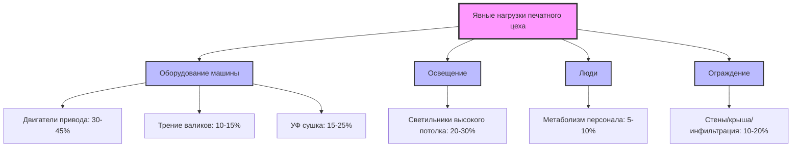
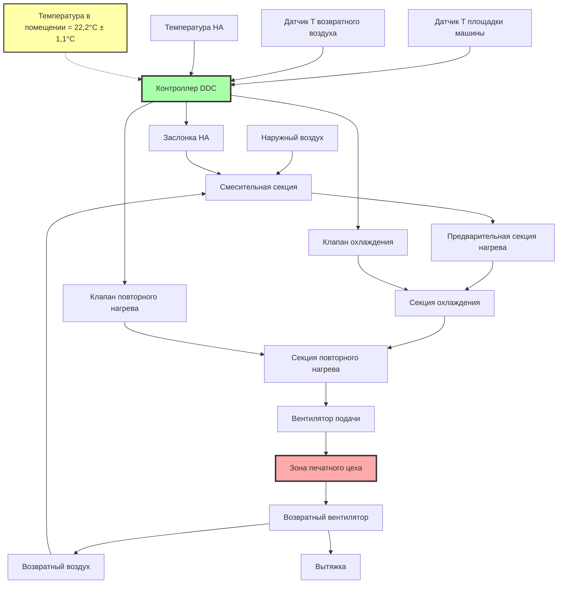

# Регулирование температуры 21-24°C для листовой печати

Листовая литографическая печать требует точного контроля температуры в диапазоне 21-24°C (70-75°F) для сохранения реологических свойств чернил, обеспечения размерной стабильности компонентов машины и достижения стабильного качества печати на протяжении продолжительных производственных циклов. Изменения температуры непосредственно влияют на вязкость чернил, липкость и характеристики передачи, тогда как термическое расширение прецизионных механических компонентов влияет на точность совмещения красок.

Отраслевой стандарт 21-24°C представляет собой инженерный компромисс, балансирующий несколько физических ограничений: требования составов чернил, равновесие кондиционирования бумаги, термическое расширение компонентов машины, удобство операторов и энергоэффективность.

## Физическая основа для спецификации температуры

### Температурная зависимость вязкости чернил

Литографические чернила проявляют сильное зависящее от температуры реологическое поведение, определяемое соотношением Аррениуса. Динамическая вязкость экспоненциально снижается с увеличением температуры в соответствии с:

$$\mu(T) = A \cdot e^{E_a/(R \cdot T)}$$

Где:
- $\mu$ = Динамическая вязкость (Па·с)
- $T$ = Абсолютная температура (К)
- $A$ = Предэкспоненциальный множитель (материальная константа)
- $E_a$ = Энергия активации для вязкого течения (Дж/моль)
- $R$ = Универсальная газовая постоянная (8,314 Дж/моль·К)

**Практическая линеаризация** для небольших диапазонов температур дает:

$$\frac{\mu_2}{\mu_1} = e^{-\beta(T_2 - T_1)}$$

Где $\beta$ — температурный коэффициент вязкости, обычно 0,020-0,035 К⁻¹ для офсетных литографических чернил.

**Пример расчета** для процессного голубого чернила:

При эталонной температуре $T_1 = 22°C$ (295,4 К), $\mu_1 = 45$ Па·с

Температурный коэффициент: $\beta = 0,028$ К⁻¹

Температура повышается до $T_2 = 25°C$ (298,2 К):

$$\mu_2 = 45 \times e^{-0,028 \times (298,2 - 295,4)} = 45 \times e^{-0,078} = 45 \times 0,925 = 41,6 \text{ Па·с}$$

**Результат:** Повышение температуры на 3°C снижает вязкость чернил на 7,5%, что существенно влияет на передачу чернил, прирост точек и плотность цвета.

### Влияние температуры на липкость чернил

Липкость чернил (адгезивное сопротивление при разделении между валиками и подложкой) следует аналогичной температурной зависимости:

$$\text{Липкость}(T) = \text{Липкость}_0 \cdot e^{-\alpha(T - T_0)}$$

Где $\alpha = 0,015-0,025$ К⁻¹ для типичных литографических чернил.

**Последствия изменения липкости:**

| Изменение температуры | Изменение липкости | Влияние на качество печати |
|------------------------|--------------------|---------------------------|
| +1,7°C | -4 до -6% | Сниженная передача чернил, более легкая плотность |
| +2,8°C | -7 до -11% | Плохое наложение красок, снижение захвата |
| +5,6°C | -14 до -22% | Требуется чрезмерная толщина пленки чернил, распыление |
| -1,7°C | +4 до +6% | Повышенный захват, наслоение на валике |
| -2,8°C | +7 до +11% | Сильный захват на мелованной бумаге |

### Термическое расширение компонентов машины

Прецизионные литографические машины поддерживают допуски совмещения ±0,076-0,254 мм. Термическое расширение компонентов машины влияет на эти допуски:

$$\Delta L = L_0 \cdot \alpha_L \cdot \Delta T$$

Где:
- $\Delta L$ = Изменение длины
- $L_0$ = Исходный размер
- $\alpha_L$ = Коэффициент линейного термического расширения
- $\Delta T$ = Изменение температуры

**Коэффициенты расширения материалов:**

| Материал | Коэффициент (10⁻⁶/°C) | Применение |
|----------|----------------------|-----------|
| Сталь (рама машины) | 11,7 | Основная конструкция, цилиндры |
| Алюминий (валики чернил) | 23,4 | Оси валиков, облегченные компоненты |
| Чугун (цилиндры) | 10,4 | Формные, офсетные, прижимные цилиндры |
| Резина (офсетная пластина) | 144-216 | Изменение размеров офсетной пластины |

**Пример:** 1,016-метровый стальной прижимной цилиндр, испытывающий изменение температуры на 5,6°C:

$$\Delta L = 1,016 \text{ м} \times 11,7 \times 10^{-6} \text{/°C} \times 5,6°C = 0,000066 \text{ м} = 0,066 \text{ мм}$$

Это расширение на 0,066 мм приближается к допуску совмещения, демонстрируя необходимость плотного контроля температуры.

## Влияние температуры на качество печати

### Изменение прироста точек

Прирост галфтонных точек (физическое расширение сверх номинального размера точки) тесно коррелирует с вязкостью чернил и их липкостью:

$$\text{Прирост точки} = k_1 \cdot \frac{P^2}{\mu \cdot v}$$

Где:
- $P$ = Давление печати
- $\mu$ = Вязкость чернил
- $v$ = Скорость машины
- $k_1$ = Константа пропорциональности

Более низкая вязкость (более высокая температура) увеличивает прирост точки, затемняя полутона и тени.

| Параметр | 20°C | 22°C | 24°C | Влияние |
|----------|------|------|------|---------|
| Вязкость чернил (Па·с) | 48,5 | 45,0 | 41,8 | Эталон |
| Прирост точки @ 50% (%) | 14 | 16 | 18 | Затемнение полутонов |
| Плотность цвета (D) | 1,42 | 1,38 | 1,34 | Снижение сплошной плотности |
| Первичное наложение (%) | 78 | 80 | 82 | Улучшенное наложение |
| Тенденция к захвату | Высокая | Средняя | Низкая | Зависит от материала |

### Требования к постоянству цвета

Печать триадными красками требует изменения плотности цвета в пределах ±0,05 единиц плотности для сохранения приемлемого постоянства цвета. Вызванные температурой изменения вязкости непосредственно влияют на плотность:

$$\Delta D = k_2 \cdot \frac{\Delta \mu}{\mu}$$

Где $k_2 \approx 0,3-0,4$ для типичных литографических условий.

**Пример:** Повышение температуры на 2,8°C, вызывающее снижение вязкости на 7,5%:

$$\Delta D = 0,35 \times 0,075 = 0,026 \text{ единиц плотности}$$

Это представляет 52% допустимого допуска ±0,05, оставляя минимальный запас для других переменных процесса.

## Обоснование диапазона работы 21-24°C

### Обоснование нижнего предела (21°C)

**Производительность чернил:** Ниже 21°C вязкость чернил увеличивается до уровней, вызывающих:
- Повышенный захват на мелованной бумаге (липкость чернил превышает прочность поверхности бумаги)
- Плохой поток и дозирование чернил в системах источников
- Чрезмерное трение валиков и выделение тепла
- Снижение эффективности наложения красок при многокрасочной печати

**Энергетические соображения:** Более низкие уставки увеличивают потребление энергии на отопление без соответствующих преимуществ для качества печати.

**Удобство операторов:** Ниже 18°C производительность операторов снижается во время продолжительных смен на станциях ручной подачи и контроля.

### Обоснование верхнего предела (24°C)

**Производительность чернил:** Выше 24°C пониженная вязкость вызывает:
- Чрезмерную эмульсификацию чернил (усвоение воды в литографических системах)
- Повышенное распыление и спрей чернил на высокоскоростных машинах
- Плохие характеристики передачи, требующие более тяжелых пленок чернил
- Тенденцию к закупориванию из-за неадекватного баланса чернил и воды

**Кондиционирование бумаги:** Температуры выше 24°C ускоряют потерю влаги из кондиционированной бумаги, особенно в сочетании с умеренными уровнями влажности (45-55% ОВ).

**Соображения оборудования:** Более высокие температуры увеличивают требования охлаждения для двигателей привода машины и гидравлических систем.

## Требования к проектированию систем HVAC

### Допуск контроля температуры

Поддерживайте температуру сухого термометра в печатном цехе на уровне 22,2°C ±1,1°C во время производства:

**Пространственное единообразие:** Максимальное горизонтальное изменение температуры в помещении печатного цеха на высоте 1,22 м (уровень площадки машины) не более ±0,8°C.

**Временная стабильность:** Максимальное отклонение от уставки ±1,1°C в течение любого 4-часового производственного периода.

**Вертикальная стратификация:** ≤1,7°C между высотами 0,15 м и 1,83 м для предотвращения изменений кондиционирования бумаги между хранилищем и площадкой машины.

### Характеристики нагрузки

**Явные тепловые нагрузки** доминируют в тепловых нагрузках печатного цеха:

**Типичное распределение явной нагрузки печатного цеха:**
- Листовая литографическая машина (1,016 м, 250 листов/мин): 35,2-52,7 кВт
- Освещение (215 Вт/м² × 93 м²): 20 кВт
- Люди (8 операторов × 132 Вт): 1,05 кВт
- Ограждение и инфильтрация: переменная, 5,9-17,6 кВт

**Общая охлаждающая нагрузка:** 62-91 кВт

### Стратегия системы управления

**Последовательность управления:**

1. **Первичное управление охлаждением:** Модулировать клапан ледяной воды для поддержания 22,2°C на датчике площадки машины
2. **Режим экономайзера:** Когда температура наружного воздуха < 18°C и влажность подходящая, увеличить заслонку наружного воздуха до 100% для свободного охлаждения
3. **Подстройка повторного нагрева:** Точная настройка температуры выпуска с использованием катушки горячей воды во время работы экономайзера
4. **Ночное снижение:** Поддерживать 20°C во время непроизводственных часов для сокращения времени восстановления (в сравнении с более глубоким снижением)

### Проектирование распределения воздуха

**Подход вытесняющей вентиляции** для печатных цехов:

- Температура подаваемого воздуха: 16-18°C (ΔT = 4-7°C)
- Скорость подаваемого воздуха на диффузоре: 0,5-1 м/с
- Скорость на площадке машины (1,22 м): <0,25 м/с (предотвращает нарушение бумаги)
- Кратность воздухообмена: 4-6 ACH для контроля температуры, 8-12 ACH при наличии использования растворителей

**Размещение диффузоров подачи:**
- Низкие боковые решетки (0,3-0,6 м над полом)
- Подпольные камеры вытеснения (где возможно)
- Потолочные диффузоры с отклоняющимися выпусками, направляющими воздух вверх изначально

**Стратегия возвратного воздуха:**
- Высокие боковые или потолочные возвраты для захвата тепловой конвекции
- Размещение выше тепловых источников (УФ сушка, двигатели привода)
- Избегайте размещения возвратного воздуха, создающего короткое замыкание с подаваемым воздухом

### Спецификации оборудования

**Размер блока обработки воздуха:**

Для печатного цеха 93 м², высота потолка 3,66 м:

**Мощность охлаждения:** 73 кВт при условиях ARI

**Расход воздуха:**
- Минимум: 0,2 м³/(с·м²) × 93 м² = 18,6 м³/с (6,000 CFM)
- Проектный: 3,77 м³/с (8,000 CFM) (обеспечивает снижение для переменных нагрузок)

**Охлаждающая катушка:**
- Входящий воздух: 24°C ОЖ, 16,7°C ВЖ (возвратный воздух, смешанный с наружным)
- Выходящий воздух: 13°C ОЖ, 12,2°C ВЖ
- Температура воды: 7,2°C вход, 13°C выход
- 6 рядов, 10 FPI для плотного управления температурой выхода

**Катушка повторного нагрева:**
- Мощность: 22-29 кВт
- Горячая вода: 60°C подача, 49°C возврат
- 2 ряда, 8 FPI для быстрого отклика

**Вентилятор подачи:**
- Тип: Плена или заключенный центробежный с отклоняющимся назад колесом
- Двигатель: Преобразователь частоты для оптимизации режима экономайзера
- Статическое давление: 87-110 Па (сеть распределения + фильтрация)

## Мониторинг и проверка температуры

### Размещение датчиков

**Критические места мониторинга:**

1. **Датчик площадки машины (первичное управление):** 1,22 м над готовым полом, в пределах 3 м от станции оператора машины, защищен от прямых источников тепла
2. **Датчик возвратного воздуха (проверка):** Основной возвратный канал, в 10 диаметрах канала ниже по потоку от возвратной решетки
3. **Датчик подаваемого воздуха (диагностика):** Канал подачи после катушки повторного нагрева, проверяет температуру выпуска
4. **Датчик наружного воздуха:** Северная сторона стены, защищен от излучения

**Спецификации датчиков:**
- Тип: Датчик сопротивления температуры (RTD), Pt1000 или Pt100
- Точность: ±0,3°C или лучше
- Время отклика: <60 секунд до 63,2% ступенчатого изменения
- Калибровка: Ежегодная проверка по стандарту, отслеживаемому NIST

### Картирование температуры

**Процедура пространственной проверки:**

Проводите картирование температуры ежеквартально во время производственных условий:

1. Установите сетку с шагом 6,1 м по площади печатного цеха
2. Измерьте температуру в каждой точке сетки на высоте 1,22 м
3. Запишите непрерывно минимум 4 часа
4. Рассчитайте пространственное стандартное отклонение (цель: σ < 0,6°C)
5. Определите и исправьте зоны, превышающие ±0,8°C от уставки

**Временной тренд:**

Мониторьте и логируйте температуру площадки машины с интервалом 1 минута:
- Ежедневное максимальное отклонение от уставки
- Стандартное отклонение в течение 8-часовой смены
- Корреляция с наружными условиями и графиком производства
- Частота циклирования контура управления (цель: <2 цикла в час)

## Взаимодействие с контролем влажности

Контроль температуры и влажности взаимодействуют через психрометрические соотношения. Диапазон температур 21-24°C в сочетании со спецификацией 45-55% ОВ создает следующие условия:

| Температура | ОВ | Точка росы | Абс. влажность | Энтальпия |
|-------------|----|-----------|--------------| ---------|
| 21,1°C | 45% | 8,5°C | 7,1 г/кг | 39,5 кДж/кг |
| 21,1°C | 55% | 11,5°C | 8,7 г/кг | 43,1 кДж/кг |
| 23,9°C | 45% | 10,9°C | 8,1 г/кг | 43,6 кДж/кг |
| 23,9°C | 55% | 14,1°C | 9,9 г/кг | 47,8 кДж/кг |

**Критическое замечание:** Повышение температуры на 2,8°C при постоянных 50% ОВ увеличивает абсолютную влажность на 14,6% (7,1 на 8,1 г/кг), влияя на влажность бумаги и размерную стабильность.

**Требование координированного управления:** Контуры управления температурой должны координироваться с системами увлажнения/осушения, чтобы предотвратить одновременное нагревание/увлажнение или охлаждение/осушение, что приводит к потерям энергии и дестабилизирует условия.

## Рассмотрения энергоэффективности

### Работа экономайзера

Печатные цехи с высокими явными нагрузками значительно выигрывают от работы воздушного экономайзера:

**Предпосылки для экономайзера:** Когда температура наружного воздуха < 18°C и точка росы наружного воздуха < 10°C, используйте 100% наружный воздух для охлаждения.

**Потенциал годовой экономии** (зависит от климата):

| Климатическая зона | Часы экономайзера/год | Снижение энергии охлаждения |
|--------------|----------------------|--------------------------|
| Холодный (Миннеаполис) | 4200-5000 | 45-60% |
| Умеренный (Нью-Йорк) | 3000-4000 | 35-50% |
| Теплый (Атланта) | 1800-2500 | 20-35% |
| Горячий (Феникс) | 800-1200 | 10-18% |

**Предупреждения:**
- Фильтруйте наружный воздух минимум MERV 13 (предотвращает загрязнение пылью)
- Проверьте, что влажность наружного воздуха подходящая перед увеличением заслонки наружного воздуха
- Поддерживайте минимальное наружное количество воздуха согласно кодексу во время работы экономайзера

### Стратегия ночного снижения

**Неглубокое снижение** до 20°C во время непроизводственных часов:

**Экономия энергии:** Снижение на 15-25% в отоплении/охлаждении во время периодов отсутствия людей

**Время восстановления:** 60-90 минут для восстановления уставки 22,2°C (в сравнении с 3-4 часами при более глубоком снижении)

**Кондиционирование бумаги:** Минимальное влияние на равновесную влажность бумаги (изменения EMC <0,2% для колебания температуры на 2,2°C при постоянной ОВ)

**Глубокое снижение не рекомендуется:** Температурные колебания >4,4°C нарушают кондиционирование бумаги, вызывая задержки в производстве, пока материал переходит в равновесие.

## Отраслевые стандарты и ссылки

**Справочник ASHRAE - Приложения HVAC, Раздел 21:** Определяет требования к окружающей среде типографий, включая диапазон температур 21-24°C для литографических операций.

**Технические отчеты GATF/PIA:** Документируют характеристики чернил и передовую практику управления окружающей средой для коммерческой печати.

**ISO 12647-2 (Управление процессом для офсетных литографических процессов):** Ссылаются на стандартные условия печати 22°C ±2°C для управления процессом и соответствия цвета.

**Экологические руководства полиграфических промышленностей Америки:** Предоставляют подробные спецификации HVAC для различных полиграфических процессов с акцентом на допуски контроля температуры.

---

*Спецификация температуры 21-24°C для листовой литографической печати представляет собой основанный на физике компромисс, балансирующий требования реологии чернил, тепловую стабильность компонентов машины, равновесие кондиционирования бумаги и энергоэффективность, требующий прецизионных систем HVAC с допуском управления ±1,1°C и координированное управление влажностью для поддержания стабильного качества печати на протяжении производственных циклов.*
