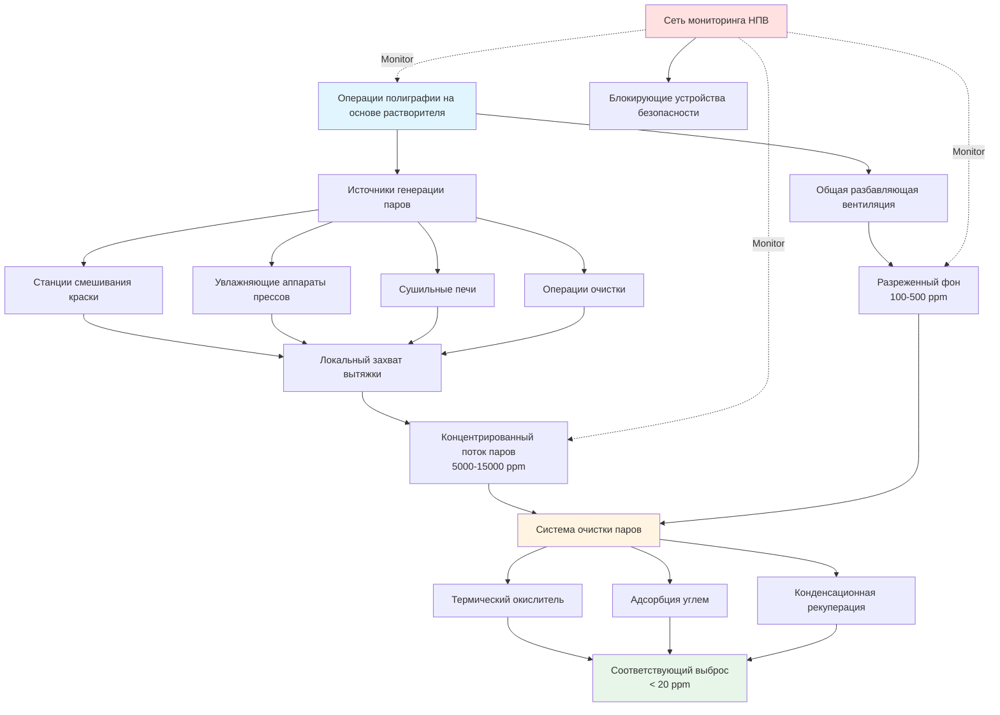
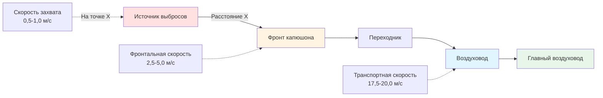
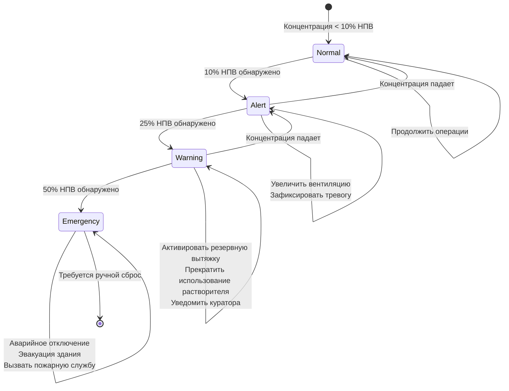
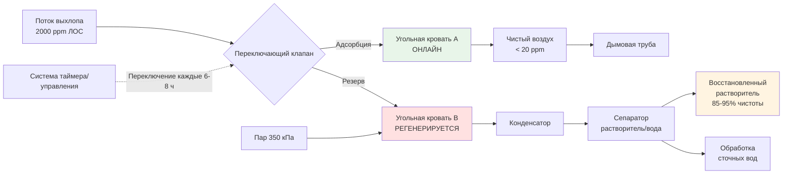
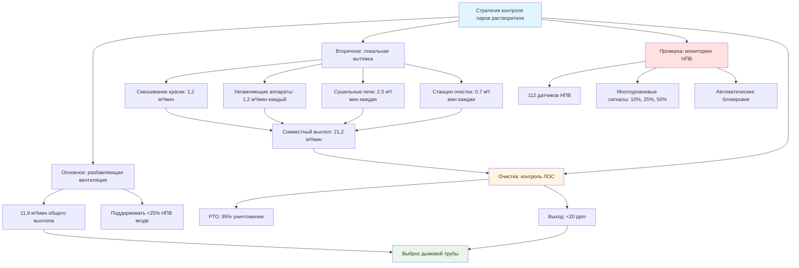

## Обзор систем контроля паров растворителя

Полиграфические предприятия, использующие краски и покрытия на основе растворителей, генерируют выбросы летучих органических соединений (ЛОС), требующие специализированных систем вентиляции и контроля. Эти системы должны одновременно обеспечивать безопасность рабочих посредством мониторинга нижнего предела воспламенения (НПВ), экологическое соответствие нормативам EPA и эффективный захват и очистку паров растворителей.

Основная проблема при проектировании HVAC полиграфических предприятий — поддержание концентрации паров растворителя значительно ниже предела воспламенения при захвате выбросов для очистки перед атмосферным выбросом. Современные объекты используют многоуровневый подход: разбавляющая вентиляция обеспечивает базовую безопасность, локальная вытяжка захватывает концентрированные пары у источника, мониторинг НПВ проверяет производительность системы, а системы рекуперации или уничтожения паров обеспечивают соответствие нормативам.

## Источники выбросов ЛОС и их характеристики

Полиграфические операции генерируют выбросы ЛОС из множественных источников:

**Основные точки выбросов:**
- Станции смешивания и подготовки краски
- Увлажняющие аппараты и системы подачи краски прессов
- Сушильные печи и зоны отверждения
- Операции очистки с использованием растворителей
- Хранение и обработка отработанного растворителя

Распространённые полиграфические растворители включают толуол, МЭК (метилэтилкетон), ацетон, этилацетат и изопропиловый спирт. Каждый растворитель имеет отличные свойства, влияющие на проектирование вентиляции:

| Растворитель | НПВ (%) | Плотность пара | Концентрация насыщения (ppm) |
|---------|---------|---------------|-------------------------------|
| Толуол | 1,2 | 3,14 | 37 000 при 25°C |
| МЭК | 1,4 | 2,42 | 130 000 при 25°C |
| Ацетон | 2,5 | 2,00 | 308 000 при 25°C |
| Этилацетат | 2,0 | 3,04 | 119 000 при 25°C |

Все эти растворители производят пары, более тяжёлые, чем воздух, которые имеют тенденцию накапливаться в низких областях без надлежащей вентиляции.

## Проектирование разбавляющей вентиляции

Разбавляющая вентиляция обеспечивает основной механизм безопасности путём поддержания концентрации паров растворителя ниже 25% от НПВ (распространённый стандарт промышленной безопасности согласно NFPA 86). Требуемый расход вентиляции зависит от скорости испарения растворителя, эффектов плотности пара и целевого уровня разбавления.

### Теоретическая основа расчётов разбавления

Фундаментальный принцип вытекает из материального баланса: скорость генерации пара растворителя должна быть равна скорости удаления путём вентиляции для поддержания стационарной концентрации.

$$\dot{m}_{evap} = Q \times \rho_{air} \times C_{target}$$

Где:
- $\dot{m}_{evap}$ = Скорость испарения растворителя (кг/мин)
- $Q$ = Расход вентиляции (м³/мин)
- $\rho_{air}$ = Плотность воздуха (кг/м³)
- $C_{target}$ = Целевая концентрация (кг растворителя/кг воздуха)

Преобразование к объёмной концентрации с использованием идеального газового закона при стандартных условиях:

$$Q_{dilution} = \frac{\dot{m}_{evap} \times 387 \times T}{MW \times C_{ppm} \times 10^{-6}}$$

Упрощённо для комнатной температуры (530°R):

$$Q_{dilution} = \frac{403 \times \dot{m}_{evap} \times SG}{LEL \times SF}$$

Где:
- $Q_{dilution}$ = Требуемый расход воздуха (м³/ч)
- $\dot{m}_{evap}$ = Скорость испарения (кг/ч)
- $SG$ = Удельный вес растворителя
- $LEL$ = Нижний предел воспламенения (% по объёму)
- $SF$ = Коэффициент безопасности (4 для 25% НПВ, 10 для 10% НПВ)
- $MW$ = Молекулярная масса (г/моль)

### Пример проектирования: печать глубокой печати

Параметры работы пресса:
- Испарение толуола: 2,3 кг/ч = 0,038 кг/мин
- Свойства растворителя: $SG = 0,867$, $MW = 92$, $LEL = 1,2\%$
- Целевая концентрация: 25% НПВ (коэффициент безопасности = 4)

$$Q_{dilution} = \frac{403 \times 0,038 \times 0,867}{1,2 \times 4} = \frac{13,3}{4,8} = 2,8 \text{ м}^3/\text{мин}$$

**Коррекция на эффективность смешивания:** Это предполагает идеальное мгновенное смешивание во всём пространстве. В реальных объектах наблюдаются градиенты концентрации из-за:
- Расслоения от различий в плотности пара
- Мёртвых зон с плохой циркуляцией воздуха
- Расстояния от источника выбросов до точек выхода
- Переходных всплесков выбросов

Применить коэффициент смешивания $K = 3$ до $5$ на основе геометрии объекта:

$$Q_{actual} = K \times Q_{dilution} = 4 \times 2,8 = 11,2 \text{ м}^3/\text{мин}$$

Выбор проектирования: система общей вентиляции 11,9 м³/мин (12 м³/мин).

### Эффекты плотности пара

Все распространённые полиграфические растворители производят пары, более тяжёлые, чем воздух, создавая проблемы с расслоением:

**Относительная плотность пара:**

$$\rho_{vapor,rel} = \frac{MW_{solvent}}{MW_{air}} = \frac{MW_{solvent}}{29}$$

| Растворитель | Молекулярная масса | Относительная плотность | Тенденция расслоения |
|---------|------------------|------------------|------------------------|
| Толуол | 92 | 3,17 | Высокая |
| МЭК | 72 | 2,48 | Высокая |
| Ацетон | 58 | 2,00 | Средняя |
| Этилацетат | 88 | 3,03 | Высокая |
| IPA | 60 | 2,07 | Средняя |

**Последствия для проектирования:**
- Предусмотреть низкоуровневые точки выхода (30-45 см над полом) для захвата оседлых паров
- Поддерживать скорость воздуха 0,25-0,5 м/с на уровне пола для предотвращения накопления
- Избегать создания застойных зон рядом с хранилищами растворителей или зонами сбора отходов

## Проектирование локальной вытяжной вентиляции

Хотя разбавляющая вентиляция обеспечивает фоновую безопасность, локальная вытяжная вентиляция (ЛВВ) захватывает пары у источника, снижая общие требования к вентиляции и концентрируя выбросы для эффективной очистки. Проектирование ЛВВ следует принципам ACGIH Industrial Ventilation Manual.

### Основы капюшонов захвата

Требуемый расход воздуха для захвата загрязнений зависит от геометрии капюшона, скорости выбросов и расстояния от источника:

**Уравнение скорости захвата:**

$$Q_{hood} = V_c \times A_{capture}$$

Где:
- $Q_{hood}$ = Расход капюшона (м³/ч)
- $V_c$ = Скорость захвата в самой дальней точке выбросов (м/мин)
- $A_{capture}$ = Площадь поперечного сечения захватывающей оболочки (м²)

**Для наружных капюшонов** (источник вне границ капюшона):

$$Q = V_c \times (10X^2 + A_{hood})$$

Где:
- $X$ = Расстояние от фронта капюшона до источника загрязнения (м)
- $A_{hood}$ = Площадь фронта капюшона (м²)

**Для закрывающих капюшонов** (источник внутри капюшона):

$$Q = V_{face} \times A_{opening}$$

### Проектирование ЛВВ для конкретных применений

**Вытяжка станции смешивания краски:**

Открытый резервуар с поверхностью с летучим испарением растворителя требует боковой вытяжки или кольцевой вытяжки:

$$Q = V_c \times L \times (5X + W)$$

Для прямоугольного резервуара:
- $L$ = Длина резервуара (м)
- $W$ = Ширина резервуара (м)
- $X$ = Расстояние от капюшона до дальнего края (м)
- $V_c$ = 0,5-0,75 м/с для растворителей

Пример: резервуар 0,6 м × 0,9 м, капюшон установлен на 0,3 м от края:
$$Q = 0,6 \times 0,9 \times (5 \times 0,3 + 0,6) = 0,54 \times 2,1 = 1,13 \text{ м}^3/\text{мин}$$

**Захват увлажняющего аппарата пресса:**

Боковой щелевой капюшон, расположенный на 30-45 см от аппарата, обеспечивает эффективный захват:

$$Q = 50 \times L \times (10X + W_{slot})$$

Для пресса шириной 1,5 м со щелевым капюшоном на расстоянии 0,3 м:
$$Q = 50 \times 1,2 \times (10 \times 0,3 + 0,15) = 1,8 \text{ м}^3/\text{мин}$$

**Навесные капюшоны сушильных печей:**

Высокотемпературные завесы паров с плавучестью захватываются навесными капюшонами с меньшими фронтальными скоростями:

$$Q = 1,4 \times P \times H \times \sqrt{H}$$

Где:
- $P$ = Периметр печи (м)
- $H$ = Высота капюшона над печью (м)

Для печи 2,4 м × 1,2 м с капюшоном на высоте 0,9 м:
$$Q = 1,4 \times 7,2 \times 0,9 \times \sqrt{0,9} = 1,4 \times 7,2 \times 0,85 = 8,5 \text{ м}^3/\text{мин}$$

Добавить 25-50% для неидеальных условий: 10,6-12,8 м³/мин.

**Закрытые станции очистки:**

Полностью закрытые станции с единственным отверстием доступа обеспечивают максимальную эффективность захвата:

$$Q = V_{face} \times A_{opening} + Q_{makeup}$$

Целевая фронтальная скорость: 0,5-0,75 м/с для паров органических растворителей

Отверстие 1,2 м × 0,9 м:
$$Q = 0,6 \times 1,08 = 0,65 \text{ м}^3/\text{мин}$$

### Проектирование воздуховодов для транспорта паров растворителя

**Минимальные транспортные скорости** предотвращают конденсацию пара и осаждение взвешенных частиц:

| Транспортируемый материал | Минимальная скорость |
|---------------------|------------------|
| Только пары растворителя | 10 м/с |
| Пары + лёгкий туман | 15 м/с |
| Пары + тяжёлый туман | 17,5-20 м/с |
| Пары + высушенные частицы краски | 20-22,5 м/с |

**Расчёт потерь давления:**

$$\Delta P_{duct} = \frac{f \times L \times V^2}{2g \times D \times 12}$$

Где:
- $f$ = Коэффициент трения (0,02-0,05 для оцинкованной стали)
- $L$ = Длина воздуховода (м)
- $V$ = Скорость (м/мин)
- $D$ = Диаметр воздуховода (см)
- $g$ = 32,2 м/с²

Для 30 м воздуховода диаметром 30 см при скорости 17,5 м/с:

$$\Delta P = \frac{0,025 \times 30 \times 17,5^2}{2 \times 32,2 \times 30 \times 12} = 0,08 \text{ кПа}$$

Добавить потери на фитингах (колена, переходники, входы) обычно 1,5-3× потерь прямого воздуховода.

## Мониторинг НПВ и системы безопасности

Непрерывный мониторинг НПВ обеспечивает поддержание концентрации паров растворителя значительно ниже предела воспламенения, как требуется OSHA 29 CFR 1910.106 и NFPA 86. Проектирование системы мониторинга объединяет размещение датчиков, управление сигналами тревоги и автоматические ответные реакции управления.

### Основы НПВ и ВПВ

Легковоспламеняющиеся пары воспламеняются только в определённом диапазоне концентраций:

**Нижний предел воспламенения (НПВ):** Минимальная концентрация пара, поддерживающая горение
**Верхний предел воспламенения (ВПВ):** Максимальная концентрация пара, поддерживающая горение

$$\text{Диапазон воспламенения} = \text{ВПВ} - \text{НПВ}$$

Типичные полиграфические растворители имеют значения НПВ 1-3% по объёму:

| Растворитель | НПВ (%) | ВПВ (%) | Диапазон воспламенения | Температура вспышки (°C) |
|---------|---------|---------|-----------------|------------------|
| Толуол | 1,2 | 7,1 | 5,9% | 4 |
| МЭК | 1,4 | 11,4 | 10,0% | -9 |
| Ацетон | 2,5 | 12,8 | 10,3% | -18 |
| Этилацетат | 2,0 | 11,5 | 9,5% | -4 |
| IPA | 2,0 | 12,7 | 10,7% | 11 |
| Гептан | 1,05 | 6,7 | 5,65% | -4 |

**Критерий проектирования:** Поддерживать концентрацию ниже 25% НПВ (или 10% НПВ в высокорисковых приложениях) для обеспечения запаса безопасности с учётом:
- Точности датчика (±10-15% от показания)
- Задержки в ответе (10-30 секунд)
- Неравномерного распределения концентрации
- Переходных всплесков выбросов

### Выбор технологии датчика

**Датчики с каталитическими спеками:**

Работают на принципе каталитического окисления. Легковоспламеняющийся газ контактирует с нагретым платиновым спеком (200-260°C), вызывая повышение температуры, пропорциональное концентрации газа.

**Преимущества:**
- Отвечает на все легковоспламеняющиеся газы
- Надёжный и долговечный
- Более низкая стоимость ($700-2100 за датчик)

**Ограничения:**
- Требует кислород (>10% O₂)
- Отравление катализатора свинцом, кремнием, соединениями серы
- Перекрёстная чувствительность к различным газам
- Интервал калибровки 2-3 года

**Инфракрасные (ИК) датчики:**

Обнаруживают специфические длины волн поглощения, характерные для углеводородных связей C-H. Бесконтактное оптическое измерение.

**Преимущества:**
- Отсутствие отравления катализатора
- Более долгий срок службы (5+ лет)
- Работает в инертных атмосферах
- Минимальный дрейф

**Ограничения:**
- Более высокая стоимость ($2800-5600 за датчик)
- Требует чистый оптический путь
- Калибровка, специфичная для соединения
- Помехи от водяного пара, CO₂

**Датчики на основе оксида металла (MOS):**

Диоксид олова полупроводника изменяет сопротивление при контакте с восстанавливающимися газами.

**Преимущества:**
- Высокая чувствительность
- Быстрый ответ (< 5 секунд)
- Компактный размер

**Ограничения:**
- Более короткий срок службы (1-2 года)
- Зависит от температуры, влажности
- Менее селективен

**Рекомендация:** Использовать датчики с каталитическими спеками для мониторинга общей площади, ИК датчики в жёстких условиях или там, где требуется долгосрочная стабильность.

### Стратегия размещения датчиков

**Плотность покрытия:**

$$N_{sensors} = \frac{A_{floor}}{A_{coverage}} + N_{special}$$

Где:
- $A_{floor}$ = Общая площадь пола (м²)
- $A_{coverage}$ = Покрытие на датчик (37-56 м² типично)
- $N_{special}$ = Дополнительные датчики в критических точках

**Критерии размещения:**

1. **Мониторинг общей площади:** Один датчик на 37-56 м² производственного пола на уровне дыхания (1,2-1,8 м)

2. **Низкоуровневый мониторинг:** Датчики на 15-30 см над полом в областях, где пары тяжелее воздуха накапливаются:
   - Помещения хранения растворителей
   - Ямы и углубления
   - Тупиковые коридоры
   - Подземные помещения оборудования

3. **Мониторинг в точках источников:** В пределах 3-4,5 м от основных источников:
   - Станции смешивания краски
   - Увлажняющие аппараты прессов
   - Станции очистки
   - Барабаны отработанного растворителя

4. **Мониторинг в выпускных воздуховодах:** Перед оборудованием очистки для проверки эффективности захвата и предотвращения условий выше НПВ в воздуховодах

**Пример макета объекта:**

Полиграфический объект площадью 3700 м² с 4 большими прессами:
- Общая площадь: 3700 / 46 = 80 датчиков
- Низкоуровневые: 12 датчиков (помещения растворителя, ямы)
- Источники: 16 датчиков (4 на пресс)
- Мониторинг воздуховодов: 4 датчика
- **Всего: 112 датчиков**

### Стратегия сигналов тревоги и блокировок

**Уровни ответа с уровнями:**

**Уровень 1: 10% НПВ (Предупреждение)**
- Действие: Увеличить общую вентиляцию на 25-50%
- Зафиксировать событие в системе мониторинга
- Оповестить оператора объекта
- Продолжить производство с повышенной бдительностью

**Уровень 2: 25% НПВ (Предупреждение)**
- Действие: Активировать дополнительные выпускные вентиляторы
- Прекратить добавление растворителя в процесс
- Отключить неэссенциальное оборудование
- Уведомить начальника производства и менеджера безопасности
- Исследовать источник повышенной концентрации
- Требуется ручной сброс после снижения концентрации

**Уровень 3: 50% НПВ (Чрезвычайная ситуация)**
- Действие: Аварийное отключение всего оборудования, связанного с растворителем
- Активировать здание сигнал тревоги
- Инициировать процедуры эвакуации
- Уведомить пожарную службу
- Включить все доступные выпускные системы
- Обесточить неэссенциальное электрическое оборудование
- Требуется авторизация менеджера безопасности для перезапуска

**Требования OSHA** (29 CFR 1910.106): Системы, использующие легковоспламеняющиеся жидкости класса I, должны поддерживать концентрацию пара ниже 25% НПВ посредством вентиляции и мониторинга.

**Требования NFPA 86:** Печи и сушилки при обработке легковоспламеняющихся материалов требуют непрерывного мониторинга с автоматическим отключением при 25% НПВ.

## Системы рекуперации паров

Рекуперация паров захватывает и переработает растворители вместо их уничтожения, обеспечивая как экологическое соответствие, так и экономическую выгоду. Две основные технологии преобладают в полиграфических приложениях: адсорбция углем и конденсационная рекуперация.

### Системы адсорбции углем

Активированный уголь физически адсорбирует молекулы ЛОС посредством ван-дер-ваальсовых сил в обширной внутренней пористой структуре (площадь поверхности 800-1500 м²/г). Адсорбция обратима, позволяя рекуперацию растворителя посредством регенерации.

**Термодинамика адсорбции:**

Равновесная загрузка следует изотерме Фрейндлиха:

$$q = K \times C^{1/n}$$

Где:
- $q$ = Загрузка растворителя на углё (кг растворителя/кг углерода)
- $C$ = Концентрация газовой фазы (ppm или г/м³)
- $K$, $n$ = Эмпирические константы, зависящие от пары растворитель-уголь

Типичные значения для полиграфических растворителей на активированном угле:
- Толуол: $K = 0,35$, $n = 2,8$
- МЭК: $K = 0,28$, $n = 2,5$
- Этилацетат: $K = 0,32$, $n = 2,6$

**Практическая проектная ёмкость:** 15-25% по массе для распространённых растворителей при типичных входных концентрациях (1000-5000 ppm)

### Расчёт проектирования системы

**Скорость массовой загрузки:**

$$\dot{m}_{VOC} = \frac{Q \times C_{inlet} \times MW}{387 \times T}$$

Где:
- $\dot{m}_{VOC}$ = Скорость массового потока ЛОС (кг/ч)
- $Q$ = Расход выхлопа (м³/ч)
- $C_{inlet}$ = Входная концентрация (ppm)
- $MW$ = Молекулярная масса (г/моль)
- $T$ = Температура (°K)

**Пример: выхлоп 4,7 м³/мин, 2000 ppm толуола**

$$\dot{m}_{VOC} = \frac{4,7 \times 2000 \times 92}{387 \times 293} = \frac{864800}{113391} = 7,63 \text{ кг/ч}$$

**Определение размера угольной кровати:**

$$M_{carbon} = \frac{\dot{m}_{VOC} \times t_{cycle}}{q_{capacity}}$$

Где:
- $M_{carbon}$ = Требуемая масса углерода (кг)
- $t_{cycle}$ = Время адсорбции между регенерациями (ч)
- $q_{capacity}$ = Рабочая ёмкость (кг ЛОС/кг углерода), типично 0,15-0,25

Для цикла 6 часов с ёмкостью 20%:

$$M_{carbon} = \frac{7,63 \times 6}{0,20} = 229 \text{ кг углерода}$$

**Геометрия кровати:**

Фронтальная скорость через угольную кровать: 0,42-0,84 м/с (0,63 м/с типично)

$$A_{bed} = \frac{Q}{V_{face}} = \frac{4,7}{0,63} = 7,5 \text{ м}^2$$

Для круглого аппарата: Диаметр = 3,1 м
Для прямоугольной кровати: 3 м × 2,5 м

Глубина кровати: 30-60 см (45 см типично для хорошего времени контакта)

$$V_{carbon} = A_{bed} \times D_{bed} = 7,5 \times 0,45 = 3,4 \text{ м}^3$$

Объёмный вес углерода: 400-480 кг/м³

$$M_{carbon,actual} = 3,4 \times 440 = 1500 \text{ кг}$$

Это обеспечивает цикл 12 часов (двойной требуемый цикл 6 часов), позволяя операционную гибкость.

**Проверка времени контакта:**

$$t_{contact} = \frac{V_{carbon}}{Q} = \frac{3,4}{4,7} = 0,72 \text{ мин} = 43 \text{ секунды}$$

Приемлемо для адсорбции ЛОС (минимум 30-60 секунд).

### Системы регенерации

**Паровая регенерация:**

Наиболее распространённая для полиграфических приложений. Вводить низконапорный пар (100-350 кПа) в насыщенную угольную кровать:

**Требование пара:**

$$\dot{m}_{steam} = 0,3 \text{ до } 0,5 \times M_{carbon} \text{ (кг пара/кг углерода на цикл)}$$

Для угольной кровати 229 кг:

$$\dot{m}_{steam} = 0,4 \times 229 = 92 \text{ кг пара на регенерацию}$$

Время регенерации: 2-4 часа
Скорость подачи пара: 92 / 3 = 31 кг/ч

**Регенерация горячим инертным газом:**

Альтернатива для объектов без пара. Нагретый азот или воздух (120-175°C) десорбирует растворитель:

**Требование энергии:**

$$Q_{regen} = M_{carbon} \times c_p \times \Delta T + \dot{m}_{VOC} \times h_{vap}$$

Типично 6,3-10,5 МДж/кг углерода

**Преимущества:**
- Отсутствие генерации сточных вод
- Более быстрая регенерация (1-2 часа)
- Более высокая чистота растворителя

**Недостатки:**
- Более высокие операционные расходы (топливо для нагрева)
- Риск пожара если не будут надлежащим образом управляться

### Конденсационная рекуперация

Потоки паров с высокой концентрацией (>5000 ppm) могут оправдать прямую конденсационную рекуперацию. Охлаждение выхлопного воздуха ниже точки росы растворителя для конденсации паров.

**Расчёт точки росы:**

Закон Рауля для идеальных смесей:

$$P_{vapor} = X_{vapor} \times P_{sat}(T)$$

Где:
- $P_{vapor}$ = Парциальное давление растворителя в воздухе
- $X_{vapor}$ = Мольная доля растворителя
- $P_{sat}$ = Давление насыщенного пара при температуре $T$

Для 10000 ppm (1%) толуола в воздухе при атмосферном давлении:

$$P_{toluene} = 0,01 \times 101,3 = 1,01 \text{ кПа}$$

Из уравнения Антуана или таблиц давления насыщенного пара, давление насыщенного пара толуола равно 1,01 кПа при -12°C.

**Проектирование системы конденсации:**

**Метод охлаждения:** Двухэтапный подход максимизирует рекуперацию:

**Этап 1: Водяной конденсатор**
- Входное: 38-65°C (температура выхлопа печи)
- Выходное: 4-10°C (предел охлаждённой воды)
- Рекуперация: 70-85% входящего ЛОС

**Этап 2: Охлаждённый конденсатор**
- Входное: 4-10°C
- Выходное: -12 до 0°C
- Рекуперация: Дополнительные 10-20%
- Общая эффективность: 85-95%

**Расчёт нагрузки охлаждения:**

$$Q_{cooling} = Q_{air} \times \rho \times c_p \times \Delta T + \dot{m}_{VOC} \times h_{fg}$$

Для 4,7 м³/мин охлаждённых с 65°C до 0°C, конденсирующих 7,6 кг/ч толуола:

Теплота чувствительности:
$$Q_{sensible} = 4,7 \times 1,2 \times 1,0 \times 65 = 367 \text{ кДж/мин}$$

Теплота конденсации (теплота испарения толуола = 412 кДж/кг):
$$Q_{latent} = 7,6 \times 412 / 60 = 52 \text{ кДж/мин}$$

Всего: 419 кДж/мин = 25,1 кДж/с = 25,1 кВт

**Экономика:** Системы конденсации стоят $140000-420000 но исключают замену углерода и расходы на регенерацию. Период окупаемости зависит от стоимости растворителя и количества рекуперации.

## Технологии термического окисления

Когда рекуперация ЛОС неэкономична или требуемая эффективность уничтожения превышает 95%, термическое окисление уничтожает ЛОС посредством высокотемпературного горения. Три технологии преобладают на основе концентрации, расхода и требований к рекуперации тепла.

### Регенеративный термический окислитель (РТО)

РТО достигают 95-99% эффективности уничтожения с 90-95% рекуперацией тепла через керамические слои питательной среды, которые попеременно поглощают тепло горения и предварительно нагревают входящий выхлоп.

**Принцип работы:**

1. Холодный выхлоп входит через горячий керамический слой, предварительный нагрев до 700-815°C
2. Минимальное дополнительное топливо повышает температуру до 815-870°C в камере сгорания
3. Горячий чистый выхлоп проходит через холодный керамический слой, передавая тепло
4. Клапаны переключают направление потока каждые 2-3 минуты

**Тепловая эффективность:**

$$\eta_{thermal} = \frac{T_{out,cold} - T_{ambient}}{T_{combustion} - T_{ambient}}$$

Для хорошо спроектированного РТО:
$$\eta_{thermal} = \frac{815 - 21}{843 - 21} = 0,966 = 96,6\%$$

**Концентрация автотермального режима:**

Концентрация ЛОС, обеспечивающая достаточную энергию горения для поддержания рабочей температуры без дополнительного топлива:

$$C_{autothermal} = \frac{(T_{comb} - T_{inlet}) \times \rho \times c_p}{HHV \times \eta_{thermal}}$$

Где:
- $T_{comb}$ = Температура горения (843°C = 1116 K)
- $T_{inlet}$ = Входная температура (21°C = 294 K)
- $\rho$ = Плотность воздуха (1,2 кг/м³)
- $c_p$ = Удельная теплоёмкость (1,0 кДж/кг·°C)
- $HHV$ = Высшая теплотворная способность растворителя (45000 кДж/кг для толуола)
- $\eta_{thermal}$ = Эффективность рекуперации тепла (0,95)

$$C_{autothermal} = \frac{(1116-294) \times 1,2 \times 1,0}{45000 \times 0,95} = \frac{986,4}{42750} = 0,0231 = 2,31\%$$

Преобразовать в ppm: 2,31% = 23100 ppm

**Последствия для проектирования:** Потоки выхлопа выше 15000-20000 ppm работают с минимальным расходом топлива. Ниже этого порога требуется дополнение природным газом.

**Расчёт расхода топлива:**

Для 7,1 м³/мин при 800 ppm толуола (ниже автотермального диапазона):

Требуемое тепло:
$$Q_{required} = Q \times \rho \times c_p \times \Delta T \times (1 - \eta)$$

$$Q_{required} = 7,1 \times 1,2 \times 1,0 \times 822 \times 0,05 = 349 \text{ кДж/мин}$$

Природный газ (38 МДж/м³):
$$V_{NG} = \frac{349}{38 \times 0,9} = 10,2 \text{ м}^3/\text{мин} = 611 \text{ м}^3/\text{ч}$$

При $11/ГДж: Операционные расходы = $6,71/ч = $4846/месяц (непрерывная работа)

**Стоимость капитала:** $700000-2100000 для 4,7-11,8 м³/мин ёмкости

### Каталитический окислитель

Катализатор (платина, палладий) позволяет уничтожение ЛОС при 315-480°C, снижая расход топлива по сравнению с термическим окислением.

**Механизм реакции катализатора:**

ЛОС адсорбируются на поверхности катализатора, молекулы кислорода диссоциируют на активных сайтах, реакция окисления протекает при более низкой энергии активации, чем газофазное горение:

$$\text{C}_x\text{H}_y + \left(x + \frac{y}{4}\right)\text{O}_2 \xrightarrow{\text{catalyst}} x\text{CO}_2 + \frac{y}{2}\text{H}_2\text{O}$$

**Рабочая температура:** 315-425°C для большинства растворителей, в сравнении с 760-870°C для термического окисления

**Энергосбережение:**

$$\Delta Q = Q \times \rho \times c_p \times (T_{thermal} - T_{catalytic})$$

Для 4,7 м³/мин:
$$\Delta Q = 4,7 \times 1,2 \times 1,0 \times (800-370) = 2423 \text{ кДж/мин} = 145,4 МДж/ч}$$

Экономия топлива: 145,4 МДж/ч = $1600/сутки при $11/ГДж

**Ограничения:**

**Отравления катализатора** постоянно дезактивируют катализатор:
- Тяжёлые металлы (свинец, цинк, висмут)
- Кремнийсодержащие соединения (силоксаны из покрытий)
- Фосфор
- Галогены (хлор, фтор)

**Маскировка катализатора** временно блокирует активные сайты:
- Взвешенные частицы
- Высокомолекулярные соединения
- Полимеризующиеся материалы

**Требования к проектированию:**
- Предварительная фильтрация для удаления частиц > 10 микронов
- Входная концентрация ЛОС < 25% НПВ (ограничение генерации тепла)
- Скорость через кровать: 0,08-0,33 м/с через слой катализатора
- Замена катализатора: Каждые 3-5 лет ($70000-210000)

**Стоимость капитала:** $420000-1120000 для 4,7-11,8 м³/мин

### Прямой термический окислитель

Простейшая технология: выхлоп смешивается с пламенем горелки в камере с огнеупорной облицовкой при 760-1090°C.

**Эффективность уничтожения:** 99%+ с временем пребывания 0,5-1,0 секунды при температуре

**Рекуперация тепла:** 0-70% через теплообменник типа «оболочка и трубка», предварительно нагревающий входящий поток

**Расход топлива (без рекуперации тепла):**

$$\dot{m}_{fuel} = \frac{Q \times \rho \times c_p \times \Delta T}{HHV_{fuel} \times \eta_{combustion}}$$

Для 4,7 м³/мин с 21°C до 870°C:

$$\dot{m}_{fuel} = \frac{4,7 \times 1,2 \times 1,0 \times 849}{45000 \times 0,85} = 0,138 \text{ м}^3/\text{мин} = 8,3 \text{ м}^3/\text{ч}$$

Операционные расходы: $91/ч = $65880/месяц (непрерывная работа при $11/ГДж)

**С 60% рекуперацией тепла:**

Топливо уменьшается на 60%: $91 × 0,40 = $36/ч = $26352/месяц

**Применение:** Потоки с низкой концентрацией (<1000 ppm) где стоимость капитала РТО не может быть оправдана, или где требуется максимальная эффективность уничтожения независимо от расходов.

**Стоимость капитала:** $210000-560000 для 4,7-11,8 м³/мин

### Матрица выбора технологии

| Параметр | Прямой-обогрев | Каталитический | РТО |
|-----------|-------------|-----------|-----|
| Эффективность уничтожения | 99%+ | 95-98% | 95-99% |
| Рабочая температура | 760-1090°C | 315-425°C | 815-870°C |
| Рекуперация тепла | 0-70% | 50-70% | 90-95% |
| Концентрация автотермального режима | 40000-60000 ppm | 20000-30000 ppm | 15000-20000 ppm |
| Риск отравления катализатора | Нет | Высокий | Нет |
| Стоимость капитала | $ | $$ | $$$ |
| Операционные расходы (низкий ЛОС) | $$$ | $$ | $ |
| Операционные расходы (высокий ЛОС) | $ | $ | $ |
| Лучшее применение | <1000 ppm переменный | 1000-4000 ppm чистый | >15000 ppm непрерывный |

## Соответствие нормативам EPA

Полиграфические объекты сталкиваются со сложными нормативами по выбросам ЛОС в соответствии с Законом о чистом воздухе. Требования соответствия зависят от размера объекта, местоположения, полиграфического процесса и годовых выбросов ЛОС.

### Применимые нормативы

**Национальные стандарты выбросов опасных загрязнителей воздуха (NESHAP) - 40 CFR Часть 63, Подчасть KK:**

Применяется к основным источникам (>10 т/год одного ОВП или >25 т/год комбинированных ОВП):

**Требования управления:**
- 95% эффективность захвата для всех точек выбросов
- 95% эффективность уничтожения для устройств управления
- Или концентрация на выходе ≤20 ppmv в пересчёте на пропан

**Затронутые операции:**
- Печать публикационной глубокой печати
- Печать упаковки и продукции глубокой печати
- Флексографическая печать
- Операции покрытия

**Стандарты максимально достижимой технологии управления (MACT):**

Пределы выбросов на основе лучше всего функционирующих 12% существующих источников:
- Скорость выбросов объекта: 0,04-0,20 кг ЛОС/кг нанесённых твёрдых веществ (варьируется по процессам)
- Или общая эффективность управления ≥90-95%

**Плиты реализации штатов (SIP):**

Региональные нормативы в районах, не соответствующих (не соответствуют NAAQS):

**Требования района, не соответствующего озону:**
- Разумно доступная технология управления (RACT): 85-90% общей эффективности
- Лучшая доступная технология переоборудования (BART): 90-95% эффективность для крупных источников
- Минимально достижимая скорость выбросов (LAER): Максимальное управление для новых крупных источников

**Пример: Правило 1130 Южного побережного окружного управления качеством воздуха (SCAQMD):**
- Печать глубокой печати: 7,3 кг ЛОС/кг нанесённых твёрдых веществ
- Флексографическая печать: 7,3 кг ЛОС/кг нанесённых твёрдых веществ
- Трафаретная печать: 2,2 кг ЛОС/л покрытия (минус вода и исключённые соединения)

### Демонстрация соответствия

**Тестирование эффективности захвата:**

$$E_{capture} = \frac{\dot{m}_{captured}}{\dot{m}_{total}} \times 100\%$$

Измерить концентрацию ЛОС и расход воздуха во всех точках выбросов (захваченных и рассеянных).

**Метод 204** (EPA): Определить эффективность захвата с использованием временного полного кожуха или кожуха здания с мониторингом входа и выхода.

**Тестирование эффективности устройства управления:**

$$E_{control} = \frac{C_{inlet} - C_{outlet}}{C_{inlet}} \times 100\%$$

**Методы тестирования:**
- **Метод EPA 25A:** Всего газообразных органических веществ в пересчёте на пропан (измерение FID)
- **Метод EPA 25:** Отдельные соединения ЛОС (анализ GC/FID)
- **Метод EPA 18:** Специфические соединения (GC/MS)

**Общая эффективность:**

$$E_{overall} = E_{capture} \times E_{control}$$

Пример: 92% захвата × 97% уничтожения = 89,2% общей эффективности

**Расчёт выбросов объекта:**

$$E_{annual} = \sum_{i=1}^{n} \left[ M_{material,i} \times F_{VOC,i} \times (1 - E_{overall,i}) \right]$$

Где:
- $M_{material,i}$ = Масса нанесённого покрытия/краски (кг/год)
- $F_{VOC,i}$ = Доля ЛОС материала
- $E_{overall,i}$ = Общая эффективность управления

### Непрерывный мониторинг соответствия

**Параметры мониторинга термического окислителя:**

Требуется по 40 CFR Часть 63 Подчасть KK:

| Параметр | Частота мониторинга | Уставка сигнала тревоги |
|-----------|---------------------|----------------|
| Температура горения | Непрерывно (15-мин среднее) | <27°C ниже проектной |
| Давление камеры горения | Непрерывно | Отсутствие отрицательного воздействия |
| Расход топлива | Непрерывно | Тревога низкого топлива |
| Концентрация ЛОС (опционально) | Непрерывно | >20 ppmv на выходе |

**Мониторинг адсорбции углем:**

| Параметр | Частота мониторинга | Уставка сигнала тревоги |
|-----------|---------------------|----------------|
| Температура кровати | Непрерывно при регенерации | >121°C (риск пожара) |
| Концентрация ЛОС на выходе | Непрерывно или периодически | Обнаружение прорыва |
| Время цикла регенерации | Регистрация события | Задержка регенерации |
| Дифференциальное давление | Непрерывно | Высокое ΔP (закупоривание) |

**Мониторинг НПВ для соответствия:**

Непрерывный мониторинг демонстрирует поддержание концентрации <25% НПВ как требуется NFPA 86 и OSHA 29 CFR 1910.106.

### Требования к ведению записей

**Ежедневные журналы операций:**
- Часы работы
- Использование материалов (литры или килограммы)
- Содержание ЛОС в материалах
- Параметры работы устройства управления
- Отклонения от нормальной операции

**Ежемесячные расчёты:**
- Выбросы ЛОС по процессам
- Проверка эффективности захвата
- Проверка эффективности управления
- Общие выбросы объекта

**Годовые отчёты:**
- Сертификат соответствия
- Отчёты об отклонениях (превышение параметра >5% времени)
- Результаты тестов производительности (проводится каждые 2-5 лет)
- Инвентаризация использования материалов и выбросов

**Электронная отчётность:** EPA требует электронной отправки через CEDRI (Интерфейс отчётности данных о соответствии и выбросах) для соответствия NESHAP.

### Рассмотрение разрешений

**Разрешение эксплуатации Раздела V:**

Требуется для основных источников (>100 т/год ЛОС или 25 т/год ОВП):
- Пределы выбросов для каждого процесса
- Требования к рабочим параметрам и мониторингу
- Требования к хранению и отчётности
- Ежегодная сертификация соответствия
- Обновление разрешения каждые 5 лет

**Разрешения до строительства:**

Новые или модифицированные источники требуют разрешений, демонстрирующих:
- Анализ BACT (лучшей доступной технологии управления)
- Моделирование воздействия на качество воздуха
- Общественное уведомление и период комментариев
- Рассмотрение EPA для источников PSD (предотвращение значительного ухудшения)

**Штрафы за несоответствие:**

Гражданские штрафы до $78130 за день на нарушение (ставка 2024 г., ежегодно корректируется на инфляцию). Уголовные штрафы за сознательные нарушения, причиняющие вред здоровью.

**Соответствие OSHA:** 29 CFR 1910.106 и 1910.107 устанавливают требования для хранения, обработки и распыления легковоспламеняющихся жидкостей в полиграфических операциях.

## Интеграция и работа системы

Эффективный контроль паров растворителя требует интеграции систем вентиляции, мониторинга и очистки в согласованную стратегию безопасности и соответствия.

### Многоуровневый подход контроля

### Контрольный список интеграции проектирования

**Согласование системы выхлопа:**

1. **Ёмкость выпускной системы:**
   - Общее разбавление: 0,15-0,25 м³/мин на м² площади пола
   - Локальная вытяжка: Сумма требований отдельных капюшонов
   - Система очистки: Размер для совместного расхода выхлопа

2. **Требования воздуха подпитки:**
   $$Q_{makeup} = Q_{exhaust} - Q_{infiltration}$$

   Типично 90-95% выхлопа (предполагая 5-10% естественного притока здания)

3. **Давление здания:**
   - Поддерживать +0,008 до +0,020 кПа в производственных зонах
   - Отрицательное давление в помещениях хранения растворителей
   - Мониторинг дифференциального давления между зонами

**Интеграция системы управления:**

**Последовательность нормальной работы:**
1. Блок подпиточного воздуха активируется, устанавливает положительное давление в здании
2. Вентиляторы общего разбавления выхлопа запускаются
3. Система мониторинга НПВ подтверждает <10% НПВ по всему объекту
4. Системы локальной вытяжки активируются
5. Система очистки предварительно нагревается до рабочей температуры (30-60 минут для РТО)
6. Производственное оборудование разрешено запускаться

**Последовательность отключения:**
1. Прекратить добавление растворителя в процесс
2. Продолжить все выпускные системы в течение периода продувки (15-30 минут)
3. Мониторинг НПВ подтверждает <5% НПВ по всему объекту
4. Системы локальной вытяжки деактивируются
5. Снизить общее разбавление до минимальной скорости вентиляции
6. Система очистки остаётся при температуре (режим ожидания) или охлаждается

**Аварийное отключение:**
1. Датчик НПВ срабатывает при 50% НПВ
2. Все оборудование для работы с растворителем деактивируется немедленно
3. Все выпускные системы активируются на максимальной ёмкости
4. Активируется сигнал тревоги здания
5. Инициируются процедуры экстренного реагирования

### Программа обслуживания

**Ежедневные проверки:**
- Обзор показаний датчика НПВ
- Проверка температуры системы очистки
- Визуальный осмотр утечек или разливов
- Проверка эксплуатации выпускного вентилятора

**Еженедельное обслуживание:**
- Проверка нуля/диапазона датчика НПВ
- Измерение расхода воздуха локальной вытяжки (траверс питоу или горячая проволока)
- Анализ тренда параметра системы очистки
- Осмотр воздуховодов на предмет утечек

**Ежемесячное обслуживание:**
- Калибровка датчика НПВ с тестовым газом
- Осмотр ремня вентилятора выхлопа и подшипников
- Осмотр и очистка горелки системы очистки
- Калибровка дифференциального манометра

**Ежеквартальное обслуживание:**
- Осмотр угольной кровати (если применимо)
- Осмотр катализатора (если применимо)
- Комплексный тест системы мониторинга НПВ
- Анализ тока и вибрации двигателя вентилятора выхлопа

**Ежегодное обслуживание:**
- Полная замена датчика НПВ (или по графику производителя)
- Осмотр огнеупорной облицовки системы очистки
- Комплексная балансировка расхода воздуха
- Тестирование соответствия нормативам (эффективность захвата, эффективность уничтожения)

### Анализ операционных расходов

**Пример объекта:** Полиграфический завод площадью 4645 м², процесс глубокой печати

**Расходы вентиляции:**
- Общее разбавление: 11,9 м³/мин
- Локальная вытяжка: 9,4 м³/мин
- Всего: 21,2 м³/мин

Стоимость отопления (зима): 21,2 м³/мин × $0,56/ч на 1000 м³/мин = $11,87/ч
Стоимость охлаждения (лето): 21,2 м³/мин × $0,84/ч на 1000 м³/мин = $17,81/ч

Годовые расходы на HVAC: $123200 (8000 рабочих часов)

**Расходы системы очистки:**

РТО работает при 2000 ppm в среднем (рядом автотермального):
- Природный газ: $1400/месяц
- Электричество (вентиляторы, органы управления): $1050/месяц
- Обслуживание: $700/месяц
- Годовых: $37800

**Мониторинг НПВ:**
- Замена датчика: $35000/год (112 датчиков × $315 каждый, срок службы 2 года)
- Калибровочный газ: $1680/год
- Труд при обслуживании: $8400/год
- Годовых: $45080

**Общие операционные расходы:** $206080/год или $25,76 за рабочий час

**Стратегии снижения расходов:**
- Рекуперация тепла от РТО для предварительного нагрева воздуха подпитки (сокращение расходов HVAC на 20-40%)
- Контролируемая вентиляция на основе фактического генерирования ЛОС
- Замена растворителя для снижения общих выбросов
- Улучшения процесса для минимизации использования растворителя

---

*Комплексный контроль паров растворителя на полиграфических предприятиях интегрирует разбавляющую вентиляцию, локальный захват выхлопа, непрерывный мониторинг НПВ и технологии обработки паров для одновременного достижения соответствия безопасности рабочих (OSHA 29 CFR 1910.106), требований природоохранного нормативного акта (EPA 40 CFR Часть 63) и экономичной работы посредством эффективного проектирования системы и программ обслуживания.*
