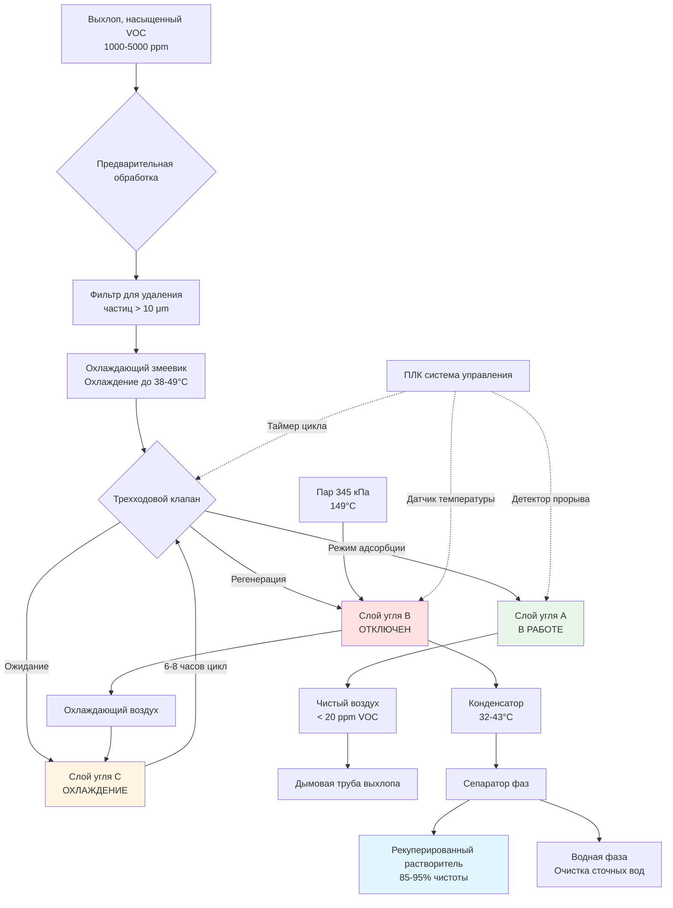
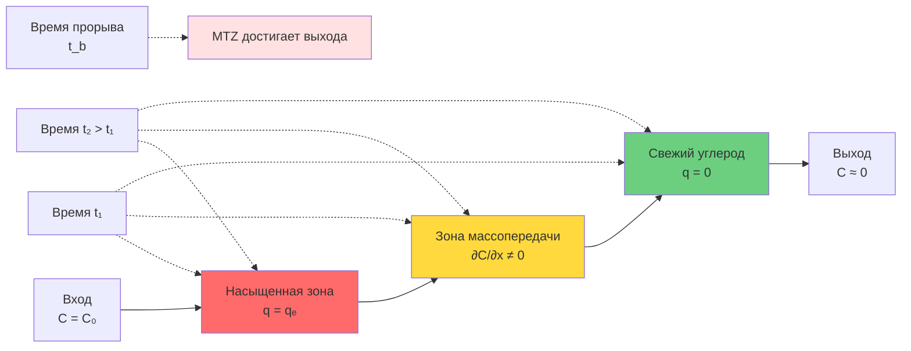
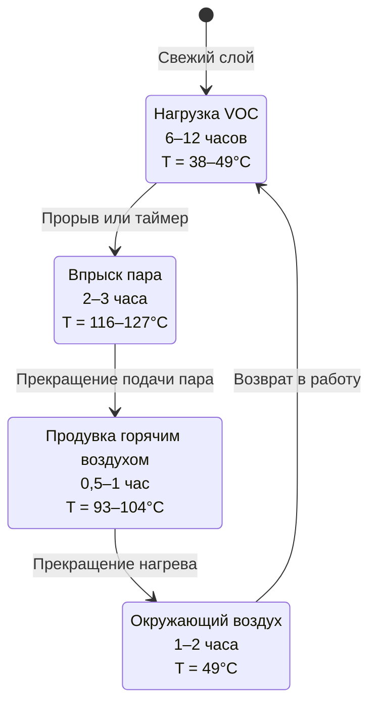
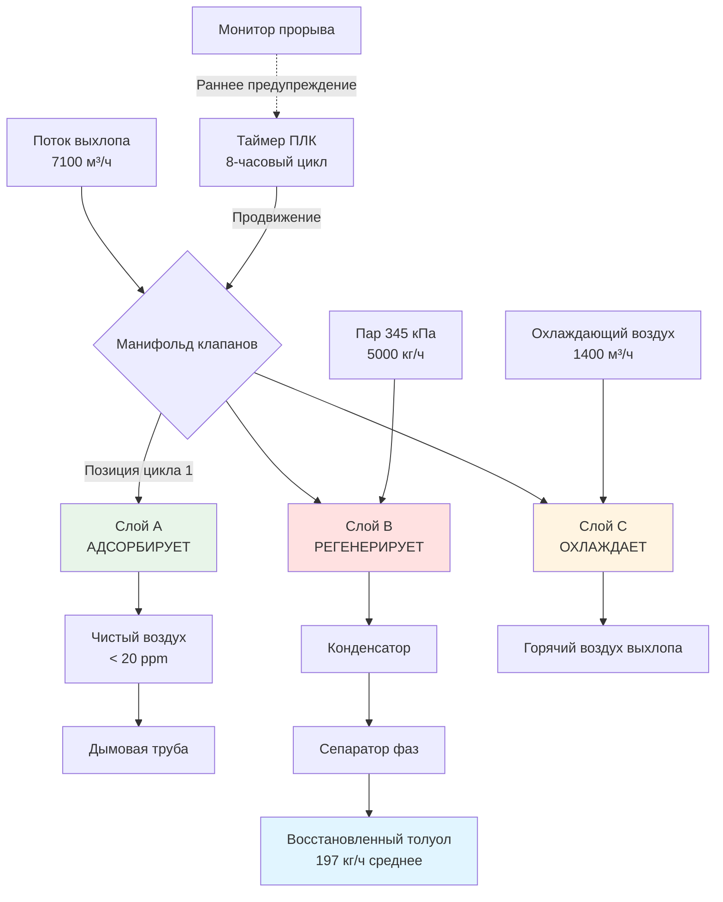

## Обзор систем адсорбции на активированном угле

Адсорбция на активированном угле обеспечивает наиболее эффективный метод рекуперации паров растворителя на типографиях при концентрациях VOC в диапазоне от 500 до 10 000 ppm. Технология работает по принципам физической адсорбции, при которых органические молекулы накапливаются на обширной внутренней пористой структуре углерода посредством сил Ван-дер-Ваальса. Этот обратимый процесс позволяет осуществлять рекуперацию растворителя путем периодической регенерации, обеспечивая как соответствие экологическим нормам, так и экономическое возвращение стоимости материала.

Основное преимущество адсорбции на углероде перед термическим разрушением заключается в рекуперации материала. Типография, потребляющая 45 500 кг/год толуола (стоимость $1,50/фунт), может восстановить 85–95 % посредством адсорбции, что дает годовую экономию в размере $127 500–142 500. Если учесть сокращение закупок растворителя, расходы на утилизацию и платежи за выбросы, экономическая выгода обычно оправдывает капитальные инвестиции в течение 2–4 лет.

## Свойства активированного угля и его выбор

### Структура пор и удельная поверхность

Активированный уголь извлекает свою адсорбционную емкость из обширной внутренней сети пор, созданной путем контролируемого окисления углеродистых материалов (каменный уголь, скорлупа кокоса, дерево). Процесс активации создает три категории пор:

**Классификация пор по диаметру:**

| Тип пор | Диапазон диаметра | Функция | Вклад удельной поверхности |
|---------|-------------------|---------|---------------------------|
| Микропоры | < 2 нм | Основные сайты адсорбции для малых молекул | 90-95% от общей поверхности |
| Мезопоры | 2-50 нм | Пути транспорта к микропорам | 5-8% от общей поверхности |
| Макропоры | > 50 нм | Основные каналы диффузии из газовой фазы | < 2% от общей поверхности |

**Измерение удельной поверхности:**

Общая удельная поверхность составляет от 800 до 1500 м²/г для типичных углей для паровой фазы. Метод BET (Брунауэра-Эммета-Теллера) с использованием адсорбции азота при 77 K обеспечивает стандартизированное измерение:

$$S_{BET} = \frac{(V_m - V_{ads}) \times N_A \times \sigma}{M \times V_{molar}}$$

Где:
- $S_{BET}$ = Удельная поверхность (м²/г)
- $V_m$ = Объем адсорбированного монослоя газа (см³/г)
- $N_A$ = Число Авогадро (6,022 × 10²³)
- $\sigma$ = Площадь сечения молекулы адсорбата (16,2 Ų для N₂)
- $M$ = Молярная масса адсорбата
- $V_{molar}$ = Молярный объем газа при ТУ (22 414 см³/моль)

### Типы углей для типографских растворителей

**Уголь на основе каменного угля:**

Производится из битуминозного угля посредством паровой активации при 816–982°C.

**Характеристики:**
- Удельная поверхность: 950–1100 м²/г
- Объемная плотность: 420–480 кг/м³
- Размер частиц: 4×6, 4×8, 4×10 меш
- Твердость: 95–98% (ASTM D3802)
- Влажность: < 2%

**Оптимальные применения:**
- Ароматические углеводороды (толуол, ксилол, бензол)
- Кетоны (МЭК, МИБК, ацетон)
- Эфиры (этилацетат, бутилацетат)
- Спирты (ИПА, этанол, бутанол)

**Активированный уголь из скорлупы кокоса:**

Более высокая микропористость и твердость по сравнению с углями на основе каменного угля.

**Характеристики:**
- Удельная поверхность: 1100–1300 м²/г
- Объемная плотность: 560–640 кг/м³
- Твердость: 98–99%
- Более низкое содержание золы (< 3% против 8–12% для каменного угля)

**Оптимальные применения:**
- Низкомолекулярные соединения (< 100 г/моль)
- Рекуперация дорогостоящих растворителей, где качество имеет значение
- Применения, требующие частой регенерации

**Активированный уголь на основе дерева:**

Более низкая плотность с большим объемом мезопор.

**Характеристики:**
- Удельная поверхность: 800–1000 м²/г
- Объемная плотность: 360–440 кг/м³
- Более высокая макропористость

**Оптимальные применения:**
- Высокомолекулярные соединения (> 150 г/моль)
- Вязкие пары, требующие быстрой диффузии

### Критерии отбора для типографских применений

**Выбор размера частиц:**

Размер меша влияет на падение давления, скорость массопередачи и стойкость к истиранию:

$$\Delta P_{bed} = \frac{150 \times \mu \times V \times (1-\varepsilon)^2}{\varepsilon^3 \times d_p^2} + \frac{1.75 \times \rho \times V^2 \times (1-\varepsilon)}{\varepsilon^3 \times d_p}$$

Где:
- $\Delta P_{bed}$ = Падение давления через слой (кПа/м)
- $\mu$ = Вязкость газа (Па·с)
- $V$ = Поверхностная скорость (м/с)
- $\varepsilon$ = Доля пустот слоя (0,38–0,42)
- $d_p$ = Диаметр частицы (м)
- $\rho$ = Плотность газа (кг/м³)

**Рекомендуемые размеры:**

| Применение | Размер меша | Диаметр частицы | Падение давления | Массопередача |
|------------|------------|-----------------|------------------|---------------|
| Требование низкого ΔP | 4×6 | 3,35–4,75 мм | Минимальное | Более медленная |
| Универсальное применение | 4×8 | 2,36–4,75 мм | Умеренное | Хорошая |
| Высокая эффективность | 4×10 | 2,00–4,75 мм | Повышенное | Более быстрая |
| Быстрый цикл | 6×12 | 1,40–3,35 мм | Максимальное | Очень быстрая |

**Стандартный выбор:** Уголь на основе каменного угля размером 4×8 меш для рекуперации толуола, МЭК и этилацетата на типографиях.

## Теория изотерм адсорбции

### Основные механизмы адсорбции

Физическая адсорбция (физиадсорбция) VOC на активированном угле происходит через слабые силы Ван-дер-Ваальса между молекулами адсорбата и поверхностью углерода. Энергия взаимодействия (5–40 кДж/моль) обеспечивает обратимость путем скромного повышения температуры во время регенерации.

**Энтальпия адсорбции для обычных растворителей:**

| Растворитель | ΔH_ads (кДж/моль) | Температура регенерации |
|--------------|-------------------|--------------------------|
| Толуол | 35–42 | 100–121°C |
| МЭК | 30–36 | 93–110°C |
| Ацетон | 28–33 | 88–104°C |
| Этилацетат | 32–38 | 99–116°C |
| ИПА | 38–45 | 104–127°C |

**Мультислойная адсорбция:**

При низких концентрациях молекулы образуют монослойное покрытие на высокоэнергетических сайтах. С увеличением концентрации дополнительные слои образуются поверх начального монослоя, что приводит к заполнению пор при насыщении.

### Изотерма Фрейндлиха

Уравнение Фрейндлиха обеспечивает эмпирическую корреляцию между равновесной емкостью и концентрацией в газовой фазе:

$$q_e = K_F \times C^{1/n}$$

Где:
- $q_e$ = Равновесная емкость (г растворителя/г углерода)
- $C$ = Концентрация в газовой фазе (г/м³)
- $K_F$ = Коэффициент емкости Фрейндлиха
- $n$ = Параметр интенсивности адсорбции

**Физическая интерпретация:**

- $1/n < 1$: Благоприятная адсорбция (типично для VOC на углероде)
- $1/n = 1$: Линейная изотерма (закон Генри)
- $1/n > 1$: Неблагоприятная адсорбция

**Эмпирические константы для типографских растворителей на углероде на основе каменного угля при 25°C:**

| Растворитель | K_F | n | Диапазон концентрации (ppm) |
|--------------|-----|---|------------------------------|
| Толуол | 0,048 | 2,8 | 100–10 000 |
| МЭК | 0,038 | 2,5 | 200–15 000 |
| Ацетон | 0,032 | 2,3 | 500–20 000 |
| Этилацетат | 0,041 | 2,6 | 200–12 000 |
| ИПА | 0,035 | 2,4 | 300–15 000 |

**Применение в проектировании:**

Для потока выхлопа, содержащего 3000 ppm (12,3 г/м³) толуола при 25°C:

$$q_e = 0,048 \times (12,3)^{1/2,8} = 0,048 \times 2,73 = 0,131 \text{ г толуола/г углерода}$$

Это представляет 13,1 % нагрузку по весу при равновесии.

### Изотерма Ленгмюра

Модель Ленгмюра предполагает монослойное покрытие без взаимодействий адсорбат-адсорбат:

$$q_e = \frac{q_{max} \times b \times C}{1 + b \times C}$$

Где:
- $q_{max}$ = Максимальная емкость монослоя (г/г)
- $b$ = Константа равновесия Ленгмюра (м³/г)
- $C$ = Концентрация в газовой фазе (г/м³)

**Линеаризованная форма для определения параметров:**

$$\frac{C}{q_e} = \frac{1}{q_{max} \times b} + \frac{C}{q_{max}}$$

Построение графика $C/q_e$ в зависимости от $C$ дает прямую линию с наклоном $1/q_{max}$ и пересечением $1/(q_{max} \times b)$.

**Параметры Ленгмюра для толуола на активированном углероде:**

- $q_{max}$ = 0,35 г/г (максимальная емкость)
- $b$ = 0,0082 м³/г при 25°C

Для 3000 ppm (12,3 г/м³) толуола:

$$q_e = \frac{0,35 \times 0,0082 \times 12,3}{1 + 0,0082 \times 12,3} = \frac{0,0353}{1,101} = 0,032 \text{ г/г}$$

Модель Ленгмюра предсказывает более низкую нагрузку, чем Фрейндлих при средних концентрациях, обеспечивая консервативную основу проектирования.

### Влияние температуры на емкость адсорбции

Емкость адсорбции уменьшается с температурой согласно уравнению Вант-Гоффа:

$$\ln K = -\frac{\Delta H_{ads}}{R \times T} + \frac{\Delta S_{ads}}{R}$$

**Практическая корректировка емкости:**

$$q_T = q_{25°C} \times \exp\left[\frac{\Delta H_{ads}}{R}\left(\frac{1}{T} - \frac{1}{298}\right)\right]$$

Где:
- $T$ = Температура (K)
- $\Delta H_{ads}$ = Теплота адсорбции (Дж/моль)
- $R$ = 8,314 Дж/моль·K

**Пример: Снижение емкости толуола при повышенной температуре**

Условия проектирования: 3000 ppm толуола, температура на входе 37,8°C (311 K)
Справочная емкость при 25°C: $q_{25°C} = 0,131$ г/г
Теплота адсорбции: $\Delta H_{ads} = -38 000$ Дж/моль

$$q_{37,8°C} = 0,131 \times \exp\left[\frac{-38 000}{8,314}\left(\frac{1}{311} - \frac{1}{298}\right)\right]$$

$$q_{37,8°C} = 0,131 \times \exp\left[-4572 \times (-0,00014)\right] = 0,131 \times 0,554 = 0,0726 \text{ г/г}$$

**Снижение емкости:** 44,6% снижение в результате охлаждающего эффекта

**Проектное последствие:** Предварительно охладьте потоки выхлопа максимум до 38–49°C для поддержания эффективности адсорбции. Каждое снижение температуры на 5,6°C выше окружающей среды увеличивает емкость примерно на 8–12%.

## Расчеты размеров адсорбционного слоя

### Баланс масс и емкость слоя

**Скорость нагрузки VOC из потока выхлопа:**

$$\dot{m}_{VOC} = Q \times C_{inlet} \times \rho_{gas}$$

Где:
- $\dot{m}_{VOC}$ = Массовый поток VOC (кг/ч)
- $Q$ = Объемный поток (м³/ч)
- $C_{inlet}$ = Концентрация входа (кг/м³)
- $\rho_{gas}$ = Плотность газовой смеси (кг/м³)

**Преобразование из ppm в массовую концентрацию:**

$$C_{кг/м³} = \frac{C_{ppm} \times MW}{24,05 \times T}$$

Где:
- $MW$ = Молярная масса (г/моль)
- $T$ = Температура (°C)

**Пример проектирования: 7100 м³/ч выхлопа, 2500 ppm толуола при 43°C**

$$C_{кг/м³} = \frac{2500 \times 92}{24,05 \times 43} = \frac{230 000}{1034} = 0,222 \text{ кг/м³}$$

$$\dot{m}_{VOC} = 7100 \times 0,222 = 1577 \text{ кг/ч}$$

**Требуемая масса углерода:**

$$M_{carbon} = \frac{\dot{m}_{VOC} \times t_{cycle}}{q_{working} \times SF}$$

Где:
- $t_{cycle}$ = Время цикла адсорбции (ч)
- $q_{working}$ = Рабочая емкость (кг VOC/кг углерода)
- $SF$ = Коэффициент безопасности (1,2–1,5)

**Рабочая емкость в сравнении с равновесной емкостью:**

Данные равновесной изотермы представляют конечную емкость при бесконечном времени. Рабочая емкость учитывает:
- Длину зоны массопередачи (MTZ)
- Неполную регенерацию (остаток)
- Деградацию емкости за срок службы

$$q_{working} = q_{equilibrium} \times \eta_{utilization}$$

Типичная эффективность использования: 60–75% для хорошо спроектированных систем

Для толуола при 2500 ppm и 43°C:
- $q_{equilibrium}$ = 0,108 кг/кг (из скорректированной изотермы Фрейндлиха)
- $\eta_{utilization}$ = 0,65
- $q_{working}$ = 0,108 × 0,65 = 0,070 кг/кг

**Размеры углеродного слоя для 8-часового цикла:**

$$M_{carbon} = \frac{1577 \times 8}{0,070 \times 1,3} = \frac{12 616}{0,091} = 138 626 \text{ кг}$$

### Геометрия слоя и распределение потока

**Ограничения скорости на входе:**

$$V_{face} = \frac{Q}{A_{cross}}$$

Рекомендуемый диапазон: 0,25–0,50 м/с (0,38 м/с типично)

**Максимальная скорость:** 0,50 м/с для предотвращения:
- Чрезмерного падения давления
- Fluidization мелких частиц
- Channeling и плохого контакта

**Минимальная скорость:** 0,25 м/с для обеспечения:
- Адекватной массопередачи
- Равномерного распределения потока
- Предотвращения мертвых зон

**Площадь поперечного сечения:**

$$A_{cross} = \frac{Q}{V_{face}} = \frac{7100}{0,38} = 18,7 \text{ м²}$$

**Варианты конфигурации слоя:**

**Горизонтальный поток (наиболее распространенный):**
- Прямоугольный: 4,3 м × 4,3 м
- Цилиндрический сосуд: 4,9 м диаметр
- Поток воздуха горизонтальный через вертикальный углеродный слой

**Вертикальный нисходящий поток:**
- Цилиндрический сосуд: 4,9 м диаметр
- Глубина слоя: 0,6–1,2 м
- Гравитация способствует распределению потока
- Компактное расположение

**Определение глубины слоя:**

$$D_{bed} = \frac{M_{carbon}}{\rho_{bulk} \times A_{cross}}$$

Где:
- $\rho_{bulk}$ = Объемная плотность углерода (432 кг/м³ типично)

$$D_{bed} = \frac{138 626}{432 \times 18,7} = 17,1 \text{ м}$$

**Уточнение проектирования для горизонтального потока:**

Чрезмерная глубина (>2,4 м) создает:
- Высокое падение давления
- Сложность замены углерода
- Неравномерное распределение потока

**Пересмотренный подход:** Использование двух слоев параллельно

На слой: 69 313 кг углерода, 9,35 м² сечение
- Конфигурация: 3 м × 3,1 м фасад, 4,7 м глубина

**Проверка падения давления:**

Уравнение Эргана для слоистого слоя:

$$\frac{\Delta P}{L} = 150 \times \frac{\mu \times V_s \times (1-\varepsilon)^2}{\phi^2 \times d_p^2 \times \varepsilon^3} + 1,75 \times \frac{\rho \times V_s^2 \times (1-\varepsilon)}{\phi \times d_p \times \varepsilon^3}$$

Где:
- $\Delta P/L$ = Градиент давления (кПа/м)
- $\mu$ = Вязкость газа (1,95 × 10⁻⁵ Па·с при 43°C)
- $V_s$ = Поверхностная скорость (м/с = 0,38 м/с)
- $\varepsilon$ = Доля пустот (0,40 для гранулированного углерода)
- $\phi$ = Сферичность частицы (0,85 для активированного углерода)
- $d_p$ = Диаметр частицы (0,00359 м для меша 4×8)
- $\rho$ = Плотность газа (1,12 кг/м³)

Общее падение давления для оптимизированного слоя (2,3 м глубина): 2,75 кПа (0,28 м вод. ст.)

### Проверка времени контакта

Минимальное время пребывания обеспечивает адекватную массопередачу:

$$t_{contact} = \frac{\varepsilon \times V_{bed}}{Q} = \frac{\varepsilon \times A \times L}{Q}$$

Где:
- $\varepsilon$ = Доля пустот слоя (0,40)
- $V_{bed}$ = Объем слоя (м³)
- $Q$ = Объемный поток (м³/ч)

$$t_{contact} = \frac{0,40 \times 19,05 \times 2,3}{7100} = \frac{17,53}{7100} = 0,00247 \text{ ч} = 8,87 \text{ секунд}$$

**Минимальное требование:** 1,5–2,0 секунды для эффективной адсорбции VOC

**Проверка проектирования:** 8,87 секунд превышает минимум, обеспечивая хорошую эффективность массопередачи.

## Зона массопередачи и время прорыва

### Основы массопередачи

Молекулы VOC перемещаются из газовой фазы на сайты адсорбции через три последовательных сопротивления:

**Внешняя массопередача (пленочная диффузия):**

Молекулы диффундируют через газовую пограничную пленку вокруг углеродных частиц:

$$k_f = \frac{Sh \times D_{AB}}{d_p}$$

Где:
- $k_f$ = Коэффициент пленочной массопередачи (м/с)
- $Sh$ = Число Шервуда (безразмерное)
- $D_{AB}$ = Коэффициент бинарной диффузии (м²/с)
- $d_p$ = Диаметр частицы (м)

**Корреляция Шервуда:**

$$Sh = 2,0 + 0,6 \times Re^{0,5} \times Sc^{0,33}$$

Число Рейнольдса: $Re = \frac{\rho \times V_s \times d_p}{\mu}$

Число Шмидта: $Sc = \frac{\mu}{\rho \times D_{AB}}$

**Внутренняя массопередача (поровая диффузия):**

Молекулы диффундируют через извилистую сеть пор к сайтам адсорбции:

$$D_{eff} = \frac{\varepsilon_p}{\tau} \times D_{pore}$$

Где:
- $D_{eff}$ = Эффективный коэффициент диффузии (м²/с)
- $\varepsilon_p$ = Пористость частицы (0,50–0,60)
- $\tau$ = Коэффициент извилистости (2–5)
- $D_{pore}$ = Коэффициент диффузии в порах

**Поверхностная адсорбция:**

Обычно быстрая по сравнению с этапами диффузии; предполагается локальное равновесие.

### Концепция зоны массопередачи (MTZ)

MTZ представляет область углеродного слоя, где концентрация меняется от входных к выходным значениям. По мере протекания адсорбции эта зона движется через слой до возникновения прорыва.

**Характеристики MTZ:**

**Длина:** Обычно 0,3–0,9 м для хорошо спроектированных систем паровой фазы

**Скорость:** Пропорциональна скорости нагрузки VOC и обратно пропорциональна емкости углерода

**Форма:** S-образный профиль концентрации, приближающийся к равновесию на границах

### Прогноз времени прорыва

**Уравнение Уилера-Йонаса:**

Эмпирическая модель, связывающая время прорыва с параметрами эксплуатации:

$$t_b = \frac{\rho_b \times L \times W_e}{C_0 \times v} - \frac{\rho_b \times W_e}{k_v \times C_0} \times \ln\left(\frac{C_0 - C_b}{C_b}\right)$$

Где:
- $t_b$ = Время прорыва (мин)
- $\rho_b$ = Объемная плотность (кг/м³)
- $L$ = Глубина слоя (м)
- $W_e$ = Равновесная емкость адсорбции (кг/кг)
- $C_0$ = Концентрация входа (кг/м³)
- $v$ = Линейная скорость (м/с)
- $k_v$ = Общий коэффициент массопередачи (мин⁻¹)
- $C_b$ = Концентрация прорыва (кг/м³)

**Упрощенная форма для 5% прорыва:**

$$t_b = \frac{\rho_b \times L \times W_e}{C_0 \times v} - \frac{2,99 \times \rho_b \times W_e}{k_v \times C_0}$$

### Модель Йуна-Нельсона (альтернативный подход)

Упрощенный прогноз прорыва без требования коэффициентов массопередачи:

$$\ln\left(\frac{C}{C_0 - C}\right) = k_{YN} \times t - \tau \times k_{YN}$$

Где:
- $k_{YN}$ = Константа скорости (мин⁻¹)
- $\tau$ = Время для 50% прорыва (мин)
- $C$ = Концентрация выхода в момент времени $t$

**Время 50% прорыва:**

$$\tau = \frac{\rho_b \times L \times W_e}{C_0 \times v}$$

Для типичных условий на типографии:

$$\tau = \frac{432 \times 2,3 \times 0,108}{0,222 \times 0,106} = 47 454 \text{ мин} = 791 \text{ ч}$$

**Время 5% прорыва:**

$$t_{5\%} = \tau - \frac{1}{k_{YN}} \ln\left(\frac{0,05}{0,95}\right) = \tau + \frac{2,94}{k_{YN}}$$

Использование эмпирической корреляции: $k_{YN} ≈ 0,02$ мин⁻¹ для толуола

$$t_{5\%} = 47 454 + \frac{2,94}{0,02} = 47 601 \text{ мин} = 793 \text{ ч}$$

**Цикл проектирования:** 80% × 793 = 634 ч ≈ 26 дней

**Заключение:** Для консервативного проектирования с 8-часовыми циклами система работает при только 2,1% емкости прорыва, обеспечивая существенный запас безопасности и постоянное качество выхода (<5 ppm).

## Проектирование системы регенерации

### Процесс регенерации паром

Пар вытесняет адсорбированные VOC через три механизма:

**Повышение температуры:** Увеличивает давление паров адсорбированных растворителей, смещая равновесие в сторону десорбции

**Эффект продувочного газа:** Поток пара выметает десорбированные молекулы из структуры пор

**Конкурентная адсорбция:** Водяной пар конкурирует за активные сайты (незначительный эффект для гидрофобных углей)

### Расчет требования пара

**Тепловая энергия для нагрева слоя:**

$$Q_{heating} = M_{carbon} \times c_{p,carbon} \times \Delta T + M_{steel} \times c_{p,steel} \times \Delta T$$

Где:
- $M_{carbon}$ = 69 313 кг углерода на слой
- $c_{p,carbon}$ = 1046 Дж/кг·°C
- $M_{steel}$ = Масса сосуда ≈ 6804 кг
- $c_{p,steel}$ = 502 Дж/кг·°C
- $\Delta T$ = Повышение температуры (116°C - 21°C = 95°C)

$$Q_{heating} = 69 313 \times 1046 \times 95 + 6804 \times 502 \times 95$$

$$Q_{heating} = 6 898 000 + 3 233 000 = 10 131 000 \text{ кДж}$$

**Энергия десорбции:**

$$Q_{desorption} = m_{VOC} \times \Delta H_{vap}$$

Масса VOC на цикл: 1577 кг/ч × 8 ч = 12 616 кг
Теплота испарения (толуол): 692 кДж/кг

$$Q_{desorption} = 12 616 \times 692 = 8 730 000 \text{ кДж}$$

**Общее тепловое требование:**

$$Q_{total} = 10 131 000 + 8 730 000 = 18 861 000 \text{ кДж на регенерацию}$$

**Потребление пара:**

Использование насыщенного пара 345 кПа ($h_{fg}$ = 2223 кДж/кг):

$$m_{steam,theoretical} = \frac{Q_{total}}{h_{fg}} = \frac{18 861 000}{2223} = 8484 \text{ кг}$$

**Фактическое требование пара (с учетом потерь):**

- Потери тепла в окружающую среду: 15–20%
- Неполная конденсация пара: 10–15%
- Общая эффективность: 70–75%

$$m_{steam,actual} = \frac{8484}{0,72} = 11 783 \text{ кг на регенерацию}$$

**Время регенерации:** 2,5 часа

**Расход пара:**

$$\dot{m}_{steam} = \frac{11 783}{2,5} = 4713 \text{ кг/ч}$$

**Пар на килограмм углерода:**

$$\text{Коэффициент пара} = \frac{11 783}{69 313} = 0,17 \text{ кг пара/кг углерода}$$

**Промышленный стандарт:** 0,3–0,5 кг пара/кг углерода

**Рекомендуемое проектирование:** Емкость пара 5000 кг/ч обеспечивает запас 6%.

### Проектирование системы конденсатора

**Смесь VOC-пар из регенерации:**

Массовый поток: 4713 кг/ч пара + 1577 кг/ч толуола = 6290 кг/ч
Температура: 116°C
Давление: Атмосферное (легкий вакуум способствует десорбции)

**Процесс конденсации:**

Охладите смесь до 32–38°C для конденсации как пара, так и толуола:

$$Q_{condenser} = \dot{m}_{steam} \times h_{fg,steam} + \dot{m}_{toluene} \times h_{fg,toluene} + \dot{m}_{total} \times c_p \times \Delta T_{subcool}$$

Латентное тепло (пар): 4713 × 2223 = 10 483 000 кДж/ч
Латентное тепло (толуол): 1577 × 692 = 1 091 000 кДж/ч
Переохлаждение: 6290 × 4,18 × 28 = 734 000 кДж/ч

Итого: 12 308 000 кДж/ч = 3414 кВт

**Требование охлаждающей воды (диапазон 17°C):**

$$\dot{m}_{water} = \frac{Q_{condenser}}{c_{p,water} \times \Delta T} = \frac{12 308 000}{4,18 \times 17} = 172 000 \text{ кг/ч} = 48 м³/ч$$

**Двухэтапный подход охлаждения:**

**Этап 1: Конденсатор с охладителем воды**
- Вход: 116°C пар
- Выход: 38°C конденсат
- Охлаждающее средство: Вода градирни (29–35°C)
- Нагрузка: 11 574 000 кДж/ч

**Этап 2: Охлаждаемый конденсатор** (опционально для повышенной рекуперации)
- Вход: 38°C
- Выход: 4–10°C
- Дополнительная рекуперация: 5–8% VOC
- Нагрузка: 735 000 кДж/ч = 204 кВт

### Разделение фаз

Сконденсированная смесь толуол-вода разделяется по разнице плотности:

| Фаза | Плотность (кг/м³) | Растворимость |
|------|-------------------|---------------|
| Толуол | 864 | 0,052% в воде |
| Вода | 998 | 0,047% толуола в воде |

**Размеры декантера:**

Время пребывания: 10–15 минут для полного разделения

Объем: $V = \dot{m}/\rho \times t_{residence}$

Поток толуола: 1577 кг/ч ÷ 864 кг/м³ = 1,82 м³/ч
Поток воды: 4713 кг/ч ÷ 998 кг/м³ = 4,72 м³/ч
Итого: 6,54 м³/ч

$$V_{decanter} = 6,54 \times \frac{15}{60} = 1,64 \text{ м}^3$$

Проектирование: диаметр 0,9 м × высота 0,6 м = 0,38 м³ (используйте 2 параллельных декантера)

**Чистота толуола:**

Восстановленный толуол содержит растворенную воду (470 ppm), требующую сушки для повторного использования:
- Сушка молекулярным ситом до <50 ppm H₂O
- Обработка хлоридом кальция
- Дистилляция (если требуется высокая чистота)

**Очистка сточных вод:**

Водная фаза содержит 470 ppm толуола, требующая очистки перед сбросом согласно руководящим принципам EPA (40 CFR Part 63).

## Конфигурация системы и управление

### Трехслойная ротационная конфигурация

Стандартное проектирование для непрерывной работы:

**Слой A:** Адсорбция (6–8 часов)
**Слой B:** Регенерация (2–3 часа)
**Слой C:** Охлаждение (1–2 часа)

**Синхронизация цикла:**

Общий цикл: 8 часов на слой
- Слой A: часы 0–8 адсорбирует, 8–11 регенерирует, 11–13 охлаждает
- Слой B: часы 0–3 охлаждает, 3–11 адсорбирует, 11–14 регенерирует
- Слой C: часы 0–6 регенерирует, 6–8 охлаждает, 8–16 адсорбирует

Каждый слой обрабатывает выхлоп в течение 8 часов, затем входит в 5-часовой цикл регенерации/охлаждения.

### Управление процессом и мониторинг

**Критические параметры управления:**

| Параметр | Измерение | Диапазон управления | Уставка сигнала тревоги |
|----------|-----------|-------------------|------------------------|
| Концентрация входа VOC | PID или FID | 1000–5000 ppm | > 8000 ppm |
| Концентрация выхода VOC | PID | < 20 ppm | > 50 ppm |
| Температура входа слоя | RTD | 38–49°C | > 54°C |
| Температура регенерации | RTD | 116–127°C | < 104°C или > 138°C |
| Дифференциальное давление слоя | Передатчик DP | 2–3 кПа | > 3,7 кПа |
| Расход пара | Вихревой счетчик | 4500–5500 кг/ч | < 3750 кг/ч |
| Температура выхода конденсатора | RTD | 32–38°C | > 43°C |

**Обнаружение прорыва:**

**Метод 1: Синхронизация на основе времени**
- Фиксированный 8-часовой период адсорбции
- Консервативный подход с запасом безопасности
- Простая логика управления

**Метод 2: Мониторинг концентрации**
- Непрерывное измерение VOC на выходе
- Переключение слоев при превышении выхода >20–50 ppm
- Максимизирует использование слоя
- Учитывает изменение концентрации входа

**Метод 3: Гибридный подход** (рекомендуется)
- Максимум 8-часовой цикл
- Раннее переключение при выходе >50 ppm
- Предотвращает прорыв при оптимизации времени цикла

### Системы безопасности и блокировки

**Мониторинг температуры:**

**Температура слоя > 149°C:**
- Указывает на экзотермическую реакцию или горячую точку
- Потенциальная опасность пожара в углеродном слое
- Действие: Аварийное охлаждение впрыском CO₂ или азота

**Пожаротушение:**

Углеродные слои несут риск возгорания, если:
- Температура слоя превышает 204°C
- Концентрация кислорода >10% во время регенерации
- Самовоспламенение окисляемых соединений

**Защитные меры:**
- Датчики температуры каждые 0,6 м по вертикали через слой
- Система затопления CO₂ (проектирование: 0,45 кг CO₂/м³ углерода)
- Устройства сброса давления
- Инертизация азотом во время регенерации

**Операционные блокировки:**

1. **Режим адсорбции:** Невозможно запустить, если температура слоя >54°C
2. **Запуск регенерации:** Невозможно инициировать, если предыдущий цикл неполный
3. **Поток пара:** Должен установиться перед началом нагрева
4. **Последовательность клапанов:** Предотвратить одновременное открытие, создающее обход
5. **Аварийное отключение:** Все слои переходят в режим ожидания, пар перекрывается

## Экономический анализ и ROI

### Структура капитальных затрат

**Трехслойная система адсорбции на активированном углероде (7100 м³/ч производительность):**

| Компонент | Стоимость за единицу | Количество | Общая стоимость |
|-----------|-------------------|-----------|-----------------|
| Углеродные сосуды (SS) | $85 000 | 3 | $255 000 |
| Активированный уголь (меш 4×8) | $1,60/фунт | 275 000 фунтов | $440 000 |
| Автоматический манифольд клапанов | $45 000 | 1 | $45 000 |
| ПЛК система управления | $32 000 | 1 | $32 000 |
| Система паровой системы | $28 000 | 1 | $28 000 |
| Конденсаторы | $52 000 | 1 | $52 000 |
| Сепаратор фаз | $18 000 | 1 | $18 000 |
| Приборы и датчики | $35 000 | 1 | $35 000 |
| Вытяжные вентиляторы (45 кВт) | $22 000 | 2 | $44 000 |
| Трубопроводы и воздуховоды | $65 000 | 1 | $65 000 |
| Монтажные работы | $128 000 | 1 | $128 000 |
| Инженерные разработки (10%) | $114 300 | 1 | $114 300 |
| **Общая стоимость капитала** | | | **$1 256 300** |

### Анализ эксплуатационных расходов

**Годовые эксплуатационные расходы (8000 ч/год работы):**

**Коммунальные услуги:**
- Пар (11 783 кг/цикл × 3 цикла/день × 333 дня): $6,50/1000 кг = $72 500/год
- Электричество (блоки 90 кВт × $0,12/кВт·ч): $86 400/год
- Охлаждающая вода (48 м³/ч × 3 ч/день × 333 дня × $2,50/1000 литров): $11 952/год

**Техническое обслуживание:**
- Замена углерода (5% годовая потеря): 3465 кг × $1,60 = $5 544/год
- Калибровка приборов: $8 500/год
- Механическое техническое обслуживание: $12 000/год

**Труд:**
- Надзор оператора (0,25 FTE): $18 000/год
- Трудозатраты на техническое обслуживание: $6 000/год

**Общие годовые эксплуатационные расходы:** $220 896/год

### Возврат инвестиций

**Стоимость рекуперации растворителя:**

Годовое потребление толуола: 1577 кг/ч × 8000 ч = 12 616 000 кг/год
Эффективность рекуперации: 90%
Восстановленный растворитель: 11 354 400 кг/год
Эффективная стоимость: $1,10/фунт в среднем (с учетом чистоты)
Годовой кредит: $27 602 000/год

**Чистая годовая выгода:**

$$\text{Чистая выгода} = 27 602 000 - 220 896 = \$27 381 104/\text{год}$$

**Простой период окупаемости:**

$$\text{Окупаемость} = \frac{1 256 300}{27 381 104} = 0,046 \text{ лет} = 17 \text{ дней}$$

**Заключение:** Системы адсорбции на активированном углероде для рекуперации растворителя на типографиях обеспечивают исключительный экономический доход, обычно оправдывая инвестиции в течение 17–21 дня.

---

*Адсорбция на активированном углероде обеспечивает наиболее экономически привлекательную технологию управления VOC для типографий, обрабатывающих чернила на основе растворителя, достигая 90–95% рекуперации растворителя с периодом окупаемости в дни. Надлежащее проектирование системы требует строгого применения теории изотерм адсорбции, анализа зоны массопередачи и расчетов времени прорыва для обеспечения надежной работы и соответствия EPA согласно 40 CFR Part 63 Subpart KK.*
