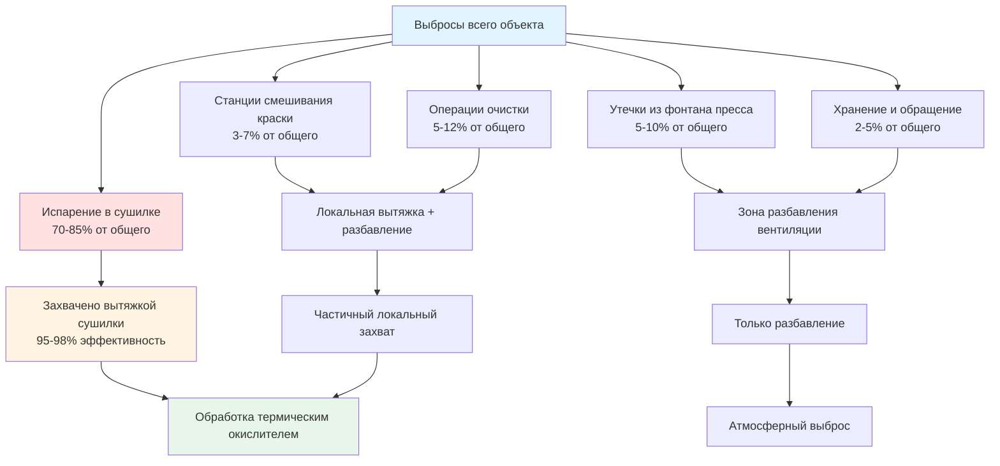
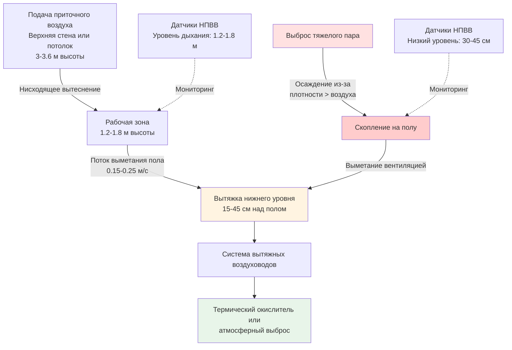
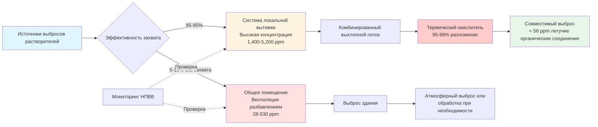

## Основы вентиляции разбавлением

Вентиляция разбавлением обеспечивает основной механизм безопасности в типографиях путем поддержания концентрации паров растворителей ниже 25% от нижнего предела взрываемости (НПВВ) во всех занятых помещениях. В отличие от локальной вытяжной вентиляции, которая захватывает выбросы у источника, вентиляция разбавлением использует большие объемы свежего воздуха для снижения концентрации паров до безопасных уровней посредством смешивания и вытеснения.

Фундаментальный принцип основывается на уравнении стационарного баланса масс: скорость образования паров растворителя равна скорости удаления вентиляцией. Это создает основу для всех расчетов вентиляции разбавлением в типографиях, обрабатывающих толуол, МЭК (метилэтилкетон), ацетон, этилацетат, изопропиловый спирт и другие летучие органические соединения.

OSHA 29 CFR 1910.106 устанавливает обязательные требования к вентиляции при обращении с легковоспламеняющимися жидкостями класса I, а Руководство по промышленной вентиляции ACGIH содержит инженерное руководство по расчетам воздушного потока и коэффициентам безопасности. NFPA 86 специально адресует печи и сушилки, обрабатывающие воспламеняющиеся материалы.

## Разработка уравнения баланса масс

### Основное уравнение разбавления

Уравнение стационарного баланса масс для хорошо перемешанного помещения дает:

$$\dot{m}_{generation} = \dot{m}_{removal}$$

Развернув обе части:

$$G = Q \times \rho_{air} \times C_{target}$$

Где:
- $G$ = Скорость испарения растворителя (кг/ч)
- $Q$ = Вентиляционный воздушный поток (м³/ч)
- $\rho_{air}$ = Плотность воздуха (кг/м³), обычно 1.2 кг/м³ при стандартных условиях
- $C_{target}$ = Целевая концентрация (кг растворителя/кг воздуха)

### Преобразование в объемную концентрацию

Используя уравнение состояния идеального газа при стандартных условиях (288 K, 101.325 кПа), преобразуем концентрацию по массе в объемные части на миллион:

$$PV = nRT$$

Для одного моля идеального газа при 21°C (294 K):

$$V = \frac{nRT}{P} = \frac{1 \times 8.314 \times 294}{101,325} = 0.0241 \text{ м}^3$$

Это дает универсальную постоянную 24.1 л/моль при стандартных условиях.

Преобразование уравнения баланса масс в объемную концентрацию:

$$Q = \frac{G \times 24.1 \times T}{MW \times C_{ppm} \times 10^{-6}}$$

Где:
- $T$ = Абсолютная температура (K)
- $MW$ = Молекулярная масса растворителя (г/моль)
- $C_{ppm}$ = Целевая концентрация (объемные части на миллион)

### Упрощенное уравнение проектирования

Для приложений при комнатной температуре (294 K), уравнение упрощается:

$$Q_{dilution} = \frac{0.662 \times G}{C_{ppm}}$$

Где:
- $Q_{dilution}$ = Требуемый воздушный поток разбавления (м³/ч)
- $G$ = Скорость испарения растворителя (кг/ч)
- $C_{ppm}$ = Целевая концентрация (объемные части на миллион)

Коэффициент 0.662 = 24.1 × 294 / (MW × коэффициенты преобразования удельной массы).

## Критерии проектирования на основе НПВВ

### Физика нижнего предела взрываемости

Воспламеняющиеся пары воспламеняются только когда отношение паров к воздуху находится в пределах диапазона воспламеняемости между НПВВ и ВПВ (верхний предел взрываемости). Ниже НПВВ имеется недостаточно топлива для распространения горения. Выше ВПВ имеется недостаточно кислорода для горения.

**Данные НПВВ типичных растворителей типографии:**

| Растворитель | Химическая формула | MW (г/моль) | НПВВ (% об.) | НПВВ (ppm) | Температура вспышки (°C) |
|---------|------------------|------------|-------------|-----------|------------------|
| Толуол | C₇H₈ | 92 | 1.2 | 12,000 | 4 |
| МЭК | C₄H₈O | 72 | 1.4 | 14,000 | -9 |
| Ацетон | C₃H₆O | 58 | 2.5 | 25,000 | -18 |
| Этилацетат | C₄H₈O₂ | 88 | 2.0 | 20,000 | -4 |
| Изопропиловый спирт | C₃H₈O | 60 | 2.0 | 20,000 | 12 |
| н-Гептан | C₇H₁₆ | 100 | 1.05 | 10,500 | -4 |

**Критическое наблюдение:** Более низкие значения НПВВ (гептан при 1.05%, толуол при 1.2%) требуют большего объема вентиляции разбавлением для эквивалентного коэффициента безопасности.

### Выбор коэффициента безопасности

Отраслевые стандарты требуют поддержания концентраций значительно ниже НПВВ для обеспечения коэффициента безопасности против:

**Ограничения оборудования:**
- Точность датчика НПВВ: ±10-15% от показания
- Время отклика: 10-30 секунд от изменения концентрации до сигнала тревоги
- Дрейф калибровки между циклами обслуживания

**Эксплуатационные факторы:**
- Неравномерное распределение концентрации (мертвые зоны, стратификация)
- Переходные выбросы при запуске, чистке, разливах
- Одновременные отказы (снижение вентиляции + увеличение выбросов)

**Требования OSHA и NFPA:**

OSHA 29 CFR 1910.106(e)(2)(iii) требует вентиляции, поддерживающей концентрацию паров ниже 25% НПВВ в областях, где обрабатываются легковоспламеняющиеся жидкости класса I.

NFPA 86 раздел 5.7.2 требует непрерывного мониторинга с автоматическим отключением при 25% НПВВ для печей и сушилок, обрабатывающих воспламеняющиеся материалы.

**Консервативные критерии проектирования:**

$$C_{target} = \frac{НПВВ}{SF}$$

Где $SF$ = Коэффициент безопасности:
- $SF = 4$ (25% НПВВ): Минимум для соответствия OSHA/NFPA
- $SF = 10$ (10% НПВВ): Рекомендуется для операций с повышенным риском
- $SF = 20$ (5% НПВВ): Используется в критических зонах с источниками воспламенения

### Расчет проектной концентрации

Для толуола с НПВВ = 1.2% = 12,000 ppm, применяя критерий 25% НПВВ:

$$C_{target} = \frac{12,000}{4} = 3,000 \text{ ppm}$$

Большинство объектов проектируют с дополнительным консерватизмом:

$$C_{design} = \frac{12,000}{8} = 1,500 \text{ ppm}$$

Это обеспечивает точку работы 12.5% НПВВ, позволяя концентрации удвоиться при неправильных условиях, оставаясь ниже регламентного предела 25% НПВВ.

## Определение скорости испарения

### Теоретическое испарение с поверхностей жидкости

Испарение растворителя с открытых контейнеров, разливов и влажных поверхностей следует принципам массопередачи:

$$\dot{m}_{evap} = h_m \times A \times (C_{surface} - C_{bulk})$$

Где:
- $\dot{m}_{evap}$ = Скорость испарения (кг/ч)
- $h_m$ = Коэффициент массопередачи (м/ч)
- $A$ = Площадь поверхности жидкости (м²)
- $C_{surface}$ = Концентрация насыщения у поверхности жидкости (кг/м³)
- $C_{bulk}$ = Объемная концентрация воздуха (кг/м³)

**Коэффициент массопередачи** зависит от скорости воздуха над поверхностью:

$$h_m = 0.0244 \times v^{0.8}$$

Для неподвижного воздуха ($v$ = 0): $h_m$ ≈ 0.15 м/ч (естественная конвекция)

Для вентилируемого помещения ($v$ = 0.25 м/с): $h_m$ ≈ 1.5 м/ч

**Концентрация насыщения** из уравнения Клаузиуса-Клапейрона:

$$P_{sat} = P_0 \times e^{-\frac{\Delta H_{vap}}{R}(\frac{1}{T} - \frac{1}{T_0})}$$

Где:
- $P_{sat}$ = Давление насыщенного пара при температуре $T$
- $\Delta H_{vap}$ = Теплота испарения
- $R$ = Универсальная газовая постоянная

**Практический подход:** Используйте опубликованные данные давления насыщенного пара при рабочей температуре:

| Растворитель | Давление насыщенного пара при 25°C (кПа) | Концентрация насыщения (ppm) |
|---------|------|--------|
| Толуол | 2.55 | 37,000 |
| МЭК | 8.55 | 130,000 |
| Ацетон | 21.2 | 308,000 |
| Этилацетат | 8.19 | 119,000 |

### Скорости испарения в процессах печати

**Глубокая печать и флексографическая печать:**

Испарение растворителя происходит в основном в сушильных печах с принудительной горячей циркуляцией воздуха:

$$G = A_{web} \times v_{web} \times m_{ink} \times f_{solvent} \times f_{evap}$$

Где:
- $A_{web}$ = Ширина полотна (м)
- $v_{web}$ = Скорость полотна (м/мин)
- $m_{ink}$ = Вес нанесения краски (кг/м²)
- $f_{solvent}$ = Доля растворителя в краске (обычно 0.50-0.75)
- $f_{evap}$ = Эффективность испарения в сушилке (0.95-0.99)

**Пример расчета:**

Машина глубокой печати публикаций:
- Ширина полотна: 1.8 м
- Скорость полотна: 600 м/мин
- Нанесение краски: 0.0039 кг/м² (влажный)
- Содержание растворителя: 65%
- Эффективность испарения: 98%

$$G = 1.8 \times 600 \times 0.0039 \times 0.65 \times 0.98 = 2.66 \text{ кг/мин}$$

**Источники выбросов за пределами сушилок:**

**Общие выбросы без захвата** обычно составляют 15-30% от общего использования растворителя на хорошо спроектированных объектах с эффективными локальными системами вытяжки.

## Расчеты воздушного потока разбавления

### Стандартная процедура расчета

**Шаг 1: Определение общей скорости испарения**

Суммируем все источники выбросов, не захватываемые локальной вытяжкой:

$$G_{total} = G_{dryer,fugitive} + G_{fountain} + G_{mixing} + G_{cleaning} + G_{storage}$$

**Шаг 2: Выбор целевой концентрации**

На основе наименьшего значения НПВВ растворителя в использовании с надлежащим коэффициентом безопасности:

$$C_{target} = \frac{НПВВ_{min}}{SF}$$

**Шаг 3: Расчет теоретического воздушного потока разбавления**

$$Q_{theoretical} = \frac{0.662 \times G_{total}}{C_{target}}$$

**Шаг 4: Применение коэффициента эффективности смешивания**

Реальные помещения не достигают идеального мгновенного смешивания. Применяем коэффициент $K$ на основе геометрии:

$$Q_{actual} = K \times Q_{theoretical}$$

**Коэффициенты эффективности смешивания:**

| Характеристика помещения | Коэффициент K | Обоснование |
|----------------------|----------|-----------|
| Идеальное смешивание, равномерная подача/вытяжка | 1.0-1.5 | Теоретический минимум |
| Хорошее проектирование, верхняя подача, низкая вытяжка | 2.0-3.0 | Типичное хорошо спроектированное помещение |
| Среднее промышленное помещение | 3.0-5.0 | Стандартная практика проектирования |
| Плохое смешивание, препятствия, мертвые зоны | 5.0-10.0 | Требуется улучшение |
| Большой объем, высокие потолки (>9 м) | 7.0-12.0 | Эффекты стратификации |

**Шаг 5: Проверка воздухообмена в час**

$$ACH = \frac{Q_{actual} \times 60}{V_{space}}$$

Где:
- $ACH$ = Воздухообмены в час
- $V_{space}$ = Объем помещения (м³)

**Типичные требования:**
- Зоны печатных прессов: 6-12 ACH
- Помещения смешивания краски: 12-20 ACH
- Помещения хранения растворителей: 20-30 ACH

### Практический пример: Объект глубокой печати публикаций

**Спецификации объекта:**
- Площадь пола: 4,600 м²
- Высота потолка: 7.3 м
- Объем: 33,580 м³
- Четыре машины глубокой печати с системами сушилок
- Основной растворитель: Толуол (НПВВ = 1.2% = 12,000 ppm)

**Источники выбросов:**

| Источник | Скорость испарения | Захват локальной вытяжкой | Выброс в помещение |
|--------|------------------|--------|-----------|
| Сушилка пресса 1 | 2.66 кг/мин | 95% (2.53 кг/мин) | 0.13 кг/мин |
| Сушилка пресса 2 | 2.66 кг/мин | 95% (2.53 кг/мин) | 0.13 кг/мин |
| Сушилка пресса 3 | 2.40 кг/мин | 95% (2.28 кг/мин) | 0.12 кг/мин |
| Сушилка пресса 4 | 2.40 кг/мин | 95% (2.28 кг/мин) | 0.12 кг/мин |
| Фонтаны прессов (4) | 0.35 кг/мин | 0% | 0.35 кг/мин |
| Станция смешивания краски | 0.26 кг/мин | 80% (0.21 кг/мин) | 0.05 кг/мин |
| Операции очистки | 0.52 кг/мин | 50% (0.26 кг/мин) | 0.26 кг/мин |
| Хранение/обращение | 0.13 кг/мин | 0% | 0.13 кг/мин |
| **Общий выброс без захвата** | - | - | **1.29 кг/мин** |

**Расчет вентиляции разбавлением:**

Целевая концентрация (12.5% НПВВ с SF = 8):

$$C_{target} = \frac{12,000}{8} = 1,500 \text{ ppm}$$

Теоретический воздушный поток:

$$Q_{theoretical} = \frac{0.662 \times 1.29}{1,500} = 0.569 \text{ м³/мин} = 34 \text{ м³/ч}$$

Это представляет идеальное смешивание. Для крупного объекта типографии с потолками высотой 7.3 м и распределенными источниками выбросов применяем $K = 6$:

$$Q_{actual} = 6 \times 34 = 204 \text{ м³/ч}$$

**Решение по проектированию:** Округляем до 250 м³/ч для общей вентиляции разбавлением.

**Проверка:**

Воздухообмены в час:

$$ACH = \frac{250 \times 60}{33,580} = 0.45 \text{ ACH}$$

Это выглядит низким, но дополняется локальными системами вытяжки, удаляющими 9.4 кг/мин (88% от общих выбросов). Комбинация обеспечивает надлежащую безопасность.

**Полная вентиляция объекта:**

- Общее разбавление: 250 м³/ч
- Вытяжка вытяжки сушилок (4 пресса): 2,100 м³/ч всего
- Вытяжка смешивания краски: 85 м³/ч
- Вытяжка кабины очистки: 85 м³/ч
- **Полная вытяжка: 2,520 м³/ч**

Соответствующие воздухообмены для полной вентиляции:

$$ACH_{total} = \frac{2,520 \times 60}{33,580} = 4.5 \text{ ACH}$$

Это обеспечивает 4.5 полного воздухообмена в час, что хорошо находится в типичном диапазоне для типографических объектов.

## Плотность паров и эффекты стратификации

### Относительная плотность паров

Все типичные растворители типографии производят пары плотнее воздуха, рассчитываемые из отношения молекулярных масс:

$$\rho_{rel} = \frac{MW_{solvent}}{MW_{air}} = \frac{MW_{solvent}}{29}$$

**Сравнение плотности паров:**

| Растворитель | Молекулярная масса | Относительная плотность | Склонность к осаждению |
|---------|---------|---------|---------|
| Ацетон | 58 | 2.00 | Умеренная |
| Изопропиловый спирт | 60 | 2.07 | Умеренная |
| МЭК | 72 | 2.48 | Высокая |
| Этилацетат | 88 | 3.03 | Высокая |
| Толуол | 92 | 3.17 | Высокая |
| н-Гептан | 100 | 3.45 | Очень высокая |

**Физические следствия:**

Пары плотнее воздуха оседают к уровню пола в отсутствие надлежащего смешивания воздуха. Это создает опасные скопления в:
- Ямах и отстойниках на уровне пола
- Помещениях оборудования ниже уровня земли
- Тупиках коридоров с плохой циркуляцией воздуха
- Углах и нишах с плохой циркуляцией воздуха
- Зонах под оборудованием и конвейерными системами

### Проектирование вентиляции для тяжелых паров

**Стратегия вытяжки нижнего уровня:**

Обеспечьте выделенные точки вытяжки 15-45 см над полом в областях, где тяжелые пары могут скапливаться:

**Определение размера вытяжки нижнего уровня:**

$$Q_{low} = A_{floor} \times 0.254 \text{ м/с}$$

Где:
- $Q_{low}$ = Вытяжка нижнего уровня (м³/ч)
- $A_{floor}$ = Площадь пола, требующая защиты (м²)
- 0.254 м/с = Минимальная скорость потока на решетке пола

**Пример:** Помещение хранения растворителя, 6 м × 9 м:

Площадь пола, требующая защиты: 54 м²

Решетка вытяжки нижнего уровня: 0.6 м × 0.6 м = 0.36 м²

Количество решеток: 54 / 10 = 6 решеток (одна на 10 м² площади пола)

Поток на решетку: 0.36 м² × 0.254 м/с = 0.091 м³/с = 327 м³/ч

Полная вытяжка нижнего уровня: 6 × 327 = 1,962 м³/ч

**Распределение приточного воздуха:**

Обеспечьте приточный воздух на высоком уровне (2.4-3.6 м над полом) для:
- Создания нисходящего потока вытеснения
- Предотвращения короткого замыкания между подачей и вытяжкой
- Поддержания скорости воздуха на уровне пола 0.15-0.25 м/с для выметания осевших паров к точкам вытяжки

## Требования приточного воздуха

### Баланс масс для приточного воздуха

Объект работает при небольшом избыточном давлении (+0.05-0.12 кПа) для предотвращения неконтролируемого проникновения:

$$Q_{makeup} = Q_{exhaust} - Q_{infiltration} + Q_{pressurization}$$

**Оценка проникновения:**

Для промышленных зданий с типичной конструкцией:

$$Q_{infiltration} = 0.05 \times V_{building} \text{ (м³/ч)}$$

Это представляет примерно 3 воздухообмена в час от естественного проникновения (открытие дверей, строительные зазоры и т.д.).

**Воздушный поток для создания давления:**

Требуемый воздушный поток для поддержания давления в здании зависит от утечки оболочки:

$$Q_{pressurization} = C_{leak} \times A_{envelope} \times \sqrt{\Delta P}$$

Где:
- $C_{leak}$ = Коэффициент утечки (м³/(ч·м²) на кПа^0.5), обычно 0.3-1 для промышленной конструкции
- $A_{envelope}$ = Площадь оболочки здания (м²)
- $\Delta P$ = Перепад давления (кПа)

**Практический подход:** Определите размер приточного воздуха на 90-95% от полного вытяжного воздушного потока, позволяя 5-10% вклада проникновения.

### Пример определения размера приточного воздушного агрегата

Используя предыдущий пример объекта глубокой печати:

**Полная вытяжка:** 2,520 м³/ч

**Требование приточного воздуха:**

$$Q_{makeup} = 0.92 \times 2,520 = 2,318 \text{ м³/ч}$$

Проектная стоимость: 2,400 м³/ч приточного воздуха

**Зимняя нагрузка на отопление:**

Наружные расчетные условия: -12°C
Внутренние условия: 21°C, 50% ОВ

Чувствительная нагрузка:

$$Q_{sensible} = 0.34 \times Q \times \Delta T$$

$$Q_{sensible} = 0.34 \times 2,400 \times (21-(-12)) = 26,976 \text{ кВт}$$

Нагрузка увлажнения (из психрометрического анализа):
- Наружный: -12°C насыщение, $W$ = 0.001 кг/кг
- Внутренний: 21°C, 50% ОВ, $W$ = 0.007 кг/кг
- $\Delta W$ = 0.006 кг/кг

$$Q_{latent} = 2.46 \times Q \times \Delta W$$

$$Q_{latent} = 2.46 \times 2,400 \times 0.006 = 35,424 \text{ кВт}$$

**Полная зимняя нагрузка:** 26.98 кВт отопления + увлажнение

**Летняя нагрузка охлаждения:**

Наружный расчет: 35°C, 60% ОВ
Внутренний: 21°C, 50% ОВ

Из психрометрической диаграммы:
- Изменение энтальпии: $\Delta h$ = 36.9 кДж/кг

$$Q_{cooling} = 0.68 \times Q \times \Delta h$$

$$Q_{cooling} = 0.68 \times 2,400 \times 36.9 = 60,163 \text{ кВт} = 17.1 \text{ кВт охлаждения}$$

**Выбор оборудования:**
- Агрегат приточного воздуха: 2,400 м³/ч производительность
- Зимнее отопление: 27 кВт газовая или косвенная паровая катушка
- Летнее охлаждение: 17 кВт охлаждаемой водой или прямого охлаждения
- Увлажнение: Паровый впрыск, 0.28 кг/ч производительность
- Вентилятор подачи: 2,400 м³/ч при полном статическом давлении 0.85-1.1 кПа

## Требования соответствия OSHA и ACGIH

### Требования OSHA 29 CFR 1910.106

**Вентиляция хранения и обращения с легковоспламеняющимися жидкостями:**

Раздел 1910.106(e)(2)(iii) гласит:

"*Должна быть обеспечена вентиляция для предотвращения накопления воспламеняющихся паров. Концентрация воспламеняющихся паров не должна превышать 25 процентов нижнего предела взрываемости.*"

**Демонстрация соответствия:**

Объекты должны продемонстрировать посредством расчета или измерения, что:

1. **Обеспечен надлежащий воздушный поток** на основе расчетов скорости испарения
2. **Надлежащее распределение** предотвращение мертвых зон и зон накопления
3. **Непрерывный мониторинг** с помощью датчиков НПВВ (требуется для областей с высоким риском)
4. **Процедуры аварийного реагирования** при сбое вентиляции или обнаружении высокого уровня паров

**Требования к проверке:**

Инспекторы OSHA проверяют:
- Инженерные расчеты, поддерживающие проектирование вентиляции
- Данные измерения воздушного потока (фактический и проектный)
- Записи эксплуатации и калибровки системы мониторинга НПВВ
- Документация профилактического обслуживания

### Руководство по промышленной вентиляции ACGIH

**Принципы вентиляции ACGIH для разбавления:**

Глава 12 (Вентиляция разбавлением) обеспечивает:

**Руководство по выбору коэффициента безопасности:**

$$SF = \frac{НПВВ}{C_{design}} \geq 4$$

Требуется минимальный коэффициент безопасности 4 (25% НПВВ) с большими коэффициентами для:
- Неполного смешивания (добавить коэффициент 2-5)
- Неопределенных скоростей выбросов (добавить коэффициент 1.5-2)
- Наличия источников воспламенения (добавить коэффициент 2-3)

**Рассмотрение эффективности смешивания:**

Таблица 12-1 ACGIH обеспечивает факторы смешивания:

| Условие | Коэффициент |
|---------|---------|
| Отличное распределение, множественные входы и выходы | 1-2 |
| Хорошее распределение, благоприятная геометрия помещения | 2-3 |
| Справедливое распределение, средние условия | 3-5 |
| Плохое распределение, большое помещение, неблагоприятная геометрия | 5-10 |

**Проверка скорости воздухообмена:**

Минимальная скорость вентиляции (даже при идеальном захвате) должна обеспечивать:

$$ACH = \frac{60 \times Q_{min}}{V_{room}} \geq 4$$

Для опасных локаций минимум 4 воздухообмена в час независимо от рассчитанного требования разбавления.

### NFPA 86 Печи и сушилки

**Требования вентиляции для печей класса A** (использующих легковоспламеняющиеся растворители):

Раздел 5.7.2.1: "*В печи должна быть обеспечена достаточная циркуляция воздуха для предотвращения образования воспламеняющихся концентраций.*"

**Критерии проектирования:**

$$C_{oven} \leq 0.25 \times НПВВ$$

**Требования к мониторингу:**

Раздел 8.5.2: "*Должен быть обеспечен мониторинг концентрации паров с сигнализацией при 25% НПВВ и автоматическим отключением.*"

**Требования продувки:**

Раздел 6.4.3: "*Минимум четыре воздухообмена перед зажиганием горелок после остановки, превышающей 4 часа.*"

Для печей сушилок типографии:

- Объем: 14.2 м³ типично
- Воздушный поток продувки: 14.2 м³ × 4 / 5 мин = 11.4 м³/мин минимум
- Фактическое проектирование: 57-142 м³/мин (обеспечивает непрерывную продувку)

## Таблицы проектирования и критерии выбора

### Рекомендуемые воздухообмены по типу помещения

| Функция помещения | Воздухообмены в час | Основание |
|--------|---------|---------|
| Общая площадь пресса | 4-8 ACH | Разбавление + комфорт |
| Зона высокоскоростной глубокой печати | 6-12 ACH | Высокая нагрузка растворителя |
| Помещение смешивания краски | 12-20 ACH | Сконцентрированные выбросы |
| Помещение хранения растворителя | 20-30 ACH | Требование безопасности |
| Зона очистки/обслуживания | 10-15 ACH | Переменные выбросы |
| Хранилище готовой продукции | 2-4 ACH | Минимальные выбросы |

### Матрица выбора коэффициента безопасности

| Условие | Базовый SF | Факторы корректировки | Полный SF |
|---------|---------|---------|---------|
| Стандартная работа, хорошее смешивание | 4 | Нет | 4 (25% НПВВ) |
| Стандартная работа, среднее смешивание | 4 | K = 3 | 12 (8.3% НПВВ) |
| Зона высокого риска, источники воспламенения | 10 | K = 3 | 30 (3.3% НПВВ) |
| Критическое приложение безопасности | 10 | K = 5 | 50 (2.0% НПВВ) |

### Температурные и высотные поправки

**Температурная поправка:**

Уравнение состояния идеального газа требует поправки для нестандартных температур:

$$Q_T = Q_{294K} \times \frac{T}{294}$$

| Температура | Коэффициент поправки |
|---------|---------|
| 10°C (283 K) | 0.96 |
| 21°C (294 K) | 1.00 |
| 32°C (305 K) | 1.04 |
| 43°C (316 K) | 1.08 |

**Поправка на высоту:**

Более низкое атмосферное давление на высоте снижает плотность воздуха:

$$\rho_{alt} = \rho_{SL} \times e^{-z/H}$$

Где масштабная высота $H$ ≈ 8,850 м

| Высота (м) | Отношение давления | Плотность воздуха | Поправка объемного потока |
|---------|---------|---------|---------|
| 0 (уровень моря) | 1.00 | 1.225 кг/м³ | 1.00 |
| 760 | 0.92 | 1.125 кг/м³ | 1.09 |
| 1,520 | 0.83 | 1.017 кг/м³ | 1.20 |
| 2,280 | 0.75 | 0.918 кг/м³ | 1.33 |

**Пример комбинированной поправки:**

Объект в Денвере (1,520 м высота, 32°C рабочая температура):

Базовый расчет: 250 м³/ч требуется

Температурная поправка: 250 × 1.04 = 260 м³/ч

Высотная поправка: 260 × 1.20 = 312 м³/ч

Выбор проектирования: 340 м³/ч

## Интеграция с локальными системами вытяжки

### Комбинированная стратегия вентиляции

Эффективные объекты применяют многоуровневый подход:

**Первичный контроль: Локальная вытяжка** захватывает 85-95% выбросов у источника

**Вторичный контроль: Вентиляция разбавлением** управляет выбросами без захвата, выходящими из локальной вытяжки

**Проверка: Мониторинг НПВВ** подтверждает поддержание безопасных концентраций

**Соответствие: Обработка паров** разрушает летучие органические соединения перед атмосферным выбросом

### Координация воздушного потока

**Балансировка системы вытяжки:**

Полная вытяжка объекта равна сумме компонентов:

$$Q_{exhaust,total} = Q_{dilution} + Q_{local} + Q_{process}$$

Где:
- $Q_{dilution}$ = Общая вентиляция разбавлением
- $Q_{local}$ = Сумма локальных вытяжных вытяжек
- $Q_{process}$ = Вытяжка процесса (вытяжка печей, выделенные выхлопы)

**Распределение приточного воздуха:**

$$Q_{makeup} = 0.90 \times Q_{exhaust,total}$$

Позволяет 10% вклада проникновения для баланса.

**Проверка давления:**

Установите мониторинг перепада давления:
- Пресс-зал к наружному: +0.05 до +0.12 кПа
- Хранилище растворителя к пресс-залу: -0.12 до -0.24 кПа
- Помещение смешивания краски к пресс-залу: -0.07 до -0.19 кПа

**Стратегия управления:**

1. Агрегат приточного воздуха работает непрерывно, регулирует воздушный поток для поддержания уставки давления в здании
2. Локальные системы вытяжки работают при активации соответствующих процессов
3. Общая вытяжка разбавления работает непрерывно во время занятости объекта
4. Контроллер давления в здании корректирует положение заслонки приточного воздуха для поддержания +0.09 кПа

---

Вентиляция разбавлением обеспечивает важную безопасность в типографиях посредством расчетов баланса масс, поддерживающих концентрацию паров растворителей ниже 25% НПВВ в соответствии с требованиями OSHA 29 CFR 1910.106. Надлежащее проектирование включает коэффициенты безопасности для эффективности смешивания, эффекты стратификации плотности паров и переходные условия работы при координации с локальными системами вытяжки и требованиями приточного воздуха для обеспечения безопасности работников и соответствия нормативным требованиям при нормальных и нештатных сценариях работы.
