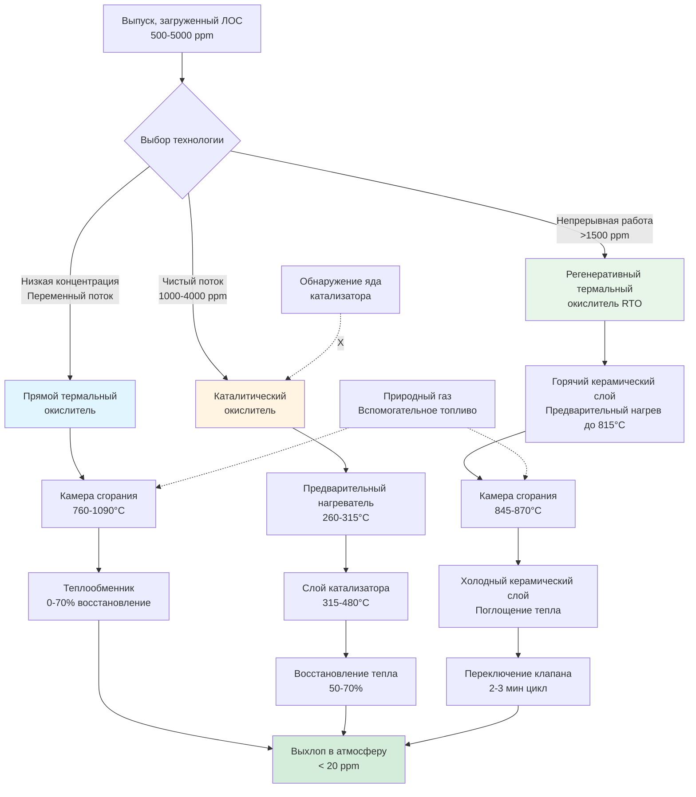
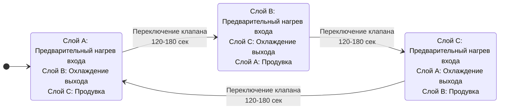

## Обзор технологии термального окисления

Термальное окисление разрушает летучие органические соединения путем высокотемпературного сгорания, преобразуя ЛОС в углекислый газ и водяной пар. Когда извлечение растворителей не является экономичным, или когда требования к эффективности разрушения превышают 95%, термальное окисление обеспечивает наиболее надежный путь соответствия EPA для полиграфических предприятий, подлежащих регулированию согласно 40 CFR Part 63 Subpart KK.

Основное преимущество термального окисления перед системами извлечения заключается в способности обрабатывать переменный состав растворителей, загрязненные потоки, содержащие твердые частицы или ядовитые вещества для катализатора, и приложения, требующие максимальной эффективности разрушения. Современные регенеративные термальные окислители достигают эффективности разрушения 95-99% при восстановлении 90-95% энергии сгорания, что обеспечивает экономичную работу даже при умеренных концентрациях ЛОС.

## Фундаментальная химия сгорания

### Реакции полного окисления

Разрушение ЛОС происходит посредством полного окисления при наличии достаточного кислорода и температуры с адекватным временем пребывания:

**Сгорание толуола (C₇H₈):**

$$\text{C}_7\text{H}_8 + 9\text{O}_2 \rightarrow 7\text{CO}_2 + 4\text{H}_2\text{O}$$

**Стехиометрическое требование кислорода:**

$$\text{O}_{2,stoich} = \frac{x + \frac{y}{4}}{1} \text{ молей O}_2\text{ на моль C}_x\text{H}_y$$

Для толуола (C₇H₈):
$$\text{O}_{2,stoich} = 7 + \frac{8}{4} = 9 \text{ молей O}_2$$

**Расчет требования воздуха:**

Воздух содержит 21% кислорода по объему, следовательно:

$$\text{Air}_{stoich} = \frac{\text{O}_{2,stoich}}{0.21}$$

Для полного сгорания толуола:
$$\text{Air}_{stoich} = \frac{9}{0.21} = 42.86 \text{ молей воздуха на моль толуола}$$

**Требование избыточного воздуха:**

Практические системы работают с 10-50% избытком воздуха для обеспечения полного сгорания:

$$\text{Air}_{actual} = \text{Air}_{stoich} \times (1 + EA)$$

Где $EA$ = доля избыточного воздуха (0.10-0.50)

Стандартное проектирование: 25% избытка воздуха
$$\text{Air}_{actual} = 42.86 \times 1.25 = 53.6 \text{ молей воздуха на моль толуола}$$

### Выделение тепла при сгорании ЛОС

**Энергетический баланс:**

$$Q_{combustion} = \dot{m}_{VOC} \times HHV$$

Где:
- $Q_{combustion}$ = Выделение тепла (кДж/ч)
- $\dot{m}_{VOC}$ = Расход масс ЛОС (кг/ч)
- $HHV$ = Высшая теплотворная способность (кДж/кг)

**Теплотворные способности типичных полиграфических растворителей:**

| Растворитель | Химическая формула | HHV (кДж/кг) | Выделение тепла при 1000 ppm |
|---------|------------------|------------|--------------------------|
| Толуол | C₇H₈ | 42,300 | 235 кДж/м³ |
| МЕК | C₄H₈O | 31,850 | 134 кДж/м³ |
| Ацетон | C₃H₆O | 30,450 | 103 кДж/м³ |
| Этилацетат | C₄H₈O₂ | 26,730 | 137 кДж/м³ |
| ИПА | C₃H₈O | 32,300 | 113 кДж/м³ |

**Выделение тепла на единицу объема выпуска:**

$$q_{volumetric} = \frac{C_{ppm} \times MW \times HHV}{385 \times T} \times \rho_{air} \text{ (кДж/м³)}$$

Для 2000 ppm толуола при 21°C:

$$q_{vol} = \frac{2000 \times 92 \times 42,300}{385 \times 293} \times 1.2 = 470 \text{ кДж/м³}$$

Это выделение тепла определяет, могут ли системы работать автотермально (самопроизвольно без вспомогательного топлива).

## Проектирование регенеративного термального окислителя (RTO)

### Принципы работы RTO

RTO достигают исключительную тепловую эффективность (90-95%) благодаря керамическим слоям среды, которые поочередно поглощают тепло сгорания и предварительно нагревают входящий выпуск. Этот механизм восстановления тепла обеспечивает экономичную работу при концентрациях ЛОС всего 1500-2000 ppm.

**Преимущества трехслойной конфигурации:**

1. **Непрерывная работа:** Один слой всегда предварительно нагревает вход, в то время как другой охлаждает выход
2. **Цикл продувки:** Третий слой продувает ЛОС для предотвращения выброса при переключении
3. **Восстановление энергии:** 90-95% тепла сгорания захватывается и используется повторно
4. **Низкое потребление топлива:** Самопроизвольная работа выше автотермальной концентрации

### Расчет тепловой эффективности

**Эффективность восстановления тепла:**

$$\eta_{thermal} = \frac{T_{combustion} - T_{out,cold}}{T_{combustion} - T_{ambient}}$$

Где:
- $T_{out,cold}$ = Температура выпуска, выходящего из холодного слоя (°C)
- $T_{ambient}$ = Температура входящего выпуска (°C)
- $T_{combustion}$ = Температура камеры сгорания (°C)

**Пример производительности RTO:**

Условия работы:
- Температура входа: 21°C
- Температура сгорания: 843°C
- Температура выхода: 60°C

$$\eta_{thermal} = \frac{843 - 60}{843 - 21} = \frac{783}{822} = 0.953 = 95.3\%$$

**Восстановленная энергия:**

$$Q_{recovered} = Q_{exhaust} \times \rho \times c_p \times (T_{preheat} - T_{ambient}) \times \eta_{thermal}$$

### Автотермальная рабочая точка

Автотермальная концентрация представляет уровень ЛОС, при котором тепло сгорания точно уравновешивает потери тепла, устраняя необходимость во вспомогательном топливе.

**Энергетический баланс при автотермальной точке:**

Тепло, поступающее от сгорания ЛОС:
$$Q_{in} = \dot{m}_{VOC} \times HHV$$

Тепло, необходимое для поддержания температуры:
$$Q_{required} = Q_{exhaust} \times \rho \times c_p \times \Delta T \times (1 - \eta_{thermal})$$

При автотермальной точке: $Q_{in} = Q_{required}$

**Решение для автотермальной концентрации:**

$$C_{auto} = \frac{(T_{comb} - T_{inlet}) \times \rho_{air} \times c_p \times (1 - \eta_{thermal})}{HHV \times MW} \times 385 \times T$$

**Упрощенная форма:**

$$C_{auto,ppm} = \frac{26.7 \times (T_{comb} - T_{inlet}) \times (1 - \eta_{thermal})}{HHV_{kJ/kg}}$$

**Пример: Автотермальная концентрация толуола**

Параметры:
- $T_{comb}$ = 843°C
- $T_{inlet}$ = 21°C
- $\eta_{thermal}$ = 0.95
- $HHV$ = 42,300 кДж/кг

$$C_{auto} = \frac{26.7 \times (843-21) \times (1-0.95)}{42,300} = \frac{26.7 \times 822 \times 0.05}{42,300}$$

$$C_{auto} = \frac{1,099}{42,300} = 0.026\% = 1,090 \text{ ppm}$$

**Автотермальные концентрации типичных растворителей в RTO (эффективность 95%):**

| Растворитель | HHV (кДж/кг) | Автотермальная концентрация (ppm) | Самопроизвольная работа |
|---------|--------------|------------------------|---------------------------|
| Толуол | 42,300 | 1,090 | Отличная |
| МЕК | 31,850 | 1,450 | Хорошая |
| Ацетон | 30,450 | 1,520 | Хорошая |
| Этилацетат | 26,730 | 1,730 | Средняя |
| ИПА | 32,300 | 1,430 | Хорошая |

**Проектный запас:** Размер горелки рассчитан на 150-200% требования к теплу при 50% автотермальной концентрации для обработки чрезвычайных ситуаций и запуска.

### Расчеты размеров RTO

**Первичные параметры проектирования:**

1. **Объемный расход** (определяет размер сосуда)
2. **Концентрация ЛОС** (влияет на потребление топлива)
3. **Требуемая эффективность разрушения** (устанавливает температуру и время пребывания)

**Объем камеры сгорания:**

$$V_{chamber} = Q_{exhaust} \times t_{residence}$$

Где:
- $V_{chamber}$ = Объем камеры (м³)
- $Q_{exhaust}$ = Расход выпуска при температуре сгорания (м³/ч)
- $t_{residence}$ = Время пребывания (мин)

**Коррекция температуры для потока:**

$$Q_{actual} = Q_{std} \times \frac{T_{actual}}{T_{std}}$$

Для 9.43 м³/с выпуска, нагретого до 843°C:

$$Q_{actual} = 9.43 \times 3600 \times \frac{(843+273)}{(21+273)} = 33,948 \times 3.79 = 128,684 \text{ м³/ч}$$

**Требование времени пребывания:**

EPA Method 25A требует 0.5-1.0 секунды при температуре сгорания для эффективности разрушения 99%.

Стандартное проектирование: 0.75 секунды = 0.0125 минуты

$$V_{chamber} = 128,684 \times 0.0125 = 1,609 \text{ м³}$$

**Геометрия камеры:**

Цилиндрический сосуд с длиной = 2 × диаметру:

$$V = \frac{\pi \times D^2}{4} \times L = \frac{\pi \times D^2}{4} \times 2D = \frac{\pi \times D^3}{2}$$

$$D = \left(\frac{2V}{\pi}\right)^{1/3} = \left(\frac{2 \times 1,609}{\pi}\right)^{1/3} = 3.1 \text{ м}$$

Проектирование: 3.2 м диаметром × 6.4 м длиной = 1,609 м³ реальный объем

**Размер керамического слоя:**

**Требование емкости теплового хранения:**

$$Q_{stored} = Q_{exhaust} \times \rho \times c_p \times (T_{hot} - T_{cold}) \times t_{cycle}$$

Для 2-минутного цикла переключения:

$$Q_{stored} = 128,684 \times \frac{1}{3600} \times 1.2 \times 1000 \times 0.24 \times (843-38) \times \frac{2}{60}$$

$$Q_{stored} = 42,895 \times 1.2 \times 1000 \times 0.24 \times 805 \times 0.0333 = 3,473 \text{ кДж}$$

**Свойства керамической среды:**

| Свойство | Керамические кольца | Структурированная среда |
|----------|-----------------|------------------|
| Материал | Кордиерит/Муллит | Кордиерит сотовой структуры |
| Удельная теплоемкость | 0.22 Btu/lb·°F | 0.22 Btu/lb·°F |
| Объемная плотность | 640-800 кг/м³ | 560-720 кг/м³ |
| Доля пустот | 0.75-0.80 | 0.70-0.75 |
| Коэффициент теплопередачи | 85-140 Вт/м²·К | 140-225 Вт/м²·К |
| Перепад давления | 20-30 Па на м | 10-15 Па на м |

**Требуемая масса керамики:**

$$M_{ceramic} = \frac{Q_{stored}}{c_p \times \Delta T_{average}}$$

Средний температурный перепад: $(843-38)/2 = 403°C$

$$M_{ceramic} = \frac{3,473}{1000 \times 403} = 8.6 \text{ кг на слой}$$

**Объем слоя (используется структурированная среда):**

$$V_{bed} = \frac{M_{ceramic}}{\rho_{bulk}} = \frac{8.6}{640} = 0.013 \text{ м³ на слой}$$

**Практическое проектное рассмотрение:**

Реальные объемы керамических слоев намного больше для обеспечения:
- Адекватной поверхности теплопередачи
- Правильного распределения потока
- Достаточной тепловой массы для вариаций цикла

**Стандартное размеры RTO слоя:**

$$V_{bed} = \frac{Q_{exhaust}}{v_{face}} \times L_{bed}$$

Скорость поверхности: 0.6-1.0 м/с (оптимум для перепада давления против теплопередачи)

Глубина слоя: 0.9-1.8 м (обеспечивает адекватную тепловую массу)

$$A_{face} = \frac{128,684/3600}{0.8 \times 3600} = 0.056 \text{ м²}$$

Для круглого сосуда: $D = \sqrt{4 \times 56/\pi} = 8.4$ м

Объем слоя: $V_{bed} = 56 \times 1.2 = 67$ м³ на слой

**Полное размеры RTO сосуда:**

Три слоя + камера сгорания + плены:
- Каждый слой: 3.2 м диаметр × 1.2 м высота = 9.7 м³
- Камера сгорания: 3.2 м диаметр × 6.4 м = 51.5 м³
- Полная высота: 1.2 + 1.2 + 6.4 + 1.2 = 10 м
- Площадь основания: 3.2 м × 3.2 м

### Потребление топлива RTO

**Энергетический баланс для неавтотермальной работы:**

$$Q_{fuel} = Q_{exhaust} \times \rho \times c_p \times \Delta T \times (1-\eta_{thermal}) - \dot{m}_{VOC} \times HHV$$

**Пример: 9.43 м³/с при 1200 ppm толуола (ниже автотермального)**

Вклад тепла ЛОС:

$$\dot{m}_{VOC} = \frac{9.43 \times 3600 \times 1200 \times 92}{385 \times 293} = 0.059 \text{ кг/с} = 212 \text{ кг/ч}$$

$$Q_{VOC} = 212 \times 42,300 = 8,967,600 \text{ кДж/ч}$$

Тепло, необходимое для поддержания 843°C:

$$Q_{required} = 128,684 \times 1.2 \times 1000 \times 0.24 \times (843-21) \times (1-0.95)$$

$$Q_{required} = 128,684 \times 1.2 \times 1000 \times 0.24 \times 822 \times 0.05 = 1,516,000 \text{ кДж/ч}$$

Требуемое топливо:

$$Q_{fuel} = 1,516,000 - 8,967,600 = -7,451,600 \text{ кДж/ч}$$

**Результат:** Система работает автотермально с избытком тепла (1200 ppm превышает автотермальную точку 1090 ppm для толуола).

**При 800 ppm толуола (ниже автотермального):**

$$\dot{m}_{VOC} = 141 \text{ кг/ч}$$
$$Q_{VOC} = 5,964,300 \text{ кДж/ч}$$
$$Q_{fuel} = 1,516,000 - 5,964,300 = -4,448,300 \text{ кДж/ч}$$

Потребление природного газа (38.6 МДж/м³, эффективность горелки 90%):

$$V_{NG} = \frac{4,448,300}{38.6 \times 0.90} = 128,600 \text{ м³/ч}$$

**Операционная стоимость:** 128,600 м³/ч × $6/1000 м³ = $771/ч = $5,536/месяц (непрерывная работа)

### Эффективность разрушения RTO

**Эффективность разрушения EPA Method 25A:**

$$E_{destruction} = \frac{C_{inlet} - C_{outlet}}{C_{inlet}} \times 100\%$$

**Связь температура-эффективность:**

Более высокие температуры повышают эффективность разрушения экспоненциально согласно соотношению Аррениуса:

$$k = A \times e^{-E_a/(R \times T)}$$

Где:
- $k$ = Константа скорости реакции
- $A$ = Предэкспоненциальный множитель
- $E_a$ = Энергия активации (типично 104,000-146,000 кДж/моль для ЛОС)
- $R$ = Газовая постоянная (8.314 Дж/моль·К)
- $T$ = Температура (К)

**Практическая эффективность разрушения и температура:**

| Температура (°C) | Время пребывания (сек) | Эффективность разрушения |
|------------------|----------------------|------------------------|
| 760 | 0.75 | 95.0% |
| 788 | 0.75 | 97.0% |
| 816 | 0.75 | 98.5% |
| 843 | 0.75 | 99.2% |
| 871 | 0.75 | 99.6% |
| 899 | 0.75 | 99.8% |

**Стандартное проектирование:** 843-871°C с временем пребывания 0.75-1.0 сек достигает эффективности >99% для типичных полиграфических растворителей.

**Проверочное тестирование:** EPA требует тестирования стека согласно Method 25A каждые 2-5 лет для подтверждения соответствия лимитам разрешения.

## Проектирование каталитического окислителя

### Основы катализа

Каталитическое окисление обеспечивает разрушение ЛОС при 315-480°C благодаря активным сайтам поверхности, которые снижают энергию активации для реакций окисления. Более низкая рабочая температура снижает потребление топлива на 40-60% по сравнению с термальным окислением, но вводит уязвимости отравления катализатора.

**Материалы катализатора:**

**Драгоценные металлические катализаторы:**
- Платина (Pt): Наиболее активна для окисления углеводородов
- Палладий (Pd): Лучшая устойчивость к сере, чем платина
- Родий (Rh): Используется в специализированных приложениях

**Катализаторы из базовых металлов:**
- Оксид меди (CuO)
- Оксид марганца (MnO₂)
- Оксид хрома (Cr₂O₃)
- Ниже стоимость, но менее активны, чем драгоценные металлы

**Стандартное приложение печати:** Платина на подложке из оксида алюминия (0.5-2.0% Pt по массе)

**Геометрия катализатора:**

| Тип | Структура | Площадь поверхности (м²/м³) | Перепад давления | Стоимость |
|-----|-----------|------------------------|---------------|------|
| Гранула | Сферы/цилиндры 3 мм | 3,200-4,900 | Высокий (2-3 кПа/м) | Низкая |
| Сотовая структура | Монолитные каналы | 1,300-2,600 | Низкий (0.25-0.75 кПа/м) | Средняя |
| Проволочная сетка | Гофрированный металл | 650-1,300 | Очень низкий (0.1-0.25 кПа/м) | Высокая |

**Стандартный выбор:** Сотовый монолит (подложка из кордиерита с подслоем) обеспечивает оптимальный баланс активности, перепада давления и стоимости.

### Параметры производительности катализатора

**Температура зажигания:**

Температура, при которой происходит 50% преобразования ЛОС. Более низкая температура зажигания указывает на более активный катализатор.

**Типичные температуры зажигания:**

| ЛОС | Температура зажигания Pt (°C) | Рабочая температура (°C) |
|-----|----------------------------|---------------------|
| Толуол | 232 | 343-399 |
| МЕК | 218 | 316-371 |
| Ацетон | 246 | 343-399 |
| Этилацетат | 227 | 329-385 |
| ИПА | 243 | 343-399 |

**Рабочая температура:** Обычно на 56-83°C выше температуры зажигания для обеспечения >95% преобразования.

**Пространственная скорость:**

$$SV = \frac{Q_{actual}}{V_{catalyst}}$$

Где:
- $SV$ = Пространственная скорость (ч⁻¹)
- $Q_{actual}$ = Объемный расход при рабочей температуре (м³/ч)
- $V_{catalyst}$ = Объем катализаторного слоя (м³)

**Рекомендуемые пространственные скорости:**

- Катализатор драгоценного металла: 10,000-30,000 ч⁻¹
- Катализатор из базового металла: 5,000-15,000 ч⁻¹

Более низкая пространственная скорость (больший объем катализатора) обеспечивает:
- Более высокую эффективность преобразования
- Большую толерантность к ядам катализатора
- Уменьшенный скачок температуры по слою

**Пример расчета: 7.08 м³/с выпуска, рабочая температура 371°C**

Поток при рабочей температуре:

$$Q_{actual} = 7.08 \times 3600 \times \frac{(371+273)}{(21+273)} = 25,488 \times 2.19 = 55,819 \text{ м³/ч}$$

Для пространственной скорости 20,000 ч⁻¹:

$$V_{catalyst} = \frac{55,819}{20,000} = 2.79 \text{ м³}$$

**Конфигурация катализаторного слоя:**

Поверхностная скорость: 1.5-3.0 м/с (3.0 м/с типично для сотовой структуры)

$$A_{face} = \frac{55,819}{3.0 \times 3600} = 5.16 \text{ м²}$$

Глубина слоя: $L = V_{catalyst}/A_{face} = 2.79/5.16 = 0.54$ м

**Выбор проекта:** 2.3 м × 2.3 м площадь × 0.6 м глубина = 3.17 м³ реальный объем

Пространственная скорость: 55,819/3.17 = 17,600 ч⁻¹ (в приемлемом диапазоне)

### Скачок температуры через катализатор

**Адиабатический скачок температуры:**

$$\Delta T_{adiabatic} = \frac{\dot{m}_{VOC} \times HHV}{Q \times \rho \times c_p}$$

**Пример: 2500 ppm толуола в потоке 7.08 м³/с**

$$\dot{m}_{VOC} = \frac{7.08 \times 3600 \times 2500 \times 92}{385 \times 293} = 0.155 \text{ кг/с} = 558 \text{ кг/ч}$$

$$\Delta T_{adiabatic} = \frac{558 \times 42,300}{25,488 \times 1.2 \times 1000 \times 0.24} = \frac{23,603,400}{73,406} = 322°C$$

**Максимально допустимая температура:** Большинство катализаторов дезактивируются выше 537-649°C.

**Проектный лимит:** Входная концентрация <25% LEL для предотвращения чрезмерного скачка температуры.

Для толуола (LEL = 1.2%):
Максимально безопасная концентрация = 0.25 × 12,000 ppm = 3,000 ppm

При 3,000 ppm: $\Delta T = 386°C$

Входная температура + скачок температуры < 649°C:
$T_{inlet,max} = 649 - 386 = 263°C$

**Практическое проектирование:** Предварительный нагрев до 343-371°C, результирующая выходная температура 729-757°C (безопасна для катализатора).

### Яды катализатора и дезактивация

**Постоянные яды катализатора:**

Эти соединения необратимо дезактивируют активные сайты катализатора:

| Яд | Источник в печати | Эффект | Уровень толерантности |
|--------|-------------------|--------|-----------------|
| Свинец (Pb) | Пигменты, сушилки | Блокирует активные сайты | <0.1 ppm непрерывно |
| Фосфор (P) | Огнезащитные покрытия | Образование фосфатов | <1 ppm непрерывно |
| Сера (S) | Определенные чернила | Образование сульфатов | <10 ppm непрерывно |
| Кремний (Si) | Силоксаны, противовспенивающие | Образование покрытия | <1 ppm непрерывно |
| Цинк (Zn) | УФ-чернила | Блокирует сайты | <0.5 ppm непрерывно |
| Галогены (Cl, F) | Растворители, добавки | Образование кислоты | <50 ppm непрерывно |

**Временное маскирование:**

Обратимая блокировка активных сайтов:

- **Твердые частицы:** Блокирует поры катализатора (фильтрация до 10 микрон предотвращает)
- **Соединения высокого молекулярного веса:** Образование кокса (регенерация при 427-538°C восстанавливает активность)
- **Полимеризующиеся материалы:** Отложения покрытия (требуется периодическое выжигание)

**Требования предварительной фильтрации:**

- Фильтр твердых частиц: эффективность 95% при 10 микронах
- Мониторинг перепада давления: замена фильтров при 2 кПа
- Опциональный слой активированного угля для захвата яда

### Потребление топлива каталитического окислителя

**Автотермальная концентрация для каталитических систем:**

Более низкая рабочая температура (371°C против 843°C) увеличивает автотермальную концентрацию:

$$C_{auto,catalytic} = \frac{26.7 \times (T_{operating} - T_{inlet}) \times (1-\eta_{HX})}{HHV_{kJ/kg}}$$

Для работы при 371°C с 60% восстановлением тепла:

$$C_{auto,catalytic} = \frac{26.7 \times (371-21) \times 0.40}{42,300} = \frac{6,728}{42,300} = 0.159\% = 1,590 \text{ ppm толуола}$$

**Потребление топлива ниже автотермальной точки:**

$$Q_{fuel} = Q \times \rho \times c_p \times \Delta T \times (1-\eta_{HX}) - \dot{m}_{VOC} \times HHV$$

**Пример: 7.08 м³/с при 1500 ppm толуола**

$$Q_{fuel} = 55,819 \times 1.2 \times 1000 \times 0.24 \times (371-21) \times 0.40 - 167 \times 42,300$$

$$Q_{fuel} = 56,882 \times 350 \times 0.40 - 7,064,100 = 7,964,000 - 7,064,100 = 899,900 \text{ кДж/ч}$$

**Потребление природного газа:** 899,900 / (38.6 × 0.90) = 25,900 м³/ч

### Стоимость капитала и эксплуатации каталитического окислителя

**Стоимость капитала (система 7.08 м³/с):**

| Компонент | Стоимость |
|-----------|-------|
| Предварительный нагреватель и система горелки | 42,500 |
| Катализаторный слой (сотовая структура Pt/Pd) | 56,000 |
| Теплообменник "оболочка-труба" | 38,000 |
| Приборы и элементы управления | 18,800 |
| Выхлопной вентилятор (30 кВт) | 12,500 |
| Система предварительной фильтрации | 9,800 |
| Монтаж и инжиниринг | 65,000 |
| **Полная стоимость капитала** | **$242,600** |

**Операционные расходы (8000 ч/год):**

- Природный газ: $155,400/год (с учетом среднего 1000 ppm, частичное требование топлива)
- Электроэнергия: $20,000/год (вентилятор 30 кВт × 0.746 × $0.12/кВт·ч × 8000 ч)
- Замена катализатора: $11,200/год (5-летний срок, $56,000/5)
- Обслуживание: $6,700/год
- **Полная годовая операционная стоимость:** $193,300/год

**Сравнение с RTO:** Ниже стоимость капитала, но выше операционная стоимость из-за замены катализатора и потенциально более высокого потребления топлива.

## Прямой термальный окислитель

### Принципы работы

Прямые термальные окислители представляют самую простую технологию разрушения ЛОС: выпуск смешивается с пламенем горелки в огнеупорной камере при 760-1091°C. Простой дизайн обеспечивает максимальную надежность и эффективность разрушения (99%+) ценой высокого потребления топлива.

**Преимущества:**

- Простейший дизайн с наивысшей надежностью
- Обрабатывает переменный поток и концентрацию
- Нет риска отравления катализатора
- Максимальная эффективность разрушения (99.9%+ достижима)
- Быстрый запуск (15-30 минут до температуры)
- Ниже стоимость капитала, чем RTO или каталитический

**Недостатки:**

- Наивысшее потребление топлива (минимальное восстановление тепла)
- Большая площадь основания для систем восстановления тепла
- Высокая температура стека без восстановления тепла (427-760°C)

### Проектирование камеры сгорания

**Время пребывания:** 0.5-1.0 секунды при температуре сгорания обеспечивает полное разрушение

**Температура камеры:** 760-1091°C в зависимости от:
- Типа ЛОС и его реактивности
- Требуемой эффективности разрушения
- Лимитов разрешения

**Объем камеры:**

$$V_{chamber} = Q_{exhaust,hot} \times t_{residence}$$

**Пример: 5.67 м³/с выпуска, 871°C, 0.75 сек время пребывания**

$$Q_{hot} = 5.67 \times 3600 \times \frac{(871+273)}{(21+273)} = 20,412 \times 3.89 = 79,402 \text{ м³/ч}$$

$$V_{chamber} = 79,402 \times \frac{0.75}{60} = 990 \text{ м³}$$

**Конфигурация камеры:**

Цилиндрический сосуд с соотношением L/D 2-3:

$$D = \left(\frac{4V}{\pi \times 2.5}\right)^{1/3} = \left(\frac{4 \times 990}{7.85}\right)^{1/3} = 6.8 \text{ м}$$

Проектирование: 7.0 м диаметр × 17.5 м длина

**Огнеупорная кладка:**

| Слой | Материал | Толщина (см) | Макс. температура (°C) | Функция |
|------|----------|----------------|---------------|----------|
| Горячая поверхность | Кастаблоя муллит | 10-15 | 1649 | Защита стали от тепла |
| Изоляция | Легкий изоляционный кирпич | 10-15 | 1260 | Снижение потери тепла |
| Резервный | Доска силиката кальция | 5 | 649 | Финальный слой изоляции |
| Оболочка | Углеродистая стальная пластина | 6-9 мм | 149 | Конструкционное содержание |

**Потеря тепла через огнеупорную кладку:**

$$Q_{loss} = \frac{A \times (T_{hot} - T_{cold})}{R_{total}}$$

Для камеры 7 м × 17.5 м (площадь ≈ 450 м²):

Тепловое сопротивление: $R_{total} = 0.6$ м²·К/Вт (типично для 35-36 см полной огнеупорной кладки)

$$Q_{loss} = \frac{450 \times (871-21)}{0.6} = \frac{382,500}{0.6} = 637,500 \text{ кВт}$$

### Системы восстановления тепла

**Первичный предварительный нагрев воздуха (0-40% восстановления тепла):**

Выпуск проходит через сторону оболочки забора воздуха горелки, восстанавливая чувствительное тепло без дополнительного оборудования.

**Рекуператор "оболочка-труба" (40-70% восстановления тепла):**

Горячий выпуск (760-871°C) предварительно нагревает входящий выпуск через металлический теплообменник:

**Расчет восстановления тепла:**

$$Q_{recovered} = Q \times \rho \times c_p \times \eta_{HX} \times (T_{combustion} - T_{inlet})$$

Для теплообменника эффективности 60%:

$$Q_{recovered} = 20,412 \times 1.2 \times 1000 \times 0.24 \times 0.60 \times (871-21)$$

$$Q_{recovered} = 24,494 \times 0.60 \times 850 = 12,492,000 \text{ кДж/ч}$$

**Сбережения топлива:**

Без восстановления тепла, требование топлива:

$$Q_{fuel,no HX} = 24,494 \times 850 = 20,820,000 \text{ кДж/ч}$$

С восстановлением 60%:

$$Q_{fuel,with HX} = 20,820,000 - 12,492,000 = 8,328,000 \text{ кДж/ч}$$

**Снижение потребления топлива:** 60% (соответствие эффективности теплообменника)

**Сравнение операционной стоимости (природный газ при $6/1000 м³, 8000 ч/год):**

Без восстановления тепла: 20,820,000 / (38.6 × 0.90) = 601,800 м³/ч × $6 × 8000 ч = $28,886,400/год

С восстановлением 60%: 8,328,000 / (38.6 × 0.90) = 241,000 м³/ч × $6 × 8000 ч = $11,568,000/год

**Годовое сбережение:** $17,318,400/год

**Стоимость капитала теплообменника:** $80,000-$112,000

**Простая окупаемость:** <1 месяца

### Пример определения размеров прямого термального окислителя

**Приложение:** 5.67 м³/с полиграфического выпуска, среднее 800 ppm МЕК, переменный состав

**Спецификации системы:**

- Температура сгорания: 816°C (эффективность разрушения 99%)
- Время пребывания: 0.75 секунды
- Восстановление тепла: 65% (оболочка-труба)
- Избыточный воздух: 25%

**Требование тепла:**

$$Q_{required} = 20,412 \times 1.2 \times 1000 \times 0.24 \times (816-21) \times (1-0.65)$$

$$Q_{required} = 24,494 \times 795 \times 0.35 = 6,843,900 \text{ кДж/ч}$$

**Вклад тепла ЛОС (800 ppm МЕК, HHV = 31,850 кДж/кг):**

$$\dot{m}_{MEK} = \frac{5.67 \times 3600 \times 800 \times 72}{385 \times 293} = 0.024 \text{ кг/с} = 86.4 \text{ кг/ч}$$

$$Q_{VOC} = 86.4 \times 31,850 = 2,751,840 \text{ кДж/ч}$$

**Требуемое топливо:**

$$Q_{fuel} = 6,843,900 - 2,751,840 = 4,092,060 \text{ кДж/ч}$$

**Потребление природного газа:**

$$V_{NG} = \frac{4,092,060}{38.6 \times 0.90} = 118,000 \text{ м³/ч} = 118 \text{ м³ м³/ч}$$

**Годовая операционная стоимость:** 118 м³/ч × $6/1000 м³ × 8000 ч = $5,664/год

**Мощность горелки:** Проектирование для 150% расчетного требования = 8.8 ГДж/ч

## Сравнение технологии и выбор

### Матрица сравнения производительности

| Параметр | Прямой термальный | Каталитический | RTO |
|-----------|-------------|-----------|-----|
| **Эффективность разрушения** | 99-99.9% | 95-98% | 95-99% |
| **Рабочая температура** | 760-1091°C | 315-480°C | 816-871°C |
| **Эффективность восстановления тепла** | 0-70% | 50-70% | 90-95% |
| **Автотермальная концентрация** | 4,500-6,750 ppm | 1,570-2,240 ppm | 849-1,130 ppm |
| **Риск отравления катализатора** | Отсутствует | Высокий | Отсутствует |
| **Время запуска** | 8-15 мин | 15-30 мин | 23-45 мин |
| **Требуемое время пребывания** | 0.5-1.0 сек | N/A (пространственная скорость) | 0.5-1.0 сек |
| **Перепад давления** | 2-4 кПа | 3-6 кПа | 5-8 кПа |
| **Стоимость капитала (7.08 м³/с)** | $112,000-$202,000 | $242,600-$292,000 | $360,000-$675,000 |
| **Операционная стоимость (низкий ЛОС)** | Высокая ($$$$) | Средняя ($$$) | Низкая ($$) |
| **Операционная стоимость (высокий ЛОС)** | Низкая ($$) | Низкая ($$) | Очень низкая ($) |
| **Сложность обслуживания** | Низкая | Средняя | Средняя-Высокая |
| **Надежность** | Отличная | Хорошая | Хорошая |
| **Площадь основания** | Большая (с ВХ) | Средняя | Средняя-Большая |
| **Лучшее применение** | Переменная конц. <500 ppm сред. | Чистый поток 500-1500 ppm | Непрерывный поток >845 ppm |

### Критерии выбора

**Выбрать прямой термальный окислитель, когда:**

- Концентрация ЛОС сильно переменная (100-2,800 ppm скачки)
- Выпуск содержит яды катализатора (тяжелые металлы, кремний, галогены)
- Требуется максимальная эффективность разрушения (>99.5%)
- Более низкий бюджет капитала (<$225k для 7.08 м³/с)
- Прерывистая работа (циклы запуска/остановки)
- Содержание твердых частиц >25 мг/м³

**Выбрать каталитический окислитель, когда:**

- Концентрация ЛОС 500-1,800 ppm постоянно
- Чистый поток выпуска (низкое содержание частиц, нет ядов катализатора)
- Приемлема средняя эффективность разрушения (95-98%)
- Приоритет - более низкая стоимость топлива (снижение на 40-60% против прямого термального)
- Ограниченное пространство для большой системы RTO
- Требуется более быстрый запуск (15-30 мин против 23-45 мин для RTO)

**Выбрать регенеративный термальный окислитель, когда:**

- Концентрация ЛОС >845 ppm непрерывно
- Высокое количество операционных часов (>4,000 ч/год)
- Приоритет - самая низкая операционная стоимость (восстановление тепла 90-95%)
- Постоянный расход (колебание ±20%)
- Бюджет капитала поддерживает инвестицию $360k-$675k
- Долгосрочная работа (ROI за 2-3 года)
- Требуется максимальная энергетическая эффективность

### Экономическая структура решения

**Расчет простой окупаемости:**

$$\text{Payback} = \frac{\Delta\text{Capital Cost}}{\text{Annual Operating Cost Savings}}$$

**Пример сравнения: 8.47 м³/с, 1,240 ppm толуола, 8,000 ч/год**

**Каталитический окислитель:**
- Капитал: $280,000
- Годовая операционная стоимость: $51,500 (топливо + замена катализатора + электроэнергия)

**RTO:**
- Капитал: $515,000
- Годовая операционная стоимость: $30,500 (минимальное топливо + электроэнергия + обслуживание)

**Добавочный анализ:**

$$\text{Payback}_{RTO \text{ vs } Catalytic} = \frac{515,000 - 280,000}{51,500 - 30,500} = \frac{235,000}{21,000} = 11.2 \text{ года}$$

**Решение:** Каталитический окислитель предпочтителен, если только операционные часы не превышают 7,150 ч/год или концентрация толуола не увеличивается выше 1,695 ppm (сдвигая RTO ближе к автотермальной работе).

## Соответствие EPA и тестирование

### Нормативные требования (40 CFR Part 63 Subpart KK)

**Применимо к:** Крупные источники опасных загрязняющих веществ (ОЗВ)
- >9.07 т/год одного ОЗВ
- >22.7 т/год комбинированного ОЗВ

**Требования контроля:**

$$E_{overall} = E_{capture} \times E_{control} \geq 86-95\%$$

Или альтернативный лимит выходной концентрации:

$$C_{outlet} \leq 20 \text{ ppmv как пропан (EPA Method 25A)}$$

**Эффективность захвата:** ≥90% для всех точек выброса ЛОС (проверено EPA Method 204)

**Эффективность разрушения/удаления:** ≥95% для термальных/каталитических окислителей

### Требования к тестированию производительности

**Начальное тестирование соответствия:**

Проведено в течение 180 дней после запуска или выдачи разрешения с использованием методов тестирования EPA:

**EPA Method 25A - Всего газообразных органических соединений:**

Детектор ионизации пламени (FID) измеряет полный органический ответ как эквивалент пропана:

$$C_{propane} = \frac{\text{FID Response} - \text{Background}}{\text{Propane Response Factor}}$$

**Условия тестирования:**

- Минимум 3 прогона тестирования
- Каждый прогон 60-120 минут
- Одновременное отбор проб входа и выхода
- Система при представительных условиях работы

**Расчет эффективности разрушения:**

$$E_{destruction} = \frac{\int_0^t (C_{inlet} - C_{outlet}) \, dt}{\int_0^t C_{inlet} \, dt} \times 100\%$$

**Пример результатов тестирования:**

| Прогон | Вход (ppmv C₃) | Выход (ppmv C₃) | Эффективность разрушения |
|--------|-----------------|------------------|------------------------|
| 1 | 1,037 | 12 | 98.84% |
| 2 | 1,084 | 10 | 99.08% |
| 3 | 1,008 | 14 | 98.61% |
| **Среднее** | **1,043** | **12** | **98.84%** |

**Определение соответствия:** 98.84% > 95% требуется ✓

### Мониторинг непрерывного соответствия

**Непрерывно контролируемые операционные параметры (15-минутные средние):**

**Для систем термального/RTO:**

| Параметр | Метод мониторинга | Операционный лимит | Порог отклонения |
|-----------|------------------|-----------------|---------------------|
| Температура камеры сгорания | Термопара Type K | ≥788°C | <788°C более 1 ч |
| Расход выхлопа | Массив Пито или тепловой | Проектный ±20% | За пределами диапазона >2 ч |
| Давление камеры сгорания | Передатчик DP | Слабоположительное | Положительное давление |
| Расход топлива | Расходомер массы | Рассчитанный минимум | <80% проектирования |

**Для каталитических систем:**

| Параметр | Метод мониторинга | Операционный лимит | Порог отклонения |
|-----------|------------------|-----------------|---------------------|
| Входная температура слоя катализатора | Термопара Type K | ≥316°C | <316°C более 1 ч |
| Выходная температура слоя катализатора | Термопара Type K | Мониторить ΔT | ΔT <50% проектирования |
| Дифференциальное давление слоя катализатора | Передатчик DP | Проектный ±25% | >125% проектирования |

**Отчетность об отклонениях:**

Превышения пределов эксплуатации более 5% в 6-месячный период требуют корректирующего действия и отчета EPA в течение 30 дней.

### Требования к ведению записей

**Ежедневные операционные записи:**

- Часы эксплуатации
- Потребление топлива
- Тренды операционных параметров
- Отклонения от нормальной работы
- Мероприятия по обслуживанию

**Месячные расчеты:**

- Массовые выбросы ЛОС (входящие и выходящие)
- Проверка эффективности разрушения
- Итоговое соответствие операционным параметрам

**Годовая отчетность:**

- Сертификация соответствия EPA
- Отчеты об отклонениях (если есть)
- Результаты тестирования производительности (при проведении)
- Реестр использования материалов и выбросов

**Сохранение записей:** Минимум 5 лет на объекте

---

*Технологии термального окисления обеспечивают надежное разрушение ЛОС для полиграфических предприятий, требующих эффективности разрушения 95-99% для соответствия требованиям EPA 40 CFR Part 63 Subpart KK. Выбор технологии между прямым термальным, каталитическим и регенеративным термальным окислителями зависит от концентрации ЛОС, операционных часов, потенциала отравления катализатора и компромиссов между стоимостью капитала и эксплуатации. Регенеративные термальные окислители предлагают наиболее низкие операционные расходы для непрерывных высокообъемных приложений выше 1500-2000 ppm автотермальной концентрации, в то время как каталитические системы обеспечивают умеренные капитальные и операционные расходы для чистых потоков при 500-1,800 ppm, и прямые термальные агрегаты обеспечивают максимальную надежность для переменных концентраций ниже 500 ppm или потоков, содержащих яды катализатора.*
