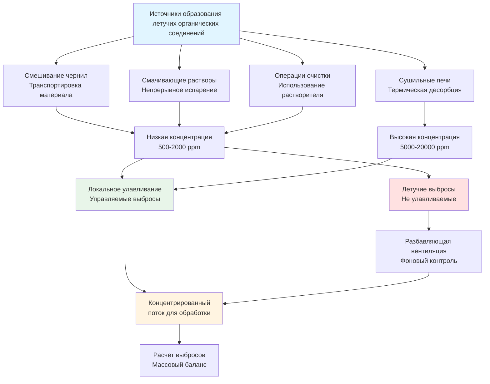
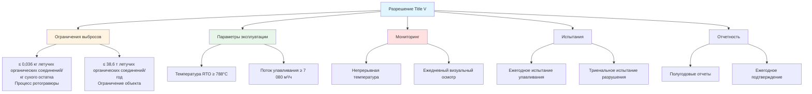

## Основы выбросов летучих органических соединений в полиграфии

Летучие органические соединения (летучие органические соединения), выделяющиеся при полиграфических операциях, являются основной экологической проблемой, требующей специализированных систем вентиляции и контроля. Выбросы летучих органических соединений происходят из чернил на основе растворителя, покрытий, увлажняющих растворов и операций очистки. Скорость и характер этих выбросов зависят от состава растворителя, метода применения, условий сушки и температуры процесса.

С точки зрения физики выбросы летучих органических соединений следуют принципам массопередачи, где растворитель испаряется из жидких пленок чернил в окружающий воздух. Скорость испарения зависит от давления паров, площади поверхности, скорости воздуха над поверхностью и температуры:

$$\dot{m}_{evap} = k \times A \times (P_{sat} - P_{partial})$$

Где:
- $\dot{m}_{evap}$ = Скорость испарения (кг/ч)
- $k$ = Коэффициент массопередачи (кг/ч·м²·кПа)
- $A$ = Открытая площадь поверхности (м²)
- $P_{sat}$ = Давление паров насыщения при рабочей температуре (кПа)
- $P_{partial}$ = Парциальное давление растворителя в окружающем воздухе (кПа)

Этот фундаментальный принцип объясняет, почему сушильные печи (повышенная температура увеличивает $P_{sat}$), высокоскоростные прессы (увеличенная скорость воздуха увеличивает $k$) и большая ширина печати (увеличенная $A$) все производят более высокие уровни выбросов летучих органических соединений.

## Методы расчета выбросов летучих органических соединений

### Метод материального баланса

Наиболее точный метод определения выбросов летучих органических соединений на уровне объекта использует учет материального баланса. Общие выбросы летучих органических соединений равны входящим летучим органическим соединениям минус летучие органические соединения, удерживаемые в готовой продукции:

$$E_{VOC} = \sum_{i=1}^{n} \left[ M_{material,i} \times F_{VOC,i} \times (1 - R_i) \right]$$

Где:
- $E_{VOC}$ = Общие выбросы летучих органических соединений (кг/год)
- $M_{material,i}$ = Масса потребленного материала $i$ (кг/год)
- $F_{VOC,i}$ = Массовая доля летучих органических соединений материала $i$ (кг летучих органических соединений/кг материала)
- $R_i$ = Доля удерживаемых летучих органических соединений (обычно 0,01-0,05 для полиграфии)
- $n$ = Количество различных используемых материалов

**Пример расчета для объекта публикационной ротогравюры:**

Годовое потребление материалов:
- Чернила на основе растворителя: 226 800 кг/год при 35% содержании летучих органических соединений
- Увлажняющий раствор: 22 680 кг/год при 8% спирта
- Растворители для очистки: 9 072 кг/год при 95% летучих органических соединений

$$E_{ink} = 226 800 \times 0,35 \times (1 - 0,02) = 77 697 \text{ кг/год}$$

$$E_{fountain} = 22 680 \times 0,08 \times (1 - 0,10) = 1 633 \text{ кг/год}$$

$$E_{cleanup} = 9 072 \times 0,95 \times (1 - 0,00) = 8 618 \text{ кг/год}$$

$$E_{total} = 77 697 + 1 633 + 8 618 = 87 948 \text{ кг/год} = 44 \text{ т/год}$$

Этот объект превышает порог основного источника 45 т/год, что требует разрешения Title V.

### Метод коэффициента выбросов

Когда записи об использовании материалов неполные, разработанные EPA коэффициенты выбросов оценивают выбросы на основе производственной деятельности:

$$E_{VOC} = A \times EF \times (1 - E_{control})$$

Где:
- $E_{VOC}$ = Выбросы летучих органических соединений (кг)
- $A$ = Уровень производственной активности (объем производства)
- $EF$ = Коэффициент выбросов (кг летучих органических соединений на единицу производства)
- $E_{control}$ = Общая эффективность контроля (доля)

**Коэффициенты выбросов EPA AP-42 для полиграфических операций:**

| Тип процесса | Коэффициент выбросов | База |
|--------------|-----------------|-------|
| Публикационная ротогравюра | 0,159 кг летучих органических соединений/кг сухого остатка | Неконтролируемые |
| Упаковочная ротогравюра | 0,181 кг летучих органических соединений/кг сухого остатка | Неконтролируемые |
| Флексографическая печать | 0,127 кг летучих органических соединений/кг сухого остатка | Неконтролируемые |
| Трафаретная печать | 0,204 кг летучих органических соединений/кг покрытия | Неконтролируемые |
| Литографическая печать | 0,009 кг летучих органических соединений/кг чернил | На основе спирта |

**Пример использования коэффициентов выбросов:**

Флексографический объект, производящий 2 268 000 кг сухого остатка ежегодно с эффективностью контроля 90%:

$$E_{VOC} = 2 268 000 \times 0,127 \times (1 - 0,90) = 28 823 \text{ кг/год} = 14,4 \text{ т/год}$$

### Расчет при непрерывном мониторинге

Объекты с системами непрерывного мониторинга выбросов (CEMS) рассчитывают выбросы на основе измеренной концентрации и расхода:

$$E_{VOC} = \frac{Q \times C \times MW \times t}{0,0366 \times T}$$

Где:
- $E_{VOC}$ = Масса выброшенных летучих органических соединений (кг)
- $Q$ = Расход выхлопных газов (м³/ч)
- $C$ = Концентрация летучих органических соединений (ppmv)
- $MW$ = Средний молекулярный вес (г/моль)
- $t$ = Период времени (часы)
- $T$ = Температура (К)
- 0,0366 = Коэффициент пересчета при стандартных условиях

**Пример расчета выбросов в час:**

Условия в дымоходе:
- Расход: 7 080 м³/ч при 65°C (338 К)
- Концентрация летучих органических соединений: 18 ppm (эквивалент пропана, MW = 44)
- Время работы: 1 час

$$E_{VOC} = \frac{7 080 \times 18 \times 44 \times 1}{0,0366 \times 338} = \frac{5 619 840}{12 379} = 454 \text{ кг/ч}$$

Годовые выбросы при 8000 часов работы:
$$E_{annual} = 454 \times 8 000 = 3 632 000 \text{ кг/год} = 1 816 \text{ т/год}$$

Этот расчет демонстрирует, почему необходимы ограничения на концентрацию на выходе (<20 ppm типично) для соответствия требованиям.

## Нормативная база EPA

### Национальные стандарты выбросов опасных загрязнителей воздуха (NESHAP)

**40 CFR Part 63 Subpart KK** устанавливает стандарты Maximum Achievable Control Technology (MACT) для полиграфических и издательских объектов, являющихся основными источниками опасных загрязнителей воздуха (HAP).

**Определение основного источника:**
- Отдельное HAP: ≥4,54 т/год
- Комбинированные HAP: ≥11,34 т/год

Обычные летучие органические соединения HAP в полиграфических операциях:
- Толуол
- Метилэтилкетон (MEK)
- Ксилол
- Метанол
- Этилбензол

**Требования к контролю в соответствии с Subpart KK:**

**Вариант 1 - Общая эффективность контроля:**
$$E_{overall} = E_{capture} \times E_{control} \geq 95\%$$

**Вариант 2 - Ограничение концентрации на выходе:**
$$C_{outlet} \leq 20 \text{ ppmv (эквивалент пропана)}$$

**Вариант 3 - Ограничение по уровню выбросов:**
$$\frac{E_{VOC}}{M_{solids}} \leq EL$$

Где предельное значение выбросов ($EL$) варьируется в зависимости от процесса:

| Процесс | Предельное значение выбросов (кг летучих органических соединений/кг сухого остатка) |
|---------|-----------------------------------|
| Публикационная ротогравюра | 0,018 |
| Ротогравюра для продукции и упаковки | 0,036 |
| Флексографическая печать | 0,091 |
| Операции покрытия | 0,018-0,036 |

### Планы имплементации штатов (SIPs)

Штаты с зонами несоответствия озону устанавливают дополнительные требования сверх федеральных стандартов NESHAP. Требования варьируются в зависимости от классификации соответствия:

**Технология разумно доступного контроля (RACT):**
- Применяется к существующим источникам в зонах умеренного несоответствия
- Типичное требование: эффективность контроля 85-90%
- На основе экономически достижимой технологии

**Лучшая доступная технология модернизации (BART):**
- Применяется к крупным существующим источникам, влияющим на видимость в районах класса I
- Типичное требование: эффективность контроля 90-95%
- Более строгие, чем RACT

**Наименьший достижимый уровень выбросов (LAER):**
- Применяется к новым или модифицированным основным источникам в зонах серьезного несоответствия
- Требует максимального контроля независимо от стоимости
- Обычно эффективность контроля 95-98%

**Пример требований штата - California SCAQMD Rule 1130:**

| Полиграфический процесс | Предельное значение летучих органических соединений |
|------------------|-----------|
| Ротогравюра | 0,73 кг летучих органических соединений/кг сухого остатка покрытия |
| Флексография | 0,73 кг летучих органических соединений/кг сухого остатка покрытия |
| Трафаретная печать | 0,219 кг летучих органических соединений/л (минус вода) |
| Литография | 0,073 кг летучих органических соединений/л увлажняющего раствора |

### Новые стандарты производительности источников (NSPS)

**40 CFR Part 60 Subpart QQ** применяется к ротогравюрным печатным машинам, построенным после 28 октября 1980 г.:

**Требования производительности:**
- Предельное значение выбросов: 16% летучих органических соединений по массе чернил и сухого остатка покрытия
- Или устройство контроля, достигающее сокращения выбросов на 90%
- Непрерывный мониторинг параметров устройства контроля

## Определение эффективности улавливания

Эффективность улавливания представляет долю образующихся выбросов летучих органических соединений, успешно собираемых локальными системами отвода воздуха для обработки. Точное измерение эффективности улавливания критично для демонстрации соответствия нормативным требованиям.

### Нормативные методы испытаний

**EPA Method 204 - Определение эффективности улавливания:**

Этот метод использует временные полные корпусы (TTE) или строительные корпусы для количественного определения эффективности улавливания. Фундаментальный принцип устанавливает массовый баланс через границу корпуса.

**Подход временного полного корпуса:**

Конструируют временный корпус вокруг источника выбросов, который существенно больше источника. Измеряют:
- Концентрацию летучих органических соединений, входящую в корпус ($C_{in}$, обычно окружающее содержание)
- Концентрацию летучих органических соединений, выходящую из корпуса при естественной вентиляции ($C_{nat}$)
- Концентрацию летучих органических соединений в системе улавливания ($C_{cap}$)
- Поток воздуха, входящий в корпус ($Q_{in}$)
- Поток воздуха в систему улавливания ($Q_{cap}$)

$$E_{capture} = \frac{Q_{cap} \times C_{cap}}{Q_{cap} \times C_{cap} + Q_{nat} \times (C_{nat} - C_{in})} \times 100\%$$

**Практические соображения:**
- TTE должен охватывать все точки выбросов
- Расход воздуха TTE должен превышать систему улавливания на 10%+ для предотвращения положительного давления
- Минимизировать объем TTE относительно размера источника
- Проводить испытание при репрезентативных условиях работы
- Продолжительность испытания: минимум 3 прохода по 1 часу каждый

**Подход с использованием корпуса здания:**

Для крупных источников, где TTE невозможен, используют все здание в качестве корпуса:

$$E_{capture} = \frac{Q_{cap} \times C_{cap}}{Q_{cap} \times C_{cap} + Q_{bldg} \times (C_{bldg} - C_{amb})} \times 100\%$$

Где:
- $Q_{bldg}$ = Расход выхлопных газов здания (м³/ч)
- $C_{bldg}$ = Концентрация летучих органических соединений в выхлопе здания
- $C_{amb}$ = Концентрация летучих органических соединений в окружающем воздухе

**Пример расчета - эффективность улавливания ротогравюрного пресса:**

Данные испытания:
- Система улавливания: $Q_{cap} = 5 664 \text{ м³/ч}$, $C_{cap} = 8 500$ ppm
- Выхлоп здания: $Q_{bldg} = 16 535 \text{ м³/ч}$, $C_{bldg} = 450$ ppm
- Окружающее содержание: $C_{amb} = 50$ ppm

$$E_{capture} = \frac{5 664 \times 8 500}{5 664 \times 8 500 + 16 535 \times (450-50)} \times 100\%$$

$$E_{capture} = \frac{48 144 000}{48 144 000 + 6 614 000} \times 100\% = 87,9\%$$

Этот объект не соответствует требованию эффективности улавливания 95% и должен улучшить конструкцию вытяжного зонда или эффективность корпуса.

### Факторы, влияющие на эффективность улавливания

**Близость вытяжного зонда к источнику:**

Эффективность улавливания снижается экспоненциально с расстоянием от точки выбросов:

$$E_{capture} = E_{max} \times e^{-X/L_c}$$

Где:
- $E_{max}$ = Максимальное улавливание (обычно 95-99% у лица вытяжного зонда)
- $X$ = Расстояние от источника (м)
- $L_c$ = Характерная длина улавливания (0,15-0,6 м в зависимости от скорости зонда)

**Перекрестные потоки воздуха:**

Потоки окружающего воздуха из вентиляции здания, движения персонала или работы оборудования снижают эффективность улавливания:

$$E_{effective} = E_{design} \times \left(1 - \frac{V_{cross}}{V_{hood}}\right)$$

Где:
- $V_{cross}$ = Скорость перекрестного потока (м/мин)
- $V_{hood}$ = Скорость лица вытяжного зонда (м/мин)

Для эффективного улавливания: $V_{cross} < 0,5 \times V_{hood}$

**Скорость выбросов:**

Высокоскоростные выбросы (спрейевое применение, высокоскоростной пресс) требуют более высоких скоростей улавливания:

| Условие выбросов | Требуемая скорость улавливания |
|--------------------|---------------------------|
| Спокойное испарение | 25-50 м/мин |
| Выпуск низкой скорости | 50-100 м/мин |
| Активное образование | 100-250 м/мин |
| Выпуск высокой скорости | 250-500 м/мин |

## Испытание производительности устройства контроля

### Протокол испытаний

**EPA Method 25A - Общие газообразные органические соединения (TGO):**

Детектор ионизации пламени (FID) измеряет общую концентрацию углеводородов как эквивалент пропана.

**Требования к отбору проб:**
- Измерения на входе и выходе в репрезентативных точках
- Минимум 3 испытания по 1 часу продолжительности каждое
- Одновременное измерение расхода (EPA Method 2)
- Измерение температуры в точках измерения

**Расчет эффективности разрушения:**

$$E_{control} = \frac{C_{inlet} - C_{outlet}}{C_{inlet}} \times 100\%$$

**Эффективность разрушения по массе:**

$$E_{mass} = \frac{\dot{m}_{inlet} - \dot{m}_{outlet}}{\dot{m}_{inlet}} \times 100\%$$

Где:
$$\dot{m} = \frac{Q \times C \times MW}{0,0366 \times T}$$

**Пример испытания производительности теплового окислителя:**

Условия на входе:
- Расход: 7 080 м³/ч при 49°C (322 К)
- Концентрация: 2 450 ppm (эквивалент пропана)

Условия на выходе:
- Расход: 7 165 м³/ч при 827°C (1 100 К)
- Концентрация: 12 ppm (эквивалент пропана)

Эффективность на основе концентрации:
$$E_{control} = \frac{2 450 - 12}{2 450} \times 100\% = 99,5\%$$

Эффективность на основе массы:
$$\dot{m}_{inlet} = \frac{7 080 \times 2 450 \times 44}{0,0366 \times 322} = 3 299 \text{ кг/ч}$$

$$\dot{m}_{outlet} = \frac{7 165 \times 12 \times 44}{0,0366 \times 1 100} = 4,9 \text{ кг/ч}$$

$$E_{mass} = \frac{3 299 - 4,9}{3 299} \times 100\% = 99,85\%$$

Система соответствует требованию эффективности разрушения 95% с существенным запасом.

### EPA Method 25 - Анализ спецификации летучих органических соединений

Газовая хроматография с детектором ионизации пламени идентифицирует и количественно определяет отдельные соединения летучих органических соединений.

**Приложения:**
- Соответствие, специфичное для HAP (толуол, MEK, ксилол)
- Проверка коэффициентов выбросов для конкретных соединений
- Различие между экзотермическими и регулируемыми соединениями

**Процедура:**
1. Отбор проб газа в мешки Tedlar или контейнеры
2. Извлечение летучих органических соединений с использованием адсорбентных трубок Tenax
3. Термическая десорбция и анализ GC/FID или GC/MS
4. Количественное определение каждого соединения в сравнении со стандартами калибровки

### Системы непрерывного мониторинга выбросов (CEMS)

Объекты, требующие непрерывного мониторинга соответствия, устанавливают CEMS для отслеживания выбросов в реальном времени.

**Требования CEMS 40 CFR Part 63 Subpart KK:**

| Параметр | Технология | Диапазон измерений | Точность |
|-----------|------------|------------|----------|
| Общие углеводороды | FID | 0-100 ppm или 0-20 ppm | ±5% диапазона |
| Кислород (если применимо) | Парамагнитный или циркониевый | 0-25% | ±0,5% абсолютного |
| Температура сгорания | Термопара | Проектная температура ±56°C | ±8°C |

**Усреднение данных и отчетность:**
- Усреднение за 15-минутные блоки для оценки соответствия
- Ежедневная проверка смещения калибровки (нуль и диапазон)
- Аудиты цилиндра калибровочного газа в квартальных циклах (CGA)
- Ежегодный тест относительной точности (RATA)

**Требование относительной точности:**
$$RA = \frac{\left| \bar{d} \right| + \left| cc \right|}{\bar{R}} \times 100\% < 20\%$$

Где:
- $\bar{d}$ = Среднее различие между CEMS и контрольным методом
- $cc$ = Коэффициент доверия при уровне доверия 95%
- $\bar{R}$ = Среднее значение контрольного метода

## Требования к разрешениям на выбросы

### Разрешения на эксплуатацию Title V

Основные источники выбросов летучих органических соединений (≥45 т/год) или HAP (≥11,34 т/год комбинированные, ≥4,54 т/год отдельные) требуют комплексных разрешений на эксплуатацию Title V в соответствии с 40 CFR Part 70.

**Компоненты разрешения:**

**1. Ограничения на выбросы:**
- Процесс-специфичные ограничения (кг летучих органических соединений/кг сухого остатка)
- Годовые ограничения на уровне объекта (т/год)
- Краткосрочные ограничения (кг/ч или кг/день)

**2. Параметры эксплуатации:**
- Минимальная температура работы устройства контроля
- Минимальный перепад давления на угольных фильтрах
- Максимальная скорость лица у вытяжного зонда
- Минимальный расход системы улавливания

**3. Требования мониторинга:**
- Частота мониторинга параметров (непрерывный, ежедневный, еженедельный)
- Процедуры ведения документации
- Определения превышений и корректирующие действия

**4. Требования испытаний:**
- График первоначального испытания производительности
- Частота периодического испытания (обычно каждые 2-5 лет)
- Методы и протоколы испытаний
- Процедуры обеспечения качества

**5. Требования отчетности:**
- Полугодовые отчеты мониторинга
- Ежегодное подтверждение соответствия
- Отчеты об отклонениях (в течение 30 дней от возникновения)
- Ежегодная инвентаризация выбросов

**Пример структуры условия разрешения:**

### Разрешения на предварительное строительство

Новые источники или крупные модификации существующих источников требуют разрешений на предварительное строительство, демонстрирующих:

**Предотвращение значительного ухудшения (PSD):**

Применяется в зонах соответствия для увеличения ≥18,1 т/год летучих органических соединений:
- Анализ лучшей доступной технологии управления (BACT)
- Моделирование воздействия на качество воздуха
- Анализ дополнительного воздействия (видимость, рост, почвы)
- Уведомление и период общественных комментариев

**Методология анализа BACT:**

**Этап 1 - Идентификация технологий контроля:**
Список всех доступных технологий контроля летучих органических соединений:
- Краски на водной основе (предотвращение загрязнения)
- Адсорбция углем с регенерацией
- Регенеративный тепловой окислитель
- Каталитический окислитель
- Прямой тепловой окислитель

**Этап 2 - Исключение технически нецелесообразных вариантов:**
Пример: Краски на водной основе технически нецелесообразны для публикационной ротогравюры из-за требований качества печати.

**Этап 3 - Ранжирование по эффективности контроля:**
| Технология | Эффективность контроля | Капитальная стоимость | Операционная стоимость |
|------------|-------------------|--------------|----------------|
| RTO | 95-99% | 544 000 $ | 34 000 $/год |
| Каталитический окислитель | 95-98% | 295 000 $ | 43 200 $/год |
| Адсорбция углем | 90-95% | 204 000 $ | 56 700 $/год |

**Этап 4 - Оценка энергетических, экологических и экономических воздействий:**
RTO обеспечивает наивысшую эффективность разрушения с приемлемыми затратами. Выбрана как BACT.

**Этап 5 - Предложение определения BACT:**
- Технология контроля: Регенеративный тепловой окислитель
- Ограничение выбросов: 0,027 кг летучих органических соединений/кг применяемого сухого остатка
- Концентрация на выходе: ≤20 ppm эквивалент пропана
- Эффективность разрушения: ≥95%

**Анализ новых источников в зонах несоответствия (NNSR):**

Применяется в зонах несоответствия для увеличения ≥18,1 т/год летучих органических соединений (зоны серьезного несоответствия) или ≥11,34 т/год (крайние зоны):
- Наименьший достижимый уровень выбросов (LAER)
- Компенсация выбросов при коэффициенте 1,1:1 до 1,5:1
- Подтверждение соответствия во всех остальных источниках
- Анализ воздействия на качество воздуха

**Требование компенсации выбросов:**

Новый источник, выбрасывающий 27,2 т/год летучих органических соединений в зоне серьезного несоответствия, требует:
$$\text{Требуемое смещение} = 27,2 \times 1,2 = 32,6 \text{ т/год сокращения}$$

Объект должен получить кредиты на сокращение выбросов от:
- Остановки существующего оборудования
- Чрезмерного контроля в других источниках
- Покупки из банка кредитов на сокращение выбросов

### Разрешения на незначительные источники

Объекты ниже пороговых значений Title V требуют разрешений незначительных источников штата или общих разрешений с упрощенными требованиями:

**Типичные условия для незначительного источника:**
- Ограничения выбросов на основе технологии (эквивалент RACT)
- Базовый мониторинг (часы работы, использование материалов)
- Ежегодная отчетность
- Непрерывный мониторинг не требуется
- Срок действия разрешения 5 лет

**Опция синтетического незначительного источника:**

Объект может принять федерально обязательные ограничения выбросов ниже пороговых значений основного источника для избежания требований Title V:

Пример: Объект с потенциальными выбросами 54,4 т/год летучих органических соединений принимает ограничение 43,1 т/год через:
- Ограничения часов работы
- Ограничения содержания летучих органических соединений в материалах
- Ежемесячный мониторинг использования материалов

## Ведение документации по демонстрации соответствия

### Ежедневные рабочие записи

**Журналы использования материалов:**
- Тип и количество используемых чернил/покрытий (литры или килограммы)
- Содержание летучих органических соединений каждого материала (% по массе из SDS)
- Номера партий для отслеживания
- Место применения/процесс

**Параметры устройства контроля:**
- Часы работы
- Температура сгорания (если тепловой окислитель)
- Перепад давления на угольных фильтрах (если адсорбер)
- Использование природного газа (если тепловой окислитель)
- События неисправности и их продолжительность

### Ежемесячные расчеты выбросов

**Расчет процессных выбросов:**

$$E_{process} = \sum_{i=1}^{n} M_i \times F_{VOC,i} \times (1 - R_i)$$

**Расчет контролируемых выбросов:**

$$E_{controlled} = E_{process} \times (1 - E_{overall})$$

Где:
$$E_{overall} = E_{capture} \times E_{control}$$

**Пример ежемесячного расчета:**

Использование материалов:
- Чернила A: 5 670 кг при 38% летучих органических соединений
- Чернила B: 3 720 кг при 42% летучих органических соединений
- Растворитель для очистки: 295 кг при 95% летучих органических соединений

Процессные выбросы:
$$E_{process} = 5 670 \times 0,38 + 3 720 \times 0,42 + 295 \times 0,95 = 3 945 \text{ кг}$$

Контролируемые выбросы (эффективность контроля 90%):
$$E_{controlled} = 3 945 \times (1 - 0,90) = 395 \text{ кг в месяц}$$

Годовая проекция:
$$E_{annual} = 395 \times 12 = 4 740 \text{ кг/год} = 2,4 \text{ т/год}$$

### Отчетность об отклонениях

**Определение отклонения:**

Любой случай, когда параметры эксплуатации выходят за границы разрешенных пределов на >5% времени работы в периоде отчетности.

**Сообщаемые отклонения:**
- Температура сгорания <28°C ниже проектной уставки
- Угольный фильтр не регенерирован в запланированном интервале
- Расход системы улавливания <95% от проектного
- Видимые выбросы из устройства контроля
- Неисправность монитора >4 часов

**Документация корректирующих действий:**
- Описание отклонения и вероятная причина
- Продолжительность и величина отклонения
- Оценка избыточных выбросов во время отклонения
- Предпринятые корректирующие действия
- Шаги по предотвращению повторения

### Ежегодное подтверждение соответствия

Ответственное должностное лицо должно ежегодно подтверждать под страхом лжесвидетельства:

**Шаблон заявления о подтверждении:**

"На основе информации и убеждения, сформированного после разумного расследования, утверждения и информация в этом документе являются истинными, точными и полными. Я настоящим подтверждаю, что [Название объекта] соответствовал всем применимым требованиям разрешения на эксплуатацию Title V [Номер] в период [Даты], за исключением уже поданных отчетов об отклонениях."

**Поддерживающая документация:**
- Ежемесячные сводки выбросов
- Данные мониторинга параметров эксплуатации
- Результаты испытаний производительности
- Записи об использовании топлива
- Счета-фактуры о закупке материалов и листы технических данных (SDS)

---

*Контроль выбросов летучих органических соединений в полиграфических операциях требует комплексного понимания методологий расчета выбросов, нормативных требований EPA в соответствии с 40 CFR Part 63 Subpart KK, испытания эффективности улавливания согласно Method 204, проверки производительности устройств контроля с использованием Methods 25/25A и подробного ведения документации для демонстрации непрерывного соответствия условиям разрешения на эксплуатацию Title V и требованиям планов имплементации штатов.*
