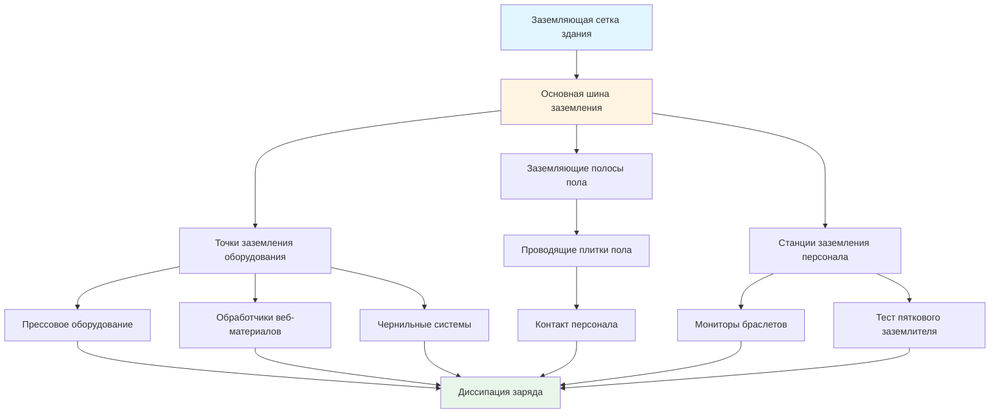

Системы заземления составляют основу эффективного контроля статического электричества в печатных цехах. Надлежащее заземление обеспечивает проводящий путь для диссипации накопленных электростатических зарядов в землю, предотвращая события разряда, которые могут повредить чувствительную электронику, воспламенить легковоспламеняющиеся пары или вызвать проблемы с качеством продукции.

## Физические принципы заземления

Накопление статического заряда происходит при передаче электронов между материалами посредством триботехнического эффекта. Плотность заряда на изолированной поверхности подчиняется:

$$\sigma = \frac{Q}{A}$$

где $\sigma$ — поверхностная плотность заряда (Кл/м²), $Q$ — полный заряд (Кл), $A$ — площадь поверхности (м²). Чтобы заземление было эффективным, проводящий путь должен обеспечивать достаточную скорость диссипации заряда:

$$\frac{dQ}{dt} = -\frac{Q}{RC}$$

где $R$ — сопротивление заземлению (Ω), $C$ — емкость (Ф). Постоянная времени $\tau = RC$ определяет скорость разряда. Для эффективного контроля статического электричества сопротивление заземлению должно поддерживаться ниже $10^9$ Ω, при этом большинство печатных приложений требуют $10^6$ до $10^8$ Ω.

## Компоненты системы заземления

### Заземление оборудования

Все проводящее оборудование в печатной среде должно подключаться к общей эталонной точке заземления:

**Заземление металлических компонентов**
- Рамы прессов и валики: Прямое соединение с шиной заземления
- Чернильные фонтаны и резервуары: Проводные соединения
- Оборудование для обработки веб-материалов: Непрерывный электрический путь
- Требование по сопротивлению: < 1 Ω до заземления

**Конструкция шины заземления**
Шина заземления обеспечивает общую эталонную точку для всего заземленного оборудования. Размер шины следует из несущей способности по току:

$$A_{bus} = \frac{I_{max}}{\delta_{cu}}$$

где $A_{bus}$ — площадь поперечного сечения (мм²), $I_{max}$ — максимальный ток повреждения (А), $\delta_{cu}$ — плотность тока для меди (обычно 3–5 А/мм² при непрерывной нагрузке).

### Проводящие полы

Система полов обеспечивает путь диссипации заряда для персонала и мобильного оборудования:

| Тип пола | Диапазон сопротивления | Применение |
|----------|------------------------|-----------|
| Проводящий | $10^4$ - $10^6$ Ω | Зоны высокой чувствительности |
| Статико-диссипативный | $10^6$ - $10^9$ Ω | Общие печатные зоны |
| Антистатический | $10^9$ - $10^{12}$ Ω | Зоны низкого риска |

**Измерение сопротивления**
Сопротивление пола измеряется в соответствии со стандартом ANSI/ESD STM7.1 с конфигурацией электродов:

$$R_{floor} = \frac{V}{I}$$

измеряется между электродами с силой 98 Н (эквивалент 22 фунтов) расстояние 914 мм (3 фута) друг от друга. Измерения должны проводиться в нескольких местах, причем среднее геометрическое представляет общую производительность пола.

**Требования к установке**
- Непрерывные медные заземляющие полосы, встроенные с интервалами 1,8–3 м (6–10 футов)
- Подключение заземляющей полосы к заземлению здания в минимум 4 точках
- Проверка сопротивления до и после нанесения покрытия
- Контроль влажности: 30–50% ОВ для стабильной производительности

### Заземляющие ремни и соединения

Гибкие соединения обеспечивают движение оборудования при сохранении непрерывности заземления:

**Параметры конструкции ремня**
- Материал: Медная оплетка с оловянным покрытием или проводящий эластомер
- Минимальное поперечное сечение: 10 мм²
- Максимальная длина: 1 м (для минимизации индуктивности)
- Сопротивление соединения: < 0,1 Ω

Индуктивность заземляющих ремней влияет на высокочастотный разряд:

$$L = \frac{\mu_0 \mu_r l}{2\pi} \ln\left(\frac{2l}{r}\right)$$

где $L$ — индуктивность (Гн), $l$ — длина (м), $r$ — радиус проводника (м). Более короткие и широкие ремни минимизируют импеданс на частотах разряда (1–100 МГц).

### Заземление персонала

Персонал накапливает заряд при движении и контакте с материалами:

**Браслеты заземления**
- Сопротивление: 1 МΩ ± 20% (включает токоограничивающий резистор 1 МΩ)
- Проверка соединения: Рекомендуется постоянное мониторирование
- Сопротивление кожи: < 100 кΩ для эффективной работы

**Пятковые заземлители и антистатическая обувь**
В сочетании с проводящим полом:

$$R_{total} = R_{footwear} + R_{floor} + R_{ground}$$

Целевое $R_{total}$ < $10^8$ Ω для диссипации заряда в течение 1 секунды.

## Проектирование системы заземления

## Проверка системы заземления

**Протокол испытания сопротивления**

1. Сопротивление оборудования до заземления: Измеряется мегаомметром при 500 VDC
2. Сопротивление пола до заземления: В соответствии с ANSI/ESD STM7.1 в указанных местах
3. Проверка непрерывности: Все заземляющие пути < 1 Ω при постоянном напряжении
4. Сопротивление контура заземления: < 25 Ω для системы заземления здания

**Частота испытаний**
- Первоначальная установка: 100% проверка всех компонентов
- Ежеквартально: Репрезентативная выборка (20% точек)
- Ежегодно: Полная проверка системы
- После модификаций: Затронутые цепи и соседние области

## Влияние окружающей среды на производительность заземления

Относительная влажность значительно влияет на диссипацию заряда:

$$\tau_{dissipation} = \epsilon_0 \epsilon_r \rho$$

где $\rho$ — удельное сопротивление материала (Ω⋅м). При низкой влажности (< 30% ОВ) поверхностное удельное сопротивление увеличивается на 2–3 порядка, ухудшая эффективность заземления.

**Интеграция контроля влажности**
- Поддерживать 40–50% ОВ в печатных зонах
- Мощность увлажнения: 0,5–1,0 кг воды/1000 CFM (1699 м³/ч) воздуха
- Однородность распределения: ± 5% ОВ по рабочим зонам

## Техническое обслуживание системы заземления

| Компонент | Пункт проверки | Частота | Критерии приемки |
|-----------|----------------|---------|-----------------|
| Заземления оборудования | Визуальный осмотр | Ежемесячно | Отсутствие коррозии, плотные соединения |
| Проводимость пола | Тест сопротивления | Ежеквартально | В пределах указанного диапазона |
| Браслеты заземления | Проверка непрерывности | Ежедневно | < 10 МΩ общее сопротивление |
| Шина заземления | Момент затяжки соединения | Ежегодно | В соответствии со спецификациями производителя |
| Заземление здания | Сопротивление к земле | Ежегодно | < 25 Ω |

**Типичные отказы заземления**

1. Окисление на соединениях: Увеличивает сопротивление с течением времени
2. Механическое напряжение: Разрывы гибких ремней
3. Деградация покрытия: Потеря проводимости пола
4. Неправильное соединение: Изолированные секции оборудования
5. Контуры заземления: Могут создавать электромагнитные помехи

**Корректирующие действия**
- Восстановление соединений: Очистка и повторная затяжка ежегодно
- Замена ремня: Когда сопротивление превышает 1 Ω
- Восстановление пола: Повторное покрытие или замена при дрейфе сопротивления
- Перемычки соединения: Установка поперек механических суставов
- Маршрутизация заземления: Заземление в одной точке для чувствительного оборудования

## Интеграция с системами контроля статического электричества

Заземление работает синергически с другими методами контроля статического электричества:

- **Ионизация**: Нейтрализует заряды, которые не могут достичь заземления
- **Контроль влажности**: Увеличивает поверхностную проводимость
- **Выбор материалов**: Минимизирует триботехническое зарядовое воздействие

Общая эффективность следует:

$$E_{total} = 1 - (1-E_g)(1-E_i)(1-E_h)$$

где $E_g$, $E_i$ и $E_h$ представляют эффективность заземления, ионизации и контроля влажности соответственно. Надлежащим образом спроектированные системы достигают эффективности диссипации заряда 99% и выше.

## Заключение

Эффективные системы заземления требуют тщательного проектирования, установки и обслуживания. Все проводящие материалы должны обеспечивать низкие пути сопротивления к общей эталонной точке заземления. Регулярное тестирование проверяет целостность системы, а контроль окружающей среды оптимизирует производительность. Интеграция с ионизацией и контролем влажности обеспечивает комплексный контроль статического электричества в печатных цехах.
