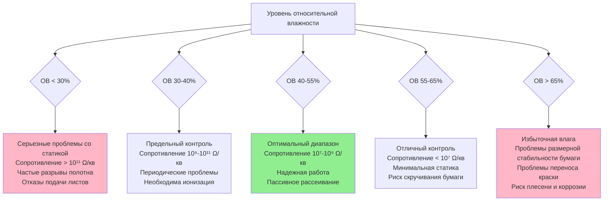
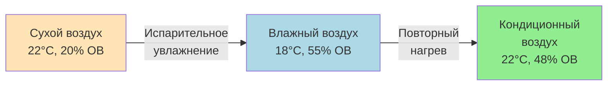
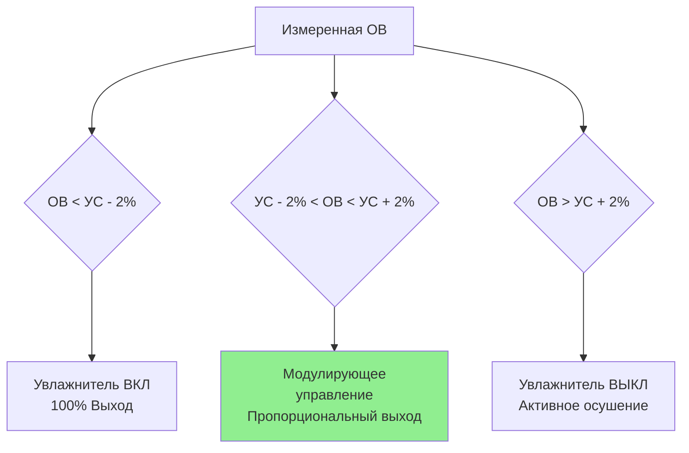

## Влажность как механизм контроля статического электричества

Контроль относительной влажности представляет наиболее фундаментальный и пассивный метод снижения электростатического разряда при выполнении полиграфических операций. Молекулы водяного пара, адсорбированные на гигроскопичных субстратах, создают проводящий поверхностный слой, который облегчает рассеивание заряда, снижая удельное поверхностное сопротивление на 3-6 порядков между 20% и 60% относительной влажности. Этот слой влаги позволяет накопленным электростатическим зарядам рассеиваться на землю через проводящие пути вместо накопления до проблемных уровней напряжения, которые нарушают работу печатного оборудования.

Эффективность контроля влажности зависит от состава материала субстрата, поверхностной химии, температуры воздуха и схемы вентиляции, которые влияют на кинетику поглощения влаги и содержание влаги в равновесном состоянии на поверхности бумаги.

## Взаимосвязь удельного поверхностного сопротивления и влажности

### Физические основы

Удельное поверхностное сопротивление ($\rho_s$) количественно определяет электрическое сопротивление поверхностного слоя материала, измеряемое в омах на квадрат (Ω/кв). Этот параметр определяет время затухания заряда и склонность к накоплению статики:

$$\rho_s = \frac{V}{I} \times \frac{L}{W}$$

Где:
- $\rho_s$ = Удельное поверхностное сопротивление (Ω/кв)
- $V$ = Приложенное напряжение (В)
- $I$ = Ток через поверхность (А)
- $L$ = Расстояние между электродами (м)
- $W$ = Ширина электрода (м)

**Механизм адсорбции влаги:**

Гигроскопичные материалы (бумага, картон) содержат полярные гидроксильные группы (OH⁻) в волокнах целлюлозы, которые притягивают молекулы воды посредством водородных связей. При относительной влажности выше 30-35% на поверхности волокна формируется непрерывный монослой адсорбированных молекул воды. Этот адсорбированный слой содержит мобильные ионы (H⁺, OH⁻ и растворенные соли), которые обеспечивают электрическую проводимость.

**Экспоненциальное снижение сопротивления:**

Удельное поверхностное сопротивление уменьшается экспоненциально с увеличением относительной влажности согласно эмпирическому соотношению:

$$\rho_s(RH) = \rho_0 \times 10^{-k \times RH}$$

Где:
- $\rho_0$ = Базовое сопротивление при 0% относительной влажности (обычно 10¹⁴-10¹⁶ Ω/кв)
- $k$ = Коэффициент влажности, специфичный для материала (0,04-0,08 для бумаги)
- $RH$ = Относительная влажность (выражена как доля, 0-1)

### Поведение материалов, специфичное для их типа

| Тип материала | 20% ОВ | 35% ОВ | 50% ОВ | 65% ОВ | 80% ОВ |
|---------------|---------|---------|---------|---------|---------|
| Немелованная офсетная бумага | 10¹² Ω/кв | 10¹⁰ Ω/кв | 10⁸ Ω/кв | 10⁷ Ω/кв | 10⁶ Ω/кв |
| Мелованная глянцевая бумага | 10¹³ Ω/кв | 10¹¹ Ω/кв | 10⁹ Ω/кв | 10⁸ Ω/кв | 10⁷ Ω/кв |
| Крафт-картон | 10¹¹ Ω/кв | 10⁹ Ω/кв | 10⁷ Ω/кв | 10⁶ Ω/кв | 10⁵ Ω/кв |
| Картон с полиэтиленовым покрытием | 10¹⁴ Ω/кв | 10¹³ Ω/кв | 10¹² Ω/кв | 10¹² Ω/кв | 10¹¹ Ω/кв |
| Пленка ПЭТ | 10¹⁵ Ω/кв | 10¹⁴ Ω/кв | 10¹⁴ Ω/кв | 10¹³ Ω/кв | 10¹³ Ω/кв |
| Пленка полипропилена | 10¹⁶ Ω/кв | 10¹⁵ Ω/кв | 10¹⁵ Ω/кв | 10¹⁴ Ω/кв | 10¹⁴ Ω/кв |

**Критические наблюдения:**

1. **Бумажные субстраты** демонстрируют драматическое снижение удельного сопротивления (4-6 порядков) между 20% и 65% относительной влажности из-за гигроскопичности целлюлозы
2. **Материалы с полимерным покрытием** показывают минимальный отклик на влажность (1-2 порядка изменения), так как негигроскопичные полимеры не адсорбируют значительное количество воды
3. **Синтетические пленки** (ПЭТ, ПП, ПЭ) остаются высокоомными во всем диапазоне относительной влажности, требуя активной ионизации независимо от влажности

### Корреляция времени затухания заряда

Скорость рассеивания электростатического заряда связана напрямую с удельным поверхностным сопротивлением через емкость материала:

$$t_{decay} = \rho_s \times \varepsilon_0 \times \varepsilon_r$$

Где:
- $t_{decay}$ = Время затухания заряда до 37% от начального значения (с)
- $\rho_s$ = Удельное поверхностное сопротивление (Ω/кв)
- $\varepsilon_0$ = Диэлектрическая проницаемость вакуума (8,85 × 10⁻¹² Ф/м)
- $\varepsilon_r$ = Относительная диэлектрическая проницаемость материала (2,0-4,0 для бумаги)

**Практические примеры времени затухания:**

Для немелованной бумаги ($\varepsilon_r$ = 3,0):

| Уровень ОВ | Удельное поверхностное сопротивление | Время затухания (37%) | Время затухания (10%) |
|----------|---------------------|------------------|------------------|
| 20% ОВ | 10¹² Ω/кв | 26,6 с | 61,2 с |
| 35% ОВ | 10¹⁰ Ω/кв | 0,27 с | 0,61 с |
| 50% ОВ | 10⁸ Ω/кв | 2,7 мс | 6,1 мс |
| 65% ОВ | 10⁷ Ω/кв | 0,27 мс | 0,61 мс |

**Значимость:** При 50% относительной влажности и выше, бумажные субстраты рассеивают электростатические заряды в течение миллисекунд и секунд—достаточно быстро для предотвращения накопления во время типовых операций печати (скорость полотна 1,52-30,48 м/с). Ниже 35% относительной влажности времена затухания превышают практические временные рамки, что приводит к накоплению заряда.

## Критические пороги влажности

### Зоны подавления статики

### Оптимальные рабочие диапазоны по типам оборудования

**Листовые офсетные печатные машины:**

- **Целевая ОВ:** 45-50%
- **Допуск:** ±3% ОВ
- **Обоснование:** Баланс между контролем статики и размерной стабильностью для точности приводки
- **Время акклиматизации бумаги:** 24-48 часов при целевых условиях
- **Температура:** 21-24°C

**Рулонные офсетные печатные машины:**

- **Целевая ОВ:** 50-55%
- **Допуск:** ±2% ОВ
- **Обоснование:** Более высокие скорости полотна генерируют большее статическое электричество; повышенная относительная влажность компенсирует это
- **Скорость материала:** 5,08-10,16 м/с увеличивает трибоэлектрическую зарядку
- **Температура:** 22-26°C

**Флексографские и глубокие печатные машины:**

- **Целевая ОВ:** 50-60%
- **Допуск:** ±3% ОВ
- **Обоснование:** Пленочные субстраты требуют максимальной практической влажности плюс ионизация
- **Типы субстратов:** ПЭТ, БОПП, ПЭ пленки с минимальной гигроскопичностью
- **Температура:** 22-26°C

**Цифровые печатные системы:**

- **Целевая ОВ:** 40-50%
- **Допуск:** ±5% ОВ
- **Обоснование:** Более низкие скорости снижают генерацию статики; размерная стабильность бумаги критична
- **Обработка материала:** Отдельные листы требуют постоянного содержания влаги
- **Температура:** 20-24°C

### Стратегии сезонной корректировки

**Зимняя работа (наружный воздух < -1°C, < 20% ОВ):**

Вызов: Нагреваемый наружный воздух имеет крайне низкую абсолютную влажность, требуя значительного увлажнения.

**Пример расчета:**

Условия на улице: -12°C, 50% ОВ
- Точка росы: -17°C
- Абсолютная влажность: 0,00455 кг H₂O/кг сухого воздуха

Нагрет до 22°C (без увлажнения):
- Относительная влажность: 4,7%
- Удельное поверхностное сопротивление: > 10¹³ Ω/кв (серьезная статика)

Требуемое увлажнение до 22°C, 50% ОВ:
- Целевая абсолютная влажность: 0,0368 кг H₂O/кг сухого воздуха
- Нагрузка увлажнения: 0,0322 кг H₂O/кг сухого воздуха

Для наружного воздуха 9,44 м³/мин (20,000 CFM):
$$\dot{m}_{steam} = 9,44 \times 1,2 \times 0,0322 \times 60 = 21,8 \text{ кг/ч}$$

**Стратегии зимней работы:**

1. **Минимизация наружного воздуха:** Используйте минимум кодированной вентиляции (типично 0,305 м³/(мин·м²) для полиграфических помещений)
2. **Рекуперация энергии:** Рекуператоры тепла (HRV) или энергетические рекуператоры (ERV) снижают нагрузку отопления
3. **Ступенчатое увлажнение:** Предварительное увлажнение наружного воздуха до 30-35% ОВ, затем объемные увлажнители повышают до 45-50%
4. **Дестратификация:** Потолочные вентиляторы рециркулируют теплый влажный воздух с потолка в зону занятости

**Летняя работа (наружный воздух > 24°C, > 60% ОВ):**

Вызов: Избыточная влага требует осушения при сохранении охлаждения.

**Пример расчета:**

Условия на улице: 32°C, 65% ОВ
- Точка росы: 25°C
- Абсолютная влажность: 0,0821 кг H₂O/кг сухого воздуха

Целевое помещение: 22°C, 50% ОВ
- Точка росы: 11°C
- Абсолютная влажность: 0,0368 кг H₂O/кг сухого воздуха
- Требуемое осушение: 0,0453 кг H₂O/кг сухого воздуха

**Стратегии летней работы:**

1. **Осушение на основе охлаждения:** Катушки охлажденной воды при 6-7°C удаляют влагу конденсацией
2. **Повторный нагрев для контроля температуры:** Охлаждение воздуха до 11-13°C для осушения, повторный нагрев до 22°C подаваемого воздуха
3. **Управление точкой росы:** Сохраняйте выходящий из катушки воздух с точкой росы 9-11°C для достижения 50% ОВ в помещении
4. **Система свежего воздуха (DOAS):** Отдельный блок для осушения воздуха вентиляции, рециркуляционные установки для охлаждения с чувствительным теплом

## Выбор системы увлажнения

### Сравнение технологий

| Тип системы | Выход влаги | Источник энергии | Качество воды | Техническое обслуживание | Капитальные затраты | Операционные затраты |
|-------------|-----------------|---------------|---------------|-------------|--------------|----------------|
| Паровой трансформатор | Чистый, без минералов | Пар котла | Любая | Низкое | Высокие | Средние |
| Прямой паровпрыск | Средняя чистота | Пар котла | Требует чистого пара | Низкое | Низкие | Средние |
| Электродный котел | Чистый пар | Электричество | Деминерализованная вода | Среднее | Средние | Высокие (электро) |
| Газовый паровой котел | Высокая производительность | Природный газ | Любая | Среднее | Высокие | Низкие (газ) |
| Испарительная среда | Возможное увлечение минералов | Электрический вентилятор | Мягкая вода | Высокое | Низкие | Низкие |
| Ультразвуковой распылитель | Тонкая туманность | Электричество | Деминерализованная вода | Высокое | Средние | Средние |
| Распылитель сжатого воздуха | Управляемые капли | Сжатый воздух + электро | Деминерализованная вода | Среднее | Средние | Средние-Высокие |

### Паровые системы увлажнения

**Паровые трансформаторы:**

Оптимальный выбор для полиграфических предприятий, требующих чистого увлажнения без минералов.

**Принцип действия:**

Пар котла (обычно 34-103 кПа) протекает через катушку теплообменника, погруженную в резервуар с чистой водой. Тепло испаряет чистую воду, создавая чистый пар без химических добавок котла.

**Технические характеристики:**

- **Производительность по пару:** 2,27-227 кг/ч на единицу
- **Давление первичного пара:** 34-345 кПа
- **Время отклика:** 30-60 с на полный выход
- **Коэффициент приспособления:** 10:1 с модулирующим управлением
- **Электрическое питание:** 120В для управления, минимальная мощность

**Метод распределения:**

Трубки рассеивания пара позиционированы в потоке наружного воздуха:

$$N_{tubes} = \frac{W_{duct}}{S_{tube}}$$

Где:
- $N_{tubes}$ = Требуемое количество трубок рассеивания
- $W_{duct}$ = Ширина воздуховода (см)
- $S_{tube}$ = Расстояние между трубками (обычно 30-45 см)

**Расстояние поглощения:**

Пар требует минимального расстояния для полного испарения перед контактом с изгибами воздуховода или оборудованием:

$$L_{abs} = V_{air} \times t_{evap}$$

Где:
- $L_{abs}$ = Требуемое расстояние поглощения (м)
- $V_{air}$ = Скорость воздуха в воздуховоде (м/с)
- $t_{evap}$ = Время испарения (1,5-2,5 с типично)

Для скорости воздуховода 7,62 м/с (1500 fpm):
$$L_{abs} = 7,62 \times 2,0 = 15,2 \text{ м минимум}$$

**Практическое руководство:** 15-20 диаметров воздуховода ниже увлажнителя перед первым изгибом или оборудованием.

### Прямой паровпрыск

**Применение:** Более дешевая альтернатива при наличии чистого пара котла (пищевые химикаты котла, < 2,27 кг/т растворенных твердых веществ).

**Преимущества:**

- Самые низкие капитальные затраты
- Быстрый отклик (мгновенный)
- Простая установка
- Не требует очистки воды
- Минимальное техническое обслуживание

**Ограничения:**

- Требует существующей паровой инфраструктуры
- Качество пара котла должно соответствовать стандартам чистоты
- Возможное отложение минералов при недостаточном качестве пара
- Проблемы безопасности при высоком давлении пара в занятых помещениях

**Соображения проектирования:**

Станция редуцирования давления пара:
- Пар котла: 103-862 кПа типично
- Пар увлажнителя: 14-34 кПа требуется
- Редукционный клапан (PRV) с фильтром в верхнем течении

**Стратегия управления:**

Модулирующий паровой клапан с пропорционально-интегральным (PI) управлением:

$$\dot{m}_{valve} = K_p \times (RH_{setpoint} - RH_{actual}) + K_i \int (RH_{setpoint} - RH_{actual}) dt$$

Где:
- $\dot{m}_{valve}$ = Командуемый расход пара
- $K_p$ = Коэффициент пропорциональности (типичный 5-10)
- $K_i$ = Коэффициент интеграла (типичный 0,5-2,0)

**Настройка:** Отрегулируйте $K_p$ и $K_i$ для достижения стабильности ±1-2% ОВ без охоты (колебаний).

### Испарительные увлажнители с адсорбирующей средой

**Применение:** Умеренные требования по влажности (< 60% ОВ) в объектах с допустимым качеством воды (< 907 кг/м³ жесткость).

**Принцип действия:**

Воздух проходит через влажную испарительную среду (целлюлоза или синтетическое волокно), где вода испаряется в воздушный поток через адиабатический процесс. В отличие от паровых систем, испарительные увлажнители охлаждают воздух при поглощении скрытого тепла.

**Психрометрический процесс:**

**Энергетический анализ:**

Эффект испарительного охлаждения:

$$\Delta T_{air} = \frac{\Delta W \times h_{fg}}{c_p}$$

Где:
- $\Delta T_{air}$ = Снижение температуры (°C)
- $\Delta W$ = Увеличение коэффициента влажности (кг/кг)
- $h_{fg}$ = Скрытое тепло испарения (2450 кДж/кг при 22°C)
- $c_p$ = Удельная теплоемкость воздуха (1,006 кДж/(кг·°C))

Пример: Увлажнение от 20% до 50% ОВ при 22°C:
- $\Delta W$ = 0,00281 кг/кг
- $\Delta T_{air} = (0,00281 × 2450) / 1,006 = 6,86°C

Воздух выходит из увлажнителя примерно при 15°C, требуя повторного нагрева до 22°C подаваемого воздуха.

**Преимущества:**

- Низкие капитальные затраты ($1,364-10,273)
- Низкие операционные затраты (только мощность вентилятора, 0,373-3,728 кВт)
- Не требуется паровая инфраструктура
- Простая установка

**Ограничения:**

- Охлаждающий эффект требует повторного нагрева зимой
- Отложение минералов на среде (требуется периодическая замена)
- Ограничено ~80% ОВ максимум
- Качество воды критично (жесткость вызывает образование накипи)
- Более высокое техническое обслуживание, чем паровые системы

**Требования к техническому обслуживанию:**

- Замена среды: Ежегодно или когда дифференциальное давление превышает 12,7 мм в.с.
- Очистка воды: Рекомендуется умягчитель или обратный осмос
- Спуск: 10-20% подпиточной воды для контроля концентрации минералов
- Очистка: Ежеквартально лимонной кислотой или средством для удаления накипи

### Ультразвуковые и распыляющие системы

**Ультразвуковые увлажнители:**

Высокочастотная вибрация (1,65 МГц типично) создает ультратонкие водяные капли (1-5 микрон в диаметре), которые быстро испаряются в воздушном потоке.

**Преимущества:**

- Тонкий туман испаряется быстро (< 0,61 м расстояния поглощения)
- Низкое энергопотребление (0,0091-0,0227 кВт на кг/ч производительности)
- Тихая работа (< 40 дБА)
- Компактный размер

**Критическое ограничение:**

Все растворенные минералы в воде становятся аэрозольными при испарении капель. Требует деминерализованной воды (< 4,54 кг/м³ растворенных твердых веществ) или обработки обратным осмосом (ОО).

**Требование к качеству воды:**

$$TDS_{max} = \frac{1 \text{ кг/м³} \times Q_{air}}{W_{humid}}$$

Для воздуха 4,72 м³/мин, увлажнения 22,68 кг/ч:

Допустимые растворенные твердые вещества для достижения < 0,1 мг/м³ частиц:
- Деминерализованная вода: < 4,54-22,68 кг/м³ растворенных твердых веществ
- Обработка ОО: Капитальные затраты $3,409-13,636
- Операционные затраты: Замена мембраны, утилизация отработанной воды

**Форсунки распыления сжатым воздухом:**

Объединяют сжатый воздух (414-690 кПа) с водой для создания тонкого спрея (10-50 микрон капли).

**Преимущества:**

- Управляемый размер капель
- Быстрое испарение (0,91-1,83 м расстояния поглощения)
- Работает с умеренным качеством воды (< 227 кг/м³ жесткости с надлежащей фильтрацией)
- Отличное приспособление (20:1 коэффициент)

**Операционные затраты:**

Потребление сжатого воздуха: 0,0472-0,141 м³/мин на форсунку при 0,454-2,27 кг/ч расхода воды

Для производительности 22,68 кг/ч = 10 форсунок × 0,0944 м³/мин = 0,944 м³/мин всего
- Энергетические затраты сжатого воздуха: 0,944 м³/мин × 0,0908 кВт = 0,0857 кВт непрерывно

Годовая стоимость (2,178 тысячи часов работы): 186,6 кВт·ч × 32,39 руб./кВт·ч = 6,041 руб.

## Стратегии управления

### Размещение и выбор датчиков

**Технологии датчиков влажности:**

| Тип датчика | Диапазон | Точность | Время отклика | Дрейф | Стоимость | Применение |
|-------------|-------|----------|---------------|-------|------|------------|
| Конденсационная тонкопленочная | 5-98% ОВ | ±2-3% ОВ | 10-30 с | Низкий | Низкая | Общие HVAC |
| Охлаждаемое зеркало точки росы | 0-100% ОВ | ±0,3°C Td | 60-90 с | Минимальный | Высокая | Калибровочный эталон |
| Резистивная | 20-90% ОВ | ±3-5% ОВ | 30-60 с | Умеренный | Очень низкая | Некритичные |
| Психрометр со смоченным и сухим шариком | 10-100% ОВ | ±2% ОВ | 90-180 с | Минимальный | Средняя | Лабораторный стандарт |

**Рекомендуемый:** Конденсационные тонкопленочные датчики с точностью ±2% ОВ для полиграфических предприятий.

**Критерии размещения датчика:**

1. **Репрезентативное отбирание:** Позиция в потоке возвратного воздуха или в зоне печатного оборудования на уровне дыхания (1,22-1,83 м над полом)
2. **Избежание локальных эффектов:** Минимум 1,83 м от входных дверей, вытяжки осушителя, источников пара
3. **Скорость воздуха:** 0,61-1,52 м/с через датчик для точного измерения
4. **Множественные зоны:** Крупные печатные помещения требуют 2-4 датчиков с усреднением для управления

**Частота калибровки:**

- Полевая верификация: Ежеквартально с использованием портативного калиброванного эталонного датчика
- Заводская калибровка: Ежегодно или при дрейфе, превышающем ±3% ОВ
- Проверка диапазона: Ежемесячно с использованием стандартных растворов соли (33,0% ОВ NaCl, 75,3% ОВ NaCl)

### Логика управления

**Пропорционально-интегральное (PI) управление:**

Стандартный подход для управления влажностью с 30-секундными и 5-минутными временами задержки:

**Уравнение управления:**

$$Output = K_p \times Error + K_i \int Error \, dt$$

Где:
- $Error = RH_{setpoint} - RH_{measured}$
- $K_p$ = Коэффициент пропорциональности (5-15 типичный)
- $K_i$ = Интегральная постоянная времени (60-300 секунд)

**Руководство по настройке:**

1. Установите $K_i$ = 0 (интеграция отключена)
2. Увеличивайте $K_p$ до колебания управляемой переменной
3. Уменьшите $K_p$ до 50% точки колебания
4. Включите интеграль: $K_i$ = время отклика / 3
5. Точная настройка для исключения смещения при избежании охоты

**Реализация полосы мертвой зоны:**

Для предотвращения циклирования управления при предельных изменениях:

**Адаптивный задающий сигнал:**

Некоторые продвинутые системы регулируют задающий сигнал влажности в зависимости от:
- Температуры наружного воздуха (более низкая ОВ зимой для снижения риска конденсации)
- Скорости работы печатной машины (более высокая ОВ при повышенных скоростях)
- Типа субстрата (более высокая ОВ для синтетических пленок)

**Пример адаптивной логики:**

$$RH_{setpoint} = RH_{base} + K_{temp} \times (T_{outdoor} - 0°C) + K_{speed} \times \frac{v_{press}}{v_{rated}}$$

Где:
- $RH_{base}$ = 50% (базовый задающий сигнал)
- $K_{temp}$ = 0,05% на °C (компенсация температуры наружного воздуха)
- $K_{speed}$ = 3% (коэффициент регулировки скорости печатной машины)

## Интеграция с активным контролем статики

### Дополнительная ионизация

Управление влажностью отдельно недостаточно для:
- Негигроскопичных субстратов (ПЭТ, БОПП, ПЭ пленки)
- Высокоскоростных операций (> 5,08 м/с скорость полотна)
- Критичных применений (этикетки фармацевтических препаратов, защитная печать)

**Комбинированная стратегия:**

$$V_{residual} = V_{generated} \times e^{-t/\tau} - I_{ion} \times R_{surface}$$

Где:
- $V_{residual}$ = Остаточное напряжение на субстрате
- $V_{generated}$ = Скорость генерации трибоэлектрического заряда
- $t$ = Время (секунды)
- $\tau$ = Постоянная времени рассеивания заряда (функция влажности)
- $I_{ion}$ = Ток ионизации из батареи ионизации
- $R_{surface}$ = Поверхностное сопротивление (функция влажности)

**Синергетический эффект:** Повышенная влажность снижает $R_{surface}$ на 3-4 порядка, позволяя ионизирующему току нейтрализовать заряды более быстро.

### Проверка производительности

**Измерение электростатического напряжения:**

Электростатический полевой измеритель позиционирован на 15-30 см от поверхности субстрата:

Целевое остаточное напряжение:
- Общая печать: < 6,150 В
- Прецизионная работа: < 3,075 В
- Взрывоопасная атмосфера: < 1,538 В (согласно NFPA 77)

**Тестирование затухания заряда:**

Примените известный заряд (15,375 кВ типично) через коронный разряд:
- Измерьте время затухания до 1,538 В
- Только с влажностью (45-50% ОВ): 2-10 секунд для бумаги
- С влажностью + ионизация: < 1 секунды

**Критерии приемки:**

Время затухания до 10% начального заряда:
- Отличное: < 1 секунды
- Допустимое: 1-3 секунды
- Предельное: 3-10 секунд
- Неадекватное: > 10 секунд (требуется корректирующее действие)

---

**Ссылки на стандарты:**
- ASHRAE Handbook—HVAC Applications (2019), Глава 22: Полиграфические предприятия
- TAPPI TIP 0404-62: Электростатические проблемы при обработке полотна и преобразовании
- TAPPI T 555: Удельное поверхностное сопротивление бумаги
- NFPA 77: Рекомендуемая практика по статическому электричеству (2019)
- ANSI/ESD S20.20: Защита электрических и электронных компонентов
- GATF Technical Guideline: Управление окружающей средой на полиграфических предприятиях

Управление влажностью сохраняет удельное поверхностное сопротивление ниже 10⁹ Ω/кв благодаря молекулярной адсорбции воды на гигроскопичных субстратах, обеспечивая пассивное рассеивание электростатического заряда в течение секунд и предотвращая накопление до проблемных уровней напряжения при выполнении полиграфических операций, с оптимальной производительностью, достигаемой при 45-55% относительной влажности для материалов на основе бумаги.
