## Обзор

Системы ионизации воздуха нейтрализуют электростатические заряды на движущихся материалах путем генерирования биполярных ионов (положительных и отрицательных), которые мигрируют к заряженным поверхностям под действием электрического поля. В отличие от пассивного контроля влажности, основанного на проводимости поверхностной влаги, активная ионизация обеспечивает быструю нейтрализацию заряда в течение миллисекунд на расстояниях 5–30 см от точек эмиссии, что необходимо для негигроскопичных материалов (пластиковые пленки, мелованная бумага) и высокоскоростных операций, когда скорость генерирования заряда превышает естественное затухание.

## Физика генерирования ионов

### Механизм коронного разряда

Коронные ионизаторы генерируют ионы путем частичного электрического пробоя молекул воздуха вблизи точек электрода с высоким напряжением, где напряженность электрического поля превышает пороговое значение диэлектрического пробоя.

**Электрическое поле у острой точки:**

Напряженность электрического поля $E$ на расстоянии $r$ от игольчатого электрода описывается выражением:

$$E(r) = \frac{V}{r \ln(R/r_0)}$$

Где:
- $E$ = напряженность электрического поля (В/м)
- $V$ = приложенное напряжение (В)
- $r$ = расстояние от кончика электрода (м)
- $R$ = расстояние до земельной плоскости (м)
- $r_0$ = радиус кончика электрода (м)

**Критическое напряжение пробоя:**

Ионизация воздуха начинается, когда $E$ превышает пороговое поле коронной инцепции:

$$E_c = 3.0 \times 10^6 \left(1 + \frac{0.308}{\sqrt{r_0}}\right) \text{ В/м}$$

Для типичного радиуса иглы ионизатора $r_0 = 0.1$ мм:

$$E_c \approx 3.98 \times 10^6 \text{ В/м}$$

При достижении этого порога электроны получают достаточную энергию между столкновениями для ионизации нейтральных молекул воздуха путем ударной ионизации.

### Скорость генерирования ионов

Скорость производства ионов $N$ (ионы/сек) зависит от коронного тока:

$$N = \frac{I_c}{e}$$

Где:
- $I_c$ = коронный ток (А)
- $e$ = элементарный заряд ($1.602 \times 10^{-19}$ Кл)

**Уравнение коронного тока:**

Для положительного коронного разряда:

$$I_c = \frac{\mu V (V - V_0)}{d^2}$$

Где:
- $\mu$ = подвижность ионов воздуха ($2.1 \times 10^{-4}$ м²/(В·с))
- $V$ = приложенное напряжение (В)
- $V_0$ = напряжение начала коронного разряда (В)
- $d$ = расстояние зазора (м)

Типичная шина переменного тока при 6 кВ, зазор 10 см:
$$I_c \approx 50 \text{ мкА/точка эмиссии}$$
$$N \approx 3 \times 10^{14} \text{ ионов/сек на точку}$$

## Транспорт ионов и нейтрализация

### Подвижность ионов и скорость дрейфа

Ионы движутся к заряженным поверхностям под действием электрического поля, перемещаясь с дрейфовой скоростью:

$$v_d = \mu E$$

Где:
- $v_d$ = дрейфовая скорость ионов (м/с)
- $\mu$ = подвижность ионов (м²/(В·с))
- $E$ = напряженность электрического поля (В/м)

**Типы ионов и подвижность:**

| Тип иона | Химическая формула | Подвижность (м²/(В·с)) | Образование |
|----------|-------------------|------------------------|------------|
| Положительный первичный | N₂⁺, O₂⁺ | $2.8 \times 10^{-4}$ | Прямая ионизация |
| Отрицательный первичный | O₂⁻ | $2.5 \times 10^{-4}$ | Прикрепление электрона |
| Положительный кластер | H₃O⁺(H₂O)ₙ | $1.4 \times 10^{-4}$ | Каскад гидратации |
| Отрицательный кластер | O₂⁻(H₂O)ₙ | $1.3 \times 10^{-4}$ | Каскад гидратации |

Первичные ионы быстро образуют гидратированные кластеры во влажном воздухе, снижая подвижность, но повышая стабильность.

### Скорость нейтрализации заряда

Когда ионы соприкасаются с заряженной поверхностью, происходит нейтрализация через перенос электронов. Затухание напряжения поверхности следует выражению:

$$V(t) = V_0 e^{-t/\tau}$$

Где:
- $V(t)$ = напряжение поверхности в момент времени $t$ (В)
- $V_0$ = начальное напряжение (В)
- $\tau$ = постоянная времени затухания (с)

**Постоянная времени затухания:**

$$\tau = \frac{\varepsilon_0 \varepsilon_r \rho}{1 + \frac{\rho I_i}{V_0 A}}$$

Где:
- $\varepsilon_0$ = диэлектрическая проницаемость вакуума ($8.854 \times 10^{-12}$ Ф/м)
- $\varepsilon_r$ = относительная диэлектрическая проницаемость материала
- $\rho$ = удельное поверхностное сопротивление (Ом/кв.)
- $I_i$ = плотность ионного тока (А/м²)
- $A$ = площадь поверхности (м²)

**Эффективная нейтрализация требует:**
- Плотность ионного тока $I_i > 10$ нА/см²
- Расстояние ионизатора < 30 см для систем переменного тока
- Скорость воздуха < 2 м/с для предотвращения рассеяния ионов

## Расчеты эффективности ионизаторов

### Распределение плотности ионов

Плотность ионов $n(r)$ на расстоянии $r$ от шины ионизатора уменьшается с расстоянием из-за рекомбинации и диффузии:

$$n(r) = n_0 \exp\left(-\frac{r}{\lambda}\right)$$

Где:
- $n_0$ = плотность ионов на поверхности эмиттера (ионы/м³)
- $\lambda$ = эффективный диапазон ($\approx$ 15–30 см в зависимости от воздушного потока)

**Потери на рекомбинацию:**

Положительные и отрицательные ионы рекомбинируют со скоростью:

$$\frac{dn}{dt} = -\alpha n^2$$

Где $\alpha$ = коэффициент рекомбинации ($1.6 \times 10^{-12}$ м³/с)

Эта квадратичная зависимость означает быстрое падение плотности ионов за пределами оптимального рабочего расстояния.

### Время нейтрализации

Время $t_n$, необходимое для нейтрализации заряженного материала от напряжения $V_0$ до $V_f$:

$$t_n = \frac{\varepsilon_0 A}{I_i} \ln\left(\frac{V_0}{V_f}\right)$$

**Пример расчета:**

Для пленки 10 см × 10 см при $V_0 = 5000$ В, нейтрализация до $V_f = 500$ В:
- Площадь $A = 0.01$ м²
- Ионный ток $I_i = 100$ нА (типично на расстоянии 15 см)
- $\varepsilon_0 = 8.854 \times 10^{-12}$ Ф/м

$$t_n = \frac{8.854 \times 10^{-12} \times 0.01}{100 \times 10^{-9}} \ln(10) = 2.0 \text{ мс}$$

Это демонстрирует быстрое действие правильно позиционированных ионизаторов.

### Расчет баланса ионов

Баланс ионов представляет смещение напряжения при приложении равных положительного и отрицательного зарядов. Идеальный баланс — 0 В, но практические системы достигают ±10–50 В.

$$V_{offset} = \frac{I_+ - I_-}{I_+ + I_-} \times V_{ref}$$

Где:
- $I_+$ = положительный ионный ток
- $I_-$ = отрицательный ионный ток
- $V_{ref}$ = опорное напряжение (обычно 1000 В)

**Спецификация баланса:**
- Приемлемо: $|V_{offset}| < 50$ В
- Хорошо: $|V_{offset}| < 20$ В
- Отлично: $|V_{offset}| < 10$ В

## Сравнение типов ионизаторов

### Обзор технологий

| Тип ионизатора | Метод генерирования | Диапазон напряжения | Выход ионов | Техническое обслуживание | Безопасность | Стоимость |
|---|---|---|---|---|---|---|
| **Коронный переменный ток** | Разряд переменной полярности | 5–7 кВ пер. | 10¹⁴ ионов/с | Еженедельная чистка | Генерирование озона | Средняя |
| **Коронный импульсный постоянный ток** | Синхронизированные импульсы постоянного тока | 7–10 кВ пост. | 10¹⁴ ионов/с | Двухнедельная чистка | Низкое озоно | Средняя–Высокая |
| **Ядерный (Полоний-210)** | Ионизация альфа-частицей | Пассивный | 10¹² ионов/с | Нет (распад) | Лицензирование радиации | Высокая |
| **Фотоэлектрический** | Ионизация УФ-фотоном | 0.5–2 кВ | 10¹³ ионов/с | Замена лампы | Нет озона | Высокая |
| **Мягкий рентген** | Ионизация рентгеновским фотоном | 10–15 кВ (трубка) | 10¹³ ионов/с | Минимальное | Требуется экранирование | Очень высокая |

### Коронные ионизаторы переменного тока

**Принцип работы:**

Переменное напряжение (50–60 Гц) генерирует положительные ионы в положительный полупериод и отрицательные ионы в отрицательный полупериод.

**Преимущества:**
- Естественно сбалансированный биполярный выход
- Не требуются отдельные положительные/отрицательные эмиттеры
- Простая конструкция источника питания
- Эффективный диапазон 15–30 см

**Недостатки:**
- Генерирование озона: 0.01–0.03 ppm на расстоянии 15 см
- Слышимый шипящий звук при высоких напряжениях
- Загрязнение эмиттера требует частую чистку
- Производительность снижается при загрязнении воздуха

**Характеристики выхода ионов:**

$$I_{AC} = I_{peak} \sin(2\pi f t)$$

Пиковый ток $I_{peak}$ = 50–200 мкА на точку эмиссии

Усредненная по времени ионная продукция обеспечивает непрерывную нейтрализацию.

### Коронные ионизаторы с импульсным постоянным током

**Принцип работы:**

Синхронизированные положительные и отрицательные импульсы постоянного тока (обычно 1–10 кГц) генерируют сбалансированные ионные потоки из отдельных массивов эмиттеров.

**Преимущества:**
- Превосходный баланс ионов (±5 В достижимо)
- Более низкое производство озона, чем переменный ток
- Более быстрое время отклика (<0.1 сек)
- Лучший контроль над плотностью ионов

**Недостатки:**
- Более сложная электроника
- Требуется отдельное техническое обслуживание эмиттера
- Более высокая начальная стоимость
- Чувствительность к допускам расстояния между эмиттерами

**Характеристики импульсов:**

$$V_{DC}(t) = V_0 \left[\text{rect}\left(\frac{t}{T_{on}}\right) - \text{rect}\left(\frac{t-T/2}{T_{on}}\right)\right]$$

Где скважность $T_{on}/T$ = 10–30% оптимизирует производство ионов при минимизации мощности.

### Ядерные (радиоактивные) ионизаторы

**Принцип работы:**

Альфа-частицы от распада Полония-210 ионизируют молекулы воздуха путем прямого столкновения без приложенного напряжения.

**Генерирование ионов:**

$$N = \frac{A \cdot \Phi \cdot \epsilon}{W}$$

Где:
- $A$ = активность (Беккерели)
- $\Phi$ = коэффициент геометрической эффективности
- $\epsilon$ = эффективность ионизации
- $W$ = энергия на пару ионов (34 эВ для воздуха)

**Преимущества:**
- Не требуется электроснабжение
- Внутренне сбалансированный
- Не генерирует озон
- Невосприимчив к электромагнитным помехам

**Недостатки:**
- Радиоактивное лицензирование (NRC в США)
- Активность распадается (период полураспада 138 дней)
- Очень малый эффективный диапазон (< 8 см)
- Нормативные требования к утилизации и ответственность
- Запрещены во многих юрисдикциях

**Современное состояние:**

Ядерные ионизаторы устарели при разработке новых установок из-за нормативного бремени и превосходных альтернатив, но остаются в некоторых унаследованных полиграфических предприятиях.

### Фотоэлектрические ионизаторы

**Принцип работы:**

УФ-фотоны (обычно 9.6–10.2 эВ) ионизируют воздух путем фотоионизации следовых примесей и возбужденных молекул.

**Ключевые реакции:**

$$\text{УФ-фотон} + \text{O}_2 \rightarrow \text{O}_2^+ + e^-$$
$$e^- + \text{O}_2 + \text{M} \rightarrow \text{O}_2^- + \text{M}$$

Где M — молекула-третье тело для поглощения энергии.

**Преимущества:**
- Чистое генерирование ионов (нет озона)
- Длительный срок службы эмиттера (8,000–12,000 часов)
- Хороший баланс ионов (±15 В)
- Безопасная работа при низком напряжении

**Недостатки:**
- Более низкий выход ионов, чем у коронного разряда
- Малый эффективный диапазон (10–20 см)
- Стоимость замены УФ-лампы
- Чувствительность к влажности и загрязнению

**Применение:**

Оптимален для чистой полиграфии и приложений с чувствительными материалами, где озон запрещен.

## Планировка системы и размещение

### Стратегия установки

```mermaid
graph TB
    subgraph "Планировка ионизации печатного станка"
        A[Разматыватель] -->|Направление полотна| B[Предварительный ионизатор]
        B --> C[Первый печатный узел]
        C --> D[Межузловой ионизатор 1]
        D --> E[Второй печатный узел]
        E --> F[Межузловой ионизатор 2]
        F --> G[Секция сушки]
        G --> H[Ионизатор после сушки]
        H --> I[Сматыватель/Разрезчик]
        I --> J[Ионизатор выдачи]

        B -.Зона ионизации.- B1[20–25 см расстояние]
        D -.Зона ионизации.- D1[Угол 15–20°]
        H -.Зона ионизации.- H1[Критическое размещение]
        J -.Зона ионизации.- J1[Окончательная нейтрализация]
    end

    subgraph "Спецификации ионизатора"
        K[Шина пер. тока<br/>5–7 кВ пер.<br/>Охват 30 см]
        L[Шина имп. пост. тока<br/>7–10 кВ пост.<br/>Охват 20 см]
        M[Опция с воздухом<br/>4–7 бар<br/>Расширенный диапазон]
    end

    subgraph "Критические параметры"
        N[Расстояние: 15–20 см<br/>Угол: 15–20° к полотну<br/>Охват: Перекрытие краев<br/>Баланс: Проверка ежемесячно]
    end

    style B fill:#e1f5ff
    style D fill:#e1f5ff
    style F fill:#e1f5ff
    style H fill:#ffe1e1
    style J fill:#ffe1e1
```

### Расчеты оптимального позиционирования

**Эффективное расстояние нейтрализации:**

Эффективное расстояние нейтрализации $d_{eff}$ зависит от подвижности ионов и скорости воздуха:

$$d_{eff} = \sqrt{\frac{\mu V t_{res}}{v_{air}}}$$

Где:
- $\mu$ = подвижность ионов (м²/(В·с))
- $V$ = напряжение ионизатора (В)
- $t_{res}$ = время резидентности (с)
- $v_{air}$ = скорость поперечного потока воздуха (м/с)

**Пример:**
- Коронный переменный ток при 6 кВ, $\mu = 1.5 \times 10^{-4}$ м²/(В·с)
- Скорость полотна 500 фут/мин = 2.54 м/с, время резидентности 0.1 с
- Поперечный воздух 0.5 м/с

$$d_{eff} = \sqrt{\frac{1.5 \times 10^{-4} \times 6000 \times 0.1}{0.5}} = 0.15 \text{ м} = 15 \text{ см}$$

Это подтверждает эмпирический стандарт размещения на расстоянии 15–20 см.

### Расстояние между несколькими ионизаторами

Для широких полотен, требующих нескольких параллельных шин ионизаторов:

$$S_{max} = 2 \times d_{eff} \times \cos(\theta)$$

Где:
- $S_{max}$ = максимальное расстояние между шинами
- $\theta$ = угол монтажа от перпендикуляра

Для $d_{eff}$ = 20 см и $\theta$ = 20°:

$$S_{max} = 2 \times 20 \times \cos(20°) = 38 \text{ см}$$

Фактическое расстояние обычно 30–35 см для обеспечения перекрытия краев.

## Проверка производительности

### Тестирование времени затухания

Стандартный тест согласно IEC 61340-5-1 измеряет время затухания от 1000 В до 100 В (90% снижение):

**Установка теста:**
1. Зарядить тестовую пластину до +1000 В с помощью источника высокого напряжения
2. Активировать ионизатор на указанном расстоянии
3. Измерить напряжение в зависимости от времени электростатическим вольтметром
4. Записать $t_{10}$ (время достижения 100 В)

**Критерии приемки:**

| Расстояние | Отлично | Хорошо | Приемлемо | Предельно |
|---|---|---|---|---|
| 10 см | < 0.5 с | < 1.0 с | < 2.0 с | < 5.0 с |
| 15 см | < 1.0 с | < 2.0 с | < 4.0 с | < 10.0 с |
| 30 см | < 3.0 с | < 6.0 с | < 12.0 с | < 30.0 с |

**Модель экспоненциального затухания:**

$$V(t) = V_0 e^{-t/\tau} + V_{offset}$$

Где $\tau$ извлекается путем подгонки:

$$\tau = -\frac{t}{\ln[(V(t) - V_{offset})/(V_0 - V_{offset})]}$$

### Измерение баланса ионов

**Метод монитора заряженной пластины:**

1. Измерить затухание от +1000 В для записи $V_{+}(t)$
2. Измерить затухание от -1000 В для записи $V_{-}(t)$
3. Рассчитать смещение в $t = 2$ сек:

$$V_{offset} = \frac{V_+(2s) + V_-(2s)}{2}$$

**Спецификация баланса:**
- Смещение < ±10 В: Отличный баланс, корректировка не требуется
- Смещение ±10–±30 В: Хороший баланс, типично для переменного тока
- Смещение ±30–±50 В: Предельный, проверить загрязнение эмиттера
- Смещение > ±50 В: Плохой баланс, требуется техническое обслуживание

### Картографирование напряженности поля

Используйте полевой миллиамперметр или счетчик ионов для картографирования пространственного распределения:

$$I_i(x,y) = I_0 \exp\left(-\frac{(x-x_0)^2 + (y-y_0)^2}{\sigma^2}\right)$$

Плотность ионного тока следует гауссовому распределению с центром в месте расположения эмиттера. Картирование обеспечивает равномерный охват по ширине полотна.

## Техническое обслуживание и устранение неисправностей

### Чистка эмиттера

Коронный разряд откладывает переносимые по воздуху частицы и продукты реакции на точки эмиттера, снижая напряженность поля и смещая баланс ионов.

**Влияние загрязнения на выход:**

$$I_{dirty} = I_{clean} \exp\left(-\frac{d_{layer}}{d_{ref}}\right)$$

Где:
- $d_{layer}$ = толщина загрязнения
- $d_{ref}$ = эталонная толщина (≈ 10 мкм для 50% снижения)

Накопление пыли на 20 мкм снижает выход на 75%, объясняя еженедельные требования к чистке в полиграфических условиях.

**Протокол чистки:**
1. Отключить и заблокировать питание ионизатора
2. Извлечь сборку эмиттера
3. Щеткой с мягким нейлоном чистить точки
4. Сжатый воздух (4–5.5 бар) удаляет частицы
5. Изопропиловый спирт для органических остатков
6. Проверить на согнутые или поврежденные точки (заменить, если обнаружены)
7. Переустановить и проверить выход высокого напряжения

### Диагностика деградации производительности

| Симптом | Вероятная причина | Диагностический тест | Решение |
|---|---|---|---|
| Медленное затухание | Низкий выход ионов | Измерить ВН с зондом | Чистка эмиттера, проверка напряжения |
| Смещение баланса ионов | Неравномерный износ полярности | Тест заряженной пластины | Выборочная чистка или замена |
| Сниженный диапазон | Избыточная скорость воздуха | Тест дымом воздушного потока | Переориентировать воздушные потоки |
| Искрение/треск | Повреждение точки эмиттера | Визуальная инспекция | Замена массива эмиттера |
| Прерывистая работа | Неисправность источника питания | Проверить форму волны выхода | Ремонт/замена источника питания |

### Оптимизация системы с воздушной помощью

Ионизаторы с воздушной помощью используют струи сжатого воздуха для расширения диапазона ионов, но требуют тщательной балансировки:

**Влияние скорости воздуха:**

$$d_{extended} = d_{normal} + \frac{v_{air} \cdot t_{flight}}{\ln(v_{air}/v_0)}$$

Чрезмерная скорость воздуха рассеивает ионы перед нейтрализацией. Оптимальный поток:

$$Q_{opt} = 1.5 \text{ SCFM на фут длины шины}$$

При 5.5–7 бар давления подачи через отверстия диаметром 0.5 мм.

## Интеграция с системами HVAC

### Взаимодействие воздушного потока

Воздушные потоки помещений печати влияют на траектории ионов. Смещение ионов из-за поперечного потока:

$$\Delta x = \frac{v_{air} \cdot d}{v_d} = \frac{v_{air} \cdot d}{\mu E}$$

Для комнатного воздуха 0.5 м/с и рабочего расстояния 15 см:

$$\Delta x = \frac{0.5 \times 0.15}{\mu E} \approx 5–10 \text{ см}$$

**Рекомендации по проектированию:**
- Позиционировать ионизаторы выше по течению от преобладающего воздушного потока
- Избегать прямого попадания диффузора приточного воздуха
- Экранировать ионизаторы от зон отверстий выхлопа
- Согласовать работу с вентиляцией капота печатного станка

### Комбинированная влажность и ионизация

Относительная влажность влияет на подвижность ионов через образование кластеров:

$$\mu_{eff}(RH) = \mu_0 \left[1 - 0.5 \left(\frac{RH}{100}\right)\right]$$

При 50% относительной влажности эффективная подвижность снижается на 25% по сравнению с сухим воздухом, требуя более близкого размещения ионизатора или более высокого напряжения.

**Стратегия оптимизации:**
- Поддерживать 45–55% относительной влажности как базовый статический контроль
- Добавить ионизацию для быстрой нейтрализации и негигроскопичных материалов
- Использовать увлажнение для объемной проводимости воздуха
- Использовать ионизацию для точечной нейтрализации заряда

---

**Стандарты и ссылки:**
- IEC 61340-5-1: Электростатика — Защита электронных устройств от электростатических явлений
- ANSI/ESD S20.20: Защита электрических и электронных деталей, сборок и оборудования
- IEC 61340-2-3: Электростатика — Методы испытаний для определения сопротивления и удельного сопротивления твердых плоских материалов
- NFPA 77: Рекомендуемая практика по статическому электричеству (2019)
- TAPPI TIP 0404-62: Электростатические проблемы при переработке и преобразовании полотна
