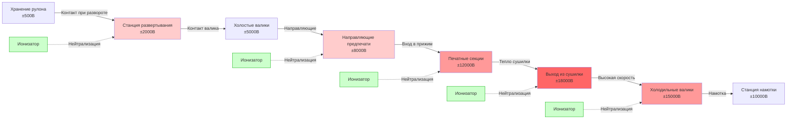

## Обзор

Обработка материалов генерирует большую часть статического электричества в печатном производстве через трибоэлектрическую зарядку при контакте и разделении несходных материалов. Бумага, пленка и фольговые основания накапливают поверхностную плотность заряда 10⁻⁹ до 10⁻⁶ кулонов/м² при движении над валиками, через прижимы и вдоль направляющих при скоростях от 0,5 до 10,2 м/с. Эффективный контроль статического электричества требует понимания механики контакта, зависящей от скорости частоты зарядки, выбора материалов на основе удельного сопротивления и скоординированных протоколов ESD по всему пути движения материала.

## Основы трибоэлектрической зарядки

### Физика электризации при контакте

При соприкосновении двух материалов и их разделении происходит передача электронов на основе их положения в трибоэлектрическом ряду, создавая дисбаланс поверхностного заряда.

**Генерация заряда на контактной границе:**

Объемная плотность заряда, генерируемая при циклах контакта-разделения, подчиняется формуле:

$$Q = A \cdot \sigma_{contact} \cdot N$$

Где:
- $Q$ = полный передаваемый заряд (кулоны)
- $A$ = площадь контакта (м²)
- $\sigma_{contact}$ = плотность заряда при контакте (Кл/м²)
- $N$ = количество циклов контакта-разделения

**Зависящая от материала плотность заряда:**

$$\sigma_{contact} = k_{mat} \cdot (W_1 - W_2) \cdot \frac{1}{\sqrt{\rho_s}}$$

Где:
- $k_{mat}$ = коэффициент контакта материала (10⁻⁹ до 10⁻⁷ Кл·Ω^{0.5}/м²·эВ)
- $W_1, W_2$ = работы выхода материалов (эВ)
- $\rho_s$ = удельное поверхностное сопротивление (Ω/квадрат)

Большая разность работ выхода и меньшее удельное поверхностное сопротивление увеличивают генерацию заряда.

### Накопление заряда в зависимости от скорости

Генерация статического электричества растет нелинейно со скоростью обработки материала из-за увеличенной частоты контакта и снижения времени рассеивания заряда между событиями.

**Частота зарядки в зависимости от скорости:**

$$\frac{dQ}{dt} = k_v \cdot v^{\alpha} \cdot L \cdot w$$

Где:
- $\frac{dQ}{dt}$ = частота накопления заряда (Кл/с)
- $k_v$ = коэффициент скорости (зависит от материала и поверхности)
- $v$ = скорость движения полотна или листа (м/с)
- $\alpha$ = показатель скорости (обычно 1,3–1,8)
- $L$ = длина контакта на валике (м)
- $w$ = ширина материала (м)

Для бумаги над стальными валиками: $\alpha \approx 1,5$
Для полиэстерной пленки над резиновыми валиками: $\alpha \approx 1,7$

**Практические эффекты скорости:**

| Скорость полотна | Относительная генерация заряда | Требования контроля статики |
|-----------------|-------------------------------|---------------------------|
| 0,5 м/с | 1,0× (базовая) | Контроля влажности достаточно |
| 1,5 м/с | 3,4× | Ионизация в критических точках |
| 2,5 м/с | 7,0× | Требуется непрерывная ионизация |
| 5,1 м/с | 17,5× | Многоточечная ионизация + заземление |
| 10,2 м/с | 52× | Агрессивная ионизация + проводящие валики |

### Постоянные времени рассеивания заряда

Статический заряд стекает через проводимость материала, ионизацию воздуха или заземленный контакт с частотой, определяемой удельным сопротивлением материала.

**Модель экспоненциального затухания:**

$$V(t) = V_0 \cdot e^{-t/\tau}$$

Где:
- $V(t)$ = напряжение в момент времени $t$ (вольты)
- $V_0$ = начальное напряжение (вольты)
- $\tau$ = постоянная времени (секунды)
- $\tau = \varepsilon_0 \cdot \varepsilon_r \cdot \rho_s$

Для типичных печатных основ:

$$\tau_{paper,50\%RH} = (8,85 \times 10^{-12}) \cdot (3,5) \cdot (10^9) \approx 0,31 \text{ сек}$$

$$\tau_{PET\,film} = (8,85 \times 10^{-12}) \cdot (3,2) \cdot (10^{14}) \approx 28 300 \text{ сек (7,9 ч)}$$

Эта драматическая разница объясняет, почему пленочные основы требуют агрессивной ионизации, а бумага хорошо реагирует на контроль влажности.

## Точки генерации статического электричества в пути движения материала

**Критические зоны накопления статического электричества:**

1. **Станция развертывания:** начальная зарядка из хранилища рулона и первого контакта с валиком
2. **Направляющие и холостые валики:** повторяющиеся события контакта-разделения накапливают заряд
3. **Вход в печатный блок:** максимальный заряд перед передачей чернил требует нейтрализации
4. **Выход из сушилки:** тепло снижает влажность, регенерирует заряд на высушенном основании
5. **Намотка/Доставка:** финальное накопление влияет на складирование и последующую обработку

## Выбор материала и контроль удельного сопротивления

### Противостатические обработки основ

Различные печатные основы требуют специфических обработок для управления удельным поверхностным сопротивлением и накоплением заряда.

| Тип материала | Удельное сопротивление без обработки | Метод обработки | Удельное сопротивление после обработки | Затухание заряда до 10% |
|---------------|---------------------------------------|-----------------|---------------------------------------|------------------------|
| Мелованная бумага | 10¹¹-10¹³ Ω/кв | Влажность (50% ОВ) | 10⁹-10¹⁰ Ω/кв | 1-10 секунд |
| Немелованная бумага | 10¹⁰-10¹² Ω/кв | Влажность (50% ОВ) | 10⁸-10⁹ Ω/кв | 0,5-2 секунды |
| Пленка ПЭТ | 10¹⁴-10¹⁶ Ω/кв | Коронная обработка | 10¹²-10¹³ Ω/кв | 30-300 секунд |
| Пленка БОПП | 10¹⁵-10¹⁷ Ω/кв | Противостатическое покрытие | 10⁹-10¹¹ Ω/кв | 1-10 секунд |
| Пленка ПЭ | 10¹⁶-10¹⁸ Ω/кв | Противостатическая присадка | 10¹⁰-10¹² Ω/кв | 5-50 секунд |
| Алюминиевая фольга | <10² Ω/кв | Не требуется | <10² Ω/кв | <0,01 секунды |
| Металлизированная пленка | 10⁴-10⁶ Ω/кв | Не требуется | 10⁴-10⁶ Ω/кв | <0,1 секунды |

### Технологии противостатической обработки

**1. Топические противостатические агенты:**

Гигроскопические химические вещества, наносимые на поверхность основы, притягивают атмосферную влагу, создавая проводящий слой:

$$\rho_{s,treated} = \rho_{s,base} \cdot e^{-k_{AS} \cdot C_{AS} \cdot RH}$$

Где:
- $\rho_{s,treated}$ = удельное поверхностное сопротивление после обработки (Ω/квадрат)
- $\rho_{s,base}$ = удельное сопротивление базового материала (Ω/квадрат)
- $k_{AS}$ = коэффициент эффективности противостатического агента
- $C_{AS}$ = концентрация агента (% по массе)
- $RH$ = относительная влажность (десятичная дробь)

Распространенные агенты:
- Четвертичные аммониевые соединения (наиболее эффективны, >90% снижения)
- Этоксилированные амины (среднее снижение, 70–85%)
- Глицериловые эфиры (мягкое снижение, 50–70%)

**2. Коронная поверхностная обработка:**

Высоковольтный коронный разряд окисляет поверхность полимера, создавая полярные группы, улучшающие проводимость:

- Уровень обработки: 38–44 дина/см для полиолефинов
- Поверхностное окисление повышает гигроскопичность
- Временный эффект: деградация за 3–6 месяцев
- Эффективна для пленок ПЭ, ПП, ПЭТ

**3. Противостатические присадки (внутренние):**

Проводящие частицы или ионные соединения, смешанные с полимером во время экструзии:

- Углеродная сажа: 10⁹-10¹¹ Ω/квадрат при загрузке 2–5%
- Проводящие полимеры: 10⁷-10⁹ Ω/квадрат при загрузке 5–10%
- Постоянное решение, но может повлиять на оптические свойства

## Конструкция валиков и выбор материала

### Требования к проводящим валикам

Валики, контактирующие с основой, должны обеспечивать путь рассеивания заряда на землю при сохранении технологических требований.

**Спецификации удельного поверхностного сопротивления валиков:**

$$R_{total} = R_{roller} + R_{bearing} + R_{ground} < 10^6 \text{ Ω}$$

Где:
- $R_{roller}$ = сопротивление поверхности-к-сердечнику (Ω)
- $R_{bearing}$ = сопротивление изоляции подшипника (Ω)
- $R_{ground}$ = сопротивление пути заземления (Ω)

**Сравнение материалов валиков:**

| Тип валика | Материал поверхности | Диапазон удельного сопротивления | Рассеивание заряда | Применение |
|-----------|---------------------|--------------------------------|------------------|-----------|
| Хромированная сталь | Твердый хром | 10²-10⁴ Ω/кв | Отличное | Приводные валики, печатные цилиндры |
| Проводящая резина | EPDM с углеродом | 10⁶-10⁸ Ω/кв | Хорошее | Прижимные валики, валики давления |
| Статико-рассеивающая | Проводящий полиуретан | 10⁸-10¹⁰ Ω/кв | Умеренное | Холостые валики, направляющие валики |
| Керамическое покрытие | Оксид алюминия | 10¹⁰-10¹² Ω/кв | Плохое | Только неконтактные приложения |
| Стандартная резина | Натуральная резина | >10¹⁴ Ω/кв | Отсутствует | Не подходит для контроля статики |

### Системы щеток заземления

Быстровращающиеся валики требуют непрерывного электрического пути на землю через узлы подшипников или установленные на валу щетки.

**Конструкция щетки из углеродного волокна:**

Сопротивление щетки должно оставаться ниже порога несмотря на вращение вала:

$$R_{brush} = \frac{\rho_{fiber} \cdot L_{fiber}}{A_{contact} \cdot N_{fibers}}$$

Где:
- $\rho_{fiber}$ = удельное сопротивление углеродного волокна (10⁴-10⁶ Ом·см)
- $L_{fiber}$ = длина волокна, контактирующего с валом (см)
- $A_{contact}$ = площадь контакта на волокно (см²)
- $N_{fibers}$ = количество волокон в щетке

Целевое значение: $R_{brush} < 10^4$ Ω при всех частотах вращения

**Требования к установке:**

- Расположить щетки с интервалом 180° вокруг вала
- Поддерживать сжатие волокна 0,5–2 мм для согласованного контакта
- Заменить при видимом износе или сопротивлении >10⁶ Ω
- Использовать держатель щетки из нержавеющей стали с заземлением через медный экранированный кабель #6 AWG

## Стратегии контроля скорости при обработке полотна

### Управление статическим электричеством в зависимости от скорости

Скорость обработки материала напрямую влияет на частоту генерации статического электричества и требует адаптивных стратегий управления.

**Критические пороги скорости:**

Для стандартной мелованной бумаги при 50% относительной влажности:

- **<1,5 м/с:** контроля влажности обычно достаточно
- **1,5–4,1 м/с:** ионизация требуется в критических точках (предпечать, после сушилки)
- **4,1–7,6 м/с:** непрерывная ионизация по всему пути полотна
- **>7,6 м/с:** многоблочная ионизация + проводящие валики + управление ускорением

**Протоколы ускорения/замедления:**

Генерация статического электричества растет при изменении скорости из-за проскальзывания валика:

$$Q_{slip} = k_{slip} \cdot \Delta v \cdot t_{accel} \cdot \mu \cdot F_N$$

Где:
- $Q_{slip}$ = заряд от проскальзывания (кулоны)
- $k_{slip}$ = коэффициент зарядки при проскальзывании
- $\Delta v$ = изменение скорости (м/с)
- $t_{accel}$ = время ускорения (с)
- $\mu$ = коэффициент трения
- $F_N$ = нормальная сила в прижиме (Н)

**Лучшие практики:**

1. Программировать постепенное ускорение: максимум 0,5–0,8 м/с в секунду
2. Увеличивать выходную мощность ионизации при изменении скорости
3. Контролировать натяжение для предотвращения проскальзывания на приводных валиках
4. Использовать плясающие валики для поддержания постоянного натяжения при изменении скорости

### Контроль натяжения и минимизация зарядки

Натяжение полотна влияет на давление контакта на валиках, напрямую влияя на частоту генерации заряда.

**Зарядка в зависимости от натяжения:**

$$\sigma_{tension} = k_t \cdot \sqrt{\frac{T}{w}}$$

Где:
- $\sigma_{tension}$ = плотность заряда от натяжения (Кл/м²)
- $k_t$ = коэффициент натяжения (зависит от материала)
- $T$ = натяжение полотна (Н)
- $w$ = ширина полотна (м)

**Оптимальные диапазоны натяжения:**

| Тип материала | Минимальное натяжение | Оптимальное натяжение | Максимальное натяжение | Влияние на статику |
|---------------|---------------------|----------------------|----------------------|------------------|
| Тонкая бумага (<60 г/м²) | 2 PLI | 3–4 PLI | 6 PLI | Умеренное при оптимуме |
| Мелованная бумага (80–150 г/м²) | 3 PLI | 5–7 PLI | 10 PLI | Низкое при оптимуме |
| Легкая пленка (<50 мкм) | 1 PLI | 2–3 PLI | 5 PLI | Высокое (требуется ионизация) |
| Тяжелая пленка (>100 мкм) | 3 PLI | 5–8 PLI | 12 PLI | Очень высокое (агрессивная ионизация) |

*PLI = Фунты на линейный дюйм ширины*

**Мониторинг натяжения:**

- Датчики нагрузки на плясающих валиках обеспечивают обратную связь в реальном времени
- Поддерживать натяжение в пределах ±10% от уставки
- Автоматическая компенсация при изменении диаметра на развороте/намотке
- Зональное управление натяжением для широких полотен (>1,5 м)

## Протоколы ESD для обработки полотна

### Предотвращение электростатического разряда

Операции обработки полотна должны реализовать комплексные протоколы ESD для предотвращения повреждения статико-чувствительных материалов и оборудования.

**Требования защищенной от ESD зоны (EPA):**

Согласно ANSI/ESD S20.20, адаптированному для печатных сред:

1. **Полы:** удельное поверхностное сопротивление 1×10⁶ до 1×10⁹ Ω/квадрат
2. **Рабочие поверхности:** сопротивление земле <1×10⁹ Ω
3. **Заземление персонала:** браслеты с сопротивлением 1 МОм ±10%
4. **Упаковка:** мешки, экранирующие статику, для электронных компонентов рядом с элементами управления прессом
5. **Обозначение:** четкое обозначение границ EPA и протоколов

**Тестирование проверки заземления:**

$$R_{system} = R_{operator} + R_{wrist\,strap} + R_{surface} + R_{ground} < 3,5 \times 10^7 \text{ Ω}$$

Проверять ежедневно с помощью откалиброванного тестера браслета.

### Точки передачи материала

Электростатический разряд происходит наиболее часто при передаче материала между этапами процесса.

**Контроль статики в зоне передачи:**

1. **Передача листа к листу (листовая печать):**
   - Ионизирующая планка на 15–20 см выше точки передачи
   - Заземленные чашечки вакуумного вспомогательного захвата (при наличии)
   - Напыление противостатического порошка (карбонат кальция) на стопку доставки

2. **Сращивание рулонов:**
   - Нейтрализовать оба конца полотна перед сращиванием
   - Использовать проводящую клейкую ленту сращивания (10⁴-10⁶ Ω/квадрат)
   - Заземлить стол сращивания и режущий нож

3. **Разрезание полотна на листы:**
   - Ионизировать непосредственно до и после ножа шредера
   - Заземлить ротационный нож и валик наковальни
   - Исключение статики на конвейере доставки

## Практические рекомендации по внедрению

### Спецификации оборудования для обработки материалов

**Требования к станции развертывания/намотки:**

- Все металлические компоненты соединены и заземлены: <10 Ω на полное заземление объекта
- Проводящие расширяющиеся валы: поддерживать <10⁴ Ω через полный диапазон диаметра
- Щетки заземления вала с обеих сторон рулона
- Ионизирующая планка расположена на 15–30 см перед первым контактом полотна

**Конструкция системы валиков:**

- Максимальное расстояние между заземленными контактными валиками: 1,8 м
- Ионизация на середине, если расстояние превышает 1,2 м
- Твердость проводящей резины: 40–60 единиц Shore A для большинства приложений
- Заменить валики при удельном поверхностном сопротивлении >10¹⁰ Ω/квадрат

**Конфигурации направляющих и воздушных поворотов:**

- Предпочитать заземленные контактные валики воздушным поворотам для контроля статики
- При необходимости воздушных поворотов установить ионизацию непосредственно после
- Зазор неконтактной направляющей: 7,6–15 мм для минимизации электростатического притяжения
- Заземлить все металлические направляющие даже при неконтактном использовании

### Протоколы обслуживания и проверки

**Ежемесячная проверка:**

1. Измерить удельное поверхностное сопротивление валика с помощью мегометра при 100 В постоянного тока
2. Проверить непрерывность заземления: <10 Ω от поверхности валика на землю
3. Испытать выходную мощность ионизатора и баланс с помощью монитора заряженной пластины
4. Проверить сопротивление контакта щетки на вращающихся валах

**Ежеквартальный осмотр:**

1. Осмотреть поверхности проводящих валиков на загрязнение или остекление
2. Очистить валики изопропиловым спиртом и безворсовой тканью
3. Заменить щетки заземления с видимым износом или сопротивлением >10⁶ Ω
4. Проверить удельное поверхностное сопротивление полов в зонах EPA

**Годовая калибровка:**

- Калибровать все приборы для измерения статического электричества
- Задокументировать базовые показатели для отслеживания трендов
- Обновить план контроля статического электричества на основе изменений процесса
- Обучить персонал протоколам ESD и эксплуатации оборудования

## Устранение неполадок при обработке материалов со статическим электричеством

| Симптом | Измерение | Коренная причина | Корректирующее действие |
|--------|-----------|-----------------|----------------------|
| Листы прилипают друг к другу | >5 кВ на краях листа | Низкая влажность (<35% ОВ) | Увеличить ОВ до 45–55%, проверить работу увлажнителя |
| Полотно прилипает к валикам | >8 кВ на выходе прижима | Изоляция валика, плохое заземление | Проверить сопротивление валика, проверить непрерывность заземления |
| Увеличенные разрывы полотна | >15 кВ на полотне | Чрезмерная скорость + низкая ионизация | Снизить скорость или добавить ионизирующие планки |
| Притяжение пыли | >4 кВ в зоне печати | Недостаточная ионизация предпечати | Добавить ионизатор перед первой печатной секцией |
| Поражение персонала | Пол >10⁹ Ω/кв | Отказ напольного покрытия | Проверить сопротивление пола, нанести топическую обработку |
| Регенерация заряда | Быстрая перезарядка после ионизации | Материал слишком изоляционный | Переключиться на обработанную основу или увеличить ионизацию |

**Методы измерения статического электричества:**

- **Бесконтактный вольтметр:** расположить на 5–10 см от поверхности полотна, измерить напряжение
- **Монитор заряженной пластины:** тестирование времени затухания согласно ESD STM11.31
- **Измеритель удельного поверхностного сопротивления:** двухточечный или концентрический зонд при 100 В постоянного тока
- **Измеритель баланса ионов:** проверить двуполярный выход ионов ±10 В максимальное смещение

---

**Ключевые принципы обработки материалов:**

1. Генерация статического электричества растет со скоростью в степени 1,3–1,8
2. Бумага реагирует на влажность; пленка требует ионизации независимо от относительной влажности
3. Все валики в контакте с основой должны обеспечивать путь на землю <10⁶ Ω
4. Заряд накапливается в каждой точке контакта, требуя систематической нейтрализации
5. Протоколы ESD защищают как качество продукции, так и системы управления электроникой

**Стандарты и ссылки:**
- ANSI/ESD S20.20: защита электрических и электронных изделий, узлов и оборудования
- TAPPI TIP 0404-62: электростатические проблемы при обработке и преобразовании полотна
- NFPA 77: рекомендуемая практика по статическому электричеству (издание 2019 г.)
- ESD STM11.31: оценка производительности экранирующих от электростатического разряда мешков
- технические доклады Центра исследований обработки полотна (WHRC) по контролю статического электричества
