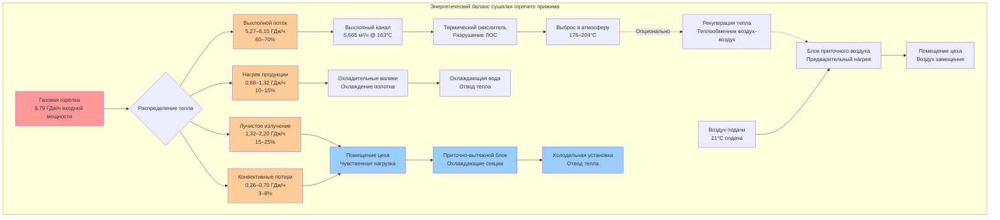

Сушилки веб-печатных машин представляют доминирующую тепловую нагрузку в высокоскоростных печатных производствах, вводя 4,4–11,8 ГДж/ч на одну установку в производственное помещение. Понимание термодинамики генерации тепла, его передачи и удаления является необходимым условием для правильного проектирования систем HVAC, которое обеспечивает поддержание производственных условий при гарантировании безопасности и энергоэффективности.

## Основы тепловой нагрузки сушилок

Полное тепло, выделяемое веб-сушилкой, распределяется через несколько каналов в соответствии с фундаментальными принципами передачи тепла. Для газовой сушилки горячего прижима энергетический баланс имеет вид:

$$
Q_{input} = Q_{product} + Q_{exhaust} + Q_{radiation} + Q_{convection} + Q_{losses}
$$

где каждый член представляет отдельные механизмы передачи тепла, требующие специфических ответных мер при проектировании систем вентиляции.

**Распределение тепловой энергии:**

Типичное распределение тепловой энергии для сушилки горячего прижима, работающей в установившемся режиме:

$$
\begin{aligned}
Q_{exhaust} &= 0,60 \text{ до } 0,70 \times Q_{input} \\
Q_{radiation} &= 0,15 \text{ до } 0,25 \times Q_{input} \\
Q_{product} &= 0,10 \text{ до } 0,15 \times Q_{input} \\
Q_{convection+losses} &= 0,03 \text{ до } 0,08 \times Q_{input}
\end{aligned}
$$

Лучистые и конвективные компоненты напрямую влияют на охлаждающую нагрузку в производственном цехе, тогда как тепло выхлопа требует подачи воздуха с кондиционированием для его компенсации.

## Тепловой анализ сушилок горячего прижима

Сушилки горячего прижима отверждают чернила на основе нефтепродуктов путем принудительного конвективного нагрева при температуре 200–260°C. Процесс горения преобразует природный газ или пропан в тепловую энергию, распределяемую по всей камере сушилки.

**Расчет тепловой мощности горелки:**

Для веб-сушилки требуемая мощность горелки зависит от ширины полотна, скорости хода, плотности печати и тепловых свойств подложки:

$$
Q_{burner} = \frac{\dot{m}_{web} \cdot c_{p,web} \cdot \Delta T_{web}}{\eta_{thermal}} + Q_{solvent,evap} + Q_{losses}
$$

где:
- $\dot{m}_{web}$ = массовый расход полотна (кг/ч) = $w_{web} \times v_{web} \times \rho_{web}$
- $c_{p,web}$ = удельная теплоемкость подложки (1,26–1,68 кДж/кг·°C для бумаги)
- $\Delta T_{web}$ = повышение температуры подложки (83–111°C типичное)
- $\eta_{thermal}$ = коэффициент теплового КПД сушилки (0,65–0,75)
- $Q_{solvent,evap}$ = теплота парообразования растворителей (698–1164 кДж/кг растворителя)
- $Q_{losses}$ = потери корпуса сушилки (5–10% входной мощности)

**Пример расчета:**

Для полотна шириной 1,78 м, бегущего со скоростью 457 м/мин с бумагой плотностью 30 г/м²:

$$
\begin{aligned}
\dot{m}_{web} &= \frac{1,78 \text{ м} \times 457 \text{ м/мин} \times 30 \text{ г/м}^2}{1 \text{ мин}} \times 60 \text{ мин/ч} / 1000 \\
&= 4,596 \text{ кг/ч}
\end{aligned}
$$

$$
\begin{aligned}
Q_{web} &= 4,596 \times 1,47 \times 100 / 0,70 \\
&= 966,876 \text{ кДж/ч}
\end{aligned}
$$

Добавление тепла парообразования растворителя (при условии 2% плотности печати с 60% содержанием растворителя):

$$
\begin{aligned}
Q_{solvent} &= 4,596 \times 0,02 \times 0,60 \times 930 \\
&= 513,500 \text{ кДж/ч}
\end{aligned}
$$

$$
Q_{burner,required} = 966,876 + 513,500 + 438,900 = 1,919,276 \text{ кДж/ч} \approx 1,92 \text{ ГДж/ч}
$$

Это соответствует типичным номинальным мощностям горелок 4,4–5,9 ГДж/ч для веб-печатных машин средней ширины.

## Тепловая нагрузка выхлопа сушилки

Выхлопной поток переносит большую часть входной энергии из сушилки, что требует значительной подачи воздуха для замены удаленной массы.

**Содержание энергии выхлопа:**

$$
Q_{exhaust} = \dot{m}_{exhaust} \cdot c_{p,mix} \cdot (T_{exhaust} - T_{ambient})
$$

Преобразование в объемный расход:

$$
Q_{exhaust} = \frac{CFM_{exhaust} \times 60 \times \rho_{exhaust} \times c_{p,mix} \times \Delta T}{1000 \times 1,055}
$$

где плотность при температуре выхлопа следует из уравнения идеального газа:

$$
\rho_{exhaust} = \frac{\rho_{standard} \times T_{standard}}{T_{exhaust}} = \frac{1,2 \text{ кг/м}^3 \times 288 \text{ K}}{T_{exhaust}(\text{K})}
$$

**Пример расчета:**

Для выхлопного потока 5,665 м³/ч (10,000 CFM) при 163°C (436 K):

$$
\begin{aligned}
\rho_{exhaust} &= \frac{1,2 \times 288}{436} = 0,792 \text{ кг/м}^3 \\
Q_{exhaust} &= \frac{5,665 \times 0,792 \times 1,005 \times (163-21)}{1} \\
&= 5,413 \text{ ГДж/ч} \approx 5,41 \text{ ГДж/ч}
\end{aligned}
$$

Это представляет примерно 60–65% входной мощности горелки 8,79 ГДж/ч, что соответствует типичному тепловому балансу.

## Лучистая теплопередача

Температуры корпуса сушилки 82–121°C производят значительную лучистую теплопередачу в окружающее производственное помещение. Этот компонент напрямую влияет на размеры системы охлаждения.

**Лучистая теплопередача:**

Из закона Стефана–Больцмана для серого тела при лучистом обмене между параллельными поверхностями:

$$
Q_{radiation} = \epsilon \cdot \sigma \cdot A_{surface} \cdot (T_{surface}^4 - T_{ambient}^4)
$$

где:
- $\epsilon$ = коэффициент излучения (0,85–0,95 для окрашенной стали)
- $\sigma$ = постоянная Стефана–Больцмана = $5,670 \times 10^{-8}$ Вт/м²·K⁴
- $A_{surface}$ = внешняя площадь поверхности сушилки (м²)
- Температуры в абсолютной шкале (K = °C + 273)

Для типичной геометрии сушилки с внешней поверхностью 27,9 м² при средней температуре 104°C:

$$
\begin{aligned}
Q_{radiation} &= 0,90 \times 5,670 \times 10^{-8} \times 27,9 \times (377^4 - 294^4) \\
&= 0,90 \times 5,670 \times 10^{-8} \times 27,9 \times 3,619 \times 10^9 \\
&= 51,400 \text{ кДж/ч}
\end{aligned}
$$

В сочетании с естественной конвекцией от горячих поверхностей (примерно 40% лучистого тепла), полная чувственная нагрузка на помещение:

$$
Q_{space,dryer} = Q_{radiation} + Q_{convection} = 51,400 + 20,560 = 71,960 \text{ кДж/ч}
$$

Несколько линий печатных машин увеличивают эту нагрузку пропорционально.

## Сравнение технологий сушилок

Различные технологии сушилок имеют отличающиеся тепловые характеристики, влияющие на проектирование систем вентиляции:

| Тип сушилки | Рабочая температура | Входное тепло | Объем выхлопа | Лучистое излучение | Чувственная нагрузка на помещение |
|------------|----------------------|-----|-------|------|-----|
| Горячего прижима, газ | 200–260°C | 4,4–11,8 ГДж/ч | 4,720–8,505 м³/ч | 584–1023 кДж/ч | 438–876 кДж/ч |
| Горячего прижима, электро | 200–260°C | 129–343 кВт | 4,720–8,505 м³/ч | 438–731 кДж/ч | 351–731 кДж/ч |
| УФ ртутная лампа | 38–66°C | 44–117 кВт | 566–1,699 м³/ч | 233–438 кДж/ч | 146–351 кДж/ч |
| УФ LED | 27–43°C | 15–44 кВт | 283–1,133 м³/ч | 88–204 кДж/ч | 58–175 кДж/ч |
| Инфракрасная | 149–316°C | 15–44 кВт/зона | 1,133–2,832 м³/ч | 292–584 кДж/ч | 233–526 кДж/ч |
| Пучок электронов | 38–49°C | 15–58 кВт | 566–1,416 м³/ч | 117–233 кДж/ч | 88–204 кДж/ч |

Таблица показывает, что сушилки горячего прижима создают наиболее суровые требования для систем HVAC, в то время как технология УФ LED минимизирует тепловые нагрузки в ущерб специфическим требованиям к химии чернил.

## Тепловые соображения при УФ-сушке

Системы УФ-отверждения генерируют значительно меньше тепла, чем термические сушилки, но все еще требуют охлаждения для предотвращения перегрева ламп и поддержания контроля температуры подложки.

**Лампы УФ ртутного излучения:**

Среднедавленные ртутные лампы преобразуют 15–25% входной мощности в УФ-излучение, с 65–75% становящимся отходящим теплом:

$$
Q_{UV,waste} = P_{lamp} \times (1 - \eta_{UV}) = P_{lamp} \times 0,70
$$

Для полотна шириной 1,016 м с мощностью лампы 88 Вт/см:

$$
Q_{UV,waste} = 101,6 \times 88 \times 0,70 = 6,260 \text{ кВт} = 22,536 \text{ кДж/ч}
$$

Охлаждение лампы обычно использует принудительный воздух со скоростью 566–1,133 м³/ч на лампу, с повышением температуры воздуха:

$$
\Delta T = \frac{Q_{waste}}{{\dot{V}} \times \rho \times c_p} = \frac{6,260}{0,426 \times 1,2 \times 1,005} = 12,2°C
$$

**Системы УФ LED:**

Массивы УФ LED работают при более низких температурах с коэффициентом преобразования электрической энергии в УФ-излучение 40–50%:

$$
Q_{LED,waste} = P_{LED} \times 0,55
$$

Для эквивалентной энергии отверждения с эффективностью 45%:

$$
P_{LED} = \frac{101,6 \times 88 \times 0,20}{0,45} = 3,960 \text{ кВт}
$$

$$
Q_{LED,waste} = 3,960 \times 0,55 = 2,178 \text{ кВт} = 7,841 \text{ кДж/ч}
$$

Это представляет примерно 65% снижение отходящего тепла в сравнении с системами ртутного излучения.

## Проектирование систем выхлопа сушилок

Правильный размер системы выхлопа должен учитывать как объемный расход, так и эффекты теплового расширения.

**Расчет объема выхлопа:**

Требуемый расход выхлопного воздуха зависит от требований безопасного разбавления и емкости удаления тепла:

$$
CFM_{exhaust} = \max\left(\frac{Q_{removal}}{\rho \cdot c_p \cdot \Delta T \cdot 60}, \, CFM_{minimum,code}\right)
$$

NFPA 86 предписывает минимум 7,080 м³/ч на секцию сушилки независимо от расчетных потребностей удаления тепла, устанавливая нижнюю границу для проектирования системы.

**Коэффициент теплового расширения:**

Горячий выхлопной воздух занимает больший объем, чем холодный воздух подачи, влияя на баланс давления:

$$
\frac{V_{exhaust}}{V_{makeup}} = \frac{T_{exhaust}}{T_{makeup}}
$$

Для выхлопа 5,665 м³/ч при 163°C и воздуха подачи при 21°C:

$$
V_{makeup,equivalent} = 5,665 \times \frac{294}{436} = 3,819 \text{ м}^3/\text{ч}
$$

Это различие 1,846 м³/ч (32,6%) должно учитываться в расчетах избыточного давления в здании. Фактический требуемый объем воздуха подачи при 21°C меньше объема выхлопа из-за теплового расширения.

## Возможности рекуперации тепла

Несмотря на опасения загрязнения, рекуперация тепла выхлопа может улучшить энергоэффективность при экономическом обосновании.

**Пластинчатый теплообменник воздух-воздух:**

Эффективность рекуперации чувственного тепла:

$$
\varepsilon = \frac{T_{makeup,outlet} - T_{makeup,inlet}}{T_{exhaust,inlet} - T_{makeup,inlet}}
$$

Для эффективности 50% с выхлопом 163°C и воздухом подачи 4°C:

$$
T_{makeup,outlet} = 4 + 0,50 \times (163 - 4) = 83,5°C
$$

Рекуперированное тепло:

$$
Q_{recovered} = \dot{m}_{makeup} \cdot c_p \cdot (T_{outlet} - T_{inlet})
$$

$$
Q_{recovered} = \frac{5,665 \times 1,2 \times 1,005 \times (83,5 - 4)}{1} = 536,040 \text{ кДж/ч}
$$

При эффективности нагревателя воздуха подачи 82%, экономия топлива:

$$
Q_{fuel,saved} = \frac{536,040}{0,82} = 653,463 \text{ кДж/ч}
$$

Годовая экономия при стоимости 0,40 дол./МДж и 6,000 часов работы:

$$
\text{Экономия} = \frac{653,463 \times 6,000}{1,055,000} \times 0,40 = 1,486 \text{ дол. в год}
$$

Стоимость капитала теплообменника 350,000–470,000 дол. дает простой период окупаемости 235–316 лет.

## Диаграмма стратегии удаления тепла

Следующая диаграмма иллюстрирует пути потока тепла от веб-сушилок печатных машин:

## Рекомендации по проектированию

На основе принципов термодинамики и практического опыта управление тепловыми нагрузками сушилок требует:

**1. Размер системы выхлопа:**
- Проектировать на 1,5× расчетную емкость удаления тепла для компенсации производственных колебаний
- Поддерживать отрицательное давление (–3,7–6,0 Па) в камере сушилки
- Указывать конструкцию высокотемпературного исполнения (нержавеющая сталь 18 мм³/мин, штампованный стан) для непрерывной работы при 204°C
- Включить компенсаторы теплового расширения каждые 12 м длины канала

**2. Интеграция приточного воздуха:**
- Учитывать коэффициент теплового расширения в объемном балансе (обычно 25–35% снижение)
- Предусмотреть независимые зоны приточного воздуха для каждой печатной машины для возможности избирательной работы
- Проектировать подачу воздуха для предотвращения сквозняков на пути полотна (максимум 0,254 м/с в месте печатной машины)
- Включить фильтрацию HEPA (эффективность 95%) для предотвращения загрязнения аэрозолями

**3. Проектирование охлаждения помещения:**
- Расчет лучистых тепловых нагрузок с использованием фактических температур поверхности сушилки, измеренных во время работы
- Проектирование распределения воздуха для захвата тепловых потоков, поднимающихся от сборок сушилок
- Указать низкоскоростную вентиляцию перемещения (0,15–0,20 м/с) для поддержания стратификации температуры
- Предусмотреть резерв охлаждающей способности 20–25% для летних пиковых условий

**4. Оценка рекуперации тепла:**
- Обосновывать теплообменники, когда годовая экономия топлива превышает 20% от стоимости капитала
- Указывать байпас для техническими и загрязнением событиями
- Проектировать для загрязнения парами растворителя с доступом периодической очистки
- Контролировать деградацию производительности теплопередачи с течением времени

**5. Интеграция систем управления:**
- Блокировать вентиляторы выхлопа с работой горелки согласно требованиям NFPA 86
- Модулировать температуру приточного воздуха для поддержания условий в помещении ±1,1°C
- Отслеживать температуру выхлопа сушилки как индикатор эффективности горелки и потребностей в техническом обслуживании
- Сигнализировать об отклонении расхода выхлопа >15% от уставки

Фундаментальная задача при проектировании систем HVAC для сушилок веб-печатных машин заключается в управлении массивными количествами тепла при поддержании точного контроля окружающей среды, обеспечении безопасности рабочих и достижении приемлемой энергоэффективности. Успех требует строгого применения принципов передачи тепла, глубокого понимания требований технологического процесса и тщательной интеграции всех компонентов системы в единое проектное решение, которое сбалансирует конкурирующие технические и экономические цели.

Надлежащий анализ тепловой нагрузки сушилок устанавливает основу для определения размера приточного воздуха, емкости охлаждения помещения и оценки энергетической рекуперации. Инженерный подход должен признавать, что тепловыделение сушилок варьируется с параметрами производства, требуя гибкого проектирования системы, которая работает надежно во всем диапазоне эксплуатации при одновременном соблюдении кодексов и обеспечении операционной безопасности.
