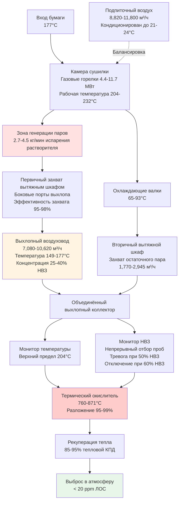

Контроль паров растворителя представляет наиболее критическую проблему безопасности и охраны окружающей среды при операциях печати ротационного печатного станка с горячей сушкой. Краски для горячей сушки содержат 50-75% нефтяных растворителей, которые испаряются во время процесса сушки при температурах 177-232°C, создавая потоки паров высокой концентрации, требующие немедленного захвата, разбавления и обработки. Надлежащее проектирование системы контроля предотвращает опасное накопление паров при обеспечении соответствия пределам воздействия OSHA и нормативным требованиям качества воздуха.

## Физические основы испарения растворителя

### Равновесие пара и жидкости

Испарение растворителя из красок для горячей сушки следует закону Рауля для идеальных растворов:

$$P_{solvent} = x_{solvent} \times P^{sat}_{solvent}(T)$$

Где:
- $P_{solvent}$ = Парциальное давление пара растворителя (кПа)
- $x_{solvent}$ = Мольная доля растворителя в жидкой краске
- $P^{sat}_{solvent}(T)$ = Давление насыщенного пара при температуре $T$

Давление пара увеличивается экспоненциально с температурой согласно уравнению Клаузиуса-Клапейрона:

$$\ln\left(\frac{P_2}{P_1}\right) = \frac{\Delta H_{vap}}{R}\left(\frac{1}{T_1} - \frac{1}{T_2}\right)$$

Где:
- $\Delta H_{vap}$ = Теплота испарения (кДж/моль)
- $R$ = Универсальная газовая постоянная = 8.314 Дж/(моль·K)
- $T_1, T_2$ = Абсолютные температуры (K)

**Данные давления паров обычных растворителей для горячей сушки:**

| Растворитель | Химическая формула | МВ | Давление пара при 25°C (кПа) | Давление пара при 204°C (кПа) | Температура кипения (°C) |
|---------|------------------|-----|-------------------------------|--------------------------------|-------------------|
| Толуол | C₇H₈ | 92 | 2.5 | 56.5 | 111 |
| Ксилол | C₈H₁₀ | 106 | 0.9 | 44.1 | 138 |
| н-Гептан | C₇H₁₆ | 100 | 4.1 | 77.9 | 98 |
| Минеральные масла | C₉-C₁₂ смесь | ~140 | 0.14 | 14.5 | 149-204 |

При типичных температурах сушилки (177-232°C), давления паров приближаются или превышают атмосферное давление, обеспечивая быстрое полное испарение при прохождении пленки краски через зону сушилки.

### Расчет скорости испарения

Массоперенос из пленки краски в поток воздуха сушилки следует:

$$\dot{m}_{evap} = h_m \times A_{web} \times \rho_{film} \times (C_{sat} - C_{bulk})$$

Где:
- $\dot{m}_{evap}$ = Скорость испарения (кг/мин)
- $h_m$ = Коэффициент массопередачи (м/мин)
- $A_{web}$ = Площадь поверхности бумаги в сушилке (м²)
- $C_{sat}$ = Концентрация насыщения на поверхности пленки (кг/м³)
- $C_{bulk}$ = Объемная концентрация в воздухе (кг/м³)

Коэффициент массопередачи зависит от скорости воздуха и турбулентности:

$$h_m = 0.023 \times \frac{v^{0.8}}{L^{0.2}} \times Sc^{-0.33}$$

Где:
- $v$ = Скорость воздуха над поверхностью бумаги (м/мин), типично 122-244 м/мин
- $L$ = Характеристическая длина (м)
- $Sc$ = Число Шмидта ≈ 2.0 для паров в воздухе

**Практический подход к расчету:**

Для производства печати способом ротационной глубокой печати или флексографии:

$$G = W_{web} \times V_{web} \times C_{ink} \times f_{solvent} \times \eta_{evap}$$

Где:
- $G$ = Скорость испарения растворителя (кг/мин)
- $W_{web}$ = Ширина бумаги (м)
- $V_{web}$ = Скорость бумаги (м/мин)
- $C_{ink}$ = Вес покрытия краски (кг/м²), типично 0.0024-0.0058 кг/м²
- $f_{solvent}$ = Доля растворителя в массе влажной краски, типично 0.50-0.75
- $\eta_{evap}$ = Эффективность испарения сушилки, типично 0.95-0.99

**Пример: издательская печать способом ротационной глубокой печати**

- Ширина бумаги: 78 дюймов = 2.0 м
- Скорость бумаги: 2,000 футов/мин = 610 м/мин
- Покрытие краски: 0.0008 фунт/фут² = 0.0039 кг/м²
- Содержание растворителя: 65%
- Эффективность испарения: 98%

$$G = 2.0 \times 610 \times 0.0039 \times 0.65 \times 0.98 = 3.0 \text{ кг/мин}$$

Это представляет приблизительно 182 кг/ч выбросов растворителя на один печатный станок, требующих захвата и контроля.

## Критерии проектирования предела нижнего взрывчатого предела

### Физика НВЗ и пожарный треугольник

Воспламенение паров горючего требует три элемента:
1. **Топливо** - Пар растворителя в пределах горючего диапазона
2. **Окислитель** - Атмосферный кислород (минимум 16% для распространения)
3. **Источник зажигания** - Энергия, превышающая минимальную энергию зажигания

Смеси пара и воздуха воспламеняются только когда концентрация находится между НВЗ и ВВЗ (Верхний взрывчатый предел). Горючий диапазон представляет граничные условия стехиометрического сгорания.

**Стехиометрическое сгорание для типичного углеводорода:**

$$C_xH_y + \left(x + \frac{y}{4}\right)O_2 \rightarrow xCO_2 + \frac{y}{2}H_2O$$

Для толуола (C₇H₈):

$$C_7H_8 + 9O_2 \rightarrow 7CO_2 + 4H_2O$$

Стехиометрическая концентрация в воздухе (21% O₂):

$$C_{stoich} = \frac{1}{1 + 9/0.21} = 2.3\% \text{ по объему}$$

НВЗ возникает ниже стехиометрической точки, где недостаточно топлива для распространения пламени. ВВЗ возникает выше, где недостаточно кислорода.

**Данные воспламеняемости растворителей для горячей сушки:**

| Растворитель | НВЗ (% об) | НВЗ (ppm) | ВВЗ (% об) | Точка вспышки (°C) | Температура самовоспламенения (°C) | Минимальная энергия зажигания (мДж) |
|---------|-------------|-----------|-------------|-------------------|--------------------------|--------------------------|
| Толуол | 1.2 | 12,000 | 7.1 | 4 | 480 | 0.24 |
| Ксилол | 1.0 | 10,000 | 7.0 | 17 | 464 | 0.20 |
| н-Гептан | 1.05 | 10,500 | 6.7 | -4 | 215 | 0.24 |
| Минеральные масла | 0.9 | 9,000 | 6.0 | 38-60 | 245 | 0.80 |
| МЕК | 1.4 | 14,000 | 11.4 | -9 | 404 | 0.27 |

Критическое наблюдение: более низкие значения НВЗ (минеральные масла 0.9%, гептан 1.05%) требуют большего разбавления вентиляцией для эквивалентного запаса безопасности.

### Расчеты НВЗ смешанных растворителей

Для систем смешанных растворителей рассчитайте составной НВЗ, используя принцип Ле Шателье:

$$\frac{1}{LEL_{mix}} = \sum_{i=1}^{n} \frac{f_i}{LEL_i}$$

Где:
- $LEL_{mix}$ = Составной нижний взрывчатый предел
- $f_i$ = Объемная доля компонента $i$ в паровой фазе
- $LEL_i$ = Нижний взрывчатый предел компонента $i$

**Пример: краска для горячей сушки со смешанными растворителями**

Состав пара (по объему):
- 60% толуол (НВЗ = 1.2%)
- 30% ксилол (НВЗ = 1.0%)
- 10% минеральные масла (НВЗ = 0.9%)

$$\frac{1}{LEL_{mix}} = \frac{0.60}{1.2} + \frac{0.30}{1.0} + \frac{0.10}{0.9}$$

$$\frac{1}{LEL_{mix}} = 0.50 + 0.30 + 0.11 = 0.91$$

$$LEL_{mix} = 1.10\% = 11,000 \text{ ppm}$$

Проектируйте в соответствии с наиболее консервативным (самым низким) компонентом НВЗ для обеспечения безопасности во всех условиях эксплуатации.

### Требования коэффициента безопасности

OSHA 29 CFR 1910.106(e)(2)(iii) требует:

> "Вентиляция должна быть обеспечена для предотвращения накопления горючих паров. Концентрация горючих паров не должна превышать 25 процентов нижнего взрывчатого предела."

Это устанавливает минимальный коэффициент безопасности 4.

NFPA 86 раздел 5.7.2 для печей и сушилок подтверждает:

> "Достаточная циркуляция воздуха должна быть обеспечена внутри печи для предотвращения образования горючих концентраций, превышающих 25% НВЗ."

**Рекомендуемые критерии проектирования:**

$$C_{design} = \frac{LEL}{SF}$$

Где коэффициент безопасности $SF$ зависит от оценки опасности:

| Применение | Коэффициент безопасности | Проектная концентрация | Обоснование |
|-------------|--------------|---------------------|-----------|
| Минимальное соответствие кодексу | 4 | 25% НВЗ | Минимум OSHA/NFPA |
| Стандартный выхлоп сушилки | 6-8 | 12.5-17% НВЗ | Точность датчика, вариация смешивания |
| Высокоопасные зоны | 10 | 10% НВЗ | Присутствуют множественные источники зажигания |
| Критические приложения безопасности | 20 | 5% НВЗ | Существенные операции, высокая занятость |

Для типичной сушилки с ротационным печатным станком с краской на основе толуола (НВЗ = 12,000 ppm), применить SF = 8:

$$C_{design} = \frac{12,000}{8} = 1,500 \text{ ppm}$$

Это обеспечивает рабочий запас, позволяющий концентрации удвоиться во время аварийных условий, оставаясь ниже предела 25% НВЗ при нормативном требовании.

## Проектирование первичной системы захвата

### Конфигурация выхлопа вытяжного шкафа сушилки

Сушилки с горячей сушкой требуют специализированные выхлопные вытяжные шкафы, захватывающие пары прямо у источника испарения. Проектирование вытяжного шкафа следует принципам локальной вытяжной вентиляции с полным ограждением, предпочтительным для максимальной эффективности захвата.

**Расчет расхода вытяжного шкафа:**

Требуемый объем выхлопа на основе предела концентрации пара:

$$Q_{exhaust} = \frac{G \times 387 \times T}{MW \times C_{target} \times 10^{-6}}$$

Для толуола (МВ = 92 г/моль) при 300 К (27°C температура выхлопа после охлаждения):

$$Q_{exhaust} = \frac{3.0 \times 387 \times 300}{92 \times 30,000 \times 10^{-6}} = 5,800 \text{ м³/ч} \approx 3,400 \text{ CFM}$$

Где:
- $G$ = 3.0 кг/мин испарения растворителя
- Целевая концентрация = 30,000 ppm (30% НВЗ, позволяющий запас ниже предела проектирования 40% НВЗ)
- 387 = Константа стандартного молярного объема (м³/кмоль при 0°C)

**Минимальные требования NFPA 86:**

Раздел 5.7.1.3 определяет минимум 3,767 м³/ч выхлопа на секцию сушилки независимо от расчётного требования. Для многосекционных сушилок каждая секция требует специализированный минимальный расход воздуха.

Фактическое проектирование: 7,080 м³/ч для обеспечения:
- Разбавления пара ниже 30% НВЗ
- Адекватной скорости захвата на лицах вытяжного шкафа (30-46 м/мин)
- Достаточной тепловой конвекции для предотвращения обратного потока
- Соответствия минимумам NFPA 86

### Факторы эффективности захвата

Эффективность захвата первичного вытяжного шкафа зависит от:

**Геометрия вытяжного шкафа:**
- Полное ограждение (навес + боковые шторки): 95-98% захват
- Только навес: 80-90% захват
- Боковые щели выхлопа: 85-95% захват

**Требования скорости на лице:**

$$v_{face} = \frac{Q_{exhaust}}{A_{hood}}$$

Поддерживайте минимум 30 м/мин на всех отверстиях вытяжного шкафа для предотвращения утечки пара.

**Эффекты тепловой тяги:**

Горячие выхлопные газы сушилки (149-177°C) проявляют сильную плавучесть:

$$\Delta P_{thermal} = 7.64 \times h \times \left(\frac{1}{T_{cold}} - \frac{1}{T_{hot}}\right)$$

Где:
- $\Delta P_{thermal}$ = Давление тепловой тяги (см вод. ст.)
- $h$ = Вертикальная высота (м)
- $T_{cold}, T_{hot}$ = Абсолютные температуры (K)

Для вертикального подъёма 2.4 м от сушилки к выходу вытяжного шкафа, выхлоп 177°C, окружающий воздух 21°C:

$$\Delta P_{thermal} = 7.64 \times 2.4 \times \left(\frac{1}{294} - \frac{1}{450}\right) = 0.026 \text{ см вод. ст.}$$

Эта естественная тяга способствует вентилятору выхлопа, снижая требуемое статическое давление. Вентилятор выхлопа должен преодолеть сопротивление воздуховода при учёте помощи тепловой тяги.

## Требования вентиляции разбавления

### Массовый баланс для утечных выбросов

Утечные выбросы, уходящие из первичного захвата (типично 2-5% от общего), требуют вентиляцию разбавления, поддерживающую безопасные концентрации в занятых помещениях.

$$Q_{dilution} = \frac{403 \times K \times G_{fugitive}}{C_{target}}$$

Где:
- $Q_{dilution}$ = Требуемый расход воздуха разбавления (м³/ч)
- $K$ = Коэффициент эффективности смешивания, типично 3-6 для промышленных помещений
- $G_{fugitive}$ = Скорость утечного выброса (кг/мин)
- $C_{target}$ = Целевая концентрация (ppm), типично 1,000-2,000 ppm
- 403 = Комбинированная константа преобразования для стандартных условий

**Пример расчёта:**

Зона печати с 5% утечными выбросами из 3.0 кг/мин общего:
- $G_{fugitive}$ = 0.15 кг/мин
- $C_{target}$ = 1,500 ppm (12.5% НВЗ)
- $K$ = 4 для большой печатной комнаты с распределёнными подачами

$$Q_{dilution} = \frac{403 \times 4 \times 0.15}{1,500} = 161 \text{ м³/ч}$$

Для площади печати 4,645 м² с потолками высотой 7.3 м (33,889 м³ объёма):

$$ACH = \frac{161 \times 1}{33,889} = 0.0048 \text{ ACH из утечек только}$$

Общая вентиляция зданий типично обеспечивает 2-3 ACH для теплового комфорта и нагнетания, значительно превышая требования разбавления для утечных выбросов при надлежащей функции первичных систем захвата.

### Стратификация плотности пара

Все растворители для горячей сушки производят пары тяжелее воздуха:

$$\rho_{vapor} = \rho_{air} \times \frac{MW_{solvent}}{MW_{air}} = 0.075 \times \frac{MW_{solvent}}{29}$$

**Сравнение плотности пара:**

| Растворитель | Молекулярный вес | Плотность пара (кг/м³) | Относительная плотность | Тенденция оседания |
|---------|------------------|----------------------|------------------|-------------------|
| Воздух | 29 | 0.075 | 1.00 | Эталон |
| Ацетон | 58 | 0.150 | 2.00 | Умеренная |
| МЕК | 72 | 0.186 | 2.48 | Высокая |
| Толуол | 92 | 0.238 | 3.17 | Высокая |
| Ксилол | 106 | 0.274 | 3.66 | Очень высокая |

Тяжёлые пары накапливаются в низколежащих областях без адекватного перемешивания воздуха. Проектные меры смягчения:

1. **Точки выхлопа низкого уровня** - 30-46 см над полом в ямах, отстойниках, тупиковых областях
2. **Подачу воздуха высокого уровня** - Верхнее распределение, создающее нисходящий поток смещения
3. **Скорость воздуха на уровне пола** - Поддерживайте 15-25 м/мин скорость движения к точкам выхлопа
4. **Датчики НВЗ нескольких высот** - Контролируйте зону дыхания (1.2-1.8 м) и уровень пола (30-46 см)

## Технологии контроля ЛОС

### Системы термического окисления

Термические окислители разрушают ЛОС посредством сгорания при высокой температуре:

$$\text{Углеводород} + O_2 \xrightarrow{760-871°C} CO_2 + H_2O + \text{Тепло}$$

**Работа Регенеративного Термического Окислителя (РТО):**

Два или более слоя керамического наполнителя попеременно поглощают и выделяют тепловую энергию, достигая 85-95% рекуперации тепла при поддержании 95-99% эффективности разложения ЛОС.

**Параметры производительности:**

| Параметр | Типичное значение | Основание проектирования |
|-----------|--------------|--------------|
| Рабочая температура | 788-843°C | Полное разложение ЛОС |
| Время пребывания | 0.5-0.75 сек | Кинетика реакции |
| Эффективность разложения | 95-99% | Нормативное требование |
| Тепловой КПД | 85-95% | Эффективность рекуперации тепла |
| Перепад давления | 20-38 см вод. ст. | Сопротивление слоя керамики |
| Вспомогательное топливо | 0-11.7 МВт | Ниже точки автотермичности |

**Автотермичная работа:**

Достаточная концентрация ЛОС обеспечивает теплоту сгорания, превышающую потери тепла системой, исключая требование вспомогательного топлива:

$$Q_{combustion} = G_{VOC} \times HHV_{VOC}$$

Где:
- $Q_{combustion}$ = Тепловыделение (кВт)
- $G_{VOC}$ = Массовый расход ЛОС (кг/ч)
- $HHV_{VOC}$ = Высшая теплота сгорания, типично 43-47 МДж/кг для углеводородов

Для автотермичной работы при 10% потерях теплового КПД:

$$G_{VOC} \times 44 \times 0.90 \geq Q_{heat\ loss}$$

Типичный выхлоп сушилки печатного станка при 30% НВЗ (30,000 ppm толуола) в 7,080 м³/ч:

Массовый расход ЛОС:

$$\dot{m}_{VOC} = \frac{7080 \times 1.2 \times 30000 \times 10^{-6} \times 92}{24.04} = 0.12 \text{ кг/мин} = 7.1 \text{ кг/ч}$$

Тепловыделение: $7.1 \times 44 = 312$ кВт

Это типично падает ниже точки автотермичности (варьируется в зависимости от конструкции окислителя), требуя вспомогательного природного газа 2.9-8.8 МВт для поддержания температуры.

### Каталитическое окисление

Каталитические окислители используют катализаторы драгоценных металлов (платина, палладий), обеспечивающие разложение ЛОС при 316-427°C:

**Преимущества:**
- Более низкая рабочая температура снижает потребление топлива
- Подходит для потоков низкой концентрации (5-15% НВЗ)
- Более низкое образование NOₓ при сниженной температуре

**Недостатки:**
- Отравление катализатора серой, галогенами, силиконами, частицами
- Регулярная замена катализатора (2-5 лет срока службы)
- Более высокая стоимость капитала
- Менее надёжно при скачках концентрации

**Таблица сравнения технологий контроля ЛОС:**

| Технология | Рабочая температура (°C) | Эффективность разложения | Стоимость капитала | Эксплуатационная стоимость | Оптимальное применение |
|-----------|-------------------|----------------------|--------------|----------------|------------------|
| Регенеративный термический окислитель (РТО) | 788-843 | 95-99% | Высокая | Низко-средняя | Высокая нагрузка ЛОС, круглосуточная работа |
| Термический рекуперативный окислитель | 760-871 | 95-98% | Средняя | Средняя | Умеренная нагрузка ЛОС, постоянный расход |
| Каталитический окислитель | 316-427 | 90-95% | Средне-высокая | Низкая | Низкое ЛОС, отсутствие яда катализатора |
| Регенеративный каталитический окислитель (РКО) | 371-482 | 95-99% | Очень высокая | Очень низкая | Требуется высокий КПД, чистый поток |
| Адсорбция углём (рекуперация) | 27-49 | 85-95% захват | Средняя | Средне-высокая | Высокоценные растворители, периодическая работа |
| Конденсация рекуперация | 2-21 | 70-85% захват | Высокая | Средне-высокая | Очень высокая концентрация (>60% НВЗ) |
| Биофильтрация | 21-38 | 70-90% | Низкая | Очень низкая | Низкая концентрация, биоразлагаемые ЛОС |

Для применений в печати ротационным печатным станком с горячей сушкой доминируют РТО благодаря:
- Высоким концентрациям ЛОС (25-40% НВЗ в выхлопе сушилки)
- Непрерывной работе 24/7 в большинстве предприятий
- Отличному тепловому КПД, восстанавливающему тепло для нагрева подпиточного воздуха
- Доказанной надёжности и минимальному техническому обслуживанию

### Интеграция рекуперации тепла

Высокотемпературный выхлоп окислителя (760-816°C после слоя керамики) обеспечивает существенную рекуперацию тепла для предварительного нагрева подпиточного воздуха:

**Воздушно-воздушный теплообменник:**

$$Q_{recovered} = \epsilon \times Q_{exhaust} \times \rho \times c_p \times (T_{hot} - T_{cold})$$

Где:
- $\epsilon$ = Эффективность теплообменника, типично 0.50-0.70
- $Q_{exhaust}$ = Расход выхлопа окислителя (м³/ч)
- $\rho c_p$ = Теплоёмкость воздуха = 1,000 Дж/(м³·K)

Для выхлопа окислителя 7,080 м³/ч при 204°C после рекуперации, подогрева наружного воздуха от -12°C до 71°C:

$$Q_{recovered} = 0.60 \times 7080 \times 1000 \times (204+273-71-273) = 0.624 \text{ МВт}$$

Это компенсирует приблизительно 10% типичной нагрузки отопления предприятия.

### Системы рекуперации конденсацией

Высококонцентрационные потоки выхлопа сушилки (>40% НВЗ = >120,000 ppm) оправдывают рекуперацию растворителя посредством охлаждённой конденсации:

**Проектирование конденсатора:**

$$\dot{m}_{condensed} = Q \times \rho \times \Delta C \times \eta_{condenser}$$

Где:
- $\Delta C$ = Снижение концентрации через конденсатор
- $\eta_{condenser}$ = Эффективность конденсации, типично 0.70-0.85

Охлаждение выхлопа от 149°C до 4°C конденсирует большую часть пара растворителя (давление пара толуола падает с 56.5 кПа до 0.5 кПа).

**Экономический анализ:**

Стоимость восстановленного толуола: 4-6 $/л × 0.72 кг/л = 3-4 $/кг

Печатный станок, производящий 3.0 кг/мин = 182 кг/ч = 1,456,000 кг/год при 80% времени работы

Система рекуперации, захватывающая 75% = 1,092,000 кг/год

Годовая стоимость: 1,092,000 × 3.50 $/кг = 3,822,000 $

Стоимость капитала системы конденсации: 590,000-880,000 $

Простой период окупаемости: 1.5-2.0 месяца

Этот исключительный период окупаемости применяется только к высококонцентрационным, высокопроизводительным операциям. Большинство печатных предприятий отправляют выхлоп прямо на термическое окисление.

## Пределы воздействия OSHA и мониторинг

### Допустимые пределы воздействия (ПДВ)

OSHA 29 CFR 1910.1000 устанавливает пределы усреднённые по времени для 8-часового рабочего дня:

| Растворитель | 8-часовой ПДВ усреднённый (ppm) | Кратковременный предел воздействия (ppm) | Потолочный предел (ppm) | Эффекты на здоровье |
|---------|---------------------|--------------------------------|-------------------|----------------|
| Толуол | 200 | 300 (15-мин STEL) | 500 | Депрессия ЦНС, головная боль |
| Ксилол | 100 | 150 (15-мин STEL) | - | Раздражение дыхательных путей |
| н-Гептан | 500 | - | - | Нарушение сознания, дерматит |
| МЕК | 200 | - | - | Раздражение глаз/носа |
| Минеральные масла | 100 (как керосин) | - | - | Эффекты ЦНС |

**Расчёт воздействия:**

$$TWA = \frac{\sum (C_i \times t_i)}{8\ \text{часов}}$$

Где:
- $C_i$ = Концентрация в период $i$ (ppm)
- $t_i$ = Продолжительность воздействия при концентрации $C_i$ (часы)

**Пример оценки воздействия:**

Профиль воздействия оператора печатного станка:
- 6 часов при 50 ppm толуола (нормальная работа)
- 1 час при 150 ppm (дверь сушилки открыта для техническое обслуживания)
- 1 час при 25 ppm (перерыв/обед вдали от печати)

$$TWA = \frac{(50 \times 6) + (150 \times 1) + (25 \times 1)}{8} = \frac{475}{8} = 59.4 \text{ ppm}$$

Это остаётся ниже ПДВ 200 ppm, но предприятие должно реализовать инженерные контроли, снижающие пиковые воздействия во время техническое обслуживания.

### Системы мониторинга НВЗ

NFPA 86 раздел 8.5.2 требует непрерывный мониторинг концентрации пара с тревогой при 25% НВЗ и автоматическое отключение горелки.

**Технология мониторинга:**

1. **Датчики каталитических бус** - Измеряют теплоту сгорания на катализированном элементе
2. **Инфракрасные датчики** - Обнаруживают полосы поглощения углеводородов
3. **Детекторы фотоионизации (ФИД)** - Измеряют ток ионизации

**Стратегия размещения датчиков:**

- Первичный датчик в выхлопном воздуховоде сушилки на 3-5 диаметров воздуховода ниже вытяжного шкафа
- Вторичный датчик в зоне дыхания печатной комнаты (1.2-1.8 м по высоте)
- Датчик низкого уровня около пола (30-46 см) в областях с высоким потенциалом накопления пара
- Резервный датчик на входе термического окислителя

**Логика тревог и блокировок:**

| Условие | Чтение НВЗ | Ответ |
|---------|-------------|----------|
| Нормальная работа | 0-40% НВЗ | Без действия, логирование данных |
| Повышенная концентрация | 40-50% НВЗ | Тревога предупреждения, уведомление оператора |
| Высокая концентрация | 50-60% НВЗ | Высокая тревога, увеличение расхода выхлопа |
| Критическая концентрация | >60% НВЗ | Аварийное отключение горелок сушилки, поддержание выхлопа |

**Калибровка датчика:**

Квартальная калибровка с использованием сертифицированного калибровочного газа (типично смесь 50% НВЗ сертифицированная). Документируйте калибровку с показаниями до/после, демонстрирующими точность в пределах ±5% сертифицированного значения.

## Требования кодексов пожарной безопасности

### NFPA 86: Печи и печи для обработки

**Ключевые требования для печей класса А** (обработка горючих материалов):

**Раздел 5.7.1 - Вентиляция:**
- Минимум 3,767 м³/ч на секцию сушилки независимо от размера
- Выхлоп поддержание концентрации ниже 25% НВЗ
- Блокировка управления горелкой, предотвращающая работу при отказе выхлопа

**Раздел 6.4.3 - Требования продувки:**

$$t_{purge} = \frac{4 \times V_{dryer}}{Q_{exhaust}} \times 60$$

Где:
- $t_{purge}$ = Минимальное время продувки (сек)
- $V_{dryer}$ = Внутренний объём сушилки (м³)
- $Q_{exhaust}$ = Расход выхлопа (м³/ч)
- Коэффициент 4 = Четыре полные смены воздуха

Для объёма сушилки 14 м³, расхода выхлопа 7,080 м³/ч:

$$t_{purge} = \frac{4 \times 14}{7080} \times 60 = 4.7 \text{ сек}$$

Фактические циклы продувки типично работают 60-120 сек, обеспечивая запас безопасности.

**Раздел 8.1 - Сброс при взрыве:**

Камеры сушилки требуют вентили сброса взрыва согласно NFPA 68:

$$A_{vent} = C \times A_s \times \sqrt[3]{V}$$

Где:
- $A_{vent}$ = Требуемая площадь выхода (м²)
- $C$ = Константа отношения выхода, типично 0.1-0.15 для паров углеводородов
- $A_s$ = Константа, основанная на максимальном давлении и статическом давлении выхода
- $V$ = Объём ограждения (м³)

Панели сброса взрыва (плавкие пробки или пружинные двери) срабатывают при 3.4-6.9 кПа, сбрасывая продукты сгорания до возникновения структурного повреждения.

### NFPA 91: Системы выхлопа

**Раздел 4.3.1 - Конструкция воздуховода:**

Воздуховоды, транспортирующие концентрации горючих паров >25% НВЗ, требуют:
- Конструкция из углеродистой стали минимум 16-го калибра
- Сварные или фланцевые соединения (без резьбовых соединений)
- Панели сброса взрыва каждые 4.6-6.1 м
- Заземление и уравнивание потенциала, предотвращающие накопление статического электричества

**Раздел 5.2 - Скорость воздуховода:**

Поддерживайте минимум 610 м/мин для предотвращения стратификации пара и оседания в горизонтальных участках. Максимум 1,220 м/мин для ограничения перепада давления и эрозии.

**Раздел 6.1 - Конструкция вентилятора:**

Вентиляторы выхлопа, обрабатывающие горючие пары, требуют:
- Конструкция, устойчивая к искрам (неферромагнитные или покрытые ротором)
- Электрическая классификация класс I, раздел 2
- Внешнее крепление мотора с герметичным валом
- Взрывозащищённый мотор, если расположен в классифицированной зоне

### Электрическая классификация

Согласно NFPA 70 (Национальный электрический кодекс) статье 500, зоны в пределах 1.5 м открытий сушилки требуют классификацию класс I, раздел 2 при работе с парами с точками вспышки ниже 38°C.

**Требования классификации:**

- Все электрическое оборудование взрывозащищённое или внутренне безопасное
- Прокладки проводов с герметизацией, предотвращающей путь пара
- Распределительные коробки с герметизирующими фитингами
- Осветительные приборы закрытые и уплотнённые
- Отсутствие устройств с дугой (переключатели, контакторы) если не в одобренных ограждениях

---

Эффективный контроль паров растворителя при операциях печати ротационного печатного станка требует интегрированные системы захвата, разбавления и обработки, поддерживающие концентрации ниже 25% НВЗ согласно OSHA 1910.106 при разложении 95-99% ЛОС посредством термического окисления. Надлежащее проектирование сочетает расчёты расхода на основе физики, резервный мониторинг НВЗ, комплексную защиту от пожаров и оптимизацию рекуперации тепла для обеспечения безопасности рабочих, нормативного соответствия и операционной эффективности во всех условиях работы.
