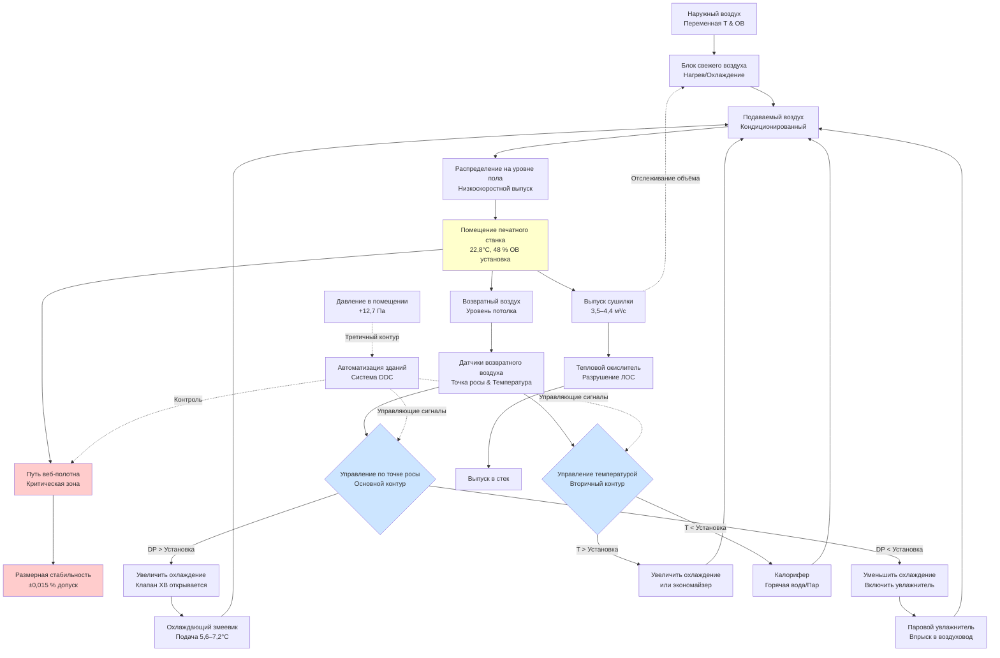

Точный контроль температуры и относительной влажности в операциях веб-печати напрямую влияет на размерную стабильность бумаги, равномерность натяжения веб-полотна и непрерывность производства. Гигроскопическая природа бумаги вызывает изменения размеров на 0,012–0,022 % на каждый процентный пункт изменения ОВ в направлении поперек волокна, что преобразуется в колебания натяжения, которые могут превышать пороги разрыва веб-полотна при скачках влажности. Температура влияет как на влагоравновесие бумаги, так и на реологию чернил, при этом объединённые колебания условий окружающей среды создают мультипликативные эффекты на точность совмещения и обращение с веб-полотном. Высокоскоростные веб-станки, работающие на скоростях 600–900 м/мин, требуют контроля окружающей среды в пределах ±1,1°C и ±2 % ОВ для поддержания натяжения в допустимых пределах и предотвращения катастрофических разрывов веб-полотна.

## Физика гигроскопического расширения

Бумага является целлюлозным материалом с гидроксильными группами, которые образуют водородные связи с молекулами воды. Соотношение сорбционной изотермы описывает зависимость содержания влаги от окружающих условий.

### Равновесное содержание влаги

Содержание влаги в бумаге уравновешивается с окружающим воздухом в соответствии со следующим уравнением:

$$EMC = \frac{1800}{W} \times \frac{K \times h}{(1-K \times h) \times (1 + (C-1) \times K \times h)}$$

Где:
- $EMC$ = Равновесное содержание влаги (%)
- $W$ = Константа точки насыщения волокна (1800 для целлюлозы)
- $K$ = Константа сорбции (0,04–0,08 для бумаги)
- $C$ = Константа БЭТ (5–15 для бумаги)
- $h$ = Относительная влажность (в долях единицы)

**Упрощённое линейное приближение** для диапазона эксплуатации 40–60 % ОВ:

$$EMC(\%) \approx 4 + 0,10 \times RH(\%)$$

При 50 % ОВ содержание влаги в бумаге составляет примерно 9 %.

### Соотношение изменения размеров

Размеры бумаги изменяются с содержанием влаги за счёт гигроскопического расширения:

$$\frac{\Delta L}{L_0} = \alpha_{EMC} \times \Delta EMC$$

Где:
- $\Delta L/L_0$ = Относительное изменение длины
- $\alpha_{EMC}$ = Коэффициент гигроскопического расширения (0,6–1,0 % на % влаги)
- $\Delta EMC$ = Изменение содержания влаги (%)

**Объединённое соотношение**, связывающее размер непосредственно с относительной влажностью:

$$\frac{\Delta L}{L_0} = \alpha_{RH} \times \Delta RH$$

Где эффективный коэффициент:

$$\alpha_{RH} = \alpha_{EMC} \times \frac{dEMC}{dRH} \approx 0,012–0,022\% \text{ на }\%RH$$

**Критическое наблюдение:** Расширение поперёк волокна в 3–4 раза больше, чем расширение в направлении волокна из-за ориентации волокон. Веб-полотно шириной 40 дюймов (1,016 м), подвергающееся изменению ОВ на 5 %, расширяется на:

$$\Delta L = 40 \text{ дюйм} \times 0,018\%/\%RH \times 5\%RH = 0,036 \text{ дюйм}$$

Это изменение размера на 0,036 дюйма (0,91 см) создаёт измеримое изменение натяжения в работающем веб-полотне.

## Механика натяжения веб-полотна

Натяжение веб-полотна должно оставаться в узких пределах, чтобы предотвратить разрывы (чрезмерное натяжение) или морщины (недостаточное натяжение). Изменения окружающей среды изменяют натяжение за счёт размерных эффектов.

### Соотношение напряжение-деформация

Веб-полотно из бумаги ведёт себя как упругий материал под натяжением:

$$\sigma = E \times \epsilon$$

Где:
- $\sigma$ = Растягивающее напряжение (кПа)
- $E$ = Модуль упругости (1 378–2 758 МПа для поперечного волокна бумаги)
- $\epsilon$ = Деформация (безразмерная)

Для веб-полотна с фиксированной длиной:

$$T = \sigma \times A = E \times \epsilon \times w \times t$$

Где:
- $T$ = Натяжение веб-полотна (кН)
- $w$ = Ширина веб-полотна (м)
- $t$ = Толщина бумаги (м)
- $A$ = Площадь поперечного сечения (м²)

### Изменение натяжения, вызванное влажностью

Когда влажность изменяется, а длина веб-полотна остаётся фиксированной (между единицами печатного станка), изменение размеров создаёт деформацию:

$$\epsilon_{hygro} = \alpha_{RH} \times \Delta RH$$

Эта гигроскопическая деформация создаёт изменение натяжения:

$$\Delta T = E \times \alpha_{RH} \times \Delta RH \times w \times t$$

**Пример расчёта:**

Бумага для печатной продукции, веб-полотно шириной 40 дюймов (1,016 м):
- $E$ = 2 068 МПа (поперечное волокно)
- $\alpha_{RH}$ = 0,018 % на % ОВ = 0,00018 на % ОВ
- $w$ = 1,016 м
- $t$ = 0,076 мм (типичная газетная бумага)
- $\Delta RH$ = 5 % (неконтролируемое колебание)

$$\Delta T = 2\,068 \times 0,00018 \times 5 \times 1,016 \times 0,076 = 0,144 \text{ кН}$$

**Контекст эксплуатации:** Типичное натяжение веб-полотна составляет 3–5 фунт/пог.фут ширины (44,8–74,6 кПа/м), или 0,044–0,074 кН для веб-полотна шириной 1,016 м. Изменение на 0,144 кН представляет изменение на 200–300 % — намного превышающее допустимые пределы и вызывающее немедленный разрыв веб-полотна.

### Влияние температуры на натяжение

Температура влияет на натяжение двумя механизмами:

**1. Тепловое расширение бумаги:**

$$\alpha_{T} = 2,7–3,6 \times 10^{-5} \text{ на }°C$$

**2. Смещение содержания влаги (содержание влаги в бумаге снижается с температурой при постоянной ОВ):**

$$\frac{dEMC}{dT} \approx -0,054\% \text{ на }°C$$

Объединённый эффект на °C повышения температуры:

$$\frac{\Delta L}{L_0} = \alpha_{T} \times \Delta T - \alpha_{EMC} \times \frac{dEMC}{dT} \times \Delta T$$

Второй член (эффект влаги) преобладает: повышение температуры на 5,6°C при постоянной 50 % ОВ снижает содержание влаги на 0,3 %, вызывая усадку бумаги на 0,18–0,30 % (в 600–1000 раз больше, чем тепловое расширение).

### Объединённая модель температуры-влажности

Полное изменение размеров при одновременном варьировании температуры и влажности:

$$\frac{\Delta L}{L_0} = \alpha_{RH} \times \Delta RH + \alpha_{T,eff} \times \Delta T$$

Где эффективный температурный коэффициент:

$$\alpha_{T,eff} = \alpha_{T} - \alpha_{EMC} \times \frac{dEMC}{dT} \approx -6,7 \times 10^{-5} \text{ на }°C$$

Отрицательный знак указывает на то, что бумага сжимается с повышением температуры при постоянной ОВ.

**Результирующее изменение натяжения:**

$$\Delta T_{web} = E \times w \times t \times \left(\alpha_{RH} \times \Delta RH + \alpha_{T,eff} \times \Delta T\right)$$

**Следствие проектирования:** Эффекты влажности преобладают (соотношение 18:1), но контроль температуры остаётся критическим из-за реологии чернил и требований работы сушилки.

## Допуски на контроль для предотвращения разрывов веб-полотна

### Критерии отказа

Бумага разрывается при растяжении, когда напряжение превышает предел прочности при растяжении:

$$\sigma_{break} = \frac{T_{break}}{w \times t}$$

Типичные значения:
- Газетная бумага: 20,7–34,5 МПа (поперечное волокно)
- Мелованный офсет: 27,6–48,3 МПа
- Материал для этикеток: 34,5–55,2 МПа

**Рабочее натяжение** обычно составляет 20–30 % от предела разрыва для коэффициента безопасности.

### Вывод допуска окружающей среды

Максимальное допустимое изменение натяжения без превышения предела разрыва:

$$\Delta T_{max} = (SF - 1) \times T_{operating}$$

Где $SF$ = коэффициент безопасности (1,5–2,0, типично).

Для $T_{operating}$ = 25 % от предела разрыва и $SF$ = 1,5:

$$\Delta T_{max} = 0,5 \times 0,25 \times T_{break} = 0,125 \times T_{break}$$

**Преобразование в допуск влажности:**

$$\Delta RH_{max} = \frac{\Delta T_{max}}{E \times \alpha_{RH} \times w \times t}$$

**Пример (веб-полотно газетной бумаги шириной 1,016 м):**

- $T_{break}$ = 24,1 МПа × 1,016 м × 0,076 мм = 1,865 кН
- $\Delta T_{max}$ = 0,125 × 1,865 = 0,233 кН
- Из предыдущего уравнения: $\Delta T/\Delta RH$ = 0,0288 кН на % ОВ

$$\Delta RH_{max} = \frac{0,233}{0,0288} = 8\%RH$$

**Консервативный стандарт проектирования:** Поддерживайте контроль ±2–3 % ОВ для коэффициента безопасности 2,5–4,0.

### Допуск температуры

Применение того же методологии к температуре:

$$\Delta T_{max} = \frac{\Delta T_{web,max}}{E \times |\alpha_{T,eff}| \times w \times t}$$

Для примера веб-полотна газетной бумаги шириной 1,016 м:

$$\Delta T_{max} = \frac{0,233}{2\,068 \times 6,7 \times 10^{-5} \times 1,016 \times 0,076} = 67°C$$

**Вывод:** Прямые эффекты теплового расширения минимальны. Требование контроля температуры ±1,1°C обусловлено следующим:
1. Вязкость и липкость чернил
2. Поддержание стабильного влагоравновесия
3. Предотвращение температурных градиентов по ширине веб-полотна

## Требования к проектированию системы HVAC

### Параметры контроля

**Условия в помещении:**

| Параметр | Установка | Допуск | Последствие отклонения |
|----------|-----------|--------|-------------------------|
| Температура по сухому термометру | 22–24°C | ±1,1°C | Консистенция чернил, равновесие влаги |
| Относительная влажность | 45–50 % | ±2 % ОВ | Размерная стабильность, натяжение веб-полотна |
| Температура точки росы | 10–12°C | ±1,1°C | Контроль содержания влаги |
| Скорость воздуха (в веб-полотне) | 0,15–0,25 м/с | ±0,05 м/с | Минимальное развевание веб-полотна, отвод тепла |

### Стратегия психрометрического контроля

**Контроль по точке росы** обеспечивает лучшую производительность, чем контроль по относительной влажности:

$$RH = \frac{p_{vapor}}{p_{sat}(T_{db})}$$

При постоянной точке росы относительная влажность изменяется обратно пропорционально температуре по сухому термометру. Колебание температуры ±1,1°C при точке росы 10°C вызывает изменение относительной влажности ±7 % при температуре по сухому термометру 21°C.

**Предпочтительный подход:** Контролируйте точку росы в пределах ±0,6–0,8°C посредством:
1. Датчика точки росы в возвратном воздухе
2. Модулирующего охлаждающего змеевика с холодной водой к установке точки росы
3. Отдельного чувствительного охлаждения/нагрева для контроля температуры
4. Развязанных контуров контроля скрытого и явного тепла

### Требования к производительности

**Нагрузки явного тепла:**

| Источник | Типичное значение | Примечания |
|---------|------------------|-----------|
| Радиационное тепло сушилки | 439–877 кВт | На одну единицу печатного станка, зависит от скорости |
| Электродвигатели привода печатного станка | 585–1 171 кВт | На основе 37–75 кВт в сумме |
| Освещение | 88–176 кВт | Требуется высокое освещение |
| Персонал | 146–293 кВт | 15–30 операторов и вспомогательный персонал |
| Внешние поступления | Переменная | Зависит от конструкции ограждающей конструкции |

**Полное чувствительное охлаждение:** 1 464–2 634 кВт, типично для установки печатного станка с 3–4 единицами (126–188 тонн холодопроизводительности).

**Скрытые нагрузки:**

Зимняя увлажнение доминирует в холодном климате:

$$Q_{latent,winter} = \frac{CFM \times \rho \times \Delta W \times h_{fg}}{60}$$

Для 23,6 м³/с свежего воздуха, −17,8°C на улице на 22°C/50 % ОВ:
- $\Delta W$ = 0,0078 − 0,0001 = 0,0077 кг/кг
- Скрытая нагрузка = 23,6 м³/с × 1,2 кг/м³ × 0,0077 кг/кг × 2 452 кДж/кг / 60 = 148 кВт

Требуется примерно 148 кВт паровой производительности.

Летнее осушение во влажном климате:

Для 23,6 м³/с, 32,2°C/70 % ОВ на улице на 22°C/50 % ОВ:
- $\Delta W$ = 0,0164 − 0,0078 = 0,0086 кг/кг
- Скрытая нагрузка = 23,6 м³/с × 1,2 кг/м³ × 0,0086 кг/кг × 2 452 кДж/кг / 60 = 166 кВт (47 тонн)

### Проектирование распределения воздуха

**Стратегия низкоскоростного вытеснения:**

Подавайте кондиционированный воздух на уровне пола, 10–18°C, начальная скорость 60–120 м/мин:
- Регистры подачи: Перфорированный воздуховод или напольные выходы вытеснения
- Расстояние: 6–9 м вдоль линии печатного станка
- Паттерн воздуха: Восходящее вытеснение, отвод тепла на потолке
- Место возврата: Высокая боковая стена или потолок (преимущество расслоения)

**Преимущества:**
1. Минимальное возмущение веб-полотна (< 0,25 м/с в пути веб-полотна)
2. Отличная равномерность температуры (расслоение удаляет тепло)
3. Минимальные сквозняки на операторов
4. Энергоэффективность (температура подачи на 4,4–6,7°C ниже установки в помещении)

**Проектный расход воздуха:**

$$CFM_{supply} = \frac{Q_{sensible}}{1.08 \times (T_{space} - T_{supply})}$$

Для 175 кВт явного охлаждения, 22°C в помещении, 14°C подача:

$$CFM = \frac{175 \text{ кВт} \times 3,412 \text{ Btu/ч}/\text{кВт}}{1,08 \times (22 - 14)°C \times 1,8°F/°C} = 18 700 \text{ CFM}$$

$$м³/ч = 18\,700 \text{ CFM} \times 1,699 \text{ м³/ч}/\text{CFM} = 31\,750 \text{ м³/ч}$$

Используйте 18 700–21 200 CFM (31 750–36 000 м³/ч) для предоставления запаса.

## Интегрированные системы управления

### Архитектура многозонного управления

Крупные объекты веб-печати требуют управления на основе зон:

**Зона 1: Хранилище бумаги/акклиматизация**
- Установка: 22°C, 50 % ОВ
- Допуск: ±1,7°C, ±3 % ОВ (менее критично, чем в помещении печатного станка)
- Система: Отдельный блок обработки воздуха с увлажнением

**Зона 2: Помещение печатного станка**
- Установка: 22,8°C, 48 % ОВ
- Допуск: ±1,1°C, ±2 % ОВ (критический контроль)
- Система: Выделенный блок обработки воздуха с контролем по точке росы, интеграция DDC

**Зона 3: Выпуск сушилки/свежий воздух**
- Объём свежего воздуха: Соответствует выпуску (3,5–4,4 м³/с на единицу печатного станка)
- Нагрев: Прямая сожигаемая единица свежего воздуха (эффективность 80–85 %)
- Охлаждение: Испарительное или прямое расширение охлаждение
- Интеграция: Отслеживание объёма с вентиляторами выпуска

### Последовательность управления

```
ЛОГИКА УПРАВЛЕНИЯ HVAC ПОМЕЩЕНИЯ ПЕЧАТНОГО СТАНКА

1. ОСНОВНОЙ КОНТУР — Управление по точке росы
   - Измерение: Точка росы возвратного воздуха (DP_ra)
   - Установка: 10,6°C точка росы
   - Управление: Модулировать положение клапана ХВ (0–100 %)

   ЕСЛИ DP_ra > DP_setpoint + 0,6°C ТОГДА
      Увеличить положение клапана ХВ (больше охлаждения/осушения)
   ИНАЧЕ ЕСЛИ DP_ra < DP_setpoint − 0,6°C ТОГДА
      Уменьшить положение клапана ХВ
      ЕСЛИ клапан ХВ < 10 % И DP_ra < DP_setpoint − 1,1°C ТОГДА
         Включить увлажнитель (паровпрыск)
      КОНЕЦ ЕСЛИ
   КОНЕЦ ЕСЛИ

2. ВТОРИЧНЫЙ КОНТУР — Управление температурой
   - Измерение: Температура по сухому термометру в помещении (T_db)
   - Установка: 22,8°C
   - Управление: Модулировать выход калорифера или положение экономайзера

   ЕСЛИ T_db > T_setpoint + 0,6°C ТОГДА
      Увеличить заслонки экономайзера (если температура наружного воздуха < 15°C)
      ИЛИ увеличить клапан ХВ (если позволяет управление по точке росы)
   ИНАЧЕ ЕСЛИ T_db < T_setpoint − 0,6°C ТОГДА
      Увеличить выход калорифера
   КОНЕЦ ЕСЛИ

3. ТРЕТИЧНЫЙ КОНТУР — Pressurization
   - Измерение: Статическое давление в помещении (P_space)
   - Установка: +12,7 Па относительно соседних областей
   - Управление: Модулировать положение возвратной/выпускной заслонки

   Поддерживать CFM подачи = CFM выпуска + CFM для pressurization

4. ПРЕДОХРАНИТЕЛЬНЫЕ БЛОКИРОВКИ
   - ЕСЛИ точка росы > 15,6°C (риск конденсации) ТОГДА
      Тревога + максимальное охлаждение
   - ЕСЛИ температура > 26,7°C ИЛИ < 18,3°C ТОГДА
      Тревога + уведомление операторов
   - ЕСЛИ влажность > 60 % ИЛИ < 35 % ТОГДА
      Тревога + предупреждение о разрыве веб-полотна
```

### Размещение датчиков

**Критические места расположения датчиков:**

1. **Возвратный воздух:** Передатчик точки росы (точность ±0,6°C), датчик температуры (точность ±0,3°C)
2. **Подаваемый воздух:** Точка росы, температура, станция измерения расхода
3. **Контрольная точка в помещении:** Несколько датчиков температуры/ОВ на высоте пути веб-полотна (1,2–1,8 м над полом)
4. **Наружный воздух:** Температура, влажность для управления экономайзером и расчёта энтальпии

**Расстояние между датчиками:** Одна точка контроля температуры/влажности на 185–280 м² площади помещения печатного станка для выявления пространственных вариаций.

## Стратегии управления для различных веб-материалов

Требования к окружающей среде значительно различаются в зависимости от свойств подложки.

### Требования для специфичных материалов

| Веб-материал | Температура | Контроль ОВ | Основное беспокойство | Особые соображения |
|--------------|-------------|--------------|----------------------|-------------------|
| Газетная бумага | 22–24°C, ±1,1°C | 45–50 % ОВ, ±2 % | Контроль статики, хрупкость | Высокое содержание переработанного материала усиливает гигроскопический ответ |
| Мелованная глянцевая | 21–23°C, ±0,8°C | 48–52 % ОВ, ±1,5 % | Точность совмещения | Низкий гигроскопический коэффициент, возможен более тесный допуск |
| Немелованный офсет | 22–24°C, ±1,1°C | 45–50 % ОВ, ±3 % | Размерная стабильность | Умеренное гигроскопическое расширение, стандартный контроль |
| Материал для этикеток | 23–24°C, ±1,1°C | 40–45 % ОВ, ±2 % | Контроль завивки, производительность клея | Более низкая ОВ предотвращает завивку, оптимизация клея |
| Полимерные подложки (полиэстер, полипропилен) | 21–24°C, ±1,7°C | Некритична | Управление статикой, отвод тепла | Негигроскопичные, устранение статики — главное беспокойство |
| Папиросная бумага | 22–24°C, ±0,8°C | 35–40 % ОВ, ±2 % | Удержание прочности | Очень гигроскопичная, чрезмерная влага снижает прочность |

### Выбор стратегии управления

**Стратегия А: Постоянная установка (тесный допуск)**
- Применение: Качественная коммерческая печать, упаковка
- Установка: 22,8°C, 48 % ОВ круглый год
- Допуск: ±0,8°C, ±1,5 % ОВ
- Оборудование: Управление по точке росы, DDC, высокоэффективное увлажнение/осушение
- Энергетический штраф: На 15–25 % выше, чем стратегия B
- Преимущество: Максимальная точность совмещения, минимальные разрывы веб-полотна

**Стратегия B: Сезонная корректировка установки**
- Применение: Печать публикаций, газеты
- Зима: 22°C, 45 % ОВ (±1,1°C, ±2 % ОВ)
- Лето: 23,9°C, 50 % ОВ (±1,1°C, ±2 % ОВ)
- Оборудование: Стандартный блок обработки воздуха с увлажнением и охлаждением-осушением
- Экономия энергии: Сниженное увлажнение (зима) и осушение (лето)
- Компромисс: Переходный период адаптации (1–2 дня на акклиматизацию бумаги)

**Стратегия C: Модуляция управления на основе процесса**
- Применение: Гибкие объекты, печатающие несколько подложек
- Управление: Отрегулируйте установки на основе печатаемого материала (поиск по базе данных)
- Реализация: Автоматизированные изменения установки, синхронизированные со сменой задания
- Требование: Время акклиматизации 2–4 часа перед критическими заданиями совмещения
- Преимущество: Оптимизированные условия для каждого типа подложки

**Стратегия D: Полимерная подложка (негигроскопичная)**
- Температура: 21–24°C, ±1,7°C (менее критично)
- Влажность: 40–50 % ОВ, ±5 % ОВ (только для управления статикой)
- Основные элементы управления: Активное устранение статики (ионизирующие стержни), контроль натяжения веб-полотна через натяжные ролики
- Сниженные требования к точности HVAC, ниже капитальные и эксплуатационные затраты

## Контроль и проверка

### Показатели производительности в реальном времени

**Ключевые показатели эффективности:**

1. **Индекс стабильности окружающей среды:**

$$ESI = \sqrt{(\frac{\Delta T}{\Delta T_{max}})^2 + (\frac{\Delta RH}{\Delta RH_{max}})^2}$$

Где $\Delta T$, $\Delta RH$ — измеренные отклонения от установки. Целевой показатель ESI < 0,5 для стабильной работы.

2. **Частота разрывов веб-полотна:**
- Целевой показатель: < 1 разрыв на 1 609 344 погонных метра
- Контроль корреляции с экскурсиями окружающей среды
- Анализ тренда: Разрывы относительно времени суток, сезона, событий погоды

3. **Коэффициент вариации натяжения:**

$$CV_{tension} = \frac{\sigma_{tension}}{\bar{T}_{tension}} \times 100\%$$

Целевой показатель CV < 5 % для качественного производства. Непрерывный контроль натяжения в нескольких местах веб-полотна коррелирует с эффективностью управления окружающей средой.

### Диагностические инструменты

**Отслеживание психрометрических процессов:**

Нанесите условия в помещении на психрометрическую диаграмму за 24-часовой период. Идеальная работа показывает плотную кластеризацию около установки. Отклонения указывают:
- Горизонтальный дрейф: Дисбаланс явного тепла (проблема управления температурой)
- Вертикальный дрейф: Дисбаланс скрытого тепла (проблема управления влажностью)
- Диагональный дрейф: Объединённый дисбаланс явного/скрытого тепла или вариация наружного воздуха

**Пространственное отображение:**

Периодические обследования температуры/влажности в помещении печатного станка с использованием портативных логгеров данных:
- Паттерн сетки: Расстояние 3–4,6 м
- Продолжительность: 24–48 часов
- Анализ: Определить горячие зоны, градиенты влажности, дефициты распределения воздуха

## Интегрированная система управления температурой и ОВ



---

Системы управления температурой и влажностью для операций веб-печати требуют интегрированного управления точкой росы, температурой по сухому термометру и давлением для поддержания размерной стабильности бумаги в допусках, которые предотвращают разрывы веб-полотна. Коэффициент гигроскопического расширения 0,012–0,022 % на % ОВ требует управления ±2 % ОВ для ограничения колебаний натяжения ниже пороков разрыва, тогда как управление температурой ±1,1°C обеспечивает консистенцию реологии чернил и стабильное влагоравновесие. Архитектуры управления на основе точки росы развязывают скрытые и явные нагрузки, обеспечивая превосходную производительность по сравнению с традиционным управлением ОВ, при этом надлежащее размещение датчиков и многоконтурные последовательности управления обеспечивают стабильность окружающей среды, необходимую для высокоскоростного производства, превышающего 600 м/мин скорость веб-полотна.
