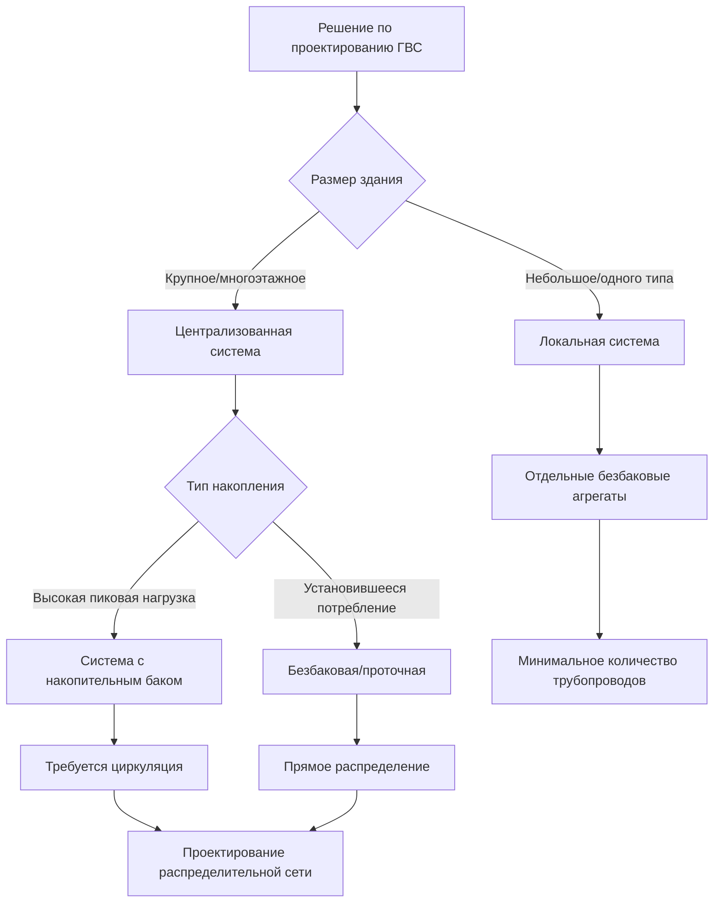

Проектирование систем горячего водоснабжения (ГВС) требует тщательного анализа теплопередачи, гидродинамики жидкостей и режимов потребления для эффективного поддержания нагрева воды при минимизации потерь энергии и обеспечении безопасных температур. Процесс проектирования объединяет расчёт производительности теплогенератора, рассмотрение накопления тепла, гидравлику распределительной сети и стратегии управления для удовлетворения пиковых нагрузок с приемлемым временем восстановления.

## Подходы к конфигурации системы

### Централизованные системы

Централизованные системы ГВС используют один или несколько водонагревателей большой производительности, обслуживающих всё здание или объект через обширную распределительную сеть трубопроводов. Основное преимущество заключается в экономии масштаба — оборудование большей производительности обычно достигает более высокого теплового КПД и меньшей стоимости установки на единицу производительности по сравнению с несколькими меньшими агрегатами.

Требуемый тепловой поток от централизованной системы определяется следующим образом:

$$Q_{total} = \sum_{i=1}^{n} \dot{m}_i c_p (T_{hot} - T_{cold}) + Q_{losses}$$

где $\dot{m}_i$ представляет массовый расход к каждому прибору, $c_p = 4,186$ кДж/(кг·К) — удельная теплоёмкость воды, а $Q_{losses}$ учитывает потери при хранении и распределении. Для надлежащо теплоизолированных резервуаров потери при хранении находятся в диапазоне 1–3% объёма резервуара в час.

Критическая задача проектирования заключается в потерях тепла распределительной системой. Для трубопровода длиной $L$, диаметром $D$ и изоляцией с коэффициентом теплопроводности $k_{ins}$:

$$Q_{pipe} = \frac{2\pi k_{ins} L (T_{water} - T_{ambient})}{\ln(r_{outer}/r_{inner})}$$

Потери при распределении могут составлять 10–30% от общей энергии ГВС в крупных зданиях, что требует циркуляционных систем для поддержания температуры у приборов при увеличении энергопотребления.

### Локальные системы (системы на месте использования)

Локальные (на месте использования) водонагреватели устанавливаются у отдельных приборов или рядом с ними, устраняя потери при распределении, но требуя нескольких отдельных единиц оборудования. Безбаковые электрические агрегаты преобладают в локальных приложениях благодаря компактным размерам и доступности электроснабжения в большинстве мест установки приборов.

Требуемая мгновенная электрическая мощность для локального нагревателя составляет:

$$P_{electric} = \frac{\dot{V} \rho c_p \Delta T}{3600 \eta}$$

Для типичной раковины для мытья рук, требующей 1,89 л/мин (0,5 гал/мин) с температурным подъёмом 40°C и КПД электрического сопротивления 99%:

$$P = \frac{(1,89/60)(1000)(4,186)(40)}{0,99} = 5,3 \text{ кВ}$$

Такой значительный расход электроэнергии (22 А при 240 В) ограничивает применение локальных систем маломощными приборами. Приборы с высоким потреблением, такие как душевые, требуют агрегатов мощностью 10–27 кВ, часто превышающих имеющуюся ёмкость электроснабжения.

## Методология расчёта нагрузок

Справочник ASHRAE по приложениям HVAC предоставляет методы расчёта по условным единицам приборов и вероятностные расчёты для оценки нагрузок ГВС. Методика кривой Хантера назначает условные единицы на основе спроса и применяет коэффициенты неравномерности, учитывая, что все приборы никогда не работают одновременно.

Вероятное одновременное потребление определяется как:

$$\dot{V}_{probable} = \dot{V}_{peak} \sqrt{\frac{n_{fixtures}}{100}}$$

Эта квадратичная зависимость отражает статистическую вероятность того, что одновременное потребление снижается с увеличением количества приборов. Для 100 приборов с пиковым расходом 2,5 гал/мин (9,46 л/мин) каждый:

$$\dot{V}_{probable} = 9,46 \times 100 \times \sqrt{\frac{100}{100}} = 946 \text{ л/мин}$$

Однако для 400 приборов:

$$\dot{V}_{probable} = 9,46 \times 400 \times \sqrt{\frac{400}{100}} = 7568 \text{ л/мин}$$

Коэффициент неравномерности (отношение вероятного к пиковому) улучшается с 1,0 до 0,5, значительно снижая требования к размерам оборудования.

## Накопительное нагревание в сравнении с проточным

### Накопительные водонагреватели

Системы с накоплением поддерживают резервуар нагретой воды, обеспечивая резервную производительность, превышающую скорость входного теплового потока. Рейтинг производительности в первый час (FHR) характеризует пропускную способность:

$$FHR = V_{tank} \times 0,7 + \frac{Q_{input} \times 1\text{ ч}}{\rho c_p \Delta T}$$

Коэффициент 0,7 представляет полезную долю до смешивания с холодной водой, снижающего температуру ниже приемлемого уровня. Для 189-литрового газового нагревателя с входной тепловой мощностью 11,7 кВ и подъёмом температуры 39°C:

$$FHR = 189 \times 0,7 + \frac{11700}{(1000)(4,186)(39)} = 132 + 71 = 203 \text{ л}$$

Время восстановления после полного опорожнения составляет:

$$t_{recovery} = \frac{V_{tank} \rho c_p \Delta T}{Q_{input} \eta}$$

### Проточные (безбаковые) нагреватели

Проточные нагреватели нагревают воду по требованию через высокоэффективные теплообменники без накопления тепла. Максимальный расход зависит исключительно от мощности нагрева:

$$\dot{V}_{max} = \frac{Q_{input} \eta}{\rho c_p \Delta T}$$

Конденсационный газовый проточный нагреватель мощностью 58,4 кВ (КПД 95%) с подъёмом температуры 39°C обеспечивает:

$$\dot{V}_{max} = \frac{58400 \times 0,95}{(1000)(4,186)(39)} = 3,4 \text{ л/мин}$$

Такая непрерывная производительность подходит для приложений с установившимся спросом, но испытывает затруднения при сильно переменных режимах потребления, где накопление буферировало бы пики.

## Матрица сравнения систем

| Параметр | Централизованная накопительная | Централизованная проточная | Локальная |
|-----------|-------------------------------|---------------------------|-----------|
| **Потери при распределении** | 10–30% от общей энергии | 10–30% от общей энергии | <1% (минимум трубопроводов) |
| **Требования к пространству** | Крупное механическое помещение | Среднее (компактные агрегаты) | Минимальное в каждом месте |
| **Пиковая производительность** | Отличная (буферизация накоплением) | Ограниченна входным потоком | Ограниченна на прибор |
| **Энергоэффективность** | 80–98% (газ/тепловой насос) | 95–99% (конденсационные) | 99% (электрическое сопротивление) |
| **Техническое обслуживание** | Периодическая промывка бака | Известкование теплообменника | Обслуживание нескольких агрегатов |
| **Капитальная стоимость** | Средняя | Средняя–высокая | Низкая за единицу, высокая всего |
| **Стоимость эксплуатации** | Средняя | Низкая–средняя | Высокая (тарифы на электроэнергию) |
| **Риск легионеллы** | Выше (застойная вода) | Ниже (без накопления) | Средний (малые объёмы) |

## Схема распределительной сети

Проектирование распределительной сети следует трём основным конфигурациям:

**Магистраль с ответвлениями**: Основная магистраль ГВС проходит по всей длине здания с ответвлениями к группам приборов. Самая простая схема, но требует циркуляции для приемлемого времени доставки в крупных зданиях.

**Обратный ток**: Подающие и обратные трубопроводы спроектированы таким образом, чтобы общая длина трубопровода к любой группе приборов была одинаковой, естественным образом уравновешивая поток без обширного дросселирования клапанов. Общее падение давления через любой путь контура:

$$\Delta P_{total} = \Delta P_{supply} + \Delta P_{return} = \text{const}$$

**Звёздообразная (коллекторная)**: Отдельные трубопроводы проходят от центрального коллектора к каждому прибору, устраняя взаимодействие давлений. Требует значительного количества трубопроводов, но позволяет использовать методы укладки PEX и точное управление потоком.

Выбор диаметра трубопровода уравновешивает стоимость материала и энергию на перекачивание. Уравнение Дарси–Вайсбаха управляет падением давления:

$$\Delta P = f \frac{L}{D} \frac{\rho v^2}{2}$$

где коэффициент трения $f$ зависит от числа Рейнольдса и шероховатости трубопровода. Скорость должна оставаться ниже 1,2–1,8 м/с для минимизации эрозии и шума, но выше 0,6 м/с для предотвращения расслоения.

## Требования норм и правил

Международный сантехнический кодекс (IPC) раздел 607 предписывает максимальную температуру подачи 60°C к приборам без одобренных устройств ограничения температуры, требуя термостатических смесительных клапанов для систем с хранением воды при более высоких температурах для контроля легионеллы. ASHRAE стандарт 188 устанавливает минимальную температуру ГВС 60°C при хранении и возврате, требуя локального смешивания.

Единый сантехнический кодекс (UPC) таблица 610.3 определяет минимальное давление подачи у приборов (55–103 кПа в зависимости от типа прибора), что информирует выбор размера насоса для циркуляционных систем. Расширительные баки требуются в соответствии с IPC раздел 607.3 при наличии обратных клапанов или клапанов предотвращения обратного потока, препятствующих сбросу расширения в водопровод.

ASHRAE 90.1-2019 раздел 7.4.4 предписывает автоматическое управление на основе времени или температуры для циркуляционных насосов, запрещая непрерывную работу. Тепловые ловушки на подводах к накопительному баку снижают потери при хранении, предотвращая циркуляцию из-за термосифона в режиме покоя системы.

## Соображения по интеграции проекта

Успешное проектирование системы ГВС координируется с режимами занятости здания, доступными источниками энергии, пространственными ограничениями и возможностями технического обслуживания. Высотные здания часто используют промежуточные механические этажи с распределённым накоплением для снижения требований к давлению и потерь при распределении. Лечебные учреждения требуют двухтемпературных систем (60°C для контроля легионеллы, 40–43°C для безопасности пациента). Объекты с местной когенерацией должны отдавать приоритет системам с накоплением для использования возможностей утилизации отходящего тепла.

Оптимальная конфигурация уравновешивает ограничения первоначальной стоимости, целевые показатели энергоэффективности, ресурсы технического обслуживания и ожидания пользователей при соответствии требованиям охраны здоровья и безопасности.
