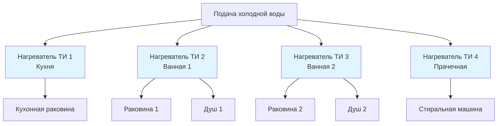
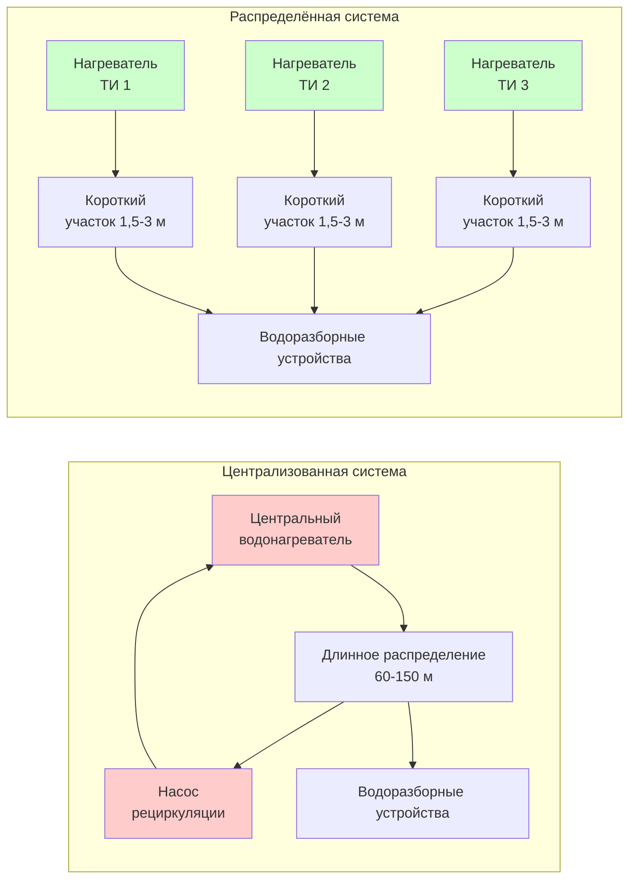

## Архитектура системы

Распределённые системы горячего водоснабжения (ГВС) используют несколько нагревателей в точке использования (ТИ), расположенных рядом с водоразборными устройствами, вместо одного централизованного котельного агрегата. Такая конфигурация минимизирует длину распределительного трубопровода, исключает необходимость рециркуляции и снижает тепловые потери в распределительной сети.

### Основные компоненты

**Водонагреватели в точке использования**
- Электрические проточные нагреватели (3-36 кВт)
- Малые накопительные водонагреватели (8-76 л)
- Газовые проточные нагреватели (16-210 кВт)
- Тепловые насосы для крупных приложений ТИ

**Конфигурация распределения**
- Холодное водоснабжение к каждому месторасположению нагревателя
- Короткие трубопроводы горячей воды (обычно < 3 м)
- Индивидуальное управление температурой на каждый участок
- Минимальная тепловая масса в трубопроводах

## Методология расчёта

### Производительность отдельного нагревателя

Для проточных нагревателей ТИ требуемая тепловая мощность зависит от расхода и перепада температур:

$$Q = \dot{m} c_p \Delta T = \frac{\dot{V} \rho c_p (T_{out} - T_{in})}{1.686}$$

Где:
- $Q$ = тепловая мощность (кВт)
- $\dot{V}$ = объёмный расход (л/мин)
- $\rho$ = плотность воды (1000 кг/м³ при 15°C)
- $c_p$ = удельная теплоёмкость воды (4,186 кДж/кг·°C)
- $T_{out}$ = требуемая температура на выходе (°C)
- $T_{in}$ = температура на входе (°C)
- 1,686 = коэффициент пересчёта (кДж/с в кВт)

**Упрощённая форма для электрических нагревателей:**

$$Q_{kW} = \frac{\dot{V} \times (T_{out} - T_{in})}{152}$$

### Расчёт накопительного бака

Для накопительных нагревателей ТИ:

$$V_{storage} = \frac{Q_{peak} \times t_{draw}}{c_p \rho (T_{tank} - T_{mixed})} - \frac{Q_{input} \times t_{draw}}{c_p \rho (T_{tank} - T_{in})}$$

Где:
- $V_{storage}$ = требуемый объём накопления (л)
- $Q_{peak}$ = пиковый расход воды (л/мин)
- $t_{draw}$ = длительность отбора воды (мин)
- $T_{tank}$ = температура воды в баке (°C)
- $T_{mixed}$ = смешанная температура подачи (°C)
- $Q_{input}$ = входная тепловая мощность нагревателя (кДж/ч или кВт)

## Анализ потерь тепла

### Потери тепла в распределительных трубопроводах

Общие потери тепла из распределительного трубопровода:

$$q_{loss} = U A (T_{water} - T_{ambient}) \times L$$

Где:
- $q_{loss}$ = интенсивность потерь тепла (кДж/ч)
- $U$ = общий коэффициент теплопередачи (кДж/ч·м²·°C)
- $A$ = площадь поверхности трубопровода на единицу длины (м²/м)
- $L$ = общая длина трубопровода (м)
- $T_{water}$ = температура воды (°C)
- $T_{ambient}$ = температура окружающего воздуха (°C)

**Распределённые системы обеспечивают снижение потерь тепла в трубопроводах на 60-85% по сравнению с централизованными системами благодаря:**
- Сокращению общей длины трубопровода (обычно 6-12 м вместо 60-150 м)
- Исключению рециркуляционных контуров
- Снижению тепловой массы, требующей нагрева

### Потери в режиме ожидания

Для накопительных нагревателей ТИ согласно стандарту ASHRAE 118.2:

$$q_{standby} = UA_{tank}(T_{tank} - T_{ambient})$$

Коэффициент энергоэффективности с учётом потерь в режиме ожидания:

$$EF = \frac{V \times 1000 \times c_p \times \Delta T}{Q_{input} \times t_{test}}$$

## Сравнение систем

| Параметр | Распределённая система | Централизованная система |
|-----------|----------------------|--------------------------|
| Общая длина трубопровода | 6-15 м | 60-180 м |
| Рециркуляция требуется | Нет | Да (для крупных систем) |
| Время ожидания горячей воды | < 5 секунд | 15-120 секунд |
| Потери тепла в распределении | 0,3-1,4 МДж/ч | 5,7-42,8 МДж/ч |
| Стоимость оборудования | Выше (несколько агрегатов) | Ниже (один агрегат) |
| Трудозатраты при установке | Ниже | Выше |
| Сложность обслуживания | Распределённые локации | Одна локация |
| Резервирование системы | Высокое | Низкое |
| Управление температурой | Индивидуальные участки | Централизованное |
| Энергоэффективность (распределение) | 85-95% | 60-80% |

## Проектные соображения

### Области применения

**Оптимальные области применения:**
- Здания с разреженным расположением водоразборных устройств (жилой сектор, малые коммерческие объекты)
- Реконструкция, где добавление рециркуляции нецелесообразно
- Здания с нерегулярным потреблением горячей воды
- Объекты, требующие контроля температуры по отдельным участкам
- Учреждения здравоохранения (инфекционный контроль благодаря снижению протяжённости трубопроводов)

**Менее пригодные области применения:**
- Скопления водоразборных устройств высокой плотности
- Промышленные процессы, требующие больших постоянных расходов
- Интеграция с централизованным тепловым аккумулированием
- Комбинированные системы отопления и ГВС

### Расчёт трубопроводов

Максимальная длина трубопровода от нагревателя ТИ до водоразборного устройства согласно стандарту ASHRAE 90.1:

| Номинальный диаметр трубопровода | Максимальная длина |
|----------------------------------|-------------------|
| ≤ 12 мм | 7,6 м |
| 16 мм | 10,7 м |
| 19 мм | 15,2 м |
| > 19 мм | Не рекомендуется для ТИ |

### Электрические требования

Для электрических нагревателей ТИ проверьте ёмкость ответвления:

$$I = \frac{P}{V \times \sqrt{3} \times PF}$$ (трёхфазная сеть)

$$I = \frac{P}{V}$$ (однофазная сеть, резистивная нагрузка)

Где:
- $I$ = ток (ампер)
- $P$ = мощность нагревателя (ватт)
- $V$ = напряжение сети (вольт)
- $PF$ = коэффициент мощности (1,0 для резистивных нагрузок)

## Энергетическая характеристика

### Годовое энергопотребление

Общее годовое энергопотребление распределённых систем:

$$E_{annual} = \sum_{i=1}^{n} (Q_{draw,i} + Q_{standby,i} + Q_{dist,i}) \times 8760$$

Где каждый нагреватель вносит вклад:
- $Q_{draw,i}$ = тепловая нагрузка на нагрев воды (кДж/ч в среднем)
- $Q_{standby,i}$ = потери бака в режиме ожидания (кДж/ч)
- $Q_{dist,i}$ = потери распределения от нагревателя до водоразборного устройства (кДж/ч)

**Преимущества в энергоэффективности:**
- Исключение энергопотребления рециркуляционного насоса (0,1-0,6 кВт непрерывно)
- Снижение потерь распределения на 60-85%
- Улучшенная эффективность при частичной нагрузке (независимый цикл нагревателей)

### Расчёт стоимости жизненного цикла

- Более высокие начальные затраты на оборудование, компенсируемые снижением трудозатрат при установке
- Более низкие эксплуатационные затраты в большинстве приложений (снижение тепловых потерь)
- Упрощённое обслуживание, но несколько мест обслуживания
- Улучшенная надёжность системы благодаря избыточности

## Нормы и стандарты

**Стандарт ASHRAE 90.1:** Раздел 7.4.4 регулирует эффективность распределения горячего водоснабжения, ограничивая длину трубопровода для распределённых систем.

**Стандарт ASHRAE 118.2:** Методика тестирования и классификации жилых водонагревателей, включая накопительные и проточные типы.

**Единый сантехнический код (UPC):** Глава 5 охватывает требования к установке водонагревателей, зазорам и защитным устройствам.

**Международный механический код (IMC):** Глава 5 регулирует выведение дымовых газов для газовых нагревателей ТИ.

## Процедура проектирования

1. Определите группы водоразборных устройств и рассчитайте пиковое потребление для каждого места
2. Определите требуемую производительность каждого нагревателя ТИ, используя расход и перепад температур
3. Выберите тип нагревателя (проточный или накопительный) на основе профиля нагрузки
4. Проверьте доступность электроснабжения или газоснабжения в каждом месте
5. Рассчитайте трубопровод холодного водоснабжения к каждому месту ТИ
6. Минимизируйте трубопроводы горячей воды (целевое значение < 3 м где возможно)
7. Предусмотрите теплоизоляцию для трубопроводов, превышающих 1 м
8. Проверьте соответствие ограничениям длины трубопровода согласно ASHRAE 90.1
