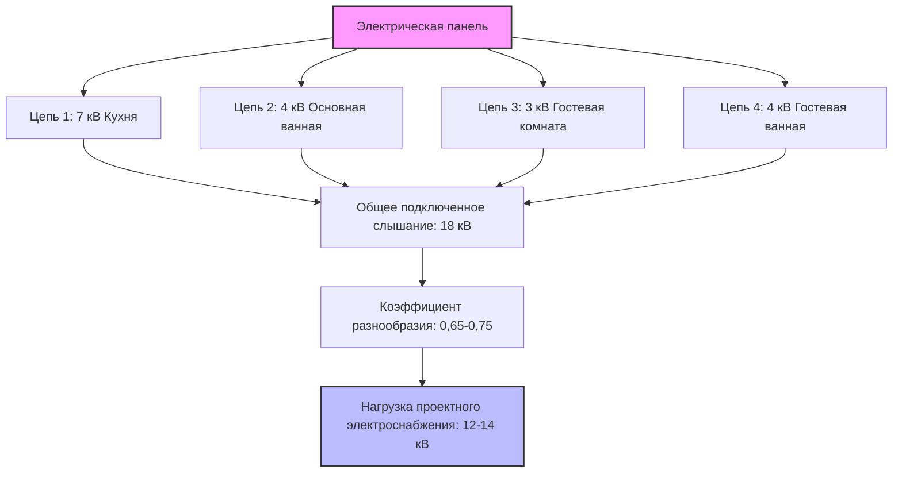
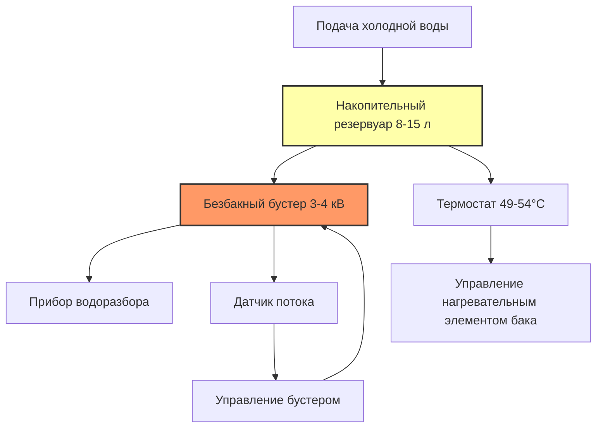

## Фундаментальные принципы

Системы водяного отопления в точке использования (ПИУ) размещают источник тепла в месте потребления или рядом с ним, кардинально изменяя тепловые и гидравлические характеристики подачи горячей воды для хозяйственных нужд. Этот децентрализованный подход исключает потери распределения, присущие центральным системам, где горячая вода проходит через обширные сети трубопроводов.

Экономия энергии вытекает из двух основных механизмов:

**Устранение потерь в распределении**

Потеря тепла из трубопроводов подчиняется закону теплопроводности Фурье через стенку трубы и изоляцию, в сочетании с конвективными и радиационными потерями с внешней поверхности:

$$Q_{loss} = \frac{2\pi L k}{\ln(r_o/r_i)} (T_{water} - T_{ambient}) + h A_{surface} (T_{surface} - T_{ambient})$$

Где:
- $L$ = длина трубопровода (м)
- $k$ = коэффициент теплопроводности трубы и изоляции (Вт/м·°C)
- $r_o$, $r_i$ = внешний и внутренний радиусы (м)
- $h$ = коэффициент конвективного теплопередачи (Вт/м²·°C)
- $A_{surface}$ = внешняя площадь поверхности (м²)

Для типичной центральной системы с трубопроводом длиной 15 м из медной трубы диаметром 19 мм при температуре воды 49°C в окружающей среде 21°C неизолированная труба теряет примерно 47-63 Вт/м. За 8 часов простоя это составляет 1,8-2,4 кДж потерь тепла.

**Устранение потерь воды**

Объем воды, расходуемой при ожидании подачи горячей воды, равен объему трубопровода между нагревателем и приборомводоразбора:

$$V_{waste} = \frac{\pi d^2}{4} L$$

Для трубопровода длиной 15 м диаметром 19 мм: $V_{waste} = \frac{\pi (0.019)^2}{4} \times 15 = 0.0043$ м³ = 4,3 л за расход.

## Типы систем в точке использования

### Электрические безбакные (мгновенные) нагреватели

Электрические безбакные нагреватели ПИУ обеспечивают нагревание по требованию без накопительного объема. Мгновенное повышение температуры зависит от электрической мощности и расхода воды:

$$\Delta T = \frac{P \times 3,6}{4,18 \times q}$$

Где:
- $P$ = электрическая мощность (кВт)
- $q$ = объемный расход воды (л/мин)
- 3,6 = коэффициент преобразования (кДж/Вт·ч)
- 4,18 = удельная теплоемкость воды (кДж/л·°C)

Упрощенно:

$$\Delta T = \frac{P \times 0.861}{q}$$

| Мощность (кВ) | Расход (л/мин) | Повышение температуры (°C) | Применение |
|------------|-----------------|----------------------|-------------|
| 3,0 | 0,32 | 23 | Мытье рук |
| 4,0 | 0,32 | 30 | Мытье рук, низкопоточный кран |
| 6,0 | 0,63 | 23 | Раковина в ванной |
| 7,0 | 0,95 | 18 | Кухонная раковина |
| 9,0 | 1,27 | 17 | Несколько раковин |
| 12,0 | 1,59 | 18 | Легкий душ |

**Требования по электроснабжению**

Требуемый ток цепи определяется законом Ома:

$$I = \frac{P \times 1000}{V}$$

Для блока мощностью 7 кВт при 240В: $I = \frac{7000}{240} = 29,2$ А, требуется цепь на 40А с медными проводниками сечением #8 AWG согласно NEC Article 422.13.

### Подкухонные накопительные нагреватели

Небольшие электрические накопительные нагреватели (8-75 л) обеспечивают тепловой буфер, позволяя снизить требуемую мощность при удовлетворении прерывистых пиковых нагрузок. Полезный объем горячей воды превышает объем бака благодаря смешиванию:

$$V_{usable} = V_{tank} \times \frac{T_{tank} - T_{cold}}{T_{delivery} - T_{cold}}$$

Для нагревателя объемом 23 л при температуре бака 60°C, подающего воду при 40°C с холодной водой 10°C:

$$V_{usable} = 23 \times \frac{60 - 10}{40 - 10} = 23 \times \frac{50}{30} = 38,3 \text{ л}$$

**Характеристики потерь при простое**

Несмотря на изоляцию, небольшие баки имеют пропорционально большие потери при простое из-за неблагоприятного соотношения площади поверхности к объему. Для цилиндрического бака:

$$\frac{A}{V} \propto \frac{1}{r}$$

Бак объемом 23 л имеет примерно в 3-4 раза больше соотношение площади поверхности к объему, чем бак объемом 189 л, что увеличивает процент потерь при простое.

Типичные потери при простое для хорошо изолированных блоков:
- 8-23 л: 63-126 Вт (0,4-0,6% в час)
- 38-57 л: 95-126 Вт (0,3-0,4% в час)
- 75 л: 126-158 Вт (0,2-0,3% в час)

## Методология калибровки приборов водоразбора

### Определение расхода

Современные водосберегающие приборы имеют существенно сниженные расходы согласно стандартам EPA WaterSense и DOE:

| Тип прибора | Расход (л/мин) | Температура (°C) | Примечания |
|--------------|-----------------|------------------|-------|
| Раковина в ванной | 0,32-0,95 | 40 | WaterSense макс 0,95 л/мин |
| Кухонная раковина | 0,95-1,40 | 43-49 | Стандартный аэратор |
| Барная раковина | 0,32-0,63 | 40 | Приложение с низким расходом |
| Раковина для мытья рук | 0,32 | 35 | Коммерческий санузел |
| Кран для заполнения кастрюль | 1,27-1,90 | 82-88 | Коммерческая кухня |
| Экстренный душ для глаз | 0,25 | 15-32 | Теплая вода ANSI Z358.1 |

### Расчет требуемой мощности

При входной температуре $T_{in}$, желаемой выходной температуре $T_{out}$ и расходе прибора $q_{fixture}$:

$$P_{required} = \frac{q_{fixture} \times (T_{out} - T_{in}) \times 4,18}{3,6} \text{ кВт}$$

**Пример: Кухонная раковина**

- Расход прибора: 1,27 л/мин
- Температура на входе: 10°C (зимнее условие)
- Выходная температура: 46°C
- Повышение температуры: 36°C

$$P_{required} = \frac{1,27 \times 36 \times 4,18}{3,6} = \frac{191,0}{3,6} = 53,1 \text{ кВт}$$

Это требует значительного электроснабжения. Однако если температура входящей воды в среднем 15°C:

$$P_{required} = \frac{1,27 \times 31 \times 4,18}{3,6} = 45,8 \text{ кВт}$$

Для установок с ограниченной емкостью электроснабжения ограничьте расход до 0,95 л/мин:

$$P_{required} = \frac{0,95 \times 36 \times 4,18}{3,6} = 39,8 \text{ кВт}$$

### Разнообразие и одновременное использование

При калибровке нескольких нагревателей ПИУ применяйте коэффициенты разнообразия на основе режимов использования. В отличие от центральных систем, где коэффициенты одновременности применяются к расчетам пиковой нагрузки, системы ПИУ выигрывают от распределенных нагрузок:

## Стратегии конфигурации систем

### Конфигурация безбакного нагревателя

**Алгоритм управления**

Современные безбакные нагреватели ПИУ модулируют мощность для поддержания установленной температуры:

$$P_{mod} = \min\left(P_{max}, \frac{q_{actual} \times \Delta T_{target} \times 4,18}{3,6}\right)$$

### Гибридная конфигурация

Объединение небольшого накопительного резервуара с безбакным нагревателем обеспечивает как мгновенную подачу, так и сниженное потребление мощности:

Эта конфигурация использует резервуар для начальной нагрузки и безбакный бустер для непрерывного потока, снижая требуемую мощность безбакного нагревателя на 40-60%.

## Сравнение потерь распределения

Энергия, сэкономленная благодаря устранению потерь распределения, зависит от длины трубопровода, изоляции и режимов использования:

| Конфигурация | Длина трубопровода (м) | Ежедневные потери при простое (кДж/день) | Потери воды (л/день) | Годовая энергия (кВт·ч/год) |
|---------------|------------------|------------------------------|------------------------|------------------------|
| Центральная система, неизолированная | 15 | 1900 | 30-45 | 640 |
| Центральная система, RSI 0,7 | 15 | 630 | 30-45 | 230 |
| Центральная + циркуляция | 15 | 2850 | 0 | 1040 |
| Безбакный нагреватель ПИУ | 1 | 0 | 0 | 0 |
| Накопительный нагреватель ПИУ 23 л | 1 | 238 | 0 | 87 |

**Предположения**: окружающая среда 21°C, температура подачи 49°C, 10 расходов в день

## Требования кодекса и стандартов

**Коды водопровода**

IPC Section 607.1 требует, чтобы нагреватели в точке использования соответствовали требованиям клапана сброса температуры и давления, если емкость накопления превышает 5,7 л или входная мощность превышает 29,3 кВт. Электрические накопительные нагреватели требуют клапаны Т&Р, рассчитанные на рабочное давление и температуру, с выпуском в одобренное место согласно IPC 504.6.

**Электрические коды**

NEC Article 422.13 требует рассматривать безбакные водонагреватели как непрерывные нагрузки, калибруя разветвительные цепи на 125% номинальной нагрузки:

$$I_{circuit} = 1,25 \times I_{rated}$$

Для блока мощностью 9 кВт, 240В: $I_{circuit} = 1,25 \times \frac{9000}{240} = 46,9$ А, требуется автоматический выключатель 50А и проводники #6 AWG.

**Стандарты эффективности DOE**

10 CFR 430 Subpart B устанавливает стандарты эффективности для небольших электрических накопительных нагревателей. Нагреватели ПИУ объемом ≤75 л должны соответствовать:

$$EF \geq 0,93 - 0,00044 \times V_{rated}$$

Где $EF$ — коэффициент энергии, $V_{rated}$ — номинальный объем в литрах.

Для блока объемом 23 л: $EF \geq 0,93 - 0,00044 \times 23 = 0,920$ (92,0% эффективности)

## Матрица выбора приложений

| Приложение | Рекомендуемый тип | Емкость | Преимущества |
|-------------|-----------------|----------|------------|
| Удаленная раковина в ванной | Безбакный 3-4 кВ | 0,32 л/мин | Без обслуживания, долгий срок службы |
| Кухонная раковина (единственное использование) | Безбакный 7-9 кВ | 0,95-1,27 л/мин | Высокая эффективность, неограниченная подача |
| Барная раковина | Накопительный 8-15 л | 1,5 кВт | Низкое потребление, буферная емкость |
| Коммерческая раковина для мытья рук | Безбакный 3 кВ | 0,32 л/мин | Санитария, регулируемая температура |
| Экстренный душ для глаз | Накопительный 23-38 л | 2 кВт | Возможность смешивания, соответствие коду |
| Раковина в комнате отдыха | Накопительный 23 л | 1,5 кВт | Несколько пользователей, экономичность |

Оптимальный выбор уравновешивает ограничения инфраструктуры электроснабжения, режимы использования и затраты на жизненный цикл. Безбакные блоки превосходны в приложениях непрерывного использования с адекватной электрической емкостью, в то время как небольшие накопительные нагреватели подходят для мест с прерывистым использованием и ограниченной доступной мощностью.

## Проверка производительности

Полевая проверка подтверждает надлежащую калибровку и работу:

1. **Проверка температуры**: Измерьте выходную температуру при полном расходе прибора
2. **Подтверждение расхода**: Проверьте, что фактический расход соответствует спецификациям прибора
3. **Измерение потребления мощности**: Подтвердите, что ток соответствует номинальному значению
4. **Время отклика**: Безбакные блоки должны достичь установленной точки в течение 3-5 секунд

Надлежащая наладка гарантирует, что система ПИУ обеспечивает проектную производительность, одновременно оптимизируя энергоэффективность за счет устранения потерь распределения и потерь воды.
